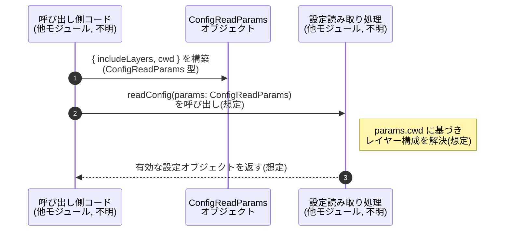

# app-server-protocol/schema/typescript/v2/ConfigReadParams.ts コード解説

## 0. ざっくり一言

`ConfigReadParams` は、設定（config）を読み取る処理に渡すための **パラメータオブジェクトの型定義**です（`ConfigReadParams.ts:L5-11`）。  

---

## 1. このモジュールの役割

### 1.1 概要

- このモジュールは、設定読み取り処理に対して
  - 設定レイヤーを含めるかどうかのフラグ
  - 設定レイヤーを解決するための作業ディレクトリ
- をまとめて渡すための **TypeScript 型 `ConfigReadParams`** を提供します（`ConfigReadParams.ts:L5-11`）。

### 1.2 アーキテクチャ内での位置づけ

- このファイル自身は **型エイリアスを 1 つ export するだけ**で、他モジュールの import はありません（`ConfigReadParams.ts:L5`）。
- ファイル先頭のコメントから、この型定義は Rust 側の型から `ts-rs` により自動生成されていることが分かります（`ConfigReadParams.ts:L1-3`）。
- 実際にどの関数・モジュールから利用されているかは、このチャンクからは分かりません。

想定される位置づけ（利用側は推測であり、このチャンクには現れません）を簡易図で示します。

```mermaid
graph TD
  R["Rust 側の型定義\n(生成元, ファイル不明)"]
  G["ts-rs によるコード生成\n(ConfigReadParams.ts L1-3)"]
  T["ConfigReadParams 型\n(ConfigReadParams.ts L5-11)"]
  U["Config 読み取り処理の呼び出し側\n(他モジュール, 不明)"]

  R --> G --> T
  U -->|パラメータ型として利用(想定)| T
```

### 1.3 設計上のポイント

- 自動生成コード  
  - 冒頭コメントに「GENERATED CODE」「Do not edit manually」とあり（`ConfigReadParams.ts:L1-3`）、**このファイルは手動で変更しない前提**です。
- シンプルなデータコンテナ  
  - 関数やメソッドは定義されておらず、**データを保持するだけの型**になっています（`ConfigReadParams.ts:L5-11`）。
- 型安全性（TypeScript）  
  - `includeLayers: boolean` により、設定レイヤーを含めるかどうかが **必須の真偽値**として表現されます（`ConfigReadParams.ts:L5`）。
  - `cwd?: string | null` により、作業ディレクトリは
    - プロパティ自体が存在しない（未指定）
    - `null`
    - 有効な文字列パス
    の 3 状態を区別できます（`ConfigReadParams.ts:L6-11`）。
- エラーハンドリング・並行性  
  - このファイルにはロジックや非同期処理は含まれず、**エラー処理や並行性に関する記述は一切ありません**。

---

## 2. 主要な機能一覧

このファイルは 1 つの型エイリアスを提供します。

- `ConfigReadParams`: 設定読み取り時の振る舞い（設定レイヤーの有無、作業ディレクトリ）を指定するためのパラメータ型（`ConfigReadParams.ts:L5-11`）。

---

## 3. 公開 API と詳細解説

### 3.1 型一覧（構造体・列挙体など）

| 名前               | 種別         | 役割 / 用途                                                                                                    | 定義箇所                           |
|--------------------|--------------|-----------------------------------------------------------------------------------------------------------------|------------------------------------|
| `ConfigReadParams` | 型エイリアス | 設定読み取り処理に渡すパラメータ。`includeLayers` と任意の `cwd` をまとめて表現するオブジェクト型です。 | `ConfigReadParams.ts:L5-11` |

#### `ConfigReadParams` のフィールド詳細

| フィールド名     | 型                | 必須/任意 | 説明 |
|------------------|-------------------|-----------|------|
| `includeLayers`  | `boolean`         | 必須      | 設定レイヤー（project/repo の階層的な設定）を含めるかどうかを表すフラグと解釈できます（名前からの推測であり挙動はコードからは不明。`ConfigReadParams.ts:L5`）。 |
| `cwd`            | `string \| null`（プロパティ自体はオプション） | 任意      | コメントにより、プロジェクトの設定レイヤーを解決するための「作業ディレクトリ」を表すと説明されています（`ConfigReadParams.ts:L6-9`）。未指定の場合の挙動はこのチャンクからは分かりません。 |

`cwd` のドキュメントコメント（抜粋）:

> Optional working directory to resolve project config layers. If specified, return the effective config as seen from that directory (i.e., including any project layers between `cwd` and the project/repo root).  
> （`ConfigReadParams.ts:L6-9`）

このコメントから、`cwd` を指定すると

- `cwd` からプロジェクト／リポジトリルートまでの間に存在する「プロジェクトレイヤー」を含めた「有効な設定（effective config）」が返される

という仕様が想定されていることが分かります（ただし実際の処理は他ファイルで行われ、このチャンクには現れません）。

### 3.2 関数詳細（最大 7 件）

このファイルには **関数・メソッドは定義されていません**（`ConfigReadParams.ts:L1-11`）。  
そのため、このセクションで詳述すべき公開関数 API はありません。

### 3.3 その他の関数

同様に、このファイルには補助的な関数も存在しません。

| 関数名 | 役割（1 行） |
|--------|--------------|
| なし   | このチャンクには関数定義は存在しません。 |

---

## 4. データフロー

### 4.1 ファイル内のデータフロー

- このファイル内では **データの生成・変換・受け渡しのロジックは存在せず**、実行時処理のフローはありません（`ConfigReadParams.ts:L5-11`）。
- `ConfigReadParams` は **他モジュールによって生成・利用されるための型情報のみ**を提供します。

### 4.2 想定される利用シナリオ（推測）

ここからは、型名とコメントから推測した **典型的な利用イメージ**です。  
実際の呼び出し元・呼び出し先コードはこのチャンクには存在しないため、あくまで推測であることに注意してください。



- 上記の `readConfig` 関数と `S` は、このチャンクには登場しません。  
  ここでは **`ConfigReadParams` が設定読み取り API の入力パラメータとして使われる**という典型的なパターンを示したものです。

---

## 5. 使い方（How to Use）

### 5.1 基本的な使用方法

以下は、`ConfigReadParams` を用いて設定読み取り関数を呼び出す **仮想的な例**です。  
`readConfig` 関数はこのファイルには存在しませんが、利用イメージを示すために定義しています。

```typescript
// ConfigReadParams 型をインポートする例                               
import type { ConfigReadParams } from "./ConfigReadParams";   // 実際のパスはプロジェクト構成に依存

// 仮の設定読み取り関数（このファイルには存在しない）                 
async function readConfig(params: ConfigReadParams) {          // ConfigReadParams を引数として受け取る
    // 実装は他モジュール側の責務（このチャンクには存在しない）       
}

// 基本的な使い方の例                                                  
async function main() {
    // 設定レイヤーを含め、カレントディレクトリを基準に解決する例    
    const params: ConfigReadParams = {                         // ConfigReadParams 型のオブジェクトを作成
        includeLayers: true,                                   // 必須: boolean 型
        cwd: process.cwd(),                                    // 任意: string | null （ここでは string を指定）
    };

    await readConfig(params);                                  // 仮の API を呼び出す
}
```

TypeScript の型システム的には、

- `includeLayers` が **必須プロパティかつ boolean** なので、`"true"` などの文字列はコンパイル時エラーになります。
- `cwd` はオプショナル（`?`）かつ `string | null` であり、
  - プロパティ自体を省略
  - `cwd: null`
  - `cwd: "some/path"`
  のいずれも許容されます。

### 5.2 よくある使用パターン（想定）

1. **`cwd` を指定しない（デフォルトの基準を利用）**

```typescript
const params: ConfigReadParams = {
    includeLayers: true,                                       // レイヤーを含める
    // cwd は省略（undefined 相当）
};
```

1. **`cwd` を明示的に `null` にする**

```typescript
const params: ConfigReadParams = {
    includeLayers: true,
    cwd: null,                                                 // 「作業ディレクトリなし」を明示したい場合のパターン
};
```

1. **レイヤーを無効化（と解釈できる）**

```typescript
const params: ConfigReadParams = {
    includeLayers: false,                                      // レイヤーを無視する挙動を期待するケース（挙動は他モジュール依存）
    cwd: process.cwd(),
};
```

`includeLayers` が false のときの実際の挙動（レイヤーを完全に無視するのか、一部だけ使うのか等）は、このチャンクからは分かりません。

### 5.3 よくある間違い（起こりうる誤用例）

型定義から想定できる、コンパイル時に検出される典型的な誤りを挙げます。

```typescript
// 間違い例 1: includeLayers に文字列を渡してしまう
const badParams1: ConfigReadParams = {
    // includeLayers: "true",  // エラー: string 型を boolean 型に代入できない
    includeLayers: true,      // 正: boolean を指定
};

// 間違い例 2: includeLayers を省略してしまう
// const badParams2: ConfigReadParams = {
//     cwd: "/some/path",     // エラー: includeLayers が必須プロパティ
// };

// 正しい例
const goodParams: ConfigReadParams = {
    includeLayers: true,      // 必須を満たす
    cwd: "/some/path",        // 任意
};
```

また、`cwd?: string | null` のため、「オプショナル」と「null 許容」が混在している点に注意が必要です。

```typescript
// これは型的にOK
const params1: ConfigReadParams = {
    includeLayers: true,
    // cwd は完全に省略
};

// これもOK
const params2: ConfigReadParams = {
    includeLayers: true,
    cwd: null,                 // 明示的に null
};
```

### 5.4 使用上の注意点（まとめ）

- **このファイルを直接編集しない**  
  - `// GENERATED CODE! DO NOT MODIFY BY HAND!` と明記されており（`ConfigReadParams.ts:L1-3`）、変更は生成元（Rust 側＋ts-rs 設定）で行う必要があります。
- **`includeLayers` は必須**  
  - 常に boolean を指定する必要があります。`ConfigReadParams` 型を使う関数側の契約としても、「この値が必ず存在する」前提で処理されることが期待されます。
- **`cwd` の意味合い**  
  - コメントに書かれた仕様（`ConfigReadParams.ts:L6-9`）から、`cwd` はプロジェクトレイヤー解決の基準ディレクトリであると分かります。  
    ただし、未指定や `null` のときの具体的な扱いは、このチャンクからは判断できません。
- **非同期・並行性**  
  - この型自体には並行性に関する制約はなく、単なるデータオブジェクトです。  
    並行実行中に同じ `ConfigReadParams` オブジェクトを共有するかどうかは、利用側の設計に依存します。

---

## 6. 変更の仕方（How to Modify）

### 6.1 新しい機能を追加する場合

- ファイル先頭のコメントにより、このファイルは **自動生成物であり、直接編集すべきではない** とされています（`ConfigReadParams.ts:L1-3`）。
- したがって、例えば新しいパラメータ（例: `environment: string`）を追加したい場合は、
  - **生成元の Rust 側の型定義**（`ts-rs` によって TypeScript が生成される元）を変更し、
  - その後 `ts-rs` を再実行してこのファイルを再生成する  
  という手順が必要になります。
- このチャンクには、生成元 Rust ファイルのパスや名前は記載されていないため、具体的な編集箇所は不明です。

### 6.2 既存の機能を変更する場合

例: `cwd` を `string` のみ（`null` 非許容）にしたい場合など。

- やはりこのファイル内を直接書き換えるのではなく、生成元の Rust 側の型定義を修正し、再生成する必要があります（`ConfigReadParams.ts:L1-3`）。
- 変更時の注意点（推測を含む）:
  - この型を引数や戻り値に使っているすべての関数・API に影響しますが、利用箇所はこのチャンクからは特定できません。
  - `cwd` の null 許容性を変える場合、呼び出し側で `null` を渡しているコードがコンパイルエラーになる可能性があります。

---

## 7. 関連ファイル

このチャンクから直接分かる関連情報は限定的です。

| パス / 要素       | 役割 / 関係 |
|------------------|------------|
| Rust 側の型定義（ファイル名不明） | コメントに記載の `ts-rs` により、このファイルの生成元になっていると考えられます（`ConfigReadParams.ts:L1-3`）。具体的なファイル名・パスはこのチャンクには現れません。 |
| 他の TypeScript スキーマファイル（例: 同ディレクトリ配下） | `schema/typescript/v2` ディレクトリ構成から、同様に Rust から生成された他の型定義が存在すると推測できますが、このチャンクには列挙されていません。 |
| 設定読み取り処理の実装ファイル | `ConfigReadParams` を実際に引数として受け取る関数・メソッドが定義されていると考えられますが、このチャンクからは特定できません。 |

---

### Bugs / Security / Contracts / Edge Cases まとめ

- **Bugs（バグ）**
  - このファイルは型定義のみで実行ロジックがなく、明白なロジックバグは存在しません。
- **Security（セキュリティ）**
  - `cwd` はディレクトリパスを表すとコメントされていますが（`ConfigReadParams.ts:L6-9`）、ここでは単なる文字列であり、  
    パス検証やサニタイズは別モジュールで行う必要があります。  
    このファイルからは、そうした対策の有無は分かりません。
- **Contracts（契約）**
  - `includeLayers` は必須であり、常に boolean が渡される契約になっています（`ConfigReadParams.ts:L5`）。
  - `cwd` は「オプション＋null 許容」の契約であり、「未指定」と「明示的に null」を区別できます（`ConfigReadParams.ts:L6-11`）。
- **Edge Cases（エッジケース）**
  - `cwd` が未指定の場合 → 振る舞いはこのチャンクからは不明。
  - `cwd` が空文字列 `""` の場合 → 型的には許容されますが、意味が妥当かどうかは利用側実装に依存します（このチャンクには記述なし）。
  - `includeLayers` が `false` の場合 → どのレイヤーが無効化されるか等、具体挙動は不明です。

以上が、このチャンク（`ConfigReadParams.ts:L1-11`）から読み取れる範囲の、公開 API とデータフロー、安全性・契約・エッジケースに関する解説です。
