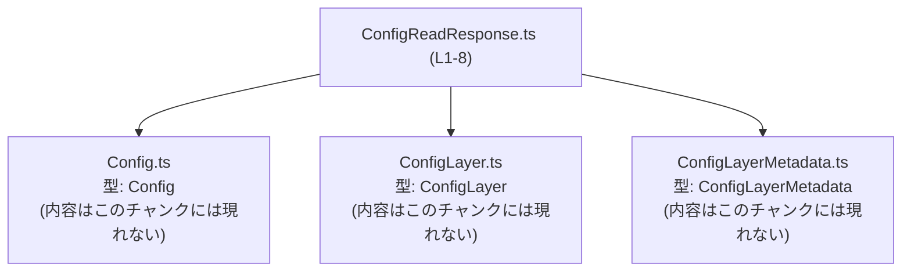
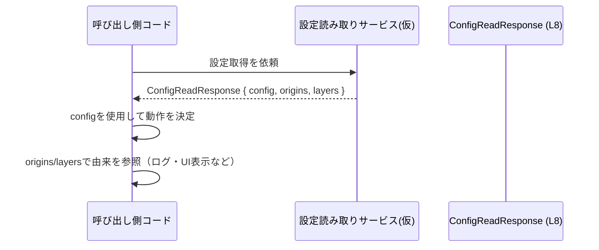

# app-server-protocol/schema/typescript/v2/ConfigReadResponse.ts コード解説

## 0. ざっくり一言

- 設定読み取り結果を表す **レスポンスオブジェクトの型 (`ConfigReadResponse`) を 1 つだけ定義した、自動生成の TypeScript 型定義ファイル**です。`config` 本体と、その構成要素の由来 (`origins`, `layers`) をまとめて表現します。  
  根拠: 自動生成コメント・型定義 `ConfigReadResponse.ts:L1-3, L8-8`

---

## 1. このモジュールの役割

### 1.1 概要

- このモジュールは、設定読み取り処理の結果を表現するための **型コンテナ**として機能します（名前からの推測であり、コードからは呼び出し元は分かりません）。  
- 実装ロジックや関数は持たず、**`Config`, `ConfigLayer`, `ConfigLayerMetadata` を組み合わせた 1 つの型エイリアス `ConfigReadResponse`** を公開します。  
  根拠: 型定義・インポート `ConfigReadResponse.ts:L4-6, L8-8`  
- ファイル先頭のコメントから、この型は **Rust 側の定義を ts-rs で自動生成したもの**であり、手動編集は想定されていません。  
  根拠: 自動生成コメント `ConfigReadResponse.ts:L1-3`

### 1.2 アーキテクチャ内での位置づけ

- 依存関係として、このモジュールは 3 つの型定義ファイルに依存しています。  
  根拠: `import type` 文 `ConfigReadResponse.ts:L4-6`



- 上図は、このファイルが **3 つの外部型定義に依存しているだけの「薄い集約モジュール」**であることを示します。
- これ以外にどこから参照されるか（例: クライアントコード / サーバコード）は、このチャンクからは分かりません。

### 1.3 設計上のポイント

- **自動生成コード**  
  - 冒頭コメントに「GENERATED CODE」「Do not edit manually」と明記されています。  
    根拠: `ConfigReadResponse.ts:L1-3`
- **型専用インポート (`import type`) の利用**  
  - `Config`, `ConfigLayer`, `ConfigLayerMetadata` はすべて `import type` で取り込まれており、**ビルド後に実行時 import を発生させない純粋な型依存**になっています。  
    根拠: `ConfigReadResponse.ts:L4-6`
- **単一の公開 API**  
  - `export type ConfigReadResponse = {...}` の 1 定義のみを公開しています。  
    根拠: `ConfigReadResponse.ts:L8-8`
- **辞書型 (`origins`) と配列/nullable (`layers`) の組合せ**  
  - `origins` は文字列キーから `ConfigLayerMetadata` へのマップ、`layers` は `ConfigLayer` 配列または `null` という **複合的なデータ構造**になっています。  
    根拠: `ConfigReadResponse.ts:L8-8`
- **ロジック・エラーハンドリング・並行処理は一切持たない**  
  - 関数やクラスは定義されておらず、実行時の挙動はこのファイルからは発生しません。  
    根拠: 関数・クラス定義が存在しない `ConfigReadResponse.ts:L1-8`

---

## 2. 主要な機能一覧

このファイルは「機能」という意味では型定義のみを提供します。

- `ConfigReadResponse` 型:  
  設定 (`Config`) と、その各要素の由来情報 (`origins`, `layers`) をひとまとめにしたレスポンスオブジェクトの型定義。  
  根拠: `ConfigReadResponse.ts:L8-8`

---

## 3. 公開 API と詳細解説

### 3.1 型一覧（構造体・列挙体など）

#### モジュール内の主要型一覧

| 名前                | 種別        | 役割 / 用途                                                                 | 根拠                          |
|---------------------|-------------|----------------------------------------------------------------------------|-------------------------------|
| `ConfigReadResponse` | 型エイリアス | 設定読み取りレスポンス全体を表すオブジェクト型。`config`, `origins`, `layers` を保持 | `ConfigReadResponse.ts:L8-8` |

#### `ConfigReadResponse` のフィールド構造

`ConfigReadResponse` は次の 3 フィールドを持つオブジェクト型です。  
根拠: オブジェクトリテラル型の中身 `ConfigReadResponse.ts:L8-8`

```ts
export type ConfigReadResponse = {
    config: Config,
    origins: { [key in string]?: ConfigLayerMetadata },
    layers: Array<ConfigLayer> | null,
};
```

| フィールド名 | 型                                               | 必須/任意 | 説明                                                                                                  | 根拠                          |
|--------------|--------------------------------------------------|-----------|-------------------------------------------------------------------------------------------------------|-------------------------------|
| `config`     | `Config`                                        | 必須      | 実際に解決された設定全体を表すと考えられる値。詳細構造は `Config` 型側に依存（このチャンクには現れない）。 | `ConfigReadResponse.ts:L4, L8-8` |
| `origins`    | `{ [key in string]?: ConfigLayerMetadata }`     | 必須      | 文字列キーごとに `ConfigLayerMetadata` を紐付ける辞書オブジェクト。各キーの値は任意（`undefined` になりうる）。 | `ConfigReadResponse.ts:L6, L8-8` |
| `layers`     | `Array<ConfigLayer> \| null`                    | 必須      | 設定を構成するレイヤーの配列、または `null`。配列要素の内容は `ConfigLayer` 型側に依存（このチャンクには現れない）。 | `ConfigReadResponse.ts:L5, L8-8` |

TypeScript 的なポイント:

- `origins: { [key in string]?: ConfigLayerMetadata }`  
  - すべての文字列キーに対して、**そのキーのプロパティを持ってもよい**ことを表すマップ型です。  
  - `?` が付いているため、`origins["someKey"]` の結果は `ConfigLayerMetadata | undefined` になり得ます。
- `layers: Array<ConfigLayer> | null`  
  - フィールド自体は必ず存在しますが、その値は配列か `null` のどちらかです。  
  - `undefined` にはならない点が `origins` の各要素との違いです。

### 3.2 関数詳細（最大 7 件）

- **このファイルには関数・メソッド・クラスコンストラクタなどの実行可能なロジックは定義されていません。**  
  根拠: `export type` のみで、`function` / `class` / `=>` などが存在しない `ConfigReadResponse.ts:L1-8`

そのため、関数詳細テンプレートを適用できる対象はありません。

### 3.3 その他の関数

- 該当なし（補助関数やユーティリティ関数も定義されていません）。  
  根拠: 関数定義の欠如 `ConfigReadResponse.ts:L1-8`

---

## 4. データフロー

このファイルは型定義のみですが、`ConfigReadResponse` がどのような形でデータフローに現れるかの **想定的なシナリオ**を示します（関数名などは例であり、このチャンク内には存在しません）。

### 想定されるデータの流れ

1. どこかのサービスや API クライアントが設定を読み取り、その結果として `ConfigReadResponse` 型のオブジェクトを構築する。
2. 呼び出し元は `config` を使って実際の設定値を利用しつつ、`origins` と `layers` から「どの設定値がどのレイヤー・どのソース由来か」を参照する。



- 上図の `ConfigReadResponse (L8)` ノードは、このファイルで定義されているオブジェクト型を指します。  
  根拠: `ConfigReadResponse.ts:L8-8`
- 実際にどの関数がこれを返すか・どこから呼ばれるかは、このチャンクには現れません。

---

## 5. 使い方（How to Use）

### 5.1 基本的な使用方法

`ConfigReadResponse` は、主に「型注釈」として利用されることが想定されます。

```ts
// ConfigReadResponse 型をインポートする（型のみなので import type を使うのが望ましい）
import type { ConfigReadResponse } from "./ConfigReadResponse";   // ファイル名は相対パス例

// 例: 設定の読み取り結果を受け取ってログ出力する関数
function logConfigResponse(response: ConfigReadResponse) {        // response の型を明示
    // config の中身をそのままログ出力（構造は Config 型に依存）
    console.log("Config:", response.config);

    // origins を使って各キーのメタデータを参照
    for (const key in response.origins) {
        const metadata = response.origins[key];    // 型: ConfigLayerMetadata | undefined
        if (metadata) {
            console.log(`Key ${key} has metadata`, metadata);
        }
    }

    // layers が null の場合に備えてチェックする
    if (response.layers !== null) {
        console.log("Layers count:", response.layers.length);
    } else {
        console.log("No layers information");
    }
}
```

- `response.config` は常に存在し、型は `Config` です。  
- `response.origins[key]` は **存在しない可能性 (`undefined`) がある**ため、使用前に真偽値チェックを行っています。  
- `response.layers` は `null` か配列なので、直接 `response.layers.length` を呼ぶ前に `null` チェックが必要です。

```ts
// 例: ConfigReadResponse 型に合致するオブジェクトを構築する
import type { ConfigReadResponse } from "./ConfigReadResponse";
import type { Config } from "./Config";
import type { ConfigLayer } from "./ConfigLayer";
import type { ConfigLayerMetadata } from "./ConfigLayerMetadata";

const config: Config = {} as Config;                                 // 実際の構造はこのチャンクからは不明
const fileLayer: ConfigLayer = {} as ConfigLayer;
const envLayer: ConfigLayer = {} as ConfigLayer;
const fileMeta: ConfigLayerMetadata = {} as ConfigLayerMetadata;

const response: ConfigReadResponse = {
    config,
    origins: {
        // 例として "db.url" 設定がファイルレイヤー由来であるとする（意味は推測）
        "db.url": fileMeta,
    },
    layers: [fileLayer, envLayer],                                    // または null をセットしてもよい
};
```

- `Config` / `ConfigLayer` / `ConfigLayerMetadata` の具体的なフィールド構造は、**このチャンクには現れない**ため、例では `as` による型アサーションを使用しています。

### 5.2 よくある使用パターン

1. **レスポンスの受け取りと簡単な分解**

```ts
function handleConfig(resp: ConfigReadResponse) {
    const { config, origins, layers } = resp; // 分割代入で取り出す

    // 必須の config はそのまま使える
    useConfig(config);

    // origins は「補足情報」として任意に利用
    const dbOrigin = origins["db.url"];
    if (dbOrigin) {
        showOriginInfo(dbOrigin);
    }

    // layers が null なら「レイヤー情報なし」とみなす
    const effectiveLayers = layers ?? [];  // null のときは空配列として扱う
    renderLayers(effectiveLayers);
}
```

1. **`origins` を辞書として扱う**

```ts
function getMetadata(
    resp: ConfigReadResponse,
    key: string,
): ConfigLayerMetadata | undefined {
    return resp.origins[key];   // 存在しないキーなら undefined が返る
}
```

1. **`layers` の存在チェックを伴う処理**

```ts
function hasLayerInfo(resp: ConfigReadResponse): boolean {
    return resp.layers !== null && resp.layers.length > 0;
}
```

### 5.3 よくある間違い

```ts
// ❌ 間違い例: origins の要素が必ず存在すると仮定している
function badUseOrigins(resp: ConfigReadResponse) {
    const meta = resp.origins["db.url"];
    console.log(meta.source); // meta が undefined の場合、実行時エラーになる
}

// ✅ 正しい例: undefined チェックを挟む
function safeUseOrigins(resp: ConfigReadResponse) {
    const meta = resp.origins["db.url"];
    if (!meta) {
        console.log("No metadata for db.url");
        return;
    }
    console.log(meta); // ここでは meta は ConfigLayerMetadata 型に絞り込まれている
}
```

```ts
// ❌ 間違い例: layers が null の可能性を無視
function badUseLayers(resp: ConfigReadResponse) {
    console.log(resp.layers.length);  // resp.layers が null の場合に実行時エラー
}

// ✅ 正しい例: null チェックを行う
function safeUseLayers(resp: ConfigReadResponse) {
    if (resp.layers === null) {
        console.log("Layers not available");
        return;
    }
    console.log(resp.layers.length);
}
```

### 5.4 使用上の注意点（まとめ）

- **`origins` の各プロパティは任意**  
  - `origins[key]` は `undefined` になり得るため、使用前に必ず存在チェックを行う必要があります。
- **`layers` は `null` になり得る**  
  - `Array<ConfigLayer> | null` であり、配列前提の処理（`length`, `map` など）を行う前に `null` チェックが必須です。
- **このファイルは自動生成のため直接編集しない**  
  - 変更が必要な場合は、ts-rs が参照する Rust 側の元定義を変更して再生成する必要があります（元定義の場所はこのチャンクからは分かりません）。  
    根拠: `ConfigReadResponse.ts:L1-3`
- **型定義のみであり、ランタイムのエラー処理・スレッド安全性はこのファイルからは規定されない**  
  - 実際のバリデーションやエラー処理は、この型を利用する関数・モジュール側で実装する必要があります（このチャンクには現れない）。

---

## 6. 変更の仕方（How to Modify）

### 6.1 新しい機能を追加する場合

このファイル自体は「GENERATED CODE」であり、手動編集しない前提です。  
根拠: `ConfigReadResponse.ts:L1-3`

一般的な流れ（推測を含みますが、自動生成コメントに基づく方針です）:

1. **Rust 側の元定義を探す**  
   - ts-rs は通常、Rust の構造体や型から TypeScript 型を生成します。`ConfigReadResponse` など同名の Rust 型が存在する可能性がありますが、このチャンクには現れません。
2. **Rust 側のフィールドや型を変更・追加する**  
   - 例: 新しいメタデータフィールドを追加したい場合は、Rust の構造体にそのフィールドを追加します。
3. **ts-rs のコード生成を再実行する**  
   - ビルドスクリプトや専用コマンドで TypeScript ファイルを再生成します。
4. **生成された `ConfigReadResponse.ts` の差分を確認する**  
   - 期待どおりにフィールドが反映されていることを確認します。

### 6.2 既存の機能を変更する場合

`ConfigReadResponse` 型の変更は、広い影響範囲を持つ可能性があります。

- **影響範囲の確認ポイント**
  - `ConfigReadResponse` をインポートしている TypeScript ファイル（このチャンクからは特定できません）。
  - Rust 側の元型と、そこから生成される他の型定義（存在する場合）。
- **契約（前提条件）の確認**
  - `config` は常に存在する、`origins` はオブジェクト、`layers` は配列または `null` という **型レベルの契約**が変わる場合、利用側の null チェックや undefined チェックが破壊されないか確認が必要です。
- **テスト**
  - このファイルにはテストコードは含まれていません（テストの有無は他ファイルを見ないと分かりません）が、型変更に伴い、利用側の単体テスト・統合テストの見直しが必要になります。

---

## 7. 関連ファイル

このモジュールから参照されている型定義ファイルは次のとおりです。

| パス（推定）                                      | 役割 / 関係                                                                                 | 根拠                               |
|--------------------------------------------------|--------------------------------------------------------------------------------------------|------------------------------------|
| `app-server-protocol/schema/typescript/v2/Config.ts`              | `ConfigReadResponse.config` フィールドの型 `Config` を定義するファイル（内容はこのチャンクには現れない） | `ConfigReadResponse.ts:L4, L8-8`   |
| `app-server-protocol/schema/typescript/v2/ConfigLayer.ts`         | `ConfigReadResponse.layers` の要素型 `ConfigLayer` を定義するファイル（内容はこのチャンクには現れない） | `ConfigReadResponse.ts:L5, L8-8`   |
| `app-server-protocol/schema/typescript/v2/ConfigLayerMetadata.ts` | `ConfigReadResponse.origins` の値型 `ConfigLayerMetadata` を定義するファイル（内容はこのチャンクには現れない） | `ConfigReadResponse.ts:L6, L8-8`   |

- これらのファイルの中身や、さらにその先の依存関係は **このチャンクには現れない**ため、不明です。

---

### Bugs / Security / 性能などについて（このファイルに限定した補足）

- **Bugs**  
  - このファイルは型定義のみであり、実行時ロジックがないため、直接的なバグの原因となるコードは含まれていません。
  - ただし、`null` や `undefined` の可能性を利用側が適切に扱わないと実行時エラーの原因になります（例は 5.3 参照）。
- **Security**  
  - セキュリティ関連の処理や検証ロジックは一切含まれていません。  
  - この型を通じて渡されるデータが信頼できるかどうかは、この型を生成・利用する他モジュール側の責務です（このチャンクには現れません）。
- **Performance / Scalability**  
  - 型定義自体は実行時にオーバーヘッドを持ちません。  
  - 実際のパフォーマンスは、`config` の大きさや `origins` / `layers` の要素数、およびこれらを扱うロジックに依存します。
- **並行性（Concurrency）**  
  - この型は単なるデータコンテナであり、独自の状態管理やミューテーションメソッドを持たないため、特別な並行アクセス制御は定義されていません。  
  - ただし、同じ `ConfigReadResponse` オブジェクトを複数箇所で共有してミューテートする場合の挙動は、通常の JavaScript オブジェクトと同様に利用側の責務となります。

以上が、このチャンクに基づいて客観的に説明できる `ConfigReadResponse.ts` の構造と利用ガイドです。
