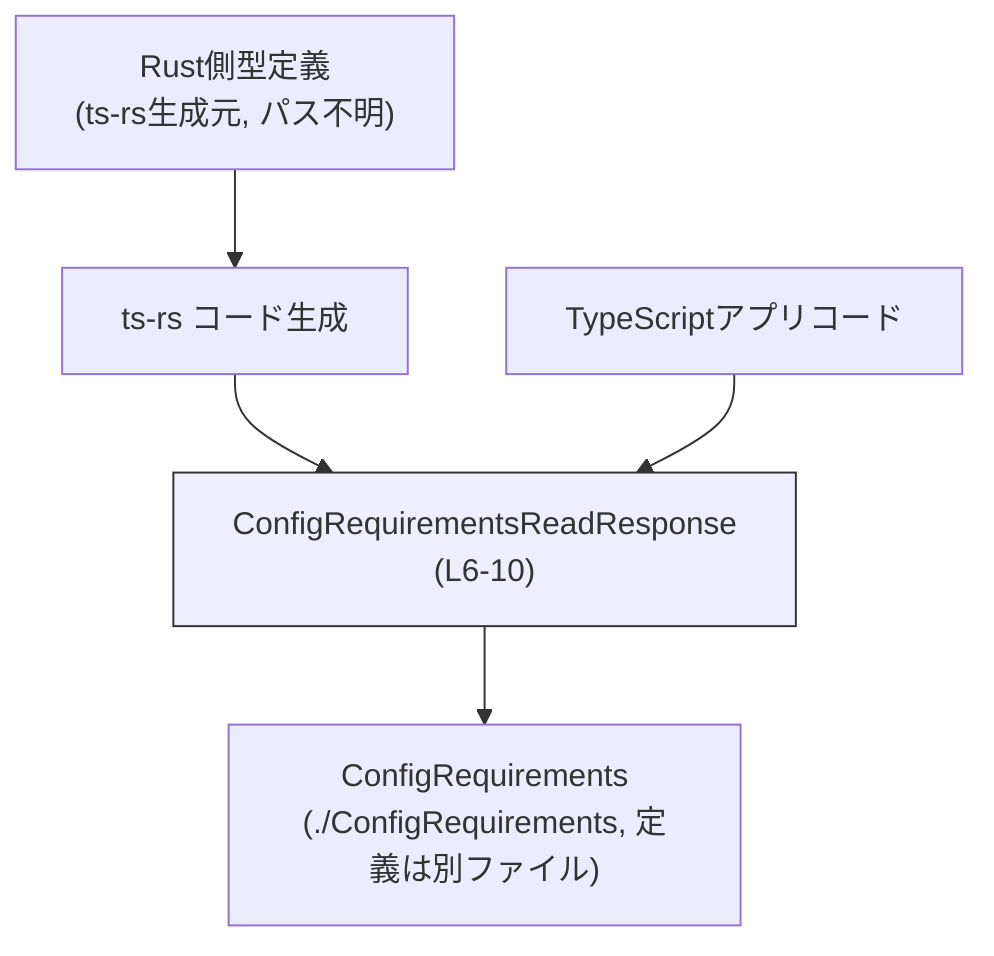
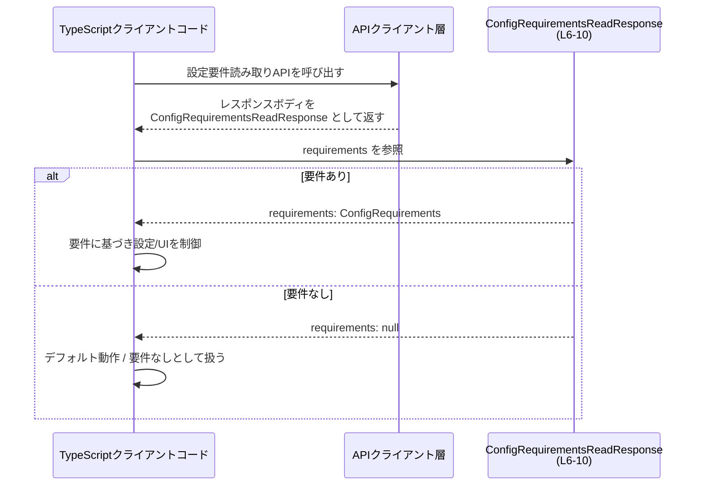

# app-server-protocol\schema\typescript\v2\ConfigRequirementsReadResponse.ts

## 0. ざっくり一言

- 設定要件（`ConfigRequirements`）を読み取る処理の「レスポンスオブジェクト」の形を定義する、TypeScript の自動生成型定義ファイルです（ConfigRequirementsReadResponse.ts:L6-10）。

---

## 1. このモジュールの役割

### 1.1 概要

- このモジュールは、サーバー側で定義された「設定要件読み取りレスポンス」を TypeScript から型安全に扱うための型 `ConfigRequirementsReadResponse` を提供します（L6）。
- レスポンスには `requirements` プロパティが含まれ、設定要件が存在する場合は `ConfigRequirements` 型、存在しない場合は `null` になります（L7-9, L10）。

### 1.2 アーキテクチャ内での位置づけ

- 冒頭のコメントから、このファイルは Rust 側の型定義から `ts-rs` により自動生成されていることが分かります（L1, L3）。
- TypeScript 側のアプリケーションコードは、このファイルで定義される `ConfigRequirementsReadResponse` 型を通じて、設定要件読み取り API のレスポンスを扱うと考えられます（名前とディレクトリ構成からの解釈です）。

依存関係のイメージを Mermaid 図で示します。



- `ConfigRequirements` 自体の定義は別ファイル `./ConfigRequirements` にあり、このチャンクには現れません（L4）。

### 1.3 設計上のポイント

- **自動生成であること**  
  - 冒頭に「GENERATED CODE! DO NOT MODIFY BY HAND!」とあるため、この型定義は手動で編集せず、生成元（Rust 側）を変更する前提になっています（L1, L3）。
- **純粋な型定義のみ**  
  - 関数やロジックは一切含まず、単一のエクスポート型エイリアス `ConfigRequirementsReadResponse` を提供するだけです（L6-10）。
- **null による「非存在」の表現**  
  - 設定要件が存在しない場合に `requirements` が `null` になる、という明示的な契約がコメントで示されています（L7-9）。
- **外部型への依存**  
  - 実際の要件の中身は `ConfigRequirements` 型に委譲されており、このファイルではその構造を知る必要がありません（L4, L10）。

---

## 2. 主要な機能一覧

このファイルは「機能」というより「型定義」を 1 つだけ提供します。

- `ConfigRequirementsReadResponse`: 設定要件読み取りレスポンスの形を表すオブジェクト型。`requirements` プロパティに `ConfigRequirements` もしくは `null` を保持します（L6-10）。

---

## 3. 公開 API と詳細解説

### 3.1 型一覧（構造体・列挙体など）

| 名前 | 種別 | 役割 / 用途 | 定義箇所 |
|------|------|-------------|----------|
| `ConfigRequirementsReadResponse` | 型エイリアス（オブジェクト型） | 設定要件読み取り処理のレスポンスオブジェクト型。`requirements` プロパティに要件本体または `null` を格納する。 | ConfigRequirementsReadResponse.ts:L6-10 |
| `ConfigRequirements` | 型（外部定義） | 個々の「設定要件」の構造を表す型。`requirements` プロパティの中身の型として利用される。定義は別ファイル `./ConfigRequirements` にあり、このチャンクには現れない。 | ConfigRequirementsReadResponse.ts:L4（インポートのみ） |

#### `ConfigRequirementsReadResponse` の構造

```ts
export type ConfigRequirementsReadResponse = {
    /**
     * Null if no requirements are configured (e.g. no requirements.toml/MDM entries).
     */
    requirements: ConfigRequirements | null,
};
```

- `export type ...`  
  - このモジュールから公開される型エイリアスです（L6）。
- `requirements: ConfigRequirements | null`  
  - プロパティ名: `requirements`（必須プロパティ、オプショナルではない）（L10）。  
  - 型: `ConfigRequirements` と `null` のユニオン型。要件が存在しない場合は `null` になるとコメントで説明されています（L7-9）。

### 3.2 関数詳細（最大 7 件）

- このファイルには関数・メソッドは定義されていません（ConfigRequirementsReadResponse.ts 全体）。

### 3.3 その他の関数

- 該当なし（補助関数・ラッパー関数はいずれも存在しません）。

---

## 4. データフロー

このファイル自体には処理ロジックはありませんが、型名・コメント・配置ディレクトリ（`app-server-protocol/schema/typescript/v2`）から、設定要件を読み取る API のレスポンス型として使われる状況が想定されます。

### 想定される典型シナリオ

1. クライアントコードが設定要件読み取り API を呼び出す。
2. 通信層で JSON などのレスポンスペイロードが解析され、`ConfigRequirementsReadResponse` 型として扱われる。
3. アプリケーションコードが `requirements` プロパティを確認し、`null` であれば「要件なし」として扱う。`null` でなければ `ConfigRequirements` の中身に基づき処理を行う。

これを Mermaid の sequence diagram で表現します（`ConfigRequirementsReadResponse` の型定義自体は L6-10 に存在します）。



※ 実際の HTTP エンドポイント名や API クライアントの実装はこのチャンクには現れないため、上記は型名とコメントからの推測に基づく一般的なシナリオです。

---

## 5. 使い方（How to Use）

### 5.1 基本的な使用方法

`ConfigRequirementsReadResponse` は、API から受け取ったオブジェクトの型注釈として利用する想定です。  
`requirements` が `null` でない場合だけ `ConfigRequirements` として扱う必要があります。

```ts
// 型をインポートする（相対パスはこのファイルと同じディレクトリ想定）
import type { ConfigRequirementsReadResponse } from "./ConfigRequirementsReadResponse"; // このファイル自身
import type { ConfigRequirements } from "./ConfigRequirements";                          // 要件の中身の型

// 設定要件レスポンスを処理する関数の例
async function handleConfigRequirements(
    response: ConfigRequirementsReadResponse,  // レスポンスオブジェクトに型を付ける
): Promise<void> {
    // null チェックが必須
    if (response.requirements === null) {      // 要件が構成されていないケース
        // 例: 要件なしとしてデフォルトの挙動を確保する
        console.log("No config requirements are configured.");
        return;
    }

    // ここでは requirements は ConfigRequirements 型として扱える
    const requirements: ConfigRequirements = response.requirements;
    console.log("Requirements:", requirements);

    // requirements の構造・プロパティは ConfigRequirements 型の定義に従う
}
```

- TypeScript の型システム上、`response.requirements` の型は `ConfigRequirements | null` です。
- `if (response.requirements === null)` で分岐することで、`else` ブロック内では TypeScript が `ConfigRequirements` として型推論できます（ユニオン型のナローイング）。

### 5.2 よくある使用パターン

#### パターン1: null 時のデフォルト値へのフォールバック

`requirements` が `null` の場合に、アプリ側のデフォルト値に置き換えるパターンです。

```ts
function getEffectiveRequirements(
    response: ConfigRequirementsReadResponse,
    defaultRequirements: ConfigRequirements,                 // アプリ側のデフォルト
): ConfigRequirements {
    // Null 合体演算子 ?? を使うのは NG（型が合わない）ので、
    // 三項演算子などで null を明示的に扱う。
    return response.requirements !== null
        ? response.requirements
        : defaultRequirements;
}
```

- `requirements` は必須プロパティなので、`response.requirements ?? defaultRequirements` のように書くと、`null` のまま残る可能性があるため、`ConfigRequirements` 型を返すには明示的なチェックが必要です。

#### パターン2: Optional チェーンでの簡易アクセス

`requirements` が存在する場合だけその中身を読み取りたい場合:

```ts
// 例: requirements に description プロパティがあると仮定（実際の構造は別ファイル参照）
function getRequirementsDescription(resp: ConfigRequirementsReadResponse): string | null {
    // resp.requirements が null のときは全体として null になる
    return resp.requirements?.description ?? null;
}
```

> `description` などの具体的なプロパティ名は `ConfigRequirements` の定義から確認する必要があります。このチャンクにはその情報は含まれていません。

### 5.3 よくある間違い

#### 間違い例1: null を考慮せずにプロパティを直接参照する

```ts
// 間違い例: null を考慮していない
function useRequirementsBad(resp: ConfigRequirementsReadResponse) {
    // コンパイル時にはエラーになる（resp.requirements が null の可能性があるため）
    // const name = resp.requirements.name;
}
```

#### 正しい例: null チェックを行う

```ts
// 正しい例: null チェックを行う
function useRequirementsGood(resp: ConfigRequirementsReadResponse) {
    if (resp.requirements === null) {
        console.log("No requirements configured.");
        return;
    }

    // ここに来た時点で resp.requirements は ConfigRequirements 型
    // const name = resp.requirements.name; // ConfigRequirements の定義に合わせて使用する
}
```

#### 間違い例2: `requirements` を省略可能プロパティと誤解する

```ts
// 間違い例: requirements を付けたり付けなかったりする設計
const respBad: ConfigRequirementsReadResponse = {
    // requirements プロパティが無い → 型定義と矛盾（コンパイルエラー）
};
```

- 型定義では `requirements` は「必須プロパティ」ですが、その値の型が `ConfigRequirements | null` となっています（L10）。  
  「プロパティ自体が無い」のではなく「プロパティはあるが値が null」の2状態で表現します。

### 5.4 使用上の注意点（まとめ）

- **null チェックが必須**  
  - 設定要件が存在しない場合、`requirements` は `null` になります（L7-9）。使用前に必ず `null` を判定する必要があります。
- **プロパティは常に存在する前提**  
  - `requirements` はオプショナル（`?`）ではなく必須プロパティです（L10）。`undefined` を受け取っている場合は、実データと型定義が不整合な状態と言えます。
- **自動生成ファイルを直接編集しない**  
  - ファイル先頭のコメントにある通り、手動編集は想定されておらず（L1, L3）、変更が必要な場合は ts-rs の生成元（Rust 側）を修正する必要があります。
- **並行性・エラー処理**  
  - この型自体には非同期処理やエラー処理、状態管理は含まれていません。並行性やエラーハンドリングは、この型を利用する呼び出し側で実装されます。

---

## 6. 変更の仕方（How to Modify）

### 6.1 新しい機能を追加する場合

このファイルは ts-rs による自動生成ファイルであり、先頭に「DO NOT MODIFY BY HAND」と記載されています（L1）。そのため、**直接編集するのではなく生成元を変更する**必要があります。

一般的な手順（このチャンクから分かる範囲での指針）:

1. **Rust 側の型定義を探す**  
   - ts-rs の生成元となっている Rust の構造体または型（`ConfigRequirementsReadResponse` 相当）を見つけます。  
   - 具体的なパスやモジュール名はこのチャンクには現れません。
2. **Rust 側の型を変更・拡張する**  
   - 追加したいフィールドや仕様を Rust の型に反映します。
3. **ts-rs による再生成を行う**  
   - ビルドスクリプトや専用コマンドなどを用いて TypeScript 型の再生成を実行します。
4. **生成後の TypeScript ファイルを確認する**  
   - 本ファイルに変更が反映されていることを確認します。

### 6.2 既存の機能を変更する場合

- **`requirements` プロパティの契約変更**  
  - 例えば、「`null` ではなく空オブジェクトで表現したい」「プロパティ名を変えたい」といった変更も、同様に Rust 側の型定義を変更する必要があります。
- **影響範囲の確認**  
  - TypeScript 側で `ConfigRequirementsReadResponse` を参照している箇所（API クライアントや UI コンポーネントなど）を検索し、`requirements` の扱い（null チェックなど）が新しい仕様に適合するか確認することが必要です。
- **テスト**  
  - このチャンクにはテストコードに関する情報はありませんが、変更後は API レスポンスのシリアライズ／デシリアライズ、および `requirements` の扱いを確認するテストを追加／更新することが推奨されます。

---

## 7. 関連ファイル

このチャンクから分かる範囲で、本モジュールと関係が深いファイル・コンポーネントを整理します。

| パス / 名称 | 役割 / 関係 |
|------------|------------|
| `./ConfigRequirements` | `ConfigRequirementsReadResponse` の `requirements` プロパティの型を定義するモジュールです（L4）。具体的なフィールド構造はこのチャンクには現れません。通常は同ディレクトリ内の `ConfigRequirements.ts` 等が想定されますが、拡張子はこのチャンクでは不明です。 |
| Rust 側 ts-rs 生成元（パス不明） | 本ファイル冒頭のコメントから、Rust 側の型定義が ts-rs によってこの TypeScript 型に変換されていると読み取れます（L1, L3）。型の変更・拡張はそちらで行う必要があります。 |
| API クライアント / 通信層（ファイル不明） | `ConfigRequirementsReadResponse` 型を利用してサーバーレスポンスを表現するコンポーネントです。エンドポイントや HTTP クライアントの実装はこのチャンクには現れません。 |

---

### 付記: 安全性・バグ・スケーラビリティに関する補足

- **バグ/安全性**  
  - この型定義自体は副作用やロジックを持たず、型安全性に関する主なポイントは「`ConfigRequirements | null` のユニオン型に対して適切に null チェックを行うかどうか」です。  
  - 実際のデータが型定義と整合していない場合（`requirements` が欠落している、`undefined` が来るなど）は、ランタイムエラーや不正な挙動の原因になり得ます。
- **並行性**  
  - 型定義は純粋なコンパイル時のみの概念であり、並行性やスレッドセーフ性に直接の影響はありません。並行処理中にこの型の値を共有すること自体は、通常の TypeScript/JavaScript オブジェクトの扱いと同等です。
- **パフォーマンス/スケーラビリティ**  
  - このファイルは型情報のみを提供し、ランタイムコードを追加しません。したがって、パフォーマンスやスケーラビリティへの影響は実質的にありません。
