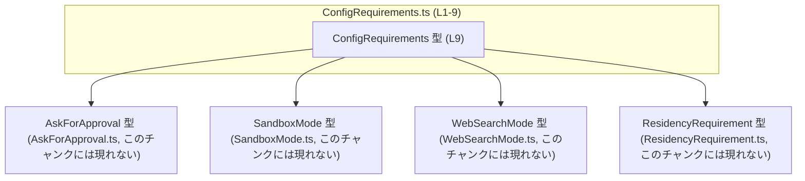
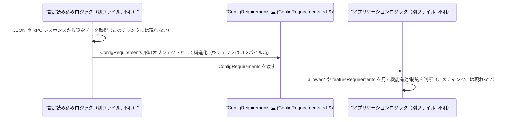

# app-server-protocol/schema/typescript/v2/ConfigRequirements.ts コード解説

## 0. ざっくり一言

`ConfigRequirements` 型は、「どの承認ポリシー・サンドボックスモード・Web検索モード・機能フラグ・居住要件を許可／要求するか」を表現する設定スキーマの TypeScript 型定義です（`ConfigRequirements.ts:L9-9`）。  
このファイルは `ts-rs` により自動生成されるため、手動で編集しない前提になっています（`ConfigRequirements.ts:L1-3`）。

---

## 1. このモジュールの役割

### 1.1 概要

- このモジュールは、アプリケーションサーバの設定やポリシーを表現するための **構造化された型情報** を提供します（`ConfigRequirements.ts:L9-9`）。
- 具体的には、承認が必要なポリシー、利用可能なサンドボックスモード・Web検索モード、機能ごとの要求条件、居住要件を 1 つのオブジェクトでまとめて扱うための型エイリアスです（`ConfigRequirements.ts:L9-9`）。
- 実行時ロジックは含まず、**コンパイル時の型チェック** 用のスキーマとして振る舞います。

### 1.2 アーキテクチャ内での位置づけ

このファイルは、他の設定関連型に依存する「集約的な設定要求型」として振る舞います。

依存関係（このチャンクに現れる範囲）:

- `WebSearchMode`（Web検索モードを表す型、`../WebSearchMode` からの import）（`ConfigRequirements.ts:L4-4`）
- `AskForApproval`（承認ポリシーを表す型、`./AskForApproval` からの import）（`ConfigRequirements.ts:L5-5`）
- `ResidencyRequirement`（居住要件を表す型、`./ResidencyRequirement` からの import）（`ConfigRequirements.ts:L6-6`）
- `SandboxMode`（サンドボックスモードを表す型、`./SandboxMode` からの import）（`ConfigRequirements.ts:L7-7`）

Mermaid による依存関係図（このファイル単体の範囲）:



### 1.3 設計上のポイント

コードから読み取れる設計上の特徴は次のとおりです。

- **完全に型定義のみ**  
  - 実行時の関数・クラスは存在せず、`export type` による型エイリアスのみが定義されています（`ConfigRequirements.ts:L9-9`）。
- **nullable なプロパティ設計**  
  - すべてのプロパティが `... | null` を許容しており、「要求無し／未指定」という状態を明示的に表現できる構造になっています（`ConfigRequirements.ts:L9-9`）。
- **配列＋列挙型の組み合わせ**  
  - 承認ポリシー・サンドボックスモード・Web検索モードはいずれも、専用の型の配列として表されます。許可された値のみを列挙する設計です（`ConfigRequirements.ts:L4-5,L7-7,L9-9`）。
- **文字列キーのマップによる機能要件表現**  
  - `featureRequirements` は任意の文字列キーから `boolean` への辞書型で表現されており、機能名など任意のキーに対する on/off を記述できるようになっています（`ConfigRequirements.ts:L9-9`）。
- **自動生成コードであることの明示**  
  - ファイル先頭コメントにより、`ts-rs` による自動生成であり手動編集しないことが明示されています（`ConfigRequirements.ts:L1-3`）。  
  - 実際の仕様変更は生成元（Rust 側など）で行う前提と考えられますが、生成元コードはこのチャンクには現れません。

---

## 2. 主要な機能一覧

このファイル自体に実行可能な「関数」はありませんが、`ConfigRequirements` 型が表現する主な情報は次のとおりです（`ConfigRequirements.ts:L9-9`）。

- 許可される承認ポリシー一覧の保持（`allowedApprovalPolicies`）
- 許可されるサンドボックスモード一覧の保持（`allowedSandboxModes`）
- 許可される Web 検索モード一覧の保持（`allowedWebSearchModes`）
- 機能ごとの要求フラグ（true/false）を文字列キーで管理する機能（`featureRequirements`）
- 居住要件（ResidencyRequirement）の保持（`enforceResidency`）

---

## 3. 公開 API と詳細解説

### 3.1 型一覧（構造体・列挙体など）

このチャンクに登場する主な型・コンポーネントの一覧です。

| 名前                | 種別        | 役割 / 用途                                                                 | 定義箇所                           |
|---------------------|-------------|-----------------------------------------------------------------------------|------------------------------------|
| `ConfigRequirements`| 型エイリアス | 設定上の各種「要求・制約（承認ポリシー、サンドボックス、Web検索、機能、居住）」をまとめた構造 | `ConfigRequirements.ts:L9-9`       |

※ 以下は import されているだけで、本チャンクでは中身は定義されていませんが、`ConfigRequirements` の一部として利用されます。

| 名前                  | 種別       | 役割 / 用途（推測レベルの簡単な説明）                         | 出現箇所                           |
|-----------------------|------------|---------------------------------------------------------------|------------------------------------|
| `WebSearchMode`       | 型（詳細不明） | Web 検索のモード（オン/オフ、制限付きなど）を表す型と推測されますが、コードからは詳細不明 | `ConfigRequirements.ts:L4-4`       |
| `AskForApproval`      | 型（詳細不明） | 承認が必要かどうか、または承認ポリシーを表す型と推測されますが、コードからは詳細不明 | `ConfigRequirements.ts:L5-5`       |
| `ResidencyRequirement`| 型（詳細不明） | ユーザーやデータの居住要件（地域制約など）を表す型と推測されますが、コードからは詳細不明 | `ConfigRequirements.ts:L6-6`       |
| `SandboxMode`         | 型（詳細不明） | サンドボックスの実行モード（制限有無など）を表す型と推測されますが、コードからは詳細不明 | `ConfigRequirements.ts:L7-7`       |

> これら 4 つの型の具体的な定義はこのチャンクには現れないため、詳細は元ファイルを参照する必要があります。

### 3.2 関数詳細

このファイルには関数定義・メソッド定義は存在しません（`ConfigRequirements.ts:L1-9`）。  
したがって、本セクションで説明すべき公開関数はありません。

### 3.3 その他の関数

- 該当なし（このチャンクには関数が一切定義されていません）。

---

## 4. データフロー

### 4.1 このファイルが直接表すデータフロー

`ConfigRequirements` は単なる型定義であり、**このファイル内にはデータを生成・変換・消費する処理フローは存在しません**（`ConfigRequirements.ts:L1-9`）。  
つまり、実行時の「呼び出し関係」や「処理の順序」はこのチャンクからは読み取れません。

### 4.2 想定される典型的な利用フロー（参考）

以下は、`ConfigRequirements` 型がアプリケーションで利用される典型的な流れの **イメージ図** です。  
このフロー自体はこのチャンクのコードから直接は読み取れないため、あくまで一般的な利用例としての参考情報です。



要点:

- このファイルは **「ConfigRequirements 型」という枠組み** を与えるだけで、どのタイミングでどのように作られ、どこで使われるかは他のモジュール側で決まります。
- TypeScript の型であるため、データフローの安全性は **コンパイル時の型チェック** に依存し、ランタイムでのバリデーションは別途実装が必要です。

---

## 5. 使い方（How to Use）

### 5.1 基本的な使用方法

`ConfigRequirements` 型の値を生成し、アプリケーションロジックに渡して使う典型例です。  
ここでは、型の形状と null 許容の扱いに注目します（`ConfigRequirements.ts:L9-9`）。

```typescript
import type { ConfigRequirements } from "./ConfigRequirements";      // このファイルから型を import する
import type { AskForApproval } from "./AskForApproval";              // 依存する型（定義は別ファイル）
import type { SandboxMode } from "./SandboxMode";
import type { WebSearchMode } from "../WebSearchMode";
import type { ResidencyRequirement } from "./ResidencyRequirement";

// ConfigRequirements 型のオブジェクトを作成する例
const configRequirements: ConfigRequirements = {
    // 承認ポリシーの制約: null なら「制約なし」などの意味づけが可能
    allowedApprovalPolicies: [] as AskForApproval[] | null,          // 空配列なら「何も許可しない」、null なら「未設定」といった区別ができる

    // サンドボックスモードの制約
    allowedSandboxModes: null as SandboxMode[] | null,               // ここではあえて null を指定

    // Web 検索モードの制約
    allowedWebSearchModes: [/* WebSearchMode の値を列挙 */] as WebSearchMode[],

    // 機能ごとの要求条件: キーは機能名など任意の文字列、値は boolean
    featureRequirements: {
        "betaFeatureA": true,                                        // この機能には何らかの要件がある（と定義）
        "betaFeatureB": false,                                       // 要件無し/無効 として扱うことが想定される
        // プロパティは ? 付きなので、存在しないキーも許容される
    },

    // 居住要件
    enforceResidency: null as ResidencyRequirement | null,           // 居住要件を課さないケース
};
```

ポイント:

- `ConfigRequirements` の各プロパティは `... | null` となっているため、**「値がある」状態と「null（未設定）」状態を区別** できます（`ConfigRequirements.ts:L9-9`）。
- `featureRequirements` は `{ [key in string]?: boolean } | null` なので、
  - オブジェクト自体が null の場合: 機能ごとの情報そのものが無い状態
  - オブジェクトが存在し、一部キーが欠けている場合: その機能について情報が無い／デフォルト扱い  
  など、実装側で複数の状態を区別できます（`ConfigRequirements.ts:L9-9`）。

### 5.2 よくある使用パターン

1. **「許可一覧」としての使用**

   - `allowedSandboxModes` や `allowedWebSearchModes` を、UI の選択肢表示や検証ロジックのフィルターとして利用するパターンが想定されます（型から読み取れる一般的な使い方）。

   ```typescript
   function isSandboxModeAllowed(
       config: ConfigRequirements,
       mode: SandboxMode,
   ): boolean {
       // allowedSandboxModes が null の場合の扱いは設計次第
       if (config.allowedSandboxModes === null) {
           // 例: null を「制約なし」と解釈するケース
           return true;
       }

       // null でなければ配列として存在するので includes で判定できる
       return config.allowedSandboxModes.includes(mode);
   }
   ```

2. **機能フラグ（feature flags）的な使用**

   ```typescript
   function isFeatureRequired(
       config: ConfigRequirements,
       featureName: string,
   ): boolean {
       // featureRequirements が null の場合、要件なしとみなす例
       if (!config.featureRequirements) {
           return false;
       }

       const flag = config.featureRequirements[featureName]; // boolean | undefined
       // undefined の扱いも設計次第（ここでは false 扱い）
       return flag === true;
   }
   ```

   > 上記の挙動（null や undefined をどう解釈するか）は、**このファイルでは決められていない** ため、実際のアプリケーション側の設計に依存します。

### 5.3 よくある間違い

型定義から推測される誤用例と、その修正例です。

```typescript
// 誤りになりうる例: null 可能なプロパティを配列前提で扱っている
function countWebSearchModes(config: ConfigRequirements): number {
    // コンパイラ設定によってはエラーにならず、ランタイムで例外が起こる可能性
    return config.allowedWebSearchModes.length; // allowedWebSearchModes が null の場合に例外
}

// 正しい扱い例: null チェックを行う
function safeCountWebSearchModes(config: ConfigRequirements): number {
    if (!config.allowedWebSearchModes) {
        return 0;                                      // null/undefined 時の扱いを明示
    }
    return config.allowedWebSearchModes.length;
}
```

- `allowedApprovalPolicies` / `allowedSandboxModes` / `allowedWebSearchModes` は **配列または null** なので、そのまま `length` や `includes` を呼ぶと null 時に例外が発生し得ます（`ConfigRequirements.ts:L9-9`）。
- TypeScript の `strictNullChecks` を有効にしていればコンパイル時に警告/エラーになりますが、設定がどうなっているかはこのチャンクには現れません。

### 5.4 使用上の注意点（まとめ）

- **null チェックの徹底**  
  - すべてのプロパティが `| null` であるため、利用前に null チェックを行うことが前提になります（`ConfigRequirements.ts:L9-9`）。
- **featureRequirements のキー存在有無**  
  - `featureRequirements` の各キーはオプション（`?`）であり、`undefined` と `false` を区別するかどうかは、アプリケーション側の仕様として明確化する必要があります（`ConfigRequirements.ts:L9-9`）。
- **ランタイムバリデーションは別途必要**  
  - このファイルは型情報のみであり、外部から受け取ったデータ（JSON など）がこの形であるかどうかは、別途のバリデーション処理に依存します。
- **並行性・スレッド安全性**  
  - TypeScript の通常のオブジェクトであり、特別な並行性制御やミューテックスなどは関与しません。このファイルからは並行実行に関する情報は読み取れません。

---

## 6. 変更の仕方（How to Modify）

### 6.1 新しい機能を追加する場合

このファイル自体は自動生成（`ts-rs`）であり、「手で編集しない」ことが明示されています（`ConfigRequirements.ts:L1-3`）。  
したがって、**直接このファイルを書き換えるのではなく、生成元（おそらく Rust 側の構造体定義）を変更する必要があります**。生成元の場所はこのチャンクには現れません。

一般的な変更フロー（推測レベルの説明）:

1. Rust 側などのスキーマ定義で `ConfigRequirements` に相当する構造体にフィールドを追加／変更する。
2. `ts-rs` のコード生成を実行し、TypeScript 側のこのファイルが再生成される。
3. 生成された `ConfigRequirements` 型に合わせて、TypeScript 側の利用コードを更新する。

### 6.2 既存の機能を変更する場合の注意点

- **プロパティの意味変更**  
  - 例えば `allowedWebSearchModes` の意味を「許可一覧」から「禁止一覧」に変えるような変更は、型名・プロパティ名自体は同じでも意味が変わるため、利用箇所のロジックがすべて影響を受けます。  
  - このファイルでは意味づけはコメント化されていないため、仕様変更は別のドキュメントで管理する必要があります。
- **null 許容性の変更**  
  - `| null` を外して `Array<...>` のみにするような変更は、利用側コードの null チェックロジックに直接影響します。  
  - 既存コードが null を前提にしている場合、コンパイルエラーやランタイムのロジック変更が発生します。
- **影響範囲の確認**  
  - 影響範囲は「`ConfigRequirements` を参照しているすべてのファイル」となります。  
  - このチャンクには参照元は現れないため、実際にはプロジェクト全体で `ConfigRequirements` を import している箇所を検索する必要があります。

---

## 7. 関連ファイル

このモジュールと密接に関係するファイル（import されているもの）を一覧にします。

| パス                                          | 役割 / 関係                                                                                       | 根拠 |
|-----------------------------------------------|----------------------------------------------------------------------------------------------------|------|
| `schema/typescript/WebSearchMode`             | `WebSearchMode` 型を定義するファイル。Web 検索モードを表現し、`allowedWebSearchModes` で利用される。詳細はこのチャンクには現れない | `ConfigRequirements.ts:L4-4` |
| `schema/typescript/v2/AskForApproval`         | `AskForApproval` 型を定義するファイル。承認ポリシーを表現し、`allowedApprovalPolicies` で利用される。詳細はこのチャンクには現れない | `ConfigRequirements.ts:L5-5` |
| `schema/typescript/v2/ResidencyRequirement`   | `ResidencyRequirement` 型を定義するファイル。居住要件を表現し、`enforceResidency` で利用される。詳細はこのチャンクには現れない | `ConfigRequirements.ts:L6-6` |
| `schema/typescript/v2/SandboxMode`            | `SandboxMode` 型を定義するファイル。サンドボックス実行モードを表現し、`allowedSandboxModes` で利用される。詳細はこのチャンクには現れない | `ConfigRequirements.ts:L7-7` |

---

## 付録: Bugs / Security / Contracts / Edge Cases の観点

このファイル単体から読み取れる範囲での注意点をまとめます。

- **潜在的なバグ要因**
  - `null` を考慮せずに配列・オブジェクトとして扱うと、ランタイム例外（`cannot read property 'x' of null`）の原因になります（`ConfigRequirements.ts:L9-9`）。
- **セキュリティ観点**
  - このファイルは型定義のみであり、入力データの検証・サニタイズなどは行いません。  
    外部からの入力を `ConfigRequirements` として扱う場合、別途バリデーションが必要です。
- **契約（Contracts）**
  - すべてのプロパティが `| null` であり、「null をどう解釈するか」はアプリケーション側の暗黙契約になります（`ConfigRequirements.ts:L9-9`）。  
  - `featureRequirements` の各キーはオプションであり、「キーが存在しない」状態と「false が明示されている」状態をどう区別するかも契約事項です。
- **エッジケース**
  - `allowed*` 配列が空配列 `[]` の場合と `null` の場合の意味の違い（許可なし vs 制約なしなど）を明確にしないと解釈の齟齬が起こりやすくなります（`ConfigRequirements.ts:L9-9`）。
  - `featureRequirements` が null の場合と `{}` の場合も同様に意味の差を設計で定義する必要があります。

このファイルは「型レベルの契約」を提供する役割に限定されており、実際のロジックやバリデーションはすべて他モジュールに委ねられている点が特徴です。
