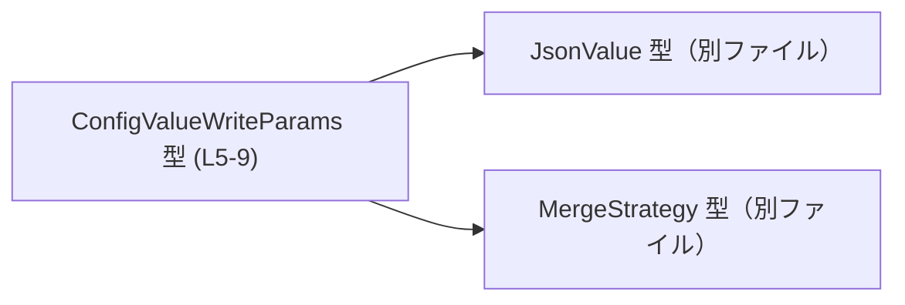
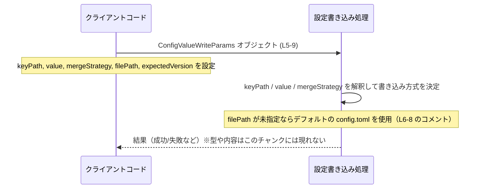

# app-server-protocol/schema/typescript/v2/ConfigValueWriteParams.ts コード解説

## 0. ざっくり一言

設定値を書き込むためのパラメータを 1 つのオブジェクト型として表現する **型エイリアス（`type`）定義**です。JSON 形式の値・マージ戦略・対象ファイルパスなどをまとめて扱うための入れ物になっています（`ConfigValueWriteParams.ts:L5-9`）。

---

## 1. このモジュールの役割

### 1.1 概要

- このモジュールは、設定値を書き込む処理に渡す **パラメータの構造**を定義します（`ConfigValueWriteParams.ts:L5-9`）。
- JSON 互換の値（`JsonValue` 型）と、マージ方法（`MergeStrategy` 型）、対象の設定ファイルパス、期待するバージョン情報などを 1 つのオブジェクトにまとめています。

### 1.2 アーキテクチャ内での位置づけ

このファイルは TypeScript 側のスキーマ定義の一部であり、他のコードからは「型」として参照されることが想定されます。依存関係としては、JSON の値表現とマージ戦略を別ファイルから輸入しています。

- `JsonValue` に依存（`import type { JsonValue } from "../serde_json/JsonValue";`  
  `ConfigValueWriteParams.ts:L3`）
- `MergeStrategy` に依存（`import type { MergeStrategy } from "./MergeStrategy";`  
  `ConfigValueWriteParams.ts:L4`）

これを図示すると次のようになります。



※ この図は、本チャンクに現れる依存関係のみを表しています。`JsonValue` や `MergeStrategy` の中身や利用側のコードは、このチャンクには現れません。

### 1.3 設計上のポイント

コードから読み取れる特徴は次のとおりです。

- **純粋なデータ定義のみ**  
  - 関数やメソッドは存在せず、状態やロジックは持たない単なるデータコンテナです（`ConfigValueWriteParams.ts:L5-9`）。
- **外部型に委譲された表現**  
  - 実際の値の表現は `JsonValue`、マージ方式は `MergeStrategy` に委ねられています（`ConfigValueWriteParams.ts:L3-5`）。
- **オプショナル + `null` の併用**  
  - `filePath?: string | null` と `expectedVersion?: string | null` は、「プロパティ自体が存在しない」状態と「`null` が明示的に指定された」状態の両方を区別できるように設計されています（`ConfigValueWriteParams.ts:L5-9`）。
- **生成コードであることの明示**  
  - 冒頭コメントにより、`ts-rs` によって生成されたコードであり、手動で編集すべきではないことが明示されています（`ConfigValueWriteParams.ts:L1-2`）。

---

## 2. 主要な機能一覧

このファイルは関数を持たないため、「機能」はすべてデータ構造レベルで提供されます。

- 設定キーの指定: `keyPath: string` で設定値の位置を文字列として指定できる（`ConfigValueWriteParams.ts:L5`）。
- 設定値自体の指定: `value: JsonValue` で JSON 互換の値を指定できる（`ConfigValueWriteParams.ts:L3, L5`）。
- マージ戦略の指定: `mergeStrategy: MergeStrategy` で既存値との統合方法を指定できる（`ConfigValueWriteParams.ts:L4-5`）。
- 設定ファイルパスの上書き指定（任意）: `filePath?: string | null` で、書き込み先の設定ファイルパスを省略可能に指定できる（`ConfigValueWriteParams.ts:L5-9`）。
- 期待バージョン情報の指定（任意）: `expectedVersion?: string | null` で、バージョンに関する文字列情報を任意で付与できる（`ConfigValueWriteParams.ts:L5-9`）。

具体的な「どう使われるか」（どの API に渡されるか）は、このチャンクには現れません。

---

## 3. 公開 API と詳細解説

### 3.1 型一覧（構造体・列挙体など）

#### コンポーネントインベントリー（型）

| 名前                      | 種別      | 役割 / 用途                                           | 定義位置                         |
|---------------------------|-----------|-------------------------------------------------------|----------------------------------|
| `ConfigValueWriteParams`  | 型エイリアス | 設定値書き込み時のパラメータをまとめるオブジェクト型 | `ConfigValueWriteParams.ts:L5-9` |

#### 外部依存型（このファイル内では宣言されないもの）

| 名前         | 種別      | 役割 / 用途（解釈可能な範囲）                  | 参照位置                      | 備考 |
|--------------|-----------|-----------------------------------------------|-------------------------------|------|
| `JsonValue`  | 型エイリアス等（不明） | JSON 形式の値を表す型名と解釈できるが、定義はこのチャンクにはない | `ConfigValueWriteParams.ts:L3, L5` | 実体は `../serde_json/JsonValue` に定義 |
| `MergeStrategy` | 列挙体等（不明） | 設定値をどうマージするかを表す戦略型名と解釈できるが、定義はこのチャンクにはない | `ConfigValueWriteParams.ts:L4-5` | 実体は `./MergeStrategy` に定義 |

#### `ConfigValueWriteParams` のフィールド一覧

| フィールド名       | 型                       | 必須/任意 | 説明（コードから読み取れる範囲）                                                                 | 定義位置                         |
|--------------------|--------------------------|-----------|--------------------------------------------------------------------------------------------------|----------------------------------|
| `keyPath`          | `string`                 | 必須      | 設定値の位置を表す文字列として定義されています。具体的なフォーマット（例: `"a.b.c"`）はこのチャンクには記述がありません。 | `ConfigValueWriteParams.ts:L5` |
| `value`            | `JsonValue`              | 必須      | 書き込む値を表す JSON 互換の型として定義されていますが、中身の構造は別ファイルで定義されています。   | `ConfigValueWriteParams.ts:L3, L5` |
| `mergeStrategy`    | `MergeStrategy`          | 必須      | 既存値とのマージ方法を表す型として参照されています。具体的なバリエーションはこのチャンクには現れません。 | `ConfigValueWriteParams.ts:L4-5` |
| `filePath`         | `string \| null`         | 任意 (`?`) | 書き込み対象の設定ファイルパス。コメントにより、省略時はユーザーの `config.toml` がデフォルトで使われると説明されています。`null` も有効値です。 | `ConfigValueWriteParams.ts:L5-9` |
| `expectedVersion`  | `string \| null`         | 任意 (`?`) | 文字列または `null` を取り得る任意プロパティとして定義されています。具体的な意味やフォーマットはこのチャンクからは判断できません。 | `ConfigValueWriteParams.ts:L5-9` |

`filePath` についてのコメント原文（注釈付き）:

```typescript
/**
 * Path to the config file to write; defaults to the user's `config.toml` when omitted.
 */
```

（`ConfigValueWriteParams.ts:L6-8`）

### 3.2 関数詳細（最大 7 件）

このファイルには関数定義が存在しないため、本セクションで詳細解説する対象となる関数はありません。

- 関数数: 0（`ConfigValueWriteParams.ts` 全体）

### 3.3 その他の関数

- 補助的な関数やラッパー関数も定義されていません。

---

## 4. データフロー

このファイルは型定義のみを含み、実際の処理フローは現れていません。ただし、型名とフィールド構成から、「設定書き込み処理に渡されるパラメータオブジェクト」として利用されると解釈できます。

以下は **典型的な利用イメージを仮定した** データフローです。ここに登場する「クライアントコード」「設定書き込み処理」といったコンポーネントは、このチャンクには登場しません（あくまで利用イメージです）。



ポイント:

- **この型自体は不変データの束**であり、並列処理や同期処理などの制御は一切含んでいません。
- TypeScript の観点では、`ConfigValueWriteParams` を受け取る関数は、コンパイル時にフィールドの存在と型をチェックできますが、**値の妥当性（例: `keyPath` のフォーマット）の検証は別のロジックに依存**します。

---

## 5. 使い方（How to Use）

### 5.1 基本的な使用方法

ここでは、この型を利用してパラメータオブジェクトを組み立て、どこかの「設定書き込み関数」に渡す、という **典型的な使用パターンのイメージ**を示します。  
`writeConfigValue` などの関数は、このファイル内には定義されていません。

```typescript
// 他ファイルから型をインポートする                                   // ConfigValueWriteParams 型を利用する前にインポートする
import type { ConfigValueWriteParams } from "./ConfigValueWriteParams"; // 実際のパスはプロジェクト構成に依存する
import type { JsonValue } from "../serde_json/JsonValue";               // JSON 値型（定義は別ファイル）
import type { MergeStrategy } from "./MergeStrategy";                   // マージ戦略型（定義は別ファイル）

// ここでは、何らかの方法で JsonValue と MergeStrategy の値を取得しているとする
declare function getJsonValue(): JsonValue;                             // 実装はこのチャンクには現れない
declare function getMergeStrategy(): MergeStrategy;                     // 実装はこのチャンクには現れない

// ConfigValueWriteParams オブジェクトを構築する
const params: ConfigValueWriteParams = {                                // 必須/任意の各フィールドをまとめて指定
    keyPath: "server.port",                                             // 設定のキー（フォーマットは別途約束が必要）
    value: getJsonValue(),                                              // 書き込む JSON 互換の値
    mergeStrategy: getMergeStrategy(),                                  // マージ戦略
    // filePath を省略するとコメントにある通り、デフォルトの config.toml が使われることが期待される
    expectedVersion: null,                                              // version を明示的に「未指定」にしたい場合の一例
};

// （仮の関数例）設定を書き込む関数に渡すイメージ
declare function writeConfigValue(params: ConfigValueWriteParams): Promise<void>; // この関数は他ファイルにある想定

await writeConfigValue(params);                                         // パラメータオブジェクトを渡して非同期に書き込み
```

> 注意: `getJsonValue`, `getMergeStrategy`, `writeConfigValue` は **このファイルには存在しない仮の関数**です。利用側がどのように値を用意するかは、別ファイルの実装に依存します。

### 5.2 よくある使用パターン

この型は、呼び出し側で「どこまで指定するか」によって使い方が変わります。

1. **最小限の指定（デフォルトの config.toml & バージョン未指定）**

```typescript
const params: ConfigValueWriteParams = {
    keyPath: "feature.flagX",
    value: getJsonValue(),
    mergeStrategy: getMergeStrategy(),
    // filePath, expectedVersion は省略
};
```

1. **特定ファイルへの書き込みとバージョン指定（仮の例）**

```typescript
const params: ConfigValueWriteParams = {
    keyPath: "server.maxConnections",
    value: getJsonValue(),
    mergeStrategy: getMergeStrategy(),
    filePath: "/etc/my-app/config.toml",  // 明示的にファイルを指定（string 型）
    expectedVersion: "v2",                // 文字列型のバージョン情報
};
```

`expectedVersion` の具体的な意味（楽観ロックなのか単なるメタ情報なのか）は、このチャンクだけでは分かりません。

### 5.3 よくある間違い

コードから推測される、**型レベルで起こりうる誤り**を挙げます。

```typescript
// 誤り例: 必須フィールドが欠けている
const badParams1: ConfigValueWriteParams = {
    // keyPath: "server.port",          // ← コンパイルエラー: 必須フィールドがない
    value: getJsonValue(),
    mergeStrategy: getMergeStrategy(),
};

// 誤り例: filePath に number を渡している
const badParams2: ConfigValueWriteParams = {
    keyPath: "server.port",
    value: getJsonValue(),
    mergeStrategy: getMergeStrategy(),
    // @ts-expect-error - 型不一致
    filePath: 123,                       // ← string | null | undefined 以外はコンパイルエラー
};
```

### 5.4 使用上の注意点（まとめ）

- **必須フィールドの指定**  
  - `keyPath`, `value`, `mergeStrategy` は必須です。省略すると TypeScript の型チェックでエラーになります（`ConfigValueWriteParams.ts:L5`）。
- **`filePath` と `expectedVersion` の「省略」と「null」の違い**  
  - `filePath?: string | null` および `expectedVersion?: string | null` となっているため、
    - プロパティ自体を省略する（`undefined`）  
    - プロパティを指定したうえで `null` を入れる  
    の 2 つのケースを区別可能です。呼び出される側の実装が、この違いに意味を持たせている可能性があります。
- **値の妥当性は別途検証が必要**  
  - 型レベルでは、`keyPath` が空文字や無効なパスでも許容されます。実行時のバリデーションは、別のロジックに依存します。
- **並行性・スレッド安全性**  
  - この型自体は不変の値の束であり、共有しても競合状態は生じません。JavaScript/TypeScript の通常のオブジェクトと同様に、コピーやミューテーションの管理は利用側の責任になります。

---

## 6. 変更の仕方（How to Modify）

### 6.1 新しい機能を追加する場合

ファイル冒頭のコメントに

```typescript
// GENERATED CODE! DO NOT MODIFY BY HAND!
// This file was generated by [ts-rs](https://github.com/Aleph-Alpha/ts-rs). Do not edit this file manually.
```

とある通り（`ConfigValueWriteParams.ts:L1-2`）、このファイルは自動生成されています。

- **直接この TypeScript ファイルを編集すべきではありません。**
- 新しいフィールドの追加や型の変更が必要な場合は、
  - `ts-rs` に対応する **元の定義（通常は Rust 側の型定義）** を変更し、
  - その後、コード生成プロセスを再実行して TypeScript ファイルを再生成する  
  という手順が安全です。

### 6.2 既存の機能を変更する場合

型の意味や契約を変更する場合の注意点:

- **影響範囲の確認**  
  - `ConfigValueWriteParams` を参照しているすべての関数・モジュールを検索し、どのフィールドに依存しているかを確認する必要があります（このチャンクには参照側は現れません）。
- **契約（前提条件）の維持**  
  - 例: `filePath` を必須に変更すると、「省略時は `config.toml`」というコメント内容（`ConfigValueWriteParams.ts:L6-8`）と齟齬が生じます。生成元の定義・コメントも合わせて見直す必要があります。
- **型変更後のコンパイル**  
  - TypeScript の型チェックにより、変更によって不整合が生じた箇所が検出されます。すべての利用箇所でコンパイルが通ることを確認することが重要です。

---

## 7. 関連ファイル

このモジュールと直接関係するファイルは、インポート文から次のように読み取れます。

| パス                               | 役割 / 関係                                                                                     |
|------------------------------------|-------------------------------------------------------------------------------------------------|
| `../serde_json/JsonValue`         | `JsonValue` 型を提供するモジュール。`ConfigValueWriteParams.value` の型として利用されています（`ConfigValueWriteParams.ts:L3, L5`）。 |
| `./MergeStrategy`                 | `MergeStrategy` 型を提供するモジュール。`ConfigValueWriteParams.mergeStrategy` の型として利用されています（`ConfigValueWriteParams.ts:L4-5`）。 |

テストコードやこの型を実際に利用する関数・モジュールは、このチャンクには現れません。そのため、

- どこから `ConfigValueWriteParams` が呼び出されているか
- `expectedVersion` にどのような意味が与えられているか
- どのようなエラー処理やバージョン衝突の扱いがあるか

といった点は、このファイル単体からは判断できません。
