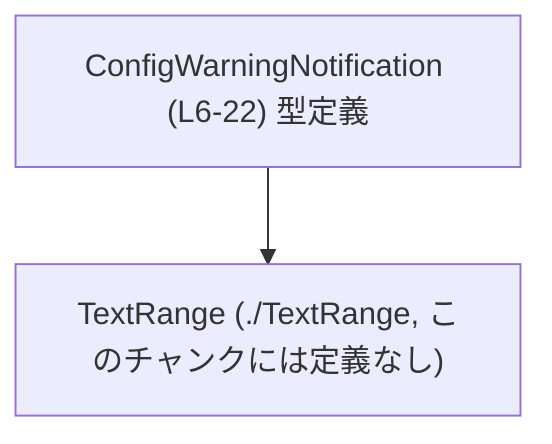
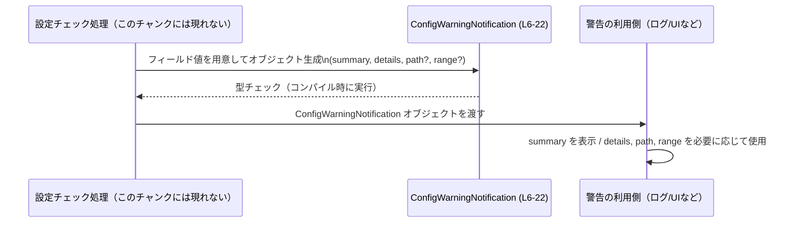

# app-server-protocol/schema/typescript/v2/ConfigWarningNotification.ts

---

## 0. ざっくり一言

設定ファイルに関する警告を表現するための **通知オブジェクトの型定義** です。  
警告の要約・詳細・対象ファイルパス・ファイル内の位置情報を表すフィールドを持つ構造になっています（ConfigWarningNotification.ts:L6-22）。

---

## 1. このモジュールの役割

### 1.1 概要

- このモジュールは、**設定ファイルに対する警告情報を TypeScript で表現するための型** `ConfigWarningNotification` を提供します（ConfigWarningNotification.ts:L6-6）。
- 警告の「要約」（必須）と、「詳細」「ファイルパス」「ファイル内の範囲」（いずれも任意）の情報を保持できる構造になっています（ConfigWarningNotification.ts:L10-22）。
- ファイル先頭コメントから、このコードは [`ts-rs`](https://github.com/Aleph-Alpha/ts-rs) により自動生成されており、**手動で編集すべきではない**ことが明示されています（ConfigWarningNotification.ts:L1-3）。

### 1.2 アーキテクチャ内での位置づけ

このファイル単体から分かることは次のとおりです。

- `ConfigWarningNotification` はこのモジュールから **export** される公開型です（ConfigWarningNotification.ts:L6-6）。
- `range` フィールドは `TextRange` 型を参照しており、同一ディレクトリの `"./TextRange"` モジュールに依存しています（ConfigWarningNotification.ts:L4-4, L22-22）。
- それ以外にどのモジュールから参照されているかは、このチャンクには現れません。

この関係を簡単な依存関係図で表すと、次のようになります。



- `ConfigWarningNotification (L6-22)` ノードは、本ファイル内で定義される型です（ConfigWarningNotification.ts:L6-22）。
- `TextRange` ノードは `import type { TextRange } from "./TextRange";` によって参照される外部型であり（ConfigWarningNotification.ts:L4-4）、具体的な中身はこのチャンクには現れません。

### 1.3 設計上のポイント

コードから読み取れる設計上の特徴は次のとおりです。

- **自動生成コード**  
  - ファイル先頭コメントにより、`ts-rs` によって生成されたコードであり、手作業による編集は禁止とされています（ConfigWarningNotification.ts:L1-3）。
- **単純なデータコンテナ（DTO）設計**  
  - 関数やメソッドは存在せず、フィールドのみを持つプレーンなオブジェクト型です（ConfigWarningNotification.ts:L6-22）。
- **型安全なオプショナル情報の表現**
  - `details` は `string | null` 型で、「詳細情報がある／ない」の状態を null で区別します（ConfigWarningNotification.ts:L14-14）。
  - `path` と `range` は **オプショナルプロパティ**（`?`）として宣言されており、プロパティ自体が存在しない可能性があります（ConfigWarningNotification.ts:L18-18, L22-22）。
- **位置情報の分離**
  - ファイル内の範囲は `TextRange` という別型に切り出して表現しています（ConfigWarningNotification.ts:L4-4, L22-22）。構造の詳細はこのチャンクには現れません。

---

## 2. 主要な機能一覧

このモジュールは関数ではなく型のみを提供しますが、型が表現する「機能」を観点として整理すると次のとおりです。

- `ConfigWarningNotification` 型:  
  設定ファイルに関する警告通知を構造化して表現する。
  - 警告の要約文 (`summary`) を必須で保持する（ConfigWarningNotification.ts:L10-10）。
  - 追加の詳細またはエラー情報 (`details`) を `string | null` で保持する（ConfigWarningNotification.ts:L14-14）。
  - 警告の原因となった設定ファイルへのパス (`path`) を任意で保持する（ConfigWarningNotification.ts:L18-18）。
  - 設定ファイル内の位置情報 (`range`) を `TextRange` として任意で保持する（ConfigWarningNotification.ts:L22-22）。

---

## 3. 公開 API と詳細解説

### 3.1 型一覧（構造体・列挙体など）

このファイルで公開されている主な型は 1 つです。

| 名前 | 種別 | 役割 / 用途 | 定義箇所 |
|------|------|-------------|----------|
| `ConfigWarningNotification` | 型エイリアス（オブジェクト型） | 設定ファイルに関する警告通知を表すデータ構造。警告の要約・詳細・ファイルパス・ファイル内範囲を保持する。 | ConfigWarningNotification.ts:L6-22 |

#### `ConfigWarningNotification` のフィールド構造

各フィールドの仕様を、コード上の定義に基づいて整理します。

| フィールド名 | 型 | 必須/任意 | 説明 | 根拠 |
|-------------|----|-----------|------|------|
| `summary` | `string` | 必須 | 警告の簡潔な要約を表します。空でない保証は型レベルではありません。 | ConfigWarningNotification.ts:L10-10 |
| `details` | `string \| null` | 必須（プロパティとしては常に存在、値が `null` の可能性） | 追加のガイダンスやエラー詳細など、任意の詳細情報。詳細がない場合は `null` になります。 | ConfigWarningNotification.ts:L14-14 |
| `path` | `string` | 任意（オプショナルプロパティ） | 警告を引き起こした設定ファイルのパス。存在しない場合もあります。 | ConfigWarningNotification.ts:L18-18 |
| `range` | `TextRange` | 任意（オプショナルプロパティ） | 設定ファイル内でのエラー位置範囲。構造は外部型 `TextRange` に委ねられています。 | ConfigWarningNotification.ts:L4-4, L22-22 |

補足:

- `details` が `string | null` であることから、「プロパティ自体が存在しない」のではなく、「存在はするが値が `null`」という状態を区別して扱う設計になっています（ConfigWarningNotification.ts:L14-14）。
- 一方 `path` と `range` は `?` によりオプショナルプロパティであり、**プロパティそのものが `undefined`（未定義）** になり得ます（ConfigWarningNotification.ts:L18-18, L22-22）。

### 3.2 関数詳細（最大 7 件）

このファイルには **関数定義は一切存在しません**（ConfigWarningNotification.ts:L1-22）。

- すべてのロジックは、呼び出し側コードによってこの型を使って実装される想定であり、このファイルは **データ形状の宣言のみに特化**しています。

そのため、関数テンプレートに基づく詳細解説対象はありません。

### 3.3 その他の関数

- 補助関数やラッパー関数も、このチャンクには現れません。

---

## 4. データフロー

このファイルには処理ロジックが含まれていませんが、型名とフィールド構造から、**想定されるデータの流れ**を概念的に説明します。  
（以下は型の用途からの推測であり、実際の実装はこのチャンクには現れません。）

1. どこかのコンポーネントが設定ファイルを検査し、警告すべき点を検出する。
2. 検出結果を `ConfigWarningNotification` 型のオブジェクトとして構築する。
   - `summary` に短い説明を書き（ConfigWarningNotification.ts:L10-10）、
   - 詳細情報があれば `details` に格納し、なければ `details: null` とする（ConfigWarningNotification.ts:L14-14）。
   - 対象ファイルや位置が特定できる場合は `path` と `range` を設定する（ConfigWarningNotification.ts:L18-18, L22-22）。
3. 構築されたオブジェクトが、UI・ログ・ネットワーク通信等の利用側に渡される。

この流れをシーケンス図で表すと、次のようなイメージになります。



- `WarningType` は実行時に存在するオブジェクトというより、**コンパイル時の型チェック**の役割を果たします（TypeScript の型システムの性質による一般的な事実）。
- 並行性や非同期処理に関する情報は、このファイル単体からは分かりません。

---

## 5. 使い方（How to Use）

### 5.1 基本的な使用方法

`ConfigWarningNotification` 型を利用して警告オブジェクトを作成し、利用する基本パターンの例です。

```typescript
// 型定義をインポートする                                   // ConfigWarningNotification 型を読み込む
import type { ConfigWarningNotification } from "./ConfigWarningNotification"; // パスはこのファイルと同階層を想定

// 警告オブジェクトを生成する関数の例
function createWarningForDeprecatedOption(optionName: string): ConfigWarningNotification {
    return {
        summary: `Deprecated option used: ${optionName}`,  // 要約は必須 (string)
        details: "This option will be removed in a future version.", // 詳細があれば string
        // path は不明なら省略可能
        // range も省略可能（TextRange の構造はこのチャンクには現れない）
        // path: "/path/to/config.yml",
        // range: { ... } // TextRange の実体に合わせて設定
    };
}

// 利用側での例
function logWarning(warning: ConfigWarningNotification) {
    console.warn(warning.summary);                          // summary は必ず存在し string 型
    if (warning.details !== null) {                         // details は string | null なので null チェックが必要
        console.warn("Details:", warning.details);
    }
    if (warning.path !== undefined) {                       // path はオプショナルプロパティなので undefined チェック
        console.warn("File:", warning.path);
    }
    if (warning.range !== undefined) {                      // range もオプショナル
        console.warn("Range:", warning.range);
    }
}
```

この例から分かるポイント:

- `summary` は必須なので、常に設定する必要があります（ConfigWarningNotification.ts:L10-10）。
- `details` は `null` の可能性があるため、使用前に `null` チェックが必要です（ConfigWarningNotification.ts:L14-14）。
- `path` と `range` はプロパティ自体が存在しない可能性があるため、`undefined` チェックが必要です（ConfigWarningNotification.ts:L18-18, L22-22）。

### 5.2 よくある使用パターン

1. **最小限の警告（要約のみ）**

```typescript
const minimalWarning: ConfigWarningNotification = {
    summary: "Unknown option in config file.", // 必須
    details: null,                             // 詳細がない場合は null を明示
    // path, range は省略可能
};
```

- 設定ファイルや位置が特定できないが、警告メッセージだけは通知したい場合の形です。

1. **ファイルパスと位置情報付きの詳細な警告**

```typescript
import type { TextRange } from "./TextRange";  // range を設定する場合は TextRange 型もインポート

const detailedWarning: ConfigWarningNotification = {
    summary: "Invalid value for 'port'.",
    details: "The port must be an integer between 1 and 65535.",
    path: "/etc/app/config.yml",               // ファイルパスを指定（任意）
    // TextRange の具体的な構造はこのチャンクには現れないため、ここでは型だけを示す
    // range: { start: 10, end: 20 } as TextRange;
    details: "The port must be an integer between 1 and 65535.",
};
```

- `TextRange` の実際のプロパティ構造はこのチャンクには現れないため、実装側でその定義に合わせて値を構築する必要があります。

### 5.3 よくある間違い

1. **`details` の `null` を考慮しない**

```typescript
// 間違い例: details を常に string として扱っている
function printDetailsWrong(warning: ConfigWarningNotification) {
    console.log(warning.details.toUpperCase()); // コンパイルエラー: details は string | null
}

// 正しい例: null チェックを行う
function printDetailsCorrect(warning: ConfigWarningNotification) {
    if (warning.details !== null) {             // null を排除する
        console.log(warning.details.toUpperCase());
    }
}
```

1. **`path` / `range` を必ず存在すると仮定する**

```typescript
// 間違い例: path をそのまま使用している
function showFileWrong(warning: ConfigWarningNotification) {
    console.log("File:", warning.path.toUpperCase()); // コンパイルエラー: path は string | undefined
}

// 正しい例: undefined チェックを行う
function showFileCorrect(warning: ConfigWarningNotification) {
    if (warning.path !== undefined) {
        console.log("File:", warning.path.toUpperCase());
    }
}
```

### 5.4 使用上の注意点（まとめ）

- **自動生成コードのため直接編集しない**  
  - ファイル先頭に「GENERATED CODE! DO NOT MODIFY BY HAND!」と明記されています（ConfigWarningNotification.ts:L1-1）。  
    型定義を変更したい場合は、`ts-rs` の元となる Rust 側の定義を変更し、再生成する必要があります。
- **`details` の `null` とプロパティの欠如を区別する**  
  - `details` は必ず存在しますが、値が `null` の可能性があります（ConfigWarningNotification.ts:L14-14）。  
    `details` がない状態を「プロパティが存在しない」で表現する設計ではない点に注意が必要です。
- **`path` / `range` はオプショナルプロパティ**  
  - 存在しない場合、プロパティ自体が `undefined` になります（ConfigWarningNotification.ts:L18-18, L22-22）。  
    使用前には `undefined` チェックを実施する必要があります。
- **並行性・エラー処理は呼び出し側の責務**  
  - この型は純粋なデータ構造であり、エラー処理やスレッドセーフティに関するロジックは含まれていません。  
    非同期処理や並行処理における取り扱いは、利用側のコードで適切に設計する必要があります。

---

## 6. 変更の仕方（How to Modify）

### 6.1 新しい機能を追加する場合

このファイルは `ts-rs` により自動生成されているため（ConfigWarningNotification.ts:L1-3）、**直接編集ではなく生成元の定義を変更する**必要があります。

一般的な手順（このチャンクには生成元のコードは現れません）:

1. `ConfigWarningNotification` に対応する Rust 側の構造体や型（`ts-rs` の対象）を特定する。  
   - ファイルコメントから `ts-rs` を使っていることだけは分かりますが、具体的な型名やファイルはこのチャンクには現れません。
2. Rust 側の定義に新しいフィールドや型を追加する。
3. `ts-rs` のコード生成プロセスを再実行して、TypeScript 側の `ConfigWarningNotification.ts` を再生成する。
4. 生成された TypeScript に新しいフィールドが反映されていることを確認する。

### 6.2 既存の機能を変更する場合

既存フィールドの意味や型を変更する場合も、基本方針は同じです。

- **影響範囲の確認**
  - `ConfigWarningNotification` を利用しているすべての TypeScript コードが影響を受けますが、その利用箇所はこのチャンクには現れません。
- **変更時に注意すべき契約**
  - `summary` が必須であるという契約（ConfigWarningNotification.ts:L10-10）を変える場合、既存コードが `summary` の存在を前提としている可能性があります。
  - `details` を `string | null` から `string` に変更するなどの変更は、`null` チェックを行っている既存コードに影響を与えます（ConfigWarningNotification.ts:L14-14）。
  - `path` / `range` のオプショナル性を変えると、`undefined` チェックやプロパティ存在チェックのロジックに影響します（ConfigWarningNotification.ts:L18-18, L22-22）。
- **関連テストの再確認**
  - このチャンクにはテストコードは現れませんが、変更後は:
    - Rust 側のテスト（構造の意味・変換ロジック）
    - TypeScript 側のテスト（新しい型に合わせた利用）
    を更新・確認する必要があります。

---

## 7. 関連ファイル

このモジュールと密接に関係するファイル・ディレクトリとして、コードから明示的に分かるものを列挙します。

| パス | 役割 / 関係 |
|------|------------|
| `./TextRange` | `import type { TextRange } from "./TextRange";` により参照される型定義。`ConfigWarningNotification.range` フィールドの型として使用される（ConfigWarningNotification.ts:L4-4, L22-22）。具体的な実装やフィールド構造はこのチャンクには現れません。 |
| `app-server-protocol/schema/typescript/v2/` ディレクトリ | 本ファイルが置かれているディレクトリ。`schema/typescript/v2` という名前から、アプリケーションサーバープロトコルの TypeScript スキーマ群であることが推測されますが、他ファイルの内容はこのチャンクには現れません。 |

以上が、このファイルに基づいて得られる `ConfigWarningNotification` 型の構造とその利用に関する客観的な解説です。
