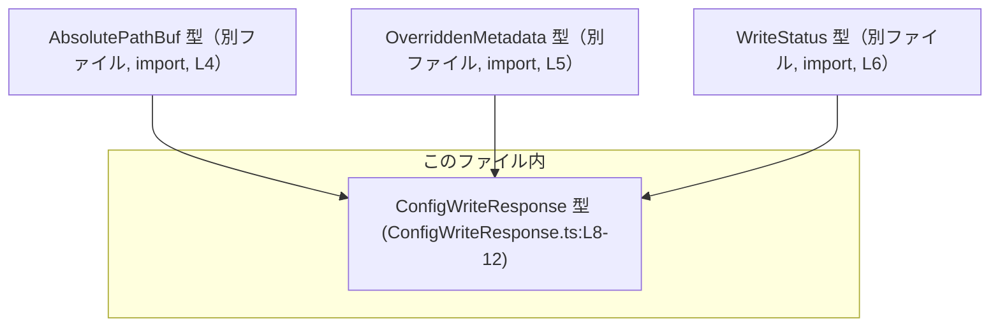
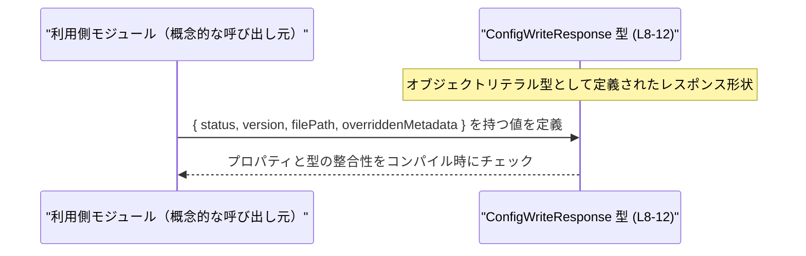

# app-server-protocol/schema/typescript/v2/ConfigWriteResponse.ts コード解説

## 0. ざっくり一言

- 設定ファイル書き込み処理の結果を表現する **応答オブジェクトの型定義** を提供するファイルです（ConfigWriteResponse.ts:L8-12）。

---

## 1. このモジュールの役割

### 1.1 概要

- このモジュールは、設定ファイルの書き込み結果を表す `ConfigWriteResponse` 型を定義・エクスポートします（L8）。
- `ConfigWriteResponse` は、書き込みステータス・バージョン・書き込まれたファイルのパス・上書きされたメタデータをまとめて表現します（L8-12）。
- ファイル先頭で「生成コードであり手動変更禁止」と明記されており、自動生成された型定義であることが分かります（L1, L3）。

### 1.2 アーキテクチャ内での位置づけ

このファイル内で確認できる依存関係は、**型レベルの依存のみ**です。



- `ConfigWriteResponse` は 3 つの外部型に依存しています（L4-6）。
  - `AbsolutePathBuf`（パス表現用の型）
  - `OverriddenMetadata`（メタデータを表す型）
  - `WriteStatus`（書き込みステータスを表す型）
- これら依存型の **定義本体はこのチャンクには現れず**、型参照のみが行われています（L4-6）。

### 1.3 設計上のポイント

- **生成コードであることの明示**  
  - 「GENERATED CODE」「Do not edit this file manually」とコメントされており、生成物であることが設計上の前提です（L1, L3）。
- **状態を持たない純粋な型定義**  
  - 実行時の処理・関数・クラスは存在せず、オブジェクトリテラル型のエイリアスのみで構成されています（L8-12）。
- **null 許容フィールドによる状態表現**  
  - `overriddenMetadata` が `OverriddenMetadata | null` で定義され、メタデータが「存在しない」状態を `null` で表現できるようになっています（L12）。
- **TypeScript の型安全性を利用した API 境界の定義**  
  - すべてのプロパティに具体的な型が付いており、呼び出し側はコンパイル時に型チェックの恩恵を受けられます（L8-12）。

---

## 2. 主要な機能一覧

このファイルは関数を持たず、**1 つの公開型**のみを提供します。

- `ConfigWriteResponse` 型定義:  
  設定書き込み結果の情報（ステータス・バージョン・ファイルパス・上書きメタデータ）をまとめて表現する型（L8-12）。

---

## 3. 公開 API と詳細解説

### 3.1 型一覧（構造体・列挙体など）

このファイル内で定義され、エクスポートされる主要な型は以下の通りです。

| 名前 | 種別 | 役割 / 用途 | 根拠 |
|------|------|-------------|------|
| `ConfigWriteResponse` | 型エイリアス（オブジェクト型） | 設定ファイル書き込み処理の結果を表すレスポンスオブジェクト。`status`/`version`/`filePath`/`overriddenMetadata` を持つ。 | ConfigWriteResponse.ts:L8-12 |

依存する外部型（このファイルでは定義されず、import のみ）の一覧です。

| 名前 | 種別 | 役割 / 用途（名前から分かる範囲） | 根拠 |
|------|------|-----------------------------------|------|
| `AbsolutePathBuf` | 型（詳細不明） | 絶対パスを表す型であることが名前から推測されますが、このチャンクには定義がありません。**用途自体は、このファイルでは `filePath` の型として使用されていることだけが確実です。** | import 行（ConfigWriteResponse.ts:L4）, 使用（L12） |
| `OverriddenMetadata` | 型（詳細不明） | メタデータを表す型であることが名前から推測されますが、同様に定義はこのチャンクにありません。`overriddenMetadata` プロパティの型として使用されていることだけが確実です。 | import 行（L5）, 使用（L12） |
| `WriteStatus` | 型（詳細不明） | 書き込みステータスを表す列挙または型と考えられますが、実体はこのチャンクには存在しません。`status` プロパティの型として使用されています。 | import 行（L6）, 使用（L8） |

> 依存型の「意味」については、名前を根拠とする推測になるため、上記のように「名前から推測される」と明示しています。型の「使用位置」はソースから直接確認できます。

`ConfigWriteResponse` のプロパティ詳細は次の通りです。

| プロパティ名 | 型 | 必須/任意 | 説明 | 根拠 |
|-------------|----|-----------|------|------|
| `status` | `WriteStatus` | 必須 | 書き込み処理の状態を表す値。具体的な値のバリエーションは `WriteStatus` 型の定義側にあります。 | 定義（L8） |
| `version` | `string` | 必須 | 設定のバージョン文字列を表す値。 | 定義（L8） |
| `filePath` | `AbsolutePathBuf` | 必須 | 書き込まれた設定ファイルの **正規化された（canonical）パス**。コメントでそう説明されています。 | 定義（L12）, コメント（L9-11） |
| `overriddenMetadata` | `OverriddenMetadata \| null` | 必須（ただし `null` 可） | 上書きされたメタデータを表す値。メタデータが存在しない場合は `null` として表現されます。 | 定義（L12） |

### 3.2 関数詳細

- **このファイルには関数・メソッドは一切定義されていません**（ConfigWriteResponse.ts:L1-12）。
- そのため、「関数詳細テンプレート」を適用すべき対象はありません。

### 3.3 その他の関数

- 該当なし（関数定義が存在しません）。

---

## 4. データフロー

このファイルは実行時ロジックを持たず、**型レベルの構造のみ**が記述されています。  
そのため、ここでは「型の利用」を抽象的に示したシーケンス図を用い、**コンパイル時の型チェック**を中心にデータフローを説明します。



- 上記は **抽象図** であり、具体的な利用モジュール名や処理名は、このチャンクには登場しません。
- 実際のデータフローとして確実に言えるのは次の点です。
  - `ConfigWriteResponse` 型の値は、少なくとも 4 つのプロパティを含むオブジェクトでなければ、コンパイル時に型エラーとなります（L8-12）。
  - `overriddenMetadata` には `OverriddenMetadata` 型の値または `null` のどちらかしか代入できません（L12）。
  - `filePath` には `AbsolutePathBuf` 型の値が必須です（L12）。

---

## 5. 使い方（How to Use）

### 5.1 基本的な使用方法

このファイルから `ConfigWriteResponse` をインポートし、レスポンスオブジェクトの型として利用する例です。

```typescript
// ConfigWriteResponse 型をインポートする（同一ディレクトリからの相対パス例）
import type { ConfigWriteResponse } from "./ConfigWriteResponse"; // 型定義のインポート（L8 の export に対応）

// 設定書き込み処理の結果を表す値を構築する例
const resp: ConfigWriteResponse = {                                // ConfigWriteResponse 型としてオブジェクトを定義
    status: someWriteStatus,                                       // WriteStatus 型の値（L8 の status プロパティ）
    version: "v2.3.0",                                             // バージョン文字列（string 型, L8）
    filePath: someAbsolutePathBuf,                                 // 絶対パスを表す AbsolutePathBuf 型の値（L12）
    overriddenMetadata: null,                                      // メタデータが上書きされていない場合は null（L12）
};
```

- `status` / `filePath` / `overriddenMetadata` は、対応する型の定義ファイルから別途インポートする必要があります（L4-6）。
- `overriddenMetadata` は `null` を許容するため、呼び出し側が `null` を扱うロジックを持つことが想定されます（L12）。

### 5.2 よくある使用パターン

**1. メタデータが存在する場合と存在しない場合を分岐して扱う**

```typescript
import type { ConfigWriteResponse } from "./ConfigWriteResponse"; // 型のインポート

function handleResponse(resp: ConfigWriteResponse) {              // レスポンス型を引数として受け取る
    console.log(resp.status, resp.version);                        // status と version は常に利用可能（L8）

    console.log(resp.filePath);                                    // filePath も必ず存在する（L12）

    if (resp.overriddenMetadata !== null) {                        // null チェックにより OverriddenMetadata 型に絞り込める（L12）
        // resp.overriddenMetadata はここでは非 null
        // OverriddenMetadata のフィールドにアクセスできる（定義は別ファイル）
    } else {
        // メタデータが存在しない場合の処理
    }
}
```

- TypeScript の型システムにより、`resp.overriddenMetadata !== null` の分岐内では `overriddenMetadata` の型が `OverriddenMetadata` に絞り込まれます（L12）。

### 5.3 よくある間違い

**誤用例: `overriddenMetadata` を null チェックせずに使用する**

```typescript
// 間違い例
function badHandle(resp: ConfigWriteResponse) {
    // resp.overriddenMetadata が null の可能性を無視してメソッド呼び出しを行う
    // （コンパイル設定によってはコンパイルエラーにならず、実行時エラーの原因になる）
    // resp.overriddenMetadata.someField; // ← null の場合に実行時エラー
}
```

**正しい例: null チェックを行う**

```typescript
// 正しい例
function goodHandle(resp: ConfigWriteResponse) {
    if (resp.overriddenMetadata !== null) {       // null チェック（L12 の null 許容型に対応）
        // ここでは OverriddenMetadata 型として安全に扱える
        // resp.overriddenMetadata.someField;
    }
}
```

### 5.4 使用上の注意点（まとめ）

- `overriddenMetadata` は `null` を取り得るため、利用時には必ず null チェックを行うことが安全です（L12）。
- このファイルは生成コードであり、**手動での編集は想定されていません**（L1, L3）。
- 実行時処理を持たない純粋な型定義のため、パフォーマンスや並行性の懸念はありませんが、利用側のロジックでの null 処理ミスは実行時エラーにつながり得ます。

---

## 6. 変更の仕方（How to Modify）

### 6.1 新しい機能を追加する場合

- コメントに「GENERATED CODE」「Do not edit this file manually」と明記されているため（L1, L3）、**このファイルを直接編集することは推奨されません**。
- 一般的には、生成元（このファイルを生成しているツールや定義）を変更し、その結果として本ファイルが再生成される形で機能追加を行う必要があります。
  - このチャンクからは、生成元の具体的な場所・言語は特定できません。

### 6.2 既存の機能を変更する場合

- `ConfigWriteResponse` のプロパティ構造を変更したい場合も、同様に生成元の定義を変更する必要があります（L1, L3）。
- 変更時に注意すべき契約（Contract）:
  - 既存の利用コードは `status`/`version`/`filePath`/`overriddenMetadata` に依存している可能性が高く、これらの削除・型変更は広い影響範囲を持ちます。
  - 特に `overriddenMetadata` の `null` 許容性を変える（`OverriddenMetadata` のみ、または `undefined` を追加するなど）と、多数の呼び出し側で条件分岐ロジックの見直しが必要になります。
- 影響範囲の確認方法（このチャンクから分かる範囲）:
  - TypeScript プロジェクト全体の `ConfigWriteResponse` 参照箇所を検索し、どのプロパティが使用されているかを確認する必要があります（具体的なファイルはこのチャンクには現れません）。

---

## 7. 関連ファイル

このファイルから直接参照されている型定義ファイルは次の通りです。

| パス | 役割 / 関係 | 根拠 |
|------|-------------|------|
| `../AbsolutePathBuf` | `AbsolutePathBuf` 型を提供するファイル。`filePath` プロパティの型として使用されます。型の内容はこのチャンクには現れません。 | import 行（ConfigWriteResponse.ts:L4）, 使用（L12） |
| `./OverriddenMetadata` | `OverriddenMetadata` 型を提供するファイル。`overriddenMetadata` プロパティの型として使用されます。型の内容はこのチャンクには現れません。 | import 行（L5）, 使用（L12） |
| `./WriteStatus` | `WriteStatus` 型を提供するファイル。`status` プロパティの型として使用されます。型の内容はこのチャンクには現れません。 | import 行（L6）, 使用（L8） |

---

## 言語固有の観点（TypeScript の安全性・エラー・並行性）

- **型安全性**
  - `ConfigWriteResponse` の全プロパティに具体的な型が付いており、TypeScript の静的型チェックにより不正な代入はコンパイル時に検出されます（L8-12）。
  - `overriddenMetadata` が `null` を含むユニオン型であるため、null チェックを通じた型の絞り込み（型ガード）が適切に機能します（L12）。
- **エラー**
  - このファイル自体には実行時コードが存在しないため、直接の実行時エラーは発生しません。
  - ただし、`overriddenMetadata` を null チェックせず使用すると、利用側コードで実行時エラー（`Cannot read properties of null` 等）の原因になり得ます。
- **並行性**
  - クラス・関数・共有状態が存在しないため、このファイル単体としては並行性に関する考慮事項はありません。
  - 型定義のみであるため、スレッドセーフティの問題は、このファイルの外側（実際のロジック）で発生し得るものです。

---

## Bugs / Security / Tests / Performance について（このチャンクから分かる範囲）

- **Bugs（バグ）**
  - 実行ロジックが無く、単一の型定義のみであるため、バグと言える挙動はこのファイル単体からは発生しません。
- **Security（セキュリティ）**
  - このファイルには I/O や入力検証は一切なく、セキュリティ上の直接的なリスクは見当たりません。
  - セキュリティ性は、`ConfigWriteResponse` がどのようなデータ（パスやメタデータ）を外部に公開するかという設計レベルの問題になりますが、それはこのチャンクからは判断できません。
- **Tests（テスト）**
  - このファイルにテストコードは含まれていません（L1-12）。
  - 型定義に対するテストが存在するかどうかは、他ファイルを見ないと分かりません。
- **Performance / Scalability（性能 / スケーラビリティ）**
  - 型定義のみでランタイム処理が無いため、性能やスケーラビリティへの直接の影響はありません。

以上が、このチャンク（app-server-protocol/schema/typescript/v2/ConfigWriteResponse.ts）の内容から読み取れる、公開 API・データ構造・利用上の注意点の整理です。
