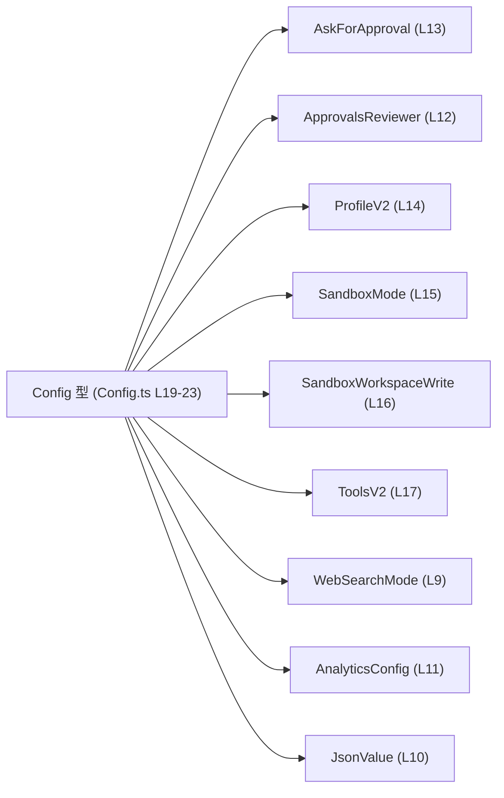
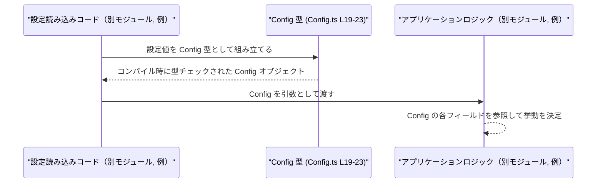

# app-server-protocol/schema/typescript/v2/Config.ts

## 0. ざっくり一言

- Rust 側の型から `ts-rs` によって自動生成された、アプリケーションサーバ用の設定オブジェクト `Config` の TypeScript 型定義ファイルです（Config.ts:L1-3, L19-23）。
- モデル選択・レビュー設定・サンドボックス・プロフィール・ツールなど、さまざまな設定項目を 1 つの型にまとめています（Config.ts:L19-23）。

---

## 1. このモジュールの役割

### 1.1 概要

- このモジュールは、アプリケーションサーバの設定情報を表現する `Config` 型を定義するために存在します（Config.ts:L19-23）。
- `Config` 型は、モデルやレビュー用モデル、サンドボックス、ツール、プロフィール、分析設定など多数の設定項目を一括して扱うためのスキーマを提供します（Config.ts:L19-23）。
- ファイル先頭のコメントから、この型は Rust 側の構造体から `ts-rs` により自動生成されており、手動編集しないことが前提です（Config.ts:L1-3）。

### 1.2 アーキテクチャ内での位置づけ

`Config` 型は、多数のサブ設定型に依存して構成されています。外部からは `export type Config` として公開されているため、他の TypeScript モジュールから import して利用可能です（Config.ts:L19）。

主要な依存関係を簡略化した依存関係図は次のとおりです。



- 図は「Config 型がどの型に依存しているか」のみを表します。
- `Config` 型を実際に import／利用しているモジュールは、このチャンクには現れないため不明です。

### 1.3 設計上のポイント

コードから読み取れる設計上の特徴は次のとおりです。

- **自動生成ファイルであること**  
  - 冒頭に「GENERATED CODE」「Do not edit manually」と明記されており（Config.ts:L1-3）、手動変更ではなく元となる Rust 側定義を変更する前提になっています。
- **強く型付けされた既知フィールド + 拡張用のインデックスシグネチャ**  
  - 既知の設定項目は個別のプロパティとして明示的に列挙されています（`model`, `web_search`, `analytics` など）（Config.ts:L19-23）。
  - さらに `& ({ [key in string]?: number | string | boolean | Array<JsonValue> | { [key in string]?: JsonValue } | null })` により、任意の文字列キーに JSON 互換の値を追加できる拡張性を持たせています（Config.ts:L19-23）。
- **`null` を用いた「未設定」の表現**  
  - 多くのフィールドが `T | null` の形になっており、プロパティ自体は必須だが「未設定」を `null` で表現する方針になっています（例: `model: string | null`）（Config.ts:L19-23）。
- **`bigint` による大きな数値の表現**  
  - `model_context_window` と `model_auto_compact_token_limit` は `bigint | null` として定義されており（Config.ts:L19-23）、トークン数など大きな整数値を安全に扱う前提が読み取れます。
- **サブ設定の分割**  
  - サンドボックス設定、承認フロー設定、ツール設定、分析設定などは、それぞれ専用の型（`SandboxMode`, `AskForApproval`, `ToolsV2`, `AnalyticsConfig` 等）に切り出され、それを組み合わせる構成になっています（Config.ts:L4-17, L19-23）。
- **コメントによる不安定機能の明示**  
  - `approvals_reviewer` フィールドには `[UNSTABLE]` とコメントが付いており（Config.ts:L19-22）、仕様が変わる可能性がある項目であることが示されています。

---

## 2. 主要な機能一覧

### 2.1 コンポーネントインベントリー（このチャンク）

このチャンクに現れる型・依存関係の一覧です。

| 名前 | 種別 | 定義/利用 | 役割 / 用途（コードから分かる範囲） | 根拠行 |
|------|------|-----------|----------------------------------------|--------|
| `Config` | 型エイリアス（オブジェクト型） | `export` | アプリケーションサーバ設定全体を表すルート設定オブジェクト | Config.ts:L19-23 |
| `ForcedLoginMethod` | 型（import） | フィールド `forced_login_method` の型 | ログイン方法に関する設定値の型として利用される | Config.ts:L4, L19-23 |
| `ReasoningEffort` | 型（import） | フィールド `model_reasoning_effort` の型 | 推論に関する「effort」設定を表す型として利用（詳細は別ファイル） | Config.ts:L5, L19-23 |
| `ReasoningSummary` | 型（import） | フィールド `model_reasoning_summary` の型 | 推論結果のサマリ設定を表す型として利用（詳細不明） | Config.ts:L6, L19-23 |
| `ServiceTier` | 型（import） | フィールド `service_tier` の型 | サービスの階層/プラン設定を表す型として利用 | Config.ts:L7, L19-23 |
| `Verbosity` | 型（import） | フィールド `model_verbosity` の型 | 出力の冗長さなどを表す設定型として利用 | Config.ts:L8, L19-23 |
| `WebSearchMode` | 型（import） | フィールド `web_search` の型 | Web 検索の利用モードを表す設定型として利用 | Config.ts:L9, L19-23 |
| `JsonValue` | 型（import） | インデックスシグネチャの値の一部 | 任意キーの値に使用される JSON 互換値の型 | Config.ts:L10, L19-23 |
| `AnalyticsConfig` | 型（import） | フィールド `analytics` の型 | 分析・トラッキング関連設定のサブ構造体型 | Config.ts:L11, L19-23 |
| `ApprovalsReviewer` | 型（import） | フィールド `approvals_reviewer` の型 | 承認レビューの宛先設定を表す型 | Config.ts:L12, L19-23 |
| `AskForApproval` | 型（import） | フィールド `approval_policy` の型 | 処理の承認ポリシーを表す型 | Config.ts:L13, L19-23 |
| `ProfileV2` | 型（import） | フィールド `profiles` の値型 | 各プロファイルの設定構造を表す型 | Config.ts:L14, L19-23 |
| `SandboxMode` | 型（import） | フィールド `sandbox_mode` の型 | サンドボックス実行モードを表す設定型 | Config.ts:L15, L19-23 |
| `SandboxWorkspaceWrite` | 型（import） | フィールド `sandbox_workspace_write` の型 | サンドボックスのワークスペースへの書き込み権限設定型 | Config.ts:L16, L19-23 |
| `ToolsV2` | 型（import） | フィールド `tools` の型 | 利用可能なツール群の設定構造を表す型 | Config.ts:L17, L19-23 |

※ 各 import された型の内部構造や列挙値は、このチャンクには現れないため不明です。

### 2.2 機能概要（この型が提供する主な役割）

- `Config` 設定オブジェクトのスキーマ定義  
  - サーバ側の設定データ構造を TypeScript で表現し、コンパイル時に型チェックを行えるようにする（Config.ts:L19-23）。
- 既知の設定項目の型付け  
  - モデル名、プロバイダ、サンドボックス、ツール、プロフィール、分析設定など、それぞれ専用の型で表現された設定項目をフィールドとして持ちます（Config.ts:L19-23）。
- 任意の追加設定フィールドの許容  
  - 既知フィールド以外にも、任意の文字列キーと JSON 互換値を持つ追加の設定項目を許容する柔軟なインデックスシグネチャを提供します（Config.ts:L19-23）。

---

## 3. 公開 API と詳細解説

### 3.1 型一覧（公開される主要な型）

| 名前 | 種別 | 役割 / 用途 | 定義箇所 |
|------|------|-------------|----------|
| `Config` | 型エイリアス（オブジェクト型） | アプリケーション／サーバのさまざまな設定を 1 つにまとめたルート設定オブジェクト | Config.ts:L19-23 |

このファイルで `export` されているのは `Config` 型のみです（Config.ts:L19）。

### 3.2 `Config` 型の詳細

#### 概要

- `Config` は、多数の設定項目を含むオブジェクト型であり、既知のフィールド群と任意キーの拡張フィールドの **交差型（intersection type）** として定義されています（Config.ts:L19-23）。
- ほとんどのフィールドが `T | null` 型であり、「キーは存在するが値が未設定」の状態を `null` で表現します（Config.ts:L19-23）。

```typescript
// 定義の概略（整形版）
export type Config =
  {
    model: string | null;
    review_model: string | null;
    model_context_window: bigint | null;
    model_auto_compact_token_limit: bigint | null;
    model_provider: string | null;
    approval_policy: AskForApproval | null;
    /**
     * [UNSTABLE] Optional default for where approval requests are routed for review.
     */
    approvals_reviewer: ApprovalsReviewer | null;
    sandbox_mode: SandboxMode | null;
    sandbox_workspace_write: SandboxWorkspaceWrite | null;
    forced_chatgpt_workspace_id: string | null;
    forced_login_method: ForcedLoginMethod | null;
    web_search: WebSearchMode | null;
    tools: ToolsV2 | null;
    profile: string | null;
    profiles: { [key in string]?: ProfileV2 };
    instructions: string | null;
    developer_instructions: string | null;
    compact_prompt: string | null;
    model_reasoning_effort: ReasoningEffort | null;
    model_reasoning_summary: ReasoningSummary | null;
    model_verbosity: Verbosity | null;
    service_tier: ServiceTier | null;
    analytics: AnalyticsConfig | null;
  }
  & {
    [key in string]?:
      | number
      | string
      | boolean
      | Array<JsonValue>
      | { [key in string]?: JsonValue }
      | null;
  };
```

※ 上記は可読性のために整形したものであり、元の定義の意味は変えていません（Config.ts:L19-23）。

#### フィールド一覧

| フィールド名 | 型 | 必須/任意 | 説明（名前から分かる範囲・仕様は不明な点も含む） | 根拠 |
|--------------|----|-----------|--------------------------------------------------|------|
| `model` | `string \| null` | 必須 | 利用するメインのモデル名（例: モデル ID）を表す文字列。未設定時は `null` | Config.ts:L19-23 |
| `review_model` | `string \| null` | 必須 | レビュー用途のモデル名を表す文字列。未設定時は `null` | Config.ts:L19-23 |
| `model_context_window` | `bigint \| null` | 必須 | モデルのコンテキストウィンドウサイズ（トークン数など）を表す大きな整数。未設定時は `null` | Config.ts:L19-23 |
| `model_auto_compact_token_limit` | `bigint \| null` | 必須 | 自動コンパクト（短縮）を行うトークン数の閾値を表す整数。未設定時は `null` | Config.ts:L19-23 |
| `model_provider` | `string \| null` | 必須 | モデルの提供元（プロバイダ）を表す文字列。未設定時は `null` | Config.ts:L19-23 |
| `approval_policy` | `AskForApproval \| null` | 必須 | 処理に対する承認ポリシーを表すサブ設定。未設定時は `null` | Config.ts:L19-23 |
| `approvals_reviewer` | `ApprovalsReviewer \| null` | 必須 | 承認要求がどこにルーティングされるかのデフォルト設定。コメントに `[UNSTABLE]` とあり仕様が不安定な項目 | Config.ts:L19-22, L23 |
| `sandbox_mode` | `SandboxMode \| null` | 必須 | サンドボックス実行モード設定。未設定時は `null` | Config.ts:L19-23 |
| `sandbox_workspace_write` | `SandboxWorkspaceWrite \| null` | 必須 | サンドボックス内ワークスペースへの書き込み許可設定。未設定時は `null` | Config.ts:L19-23 |
| `forced_chatgpt_workspace_id` | `string \| null` | 必須 | 強制的に利用する ChatGPT ワークスペース ID を表す文字列。未設定時は `null` | Config.ts:L19-23 |
| `forced_login_method` | `ForcedLoginMethod \| null` | 必須 | ログイン方法を強制する設定。未設定時は `null` | Config.ts:L19-23 |
| `web_search` | `WebSearchMode \| null` | 必須 | Web検索機能の利用モード設定。未設定時は `null` | Config.ts:L19-23 |
| `tools` | `ToolsV2 \| null` | 必須 | 利用可能なツール群の設定。未設定時は `null` | Config.ts:L19-23 |
| `profile` | `string \| null` | 必須 | 現在選択されているプロフィール名などを示す文字列。未設定時は `null` | Config.ts:L19-23 |
| `profiles` | `{ [key in string]?: ProfileV2 }` | 必須 | 複数のプロフィールを名前（文字列キー）ごとに保持するマップ。各キーの値は任意 (`?:`) で `ProfileV2` 型。空オブジェクトも許容 | Config.ts:L19-23 |
| `instructions` | `string \| null` | 必須 | 一般的な追加指示文を表す文字列。未設定時は `null` | Config.ts:L19-23 |
| `developer_instructions` | `string \| null` | 必須 | 開発者向けの追加指示文。未設定時は `null` | Config.ts:L19-23 |
| `compact_prompt` | `string \| null` | 必須 | プロンプト短縮用のテンプレートなどを表す文字列。未設定時は `null` | Config.ts:L19-23 |
| `model_reasoning_effort` | `ReasoningEffort \| null` | 必須 | 推論にどれだけリソースを割くかの設定。未設定時は `null` | Config.ts:L19-23 |
| `model_reasoning_summary` | `ReasoningSummary \| null` | 必須 | 推論結果をどの程度要約するかなどの設定。未設定時は `null` | Config.ts:L19-23 |
| `model_verbosity` | `Verbosity \| null` | 必須 | 応答の冗長さ・詳細度を表す設定。未設定時は `null` | Config.ts:L19-23 |
| `service_tier` | `ServiceTier \| null` | 必須 | 利用しているサービスプラン／レベルを表す設定。未設定時は `null` | Config.ts:L19-23 |
| `analytics` | `AnalyticsConfig \| null` | 必須 | 分析・計測関連の設定オブジェクト。未設定時は `null` | Config.ts:L19-23 |
| 任意キー | `number \| string \| boolean \| Array<JsonValue> \| { [key in string]?: JsonValue } \| null` | 任意 | 上記いずれの既知フィールドでもない任意の文字列キーに対し、JSON 互換な値を割り当て可能な拡張フィールド | Config.ts:L19-23 |

※ 「必須」は TypeScript 型としてプロパティが `?` ではなく必ず存在することを意味します。値が `null` を取れるため、「値が設定されている」とは限りません。

#### 型安全性 / エラーに関するポイント（TypeScript 固有）

- **コンパイル時の型チェック**  
  - `Config` 型に適合しないオブジェクトを代入すると、TypeScript のコンパイル時エラーになります（例: `model` に `number` を代入するなど）。これは通常の型チェック挙動であり、本ファイルもその対象です（Config.ts:L19-23）。
- **`null` の扱い**  
  - 多くのフィールドが `T | null` なので、利用側コードでは **`null` チェックが必須** です。  
  - `strictNullChecks` の有無による型チェックの厳密さは `tsconfig` に依存し、このチャンクからは分かりません。
- **`bigint` の扱い**  
  - `model_context_window` および `model_auto_compact_token_limit` は `bigint` を使うため、`number` 型と混在させるとコンパイルエラーになります（例: `bigint + number` はエラー）。  
  - これにより非常に大きなコンテキスト長でも安全に表現可能です（Config.ts:L19-23）。
- **拡張フィールドの型**  
  - インデックスシグネチャにより任意のキーを追加できますが、値は `number`, `string`, `boolean`, `JsonValue[]`, `{ [key: string]?: JsonValue }`, `null` のいずれかに制限されます（Config.ts:L19-23）。  
  - これにより、**「何でもあり」ではなく JSON 互換な値に限定**しつつ柔軟性を持たせています。
- **並行性**  
  - このファイルは型定義のみであり、非同期処理や共有状態を持つロジックは含んでいません。そのため、このモジュール単体に並行／並列実行に関する懸念はありません（Config.ts:L1-23）。

#### エッジケース

`Config` は型定義なので、自身が直接エラーを発生させることはありませんが、利用時に問題になりやすいケースとして次が挙げられます。

- **フィールド未設定 (`null`) の扱い**  
  - `model` などを文字列として直接使用しようとして、`null` の可能性を考慮していない場合、ランタイムで `null` に対するメソッド呼び出しエラーが起きる可能性があります。  
  - 例: `config.model.toUpperCase()` は `model` が `null` のときに例外になります。
- **必須プロパティの欠落**  
  - 型としては `profiles` などのプロパティは必須ですが（`?` がない）、`as Config` などの型アサーションで無理に型を合わせた場合、実際のオブジェクトにプロパティが存在せず、利用側で `config.profiles` を前提にアクセスすると `undefined` アクセスエラーにつながる可能性があります。
- **拡張フィールドのキー衝突**  
  - インデックスシグネチャで任意のキーが許容されるため、既知フィールド名と同名の拡張キーを追加してしまうような誤用が起こり得ます（TypeScript 的には同一プロパティとして扱われます）。  
  - こうした衝突を避けるために、利用側でキー名に一定の命名規則を設けるなどの工夫が必要になる可能性があります。

#### 潜在的なバグ / セキュリティ上の注意

この型自体はロジックを持ちませんが、設計上注意すべき点として次が挙げられます。

- **入力検証の必要性**  
  - インデックスシグネチャにより任意のキーが許容されるため、外部からの入力を `Config` にマッピングする場合、**許可されていないキーを拒否する／警告する** ためのバリデーションは別途必要になります。  
  - このチャンクにはバリデーション処理は含まれていません。
- **`bigint` とシリアライズ**  
  - `bigint` は標準の JSON では直接表現できません。`Config` を JSON として送受信する場合、`bigint` を文字列化する等の変換が別途必要になる可能性がありますが、その処理はこのチャンクには現れません。
- **`[UNSTABLE]` フィールドの利用**  
  - `approvals_reviewer` は `[UNSTABLE]` とコメントされています（Config.ts:L19-22）。利用側では、このフィールドの仕様変更や削除に備え、依存を最小限にするなどの配慮が必要になる可能性があります。

#### 使用上の注意点（まとめ）

- このファイルは **自動生成** なので、直接編集せず元の Rust 定義や生成設定を変更するべきです（Config.ts:L1-3）。
- `Config` の値を扱う際は、`null` 許容フィールドに対して **必ず null チェック** を行う前提で実装する必要があります（Config.ts:L19-23）。
- 拡張フィールド用の任意キーを多用すると、静的解析が難しくなるため、**既知フィールドを優先し、拡張は限定的に使う** 方針が安全です。

### 3.3 その他の関数

- このファイルには関数・メソッドは定義されていません（Config.ts:L1-23）。

---

## 4. データフロー

このチャンクには関数やメソッドが存在せず、`Config` 型の定義のみが含まれているため、**具体的な処理フローや呼び出し関係はコードからは読み取れません**（Config.ts:L1-23）。

ここでは、一般的な TypeScript プロジェクトで `Config` 型のような設定スキーマがどのように「構築され、利用されるか」の典型的なイメージを示します。これは **一般的な利用例であり、本リポジトリ固有の実装を示すものではありません。**



- 実際にどのモジュールが `Config` を構築し、どこで利用しているかは、このチャンクには現れません。
- `Config` 型は、上記のような「設定の読み込み／検証／利用」の流れを **型レベルで制約するためのスキーマ** として機能します。

---

## 5. 使い方（How to Use）

### 5.1 基本的な使用方法

`Config` 型を import し、最低限の設定を埋めたオブジェクトを作成する例です。  
（サブ設定型の具体的な中身はこのチャンクからは分からないため、ここではすべて `null` または空オブジェクトにしています。）

```typescript
// Config 型をインポートする                                // Config 型を利用できるようにインポート
import type { Config } from "./Config";                    // 同じディレクトリにある Config.ts から型のみを読み込む

// Config 型の値を作成する                                 // アプリケーションで利用する設定オブジェクトを構築
const config: Config = {                                   // Config 型としてコンパイル時チェックを受ける
  model: "gpt-4.1",                                        // 利用したいモデル名を文字列で指定（例）
  review_model: null,                                      // レビュー用モデルは未設定なので null
  model_context_window: null,                              // コンテキストウィンドウは未設定（大きな数を扱う場合は bigint）
  model_auto_compact_token_limit: null,                    // 自動コンパクトの閾値も未設定
  model_provider: "openai",                                // プロバイダ名（例）
  approval_policy: null,                                   // 承認ポリシーは未設定
  approvals_reviewer: null,                                // 承認レビュア設定は未設定（[UNSTABLE]）
  sandbox_mode: null,                                      // サンドボックスモードは未設定
  sandbox_workspace_write: null,                           // サンドボックス書き込み許可は未設定
  forced_chatgpt_workspace_id: null,                       // 強制ワークスペース ID は未設定
  forced_login_method: null,                               // 強制ログイン方法は未設定
  web_search: null,                                        // Web 検索モードは未設定
  tools: null,                                             // ツール設定は未設定
  profile: null,                                           // 現在のプロフィールは未設定
  profiles: {},                                            // プロフィール一覧は空オブジェクト
  instructions: null,                                      // 一般指示は未設定
  developer_instructions: null,                            // 開発者向け指示は未設定
  compact_prompt: null,                                    // コンパクトプロンプトは未設定
  model_reasoning_effort: null,                            // 推論 effort は未設定
  model_reasoning_summary: null,                           // 推論 summary 設定は未設定
  model_verbosity: null,                                   // 応答の冗長さ設定は未設定
  service_tier: null,                                      // サービスプランは未設定
  analytics: null,                                         // 分析設定は未設定
  // 任意の追加フィールドも定義可能                         // インデックスシグネチャにより任意キーを追加できる
  feature_flag_newUI: true,                                // 例: 新 UI フラグ（boolean は許容型）
  maxRetries: 3,                                           // 例: 最大リトライ回数（number は許容型）
};
```

このように `Config` 型を利用すると、設定オブジェクトの構造がコンパイル時に保証され、誤った型のフィールドを設定した場合は TypeScript がエラーとして検出します。

### 5.2 よくある使用パターン

#### パターン 1: `null` チェックを行って設定値を利用する

`Config` の大半のフィールドは `T | null` 型なので、利用前に `null` チェックを行うコードが一般的です。

```typescript
import type { Config } from "./Config";                    // Config 型のインポート

function getActiveModel(config: Config): string {          // Config から利用するモデル名を決定する関数
  // review_model が設定されていればそれを優先               // review_model の値が null でなければそれを返す
  if (config.review_model !== null) {                      // null チェックで安全に利用できるか判定
    return config.review_model;                            // review_model を返す（string 型）
  }

  // 次に model を参照                                      // review_model が null なら通常の model を参照
  if (config.model !== null) {                             // model も null チェック
    return config.model;                                   // model を返す
  }

  // どちらも未設定の場合のフォールバック                   // 両方 null の場合はフォールバック値を返す
  return "default-model";                                  // デフォルトのモデル名を返す
}
```

#### パターン 2: 任意キーによる拡張設定の利用

インデックスシグネチャを利用して、追加の設定値を柔軟に持たせることができます。

```typescript
import type { Config } from "./Config";                    // Config 型のインポート

// 任意の追加フィールドを利用する例                        // インデックスシグネチャを活用する例
function isNewUIEnabled(config: Config): boolean {         // 新 UI の有効/無効を判定する関数
  const value = config.feature_flag_newUI;                 // 追加フィールドにアクセス（型は boolean | ... | undefined）
  if (typeof value === "boolean") {                        // boolean であることを確認
    return value;                                          // その値を返す
  }
  return false;                                            // 未設定または他の型なら false をデフォルトとする
}
```

### 5.3 よくある間違い

```typescript
import type { Config } from "./Config";

// 間違い例: 必須プロパティを省略してオブジェクトリテラルを作成
// const badConfig: Config = {                             // コンパイル時に多くのフィールド欠落エラーが発生する
//   model: "gpt-4.1",                                     // model 以外の必須フィールドが定義されていない
// };

// 正しい例: すべての必須プロパティを用意し、不要なものは null / 空オブジェクトにする
const goodConfig: Config = {                               // Config 型に完全に一致するオブジェクトを構築
  model: "gpt-4.1",                                        // 必須フィールドを埋める
  review_model: null,
  model_context_window: null,
  model_auto_compact_token_limit: null,
  model_provider: null,
  approval_policy: null,
  approvals_reviewer: null,
  sandbox_mode: null,
  sandbox_workspace_write: null,
  forced_chatgpt_workspace_id: null,
  forced_login_method: null,
  web_search: null,
  tools: null,
  profile: null,
  profiles: {},                                            // 必須なので空オブジェクトでも用意する
  instructions: null,
  developer_instructions: null,
  compact_prompt: null,
  model_reasoning_effort: null,
  model_reasoning_summary: null,
  model_verbosity: null,
  service_tier: null,
  analytics: null,
};
```

その他の誤りパターン:

- `model` など `string | null` のフィールドに `undefined` を代入する（型に含まれないためコンパイルエラーになる）。
- `model_context_window` に `number` を代入する（`bigint` 型のみ許容されるためコンパイルエラー）。

### 5.4 使用上の注意点（まとめ）

- `Config` は自動生成ファイルであり、**直接編集せず** 元となる Rust 側定義や生成スクリプトを変更する必要があります（Config.ts:L1-3）。
- フィールドの多くが `null` 許容であるため、利用時には **必ず null チェック** を行う設計にする必要があります（Config.ts:L19-23）。
- 拡張用の任意キーは便利ですが、乱用すると設定スキーマが不透明になるため、**明示的フィールドを優先**し、追加キーは限定的に使うことが推奨されます。
- `bigint` フィールドを JSON などで外部へ出す場合は、別途変換処理が必要になる可能性があります。

---

## 6. 変更の仕方（How to Modify）

### 6.1 新しい機能を追加する場合

このファイルは明示的に「GENERATED CODE! DO NOT MODIFY BY HAND!」と記載されています（Config.ts:L1-3）。したがって、ここに直接コードを追加するのは前提に反します。

一般的な流れとしては次のようになります（具体的な Rust 側コードや生成設定はこのチャンクにはありません）。

1. **Rust 側の元となる型定義を変更する**  
   - `Config` に相当する Rust の構造体に新しいフィールドを追加するなど。
2. **`ts-rs` のコード生成を再実行する**  
   - これにより TypeScript 側の `Config` 型に新フィールドが自動で反映されます（Config.ts:L1-3 から、そうした作業フローが前提と読み取れます）。
3. **TypeScript 側の利用箇所を更新する**  
   - 新しいフィールドを読み書きするコードを追加しつつ、既存コードがコンパイルエラーになっていないか確認します。

このチャンクだけからは Rust 側のファイル名や生成コマンドは分かりません。

### 6.2 既存の機能を変更する場合

`Config` 型の既存フィールドを変更する場合も、同様に **自動生成元の定義を変更する** 必要があります。

変更時の注意点:

- **フィールド名の変更**  
  - `model` などのフィールド名を変更すると、TypeScript 側のすべての利用箇所がコンパイルエラーになります。影響範囲を検索して一括修正する必要があります。
- **フィールド型の変更**  
  - 例えば `string | null` を `string` のみにすると、「null を許容していたコード」がコンパイルエラーとなります。これは意図した仕様変更であれば、利用側の `null` ハンドリングを見直す必要があります。
- **インデックスシグネチャの変更**  
  - 拡張フィールドに許容する型（`number`, `string`, `boolean`, `Array<JsonValue>`, etc.）を変更すると、任意キーを使っているコードに影響します（Config.ts:L19-23）。
- **テストの確認**  
  - このチャンクにはテストコードは含まれていません。実際の変更時には、別のテストファイルや統合テストを実行して挙動を確認する必要があります（テストの場所はこのチャンクからは不明です）。

---

## 7. 関連ファイル

このモジュールと密接に関係するファイルは、import されている型定義です。相対パスはこのファイルからのものです。

| パス | 役割 / 関係 | 根拠 |
|------|------------|------|
| `../ForcedLoginMethod` | `Config.forced_login_method` フィールドの型を提供する | Config.ts:L4, L19-23 |
| `../ReasoningEffort` | `Config.model_reasoning_effort` フィールドの型を提供する | Config.ts:L5, L19-23 |
| `../ReasoningSummary` | `Config.model_reasoning_summary` フィールドの型を提供する | Config.ts:L6, L19-23 |
| `../ServiceTier` | `Config.service_tier` フィールドの型を提供する | Config.ts:L7, L19-23 |
| `../Verbosity` | `Config.model_verbosity` フィールドの型を提供する | Config.ts:L8, L19-23 |
| `../WebSearchMode` | `Config.web_search` フィールドの型を提供する | Config.ts:L9, L19-23 |
| `../serde_json/JsonValue` | インデックスシグネチャの値およびネストしたオブジェクトの値の型を提供する | Config.ts:L10, L19-23 |
| `./AnalyticsConfig` | `Config.analytics` フィールドのサブ設定型を提供する | Config.ts:L11, L19-23 |
| `./ApprovalsReviewer` | `Config.approvals_reviewer` フィールドのサブ設定型を提供する | Config.ts:L12, L19-23 |
| `./AskForApproval` | `Config.approval_policy` フィールドのサブ設定型を提供する | Config.ts:L13, L19-23 |
| `./ProfileV2` | `Config.profiles` の値型を提供する | Config.ts:L14, L19-23 |
| `./SandboxMode` | `Config.sandbox_mode` フィールドのサブ設定型を提供する | Config.ts:L15, L19-23 |
| `./SandboxWorkspaceWrite` | `Config.sandbox_workspace_write` フィールドのサブ設定型を提供する | Config.ts:L16, L19-23 |
| `./ToolsV2` | `Config.tools` フィールドのサブ設定型を提供する | Config.ts:L17, L19-23 |

これらのファイルの中身はこのチャンクには含まれていないため、各サブ設定の詳細な仕様や列挙値は不明です。
