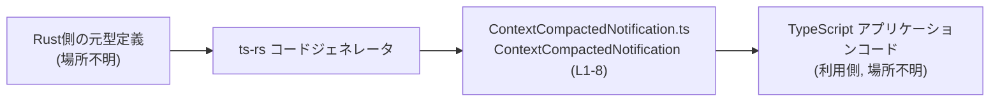
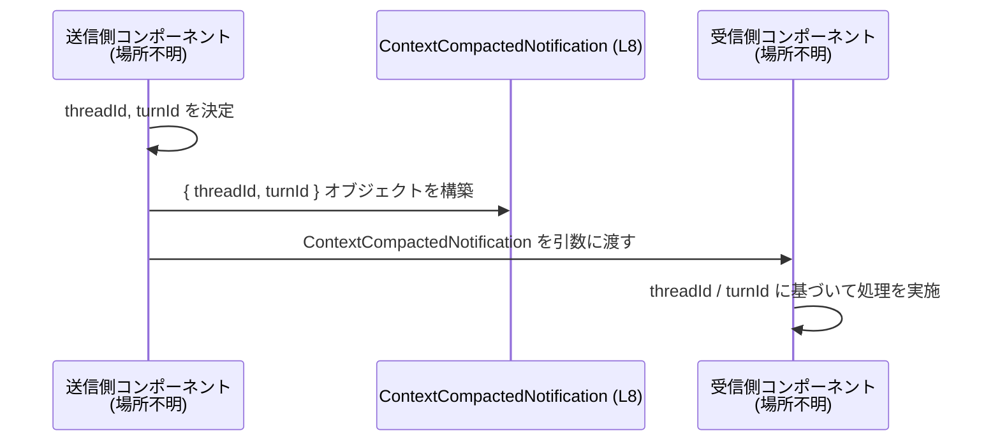

# app-server-protocol/schema/typescript/v2/ContextCompactedNotification.ts コード解説

## 0. ざっくり一言

このファイルは、`ContextCompactedNotification` という **通知データの形を表す TypeScript 型エイリアス** を 1 つだけ公開する自動生成ファイルです（ContextCompactedNotification.ts:L1-3, L8）。  
コメントにより、この型は非推奨であり、代わりに `ContextCompaction` という item type を使うことが示されています（ContextCompactedNotification.ts:L5-7）。

---

## 1. このモジュールの役割

### 1.1 概要

- このモジュールは、`threadId` と `turnId` という 2 つの文字列プロパティを持つオブジェクト型 `ContextCompactedNotification` を定義します（ContextCompactedNotification.ts:L8）。
- ファイル全体は `ts-rs` によって Rust 側の型定義から自動生成されており、手動で編集しないことが明示されています（ContextCompactedNotification.ts:L1-3）。
- JSDoc コメントにより、この型は **Deprecated**（非推奨）であり、今後は `ContextCompaction` item type の利用が推奨されています（ContextCompactedNotification.ts:L5-7）。

### 1.2 アーキテクチャ内での位置づけ

- ディレクトリ構成 `schema/typescript/v2` から、このファイルはアプリケーションサーバプロトコルの **TypeScript スキーマ（バージョン 2）** を構成する型群の一部である可能性があります。ただし、他ファイルがこのチャンクには含まれていないため、これは推測レベルです。
- コメントより、Rust 側の型定義 → `ts-rs` によるコード生成 → TypeScript 側の利用、というパイプラインの一部であることが分かります（ContextCompactedNotification.ts:L1-3）。

この関係を簡略化して図示すると、次のようになります（`ContextCompactedNotification (L1-8)` が本チャンクのコード範囲です）:



### 1.3 設計上のポイント

- **自動生成ファイルであることが明示**  
  - 「GENERATED CODE」「Do not edit this file manually」とあり、手動編集禁止が明確です（ContextCompactedNotification.ts:L1-3）。
- **単一の型エイリアスのみを公開**  
  - ランタイム処理や関数は一切なく、静的な型情報のみを提供します（ContextCompactedNotification.ts:L8）。
- **非推奨マーカー付き**  
  - JSDoc コメントで Deprecated とされ、代替の `ContextCompaction` item type の使用が指示されています（ContextCompactedNotification.ts:L5-7）。
- **状態・エラー・並行性を持たない**  
  - 型定義だけであり、内部状態やエラーハンドリング・並行処理に関するロジックは存在しません（ContextCompactedNotification.ts:L8）。

---

## 2. 主要な機能一覧

このモジュールが提供する機能は 1 つだけです。

- `ContextCompactedNotification` 型の定義:  
  `threadId` と `turnId` という 2 つの必須 `string` プロパティを持つ通知オブジェクトの形を表す型エイリアスです（ContextCompactedNotification.ts:L8）。

---

## 3. 公開 API と詳細解説

### 3.1 型一覧（構造体・列挙体など）

このファイルが公開する主要な型の一覧です。

| 名前                           | 種別           | 役割 / 用途概要                                                                                     | 定義箇所                                   |
|--------------------------------|----------------|------------------------------------------------------------------------------------------------------|--------------------------------------------|
| `ContextCompactedNotification` | 型エイリアス   | `threadId` と `turnId` を持つ通知オブジェクトの構造を表現する。Deprecated であり、代替型の使用が推奨。 | ContextCompactedNotification.ts:L5-8       |

フィールドレベルで見ると、以下のようなオブジェクト型です（ContextCompactedNotification.ts:L8）。

```ts
export type ContextCompactedNotification = {
    threadId: string;  // スレッドを識別する ID と考えられるが、用途はこのチャンクからは不明
    turnId: string;    // 「ターン」を識別する ID と考えられるが、用途はこのチャンクからは不明
};
```

> `threadId` / `turnId` の具体的な意味やフォーマットは、このチャンクには現れていません。名前から用途が想定されますが、コードだけでは断定できません。

### 3.2 関数詳細（最大 7 件）

このファイルには **関数・メソッドは一切定義されていません**（ContextCompactedNotification.ts:L1-8）。  
そのため、関数詳細テンプレートに沿って解説すべき対象はありません。

### 3.3 その他の関数

- なし（補助関数・ラッパー関数を含め、関数定義は存在しません）（ContextCompactedNotification.ts:L1-8）。

---

## 4. データフロー

このファイルには実際の処理コードが存在しないため、**実際にどこからどのように呼ばれているかはこのチャンクからは分かりません**。  
ここでは、一般的な「通知ペイロード型」の利用パターンとしての **概念的なデータフロー例** を示します。

> 注意: 以下の図は「通知を表す型」が一般にどのように使われるかのイメージであり、  
> このプロジェクト内での実際の呼び出し関係を示すものではありません。



このイメージから分かるポイント:

- **型レベルの契約**:  
  送信側・受信側の両者が「`threadId` / `turnId` を必ず含むオブジェクトをやり取りする」という契約を共有するための型として機能します（ContextCompactedNotification.ts:L8）。
- **言語固有の安全性**:  
  TypeScript による静的型チェックにより、`threadId` や `turnId` の渡し忘れ・型不一致（数値を渡すなど）がコンパイル時に検出されます。ただしオブジェクトの中身（空文字列など）の妥当性は別途ロジックが必要です。

---

## 5. 使い方（How to Use）

### 5.1 基本的な使用方法

この型の典型的な利用は、「関数の引数」「戻り値」「変数の型」として **通知オブジェクトの形を明示する** ことです。

以下は、同一ディレクトリから相対パスでインポートする例です（実際のパスはプロジェクト構成に依存します）。

```ts
// ContextCompactedNotification 型をインポートする
import type { ContextCompactedNotification } from "./ContextCompactedNotification";

// 通知を処理する関数の例
function handleNotification(notification: ContextCompactedNotification) {
    // notification.threadId は string 型として扱える
    console.log("thread:", notification.threadId);

    // notification.turnId も string 型
    console.log("turn:", notification.turnId);
}

// どこか別の場所で、通知オブジェクトを構築して渡す
const n: ContextCompactedNotification = {
    threadId: "thread-123",  // string である必要がある
    turnId: "turn-456",      // string である必要がある
};

handleNotification(n);
```

このコードでは:

- `threadId` / `turnId` を省略したり、数値を渡したりするとコンパイルエラーになります（ContextCompactedNotification.ts:L8）。
- 実行時の検証は行っていないため、フォーマットの妥当性チェックなどは別途実装する必要があります。

> なお、コメントによりこの型は Deprecated であり、可能であれば新規コードでは代替の `ContextCompaction` item type を使うことが推奨されます（ContextCompactedNotification.ts:L5-7）。

### 5.2 よくある使用パターン

1. **関数の引数・戻り値として利用**

```ts
import type { ContextCompactedNotification } from "./ContextCompactedNotification";

function fetchNotification(): Promise<ContextCompactedNotification> {
    // ここでは型のみを示し、実装は省略
    return Promise.resolve({
        threadId: "t1",
        turnId: "u1",
    });
}

async function main() {
    const notif = await fetchNotification(); // notif は ContextCompactedNotification 型
    console.log(notif.threadId, notif.turnId);
}
```

1. **配列やユニオン型の要素として利用**

```ts
import type { ContextCompactedNotification } from "./ContextCompactedNotification";

type NotificationQueue = ContextCompactedNotification[]; // 配列としてキューを表現

const queue: NotificationQueue = [];
queue.push({ threadId: "t1", turnId: "u1" }); // 正しい形を強制できる
```

### 5.3 よくある間違い

```ts
import type { ContextCompactedNotification } from "./ContextCompactedNotification";

// ❌ 誤用例 1: 必須プロパティの欠落
const invalid1: ContextCompactedNotification = {
    threadId: "t1",
    // turnId がない → コンパイルエラー
};

// ❌ 誤用例 2: 型不一致
const invalid2: ContextCompactedNotification = {
    threadId: 123,     // number → string ではないのでコンパイルエラー
    turnId: "u1",
};

// ❌ 誤用例 3: any を介して静的型チェックを回避してしまう
const payload: any = getUnknownPayload();
const notif: ContextCompactedNotification = payload; // コンパイルは通るが、実行時に shape が違う可能性がある
```

また、このファイル自体に対する誤用も考えられます。

```ts
// ❌ 誤用例 4: 自動生成ファイルを直接編集してしまう
// コメントにより "Do not edit this file manually" と明示されているため、
// 手動で変更すると次回のコード生成で上書きされる可能性が高いです（ContextCompactedNotification.ts:L1-3）。
```

### 5.4 使用上の注意点（まとめ）

- **非推奨であること**  
  - コメント上 `Deprecated` とされており、新規コードでは `ContextCompaction` item type の使用が推奨されています（ContextCompactedNotification.ts:L5-7）。
- **静的型チェックに依存**  
  - `threadId` / `turnId` が `string` であることだけを保証し、値の中身（フォーマットや存在チェックなど）は保証しません（ContextCompactedNotification.ts:L8）。
- **自動生成ファイルであること**  
  - 実装変更やフィールド追加をこのファイルに対して直接行うべきではなく、元となる Rust 側の型定義や `ts-rs` 設定を変更する必要があります（ContextCompactedNotification.ts:L1-3）。
- **並行性・エラー処理の責務は持たない**  
  - この型は単なるデータ形状の宣言であり、並行処理やエラーハンドリングは呼び出し元のロジック側で扱う必要があります。

---

## 6. 変更の仕方（How to Modify）

### 6.1 新しい機能を追加する場合

ここでいう「新しい機能」とは、例えば通知ペイロードに新しいフィールドを追加することなどを指します。

- **このファイルを直接編集しないこと**  
  - 冒頭コメントにある通り、このファイルは `ts-rs` により自動生成されており、手動編集は推奨されません（ContextCompactedNotification.ts:L1-3）。
- **変更すべき場所**  
  - 元となる Rust 側の型定義（具体的なファイル・型名はこのチャンクには現れていません）を変更し、`ts-rs` による再生成を行う必要があります。
- **追加時の注意点**  
  - この型は Deprecated であるため、新しいフィールドを追加するのではなく、代替の `ContextCompaction` item type に対して機能追加する設計が適切な可能性があります（ContextCompactedNotification.ts:L5-7）。

### 6.2 既存の機能を変更する場合

`threadId` や `turnId` の型・名前・意味を変えるような変更を行う場合の注意点です。

- **影響範囲の確認**  
  - `ContextCompactedNotification` 型を利用している全ての TypeScript コードに影響します。利用箇所はこのチャンクには現れないため、エディタのシンボル検索などで確認する必要があります。
- **契約の変更**  
  - プロパティ名や型を変更すると、プロトコル仕様そのものの変更になります。サーバ・クライアント双方の実装が同時に更新されていることを確認する必要があります。
- **自動生成の再実行**  
  - こちらも、変更は Rust 側の元定義や `ts-rs` 設定に対して行い、TypeScript コードは再生成させるべきです（ContextCompactedNotification.ts:L1-3）。
- **Deprecated の扱い**  
  - 既存の利用コードがある場合は、`ContextCompaction` への段階的な移行（両方をしばらくサポートするなど）が必要になる可能性がありますが、実際の移行方針はこのチャンクからは分かりません。

---

## 7. 関連ファイル

このチャンクに現れる情報から推測できる、関連性の高い要素を整理します。

| パス / 名称                     | 役割 / 関係                                                                                   |
|--------------------------------|----------------------------------------------------------------------------------------------|
| `ContextCompaction` (場所不明) | JSDoc コメントで、`ContextCompactedNotification` の代替として推奨されている item type（ContextCompactedNotification.ts:L5-7）。定義場所・具体的な構造はこのチャンクには現れません。 |
| Rust 側の元型定義 (場所不明)   | `ts-rs` が参照している元の Rust 型。ここを変更することで本ファイルの内容が変化すると考えられますが、ファイル名や型名は不明です（ContextCompactedNotification.ts:L1-3）。 |
| `app-server-protocol/schema/typescript/v2/` 配下の他ファイル | 同じスキーマバージョン v2 の型定義群と推測されますが、このチャンクには具体的なファイル一覧は現れていません。 |

---

## コンポーネントインベントリー（このチャンクのまとめ）

最後に、このチャンク内に実際に現れるコンポーネントを表として整理します。

| 種別       | 名前                           | 概要                                           | 根拠行番号                                  |
|------------|--------------------------------|------------------------------------------------|---------------------------------------------|
| 型エイリアス | `ContextCompactedNotification` | `threadId: string` と `turnId: string` を持つ通知オブジェクトの型。Deprecated。 | ContextCompactedNotification.ts:L5-8        |
| コメント   | 自動生成ファイルの注意書き     | `ts-rs` による生成コードであり、手動編集禁止であることを示すコメント。        | ContextCompactedNotification.ts:L1-3        |
| コメント   | Deprecated JSDoc               | `ContextCompaction` item type の使用を促す非推奨コメント。                     | ContextCompactedNotification.ts:L5-7        |

このチャンクには、他の型・関数・クラス・列挙体・定数などは現れていません（ContextCompactedNotification.ts:L1-8）。
