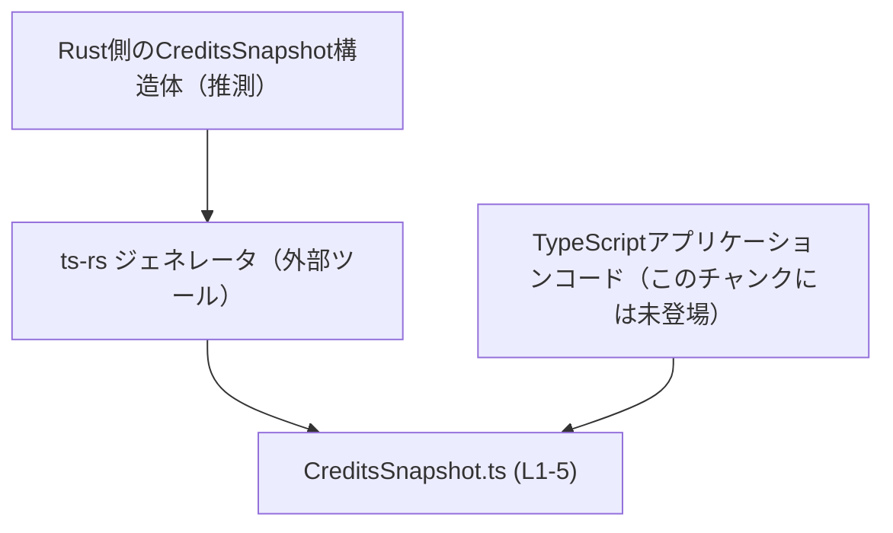
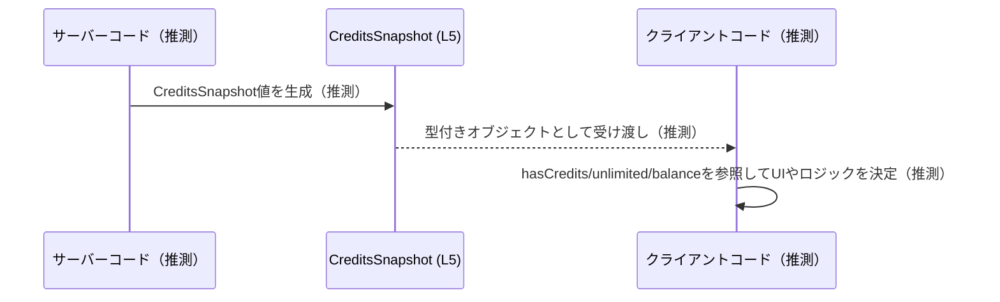

# app-server-protocol/schema/typescript/v2/CreditsSnapshot.ts

## 0. ざっくり一言

`CreditsSnapshot` という1つの型エイリアスをエクスポートし、クレジット関連の状態を表現するためのスキーマ（型定義）を提供するファイルです（`CreditsSnapshot.ts:L5-5`）。  
このファイルは `ts-rs` による自動生成コードであり、手動編集しない前提になっています（`CreditsSnapshot.ts:L1-3`）。

---

## 1. このモジュールの役割

### 1.1 概要

- このモジュールは、クレジット状態を示す3つのプロパティを持つ `CreditsSnapshot` 型を定義します（`CreditsSnapshot.ts:L5-5`）。
- コメントから、この型は Rust 側の型を [`ts-rs`](https://github.com/Aleph-Alpha/ts-rs) で TypeScript に変換した結果であり、プロトコル／スキーマ層の「データ構造の定義」に特化していると読み取れます（`CreditsSnapshot.ts:L1-3`）。

### 1.2 アーキテクチャ内での位置づけ

コードから直接分かるのは「生成された型定義」であることと、他モジュールへの依存がないことだけです（`CreditsSnapshot.ts:L1-5`）。  
以下の図は、コメントとパスから推測した位置づけのイメージであり、**このチャンクには登場しない周辺コンポーネントを含む推測図**です。



- `CreditsSnapshot.ts` 自体は、他の TypeScript ファイルを import しておらず、純粋な型定義モジュールになっています（`CreditsSnapshot.ts:L5-5`）。
- 実際にどのモジュールから使われているかは、このチャンクからは分かりません。

### 1.3 設計上のポイント

- 自動生成コードであり、「手で編集しないこと」が前提になっています（`CreditsSnapshot.ts:L1-3`）。
- 状態やロジックを持たず、`type` エイリアスとして構造だけを定義しています（`CreditsSnapshot.ts:L5-5`）。
- フィールドはすべてプリミティブまたは `null` を含むユニオン型で表現されており、特別なクラスやメソッドはありません（`CreditsSnapshot.ts:L5-5`）。
- `balance` が `string | null` になっているため、「存在しない（未取得・不明）ケース」を `null` で表現しつつ、存在する場合は文字列として扱う形になっています（`CreditsSnapshot.ts:L5-5`）。

---

## 2. 主要な機能一覧

このファイルの「機能」は型定義のみです。

- `CreditsSnapshot` 型定義: クレジット状態（`hasCredits`・`unlimited`・`balance`）を表すオブジェクト型を提供する（`CreditsSnapshot.ts:L5-5`）。

---

## 3. 公開 API と詳細解説

### 3.1 型一覧（構造体・列挙体など）

| 名前               | 種別       | 役割 / 用途                                                                 | 主なフィールド                                                                                     | 根拠                              |
|--------------------|------------|----------------------------------------------------------------------------|-----------------------------------------------------------------------------------------------------|-----------------------------------|
| `CreditsSnapshot`  | 型エイリアス | クレジット状態を表すためのオブジェクト構造。プロトコル／APIレスポンス等のスキーマとして利用されることが想定されます。※用途は推測 | `hasCredits: boolean`, `unlimited: boolean`, `balance: string \| null`                             | `CreditsSnapshot.ts:L5-5`         |

※ 用途（プロトコル／APIレスポンスとしての利用）はファイル名・パスからの推測であり、コードからは断定できません。

#### フィールド概要

すべて `CreditsSnapshot` のプロパティです（`CreditsSnapshot.ts:L5-5`）。

- `hasCredits: boolean`
  - クレジットを「保有しているかどうか」を表す真偽値であると解釈できますが、厳密な意味はコードからは分かりません。
- `unlimited: boolean`
  - クレジットが「無制限かどうか」を示すフラグのように読み取れますが、詳細な定義は不明です。
- `balance: string | null`
  - クレジット残高を表す文字列、または情報が無い／未設定状態を表す `null`。
  - 数値ではなく `string` である理由やフォーマット（例: `"100.00"` なのか `"100"` なのか）は、このチャンクからは分かりません。

### 3.2 関数詳細（最大 7 件）

このファイルには関数／メソッドは定義されていません（コメントと `export type` の1文のみです。`CreditsSnapshot.ts:L1-5`）。  
したがって、詳細解説対象となる関数はありません。

### 3.3 その他の関数

補助関数やラッパー関数も存在しません（`CreditsSnapshot.ts:L1-5`）。

---

## 4. データフロー

このファイルにはデータの生成・送受信ロジックは含まれていませんが、`CreditsSnapshot` がプロトコルスキーマとして使われる一般的なイメージを示します。  
**以下は型名・パスからの推測に基づく概念図であり、実際の実装はこのチャンクからは確認できません。**



要点（あくまで想定される使い方）:

- どこかのレイヤーで `CreditsSnapshot` 型のオブジェクトが生成される。
- それが API のレスポンスや内部メッセージとして別コンポーネントに渡される。
- 受け取った側は `hasCredits` / `unlimited` / `balance` の組み合わせに応じて挙動を変える。

この流れ自体は一般的な「スキーマ型の使い方」の例であり、本チャンクのコードから直接は読み取れません。

---

## 5. 使い方（How to Use）

### 5.1 基本的な使用方法

`CreditsSnapshot` をインポートして、クレジット状態を表すオブジェクトとして利用する例です。

```typescript
// CreditsSnapshot型をインポートする（実際のパスはプロジェクト構成に依存する）
import type { CreditsSnapshot } from "./CreditsSnapshot";  // 型の名前はコードから確定（CreditsSnapshot.ts:L5-5）

// クレジットを持ち、無制限ではなく、残高が"100.00"である状態の例
const snapshot: CreditsSnapshot = {
    hasCredits: true,      // クレジットを保持している（意味の詳細はコードからは不明）
    unlimited: false,      // 無制限ではない
    balance: "100.00",     // 残高を文字列として保持（フォーマットはシステム依存）
};

// balanceが取得できていない／不明な場合の例
const unknownBalance: CreditsSnapshot = {
    hasCredits: false,
    unlimited: false,
    balance: null,         // balanceがnullでも型的には許容される（CreditsSnapshot.ts:L5-5）
};
```

ポイント:

- TypeScript の型チェックにより、`hasCredits` / `unlimited` に boolean 以外を代入するとコンパイルエラーになります。
- `balance` には `string` か `null` しか代入できません。

### 5.2 よくある使用パターン

`CreditsSnapshot` の値から表示用のメッセージを組み立てる例です。  
`balance` が `null` になりうるため、その分岐が重要です。

```typescript
import type { CreditsSnapshot } from "./CreditsSnapshot";

// スナップショットから説明文を生成する例
function describeCredits(snapshot: CreditsSnapshot): string {
    // 無制限が優先されるというロジックはこの例での仮定であり、コードからは分かりません
    if (snapshot.unlimited) {
        return "クレジットは無制限です。";
    }

    // balanceがnullでない場合のみ残高を表示
    if (snapshot.balance !== null) {
        return `残りクレジット: ${snapshot.balance}`;
    }

    // hasCredits が false かつ balance が null のケースの扱いはシステム仕様次第
    return "クレジット情報は利用できません。";
}
```

ここで示している条件分岐の仕様は例示的なものであり、実システムの契約はコードからは分かりません。

### 5.3 よくある間違い

`balance` の `null` を考慮しないコードは、実行時エラーの原因になります。

```typescript
import type { CreditsSnapshot } from "./CreditsSnapshot";

// 間違い例: balanceを常にstringとして扱っている
function wrongUsage(snapshot: CreditsSnapshot) {
    // snapshot.balanceがnullの可能性があるため、
    // strictNullChecksが有効ならコンパイルエラー、無効なら実行時にエラーになりうる
    console.log(snapshot.balance.toUpperCase());  // NG: nullのときに例外
}

// 正しい例: nullをチェックしてから使用する
function correctUsage(snapshot: CreditsSnapshot) {
    if (snapshot.balance !== null) {
        console.log(snapshot.balance.toUpperCase());  // OK: ここではstringに絞り込まれている
    } else {
        console.log("残高情報なし");
    }
}
```

### 5.4 使用上の注意点（まとめ）

- `balance` は `null` を取りうるため、文字列メソッド呼び出しや数値変換の前に必ず `null` チェックが必要です（`CreditsSnapshot.ts:L5-5`）。
- TypeScript の型は実行時には消えるため、**値の妥当性（例: 残高が負になっていないか）** までは保証されません。必要ならランタイムバリデーションを別途実装する必要があります。
- このファイルは自動生成であり、直接編集すると生成プロセスで上書きされる可能性があります（`CreditsSnapshot.ts:L1-3`）。

---

## 6. 変更の仕方（How to Modify）

### 6.1 新しい機能を追加する場合

このファイルは `ts-rs` による生成コードであり、先頭コメントで「手動で編集しないように」と明示されています（`CreditsSnapshot.ts:L1-3`）。  
したがって、**このファイル自体に新しいプロパティを追記するのは推奨されません。**

一般的な手順（コメントからの推測を含みます）:

1. `ts-rs` の生成元となる Rust の型定義（おそらく `struct CreditsSnapshot` など）を探す。  
   - 具体的なパスやモジュール名はこのチャンクからは分かりません。
2. Rust 側の型にフィールドを追加・変更し、`ts-rs` が参照するアトリビュート等を調整する。
3. 生成コマンドを実行し、`CreditsSnapshot.ts` を再生成する。
4. 変更したフィールドに依存する TypeScript 側のコード（コンパイルエラーで検知される）を修正する。

### 6.2 既存の機能を変更する場合

`CreditsSnapshot` のフィールドを変更・削除する場合の注意点（一般論）:

- **型互換性の破壊**:
  - フィールド名を変更したり削除すると、既存の TypeScript コードがコンパイルエラーになるか、`any` 等で逃げている部分では実行時エラーにつながる可能性があります。
- **プロトコル互換性**:
  - この型が API のリクエスト／レスポンスに使われている場合、サーバーとクライアントの間でバージョン差異による不整合が発生しうる点に注意が必要です（コードからは実際に使われているかは不明ですが、パスから推測されます）。
- **テスト**:
  - このチャンクにはテストコードは含まれていませんが、スキーマ変更時は関連するユニットテスト・統合テスト・プロトコル互換テストを実行することが望ましいです。

---

## 7. 関連ファイル

このチャンクには他ファイルの情報は含まれていないため、正確な関連ファイルの一覧は分かりません。  
ファイルパスとコメントから推測される関連要素を、推測であることを明示したうえで列挙します。

| パス / 要素                           | 役割 / 関係 |
|--------------------------------------|------------|
| `app-server-protocol/schema/typescript/v2/` ディレクトリ | 同じスキーマバージョン `v2` の他の TypeScript 型定義ファイルが存在すると考えられますが、具体的なファイル名はこのチャンクからは分かりません（推測）。 |
| Rust 側のスキーマ定義（パス不明）     | コメントにある `ts-rs` の生成元となる Rust の型。ここを変更することで `CreditsSnapshot.ts` が再生成されると考えられますが、位置や名称は不明です（`CreditsSnapshot.ts:L1-3` に基づく推測）。 |

---

### まとめ（安全性・エッジケース・バグ／セキュリティ観点）

- **安全性 / エラー**:
  - このファイルにはロジックが存在せず、型定義のみなので、直接的なバグやセキュリティホールはありません（`CreditsSnapshot.ts:L1-5`）。
  - 利用側では `balance: string | null` を適切に扱うことが重要です。`null` を無視すると実行時例外の原因になります。
- **エッジケース（契約）**:
  - `balance === null` の意味（例: 未取得／エラー／非対応）はコードからは読み取れません。実装・仕様書で確認が必要です。
  - `hasCredits` と `unlimited` の組み合わせの許容パターン（例: `hasCredits=false` かつ `unlimited=true` が有効かどうか）も、このファイルだけでは分かりません。
- **性能・スケーラビリティ・並行性**:
  - 単なるデータ型定義であり、計算や I/O を行わないため、性能・並行性上の懸念はありません。
- **セキュリティ**:
  - この型自体は入力値の検証を行いません。信頼できない入力（外部からの JSON など）に対しては別途バリデーションが必要です。
