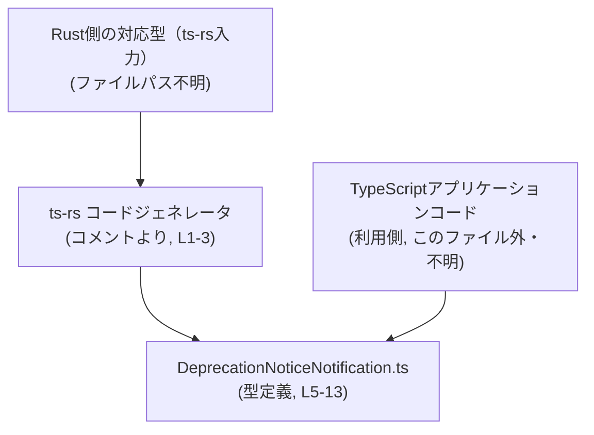
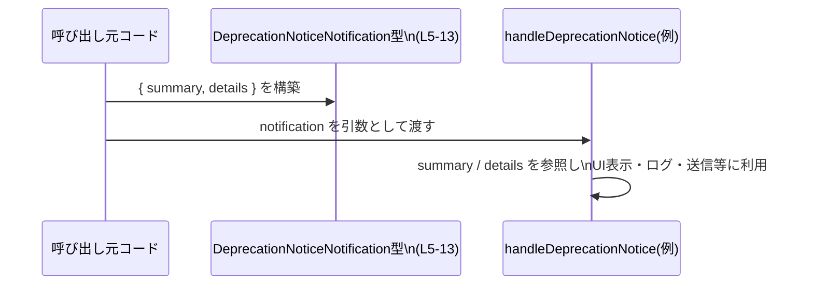

# app-server-protocol/schema/typescript/v2/DeprecationNoticeNotification.ts コード解説

## 0. ざっくり一言

`DeprecationNoticeNotification` という名前の **「非推奨通知」を表す TypeScript 型** を定義した、自動生成ファイルです（`export type ...` 定義, `DeprecationNoticeNotification.ts:L5-13`）。  

---

## 1. このモジュールの役割

### 1.1 概要

- このモジュールは、app-server-protocol の TypeScript スキーマ（`schema/typescript/v2`）の一部として、
  「非推奨になった対象に関する通知メッセージ」の構造を型として表現します  
  （型名とコメントからの解釈, `DeprecationNoticeNotification.ts:L5-13`）。
- 具体的には、必須の短い説明（`summary`）と、任意の追加説明（`details: string | null`）を保持するオブジェクト型です（`DeprecationNoticeNotification.ts:L9-13`）。

### 1.2 アーキテクチャ内での位置づけ

- ファイル先頭コメントから、このファイルは Rust 向けライブラリ **ts-rs** による自動生成物であり、Rust 側の対応する型定義から生成されていることが分かります  
  （`DeprecationNoticeNotification.ts:L1-3`）。
- この TypeScript 型は、プロトコルに沿ってデータを送受信するアプリケーションコードから `import` されて利用されることが想定されますが、具体的な利用元ファイルはこのチャンクには現れません（import 文が存在しないため, `DeprecationNoticeNotification.ts:L1-13`）。

この関係のイメージ（生成・利用の流れ）を Mermaid 図で示します。



> Rust 側の型とアプリケーションコードは、コメントとディレクトリ構成・ts-rs の一般的な利用方法から推測できる位置づけですが、具体的ファイル名や内容はこのチャンクには現れません。

### 1.3 設計上のポイント

- **自動生成であり手動変更禁止**  
  - 先頭コメントで「GENERATED CODE」「Do not edit this file manually」と明示されています  
    （`DeprecationNoticeNotification.ts:L1-3`）。
- **状態やロジックを持たないプレーンなデータ型**  
  - 関数やクラスは定義されておらず、オブジェクト型エイリアスのみを `export` しています  
    （`export type ... = { ... }`, `DeprecationNoticeNotification.ts:L5-13`）。
- **null 可能な詳細フィールド**  
  - `details: string | null` という union 型で表現され、詳細説明が存在しないケースを `null` で区別します  
    （`DeprecationNoticeNotification.ts:L11-13`）。
- **エラーハンドリング・並行性は持たない**  
  - 型定義のみで実行時コードがないため、このモジュール単体ではエラー処理や並行処理のロジックは存在しません（ファイル全体に関数・処理がないことから, `DeprecationNoticeNotification.ts:L1-13`）。

---

## 2. 主要な機能一覧

※「機能」はここでは**提供される型とフィールド**を指します。

- `DeprecationNoticeNotification` 型: 非推奨通知オブジェクトの構造を定義する（`DeprecationNoticeNotification.ts:L5-13`）
- `summary` フィールド: 何が非推奨かを簡潔に説明する必須の文字列（コメントより, `DeprecationNoticeNotification.ts:L6-9`）
- `details` フィールド: 移行手順や理由など、追加説明を格納する `string | null` のフィールド（コメントと型より, `DeprecationNoticeNotification.ts:L10-13`）

---

## 3. 公開 API と詳細解説

### 3.1 型一覧（構造体・列挙体など）

このファイルで公開されている型は 1 つです。

| 名前 | 種別 | 役割 / 用途 | 定義位置 |
|------|------|-------------|----------|
| `DeprecationNoticeNotification` | オブジェクト型エイリアス (`type`) | 非推奨通知メッセージの構造。`summary`（概要）と `details`（追加説明 or `null`）を保持する。 | `DeprecationNoticeNotification.ts:L5-13` |

フィールド構造の詳細です。

| フィールド名 | 型 | 必須/任意 | 説明 | 根拠 |
|--------------|----|-----------|------|------|
| `summary` | `string` | 必須 | 何が非推奨かを示す簡潔な説明。空でないことが期待されますが、コード上に制約はありません。 | フィールド定義とコメント（`DeprecationNoticeNotification.ts:L6-9`） |
| `details` | `string \| null` | 必須（プロパティ自体は必ず存在し、値として `null` が許容される） | 追加のガイダンスや理由、移行ステップなど。情報がない場合は `null`。 | フィールド定義とコメント（`DeprecationNoticeNotification.ts:L10-13`） |

### 3.2 関数詳細（最大 7 件）

このファイルには関数・メソッドが定義されていないため、このセクションに該当する公開 API はありません  
（`export type` のみであることから, `DeprecationNoticeNotification.ts:L5-13`）。

### 3.3 その他の関数

- 該当なし（ユーティリティ関数やヘルパー関数は定義されていません, `DeprecationNoticeNotification.ts:L1-13`）。

---

## 4. データフロー

このファイル単体には処理ロジックがないため、「オブジェクトがどのように作られ、渡され、利用されるか」という**典型的な利用シナリオ**を例として示します（このシナリオの具体的実装はこのファイルには現れません）。

### 4.1 典型的な利用シナリオの流れ

1. アプリケーションコードが `DeprecationNoticeNotification` 型を `import` する。
2. 非推奨対象を検出した箇所で、`summary` と `details`（または `null`）を埋めたオブジェクトを作成する。
3. そのオブジェクトを、ログ出力やクライアント通知用の関数に渡す。
4. 受け取った側は `summary` と `details` を読み取り、表示や処理を行う。このとき `details` が `null` である可能性を考慮する必要があります（型が `string | null` のため, `DeprecationNoticeNotification.ts:L11-13`）。

### 4.2 シーケンス図（利用イメージ）



> `handleDeprecationNotice` は、このファイル外に定義されるであろう任意の処理関数の例であり、実際の定義はこのチャンクには現れません。

---

## 5. 使い方（How to Use）

### 5.1 基本的な使用方法

`DeprecationNoticeNotification` 型を利用して、通知オブジェクトを作成する最も単純な例です。

```typescript
// DeprecationNoticeNotification 型をインポートする                   // 本ファイルから型を取り込む
import type { DeprecationNoticeNotification } from "./DeprecationNoticeNotification"; // パスは利用側からの相対例

// 非推奨通知オブジェクトを作成する                                   // 型注釈を付けてオブジェクトを作成
const notice: DeprecationNoticeNotification = {                       // notice は DeprecationNoticeNotification 型
    summary: "v1 login API is deprecated",                            // 必須フィールド: string 型
    details: "Please migrate to v2 /login by 2025-01-01.",            // 詳細説明。不要なら null でもよい
};

// 例: どこかの処理に渡す                                             // 別の関数に渡して利用する例
sendDeprecationNotice(notice);                                        // sendDeprecationNotice はこのファイル外の関数の例
```

> `sendDeprecationNotice` 関数は利用例として示したものであり、このファイルには定義されていません。

### 5.2 よくある使用パターン

1. **詳細付きの通知**

```typescript
import type { DeprecationNoticeNotification } from "./DeprecationNoticeNotification";

const withDetails: DeprecationNoticeNotification = {
    summary: "Old configuration key 'foo' is deprecated",           // 何が非推奨かを簡潔に説明
    details: "Use 'bar' instead. See the migration guide section 3", // 具体的な移行手順やリンクなど
};
```

1. **詳細なし（`details` を `null` にする）**

```typescript
import type { DeprecationNoticeNotification } from "./DeprecationNoticeNotification";

const withoutDetails: DeprecationNoticeNotification = {
    summary: "Legacy feature X is deprecated", // 短い説明だけ提供
    details: null,                             // 詳細情報がないことを明示する
};
```

- ここでのポイントは、「**`details` プロパティ自体は必須だが、値として `null` を許容する**」という型の契約です  
  （`details: string | null`, `DeprecationNoticeNotification.ts:L11-13`）。

### 5.3 よくある間違い

1. **`details` を省略（undefined にしてしまう）**

```typescript
import type { DeprecationNoticeNotification } from "./DeprecationNoticeNotification";

// 間違い例: details フィールドを定義しない
const invalidNotice: DeprecationNoticeNotification = {
    summary: "Something is deprecated",
    // details フィールドがないため、TypeScript では型エラーになる     // 型は details を必須プロパティとして要求
    // エラー例: Property 'details' is missing in type ...
};
```

- `details` は「オプショナルプロパティ」ではなく「**必須プロパティだが値として `null` を取れる**」という点に注意が必要です  
  （`details: string | null` となっており `?` が付いていないため, `DeprecationNoticeNotification.ts:L11-13`）。

1. **`details` を null チェックせずに文字列として扱う**

```typescript
function logNotice(notice: DeprecationNoticeNotification) {
    console.log(notice.summary);

    // 間違い例: details を常に string とみなして使用する
    // console.log(notice.details.toLowerCase());                   // コンパイル時にエラー: details は string | null

    // 正しい例: null チェックを行う
    if (notice.details !== null) {
        console.log(notice.details.toLowerCase());                 // ここでは string として安全に扱える
    }
}
```

- TypeScript の型システムは `details` が `null` の可能性を認識しているため、null チェックなしの利用はコンパイルエラーとなります（`string | null` の union 型であるため, `DeprecationNoticeNotification.ts:L11-13`）。

### 5.4 使用上の注意点（まとめ）

- **前提条件**
  - `summary` はユーザーや開発者が読んで意味が分かるテキストを入れることが前提です（コメントより, `DeprecationNoticeNotification.ts:L6-9`）。
  - `details` プロパティ自体は必須であり、省略すると型エラーになります（`DeprecationNoticeNotification.ts:L11-13`）。
- **null 取り扱い**
  - `details` が `null` であるケースを必ず考慮する必要があります。UI で表示する場合などは、`null` のときに何を表示するか（例: 非表示・デフォルトメッセージ）を決める必要があります。
- **エラー / セキュリティ**
  - この型自体はロジックを含まないため、直接的に例外やセキュリティ問題を引き起こすことはありません。
  - ただし、`details` に外部入力の文字列をそのまま表示する場合は、HTML への埋め込み時のエスケープなど、利用側で一般的な XSS 対策が必要です（このファイルではそうした処理は行いません）。
- **並行性**
  - ただのオブジェクト型であり、共有・変更のパターンは利用側のコードに依存します。この型自体にはスレッドセーフティに関する特別な仕組みはありません。

---

## 6. 変更の仕方（How to Modify）

### 6.1 新しい機能を追加する場合

このファイルは自動生成であり、先頭コメントで**手動編集が禁止**されています（`DeprecationNoticeNotification.ts:L1-3`）。  
そのため、フィールド追加などの変更は **生成元のスキーマ** 側で行う必要があります。

一般的な ts-rs の利用形態に基づくと、以下のような手順になります（生成元コード自体はこのチャンクには現れません）。

1. **Rust 側の対応型を特定する**  
   - ts-rs は通常、Rust の構造体や列挙体から TypeScript 型を生成します。`DeprecationNoticeNotification` に対応する Rust 型（パス不明）を探します。
2. **Rust 側の型に新しいフィールドを追加する**  
   - 例: `reason: Option<String>` のように Rust にフィールドを追加し、その型を ts-rs で TypeScript に反映させる。
3. **ts-rs のコード生成を再実行する**  
   - プロジェクト固有のビルド・スクリプト（例: `cargo build` 時に生成）で、この TypeScript ファイルを再生成します。
4. **TypeScript 側の利用コードを更新する**  
   - 追加されたフィールドを利用するように読み書き部分を修正します。

> このファイルを直接編集すると、次回の自動生成で上書きされる可能性が高いため、変更は生成元に対して行うのが安全です（`DeprecationNoticeNotification.ts:L1-3`）。

### 6.2 既存の機能を変更する場合

既存フィールドの意味や型を変更する場合の注意点です。

- **影響範囲の確認**
  - `DeprecationNoticeNotification` を `import` している TypeScript コード全体が影響を受けます。具体的な利用箇所はこのチャンクからは分かりませんが、通常は IDE の「参照検索」などで確認します。
- **契約の維持**
  - `summary: string` → `summary: string | null` のような変更は、呼び出し側の前提（必ず文字列がある）を壊します。
  - `details: string | null` を `string` に変更すると、これまで `null` を送っていたコードがコンパイルエラーや実行時エラーの原因になります。
- **プロトコル互換性**
  - ファイルパスに `v2` というバージョン番号が含まれていることから、この型は特定バージョンのプロトコルに属していると考えられます（パス名からの推測）。  
    そのため、フィールドの追加・削除・型変更は、他言語（Rust 側など）や既存クライアントとの互換性に影響する可能性があります。
- **テスト**
  - 型の変更後は、通知を送受信する統合テストや、UI レンダリングのテストなどで、新しいフィールド構造に問題がないかを確認することが推奨されます（このチャンクにはテストコードは現れません）。

---

## 7. 関連ファイル

このチャンク内には他ファイルへの `import` がなく、直接の依存関係は記述されていません（`DeprecationNoticeNotification.ts:L1-13`）。  
コメントやディレクトリ構造から、関係しうる要素を整理します。

| パス / 要素 | 役割 / 関係 |
|------------|------------|
| `app-server-protocol/schema/typescript/v2/DeprecationNoticeNotification.ts` | 本ファイル。`DeprecationNoticeNotification` 型を定義する自動生成 TypeScript スキーマ。 |
| （Rust 側 ts-rs 入力型, パス不明） | ts-rs により本ファイルへ変換される元のスキーマ。`This file was generated by [ts-rs]` というコメントから存在が示唆されます（`DeprecationNoticeNotification.ts:L1-3`）。 |
| `schema/typescript/v2` ディレクトリ内の他のスキーマファイル（存在する場合） | 同じプロトコル v2 に属する他メッセージの型定義と考えられますが、このチャンクから具体的なファイル名・内容は分かりません。 |

---

### まとめ（安全性・エッジケースの観点）

- このファイルは **型定義のみ** であり、実行時ロジック・エラー処理・並行性制御を含みません（`DeprecationNoticeNotification.ts:L1-13`）。
- 利用側で重要になる契約は、  
  - `summary` は必須 `string`  
  - `details` は必須プロパティだが値として `string` または `null`  
  という 2 点です（`DeprecationNoticeNotification.ts:L9-13`）。
- 主なエッジケースは「`details` が `null` の場合の扱い」であり、利用コードでの null チェック忘れがバグの原因になりやすい点に注意が必要です。
