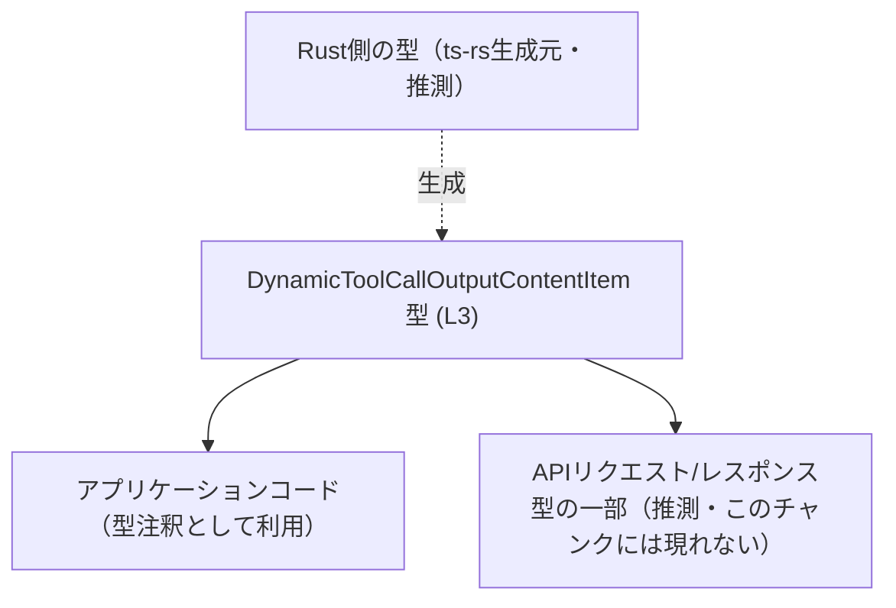
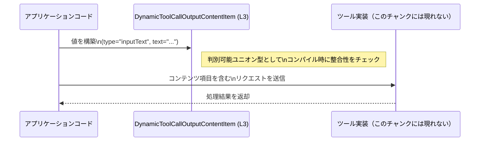

# app-server-protocol\schema\typescript\v2\DynamicToolCallOutputContentItem.ts

## 0. ざっくり一言

`DynamicToolCallOutputContentItem` 型は、「ツール呼び出しの出力コンテンツ」を表す **判別可能ユニオン型（discriminated union）** で、  
テキスト入力か画像入力かの 2 パターンを型レベルで区別するための TypeScript 型定義です  
（`export type ...` 定義より: `app-server-protocol\schema\typescript\v2\DynamicToolCallOutputContentItem.ts:L3-3`）。

---

## 1. このモジュールの役割

### 1.1 概要

- このモジュールは、動的なツール呼び出しにおいてクライアント／サーバ間でやり取りされる **「コンテンツ項目」** の型を定義しています。
- コンテンツ項目は
  - テキスト入力（`inputText`）
  - 画像入力（`inputImage`）
  のいずれかであり、それぞれに必要なプロパティを型で表現します  
  （`DynamicToolCallOutputContentItem` 定義より: `app-server-protocol\schema\typescript\v2\DynamicToolCallOutputContentItem.ts:L3-3`）。

### 1.2 アーキテクチャ内での位置づけ

このファイル自体には他モジュールの import / export は存在せず、**単独の型定義ファイル**として機能しています  
（import がないことはこのチャンクのコードから確認できます）。

コードから読み取れる範囲では、以下のような位置づけになります（他モジュールとの依存はこのチャンクには現れません）。



- 破線で示した Rust 側の型との関係は、コメントにある `ts-rs` 生成であることから読み取れる範囲の推測です  
  （生成コメント: `app-server-protocol\schema\typescript\v2\DynamicToolCallOutputContentItem.ts:L1-2`）。
- どのモジュールがこの型を利用しているかは、このチャンクには現れません。

### 1.3 設計上のポイント

コードから読み取れる設計上の特徴は次のとおりです。

- **判別可能ユニオン型**
  - `"type"` プロパティに `"inputText"` または `"inputImage"` の文字列リテラル型を用いることで、  
    各バリアント（variant）を区別しています  
    （ユニオン構造より: `... = { "type": "inputText", ... } | { "type": "inputImage", ... }` `:L3-3`）。
- **バリアント毎の必須フィールド**
  - `inputText` の場合は `text: string`
  - `inputImage` の場合は `imageUrl: string`
  が必須になっており、バリアントごとに異なるペイロードを持ちます。
- **状態を持たない定義**
  - クラスや関数はなく、値の形だけを表す **純粋な型定義** です。
- **生成コードであることの明示**
  - 冒頭コメントにより、`ts-rs` による自動生成コードであり、「手動で編集してはいけない」ことが明示されています  
    （コメント: `app-server-protocol\schema\typescript\v2\DynamicToolCallOutputContentItem.ts:L1-2`）。

---

## 2. 主要な機能一覧

このファイルは関数を持たず、1 つの公開型を提供します。

- `DynamicToolCallOutputContentItem`:  
  ツール呼び出しの出力コンテンツ項目を表す判別可能ユニオン型。  
  テキスト入力 (`inputText`) と画像入力 (`inputImage`) の 2 種類を型レベルで区別します  
  （`export type ...` 定義より: `app-server-protocol\schema\typescript\v2\DynamicToolCallOutputContentItem.ts:L3-3`）。

---

## 3. 公開 API と詳細解説

### 3.1 型一覧（構造体・列挙体など）

| 名前 | 種別 | 役割 / 用途 | 定義位置 |
|------|------|-------------|----------|
| `DynamicToolCallOutputContentItem` | 型エイリアス（判別可能ユニオン） | 動的ツール呼び出しにおける出力コンテンツ項目を表す。テキスト入力か画像入力かを `"type"` プロパティで区別し、それぞれに対応するデータ（`text` または `imageUrl`）を保持する。 | `app-server-protocol\schema\typescript\v2\DynamicToolCallOutputContentItem.ts:L3-3` |

#### `DynamicToolCallOutputContentItem` の詳細

**型定義**

```typescript
export type DynamicToolCallOutputContentItem =
    { "type": "inputText", text: string, }
  | { "type": "inputImage", imageUrl: string, };
```

（`app-server-protocol\schema\typescript\v2\DynamicToolCallOutputContentItem.ts:L3-3`）

**構造（バリアントごとの形）**

1. **テキスト入力バリアント**

   ```typescript
   {
       type: "inputText";   // 判別用の文字列リテラル型
       text: string;        // ツールに渡すテキスト
   }
   ```

2. **画像入力バリアント**

   ```typescript
   {
       type: "inputImage";  // 判別用の文字列リテラル型
       imageUrl: string;    // 画像のURL（形式はstringとして扱う）
   }
   ```

**型システム上のポイント**

- `"type"` フィールドに文字列リテラル型を用いた判別可能ユニオンであるため、  
  TypeScript の **制御フロー解析** によって `switch` / `if` で `"type"` をチェックすると  
  各バリアントのプロパティ (`text` / `imageUrl`) が安全にアクセスできます。
- `text` / `imageUrl` はどちらも `string` であり、**URLとしての妥当性チェックは型レベルでは行っていません**。  
  実際の検証は別のロジック側で行う必要があります（バリデーションコードはこのチャンクには現れません）。

### 3.2 関数詳細（最大 7 件）

このファイルには関数・メソッドは定義されていません  
（`export type` のみで、`function` や `=>` を含む定義がないことから判断できます: `L3-3`）。

そのため、詳細な関数解説は対象外です。

### 3.3 その他の関数

このファイルには補助関数・ラッパー関数も定義されていません。

---

## 4. データフロー

この章では、**`DynamicToolCallOutputContentItem` を利用する典型的なデータフローの例**を示します。  
実際にどのモジュールから呼ばれているかはこのチャンクには現れないため、あくまで代表的な利用イメージとして記載します。

### 4.1 代表的なフロー（例）

- アプリケーションコードが、ツールに渡すためのコンテンツ項目を構築する。
- `"type"` に `"inputText"` か `"inputImage"` を指定し、それぞれ `text` または `imageUrl` に値を設定する。
- その値が、ツール呼び出しのペイロードの一部として送信される。



- 上図は **型の利用シナリオの一例**であり、実際の呼び出し経路や API 仕様はこのチャンクからは分かりません。

---

## 5. 使い方（How to Use）

### 5.1 基本的な使用方法

ここでは、`DynamicToolCallOutputContentItem` を用いてコンテンツ項目を作成し、  
`switch` 文でバリアントごとに処理を分岐する基本例を示します。

```typescript
import type { DynamicToolCallOutputContentItem } from "./DynamicToolCallOutputContentItem";

// テキスト入力バリアントの例                                   // "inputText" バリアントの値を作成
const textItem: DynamicToolCallOutputContentItem = {          // 型注釈にユニオン型を指定
    type: "inputText",                                        // バリアント判別用の文字列リテラル
    text: "検索キーワードです",                                // ツールに渡すテキスト
};

// 画像入力バリアントの例                                     // "inputImage" バリアントの値を作成
const imageItem: DynamicToolCallOutputContentItem = {
    type: "inputImage",                                       // 画像バリアント
    imageUrl: "https://example.com/image.png",                // 画像URL（型上は任意の文字列）
};

// バリアントごとに分岐して処理する例                         // 判別可能ユニオンとして安全に分岐
function handleItem(item: DynamicToolCallOutputContentItem) { // 引数にユニオン型を受け取る
    switch (item.type) {                                      // type フィールドで分岐
        case "inputText":                                     // この分岐では item は {type:"inputText", text:string}
            console.log("テキスト入力:", item.text);           // text に安全にアクセス可能
            break;
        case "inputImage":                                    // この分岐では item は {type:"inputImage", imageUrl:string}
            console.log("画像URL:", item.imageUrl);           // imageUrl に安全にアクセス可能
            break;
        default:
            // 現在の型定義では到達しないが、将来の拡張に備えたフォールバック // 将来 variant が増えた場合に備える
            const _exhaustiveCheck: never = item;             // 型レベルでの網羅性チェック
            throw new Error("未知のコンテンツタイプです");
    }
}
```

このように `"type"` による分岐を行うことで、TypeScript の型システムが  
各バリアントのプロパティに安全にアクセスできることを保証します。

### 5.2 よくある使用パターン

1. **配列として複数項目を扱う**

   ```typescript
   const items: DynamicToolCallOutputContentItem[] = [     // 複数コンテンツ項目の配列
       { type: "inputText", text: "説明文" },
       { type: "inputImage", imageUrl: "https://example.com/img1.png" },
   ];
   ```

2. **フォーム入力から値を組み立てる**

   ```typescript
   function buildFromForm(
       kind: "inputText" | "inputImage",                   // フォームで選択された種類
       value: string,                                      // テキストまたはURL
   ): DynamicToolCallOutputContentItem {
       if (kind === "inputText") {
           return { type: "inputText", text: value };      // テキストとして扱う
       } else {
           return { type: "inputImage", imageUrl: value }; // URLとして扱う
       }
   }
   ```

### 5.3 よくある間違い

#### `"type"` とプロパティの組み合わせを間違える

```typescript
// 間違い例: type が "inputText" なのに imageUrl を使っている
const wrongItem: DynamicToolCallOutputContentItem = {
    // @ts-expect-error: 型定義上は text プロパティが必要
    type: "inputText",
    imageUrl: "https://example.com/image.png",
};

// 正しい例: "inputText" なら text プロパティを指定する
const correctTextItem: DynamicToolCallOutputContentItem = {
    type: "inputText",
    text: "説明テキスト",
};
```

TypeScript が静的型チェックでこの誤りを検出しますが、  
`any` などを経由すると検出できなくなるため注意が必要です。

#### `"type"` の文字列を typo する

```typescript
// 間違い例: "inputtext"（小文字）と書いてしまう
const wrongType: DynamicToolCallOutputContentItem = {
    // @ts-expect-error: "inputtext" は許可されていない
    type: "inputtext",
    text: "テキスト",
};

// 正しい例
const correctType: DynamicToolCallOutputContentItem = {
    type: "inputText",
    text: "テキスト",
};
```

文字列リテラル型により、typo はコンパイル時に検出されます。

### 5.4 使用上の注意点（まとめ）

- **バリアントとプロパティの対応**
  - `"inputText"` バリアントでは `text` プロパティが必須です。
  - `"inputImage"` バリアントでは `imageUrl` プロパティが必須です。
- **URL の妥当性**
  - `imageUrl` はあくまで `string` 型であり、URL形式の保証はありません。  
    実際の URL 検証は別のバリデーションロジックで行う必要があります。
- **ランタイムの型安全性**
  - TypeScript の型はコンパイル時にのみ存在します。  
    外部ソース（JSON など）から値を受け取る場合は、ランタイムで `"type"` や `text` / `imageUrl` の存在・型を検証する必要があります。
- **並行性・スレッド安全性**
  - このファイルは単なる型定義であり、状態や非同期処理は持ちません。  
    並行性・スレッド安全性の問題は、この型を利用する周辺コードの設計に依存します。

---

## 6. 変更の仕方（How to Modify）

このファイルは `ts-rs` による **自動生成コード** であり、コメントに「手動で編集しないこと」が明示されています  
（コメント: `app-server-protocol\schema\typescript\v2\DynamicToolCallOutputContentItem.ts:L1-2`）。  
そのため、変更を行う場合は **生成元（Rust 側など）の定義を変更する**のが前提になります。

### 6.1 新しい機能を追加する場合（例: 新しいコンテンツタイプ）

- 例として `"inputAudio"` のようなバリアントを追加したい場合を考えます。
- このファイルを直接編集するのではなく、次のような手順が想定されます（コメントからの推測を含みます）。
  1. `ts-rs` によって TypeScript に変換されている **元の Rust 型定義** を探す（このチャンクには場所は現れません）。
  2. その Rust 型に新しいバリアント（例: `InputAudio`）と対応するフィールドを追加する。
  3. `ts-rs` を再実行し、この TypeScript ファイルを再生成する。
  4. 生成された `DynamicToolCallOutputContentItem` に新しいバリアントが追加される。
  5. TypeScript 側の `switch` / `if` などで網羅的に分岐している箇所に、  
     新バリアントを考慮した分岐処理を追加する。

### 6.2 既存の機能を変更する場合

- **フィールド名や型を変える場合**
  - 同様に、生成元の Rust 型定義を変更し、`ts-rs` で再生成する必要があります。
  - 変更により、TypeScript 側の利用コードでコンパイルエラーが発生する可能性が高いため、  
    それらを修正し、期待どおりに動作することを確認する必要があります。
- **削除の影響範囲**
  - バリアントやフィールドを削除すると、`switch` 文の分岐や、値の生成コードがコンパイルエラーになります。  
    これにより影響範囲を特定できますが、実行前にビルドが通らなくなるため、  
    ビルドエラーをもとに使用箇所の修正を行う必要があります。

---

## 7. 関連ファイル

このチャンクから直接参照されているファイルはなく、`import` も存在しません。  
ただしコメントから、以下のような関連が推測できます。

| パス / コンポーネント | 役割 / 関係 |
|-----------------------|------------|
| `ts-rs`（Rust側の型定義） | コメントにあるとおり、この型定義の生成元です。Rust の構造体／enum 定義から `DynamicToolCallOutputContentItem` が生成されていると考えられます（ツール名とコメント文が根拠: `L1-2`）。 |
| `app-server-protocol\schema\typescript\v2\*.ts` | 同じディレクトリにある他の型定義ファイル（このチャンクには現れませんが、プロトコル全体のスキーマを構成している可能性があります）。 |
| テストコード（不明） | このファイルにはテストは含まれておらず、どのテストファイルがこの型を利用しているかはこのチャンクからは分かりません。 |

---

### Bugs / Security / Contracts / Edge Cases / Performance まとめ

- **Bugs（潜在バグ）**
  - 型定義としては不整合は見られません。  
    ただし `imageUrl` の形式は `string` なので、実際に利用するコードで URL 検証を行わないと、  
    無効な URL が混入する余地があります（これはこの型定義では防げません）。
- **Security**
  - この型自体はデータ構造の表現にとどまります。  
    セキュリティ面（XSS、SSRF 等）は、この型を利用する際の URL 处理・テキスト処理の実装に依存します。
- **Contracts / Edge Cases**
  - 契約:
    - `"type"` とプロパティの対応（`"inputText"` ↔ `text`, `"inputImage"` ↔ `imageUrl`）が前提条件です。
  - エッジケース:
    - `text` が空文字列でも型レベルでは許容されます。
    - `imageUrl` が空文字列や不正な URL でも `string` としては許容されるため、アプリケーション側でチェックが必要です。
- **Performance / Scalability**
  - ただの型定義であり、ランタイムのオーバーヘッドはありません。
  - スケーラビリティ上の懸念も特にありません（値のサイズや個数による影響は、この型を保持するデータ構造・I/O に依存します）。
