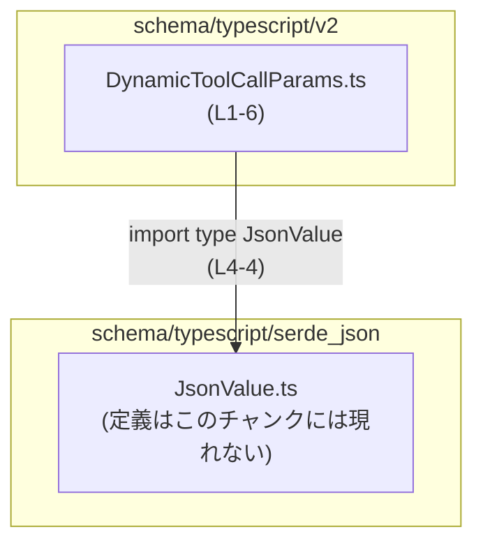
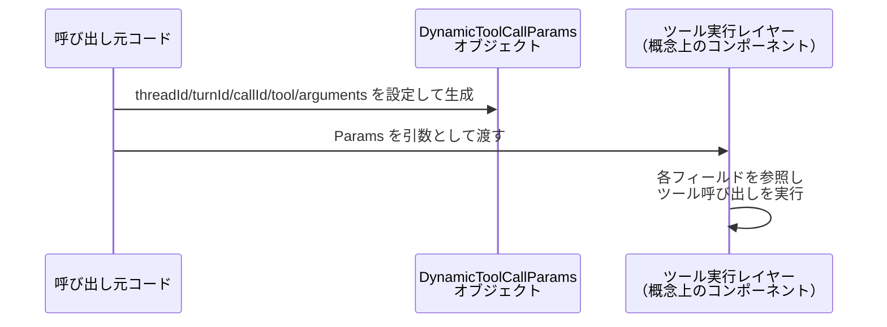

# `app-server-protocol\schema\typescript\v2\DynamicToolCallParams.ts` コード解説

## 0. ざっくり一言

動的な「ツール呼び出し」のパラメータを表現する TypeScript の型エイリアス `DynamicToolCallParams` を定義する、自動生成ファイルです（DynamicToolCallParams.ts:L1-3, L6-6）。

---

## 1. このモジュールの役割

### 1.1 概要

- このモジュールは、**動的ツール呼び出しのパラメータ構造**を TypeScript の型として表現するために存在します（型定義: DynamicToolCallParams.ts:L6-6）。
- `ts-rs` によって Rust 側の型定義から自動生成されたファイルであり、手作業で編集しないことが明示されています（DynamicToolCallParams.ts:L1-3）。

### 1.2 アーキテクチャ内での位置づけ

このファイルは、JSON 汎用値を表すと考えられる `JsonValue` 型に依存し、その上に `DynamicToolCallParams` 型を定義してエクスポートしています。



- このチャンクに現れる依存関係は、`JsonValue` への型インポートのみです（DynamicToolCallParams.ts:L4-4）。
- 他モジュールから `DynamicToolCallParams` がどのように利用されているかは、このチャンクからは分かりません。

### 1.3 設計上のポイント

- **自動生成ファイル**  
  - 冒頭コメントで自動生成であり編集禁止であることが明示されています（DynamicToolCallParams.ts:L1-3）。
- **純粋な型定義のみ**  
  - 実行時コード（関数・クラスなど）は一切なく、型エイリアスだけをエクスポートします（DynamicToolCallParams.ts:L6-6）。
- **JsonValue による柔軟な引数表現**  
  - `arguments` フィールドに `JsonValue` を使用することで、ツール引数を JSON 形式の汎用値として保持できる設計になっています（DynamicToolCallParams.ts:L4-4, L6-6）。
  - `JsonValue` の具体的な構造はこのチャンクには現れないため詳細不明ですが、名前から JSON の値全般を表す型であると解釈できます（ただし推測であり、コードからは断定できません）。

---

## 2. 主要な機能一覧

このモジュールが提供する「機能」は、実行コードではなく型レベルの契約です。

- `DynamicToolCallParams` 型: 動的ツール呼び出しに必要な識別子とツール引数をまとめたデータ構造を表現する（DynamicToolCallParams.ts:L6-6）。
- `JsonValue` 型の利用: ツール引数を JSON 汎用値として受け取れるようにする（DynamicToolCallParams.ts:L4-4, L6-6）。

---

## 3. 公開 API と詳細解説

### 3.1 コンポーネントインベントリー（型一覧）

このチャンクに登場する型・依存関係を一覧にします。

#### 定義されている型

| 名前 | 種別 | 役割 / 用途 | 定義位置 |
|------|------|-------------|----------|
| `DynamicToolCallParams` | 型エイリアス（オブジェクト型） | 動的なツール呼び出しに関する識別子（スレッド・ターン・コール）と、ツール名・JSON 形式の引数をまとめるデータ構造 | DynamicToolCallParams.ts:L6-6 |

#### 依存する外部型

| 名前 | 種別 | 役割（推測を含む） | 参照位置 | 定義状況 |
|------|------|-------------------|----------|----------|
| `JsonValue` | import された型 | 名称とパスから、JSON の任意の値（オブジェクト・配列・文字列など）を表現する型と解釈できますが、このチャンクには定義がないため詳細不明です。 | DynamicToolCallParams.ts:L4-4, L6-6 | `../serde_json/JsonValue` からのインポート（DynamicToolCallParams.ts:L4-4） |

### 3.2 主要型 `DynamicToolCallParams` の詳細

#### `export type DynamicToolCallParams = { ... }`

**概要**

- ツール呼び出しに関する文脈情報と、実際のツール・引数をまとめた **オブジェクト型のエイリアス** です（DynamicToolCallParams.ts:L6-6）。
- すべてのフィールドが必須であり、`threadId` から `arguments` まで、5 つのプロパティを持ちます（DynamicToolCallParams.ts:L6-6）。

**フィールド**

| フィールド名 | 型 | 説明（名前から読み取れる意味） | 定義位置 |
|-------------|----|---------------------------------|----------|
| `threadId`  | `string` | スレッド（会話やタスクのまとまり）を識別する文字列 ID と解釈できます。 | DynamicToolCallParams.ts:L6-6 |
| `turnId`    | `string` | スレッド内の「ターン」（1 回の発話やステップ）を識別する文字列 ID と解釈できます。 | DynamicToolCallParams.ts:L6-6 |
| `callId`    | `string` | 個々のツール呼び出しを識別するための文字列 ID と解釈できます。 | DynamicToolCallParams.ts:L6-6 |
| `tool`      | `string` | 呼び出すツールの名称を表す文字列と解釈できます。 | DynamicToolCallParams.ts:L6-6 |
| `arguments` | `JsonValue` | ツールに渡す引数を JSON 値として格納するフィールドです。具体的な構造は `JsonValue` の定義に依存します。 | DynamicToolCallParams.ts:L6-6 |

> 注: 上記の説明のうち、`threadId` / `turnId` / `callId` / `tool` の意味は**フィールド名からの解釈**であり、コードには追加説明はありません。

**戻り値／実体**

- この型は関数ではないため戻り値はありません。
- この型に従うオブジェクトは、少なくとも指定された 5 フィールドをすべて持つ必要があります（DynamicToolCallParams.ts:L6-6）。

**TypeScript の型安全性・エラー・並行性への影響**

- **型安全性**  
  - `DynamicToolCallParams` を利用することで、ツール呼び出しパラメータの構造がコンパイル時に検査されます。  
  - 例: `callId` を書き忘れたオブジェクトを代入するとコンパイルエラーになります（必須フィールドのみで構成されているため）。
- **実行時エラー**  
  - この型自体はコンパイル時の概念であり、直接的に実行時のエラーや挙動を定めるものではありません。
- **並行性**  
  - TypeScript の型定義のみであり、非同期処理やスレッド安全性に関するロジックは含まれていません。
  - 並行アクセスに関する安全性（例: 同じ `callId` に対する並行更新）などは、この型の外側の実装に依存します。

**Examples（使用例）**

1. **単純なオブジェクト生成**

```typescript
// DynamicToolCallParams 型をインポートする（実際のパスは利用側の位置によって変わる）
import type { DynamicToolCallParams } from "./DynamicToolCallParams"; // 例: 同一ディレクトリにある場合

// JsonValue 型も必要に応じてインポートする
import type { JsonValue } from "../serde_json/JsonValue"; // このファイルと同じパス指定の例

// DynamicToolCallParams 型に適合するオブジェクトを作成する
const params: DynamicToolCallParams = {
    threadId: "thread-123",                        // スレッドID（任意の文字列）
    turnId: "turn-001",                            // ターンID
    callId: "call-abc",                            // コールID
    tool: "weather",                               // 呼び出すツール名（例: "weather"）
    arguments: {                                   // ツールに渡す引数（JsonValue として解釈される）
        city: "Tokyo",
        unit: "celsius",
    } as JsonValue,                                // JsonValue 型へのアサーション例
};

// params は DynamicToolCallParams 型として型チェックされる
```

1. **関数の引数として利用**

```typescript
import type { DynamicToolCallParams } from "./DynamicToolCallParams";

// DynamicToolCallParams を受け取る関数の例
function handleToolCall(params: DynamicToolCallParams) {  // params の構造がコンパイル時に検査される
    // ここでは params.threadId などが string 型として扱える
    console.log("Thread:", params.threadId);
    console.log("Tool:", params.tool);
    console.log("Arguments:", params.arguments);
}
```

**Edge cases（エッジケース）**

この型定義から読み取れる範囲でのエッジケースは次の通りです。

- **空文字列**  
  - `threadId` / `turnId` / `callId` / `tool` は `string` 型であり、空文字列 `""` も許容されます。  
  - 「空文字を禁止する」といった制約は型定義には含まれていません（DynamicToolCallParams.ts:L6-6）。
- **`null` / `undefined`**  
  - どのフィールドも `null` / `undefined` を許容する型（`string | null` など）にはなっていません。  
  - そのため、`null` や `undefined` を代入するとコンパイルエラーになります（DynamicToolCallParams.ts:L6-6）。
- **`arguments` の構造**  
  - `arguments` は `JsonValue` 型であり、実際に許容される形（オブジェクト・配列・プリミティブなど）は `JsonValue` の定義に依存します。  
  - このチャンクには `JsonValue` の定義がないため、具体的な境界値やサポートされる型は不明です（DynamicToolCallParams.ts:L4-4）。
- **追加プロパティ**  
  - TypeScript の構造的型付けのもとでは、`DynamicToolCallParams` に加えて余分なプロパティを持つオブジェクトでも代入可能な場合があります。  
  - これはこの型定義では制御されておらず、利用側のコンパイラ設定（`exactOptionalPropertyTypes` など）や実装方針に依存します。

**使用上の注意点**

- **自動生成ファイルの直接編集禁止**  
  - 冒頭コメントに「手動で編集しない」旨が明記されているため（DynamicToolCallParams.ts:L1-3）、この型を変更したい場合は元になっている Rust 側の型定義を修正し、`ts-rs` による再生成を行う必要があります。
- **JSON 引数の検証**  
  - `arguments` は `JsonValue` であり、構造や値域は型だけからは制限されません。  
  - 実際にツールを呼び出す前に、必要に応じてスキーマ検証や値チェックを別途実装する必要があります（どのように検証しているかはこのチャンクからは分かりません）。
- **ID の一意性や整合性**  
  - `threadId` / `turnId` / `callId` の相互関係（例: 一意性、対応するスレッドの有無）はこの型では表現されていません。  
  - これらの整合性はアプリケーションロジック側で保証する必要があります。

### 3.3 その他の関数

- このファイルには関数定義が存在しません（DynamicToolCallParams.ts:L1-6）。
- したがって、この節に記載すべき補助関数・ラッパー関数もありません。

---

## 4. データフロー

ここでは、`DynamicToolCallParams` 型の値が利用される典型的な流れを**概念図**として示します。  
※ 実際にどのようなコンポーネントが存在するかはこのチャンクからは分からないため、役割名は抽象的なものとしています。



- `Caller` が `DynamicToolCallParams` 型のオブジェクトを生成する際、5 つのフィールドをすべて指定します（DynamicToolCallParams.ts:L6-6）。
- 生成されたオブジェクトは、ツール実行を担当するレイヤー（ここでは `ToolLayer` と表現）に渡され、  
  `threadId` や `arguments` などが利用されると考えられますが、具体的な処理内容はこのチャンクには現れません。

---

## 5. 使い方（How to Use）

### 5.1 基本的な使用方法

典型的な使用パターンは、「ツール呼び出しを扱う関数の引数型として利用する」形です。

```typescript
// DynamicToolCallParams 型のインポート
// 実際の import パスは利用するファイルの位置に応じて調整が必要です
import type { DynamicToolCallParams } from "./DynamicToolCallParams";

// DynamicToolCallParams を受け取ってツール呼び出しを処理する関数の例
async function executeToolCall(params: DynamicToolCallParams): Promise<void> {
    // スレッドIDやターンIDをログに記録する
    console.log(`thread=${params.threadId}, turn=${params.turnId}, call=${params.callId}`);

    // ツール名に応じて処理を分岐する
    switch (params.tool) {
        case "weather":
            // params.arguments を解釈して天気ツールを呼び出す（実装は別）
            break;
        case "search":
            // 検索ツールを呼び出す（実装は別）
            break;
        default:
            // 未知のツール名に対する処理（エラー処理など）
            break;
    }
}
```

このように、`DynamicToolCallParams` は「ツール呼び出しに必要な情報を 1 つのオブジェクトとしてまとめて渡すための型」として利用できます。

### 5.2 よくある使用パターン

1. **メッセージ型の一部として利用**

```typescript
import type { DynamicToolCallParams } from "./DynamicToolCallParams";

// サーバーからクライアントへ送られるメッセージの例（概念的な定義）
type ServerMessage =
    | { type: "tool_call"; payload: DynamicToolCallParams }  // ツール呼び出しメッセージ
    | { type: "text"; payload: string };                     // テキストメッセージ など
```

1. **ログ用の構造として利用**

```typescript
import type { DynamicToolCallParams } from "./DynamicToolCallParams";

function logToolCall(params: DynamicToolCallParams) {
    // ログにそのまま JSON として出力できる構造になっている
    console.log(JSON.stringify(params));
}
```

### 5.3 よくある間違い（想定される誤用例）

```typescript
import type { DynamicToolCallParams } from "./DynamicToolCallParams";

// 間違い例: 必須フィールドの欠落
const wrong1: DynamicToolCallParams = {
    // threadId が欠けている → コンパイルエラーになる
    turnId: "turn-1",
    callId: "call-1",
    tool: "weather",
    arguments: {},  // JsonValue だとしても、threadId がないためエラー
};

// 間違い例: 型の不一致
const wrong2: DynamicToolCallParams = {
    threadId: 123,               // number を指定 → string 型と一致せずコンパイルエラー
    turnId: "turn-1",
    callId: "call-1",
    tool: "weather",
    arguments: {},               // ここは JsonValue なら問題ないが、threadId が不正
};

// 正しい例: すべてのフィールドを string / JsonValue として指定
const correct: DynamicToolCallParams = {
    threadId: "thread-123",
    turnId: "turn-1",
    callId: "call-1",
    tool: "weather",
    arguments: {},               // JsonValue と互換な値を渡す
};
```

### 5.4 使用上の注意点（まとめ）

- この型は**構造だけを決める**ものであり、値の妥当性（ID の一意性・`tool` の有効な値・`arguments` のスキーマなど）は別途検証が必要です。
- `arguments` に外部から受け取った JSON をそのまま入れる場合、型レベルでは安全でも、内容によるセキュリティリスク（過大データ・想定外キーなど）は残るため、利用側で対策が必要になります。
- ファイル自体は自動生成されるため、TypeScript 側から直接この型を変更しても、再生成時に上書きされる点に注意が必要です（DynamicToolCallParams.ts:L1-3）。

---

## 6. 変更の仕方（How to Modify）

### 6.1 新しい機能を追加する場合

- このファイルは `ts-rs` による自動生成であるため、**直接編集すべきではありません**（DynamicToolCallParams.ts:L1-3）。
- 例えば `userId` フィールドを追加したい場合の一般的な手順は次の通りです（Rust 側が存在すると仮定した場合の一般論です）:
  1. 対応する Rust の構造体（おそらく `DynamicToolCallParams` に対応する構造体）にフィールドを追加する。
  2. `ts-rs` のビルドステップを実行し、TypeScript コードを再生成する。
  3. 生成された `DynamicToolCallParams.ts` に新しいフィールドが反映されることを確認する。
- Rust 側のソースファイルの場所や名前はこのチャンクには現れないため不明です。

### 6.2 既存の機能を変更する場合

- 既存フィールドの型や名前を変える場合も、**Rust 側の定義変更 → 再生成**という流れになると考えられます。
- 変更時に注意すべき点:
  - `threadId` などのフィールド名・型を変更すると、この型に依存しているすべての TypeScript コードに影響します（コンパイルエラーとして現れる）。
  - `arguments` の型をより具体的なオブジェクト型に変更した場合、既存コードで `JsonValue` を前提にしている箇所が破壊的変更になる可能性があります。
- 変更後は、`DynamicToolCallParams` を利用しているすべての呼び出し箇所のコンパイルを通し、必要に応じてテストを実行する必要があります（テストコード自体はこのチャンクには存在しません）。

---

## 7. 関連ファイル

このモジュールと直接的に関係するファイルは、インポートから次のように読み取れます。

| パス | 役割 / 関係 | 根拠 |
|------|-------------|------|
| `schema/typescript/serde_json/JsonValue.ts`（正確な拡張子はこのチャンクには現れない） | `JsonValue` 型を定義していると考えられるモジュール。`DynamicToolCallParams` の `arguments` フィールドの型として利用される。 | 相対パス `../serde_json/JsonValue` からのインポート（DynamicToolCallParams.ts:L4-4） |
| Rust 側の元定義ファイル（パス不明） | `ts-rs` による自動生成元となる Rust の型定義が存在すると考えられますが、このチャンクにはパスや名前は現れません。 | 自動生成コメント（DynamicToolCallParams.ts:L1-3） |

---

### Bugs / Security / Contracts / Edge Cases / Tests / Performance / その他の観点（このファイルに関するまとめ）

- **Bugs**  
  - このファイルは単純な型定義であり、ロジックを含まないため、ファイル単体から明らかなバグは読み取れません。
- **Security**  
  - `arguments` に外部入力の JSON を格納して利用する場合、内容の検証不足が一般的なリスクとなりますが、その検証方法はこのチャンクには現れません。
- **Contracts（契約）**  
  - 5 つのフィールドがすべて必須であること、各フィールドの型（`string` / `JsonValue`）が契約として定義されています（DynamicToolCallParams.ts:L6-6）。
- **Edge Cases**  
  - 空文字列・`null` / `undefined` の扱いなど、型レベルでのエッジケースは 3.2 で述べた通りです。
- **Tests**  
  - このファイル内にテストコードは存在しません（DynamicToolCallParams.ts:L1-6）。
- **Performance / Scalability**  
  - 型定義のみであり、実行時パフォーマンスに直接の影響はありません。
- **Observability（可観測性）**  
  - ログ出力やメトリクスなどのコードは含まれていませんが、`DynamicToolCallParams` 自体は JSON 化しやすい構造のため、ログ用のデータ構造として扱いやすいと言えます（構造的な事実として）。
