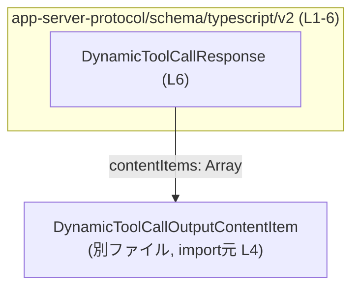
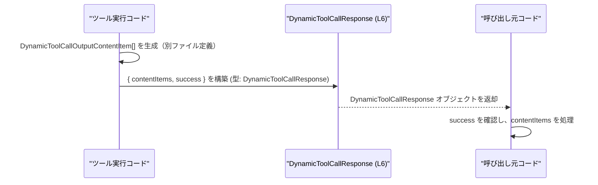

# app-server-protocol/schema/typescript/v2/DynamicToolCallResponse.ts

## 0. ざっくり一言

`DynamicToolCallResponse` は、動的ツール呼び出しのレスポンス構造を表す **TypeScript の型エイリアス**です。Rust 側の型定義から `ts-rs` によって自動生成されており、`contentItems` と `success` という 2 つのプロパティを持つオブジェクト型になっています（DynamicToolCallResponse.ts:L1-3, L6-6）。

---

## 1. このモジュールの役割

### 1.1 概要

- このモジュールは、`DynamicToolCallResponse` という **レスポンスオブジェクトの形状**を TypeScript で表現するための自動生成ファイルです（DynamicToolCallResponse.ts:L1-3, L6-6）。
- フィールドは
  - `contentItems: DynamicToolCallOutputContentItem[]`
  - `success: boolean`
  の 2 つで構成されています（DynamicToolCallResponse.ts:L6-6）。
- `ts-rs` によって Rust の型から生成されることがコメントにより明示されています（DynamicToolCallResponse.ts:L1-3）。

### 1.2 アーキテクチャ内での位置づけ

このファイルは、他の型 `DynamicToolCallOutputContentItem` に依存しており、その配列をレスポンスに含める役割を持ちます（DynamicToolCallResponse.ts:L4-4, L6-6）。



- 外部から見ると、`DynamicToolCallResponse` は「ツール呼び出し結果」をまとめた DTO（データ転送用オブジェクト）のような位置づけと解釈できますが、その詳細な意味や利用箇所はこのチャンクには現れません。

### 1.3 設計上のポイント

- **自動生成コードであり手動変更非推奨**  
  - 「GENERATED CODE! DO NOT MODIFY BY HAND!」および `ts-rs` による生成である旨がコメントに記載されています（DynamicToolCallResponse.ts:L1-3）。
- **型専用 import の利用**  
  - `import type` 構文で `DynamicToolCallOutputContentItem` を読み込んでおり、コンパイル後に実行時コードへは残らない「型のみ依存」となっています（DynamicToolCallResponse.ts:L4-4）。
- **状態を持たない単純な型定義**  
  - 実行時ロジックや関数は一切なく、オブジェクトの形状だけを定義しています（DynamicToolCallResponse.ts:L1-6）。
- **全プロパティが必須**  
  - `contentItems` / `success` ともに `?` が付いておらず、必須プロパティとして定義されています（DynamicToolCallResponse.ts:L6-6）。

---

## 2. 主要な機能一覧

このファイルが提供する主要な「機能」は型定義 1 つに集約されています。

- **DynamicToolCallResponse 型定義**:  
  ツール呼び出しレスポンスとして、`contentItems`（`DynamicToolCallOutputContentItem` の配列）と `success`（真偽値）を持つオブジェクトの形を表します（DynamicToolCallResponse.ts:L4-6）。

---

## 3. 公開 API と詳細解説

### 3.1 型一覧（構造体・列挙体など）

このファイルに現れる型と、その役割の一覧です。

| 名前 | 種別 | 役割 / 用途 | 定義/参照箇所 |
|------|------|-------------|----------------|
| `DynamicToolCallResponse` | 型エイリアス（オブジェクト型） | ツール呼び出しレスポンスの形状を表す。`contentItems` と `success` という 2 つのプロパティを持つ。 | 定義: DynamicToolCallResponse.ts:L6-6 |
| `DynamicToolCallOutputContentItem` | 型（外部定義） | 各レスポンス要素（コンテンツ項目）の型。`DynamicToolCallResponse` の `contentItems` 配列要素として利用される。 | 型 import: DynamicToolCallResponse.ts:L4-4（中身はこのチャンクには現れない） |

#### `DynamicToolCallResponse` の構造

```ts
export type DynamicToolCallResponse = {
    contentItems: Array<DynamicToolCallOutputContentItem>,
    success: boolean,
};
```

（DynamicToolCallResponse.ts:L6-6）

- `contentItems`  
  - 型: `Array<DynamicToolCallOutputContentItem>`（`DynamicToolCallOutputContentItem[]` と等価）  
  - 役割: 各ツール出力要素を配列として保持するコンテナ。要素の正確な構造は別ファイル定義で、このチャンクには現れません（DynamicToolCallResponse.ts:L4-4）。
- `success`  
  - 型: `boolean`  
  - 役割: レスポンスの成否を示すフラグと解釈できますが、意味の詳細（「何をもって success とするか」など）はコードからは読み取れません（DynamicToolCallResponse.ts:L6-6）。

**言語固有の安全性（TypeScript 観点）**

- `contentItems` の配列要素は `DynamicToolCallOutputContentItem` に制約されており、他の型を入れるとコンパイルエラーになります（DynamicToolCallResponse.ts:L4-6）。
- `success` は `boolean` 固定であり、`"ok"` や `0/1` を直接代入するとコンパイルエラーとなります（DynamicToolCallResponse.ts:L6-6）。

### 3.2 関数詳細（最大 7 件）

- このファイルには **関数・メソッドは一切定義されていません**（DynamicToolCallResponse.ts:L1-6）。
- したがって、このセクションにテンプレート適用対象となる関数はありません。

### 3.3 その他の関数

- 補助関数・ラッパー関数も定義されていません（DynamicToolCallResponse.ts:L1-6）。

---

## 4. データフロー

このファイル自体には処理ロジックは含まれていませんが、`DynamicToolCallResponse` 型の典型的なデータの流れを、**命名と型構造から推測できる範囲**で一般的なイメージとして示します。

> 注意: 以下は「利用イメージ」であり、実際の呼び出しコードはこのチャンクには現れません。



- `DynamicToolCallOutputContentItem` の配列が生成され、それを `contentItems` に格納したオブジェクトが `DynamicToolCallResponse` として返される、という形の利用が想定されます（型定義に基づく推測）。
- TypeScript の型システムにより、`contentItems` の中身が誤った型になったり、`success` を省略したりするとコンパイル時に検出されるため、実行時の構造不整合を減らせます（DynamicToolCallResponse.ts:L4-6）。

---

## 5. 使い方（How to Use）

### 5.1 基本的な使用方法

`DynamicToolCallResponse` をインポートし、ツール呼び出し結果を表現するオブジェクトに型を付ける例です。

```typescript
// DynamicToolCallResponse と、その要素型 DynamicToolCallOutputContentItem を型としてインポートする
import type { DynamicToolCallResponse } from "./DynamicToolCallResponse";              // このファイルの型
import type { DynamicToolCallOutputContentItem } from "./DynamicToolCallOutputContentItem"; // 要素型（別ファイル定義）

// ツール呼び出しの結果としてのコンテンツ項目配列を組み立てる（具体的な構造は別ファイル側の定義に依存）
const items: DynamicToolCallOutputContentItem[] = [
    // ... DynamicToolCallOutputContentItem 型に従ったオブジェクトを入れる
];

// DynamicToolCallResponse 型を満たすオブジェクトを作成する
const response: DynamicToolCallResponse = {
    contentItems: items, // DynamicToolCallOutputContentItem[] である必要がある
    success: true,       // boolean である必要がある
};

// 型が合っていれば IDE 補完や型チェックが働く
console.log(response.success ? "success" : "failure");
```

- `import type` を使うことで、型レベルの依存に留まり、コンパイル後の JS には import が出力されません（DynamicToolCallResponse.ts:L4-4, L6-6）。

### 5.2 よくある使用パターン（想定）

この型の名前と構造から、よくありそうな利用パターンを 1 つ示します（あくまで利用イメージであり、このチャンク内に実装はありません）。

```typescript
import type { DynamicToolCallResponse } from "./DynamicToolCallResponse";

// DynamicToolCallResponse を受け取って処理する関数の例
function handleToolResponse(res: DynamicToolCallResponse) {        // res は必ず contentItems と success を持つ
    if (!res.success) {                                            // success フラグに応じて分岐
        // 失敗時の処理（ログ記録など）
        console.warn("Tool call did not succeed");
        return;
    }

    // 成功時: contentItems を順に処理する
    for (const item of res.contentItems) {
        // item は DynamicToolCallOutputContentItem 型として推論される
        // item の構造に応じた処理を書く（別ファイル定義に依存）
    }
}
```

### 5.3 よくある間違い（起こりうる誤用例と正しい例）

#### 1. `contentItems` の型不整合

```typescript
import type { DynamicToolCallResponse } from "./DynamicToolCallResponse";

// 誤り例: contentItems に any[] を入れている（実際にはコンパイルエラーになる）
const wrong: DynamicToolCallResponse = {
    // @ts-expect-error: DynamicToolCallOutputContentItem[] であるべき
    contentItems: [1, 2, 3],   // number[] は不正
    success: true,
};

// 正しい例: DynamicToolCallOutputContentItem[] を使う
// （ここでは型名だけを示し、実際の構造は別ファイルに依存）
const correct: DynamicToolCallResponse = {
    contentItems: [], // 空配列なら型的には常に OK
    success: false,
};
```

#### 2. 必須プロパティの欠落

```typescript
import type { DynamicToolCallResponse } from "./DynamicToolCallResponse";

// 誤り例: success を省略している
// @ts-expect-error: success プロパティが必須
const missingSuccess: DynamicToolCallResponse = {
    contentItems: [],
};

// 正しい例: 両方のプロパティを指定
const ok: DynamicToolCallResponse = {
    contentItems: [],
    success: true,
};
```

### 5.4 使用上の注意点（まとめ）

- **自動生成ファイルを直接編集しない**  
  - 冒頭コメントに「GENERATED CODE! DO NOT MODIFY BY HAND!」とあり、手動編集は想定されていません（DynamicToolCallResponse.ts:L1-3）。Rust 側の定義や生成スクリプトを変更する必要があります。
- **全プロパティは必須**  
  - `contentItems` と `success` は省略できないため、`DynamicToolCallResponse` 型の値を作る際には必ず両方を指定する必要があります（DynamicToolCallResponse.ts:L6-6）。
- **配列要素の型を厳守すること**  
  - `contentItems` には `DynamicToolCallOutputContentItem` 以外の型を入れるとコンパイルエラーになり、ランタイムでの不整合を防ぎます（DynamicToolCallResponse.ts:L4-6）。
- **エラー情報の表現方法はこの型からは分からない**  
  - `success` が `false` の場合にどのような追加情報（エラーメッセージなど）が得られるのかは、この型定義だけからは読み取れません。必要であれば別の型・フィールドが存在する可能性がありますが、このチャンクには現れません。

---

## 6. 変更の仕方（How to Modify）

### 6.1 新しい機能を追加する場合（概念的な方針）

- このファイルは `ts-rs` による自動生成であり、コメントにより手動での編集禁止が明示されています（DynamicToolCallResponse.ts:L1-3）。
- 新しいフィールドを `DynamicToolCallResponse` に追加したい場合は、**直接このファイルを編集するのではなく**:
  1. 元となっている Rust 側の型定義（`ts-rs` でエクスポートされている構造体や型）にフィールドを追加する。
  2. その上で `ts-rs` による TypeScript コード生成を再実行する。  
- Rust 側の型名や場所はこのチャンクには現れないため、具体的なファイルは不明です。

### 6.2 既存の機能を変更する場合

- `contentItems` や `success` の型・名前を変更する場合も、同様に Rust 側の定義を変更し、`ts-rs` による出力を更新するのが前提となります（DynamicToolCallResponse.ts:L1-3, L6-6）。
- 変更時に注意すべき点（この型が守るべき契約）:
  - 呼び出し側コードが `contentItems` と `success` に依存している可能性が高く、プロパティ名や型の変更は広範囲に影響することが想定されます（命名と役割からの推測）。
  - 特に `success` を `boolean` 以外の型に変える場合は、既存コードの条件分岐ロジックが壊れないか確認する必要があります。

---

## 7. 関連ファイル

このモジュールと直接関係しているファイルは、import 文から 1 つだけ確認できます。

| パス | 役割 / 関係 | 根拠 |
|------|------------|------|
| `./DynamicToolCallOutputContentItem` | `DynamicToolCallResponse.contentItems` の要素型を定義する TypeScript ファイル。`DynamicToolCallResponse` はこの型に配列として依存している。 | import 文: DynamicToolCallResponse.ts:L4-4 |

- このチャンクにはテストコードや他の関連モジュール（サービス層など）は現れません。「どこで使われているか」は別ファイル側のコードを確認する必要があります。

---

### 補足: Bugs / Security / Edge Cases / テスト / パフォーマンスの観点

このファイルは **純粋な型定義のみ** で実行時ロジックを持たないため、以下のように整理できます。

- **Bugs / Security**  
  - 実行時コードがないため、このファイル単体でセキュリティホールやランタイムバグが発生することはありません。  
  - ただし、型定義と実際のデータが乖離している場合（生成元の Rust 側とコンシューマ側の前提のズレなど）、型安全性に頼りきった実装で想定外のデータを見落とす可能性はありますが、その有無はこのチャンクからは判断できません。
- **Contracts / Edge Cases**  
  - 契約として「`contentItems` と `success` は必須」「`contentItems` は `DynamicToolCallOutputContentItem[]`」が型レベルで保証されています（DynamicToolCallResponse.ts:L6-6）。  
  - エッジケースとしては「`contentItems` が空配列」「`success` が `false`」などが考えられますが、それらをどう扱うかは利用側のコードに依存し、このチャンクには現れません。
- **テスト**  
  - テストコードは含まれていません（DynamicToolCallResponse.ts:L1-6）。型生成が正しく行われているかは、Rust 側や生成パイプラインのテストで検証されると考えられますが、詳細は不明です。
- **パフォーマンス / 並行性**  
  - 型定義のみであり、CPU 時間やメモリ消費、並行実行に関する懸念は直接は発生しません。  
  - 実際のパフォーマンス・並行性は、この型を使うアプリケーションコード側に依存します。
