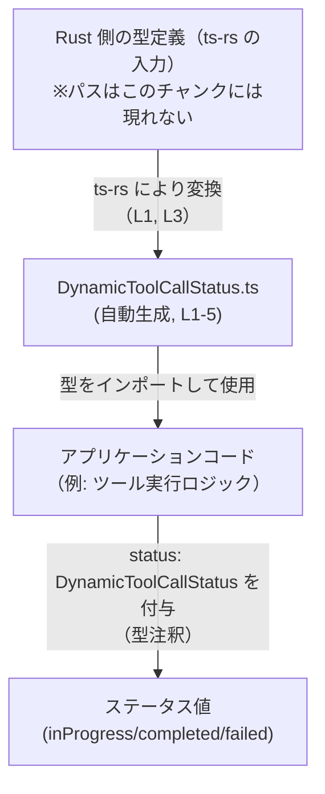
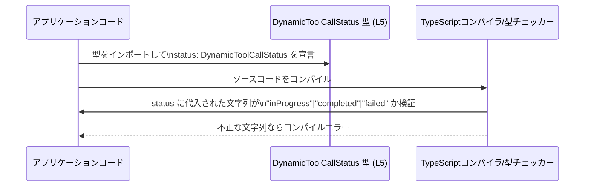

# app-server-protocol/schema/typescript/v2/DynamicToolCallStatus.ts コード解説

## 0. ざっくり一言

- ツール呼び出しの状態を `"inProgress" | "completed" | "failed"` の3つの文字列で表すための、**型安全なステータス型エイリアス**を定義したファイルです（`DynamicToolCallStatus.ts:L5-5`）。
- ファイル全体は `ts-rs` による自動生成コードであり、手作業での編集は禁止されています（`DynamicToolCallStatus.ts:L1-1, L3-3`）。

---

## 1. このモジュールの役割

### 1.1 概要

- このモジュールは、ツール呼び出し（tool call）の状態を表す **TypeScriptの文字列リテラル型** `DynamicToolCallStatus` を提供します（`DynamicToolCallStatus.ts:L5-5`）。
- 状態は `"inProgress"`（進行中）、`"completed"`（完了）、`"failed"`（失敗）の3値に限定されるため、型レベルで不正な状態文字列の混入を防ぐ目的があります（`DynamicToolCallStatus.ts:L5-5`）。
- ファイルは `ts-rs` により生成されており、Rust 側の型と TypeScript 側の型定義を同期させる役割を持つと考えられます（`DynamicToolCallStatus.ts:L1-1, L3-3`）。

### 1.2 アーキテクチャ内での位置づけ

このモジュールは「状態を表す共通型」として、他の TypeScript コードからインポートされて利用される位置づけになります。



- Rust 側の型定義の存在は `ts-rs` の性質から一般的に推測されますが、このチャンクには具体的なファイル情報は現れません（不明）。
- `DynamicToolCallStatus.ts` 自身は、他のコードからの依存対象であり、自身から他モジュールを参照してはいません（`DynamicToolCallStatus.ts:L1-5` に import がないことから）。

### 1.3 設計上のポイント

- **自動生成コード**  
  - 冒頭コメントにより、このファイルは `ts-rs` による生成物であり、手動編集禁止であることが明示されています（`DynamicToolCallStatus.ts:L1-1, L3-3`）。
- **列挙的な文字列リテラル型**  
  - `export type DynamicToolCallStatus = "inProgress" | "completed" | "failed";` により、列挙型（`enum`）ではなく、軽量な **文字列リテラルのユニオン型**として状態を表しています（`DynamicToolCallStatus.ts:L5-5`）。
- **状態の閉じた集合**  
  - 許可される状態が3つに限定されているため、コンパイル時に `"in_progress"` などの誤った文字列を防げる設計です（`DynamicToolCallStatus.ts:L5-5`）。
- **状態保持のみでロジック無し**  
  - このファイルには関数やクラスはなく、状態を表す「データ型」だけを提供するモジュールになっています（`DynamicToolCallStatus.ts:L1-5`）。

---

## 2. 主要な機能一覧

このファイルが提供する機能は、1つの型エイリアスです。

- `DynamicToolCallStatus`: ツール呼び出しの状態を `"inProgress" | "completed" | "failed"` の3つの文字列で表すための型エイリアス（`DynamicToolCallStatus.ts:L5-5`）。

---

## 3. 公開 API と詳細解説

### 3.1 型一覧（構造体・列挙体など）

| 名前                    | 種別         | 役割 / 用途                                                                 | 定義位置                                 |
|-------------------------|--------------|------------------------------------------------------------------------------|------------------------------------------|
| `DynamicToolCallStatus` | 型エイリアス | ツール呼び出しの状態を3つの文字列リテラル（inProgress / completed / failed）で表す | `DynamicToolCallStatus.ts:L5-5` |

#### `DynamicToolCallStatus` の型の意味（TypeScript 的説明）

- **型エイリアス**: `type A = B;` 形式で、`B` という型に `A` という別名を付ける機能です（`DynamicToolCallStatus.ts:L5-5`）。
- **文字列リテラル型のユニオン**: `"inProgress" | "completed" | "failed"` は3つの文字列だけを許可する型であり、`string` 全体ではありません（`DynamicToolCallStatus.ts:L5-5`）。
- したがって、`status: DynamicToolCallStatus` と型注釈された変数には、これら3つ以外の文字列は代入できません（コンパイル時にエラーになります）。

### 3.2 関数詳細（最大 7 件）

- このファイルには関数定義が存在しません（`DynamicToolCallStatus.ts:L1-5` に `function` / `=>` などの関数シグネチャが無いことから）。

### 3.3 その他の関数

- 補助関数やラッパー関数も定義されていません（`DynamicToolCallStatus.ts:L1-5`）。

---

## 4. データフロー

このファイルは型定義のみを提供するため、ここでは「コンパイル時にステータス値がどのように型チェックされるか」という観点でデータフローを説明します。

### 4.1 型チェックの流れ（コンパイル時）



- `DynamicToolCallStatus` は実行時の関数やクラスではなく、コンパイル時の型としてのみ機能します（`DynamicToolCallStatus.ts:L5-5`）。
- 実行時には単なる文字列として扱われるため、**型安全性は TypeScript コンパイラが保証する範囲に限られます**。

---

## 5. 使い方（How to Use）

### 5.1 基本的な使用方法

`DynamicToolCallStatus` をプロパティの型として利用する例です。

```typescript
// DynamicToolCallStatus をインポートする（実際のパスはプロジェクト構成に依存する）
import type { DynamicToolCallStatus } from "./DynamicToolCallStatus"; // このファイル (L5)

// ツール呼び出しの情報を表す型
interface DynamicToolCall {
    id: string;                       // ツール呼び出しを一意に識別する ID
    status: DynamicToolCallStatus;    // 状態は inProgress/completed/failed のいずれかに限定
}

// 状態を更新する関数の例
function markCompleted(call: DynamicToolCall): DynamicToolCall {
    // status に "completed" 以外の文字列を代入しようとするとコンパイルエラーになる
    return { ...call, status: "completed" };
}
```

- `status` に `"in_progress"` のような誤った文字列を設定しようとすると、TypeScript コンパイラがエラーを出します。
- これにより、状態のスペルミスや未定義の状態の混入を防ぐことができます（`DynamicToolCallStatus.ts:L5-5` が3値のみ許容するため）。

### 5.2 よくある使用パターン

#### 1. 状態による分岐（`switch`）と網羅性チェック

```typescript
import type { DynamicToolCallStatus } from "./DynamicToolCallStatus"; // (L5)

// 状態ごとの処理を分岐する例
function handleStatus(status: DynamicToolCallStatus): void {
    switch (status) {
        case "inProgress":            // 進行中
            console.log("処理中です");
            break;
        case "completed":             // 完了
            console.log("完了しました");
            break;
        case "failed":                // 失敗
            console.log("失敗しました");
            break;
        // default: を書かないことで、
        // 新しい状態が追加されたときにコンパイル時に抜け漏れを検出しやすくできる
    }
}
```

- `DynamicToolCallStatus` に新しいリテラルが追加された場合、`switch` にその分岐を書き忘れるとコンパイラから警告/エラーが出るような設定（`--noImplicitReturns` など）にすることで、**状態追加時の処理漏れを検出しやすくなります**。

#### 2. フィルタリングに利用する例

```typescript
import type { DynamicToolCallStatus } from "./DynamicToolCallStatus"; // (L5)

interface DynamicToolCall {
    id: string;
    status: DynamicToolCallStatus;    // 3 状態いずれか
}

// completed な呼び出しだけを抽出する例
function filterCompleted(calls: DynamicToolCall[]): DynamicToolCall[] {
    return calls.filter(call => call.status === "completed");
}
```

- 比較対象となる文字列も `"completed"` などのリテラルになるため、ここでもスペルミスをコンパイル時に検出できます（`DynamicToolCallStatus.ts:L5-5`）。

### 5.3 よくある間違い

```typescript
import type { DynamicToolCallStatus } from "./DynamicToolCallStatus";

// ❌ 間違い例 1: 誤った文字列を代入している
let status1: DynamicToolCallStatus;
// status1 = "in_progress";  // コンパイルエラー: "in_progress" は許可された値ではない

// ✅ 正しい例
status1 = "inProgress";      // OK: 許可された 3 値のひとつ

// ❌ 間違い例 2: せっかくの型を使わず、string にしてしまう
let status2: string;
status2 = "inProgress";      // 一見問題ないが…
status2 = "somethingElse";   // どんな文字列でも通ってしまう

// ✅ 正しい例: DynamicToolCallStatus を利用して型安全にする
let status3: DynamicToolCallStatus;
status3 = "completed";       // OK
// status3 = "somethingElse"; // コンパイルエラー
```

- `string` 型を使ってしまうと、`DynamicToolCallStatus` が提供する安全性が失われます。
- 特に API レスポンスや外部入力をそのまま `string` で扱うと、想定外の状態が紛れ込んでも気付きにくくなります。

### 5.4 使用上の注意点（まとめ）

- **手動でのファイル編集は禁止**  
  - 冒頭コメントに「GENERATED CODE」「Do not edit this file manually」とあるため、このファイル自体を手で変更しない前提で利用する必要があります（`DynamicToolCallStatus.ts:L1-1, L3-3`）。
- **実行時のバリデーションは行われない**  
  - `DynamicToolCallStatus` は型レベルの制約のみを提供し、実行時に文字列をチェックするコードは含まれていません（`DynamicToolCallStatus.ts:L1-5`）。外部入力を扱う場合は別途バリデーションが必要になります。
- **`any` / `unknown` との組み合わせに注意**  
  - `any` からの代入や、乱暴な型アサーション（`as DynamicToolCallStatus`）を多用すると、コンパイル時チェックをすり抜け、実行時に不正な値が入り込む可能性があります。
- **バックエンドとの同期が前提**  
  - `ts-rs` により Rust 側の型から生成されているため、Rust 側の列挙値と常に同期していることが前提です（`DynamicToolCallStatus.ts:L3-3`）。片側だけを変更すると不整合が生じる可能性があります。

---

## 6. 変更の仕方（How to Modify）

### 6.1 新しい機能（状態）を追加する場合

- このファイルは自動生成のため、**直接編集するのは前提に反します**（`DynamicToolCallStatus.ts:L1-1, L3-3`）。
- 新しい状態（例: `"cancelled"`）を追加したい場合、一般的には次のような流れになります（ts-rs の利用形態に基づく一般的な説明です）:

  1. Rust 側の元の型定義（`ts-rs` の入力）に新しいバリアントや値を追加する。  
     - このチャンクでは該当ファイルのパスや名前は分かりません（不明）。
  2. `ts-rs` を再実行して TypeScript 側のコードを再生成する。  
     - その結果として `DynamicToolCallStatus.ts` の行 5 に新しい文字列リテラルが追加される形になります（`DynamicToolCallStatus.ts:L5-5` の構造から推測できる変更パターン）。
  3. TypeScript 側では `switch` 文や条件分岐など、`DynamicToolCallStatus` を利用している箇所を更新し、新しい状態を取り扱うようにする。

### 6.2 既存の機能（状態名）を変更する場合

- `"inProgress"` を `"running"` に変更するなどの修正も、同様に **Rust 側の定義を変更 → ts-rs で再生成** という流れになると考えられます（`DynamicToolCallStatus.ts:L1-1, L3-3`）。
- 状態名を変更すると、TypeScript 側では `DynamicToolCallStatus` を使った全コードがコンパイルエラーになるため、
  - `switch` の `case` ラベル
  - 比較演算（`status === "..."`）
  - 初期値や代入箇所
  などを修正する必要があります。
- これにより、「古い状態名を使用している箇所をコンパイル時に洗い出せる」という利点があります。

---

## 7. 関連ファイル

このチャンクには、実際の関連ファイルのパスは記載されていません。そのため、一般的に想定される関連を「不明」であることを明示したうえで整理します。

| パス / 種別                          | 役割 / 関係                                                                                  |
|--------------------------------------|---------------------------------------------------------------------------------------------|
| （不明: Rust 側の型定義ファイル）    | `ts-rs` によってこの TypeScript 型に変換される元の Rust 型。パスや名前はこのチャンクには現れません。 |
| （不明: ts-rs 設定/ビルドスクリプト） | `DynamicToolCallStatus.ts` を生成するための `ts-rs` 呼び出し設定。内容はこのチャンクには現れません。 |
| （不明: TypeScript 利用側モジュール） | `DynamicToolCallStatus` をインポートして、ツール呼び出しの状態管理を行うコード。具体的なファイルはこのチャンクには現れません。 |

---

## 付録: コンポーネントインベントリー（まとめ）

このファイルに現れるコンポーネント（型・値・関数）の一覧です。

| 名前                    | 種別         | 説明                                                                                  | 根拠行                                          |
|-------------------------|--------------|---------------------------------------------------------------------------------------|-------------------------------------------------|
| `DynamicToolCallStatus` | 型エイリアス | ツール呼び出しの状態を `"inProgress" | "completed" | "failed"` の3つの文字列リテラルで表す型         | `DynamicToolCallStatus.ts:L5-5`                 |
| （コメント）            | メタ情報     | 自動生成コードであり、手動編集禁止・`ts-rs` による生成物であることを示すコメント     | `DynamicToolCallStatus.ts:L1-1, L3-3`           |

---

## 契約 / エッジケース / セキュリティ観点（このファイルに関する範囲）

- **契約（Contract）**
  - `DynamicToolCallStatus` 型を持つ値は、`"inProgress"`, `"completed"`, `"failed"` のいずれかであること（`DynamicToolCallStatus.ts:L5-5`）。
  - この契約はコンパイル時にのみ検証され、実行時には別途バリデーションを実装しない限り保証されません（`DynamicToolCallStatus.ts:L1-5` に実行時ロジックがないため）。

- **エッジケース**
  - 外部から `"InProgress"` のように大文字・小文字の違う値や、 `"in_progress"` のようなフォーマット違いが来た場合、`DynamicToolCallStatus` 型としては許可されません。
  - `any` や JSON パース結果など、型が失われた値に対して `as DynamicToolCallStatus` とキャストすると、実際には3値以外が混入する可能性があります（TypeScript 共通の注意点）。

- **セキュリティ / バグの可能性**
  - このファイル単体には実行時ロジックが無く、直接のセキュリティリスク（XSS/SQL Injection など）は存在しません（`DynamicToolCallStatus.ts:L1-5`）。
  - ただし、バックエンド（Rust 側）の状態と同期が取れていない場合、状態解釈の不一致によるロジックバグが発生する可能性があります。これは `ts-rs` を正しく再実行する運用で回避する必要があります（`DynamicToolCallStatus.ts:L3-3`）。
