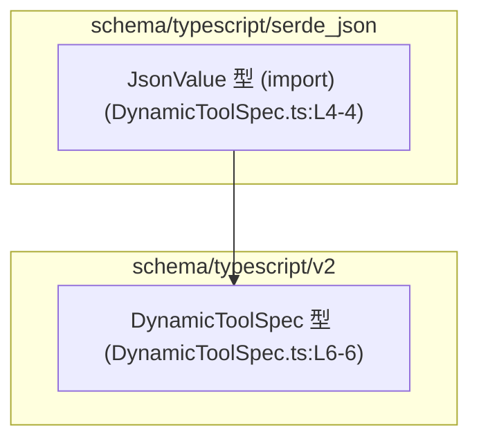
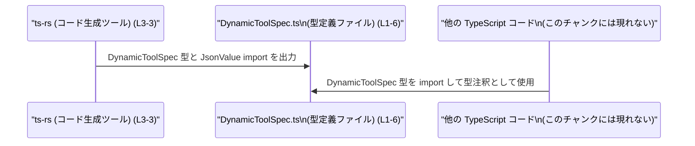

# app-server-protocol/schema/typescript/v2/DynamicToolSpec.ts

## 0. ざっくり一言

- 動的な「ツール仕様」を表す `DynamicToolSpec` 型エイリアスを 1 つだけ定義した、コード生成済みの TypeScript 型定義ファイルです (DynamicToolSpec.ts:L1-6)。

---

## 1. このモジュールの役割

### 1.1 概要

- このモジュールは、`DynamicToolSpec` という型エイリアスを通じて、あるオブジェクトの構造（名前・説明・入力スキーマ・遅延ロードフラグ）を表現するために存在しています (DynamicToolSpec.ts:L6-6)。
- ファイル先頭のコメントから、このコードは `ts-rs` というツールによって自動生成されており、手動編集しないことが明示されています (DynamicToolSpec.ts:L1-3)。

### 1.2 アーキテクチャ内での位置づけ

- このモジュールは、`JsonValue` 型を `import type` で参照し、その型を `inputSchema` フィールドに利用するだけの、純粋な型定義モジュールです (DynamicToolSpec.ts:L4-6)。
- 実行時の処理や関数は定義されておらず、この型を利用する別モジュール側が、`DynamicToolSpec` を import して使う構造になります（利用側のコードはこのチャンクには現れません）。

依存関係（型レベル）の図は次のとおりです。



### 1.3 設計上のポイント

- **コード生成ファイル**  
  - `GENERATED CODE! DO NOT MODIFY BY HAND!` と明記されており (DynamicToolSpec.ts:L1-1)、`ts-rs` により自動生成されています (DynamicToolSpec.ts:L3-3)。
- **型のみのモジュール**  
  - 実行時に存在する値や関数はなく、`export type DynamicToolSpec = { ... }` のみが定義されています (DynamicToolSpec.ts:L6-6)。
- **型専用 import**  
  - `import type { JsonValue }` を使うことで、コンパイル後の JavaScript からはこの import が削除され、実行時オーバーヘッドを発生させません (DynamicToolSpec.ts:L4-4)。
- **オプショナルプロパティ**  
  - `deferLoading?: boolean` はオプショナルであり、省略された場合にはプロパティ自体が存在しない可能性があります (DynamicToolSpec.ts:L6-6)。利用側は `undefined` を取りうることを前提に扱う必要があります。

---

## 2. 主要な機能一覧

このファイルには関数はなく、型定義のみが提供されます。

- `DynamicToolSpec` 型: 動的なツール仕様（と推測されるオブジェクト）の構造を表す型エイリアスです (DynamicToolSpec.ts:L6-6)。

---

## 3. 公開 API と詳細解説

### 3.1 型一覧（構造体・列挙体など）

このファイルに現れる主な型コンポーネントの一覧です。

| 名前             | 種別           | 役割 / 用途                                                                 | 定義 / 利用位置                     |
|------------------|----------------|------------------------------------------------------------------------------|--------------------------------------|
| `DynamicToolSpec`| 型エイリアス   | ツール仕様を表すオブジェクトの構造を定義する型（フィールド 4 つ）           | 定義: DynamicToolSpec.ts:L6-6       |
| `JsonValue`      | 型（import のみ） | `inputSchema` フィールドの型として利用される汎用的な値型（詳細は不明）     | import: DynamicToolSpec.ts:L4-4     |

> `JsonValue` の中身や定義場所の詳細は、このチャンクには現れません。パス `"../serde_json/JsonValue"` から、`serde_json` ディレクトリ配下に定義が存在すると分かるのみです (DynamicToolSpec.ts:L4-4)。

#### `DynamicToolSpec` のフィールド構造

`DynamicToolSpec` は次のようなオブジェクト型です (DynamicToolSpec.ts:L6-6)。

```ts
export type DynamicToolSpec = {
  name: string,
  description: string,
  inputSchema: JsonValue,
  deferLoading?: boolean,
};
```

各フィールドの詳細を表にまとめます。

| フィールド名     | 型         | 必須/任意 | 説明（名前からの解釈を含む）                                                                 | 定義位置                  |
|------------------|------------|----------|------------------------------------------------------------------------------------------------|---------------------------|
| `name`           | `string`   | 必須     | この仕様オブジェクトの名前を表す文字列。具体的に何の名前かはコードからは断定できません。       | DynamicToolSpec.ts:L6-6   |
| `description`    | `string`   | 必須     | この仕様オブジェクトの説明文を表す文字列。内容のフォーマットや制約はコードからは分かりません。 | DynamicToolSpec.ts:L6-6   |
| `inputSchema`    | `JsonValue`| 必須     | `JsonValue` 型で表されるスキーマ情報。具体的な構造・制約は `JsonValue` の定義が不明なため不明です。 | DynamicToolSpec.ts:L6-6   |
| `deferLoading`   | `boolean`  | 任意 (`?`)| ロードを遅延させるかどうかを示すフラグと解釈できますが、名称からの推測であり、意味はコードからは断定できません。未指定の場合はプロパティが存在しない可能性があります。 | DynamicToolSpec.ts:L6-6   |

> 「ツール仕様」という解釈は、型名 `DynamicToolSpec` の名称に基づく推測であり、コード単体からはオブジェクトの正確なドメインは分かりません。

**契約・制約（この型から読み取れる範囲）**

- `name` / `description` は任意の `string` を許容し、長さや内容の制約はこの型定義からは読み取れません (DynamicToolSpec.ts:L6-6)。
- `inputSchema` は `JsonValue` 型であり、その妥当性や形式は `JsonValue` 側の定義に依存しますが、このチャンクには現れません (DynamicToolSpec.ts:L4-4)。
- `deferLoading` は存在しないことがあり得るため、利用側は `boolean | undefined` 相当として扱う必要があります (DynamicToolSpec.ts:L6-6)。

### 3.2 関数詳細（最大 7 件）

- このファイルには関数・メソッド・クラスコンストラクタなどの実行時ロジックは一切定義されていません (DynamicToolSpec.ts:L1-6)。
- そのため、このセクションで詳細解説する対象関数はありません。

### 3.3 その他の関数

- 補助関数やラッパー関数も定義されていません (DynamicToolSpec.ts:L1-6)。

---

## 4. データフロー

このファイル自体は実行時の処理を持ちませんが、「型定義がどのように生成・利用されるか」という観点でデータ（型情報）の流れを示します。

- コメントから、このファイルは `ts-rs` によって生成されていることが分かります (DynamicToolSpec.ts:L3-3)。
- 生成された `DynamicToolSpec` 型は、他の TypeScript コードから import されて利用されることが想定されます（利用側コードはこのチャンクには現れません）。



この図は、コメントに基づく事実（`ts-rs` による生成）と、TypeScript 型定義ファイルの一般的な利用パターンを組み合わせたものであり、App 側の具体的な構造はこのチャンクからは分かりません。

---

## 5. 使い方（How to Use）

### 5.1 基本的な使用方法

`DynamicToolSpec` を利用する側の、典型的なコード例を示します。ここでの `registerDynamicTool` 関数は説明用の仮の関数であり、このリポジトリ内に実在することは前提としていません。

```typescript
// DynamicToolSpec 型と JsonValue 型を import する例                     // このファイルから型だけを参照する
import type { DynamicToolSpec } from "./DynamicToolSpec";               // 同一ディレクトリにあると仮定した相対パス
import type { JsonValue } from "../serde_json/JsonValue";               // 実際の import パスはファイルの記述通り (L4-4)

// JsonValue 型の値を用意する（ここでは空オブジェクトを例として使用）   // JsonValue の実際の構造はこのチャンクには現れない
const schema: JsonValue = {} as JsonValue;                              // 型アサーションで JsonValue として扱う例

// DynamicToolSpec 型の値を作成する                                    // 必須フィールド 3 つ + 任意フィールド 1 つ
const toolSpec: DynamicToolSpec = {                                     // toolSpec は DynamicToolSpec 型
    name: "example-tool",                                               // name: string（任意の文字列）
    description: "説明用のツール仕様",                                  // description: string
    inputSchema: schema,                                                // inputSchema: JsonValue
    deferLoading: true,                                                 // deferLoading?: boolean（ここでは true を設定）
};

// （仮の）アプリケーション側の関数に渡す例                            // registerDynamicTool は説明用の仮の関数
declare function registerDynamicTool(spec: DynamicToolSpec): void;      // DynamicToolSpec を受け取る関数のシグネチャ例

registerDynamicTool(toolSpec);                                          // 型が一致するためコンパイル時に安全に呼び出せる
```

このように、`DynamicToolSpec` は他の関数やクラスの引数・戻り値・プロパティの型として利用されることが想定されます。

### 5.2 よくある使用パターン

1. **`deferLoading` を省略するケース**

```typescript
import type { DynamicToolSpec } from "./DynamicToolSpec";               // DynamicToolSpec 型の import

const toolSpecWithoutDefer: DynamicToolSpec = {                         // deferLoading を省略した例
    name: "eager-tool",                                                 // name は必須
    description: "即時ロードされる仕様",                                // description も必須
    inputSchema: {} as any,                                             // 例示として any を JsonValue 相当とみなす（実際は JsonValue を使うべき）
    // deferLoading は指定していない                                    // この場合、プロパティが存在しない可能性がある
};
```

1. **オブジェクトの配列として管理するケース**

```typescript
import type { DynamicToolSpec } from "./DynamicToolSpec";               // DynamicToolSpec 型の import

// 複数の仕様を配列で持つ例                                           // DynamicToolSpec[] 型のコレクション
const specs: DynamicToolSpec[] = [                                      // 配列として管理
    {                                                                   
        name: "tool-a",                                                 // 個々の DynamicToolSpec 要素
        description: "A の仕様",
        inputSchema: {} as any,
    },
    {
        name: "tool-b",
        description: "B の仕様",
        inputSchema: {} as any,
        deferLoading: true,                                             // 個別の仕様で deferLoading を設定
    },
];
```

### 5.3 よくある間違い

この型自体は単なる型定義であり、実行時に自動的な検証やデフォルト値設定は行われない点に注意が必要です。

```typescript
import type { DynamicToolSpec } from "./DynamicToolSpec";

// 誤りになりがちな例: ランタイム検証が行われると誤解しているケース
function createSpecFromJson(json: any): DynamicToolSpec {               // JSON から直接 DynamicToolSpec とみなしている
    // return json;                                                     // 型だけを付けても、実行時には検証されないため危険
    return json as DynamicToolSpec;                                     // 型アサーションで無理に扱うと安全性が低い
}
```

- 上記のように、外部からの任意の `json` をそのまま `DynamicToolSpec` とみなすと、実行時には `name` や `description` が欠けている／型が異なるといった問題が起こり得ます（型情報はコンパイル後に消えるため）。
- 実際には、`json` の構造が期待通りかどうかを別途チェックする必要があります。このファイルにはそのチェックロジックは含まれません。

### 5.4 使用上の注意点（まとめ）

- **必須フィールドの存在を保証する必要がある**  
  この型は `name`, `description`, `inputSchema` を必須としますが (DynamicToolSpec.ts:L6-6)、実行時のオブジェクトにそれらが必ず存在するかどうかは、生成元やバリデーションロジックに依存します。外部入力を受け取る場合は別途チェックが必要です。
- **`deferLoading` は `undefined` を取りうる**  
  `deferLoading?: boolean` であるため、省略時にはプロパティ自体が存在しない可能性があります (DynamicToolSpec.ts:L6-6)。利用時には `spec.deferLoading === true` のように明示的に比較するか、デフォルト値を補う処理が必要です。
- **並行性・スレッド安全性**  
  このモジュールは純粋な型定義であり、共有状態や非同期処理を行うロジックは持ちません (DynamicToolSpec.ts:L1-6)。したがって、このファイル自体に起因する並行性の問題はありません。
- **パフォーマンス**  
  `import type` の使用により (DynamicToolSpec.ts:L4-4)、コンパイル後に余分な import コードが生成されないため、このモジュール単体での実行時パフォーマンスへの影響はありません。

---

## 6. 変更の仕方（How to Modify）

### 6.1 新しい機能を追加する場合

このファイルは自動生成であり、手動編集しないことが明示されています (DynamicToolSpec.ts:L1-3)。そのため、直接このファイルを修正するのではなく、「生成元」を変更して再生成する必要があります。

一般的な進め方（このファイルから推測できる範囲と一般論）:

1. **生成元の特定**  
   - コメントにある `ts-rs` の設定や、対応する元定義（型やスキーマ）がどこにあるかをプロジェクト全体から探す必要がありますが、その位置はこのチャンクには現れません (DynamicToolSpec.ts:L3-3)。
2. **元定義にフィールドを追加・変更**  
   - 例えば、`DynamicToolSpec` に別のフラグやメタ情報を追加したい場合は、元定義側にフィールドを追加します。
3. **コード生成の再実行**  
   - `ts-rs` によるコード生成プロセスを再度実行し、新しい `DynamicToolSpec.ts` を生成します。
4. **利用箇所のコンパイルエラー確認**  
   - 新旧の型差異によって利用側コードにコンパイルエラーが出る場合があるため、それらを解消します。

### 6.2 既存の機能を変更する場合

- **フィールドの削除・型変更**  
  - 例えば `deferLoading` を必須にする、`inputSchema` の型を別の型に変える、などの変更を行う場合も、6.1 と同様に生成元を変更する必要があります (DynamicToolSpec.ts:L1-3)。
- **影響範囲**  
  - `DynamicToolSpec` を利用している全ての TypeScript コードが影響を受けます。特に:
    - `name` / `description` を任意にしていたコード
    - `deferLoading` が存在しない前提で書いていたコード
    などは、コンパイル時型チェックにより影響が顕在化します。
- **テスト**  
  - このチャンクにはテストコードは現れませんが、変更後は `DynamicToolSpec` を利用している機能のテストを実行し、ランタイムレベルでの型不整合（例: 外部入力 JSON の構造変化）がないか確認する必要があります。

---

## 7. 関連ファイル

このモジュールと直接関係するファイル・外部要素は次のとおりです。

| パス / 要素                    | 役割 / 関係                                                                 |
|-------------------------------|------------------------------------------------------------------------------|
| `../serde_json/JsonValue`     | `JsonValue` 型を定義するモジュール。`DynamicToolSpec.inputSchema` の型として利用される (DynamicToolSpec.ts:L4-6)。中身はこのチャンクには現れない。 |
| `ts-rs`（外部ツール）         | このファイルを生成したコード生成ツール (DynamicToolSpec.ts:L3-3)。生成元の定義や設定はこのチャンクには現れない。 |

このファイルには他の内部モジュールやテストコードへの参照は存在せず (DynamicToolSpec.ts:L1-6)、`DynamicToolSpec` 型は主に他モジュールから import されて利用される「型の入口」として機能します。
