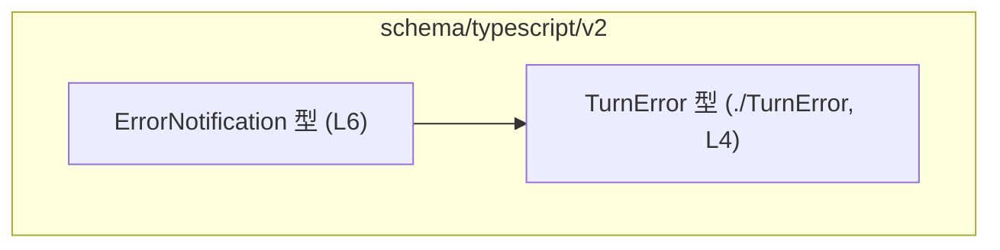
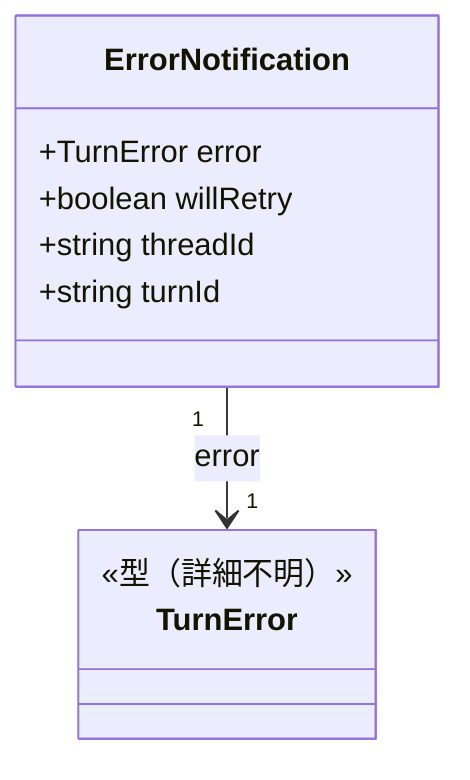
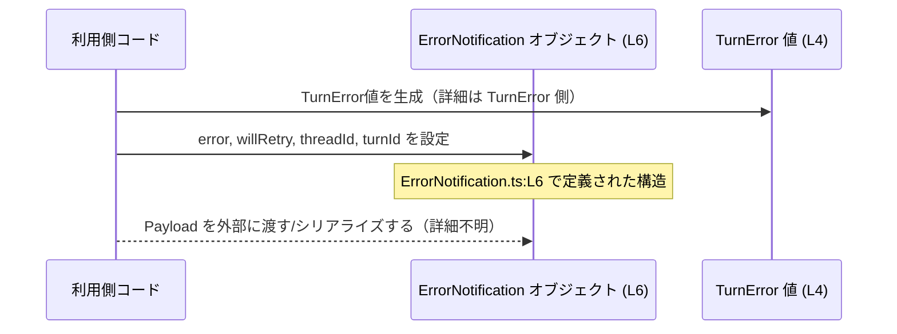

# app-server-protocol/schema/typescript/v2/ErrorNotification.ts コード解説

## 0. ざっくり一言

`ErrorNotification` は、エラー発生時の通知内容を表現するための **シリアライズ可能なオブジェクト構造** を定義する TypeScript の型エイリアスです（`ErrorNotification.ts:L6`）。  
エラー本体（`TurnError` 型）と、再試行フラグ、スレッド ID、ターン ID を 1 つのオブジェクトとしてまとめます。

---

## 1. このモジュールの役割

### 1.1 概要

- このモジュールは、アプリケーションサーバのプロトコルにおける **「エラー通知」のデータ構造** を TypeScript 側で表現するために存在しています（`ErrorNotification.ts:L6`）。
- Rust 側の型定義から [`ts-rs`](https://github.com/Aleph-Alpha/ts-rs) によって自動生成されたコードであり、手動編集しない前提になっています（`ErrorNotification.ts:L1,L3`）。
- 実行時のロジックや関数は一切含まず、「型情報（スキーマ）」のみを提供します。

### 1.2 アーキテクチャ内での位置づけ

このモジュールは `schema/typescript/v2` 配下にあり、**プロトコル v2 の TypeScript スキーマ定義の一部**と位置づけられます。  
このチャンク内で確認できる依存関係は次の 1 点です。

- `ErrorNotification` → `TurnError`（`./TurnError` からの型インポート、`ErrorNotification.ts:L4,L6`）



このチャンクには `ErrorNotification` を利用する側のコード（送信・受信処理など）は現れません。そのため、それらとの関係は不明です。

### 1.3 設計上のポイント

コードから読み取れる設計上の特徴は次のとおりです。

- **自動生成コードであることを明示**  
  - 冒頭コメントで「GENERATED CODE」「Do not edit manually」と明示されています（`ErrorNotification.ts:L1,L3`）。
- **状態やロジックを持たない「純粋な型定義」**  
  - クラスや関数はなく、`export type ErrorNotification = { ... }` のみが定義されています（`ErrorNotification.ts:L6`）。
- **外部エラー型の合成**  
  - エラー本体は別モジュール `./TurnError` の `TurnError` 型として表現されます（`ErrorNotification.ts:L4,L6`）。
- **必須プロパティのみで構成**  
  - `error`, `willRetry`, `threadId`, `turnId` の 4 つすべてが必須プロパティであり、省略可能（`?`）なものはありません（`ErrorNotification.ts:L6`）。
- **TypeScript 言語特性上の安全性**  
  - 静的型チェックにより、`ErrorNotification` を使用するコードでは、各フィールドの存在と型（`TurnError` / `boolean` / `string`）がコンパイル時に検査されます。ただし、実行時には型チェックや値の妥当性検証は行われません。

---

## 2. 主要な機能一覧

このモジュールは 1 つの機能のみを提供します。

- **ErrorNotification 型定義**:  
  エラーオブジェクト（`TurnError`）、再試行有無（`boolean`）、スレッド ID（`string`）、ターン ID（`string`）をまとめた通知ペイロード型を提供します（`ErrorNotification.ts:L4,L6`）。

---

## 3. 公開 API と詳細解説

### 3.1 型一覧（構造体・列挙体など）

このチャンクに現れる型・モジュールのインベントリです。

| 名前 | 種別 | 定義場所 | 役割 / 用途 | 根拠 |
|------|------|----------|-------------|------|
| `ErrorNotification` | 型エイリアス（オブジェクト型） | `ErrorNotification.ts:L6` | エラー通知のペイロード構造。`error`, `willRetry`, `threadId`, `turnId` の 4 プロパティを持つ。 | `export type ErrorNotification = { ... }` |
| `TurnError` | 型（詳細不明） | `ErrorNotification.ts:L4` | エラー内容を表す型。`ErrorNotification.error` プロパティの型として利用される。具体的な構造はこのチャンクには現れない。 | `import type { TurnError } from "./TurnError";` |
| `boolean` | プリミティブ型 | `ErrorNotification.ts:L6` | 再試行の有無を表す `willRetry` プロパティの型。 | `willRetry: boolean` |
| `string` | プリミティブ型 | `ErrorNotification.ts:L6` | `threadId`, `turnId` の両 ID を表すプロパティの型。 | `threadId: string, turnId: string` |

#### `ErrorNotification` のプロパティ構造

`ErrorNotification` は次のようなオブジェクト型です（`ErrorNotification.ts:L6`）。

```ts
export type ErrorNotification = {
    error: TurnError;      // エラー内容
    willRetry: boolean;    // 再試行の予定があるかどうか
    threadId: string;      // スレッド ID（意味の詳細はこのチャンクからは不明）
    turnId: string;        // ターン ID（意味の詳細はこのチャンクからは不明）
};
```

- **`error: TurnError`**  
  - 別ファイル `./TurnError` で定義されるエラー型です（`ErrorNotification.ts:L4`）。  
  - 構造やフィールドはこのチャンクには現れません。
- **`willRetry: boolean`**  
  - 「このエラーに対してシステムが再試行を行うかどうか」を示すフラグと解釈できますが、このチャンクには説明がありません。
- **`threadId: string` / `turnId: string`**  
  - 文字列 ID です。どのような ID（セッション、スレッド、会話単位など）かは名前から推測できますが、コードからは断定できません。

> ※ `ErrorNotification` の意味論（「thread」「turn」が何を指すかなど）は、このチャンクからは分かりません。

### 3.2 関数詳細

このファイルには **関数・メソッドは一切定義されていません**（`ErrorNotification.ts:L1-6`）。  
したがって、関数詳細テンプレートを適用できる公開関数はありません。

- ロジックやアルゴリズムは含まれず、純粋に「型情報のみ」を提供するモジュールです。

### 3.3 その他の関数

このファイルには補助関数・ラッパ関数も存在しません。

| 関数名 | 役割（1 行） |
|--------|--------------|
| なし | このチャンクには関数定義が存在しません。 |

---

## 4. データフロー

### 4.1 概要

- この型は **値を保持するだけの「データの器」** であり、自身では処理を行いません。
- このチャンクには `ErrorNotification` を生成・送信・受信するコードが含まれていないため、**実際の処理シナリオのデータフローは特定できません**。
- ここでは、`ErrorNotification` 内部の構造的なデータの流れ（どのフィールドに何が入るか）をイメージするための図を示します。

### 4.2 型レベルの構造（クラス図イメージ）



- `ErrorNotification` は 1 つの `TurnError` を必ず含みます（`error` プロパティ）。
- `willRetry`, `threadId`, `turnId` はいずれもプリミティブ値であり、ネストした構造はこのチャンクには現れません。

### 4.3 典型的な利用イメージ（概念図）

以下は、この型を利用する際の **一般的なイメージ** を示したものであり、**このリポジトリ内にこの通りのコードが存在することを示すものではありません**。



---

## 5. 使い方（How to Use）

### 5.1 基本的な使用方法

この型は **他のコードからインポートして、引数・戻り値・イベントペイロードなどの型として使う** 想定です。

```ts
// ErrorNotification と TurnError を型としてインポートする               // ErrorNotification.ts:L4,L6 に対応
import type { ErrorNotification } from "./ErrorNotification"; // エラー通知の型
import type { TurnError } from "./TurnError";                 // エラー内容の型（詳細は別ファイル）

// ErrorNotification を引数に取る関数の例
function handleErrorNotification(notification: ErrorNotification) {  // notification の構造が型で保証される
    // error は TurnError 型として扱える
    const error: TurnError = notification.error;

    // willRetry は boolean として扱える
    if (notification.willRetry) {
        console.log("後で再試行予定のエラーです");
    }

    // threadId と turnId は文字列 ID として扱える
    console.log(`thread=${notification.threadId}, turn=${notification.turnId}`);
}
```

- TypeScript の型チェックにより、`notification` に `error`, `willRetry`, `threadId`, `turnId` が **すべて存在し、かつ正しい型であること** がコンパイル時に検査されます。

### 5.2 よくある使用パターン

このチャンクから具体的なパターンは読み取れませんが、一般的には次のような使い方が想定されます。

1. **イベントやメッセージのペイロード型として使う**

```ts
import type { ErrorNotification } from "./ErrorNotification";

// 例: WebSocket メッセージのペイロード型に使用
type ServerMessage =
    | { type: "error"; payload: ErrorNotification }
    | { type: "other"; payload: unknown };

function onMessage(msg: ServerMessage) {
    if (msg.type === "error") {
        const notif: ErrorNotification = msg.payload;  // 型が保証される
        console.error("エラー通知:", notif.error, "willRetry:", notif.willRetry);
    }
}
```

1. **API レスポンス型の一部として使う**

```ts
import type { ErrorNotification } from "./ErrorNotification";

type ApiResponse =
    | { success: true; data: unknown }
    | { success: false; error: ErrorNotification };

function handleResponse(res: ApiResponse) {
    if (!res.success) {
        // res.error は ErrorNotification 型
        console.error("API エラー:", res.error.error);
    }
}
```

※ 上記コードは「利用例」であり、このリポジトリにこのまま存在するわけではありません。

### 5.3 よくある間違い

この型に関連して起こり得る誤用例と、型安全な書き方の例です。

```ts
import type { ErrorNotification } from "./ErrorNotification";

// ❌ 間違い例: プロパティ不足（コンパイルエラーになる）
const invalidNotification: ErrorNotification = {
    // error が欠けている
    willRetry: false,
    threadId: "thread-1",
    turnId: "turn-1",
    // -> Property 'error' is missing ...
};

// ✅ 正しい例: すべての必須プロパティを指定
declare const error: import("./TurnError").TurnError; // 例として既存の TurnError 値を仮定
const validNotification: ErrorNotification = {
    error,
    willRetry: false,
    threadId: "thread-1",
    turnId: "turn-1",
};
```

```ts
// ❌ 間違い例: threadId を number として扱おうとする
function wrong(notif: ErrorNotification) {
    const n: number = notif.threadId;  // コンパイルエラー: string を number に代入できない
}

// ✅ 正しい例: string として扱うか、必要なら明示的に変換
function correct(notif: ErrorNotification) {
    const idStr: string = notif.threadId;            // OK
    const maybeNumber = Number.parseInt(idStr, 10);  // 数値が必要なら明示的に変換
}
```

### 5.4 使用上の注意点（まとめ）

- **必須プロパティをすべて指定する必要がある**  
  - `ErrorNotification` の 4 プロパティはすべて必須です（`ErrorNotification.ts:L6`）。
- **実行時バリデーションは行われない**  
  - TypeScript の型はコンパイル時のみ有効であり、実行時には `threadId` に空文字や不正な ID を入れても検出されません。必要なら実行時のチェックが別途必要です。
- **`TurnError` の中身は別ファイル依存**  
  - `error` の詳細な構造を使うには、`./TurnError` の定義を確認する必要があります（このチャンクには現れません）。
- **並行性について**  
  - TypeScript の型定義であり、スレッドセーフティや並行実行に関する特別な制御は含まれません。並行アクセスの安全性は、利用側ロジックに依存します。

---

## 6. 変更の仕方（How to Modify）

### 6.1 新しい機能を追加する場合（フィールド追加など）

- このファイルは `ts-rs` によって **自動生成**されており、「手で編集しない」という方針がコメントで明示されています（`ErrorNotification.ts:L1,L3`）。
- そのため、`ErrorNotification` にフィールドを追加したい場合は、次のような手順になると考えられます。

1. **生成元（Rust 側）の型定義を変更する**  
   - `ts-rs` は通常、Rust の構造体や型定義から TypeScript の型を生成します。  
   - 生成元ファイルの具体的なパスはこのチャンクには現れないため不明ですが、「Rust 側に対応する型が存在する」と推測できます（コメント中の ts-rs 言及に基づく一般知識）。
2. **`ts-rs` のコード生成を再実行する**  
   - 自動生成プロセスにより、`ErrorNotification.ts` が再生成され、新しいフィールドが反映されます。
3. **利用側コードの修正**  
   - 新フィールドを使う箇所で `ErrorNotification` 型に基づきコードを更新します。

このファイルを直接編集すると、次回の自動生成で上書きされる可能性が高いため、通常は避けるべきです。

### 6.2 既存の機能を変更する場合（型やフィールド名の変更）

- **フィールド名の変更**（例: `threadId` → `sessionId`）や型の変更（`string` → 別の型）も、同様に **生成元の Rust 型** で行う必要があります。
- 変更時に確認すべき点:
  - `ErrorNotification` を参照するすべての TypeScript コード（関数引数、API 型、イベント型など）がコンパイルエラーになっていないか。
  - `TurnError` 側の変更（もし行う場合）は、このファイルだけでなく `./TurnError` を利用する他のモジュールへの影響もあるか。

---

## 7. 関連ファイル

このモジュールと密接に関係すると考えられるファイル・コンポーネントです。

| パス / モジュール名 | 役割 / 関係 | 根拠 |
|---------------------|------------|------|
| `./TurnError` | `TurnError` 型を提供するモジュール。`ErrorNotification.error` プロパティの型として利用される。実際のファイルパス（例: `TurnError.ts` など）はこのチャンクには現れない。 | `ErrorNotification.ts:L4` |
| （Rust 側の対応する型定義ファイル） | `ts-rs` により本ファイルを生成する元になっていると考えられる Rust の型定義。具体的なパスやモジュール名はこのチャンクには現れない。 | コメント中の `ts-rs` 言及（`ErrorNotification.ts:L3`）と `ts-rs` の一般的な利用形態 |

---

## 付録: 言語固有の安全性・エラー・並行性の観点

- **型安全性（TypeScript の観点）**
  - `ErrorNotification` を使うコードでは、`error`, `willRetry`, `threadId`, `turnId` の存在と型がコンパイル時にチェックされます（`ErrorNotification.ts:L6`）。
  - `any` や `unknown` を介さない限り、誤った型の代入はコンパイルエラーになります。
- **エラー処理**
  - このファイルにはエラー処理ロジックはなく、`TurnError` 型の値を「入れ物として保持する」だけです。
  - 実際の例外処理やリトライ制御は利用側コードで行われます（このチャンクには現れません）。
- **並行性**
  - TypeScript の型レベル定義のみであり、スレッドやイベントループに対する特別な配慮はありません。
  - 並行アクセス時の整合性は、`ErrorNotification` を共有・操作するロジック側で確保する必要があります。

---

## Bugs / Security / Contracts / Edge Cases / Tests / Performance などの観点

- **Bugs の可能性**
  - 型定義自体にバグは見当たりませんが、`threadId` / `turnId` の意味やフォーマットに関する制約が型では表現されていないため、利用側で誤った値を入れてしまうバグは起こり得ます。
- **Security**
  - この型自体は単なるデータ構造であり、セキュリティ機能は持ちません。
  - ただし、ID やエラーメッセージがそのままクライアントに送られる場合、情報漏えいやエラーメッセージの過剰露出に注意が必要です（これは一般的な注意点であり、このチャンクから実際の送信有無は分かりません）。
- **Contracts（契約）**
  - コントラクトとしては「`error` は必ず `TurnError` 型」「`willRetry` は必ず `boolean`」「`threadId` と `turnId` は必ず `string`」という条件が型で表現されています（`ErrorNotification.ts:L6`）。
- **Edge Cases**
  - 空文字の `threadId` / `turnId` や、`TurnError` 内部の異常値といったエッジケースへの対応は、このファイルからは分かりません。必要であれば利用側でチェックする必要があります。
- **Tests**
  - テストコードはこのチャンクには含まれていません。  
    生成物であるため、通常は「生成プロセス」と「生成元の Rust 型」のテストによって間接的に検証される形になると考えられます。
- **Performance / Scalability**
  - 型定義のみであり、実行時オーバーヘッドはありません。
  - ただし、`ErrorNotification` を大量に生成・シリアライズする場合は、その処理のパフォーマンス（JSON 化など）がボトルネックになる可能性がありますが、それはこの型ではなく利用側ロジックの問題です。

以上が、このチャンク（`app-server-protocol/schema/typescript/v2/ErrorNotification.ts`）から読み取れる内容の整理です。
