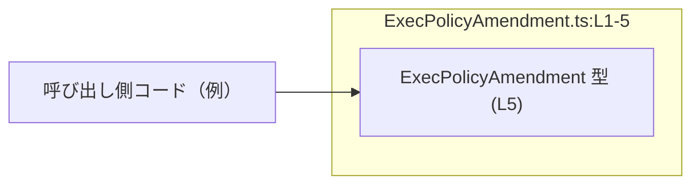
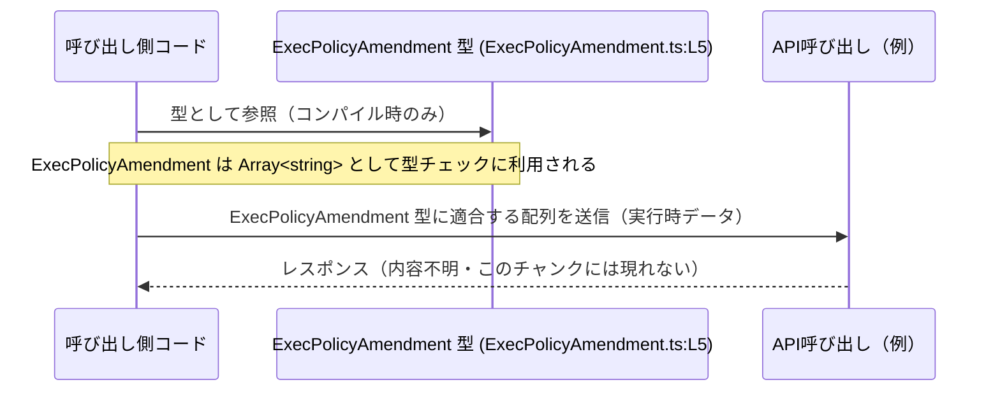

# app-server-protocol/schema/typescript/v2/ExecPolicyAmendment.ts

## 0. ざっくり一言

- Rust から `ts-rs` によって自動生成された、**文字列配列 (`string[]`) を表す型エイリアス `ExecPolicyAmendment`** を 1 つだけ公開する TypeScript スキーマ定義ファイルです（`ExecPolicyAmendment.ts:L1-5`）。

---

## 1. このモジュールの役割

### 1.1 概要

- このモジュールは、`ExecPolicyAmendment` という名前の TypeScript 型エイリアスを提供します（`ExecPolicyAmendment.ts:L5`）。
- `ExecPolicyAmendment` は `Array<string>`（文字列の配列）として定義されており、**「一連の文字列」のまとまり**を表現するための型です（`ExecPolicyAmendment.ts:L5`）。
- ファイル先頭のコメントから、この型は `ts-rs` によって Rust 側の定義から自動生成されたものであり、手動で編集すべきではないことが分かります（`ExecPolicyAmendment.ts:L1-3`）。

名前からは「実行ポリシーの修正内容の一覧」を表している可能性がありますが、**具体的に何を表す文字列かは、このチャンクだけからは分かりません**。

### 1.2 アーキテクチャ内での位置づけ

- パス `app-server-protocol/schema/typescript/v2` から、このファイルが **アプリケーションサーバープロトコルの TypeScript 用スキーマ (バージョン2)** の一部として配置されていることが分かります。
- このファイル自身は型定義のみを提供し、**実行時の処理や関数ロジックは含んでいません**（`ExecPolicyAmendment.ts:L5`）。
- そのため、他のコード（クライアントやライブラリ）がこの型を `import` して利用する位置づけになります。実際の利用箇所はこのチャンクには現れません。

依存関係のイメージを、単一ノードのみで示すと次のようになります。



### 1.3 設計上のポイント

- **自動生成コードであることが明記**  
  - 「GENERATED CODE! DO NOT MODIFY BY HAND!」および「This file was generated by ts-rs. Do not edit this file manually.」というコメントがあり、手動編集禁止であることが分かります（`ExecPolicyAmendment.ts:L1-3`）。
- **型エイリアスのみを提供**  
  - 実行時の振る舞いを持つ関数・クラス・メソッド等は定義されていません（`ExecPolicyAmendment.ts:L5`）。
- **状態やエラーハンドリングは一切持たない**  
  - `ExecPolicyAmendment` は純粋なコンパイル時の型であり、実行時には存在しません。したがって、エラー処理や並行性制御はこのファイルの責務外です。

---

## 2. 主要な機能一覧

このファイルが提供する機能は 1 つだけです。

- `ExecPolicyAmendment` 型定義: 文字列の配列 `Array<string>` を表す型エイリアスを公開する（`ExecPolicyAmendment.ts:L5`）。

---

## 3. 公開 API と詳細解説

### 3.0 コンポーネントインベントリー

このチャンクに登場する型・関数の一覧です。

| 名前                | 種別          | 定義箇所                         | 役割 / 用途 |
|---------------------|---------------|----------------------------------|-------------|
| `ExecPolicyAmendment` | 型エイリアス | `ExecPolicyAmendment.ts:L5` | 文字列の配列 (`Array<string>`) を表す公開型。呼び出し側コードが、特定の用途の「文字列リスト」をやり取りする際の型として利用する。 |

※ このファイルにはクラス・インターフェース・関数は定義されていません（`ExecPolicyAmendment.ts:L1-5`）。

### 3.1 型一覧（構造体・列挙体など）

| 名前 | 種別 | 役割 / 用途 |
|------|------|-------------|
| `ExecPolicyAmendment` | 型エイリアス (`Array<string>`) | 文字列の配列を表す公開型。具体的な意味はこのチャンクからは不明だが、「関連する文字列情報のリスト」を扱うためのコンパイル時の型安全性を提供する。 |

#### `ExecPolicyAmendment = Array<string>`

**概要**

- `ExecPolicyAmendment` は TypeScript の型エイリアスであり、実体は `Array<string>` です（`ExecPolicyAmendment.ts:L5`）。
- つまり、**文字列だけを要素として持つ配列**を表します。

**型の意味**

- 要素は必ず `string` 型であり、`number` や `boolean` など他の型はコンパイル時に弾かれます。
- 配列の長さや各文字列の内容（空文字かどうか、特定のフォーマットかどうか等）については、一切制約がありません。この型からは分かりません。

**言語固有の安全性 / エラー / 並行性**

- **型安全性**  
  - `any[]` ではなく `Array<string>` であるため、非文字列を格納しようとすると TypeScript コンパイラがエラーにできます。
  - これにより、「文字列以外の混入」というクラスのバグをコンパイル時に防止できます。
- **エラー**  
  - このファイルは型定義のみであり、実行時のコードを含まないため、実行時エラーを直接発生させることはありません。
- **並行性**  
  - TypeScript の型はコンパイル時のみ存在するため、スレッドやイベントループなどの並行性に直接の影響はありません。
  - 実体は通常の JavaScript 配列として扱われるため、「共有可変な配列を複数箇所から書き換える」場合の整合性には、一般的な JavaScript と同様の注意が必要です。

### 3.2 関数詳細（最大 7 件）

- **このファイルには関数定義が存在しません**（`ExecPolicyAmendment.ts:L1-5`）。  
  そのため、このセクションの「関数別詳細テンプレート」は該当なしです。

### 3.3 その他の関数

- なし（このチャンクには関数やメソッドは一切現れません）。

---

## 4. データフロー

このファイル自身は実行時ロジックを持ちませんが、**型としてどのようにデータフローに関与しうるか**の典型的なイメージを示します。  
ここでの呼び出し側コードや API は例示であり、このチャンクには登場しません。



要点:

- `ExecPolicyAmendment` は **コンパイル時の型情報としてのみ存在**し、実際には普通の `string[]` がデータとして流れます。
- この型は「どこで」「どのような API で」使われるかについて、このチャンクからは分かりません。

---

## 5. 使い方（How to Use）

### 5.1 基本的な使用方法

`ExecPolicyAmendment` を他のコードで利用する際の、最も単純な例です。  
※ `import` パスは例示です。実際の相対パスやモジュール名はプロジェクト構成によります。

```typescript
// ExecPolicyAmendment 型をインポートする（パスは例）           // 型エイリアス ExecPolicyAmendment を読み込む
import type { ExecPolicyAmendment } from "./ExecPolicyAmendment"; // type-only import にしておくとバンドルに影響しない

// ExecPolicyAmendment 型の値を作成する                        // 文字列配列として値を用意
const amendment: ExecPolicyAmendment = [                        // ExecPolicyAmendment は Array<string> なので
    "rule-1",                                                   // 1つ目の文字列
    "rule-2",                                                   // 2つ目の文字列
];                                                              // 要素はすべて string である必要がある

// 配列として通常通り操作できる                               // 通常の配列と同様に扱える
amendment.push("rule-3");                                      // string を追加することができる
```

- `ExecPolicyAmendment` は `string[]` と同じ扱いで利用できますが、**用途に名前を付けて意味づけしている**点が利点です。

### 5.2 よくある使用パターン

#### パターン1: 関数の引数として利用する

```typescript
import type { ExecPolicyAmendment } from "./ExecPolicyAmendment"; // 型をインポート

// ExecPolicyAmendment を引数として受け取る関数の例           // 「ルール文字列の配列」を引数とする関数
function applyAmendment(amendment: ExecPolicyAmendment): void { // amendment は string[] として扱える
    for (const rule of amendment) {                             // 各要素は string 型として扱える
        console.log("Apply:", rule);                            // ルールを処理する例
    }
}
```

#### パターン2: オブジェクトのプロパティとして利用する

```typescript
import type { ExecPolicyAmendment } from "./ExecPolicyAmendment"; // 型をインポート

// ExecPolicyAmendment をフィールドに持つ設定オブジェクトの例  // 型安全にプロパティを定義
type Config = {
    amendments: ExecPolicyAmendment;                            // amendments プロパティは string[] である必要がある
};

const config: Config = {                                        // Config 型の値を作成
    amendments: ["rule-1", "rule-2"],                           // ExecPolicyAmendment に適合する配列を設定
};
```

### 5.3 よくある間違い

`ExecPolicyAmendment` が実体としては `string[]` であることに起因する典型的な誤用の例です。

```typescript
import type { ExecPolicyAmendment } from "./ExecPolicyAmendment";

// 間違い例: 単一の文字列を渡してしまう                           // ExecPolicyAmendment は string ではなく string[]
// const amendment: ExecPolicyAmendment = "rule-1";              // コンパイルエラーになるべき

// 正しい例: 配列で渡す                                          // 常に配列として扱う必要がある
const amendment: ExecPolicyAmendment = ["rule-1"];              // 要素が1つでも配列でラップする
```

```typescript
// 間違い例: null や undefined を許容すると誤解する              // 型は Array<string> であり、null/undefined は含まれない
// let amendment: ExecPolicyAmendment = null;                    // strictNullChecks 有効ならエラー

// 正しい例: null を許容したい場合は別途ユニオン型にする         // 必要に応じてユニオン型を定義する
type MaybeAmendment = ExecPolicyAmendment | null;               // null を許容したい場合の例
```

### 5.4 使用上の注意点（まとめ）

- **手動編集禁止**  
  - ファイル先頭のコメントにより、手動編集すべきでないことが明示されています（`ExecPolicyAmendment.ts:L1-3`）。  
    変更が必要な場合は、元になっている Rust 側の定義を修正し `ts-rs` で再生成する必要があります。
- **値の妥当性チェックは別途必要**  
  - `ExecPolicyAmendment` は「要素が文字列であること」しか保証しません。  
    内容が特定のフォーマット・制約（例: 重複禁止、特定の接頭辞など）を満たすかどうかは、この型では表現されていません。
- **実行時・並行性に関する挙動は通常の `string[]` と同じ**  
  - この型はコンパイル時の型エイリアスであり、実行時には消えるため、特別なエラーハンドリングやロック機構などはありません。  
  - 同じ配列インスタンスを複数箇所で共有して変更する場合、一般的な JavaScript 配列と同様に副作用に注意する必要があります。
- **セキュリティ上の観点**  
  - この型自体は入力のサニタイズや検証を行いません。外部入力から構築した配列を安全に扱うためには、別途バリデーション処理を行う必要があります。

---

## 6. 変更の仕方（How to Modify）

### 6.1 新しい機能を追加する場合

- このファイルには自動生成である旨が明記されているため、**直接この TypeScript ファイルに新しい型やフィールドを追加することは推奨されません**（`ExecPolicyAmendment.ts:L1-3`）。
- 一般的には次のような手順が想定されます（元コードはこのチャンクには現れません）:
  1. 元になっている Rust 型定義を変更する。
  2. `ts-rs` を再実行し、TypeScript スキーマを再生成する。
  3. 生成された `ExecPolicyAmendment` などの型を、呼び出し側コードで利用する。

※ 元の Rust ファイルの場所・型名はこのチャンクには現れず、不明です。

### 6.2 既存の機能を変更する場合

- `ExecPolicyAmendment` の型そのものを変更したい場合も、Rust 側の定義を変更し、`ts-rs` で再生成する必要があります（`ExecPolicyAmendment.ts:L1-3`）。
- 変更時に注意すべき点:
  - **互換性**: 既存の呼び出し側コードが `ExecPolicyAmendment` を `string[]` として扱っている場合、オブジェクト型などに変更するとコンパイルエラーが多発します。
  - **契約（コントラクト）**: サーバーや他言語クライアントとの間で、この型に基づくプロトコルがすでに存在する可能性があります。プロトコル互換性に注意する必要がありますが、その詳細はこのチャンクからは分かりません。
  - **テスト**: このファイルにはテストコードは含まれていません（`ExecPolicyAmendment.ts:L1-5`）。変更後は、プロジェクト全体のテストで影響を確認する必要があります。

---

## 7. 関連ファイル

このチャンクから直接分かる関連情報は限定的です。

| パス / 要素 | 役割 / 関係 |
|------------|------------|
| `app-server-protocol/schema/typescript/v2` ディレクトリ | このファイルが置かれているディレクトリです。同じプロトコルバージョン v2 に関する他の TypeScript 型定義が存在する可能性がありますが、具体的なファイル名や内容はこのチャンクには現れません。 |
| `ts-rs` (Rust クレート) | ファイル内コメントにより、このファイルが `ts-rs` によって自動生成されたことが分かります（`ExecPolicyAmendment.ts:L3`）。元となる Rust 側の型定義の場所や内容は、このチャンクには現れません。 |

---

### まとめ（Contracts / Edge Cases / Bugs・Security の観点）

- **Contracts（契約）**
  - `ExecPolicyAmendment` は「要素が `string` 型である配列」であることのみを契約とします（`ExecPolicyAmendment.ts:L5`）。
  - 空配列や空文字列、重複要素などを禁止する契約は型からは読み取れません。
- **Edge Cases（エッジケース）**
  - `[]`（空配列）は型としては許容されます。
  - `[""]` のような空文字も型としては許容されます。
  - これらが業務上許容されるかどうかは、このチャンクでは不明です。
- **Bugs / Security**
  - 非文字列が混入するバグは TypeScript の型チェックで防げますが、内容の妥当性に関わるバグ（例: 意図しない文字列値）は、この型だけでは防げません。
  - セキュリティ上重要な意味を持つ文字列（アクセス権限名など）を格納する場合は、別途バリデーションや権限チェックが必要です。この型はそれを代替するものではありません。
