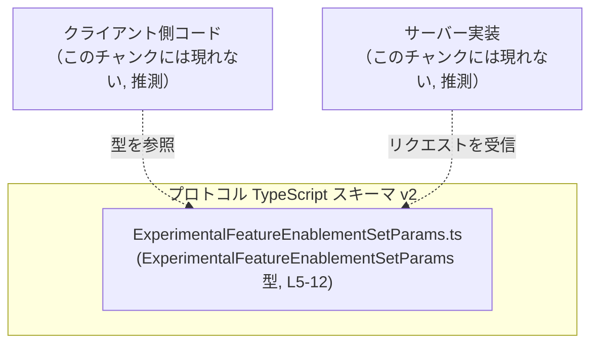
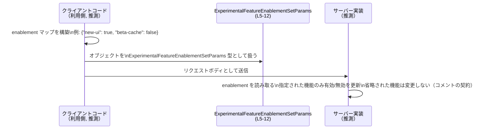

# app-server-protocol/schema/typescript/v2/ExperimentalFeatureEnablementSetParams.ts コード解説

## 0. ざっくり一言

`ExperimentalFeatureEnablementSetParams` 型は、**プロセス全体の実験的機能フラグの有効/無効を、機能名→boolean のマップとしてまとめて指定するためのパラメータ型**を定義しています（根拠: ExperimentalFeatureEnablementSetParams.ts:L5-L12）。

---

## 1. このモジュールの役割

### 1.1 概要

- このモジュールは、**プロセス全体のランタイム機能フラグをまとめて更新するための入力構造**を TypeScript の型として提供します（根拠: コメント L7-L10）。
- 具体的には、`enablement` というプロパティに、**機能の「正規化された名前」(canonical feature name) をキーとした boolean のマップ**を持つオブジェクト型を公開しています（根拠: L7, L12）。
- このファイル自体は**生成コード**であり、手動で編集しないことが明示されています（根拠: L1-L3）。

### 1.2 アーキテクチャ内での位置づけ

このファイルは `app-server-protocol/schema/typescript/v2` 配下にあり、**アプリケーションサーバーとのプロトコルで用いる TypeScript スキーマの一部**と解釈できます（ファイルパスと型名からの推測であり、このチャンクだけでは断定できません）。

依存関係として、このモジュールは**他の TypeScript モジュールを import しておらず**、純粋に型を 1 つ定義してエクスポートするだけです（根拠: L1-L12 に import 行が存在しない）。

想定される全体像を、実コードに現れている要素と「このチャンクにはないが想定される利用側」を分けて図示します。



- 実際にどのモジュールから参照されているかは、**このチャンクには現れません**。

### 1.3 設計上のポイント

- **生成コードであること**  
  - `// GENERATED CODE! DO NOT MODIFY BY HAND!` および `Do not edit this file manually.` とコメントされており、`ts-rs` によって Rust 側の型定義から生成されていることがわかります（根拠: L1-L3）。
  - 型定義を変更する場合は、**生成元（Rust 側など）を変更する前提**になっていると解釈できます。

- **責務の分割**  
  - このモジュールは**状態を持たず**, ロジックもなく、**プロトコル上のデータ構造（パラメータ型）のみ**を定義します（根拠: 関数やクラスが存在しない L1-L12）。

- **型による契約表現**  
  - `ExperimentalFeatureEnablementSetParams` は、必須プロパティ `enablement` を持つオブジェクト型です（根拠: L5, L12）。
  - `enablement` は `string` キーに対する**オプショナルな boolean 値**のマップです（`{ [key in string]?: boolean }`）（根拠: L12）。
  - コメントにより、「省略された機能は変更されず、空マップは no-op」という**意味上の契約**が説明されています（根拠: L7-L10）。

- **TypeScript 特有の型安全性**  
  - インデックスシグネチャ `{ [key in string]?: boolean }` により、マップの値は **boolean または `undefined` のみ**に制限されます（根拠: L12）。
  - ただしキーは任意の `string` であり、「canonical feature name」であることは**型では保証されず、コメントベースの約束**です（根拠: L7）。

- **並行性・エラー処理**  
  - このファイル自体には**並行処理やエラーハンドリングのロジックは存在しません**（根拠: L1-L12）。
  - コメントから「process-wide runtime feature enablement」という **プロセス全体に影響する設定**であることが読み取れるため、実際の利用側では並行更新時の扱いが重要になりますが、その実装はこのチャンクには現れません（根拠: L7）。

---

## 2. 主要な機能一覧

このファイルは 1 つの公開型のみを提供します。

- `ExperimentalFeatureEnablementSetParams`:  
  プロセス全体のランタイム機能フラグの有効/無効設定を、**機能名→boolean のマップ `enablement`** としてまとめて渡すためのパラメータ型です（根拠: L5-L12）。

---

## 3. 公開 API と詳細解説

### 3.1 型一覧（構造体・列挙体など）

| 名前 | 種別 | フィールド | 役割 / 用途 | 根拠 |
|------|------|-----------|-------------|------|
| `ExperimentalFeatureEnablementSetParams` | 型エイリアス（オブジェクト） | `enablement: { [key in string]?: boolean }` | プロセス全体の実験的機能フラグの有効/無効を、canonical な機能名をキーとするマップで指定するパラメータ型。指定された機能のみ更新し、省略された機能は変更しない。 | ExperimentalFeatureEnablementSetParams.ts:L5-L12 |

`enablement` フィールドの詳細:

- **型**: `{ [key in string]?: boolean }`（根拠: L12）  
  - 任意の `string` をキーとし、値は**オプショナルな boolean** です。
  - TypeScript の観点では、値の型は `boolean | undefined` になります。

- **意味**（コメントによる契約）:
  - 「Process-wide runtime feature enablement keyed by canonical feature name.」  
    → プロセス全体のランタイム機能フラグを、標準化された機能名でキー付けするマップです（根拠: L7）。
  - 「Only named features are updated. Omitted features are left unchanged.」  
    → マップ中に（キーとして）現れた機能のみが更新され、**マップに存在しないキーに対応する機能は変更されない**という意味です（根拠: L9）。
  - 「Send an empty map for a no-op.」  
    → `enablement` が空のマップ `{}` の場合、「何もしない(no-op)」と解釈されることが期待されています（根拠: L10）。

### 3.2 関数詳細（最大 7 件）

このファイルには**関数・メソッド・クラスの定義は存在しません**（根拠: ExperimentalFeatureEnablementSetParams.ts:L1-L12）。  
したがって、関数詳細テンプレートを適用すべき公開関数もありません。

### 3.3 その他の関数

- このチャンクには**補助関数やラッパー関数も一切定義されていません**（根拠: L1-L12）。

---

## 4. データフロー

このファイル自体には処理ロジックは含まれませんが、**コメントと型名・ファイル名**から、次のような利用シナリオが想定されます（ただし、このチャンクだけでは実装は確認できません）。

1. クライアント側コードが `ExperimentalFeatureEnablementSetParams` 型のオブジェクトを構築する。
2. それをアプリケーションサーバーに送信する（HTTP/JSON や RPC などのプロトコルは、このチャンクには現れません）。
3. サーバー側実装が `enablement` マップを読み取り、指定された機能だけの有効/無効を更新する。（省略された機能は変更しない）

この想定に基づく代表的なシーケンスを示します。



- 実際の送信方法（HTTP, WebSocket など）やサーバー側の更新ロジックは、**このチャンクには現れません**。
- 「指定された機能のみ更新し、省略された機能は変更しない」という挙動は、コメントに基づく**プロトコル上の契約**です（根拠: L9-L10）。

---

## 5. 使い方（How to Use）

### 5.1 基本的な使用方法

TypeScript でこの型を使ってオブジェクトを構築する例です。  
インポートパスはプロジェクト構成に依存するため、ここでは一例として相対パスを記述します（実際のパスはこのチャンクからは不明です）。

```typescript
// 型をインポートする                                       // 実際のパスはプロジェクト構成に依存する
import type { ExperimentalFeatureEnablementSetParams } 
  from "./ExperimentalFeatureEnablementSetParams";       // 同名ファイルから型をインポート（例）

// ExperimentalFeatureEnablementSetParams 型の値を作成する例
const params: ExperimentalFeatureEnablementSetParams = {  // params はパラメータ全体を表すオブジェクト
  enablement: {                                           // enablement プロパティは必須
    "new-ui": true,                                       // ある機能 "new-ui" を有効化する想定（推測）
    "beta-cache": false,                                  // "beta-cache" を無効化する想定（推測）
    // "other-feature" をここに書かなければ、その機能は変更されない（コメントの契約に基づく）
  },
};

// params を API クライアントなどからサーバーへ送信する           // 実際の送信処理はこのチャンクには現れない
```

TypeScript の型システム上は:

- `params.enablement` は `{ [key: string]: boolean | undefined }` に相当します。
- 型チェックにより、**値に boolean 以外を設定するとコンパイルエラー**になります（安全性）。

### 5.2 よくある使用パターン

1. **特定の機能だけを更新する（部分更新）**

```typescript
import type { ExperimentalFeatureEnablementSetParams } 
  from "./ExperimentalFeatureEnablementSetParams";  // インポート（例）

// ある1つの機能だけを有効化する                           // 他の機能の状態は変更しない
const enableNewUiOnly: ExperimentalFeatureEnablementSetParams = {
  enablement: {
    "new-ui": true,                                   // この機能だけ更新対象
    // 他の機能名は書かない → 省略された機能は変更されない（コメントの契約）
  },
};
```

1. **no-op（何もしない）リクエストを送る**

コメントに「Send an empty map for a no-op.」とあるため（根拠: L10）、`enablement` を空オブジェクトにした例です。

```typescript
import type { ExperimentalFeatureEnablementSetParams } 
  from "./ExperimentalFeatureEnablementSetParams";   // インポート（例）

// no-op を明示的に送る                                    // enablement が空マップ
const noOpParams: ExperimentalFeatureEnablementSetParams = {
  enablement: {},                                     // 空オブジェクト = no-op (コメントに基づく契約)
};
```

### 5.3 よくある間違い

この型とコメントから推測される、起こりやすそうな誤用例を示します。

```typescript
import type { ExperimentalFeatureEnablementSetParams } 
  from "./ExperimentalFeatureEnablementSetParams";

// 誤りの例: enablement プロパティ自体を省略してしまう
const wrong1: ExperimentalFeatureEnablementSetParams = {
  // enablement: ... がない → 型エラー（コンパイル時に検出される）
  // TypeScript では enablement が必須プロパティなので、このコードはコンパイルエラーになる
};

// 正しい例: enablement を必ず含める
const correct1: ExperimentalFeatureEnablementSetParams = {
  enablement: {},                                     // 空マップで no-op（コメントに基づく）
};
```

```typescript
import type { ExperimentalFeatureEnablementSetParams } 
  from "./ExperimentalFeatureEnablementSetParams";

// 注意したい例: undefined と省略の違い
const params: ExperimentalFeatureEnablementSetParams = {
  enablement: {
    "new-ui": undefined,                              // 型上は OK (boolean | undefined)
    // "beta-cache" を書かない                        // 完全に省略
  },
};

// 実際のプロトコル上で "new-ui": undefined がどのように扱われるかは
// このチャンクには示されていない                         // JSON では undefined プロパティが落ちる実装も多い
// 省略（キー自体が存在しない）と undefined が同じ扱いかどうかは
// サーバー実装依存であり、このファイルからは不明
```

- `false` と `undefined` の意味の違いはコメントから直接は分かりませんが、
  一般的なフラグの意味から、**おそらく true が有効化、false が無効化、キー省略（存在しない）が「変更しない」**という解釈が自然です。ただし、これは**コードからは断定できません**。

### 5.4 使用上の注意点（まとめ）

- **必須プロパティ `enablement`**  
  - `enablement` は必須プロパティです。省略すると TypeScript のコンパイルエラーになります（根拠: L12）。
  - 実行時に `enablement` が `undefined` になる可能性は、呼び出し側の型逸脱や外部入力のパース結果によってはあり得ます。その場合の扱いはサーバー実装依存で、このチャンクには現れません。

- **キー名の妥当性は型では保証されない**  
  - コメント上は「canonical feature name」であるべきですが（根拠: L7）、型は単なる `string` です（根拠: L12）。
  - タイポや存在しない機能名を指定しても TypeScript の型チェックでは検出されません。サーバー実装側でのバリデーションが重要になります。

- **boolean の意味**  
  - `boolean` の値が具体的に「有効/無効のどちらを表すか」はコード上には記載がなく、推測にとどまります。
  - 実装側のドキュメントや Rust 側の型定義を確認する必要があります（このチャンクには現れません）。

- **プロセス全体への影響**  
  - 「Process-wide runtime feature enablement」とあるため（根拠: L7）、この設定はプロセス全体の挙動を変える前提です。
  - 並行リクエストがある環境では、「いつ設定が反映されるか」「同時に複数の更新が来た場合の競合解決」は実装側の責務であり、この型からは分かりません。

- **セキュリティ的な注意**  
  - この型は任意の文字列キーを受け入れるため、**クライアントから送られてきたキーをそのまま信頼すると、意図しない機能が有効化される可能性**があります。
  - 実際にはサーバー側で「許可された canonical name だけ受け付ける」バリデーションを行う必要がありますが、そのロジックはこのチャンクには含まれません。

---

## 6. 変更の仕方（How to Modify）

### 6.1 新しい機能を追加する場合

ここでいう「新しい機能」は、型レベルの拡張（別のフィールド追加など）を指します。

- **手動でこのファイルを編集すべきではない**  
  - 冒頭に「GENERATED CODE! DO NOT MODIFY BY HAND!」「Do not edit this file manually.」と明記されています（根拠: L1-L3）。
  - したがって、新しいフィールドを追加したい場合は、**生成元（Rust 側の構造体や ts-rs の設定）を変更する**必要があります。

一般的な手順（このチャンクからは具体的な生成元は不明のため、抽象的な説明にとどまります）:

1. Rust 側の対応する型定義（ts-rs によって生成される元の struct など）を特定する。  
   - この情報はこのチャンクには現れません。
2. その Rust 型に新しいフィールドや属性を追加する。
3. ts-rs によるコード生成プロセスを再実行する。
4. 生成された `ExperimentalFeatureEnablementSetParams.ts` に新フィールドが反映されることを確認する。
5. そのフィールドを使用するクライアント/サーバー側コードとテストを更新する。

### 6.2 既存の機能を変更する場合

例: `enablement` の型や意味を変更したい場合です。

- **影響範囲の確認**  
  - この型を参照している TypeScript コード（クライアント側/サーバー側）の全てが影響を受けますが、このチャンクから具体的な参照先は分かりません。
  - プロジェクト全体で `ExperimentalFeatureEnablementSetParams` を検索し、利用箇所を洗い出す必要があります。

- **契約（プロトコル）の変更に注意**  
  - コメントで明示されている契約（省略された機能は変更しない、空マップは no-op）は、変更するとプロトコル互換性に影響します（根拠: L9-L10）。
  - 変更する場合は、**サーバー実装とクライアント実装の両方を同時に更新し、バージョニング（例: v2 → v3）を検討する**ことが望ましいです。

- **テストの更新**  
  - 実際のテストコードはこのチャンクには現れませんが、プロトコルの契約が変わる場合、少なくとも次のテストパターンが必要になります:
    - 機能を 1 つだけ指定した場合の挙動
    - 複数機能を同時に指定した場合
    - 空マップを送った場合
    - 無効なキー名を送った場合（サーバー側のバリデーションのテスト）

---

## 7. 関連ファイル

このチャンクには import 文や他ファイルへの直接的な参照がないため、**厳密な意味で「関連ファイル」を特定することはできません**。

確実に言えるのは、現在解説しているこのファイル自身と、コメントに登場する `ts-rs` です。

| パス / リソース | 役割 / 関係 |
|----------------|------------|
| `app-server-protocol/schema/typescript/v2/ExperimentalFeatureEnablementSetParams.ts` | 本ドキュメントの対象ファイル。`ExperimentalFeatureEnablementSetParams` 型を定義し、プロセス全体の実験的機能フラグの更新パラメータを表現する（L5-L12）。 |
| `https://github.com/Aleph-Alpha/ts-rs` | コメントに記載されたコード生成ツール。Rust の型定義からこの TypeScript 型ファイルを生成する（L3）。ローカルリポジトリ内の具体的な生成元ファイルは、このチャンクには現れません。 |

- 同ディレクトリ `app-server-protocol/schema/typescript/v2` 内には、他のプロトコル型定義ファイルが存在する可能性が高いですが、**このチャンクにはそれらの名前や内容は現れません**。
