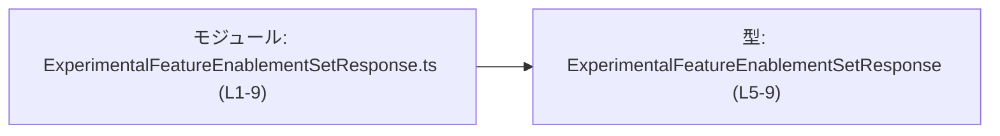
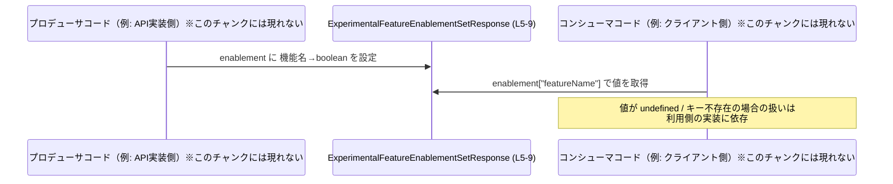

# app-server-protocol/schema/typescript/v2/ExperimentalFeatureEnablementSetResponse.ts コード解説

## 0. ざっくり一言

ExperimentalFeatureEnablementSetResponse は、「機能名（文字列）」をキー、「有効かどうか（boolean）」を値とするマップを 1 つだけ持つ TypeScript の型定義です（`enablement` プロパティ）。  
このファイルは ts-rs による自動生成ファイルであり、手動編集は想定されていません（L1–3）。

---

## 1. このモジュールの役割

### 1.1 概要

- このモジュールは TypeScript で **ExperimentalFeatureEnablementSetResponse** 型を定義し、機能の有効化状態を表すキー値マップを表現します（L5–9）。
- コメントから、特定の「リクエストにより更新された機能有効化エントリ」を表現するレスポンス用の型と解釈できます（L6–7）。
- ファイル先頭コメントより、この型定義は ts-rs により生成されたもので、手動編集しないことが明示されています（L1–3）。

**根拠**

- 自動生成・編集禁止コメント: `// GENERATED CODE! DO NOT MODIFY BY HAND!`（L1）、`Do not edit this file manually.`（L3）  
  → `ExperimentalFeatureEnablementSetResponse.ts:L1-3`
- 型定義本体とコメント: `export type ExperimentalFeatureEnablementSetResponse = { ... }`（L5–9）、`Feature enablement entries updated by this request.`（L6–7）  
  → `ExperimentalFeatureEnablementSetResponse.ts:L5-9`

### 1.2 アーキテクチャ内での位置づけ

このファイル単体から分かる事実は次のとおりです。

- app-server-protocol/schema/typescript/v2 配下の 1 ファイルであり、**TypeScript スキーマ定義群の一部**と考えられます（パス情報）。
- このファイルは他のモジュールを import しておらず、**依存先はありません**（L1–9 に import 文なし）。
- 逆に、この型を利用する側（API クライアントやサーバーコードなど）は、このチャンクには現れません（不明）。

これを踏まえて、**このチャンク内で確認できる範囲**だけを示した依存関係図は次のようになります。



※ この図は「本ファイル内での構造」を表すものであり、TypeScript クライアントやサーバーなど、他モジュールとの関係はこのチャンクからは不明です。

### 1.3 設計上のポイント

- **単一責務の型定義のみ**  
  - 唯一の公開要素は `ExperimentalFeatureEnablementSetResponse` 型 alias です（L5–9）。
- **マップ型による柔軟な表現**  
  - `enablement` は `{ [key in string]?: boolean }` で表され、任意の文字列キーに対して boolean（または省略）を対応付けるマップになっています（L9）。
- **オプショナル値による「指定／未指定」の区別**  
  - 値が `?: boolean` となっているため、あるキーについて「明示的に true/false が指定された」のか、「そもそもキーが存在しない（未指定）」のかを区別できます（L9）。
- **コンパイル時型安全性のみ・ランタイムロジックなし**  
  - 関数やクラスは存在せず、型定義のみのため、エラーハンドリングや並行性の制御はすべてこの型を利用する側のコードに委ねられます（L1–9）。

---

## 2. 主要な機能一覧

このファイルが提供する「機能」は 1 つの型定義に集約されています。

- ExperimentalFeatureEnablementSetResponse: 機能名（string）から、その有効化状態（boolean／未指定）へのマップを持つレスポンス型（L5–9）

---

## 3. 公開 API と詳細解説

### 3.1 型一覧（構造体・列挙体など）

このファイルに登場する公開型は 1 つです。

| 名前 | 種別 | 役割 / 用途 | 定義位置 & 根拠 |
|------|------|-------------|------------------|
| `ExperimentalFeatureEnablementSetResponse` | 型エイリアス（オブジェクト型） | `enablement` プロパティを 1 つ持つレスポンス型。`enablement` は「機能名 → 有効かどうか（または未指定）」のマップを表現する。 | `app-server-protocol/schema/typescript/v2/ExperimentalFeatureEnablementSetResponse.ts:L5-9` |

`enablement` プロパティの詳細:

- 型: `{ [key in string]?: boolean }`（L9）
  - 任意の文字列キーを受け付けるインデックスシグネチャ（index signature）です。
  - 各キーに対応する値は `boolean` ですが、`?` によりオプショナル指定となっており、キー自体が存在しない場合があります。
- コメント: `Feature enablement entries updated by this request.`（L6–7）  
  → 「このリクエストによって更新された機能有効化エントリ」と説明されています。

### 3.2 関数詳細（最大 7 件）

このファイルには **関数・メソッド・コンストラクタなどの実行ロジックは一切存在しません**（L1–9 に `function`, `=>` を含む関数定義や `class` がないため）。

そのため、「関数詳細」のテンプレートを適用できる対象はありません。

### 3.3 その他の関数

- 補助関数・ラッパー関数なども定義されていません（L1–9）。

---

## 4. データフロー

このファイルには実行コードはありませんが、**この型を利用する一般的なケース**として、

- どこかのコードで `ExperimentalFeatureEnablementSetResponse` 型のオブジェクトが生成され、
- 別のコードが `enablement` マップから機能の有効／無効を読み取る、

という流れが想定されます（ただし、このリポジトリに実際にそうしたコードが存在するかは、このチャンクからは分かりません）。

### 4.1 典型的な利用シナリオ（概念図）

以下は「この型が使われるとしたらどう流れるか」の一般的なイメージです。



**重要な注意**

- 上記の P/C は「一般的な利用例」を示すための仮想的な存在であり、このリポジトリ内に同名のコンポーネントが存在するかどうかは **不明** です。
- このチャンクから確実に分かるのは、「`ExperimentalFeatureEnablementSetResponse` に `enablement` というマップ状のプロパティがある」という点のみです（L5–9）。

---

## 5. 使い方（How to Use）

以下は、この型を利用する際の **一般的な TypeScript コード例**です。  
（この具体的コードがリポジトリ内に存在することを意味するものではありません。）

### 5.1 基本的な使用方法

`ExperimentalFeatureEnablementSetResponse` をインポートし、`enablement` マップから機能の有効状態を参照する例です。

```typescript
// 型定義をインポートする（パスは利用側のプロジェクト構成に合わせる）
import type { ExperimentalFeatureEnablementSetResponse } from "./ExperimentalFeatureEnablementSetResponse";

// レスポンスオブジェクトの例（型に従っている）
const response: ExperimentalFeatureEnablementSetResponse = {
    enablement: {
        featureA: true,   // featureA は有効
        featureB: false,  // featureB は無効
        // featureC はキー自体が存在しない -> 未指定
    },
};

// 特定機能が「明示的に有効」とされているかを判定する
const isFeatureAEnabled =
    response.enablement["featureA"] === true; // true

// キーが存在するか（明示的に指定されているか）を確認する
const isFeatureCSpecified =
    "featureC" in response.enablement;        // false（キーがない）
```

このように、**「キーが存在しない」ケースと「false が明示されている」ケースを区別できる**点が、この型の重要な特徴です（L9）。

### 5.2 よくある使用パターン

1. **任意の機能名に対する有効／無効を問い合わせる**

```typescript
function isFeatureEnabled(
    res: ExperimentalFeatureEnablementSetResponse,
    featureName: string,
    defaultValue: boolean = false,
): boolean {
    const value = res.enablement[featureName];  // value: boolean | undefined
    // 指定がなければ defaultValue を採用
    return value === undefined ? defaultValue : value;
}
```

- `enablement[featureName]` の型は `boolean | undefined` となり得るため、`undefined` を意識した分岐が必要です（L9）。

1. **指定された全機能を列挙する**

```typescript
function listSpecifiedFeatures(
    res: ExperimentalFeatureEnablementSetResponse,
): Array<{ name: string; enabled: boolean }> {
    return Object.entries(res.enablement)
        // [key, value] の value は boolean | undefined なのでフィルタ
        .filter(([, value]): value is boolean => value !== undefined)
        .map(([name, enabled]) => ({ name, enabled }));
}
```

- インデックスシグネチャがオプショナル (`?: boolean`) のため、`undefined` をフィルタする型ガードが有用です（L9）。

### 5.3 よくある間違い

1. **`enablement[feature]` が必ず boolean と仮定してしまう**

```typescript
// 間違い例: undefined の可能性を無視している
function isEnabledBad(
    res: ExperimentalFeatureEnablementSetResponse,
    featureName: string,
): boolean {
    // res.enablement[featureName] は boolean | undefined になり得る
    // この比較は動くが、「未指定」と「false」を区別できない
    return res.enablement[featureName] as boolean; // 型アサーションの乱用は危険
}
```

**正しい例（未指定と false を区別）:**

```typescript
function isEnabledGood(
    res: ExperimentalFeatureEnablementSetResponse,
    featureName: string,
): boolean | undefined {
    // 結果型を boolean | undefined にして、上位に判断を委ねる
    return res.enablement[featureName]; // boolean | undefined
}
```

1. **存在しないキーを「必ず false」と扱ってしまう**

```typescript
// 間違い例: 未指定を「無効」と決め打ちしてしまう
const isEnabled = response.enablement["unknownFeature"] === true;
// → この判定ロジック自体は動作するが、仕様として「未指定」をどう扱うか
//   を明確に決めていないと、意図しない挙動になり得る
```

**注意点**

- この型定義からは、「未指定（キーが存在しない）場合をどう扱うべきか」は **分かりません**。  
  → 利用側の仕様・ドキュメントで取り扱いを決める必要があります（このチャンクには現れない情報）。

### 5.4 使用上の注意点（まとめ）

- `enablement` は **任意の文字列キーを許可**するため、typo や知らないキーが紛れ込んでも型レベルでは検出されません（L9）。  
  → 重要な場面では、値の検証や許可されたキー一覧との照合が推奨されます（これは一般的な TypeScript の注意点です）。
- `enablement[featureName]` の型は `boolean | undefined` になり得るため、
  - `true` / `false` / `undefined`（およびキーが存在しない）の 3 状態をどう解釈するかを仕様として決める必要があります（L9）。
- このファイルは **自動生成であり手動編集禁止** と明示されているため（L1–3）、変更・拡張は元の定義側（ts-rs による生成元）で行う必要があります。

---

## 6. 変更の仕方（How to Modify）

### 前提

- ファイルの先頭に **「GENERATED CODE」「Do not edit this file manually」** と明記されており（L1–3）、このファイルを直接編集することは想定されていません。
- したがって、機能追加・変更は **生成元（ts-rs 側の定義）** を更新し、再生成する形で行うのが前提になっていると読み取れます。

### 6.1 新しい機能を追加する場合

ここでいう「新しい機能」とは、この型に新たなプロパティを増やす場合などを指します。

1. **このファイルを直接編集しない**  
   - コメントに反して手で編集すると、次回の自動生成で上書きされる可能性が高いです（L1–3）。
2. **ts-rs の生成元（Rust 側など）の型定義を変更する**  
   - このチャンクには生成元のコードは登場しないため、具体的なファイル名・型名は不明です。
3. **ts-rs を再実行して TypeScript スキーマを再生成する**  
   - 再生成後、このファイルの `ExperimentalFeatureEnablementSetResponse` に新しいプロパティが反映されます。

※ 生成元の場所や再生成手順は、このチャンクからは **分かりません**。

### 6.2 既存の機能を変更する場合

例: `enablement` の型を変えたい、キーを特定の enum に制限したい、など。

- **契約（Contract）の確認ポイント**
  - 現在の契約: `enablement` は「任意の文字列キー → オプショナルな boolean」というマップです（L9）。
  - これを変更すると、利用側のコード（このチャンクには現れない）が破壊的影響を受ける可能性があります。
- 変更手順（概念的）
  1. 生成元の型定義を変更する（例: `enablement` のキーを enum に制約するなど）。
  2. ts-rs で再生成する。
  3. TypeScript 側で `ExperimentalFeatureEnablementSetResponse` を利用している箇所をコンパイルエラーで洗い出し、挙動を確認する。

---

## 7. 関連ファイル

このチャンクには import/export による **直接の関連ファイル名は一切現れません**。  
したがって、具体的な関連ファイルは特定できませんが、分かる事実と推測できない点を次のように整理できます。

| パス / 種別 | 役割 / 関係 |
|------------|------------|
| （不明: 生成元ファイル） | コメントから、このファイルは ts-rs による自動生成物であることが分かります（L1–3）。しかし、どの言語・どのファイルから生成されたかは、このチャンクには現れません。 |
| （不明: 利用側 TypeScript ファイル） | `ExperimentalFeatureEnablementSetResponse` を import して利用するコードが存在する可能性がありますが、このチャンクには現れません。 |
| 同ディレクトリ `schema/typescript/v2` 配下の他ファイル | ディレクトリ構成から、他にもスキーマ定義ファイルがある可能性はありますが、具体的なファイル名や内容はこのチャンクからは分かりません。 |

---

## 付録: コンポーネントインベントリー（まとめ）

最後に、このチャンク内で確認できる「コンポーネント（型など）」を一覧します。

| コンポーネント名 | 種別 | 説明 | 定義位置 & 根拠 |
|------------------|------|------|------------------|
| `ExperimentalFeatureEnablementSetResponse` | 型エイリアス（オブジェクト型） | `enablement` プロパティ 1 つのみ持つレスポンス型。`enablement` は `{ [key in string]?: boolean }` で、任意の文字列キーに対するオプショナルな boolean を表す。 | `app-server-protocol/schema/typescript/v2/ExperimentalFeatureEnablementSetResponse.ts:L5-9` |
| `enablement` | オブジェクトプロパティ（インデックスシグネチャ） | 機能有効化エントリのマップ。キー: `string`、値: オプショナルな `boolean`。コメントで「Feature enablement entries updated by this request」と説明されている。 | `app-server-protocol/schema/typescript/v2/ExperimentalFeatureEnablementSetResponse.ts:L6-7, L9` |

---

## Bugs / Security / Contracts / Edge Cases / Tests / Performance について

このファイル自体にはロジックがないため、観点ごとのポイントを簡潔に整理します。

- **Bugs（バグの可能性）**
  - `[key in string]?: boolean` というインデックスシグネチャは、型としては問題ありませんが、「タイポしたキー」や「想定外のキー」を型レベルでは防げません（L9）。  
    → 「どのキーが妥当か」の検証は利用側で行う必要があります。
- **Security（セキュリティ）**
  - この型は任意のキーを許すため、外部からの入力をそのまま `enablement` にマッピングする場合は、予期せぬキーを無視する／エラーにするなどのポリシーを利用側で決める必要があります。
- **Contracts（契約）**
  - 契約として読み取れるのは、「`enablement` の値は `boolean` または未指定（キー不存在も含む）」という点のみです（L9）。
  - 「未指定」をどのように扱うか（デフォルト true/false など）は、このチャンクには記載がありません。
- **Edge Cases（エッジケース）**
  - キーが存在しない / 値が `undefined` のケース。
  - 空オブジェクト `{ enablement: {} }` のように、更新された機能が一つもないケース。
- **Tests（テスト）**
  - このファイル内にテストコードは存在しません（L1–9）。
- **Performance / Scalability（性能・スケーラビリティ）**
  - 型定義のみであり、本ファイル自体が性能に直接影響することはありません。
  - 実際の性能は、このマップに何件のエントリを格納し、どのように走査するかといった利用側の実装に依存します。
- **並行性**
  - TypeScript の型定義のみであり、スレッド安全性やロックなどの概念は直接は関与しません。実行時の並行利用（複数の非同期処理から同じオブジェクトを更新する等）は、利用側コードの責任範囲です。
