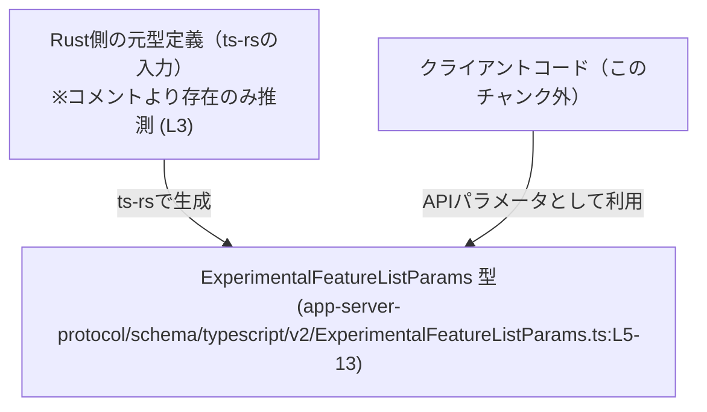
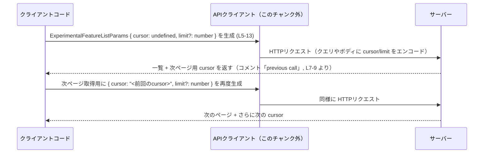

# app-server-protocol/schema/typescript/v2/ExperimentalFeatureListParams.ts

## 0. ざっくり一言

実験的な機能一覧を取得する API に対して、ページネーション用のパラメータ（`cursor` と `limit`）を TypeScript で表現するための **自動生成された型定義**です（`export type ExperimentalFeatureListParams`）。  
（コメントから、[ts-rs](https://github.com/Aleph-Alpha/ts-rs) により Rust 側の型から生成されていることが分かります。`app-server-protocol/schema/typescript/v2/ExperimentalFeatureListParams.ts:L1-3`）

---

## 1. このモジュールの役割

### 1.1 概要

- このモジュールは、サーバーが提供する「実験的機能の一覧取得」のような API に対して、**ページネーション**（cursor + limit）パラメータを安全に受け渡すための TypeScript 型を提供します。
- 具体的には、前回の呼び出しで返された不透明なカーソル文字列 `cursor` と、1ページあたりの件数を表す `limit` を持つオブジェクト型 `ExperimentalFeatureListParams` を定義しています（`app-server-protocol/schema/typescript/v2/ExperimentalFeatureListParams.ts:L5-13`）。
- コメントより、`limit` を指定しなかった場合はサーバー側の「妥当なデフォルト値」が使われる契約になっていることがわかります（`app-server-protocol/schema/typescript/v2/ExperimentalFeatureListParams.ts:L10-12`）。

### 1.2 アーキテクチャ内での位置づけ

このファイルには `import` や関数定義がなく、他モジュールとの具体的な依存関係は現れていません。  
コメントから読み取れる関係は次の通りです。

- Rust 側の型定義 → ts-rs → 本 TypeScript 型
- クライアントコード（フロントエンドや Node.js クライアントなど）が、この型を使って API 呼び出し時のパラメータを構築する

この関係を簡略化して示すと、次のようになります。



> Rust 側の具体的な型名やクライアントコードの場所は、このチャンクには現れません。

### 1.3 設計上のポイント

- **自動生成コード**  
  - 先頭コメントに「GENERATED CODE! DO NOT MODIFY BY HAND!」とあり、人手での編集禁止が明示されています（`app-server-protocol/schema/typescript/v2/ExperimentalFeatureListParams.ts:L1-3`）。
  - 変更が必要な場合は元となる Rust 型を修正し、ts-rs で再生成する前提の設計です。
- **純粋なデータ型（状態やメソッドなし）**  
  - `export type` による単なる型エイリアスであり、クラスや関数は含みません（`L5-13`）。  
  - そのため、副作用や並行性に関する懸念はありません。
- **null と optional を併用した型**  
  - `cursor?: string | null`、`limit?: number | null` のように「プロパティが **存在しない** (`undefined`)」「存在するが `null`」「存在して具体値」の 3パターンがありえます（`L9`、`L13`）。
  - strictNullChecks 有効な TypeScript では、呼び出し側で `undefined` と `null` の両方を意識する必要があります。
- **サーバー主導のページネーション契約**  
  - `cursor` は「前回の呼び出しで返された不透明なカーソル」と説明されています。クライアント側で中身を解釈しない前提の設計です（`L6-9`）。
  - `limit` のデフォルトはサーバー側に委ねられており（`L10-12`）、クライアントが値を省略するだけで標準のページサイズが利用される契約になっています。

---

## 2. 主要な機能一覧

このモジュールは型のみを提供しますが、その型が表現する機能を整理すると次の通りです。

- ページネーションカーソルの指定:  
  - `cursor?: string | null` で、前回レスポンスから得たカーソルを次ページ取得時に渡せるようにします（`L6-9`）。
- ページサイズの指定:  
  - `limit?: number | null` で、1リクエストあたりに取得したい要素数をクライアント側から指定できるようにします（`L10-12`）。
- デフォルトページサイズへのフォールバック:  
  - `limit` を省略した場合にサーバー側の「妥当なデフォルト値」を使用する、という API 契約をコメントで明示しています（`L10-12`）。

---

## 3. 公開 API と詳細解説

### 3.1 型一覧（構造体・列挙体など）

このファイルで公開されている型は 1 つです。

| 名前 | 種別 | 役割 / 用途 | 定義箇所 |
|------|------|-------------|----------|
| `ExperimentalFeatureListParams` | 型エイリアス（オブジェクト型） | 実験的機能一覧 API のページネーションパラメータを表現する。`cursor` と `limit` を持つ。 | `app-server-protocol/schema/typescript/v2/ExperimentalFeatureListParams.ts:L5-13` |

フィールドの詳細は次の通りです。

| フィールド名 | 型（TypeScript 観点） | 必須か | 説明 | 定義箇所 |
|-------------|------------------------|--------|------|----------|
| `cursor` | `string \| null`（プロパティ自体はオプショナル） | 任意 | 前回の呼び出しでサーバーから返される「不透明なページネーションカーソル」。存在しない (`undefined`)、`null`、具体的な文字列のいずれかになりうる。 | `app-server-protocol/schema/typescript/v2/ExperimentalFeatureListParams.ts:L6-9` |
| `limit` | `number \| null`（プロパティ自体はオプショナル） | 任意 | クライアントから指定するページサイズ。省略時はサーバー側で「妥当なデフォルト値」が使われる。存在しない (`undefined`)、`null`、具体的な数値のいずれかになりうる。`null` の扱いはこのチャンクからは不明。 | `app-server-protocol/schema/typescript/v2/ExperimentalFeatureListParams.ts:L10-13` |

#### TypeScript 的な注意点

- `cursor?: string | null` は、実際には `cursor: string | null | undefined` とほぼ同義です。
- `limit` も同様に `number | null | undefined` になりうるため、利用側では `cursor == null` / `cursor === undefined` のどちらのケースも考慮する必要があります。
- strictNullChecks が有効なプロジェクトでは、型ガードや null 合体演算子 (`??`) を用いた値の扱いが推奨されます。

### 3.2 関数詳細（最大 7 件）

このファイルには **関数・メソッドは一切定義されていません**（`export type` のみ、`L5-13`）。  
そのため、関数用テンプレートに基づく詳細解説の対象はありません。

### 3.3 その他の関数

同上の理由により、補助的な関数やラッパー関数もこのチャンクには存在しません。

---

## 4. データフロー

このファイルには実行コードが存在しないため、関数呼び出しレベルのデータフローは読み取れません。  
ただし、コメントから「前回の呼び出しで返されたカーソルを使ってページングする」ことが明記されているため、典型的な利用シナリオは次のようになります。

1. クライアントが `ExperimentalFeatureListParams` を使って最初のページ（`cursor` なし）をリクエストする。
2. サーバーが一覧とともに「次ページ取得用のカーソル文字列」を返す。
3. クライアントがそのカーソルを `cursor` プロパティにセットし、再度一覧 API を呼ぶ。

これを概念的なシーケンス図で示します（API クライアントやサーバー実装は別ファイルに存在する想定であり、このチャンクには現れません）。



> 関数名やエンドポイント URL はこのチャンクには現れないため、図では抽象化した表現のみを用いています。

---

## 5. 使い方（How to Use）

### 5.1 基本的な使用方法

`ExperimentalFeatureListParams` 型を利用して、API クライアントにパラメータを渡す典型的なコード例です。

```typescript
// 型定義のインポート（相対パスやエイリアスはプロジェクト構成によって異なる）
// 本チャンクには import 例は出現しないため、パスは一例です。
import type { ExperimentalFeatureListParams } from "./ExperimentalFeatureListParams";

// 1ページ目を取得するためのパラメータ
const firstPageParams: ExperimentalFeatureListParams = {
    // cursor は指定しない（undefined）。最初のページという意味合いになることが多いが、
    // 正確な挙動は API ドキュメントを参照する必要があります。
    limit: 50, // 1ページあたり 50 件を要求
};

// 例: 一覧を取得する関数に渡す（関数自体はこのチャンクには現れません）
// const result = await fetchExperimentalFeatures(firstPageParams);

// 返ってきたレスポンスに "nextCursor" のようなカーソルが含まれていると仮定
declare const nextCursorFromServer: string;

// 2ページ目以降の取得
const nextPageParams: ExperimentalFeatureListParams = {
    cursor: nextCursorFromServer, // 前回のレスポンスから得たカーソル
    limit: 50,
};
```

このように、`ExperimentalFeatureListParams` は「ページング用の追加情報だけ」をまとめた小さな DTO（データ転送オブジェクト）のように振る舞います。

### 5.2 よくある使用パターン

1. **最初のページのみ、`limit` のみ指定**

   ```typescript
   const params: ExperimentalFeatureListParams = {
       limit: 20, // 1ページ目、20件取得
       // cursor は省略
   };
   ```

   - `cursor` を省略することで「最初のページ」を意味する API が多いです。ただし、この挙動はこのチャンクからは断定できないため、実際にはサーバー側の仕様書を確認する必要があります。

2. **次ページを取得する際に `cursor` を指定**

   ```typescript
   declare const cursorFromPreviousCall: string; // サーバーから返されたカーソル

   const params: ExperimentalFeatureListParams = {
       cursor: cursorFromPreviousCall,
       // limit を省略すると、コメントの通りサーバー側のデフォルト値が使われる想定 (L10-12)
   };
   ```

3. **ページサイズをサーバーデフォルトに任せる**

   ```typescript
   const params: ExperimentalFeatureListParams = {
       // limit は指定しない
       // cursor は必要に応じて指定
   };
   ```

   - コメントに「Optional page size; defaults to a reasonable server-side value.」とあるため、`limit` を完全に省略すればサーバーがページサイズを決めます（`L10-12`）。
   - `limit: null` を明示的に送った場合の意味は、このチャンクだけからは分かりません。

### 5.3 よくある間違い

コードから推測できる、起こりがちな誤用例と、その修正版を示します。

```typescript
// 誤りの例: cursor を空文字で初期化してしまう
const wrongParams1: ExperimentalFeatureListParams = {
    cursor: "",   // 空文字を「カーソルなし」の意味で使うと、サーバーによってはエラーや予期しない挙動になる可能性
};

// 改善例: cursor を省略するか null を使う
const correctParams1: ExperimentalFeatureListParams = {
    // cursor は省略（undefined）または
    // cursor: null,
};
```

```typescript
// 誤りの例: limit に不適切な値を入れる
const wrongParams2: ExperimentalFeatureListParams = {
    limit: -1,  // 負の値や 0 が許容されるかは不明。多くの API ではエラーになる可能性
};

// 改善例: サーバーの仕様で許容される範囲の正の整数のみを入れる
const correctParams2: ExperimentalFeatureListParams = {
    limit: 50,  // 1以上の妥当な値
};
```

```typescript
// 誤りの例: null と undefined の違いを意識していない
function useParams(params: ExperimentalFeatureListParams) {
    // strictNullChecks が有効だと、params.limit は number | null | undefined
    // なのに、直接数値として使おうとするとコンパイルエラーや実行時エラーの原因になる
    // const pageSize = params.limit * 2; // コンパイルエラー or 実行時に NaN になる可能性
}

// 改善例: null 合体演算子などで安全に扱う
function useParamsSafely(params: ExperimentalFeatureListParams) {
    const pageSize = (params.limit ?? 50); // limit が null/undefined の場合は 50 とする
}
```

### 5.4 使用上の注意点（まとめ）

- **カーソルは「不透明」**  
  - コメントに `Opaque pagination cursor` とある通り（`L6-9`）、`cursor` の内部構造に依存せず、サーバーから渡された文字列をそのまま使うのが前提です。
- **null と undefined の扱い**  
  - `cursor` / `limit` は「オプショナルかつ null 許容」です。クライアント側で `undefined` と `null` を区別して扱う必要があります。
- **limit の値域**  
  - 型的にはどんな数値でも代入できますが、負数や 0、過大な値はサーバー側で拒否されたり、性能問題を引き起こす可能性があります。許容範囲は API ドキュメントに従う必要があります（このチャンクからは分かりません）。
- **セキュリティ・DoS 観点**  
  - 非常に大きな `limit` をクライアントから送ると、大量データ取得によるサーバー負荷増大や帯域圧迫の一因になりえます。そのため、クライアント側でも常識的な上限を設けることが望ましいです（契約は別途 API 側で定義されているはずですが、このチャンクには現れません）。
- **並行性**  
  - この型自体は単なるデータ定義であり、スレッドセーフ性やロックなどの並行性の問題は持ちません。並行呼び出し時の挙動はサーバー実装側の問題になります。

---

## 6. 変更の仕方（How to Modify）

先頭コメントにある通り、このファイルは **自動生成コードであり、手動での編集は禁止** されています（`L1-3`）。

### 6.1 新しい機能を追加する場合

例えば、新たなフィルタ条件（例: feature の種別や状態）をパラメータに追加したい場合、直接この TypeScript ファイルを編集するのではなく、次のような流れになります。

1. **ts-rs の生成元となる Rust 側の型定義を変更する**  
   - Rust の構造体や型にフィールドを追加する。  
   - 具体的なファイル名や型名は、このチャンクからは分かりません。
2. **ts-rs を再実行して TypeScript コードを再生成する**  
   - これにより、本ファイルの `ExperimentalFeatureListParams` に新フィールドが自動反映されます。
3. **クライアントコード側で新フィールドに対応する**  
   - 新しく追加されたプロパティを使って API 呼び出しのパラメータを組み立てるようにします。

### 6.2 既存の機能を変更する場合

すでに存在するフィールド（`cursor` や `limit`）の意味や型を変える場合も、同様に Rust 側から変更する必要があります。

変更時の注意点:

- **契約の変更に注意**  
  - 例えば `limit` の型を `number` から `string` に変えるような変更は、サーバー側 API の契約変更になります。クライアントコードの既存利用箇所への影響が大きいため、影響範囲を事前に確認する必要があります。
- **null / optional の取り扱い**  
  - `cursor?: string | null` を `cursor: string` のような必須プロパティに変えると、多くの既存コードがコンパイルエラーになる可能性があります。
- **テスト**  
  - このチャンクにはテストコードは含まれていませんが、型変更に伴う API 呼び出しテストや E2E テストの更新が必要になると考えられます。

---

## 7. 関連ファイル

このチャンクには import や参照情報がないため、具体的な関連ファイルパスは分かりません。ただし、コメントから存在が示唆されるものを挙げます。

| パス | 役割 / 関係 |
|------|------------|
| （不明：Rust 側 ts-rs 入力ファイル） | ts-rs が読み込む元の Rust 型定義。ここでフィールドを追加・変更することで、本 TypeScript 型が再生成されると考えられます（コメント `L3` から ts-rs 利用が分かります）。 |
| （不明：API クライアントコード） | `ExperimentalFeatureListParams` 型を import して、HTTP リクエストのパラメータ（クエリ文字列や JSON ボディ）に変換しているはずですが、このチャンクには現れません。 |

> 具体的なファイル名やディレクトリ構造は、このチャンクのみからは特定できません。
