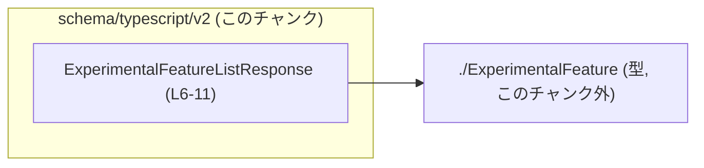
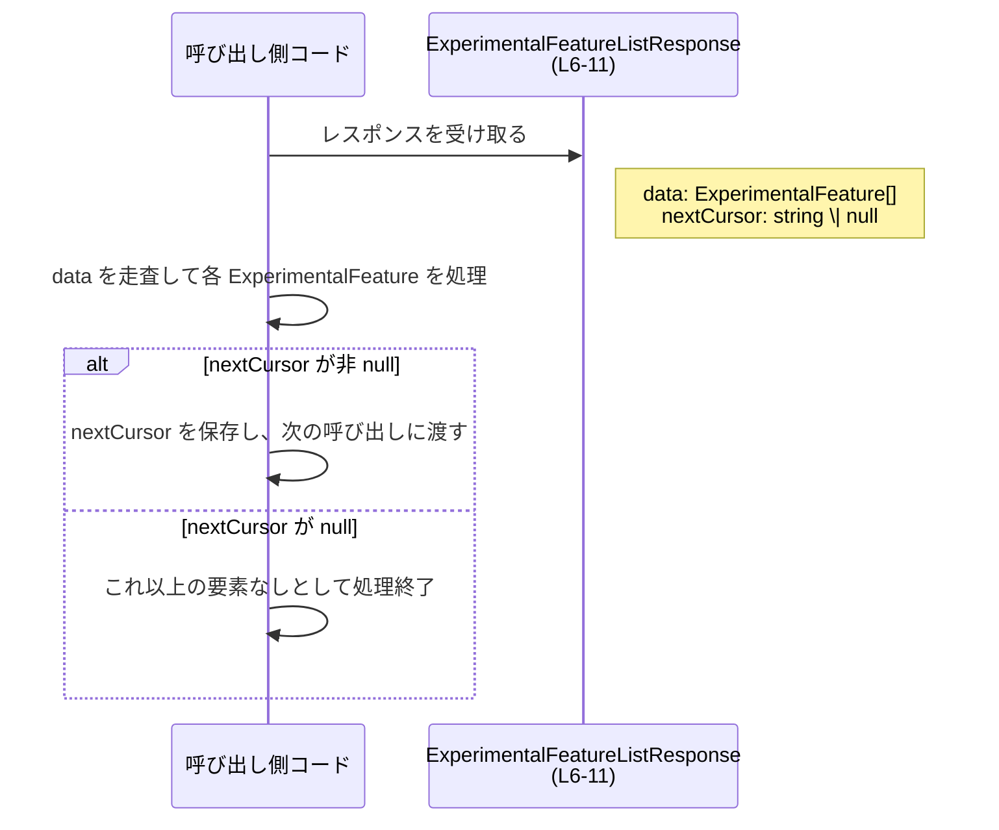

# app-server-protocol/schema/typescript/v2/ExperimentalFeatureListResponse.ts コード解説

## 0. ざっくり一言

`ExperimentalFeature` の一覧と、ページネーション用のカーソルを表現する **レスポンスオブジェクトの型エイリアス** を定義しているファイルです（ExperimentalFeatureListResponse.ts:L4-11）。

---

## 1. このモジュールの役割

### 1.1 概要

- このモジュールは、実験的機能（`ExperimentalFeature`）の一覧と、それをページング取得するためのカーソルをまとめたレスポンス型 `ExperimentalFeatureListResponse` を提供します（ExperimentalFeatureListResponse.ts:L4,L6-11）。
- コード先頭のコメントから、このファイルは `ts-rs` というツールによって自動生成されており、手動編集は想定されていません（ExperimentalFeatureListResponse.ts:L1-3）。

### 1.2 アーキテクチャ内での位置づけ

- このモジュールは、`./ExperimentalFeature` で定義されている `ExperimentalFeature` 型に依存しています（ExperimentalFeatureListResponse.ts:L4）。
- 逆に、このモジュールを利用する側（API クライアントやサービス層など）がどこにあるかは、このチャンクからは分かりません。

依存関係を簡単な Mermaid 図で表すと次のようになります。



### 1.3 設計上のポイント

- **自動生成コード**  
  - 冒頭コメントに「GENERATED CODE」「Do not edit this file manually」と明記されています（ExperimentalFeatureListResponse.ts:L1-3）。
- **型エイリアスによるレスポンス表現**  
  - `export type ExperimentalFeatureListResponse = { ... }` という **オブジェクト型のエイリアス** として定義されています（ExperimentalFeatureListResponse.ts:L6-11）。
- **ページネーション情報の埋め込み**  
  - `data: Array<ExperimentalFeature>` によって要素本体の配列が、`nextCursor: string | null` によってページネーションのカーソルが表現されています（ExperimentalFeatureListResponse.ts:L6,L11）。
  - コメントから、`nextCursor` は「次の呼び出しに渡す不透明なカーソル」であり、カーソルが存在しない場合は `None`（TS 側では `null`）になることが読み取れます（ExperimentalFeatureListResponse.ts:L7-9,L11）。
- **ランタイムロジックなし**  
  - このファイルには関数やクラスはなく、**型情報のみ** が定義されています（ExperimentalFeatureListResponse.ts:L4-11）。

---

## 2. 主要な機能一覧

このモジュールにおける「機能」は、全て型定義として提供されています。

- `ExperimentalFeatureListResponse`:  
  `ExperimentalFeature` の配列と、次ページ取得のためのカーソルを持つレスポンスオブジェクト型です（ExperimentalFeatureListResponse.ts:L6-11）。

---

## 3. 公開 API と詳細解説

### 3.1 型一覧（構造体・列挙体など）

| 名前 | 種別 | 役割 / 用途 | 定義・使用箇所 |
|------|------|-------------|----------------|
| `ExperimentalFeatureListResponse` | 型エイリアス（オブジェクト型） | 実験的機能の一覧 `data` と次ページ用カーソル `nextCursor` をまとめたレスポンス型 | 定義: ExperimentalFeatureListResponse.ts:L6-11 |
| `ExperimentalFeature` | 型（別ファイル） | `data` 配列の要素型。実験的機能 1 件を表すと考えられますが、このチャンクには定義がありません | インポート: ExperimentalFeatureListResponse.ts:L4 |

#### `ExperimentalFeatureListResponse`

```ts
export type ExperimentalFeatureListResponse = {
    data: Array<ExperimentalFeature>,
    /**
     * Opaque cursor to pass to the next call to continue after the last item.
     * If None, there are no more items to return.
     */
    nextCursor: string | null,
};
```

- `data: Array<ExperimentalFeature>`  
  - 0 個以上の `ExperimentalFeature` を要素とする配列です（ExperimentalFeatureListResponse.ts:L6）。
  - 要素数や順序についての制約は、このチャンクからは分かりません。
- `nextCursor: string | null`  
  - コメントによれば、「最後の要素の後から続けるために、次の呼び出しに渡す不透明（opaque）なカーソル」です（ExperimentalFeatureListResponse.ts:L7-8）。
  - コメントの「If None, there are no more items to return」という文から、カーソルが `null` の場合は「続きを取得するデータがない」ことを意味する契約になっていると読み取れます（ExperimentalFeatureListResponse.ts:L9,L11）。

### 3.2 関数詳細

- このファイルには **関数・メソッドは定義されていません**（ExperimentalFeatureListResponse.ts:L1-11）。

### 3.3 その他の関数

- 該当なし（このチャンク内に関数は存在しません）。

---

## 4. データフロー

このファイルは型定義のみですが、コメントに基づいて `ExperimentalFeatureListResponse` がどのように利用されるかの典型的なフローを示します。

- 呼び出し側コードは、何らかの手段で `ExperimentalFeatureListResponse` 型の値を受け取ります。
- `data` 配列の各 `ExperimentalFeature` を処理します。
- `nextCursor` が `string` の場合は、それを次の呼び出しに渡して続きを取得します。
- `nextCursor` が `null` の場合は、「もう返す要素がない」と判断します（ExperimentalFeatureListResponse.ts:L7-9,L11）。



> この図は、`nextCursor` に関するコメント（ExperimentalFeatureListResponse.ts:L7-9）から読み取れる一般的な利用イメージを示したものです。実際にどの関数がこの型を返すかなどは、このチャンクには現れていません。

---

## 5. 使い方（How to Use）

### 5.1 基本的な使用方法

以下は、`ExperimentalFeatureListResponse` を利用して、ページングされた一覧をすべて取得する例です。  
`fetchExperimentalFeaturesPage` は、この型を返す仮想的な関数であり、このチャンク内には定義されていません。

```ts
import type {
    ExperimentalFeatureListResponse,
} from "./ExperimentalFeatureListResponse"; // このファイルをインポートする（パスは実際の構成に合わせて調整）

// 1ページ分の ExperimentalFeature を取得する関数の例
// 実際の実装はこのチャンクには存在しません。
async function fetchExperimentalFeaturesPage(
    cursor: string | null,
): Promise<ExperimentalFeatureListResponse> {
    // ここで HTTP リクエストなどを行い、ExperimentalFeatureListResponse を返す想定
    throw new Error("not implemented");
}

// すべての ExperimentalFeature をページングしながら取得する例
async function loadAllExperimentalFeatures() {
    let cursor: string | null = null; // 最初はカーソルなし

    const allFeatures: ExperimentalFeature[] = []; // すべての機能を集約する配列

    while (true) {
        // cursor（null または string）を渡して1ページ取得
        const response: ExperimentalFeatureListResponse =
            await fetchExperimentalFeaturesPage(cursor);

        // data 配列を結合
        allFeatures.push(...response.data);

        // nextCursor が null なら終了（続きなし）
        if (response.nextCursor === null) {
            break;
        }

        // 次ページ取得のためにカーソルを更新
        cursor = response.nextCursor;
    }

    return allFeatures;
}
```

この例から分かるポイント:

- `nextCursor` は `string | null` のため、**必ず null チェックが必要**です（ExperimentalFeatureListResponse.ts:L11）。
- `data` は配列なので、スプレッド構文などでまとめて扱えます（ExperimentalFeatureListResponse.ts:L6）。

### 5.2 よくある使用パターン

1. **単一ページだけを利用する**

```ts
async function loadFirstPageOnly() {
    const res: ExperimentalFeatureListResponse =
        await fetchExperimentalFeaturesPage(null); // 最初はカーソルなし

    // 1ページ目の data だけを使う
    for (const feature of res.data) {
        // feature: ExperimentalFeature 型（詳細は別ファイル）
        console.log(feature);
    }

    // nextCursor を無視するので、続きは取得しない
}
```

1. **カーソルを外部に保存して再開する**

```ts
async function loadWithResume(savedCursor: string | null) {
    const res: ExperimentalFeatureListResponse =
        await fetchExperimentalFeaturesPage(savedCursor);

    // 必要な処理
    // ...

    // 次のカーソルがあれば保存しておく
    if (res.nextCursor !== null) {
        // 例えば DB やローカルストレージに保存
        await saveCursor(res.nextCursor);
    }
}
```

### 5.3 よくある間違い

```ts
async function wrongUsage() {
    const res: ExperimentalFeatureListResponse =
        await fetchExperimentalFeaturesPage(null);

    // ❌ 間違い例: nextCursor を常に string と仮定している
    // コンパイル時にエラーになる（string | null を string として扱っているため）
    const next: string = res.nextCursor; // エラー: 'string | null' を 'string' に代入できない

    // ❌ 間違い例: 続きがないのに再リクエストしてしまう
    if (!res.nextCursor) {
        // falsy 判定だと ""（空文字）が "続きなし" と誤解される可能性がある
        // 型上は "" も有効な string として扱われるため、"続きなし" は null のみに限定すべき
    }
}
```

```ts
async function correctUsage() {
    const res: ExperimentalFeatureListResponse =
        await fetchExperimentalFeaturesPage(null);

    // ✅ 正しい例: null チェックを行ってから string として扱う
    if (res.nextCursor !== null) {
        const next: string = res.nextCursor; // ここでは string に絞り込まれている
        await fetchExperimentalFeaturesPage(next);
    }

    // ✅ 正しい例: 続きがあるかどうかの判定は "=== null" で行う
    const hasMore = res.nextCursor !== null;
}
```

### 5.4 使用上の注意点（まとめ）

- **`nextCursor` の null 取り扱い**  
  - 型上、「続きがない」ことは `nextCursor: null` で表現されます（ExperimentalFeatureListResponse.ts:L11）。
  - 空文字 `""` や `undefined` ではなく、**null だけ** を「続きなし」とみなすのが安全です。
- **`nextCursor` は不透明（opaque）**  
  - コメント上「Opaque cursor」とされているため（ExperimentalFeatureListResponse.ts:L7）、文字列の中身の構造に依存した処理（パースなど）は避け、単に **次の呼び出しにそのまま渡すトークン** として扱うことが想定されています。
- **`data` の要素数**  
  - 型上、`data` は空配列も許容されます（ExperimentalFeatureListResponse.ts:L6）。
  - 要素数が 0 の場合でも、`nextCursor` が非 null であれば「続きがある」ケースがあり得ますが、そのような仕様かどうかはこのチャンクからは分かりません。
- **型安全性とエラー**  
  - TypeScript の型チェックにより、`nextCursor` の null チェック忘れなどはコンパイル時に検出されます。
  - `any` への代入や型アサーションでこの型を無視すると、実行時に `null` に対して文字列メソッドを呼び出すようなエラーが起き得ます。
- **並行性**  
  - この型自体は単なるデータ構造であり、並行・非同期実行に関する情報は持ちません。
  - 同じ `nextCursor` を複数の非同期処理で同時に使うと、API 側の仕様によっては意図しない結果になる可能性がありますが、その仕様はこのチャンクからは分かりません。

---

## 6. 変更の仕方（How to Modify）

### 6.1 新しいフィールドを追加する場合

- 冒頭コメントにある通り、このファイルは `ts-rs` による自動生成コードであり、**直接編集すべきではありません**（ExperimentalFeatureListResponse.ts:L1-3）。
- 新しいフィールド（例: `totalCount` など）をレスポンスに追加したい場合は、
  1. `ts-rs` に入力される元のスキーマ定義（おそらく別言語の型または構造体）を修正する。
  2. `ts-rs` によるコード生成プロセスを再実行する。
- 元のスキーマ定義がどこにあるか／どのような形式かは、このチャンクには現れていないため **不明** です。

### 6.2 既存の型定義を変更する場合

- 例えば `nextCursor` の型を `string | null` から `string | undefined` に変えたい、といった変更も、直接このファイルを編集するのではなく、元スキーマを変更して再生成する必要があります（ExperimentalFeatureListResponse.ts:L1-3,L11）。
- 変更時に注意すべき点:
  - **契約の変更**:  
    - `nextCursor` の意味（null の扱いなど）はコメントにも書かれているため（ExperimentalFeatureListResponse.ts:L7-9）、型だけでなくドキュメント側との整合性も確認する必要があります。
  - **影響範囲の把握**:  
    - 他の TypeScript コードで `ExperimentalFeatureListResponse` を使用している箇所（`nextCursor` の null チェックなど）は、すべて確認・修正する必要があります。
  - **テスト**:  
    - このファイルにはテストコードは含まれていないため（ExperimentalFeatureListResponse.ts:L1-11）、別途存在するテストスイートでレスポンス形式の変更が問題なく扱われているかを確認する必要がありますが、その場所はこのチャンクからは分かりません。

---

## 7. 関連ファイル

| パス（推定を含む） | 役割 / 関係 |
|--------------------|------------|
| `app-server-protocol/schema/typescript/v2/ExperimentalFeature.ts` | `import type { ExperimentalFeature } from "./ExperimentalFeature";` で参照されている型定義ファイルです（ExperimentalFeatureListResponse.ts:L4）。中身はこのチャンクには現れていないため不明ですが、`data` 配列の要素型として利用されます（ExperimentalFeatureListResponse.ts:L6）。 |
| `ts-rs` の入力元スキーマファイル | コメントより、このファイルは `ts-rs` により生成されています（ExperimentalFeatureListResponse.ts:L1-3）。その入力元となるスキーマ（おそらく別言語の型定義）が存在するはずですが、このチャンクからはパス・形式ともに不明です。 |

このファイル自体は小規模で、型定義のみを提供しているため、主に「他のモジュールからどのように利用されるか」が重要になります。
