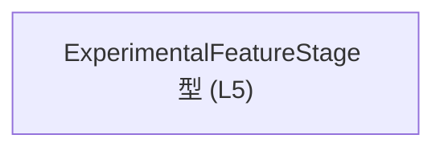
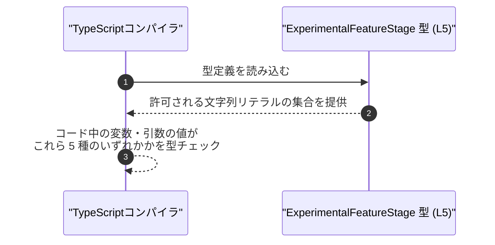

# app-server-protocol/schema/typescript/v2/ExperimentalFeatureStage.ts コード解説

## 0. ざっくり一言

`ExperimentalFeatureStage` という、**実験的な機能のステージ（状態）を表す文字列リテラルのユニオン型**を定義する、自動生成された TypeScript 型定義ファイルです  
（app-server-protocol/schema/typescript/v2/ExperimentalFeatureStage.ts:L1-5）。

---

## 1. このモジュールの役割

### 1.1 概要

- このファイルは、`ExperimentalFeatureStage` という **型エイリアス**を 1 つだけ公開します  
  （app-server-protocol/schema/typescript/v2/ExperimentalFeatureStage.ts:L5-5）。
- 型の実体は `"beta" | "underDevelopment" | "stable" | "deprecated" | "removed"` という **文字列リテラル型のユニオン**です  
  （同 L5-5）。
- 先頭コメントから、`ts-rs` によって自動生成されたファイルであり、手動編集しない前提であることが分かります  
  （同 L1-3）。

> 名称から「実験的な機能のライフサイクル段階」を表す意図が推測できますが、**具体的にどの機能に対応するか、どこで使われるかはこのファイルからは分かりません**。

### 1.2 アーキテクチャ内での位置づけ

- ディレクトリパスから、この型は **`app-server-protocol` の TypeScript スキーマ v2 群の一部**と位置付けられます  
  （パス名: `schema/typescript/v2/ExperimentalFeatureStage.ts` はファイルパスから読み取れる事実です）。
- このファイル自体は他の型やモジュールを **インポートしておらず**、依存関係を持たない独立した型定義です  
  （app-server-protocol/schema/typescript/v2/ExperimentalFeatureStage.ts:L1-5）。

依存関係（このファイルから見える範囲）を図にすると、次のようになります。



### 1.3 設計上のポイント

コードから読み取れる設計上の特徴は次の通りです。

- **自動生成ファイルである**
  - 先頭コメントで「GENERATED CODE」「ts-rs により生成」「Do not edit manually」と明示されています  
    （app-server-protocol/schema/typescript/v2/ExperimentalFeatureStage.ts:L1-3）。
  - 変更は元定義側（通常は Rust 側）とコード生成プロセス経由で行う前提です。
- **閉じられた集合としてのユニオン型**
  - 許可される文字列値は 5 つに限定されており、それ以外はコンパイル時に型エラーになります  
    （同 L5-5）。
- **ランタイムのロジック・状態を持たない**
  - 関数やクラス、実行時処理は一切含まれず、**型情報のみ**を提供します  
    （同 L1-5）。
- **TypeScript 特有の安全性**
  - `string` 全体ではなくリテラルのユニオンとして定義することで、IDE 補完や型チェックにより安全にステージを扱える構造になっています（L5-5）。

---

## 2. 主要な機能一覧

このファイルが提供する機能は 1 つだけです。

- `ExperimentalFeatureStage` 型: 実験的機能のステージを 5 種類の文字列リテラルのいずれかに制約する型  
  （app-server-protocol/schema/typescript/v2/ExperimentalFeatureStage.ts:L5-5）。

---

## 3. 公開 API と詳細解説

## 3.1 型一覧（構造体・列挙体など）

このファイルで公開されている型（コンポーネント）のインベントリーです。

| 名前                     | 種別        | 役割 / 用途                                                                                           | 許可される値                                                                                          | 定義箇所                                                                                                      |
|--------------------------|-------------|--------------------------------------------------------------------------------------------------------|-------------------------------------------------------------------------------------------------------|----------------------------------------------------------------------------------------------------------------|
| `ExperimentalFeatureStage` | 型エイリアス | 実験的な機能のステージを表す文字列リテラルのユニオン型。値を 5 つの状態に限定し、型安全に扱うための定義。 | `"beta"`, `"underDevelopment"`, `"stable"`, `"deprecated"`, `"removed"`                              | `app-server-protocol/schema/typescript/v2/ExperimentalFeatureStage.ts:L5-5` |

### 型の意味と TypeScript 特有の安全性

- **型エイリアス**として宣言されています。

  ```typescript
  export type ExperimentalFeatureStage =
      "beta" | "underDevelopment" | "stable" | "deprecated" | "removed";
  // app-server-protocol/schema/typescript/v2/ExperimentalFeatureStage.ts:L5-5
  ```

- このような **文字列リテラルユニオン型**にすることで:
  - `"beta"` など既定 5 種類以外の文字列を代入すると **コンパイル時エラー**になります。
  - IDE では 5 種類の候補が補完され、スペルミスによるバグを減らせます。
- なお、この型は**コンパイル時にのみ存在する型情報**であり、**ランタイムのチェックや変換処理は含まれていません**（コードに実行時ロジックがないため: L1-5）。

### エラー・並行性との関係（TypeScript 観点）

- **エラー安全性**
  - この型自体は実行時コードを持たないため、ランタイムエラーを直接発生させることはありません。
  - 型が付いた変数・引数に誤った文字列リテラルを渡した場合、**コンパイル時にエラー**となります（TypeScript の標準的挙動）。
- **並行性**
  - 非同期処理や共有状態を扱うコードは含まれておらず、並行性・スレッド安全性に関する懸念点は、このファイル単体からはありません（L1-5）。

---

### 3.2 関数詳細（最大 7 件）

このファイルには **関数・メソッドは一切定義されていません**  
（app-server-protocol/schema/typescript/v2/ExperimentalFeatureStage.ts:L1-5）。

そのため、関数詳細テンプレートに基づいて解説すべき対象はありません。

---

### 3.3 その他の関数

| 関数名 | 役割（1 行） |
|--------|--------------|
| なし   | このファイルには関数が存在しません |

---

## 4. データフロー

### このファイル内でのデータフロー

- このファイルには **値の生成・変換・送受信といった処理は存在せず**、実行時のデータフローは定義されていません  
  （app-server-protocol/schema/typescript/v2/ExperimentalFeatureStage.ts:L1-5）。
- 唯一の役割は、TypeScript コンパイラに対して「`ExperimentalFeatureStage` とは 5 つの文字列リテラルのどれかである」という型制約を提供することです（L5-5）。

### コンパイル時の利用イメージ（概念図）

以下は、**この型が一般的にどのようにコンパイル時に利用されるかを示す概念図**です。  
※あくまで TypeScript の一般的な動作イメージであり、このリポジトリ内の実際の利用コードはこのチャンクからは分かりません。



---

## 5. 使い方（How to Use）

### 5.1 基本的な使用方法

`ExperimentalFeatureStage` 型を使って、変数や関数の引数・戻り値を 5 種類のステージに制限する例です。  
インポートパスは、実際の使用場所に応じて調整が必要です（ここでは同ディレクトリからの相対インポート例を示します）。

```typescript
// ExperimentalFeatureStage 型をインポートする                    // このファイルが同じディレクトリにあると仮定したインポート例
import type { ExperimentalFeatureStage } from "./ExperimentalFeatureStage";

// 実験的機能のステージを保持する変数を宣言する                   // 変数 stage は 5 種のいずれかの文字列しか代入できない
let stage: ExperimentalFeatureStage = "beta";

// 許可された別の値を代入する                                     // OK: "stable" はユニオン型の一部
stage = "stable";

// 禁止されている値を代入しようとするとコンパイルエラー           // NG: "experimental" は型に含まれていない
// stage = "experimental";  // コンパイルエラー（型 '\"experimental\"' を型 'ExperimentalFeatureStage' に割り当てできません）

// 関数の引数に使用する例                                         // 引数 stage は 5 種のいずれかに限定される
function setFeatureStage(stage: ExperimentalFeatureStage) {
    console.log("Feature stage:", stage);                      // 引数が型で制約されているため、ここでは想定外の値は来ない
}

// 正しい呼び出し例                                               // OK
setFeatureStage("deprecated");

// 誤った呼び出し例                                               // NG: "alpha" は型に含まれない
// setFeatureStage("alpha");  // コンパイルエラー
```

このように、**不正な値はコンパイル時に検出される**ため、ランタイムでのステージ値の取り違えを防ぎやすくなります。

### 5.2 よくある使用パターン

1. **オブジェクトのフィールドに使う**

   ```typescript
   import type { ExperimentalFeatureStage } from "./ExperimentalFeatureStage";

   // 実験的機能のメタ情報を表す型                              // stage フィールドに ExperimentalFeatureStage 型を使用
   interface ExperimentalFeatureInfo {
       name: string;                                           // 機能名
       stage: ExperimentalFeatureStage;                         // 機能のステージ
   }

   const feature: ExperimentalFeatureInfo = {
       name: "New UI",
       stage: "underDevelopment",                              // 許可された値の一つ
   };
   ```

2. **API のパラメータ・レスポンス型に使う**

   ```typescript
   import type { ExperimentalFeatureStage } from "./ExperimentalFeatureStage";

   // ステージを更新する API の引数型                           // サーバーと通信するクライアント側型などを表現できる
   interface UpdateStageRequest {
       featureId: string;                                      // 機能を識別する ID
       newStage: ExperimentalFeatureStage;                     // 新しいステージ
   }
   ```

   ※上記は一般的な使用例であり、実際にこのような API 型が存在するかどうかはこのチャンクからは分かりません。

### 5.3 よくある間違い

**誤用例: `string` 型をそのまま使ってしまう**

```typescript
// 間違い例: string 型をそのまま使う                            // どんな文字列でも代入できてしまう
let stage: string;
stage = "beta";                                                // 一見正しい
stage = "bete";                                                // タイポでもコンパイルは通る
```

**正しい例: `ExperimentalFeatureStage` を使う**

```typescript
// 正しい例: ExperimentalFeatureStage 型を使う                  // 許可された 5 つの値のみに制限される
import type { ExperimentalFeatureStage } from "./ExperimentalFeatureStage";

let stage: ExperimentalFeatureStage;
stage = "beta";                                                // OK
// stage = "bete";                                             // コンパイルエラー: スペルミスを検出できる
```

**誤用例: `any` や強引な型アサーションで型安全性を壊す**

```typescript
import type { ExperimentalFeatureStage } from "./ExperimentalFeatureStage";

declare const externalValue: string;                           // 例: 外部から来る任意の文字列

// 間違い例: 型アサーションで無理やり ExperimentalFeatureStage に変換
const unsafeStage = externalValue as ExperimentalFeatureStage; // コンパイラは通るが、実行時に不正値が入り得る
```

このような場合、**実行時の検証ロジック**を別途用意する必要があります（このファイルには含まれていません）。

### 5.4 使用上の注意点（まとめ）

- **型はコンパイル時のみ有効**
  - `ExperimentalFeatureStage` は型情報のみであり、実行時には存在しません。
  - 外部入力（JSON や API レスポンスなど）をこの型として扱う場合、**実行時のバリデーションを別途用意しないと、不正な値が入り得ます**。
- **`any` / 型アサーションの乱用に注意**
  - `any` や `as ExperimentalFeatureStage` の乱用は、この型が提供する安全性を損ないます。
- **許可される値の追加・変更**
  - `"beta"` などのリテラル値を変更・追加すると、既存コードにコンパイルエラーが出る可能性があります。
  - 後方互換性や API バージョニングが絡むため、元定義を変更する際は影響範囲の確認が必要です（ただし、具体的な利用箇所はこのチャンクからは分かりません）。

---

## 6. 変更の仕方（How to Modify）

### 6.1 新しい機能を追加する場合（新しいステージ値を追加する場合）

このファイルは自動生成であり、先頭コメントで「DO NOT MODIFY BY HAND」と明示されています  
（app-server-protocol/schema/typescript/v2/ExperimentalFeatureStage.ts:L1-3）。  
そのため、**直接このファイルを書き換えるのは前提とされていません**。

一般的な ts-rs の運用を前提とすると、手順は次のようになります（具体的な元ファイルのパスはこのチャンクからは分かりません）。

1. **元定義側（通常は Rust の型定義）を変更する**
   - 新しいステージ（例: `"alpha"`）を追加したい場合、Rust 側の enum や型にその値を追加する。
2. **ts-rs のコード生成を再実行する**
   - ビルドスクリプトや専用コマンドを通じて TypeScript 型定義を再生成する。
3. **生成された `ExperimentalFeatureStage.ts` を反映する**
   - 再生成されたファイルに新しいリテラル値が含まれていることを確認する。

> 注: 上記の「Rust 側の型」や生成手順は、**ts-rs の一般的な使い方に基づく説明**であり、  
> このリポジトリ固有の構成やコマンドは、このチャンクからは分かりません。

### 6.2 既存の機能を変更する場合（ステージ名の変更・削除など）

ステージ名の変更・削除は、**既存コードの型の意味を直接変える行為**になるため、次の点に注意が必要です。

- **影響範囲の確認**
  - `ExperimentalFeatureStage` を使用している全ての場所で、該当リテラルの使用有無を確認する必要があります。
    - ただし、実際にどのファイルで使われているかは、このチャンクには現れません。
- **契約（Contract）の変更**
  - 例えば `"beta"` を `"preview"` に変更すると、API の契約やデータ形式が変わることになります。
- **変更手順**
  - 6.1 と同様、元定義（Rust 側など）を変更 → ts-rs で再生成、という流れが想定されます。

---

## 7. 関連ファイル

このファイルと関係があると考えられるファイル・要素を整理します。

| パス                                                         | 役割 / 関係 |
|--------------------------------------------------------------|------------|
| `app-server-protocol/schema/typescript/v2/ExperimentalFeatureStage.ts` | 本ドキュメントの対象ファイル。`ExperimentalFeatureStage` 型エイリアスを定義する自動生成 TypeScript ファイル（L1-5）。 |
| （パス不明）                                                | この TypeScript 型の元になっている ts-rs の入力定義（通常は Rust 側の型定義）。ts-rs により生成されたことはコメントから分かりますが（L1-3）、具体的なファイルパスや型名はこのチャンクには現れません。 |

このチャンクにはテストコードや、この型を実際に利用している他ファイルへの参照は含まれていないため、  
**実際の使用箇所やテストの有無は不明**です。
