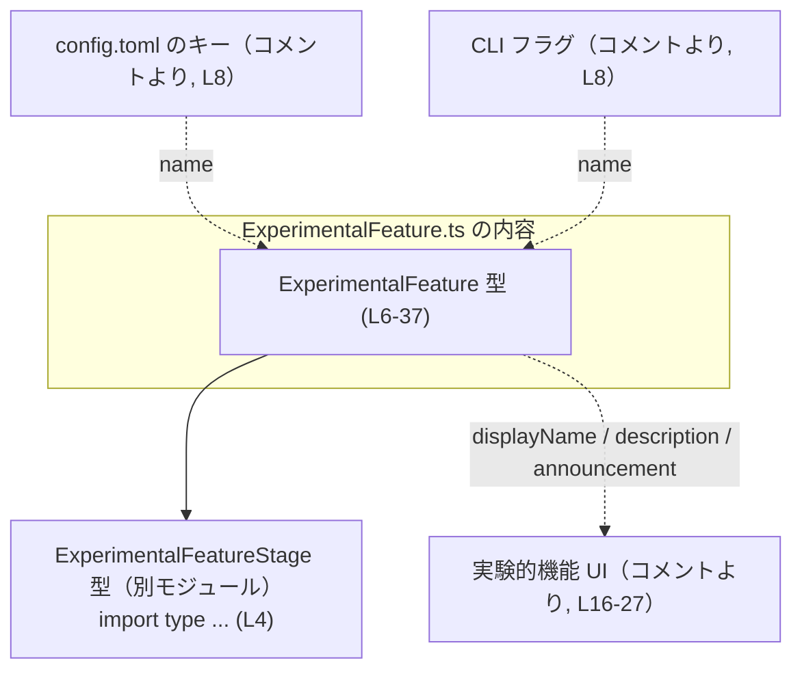
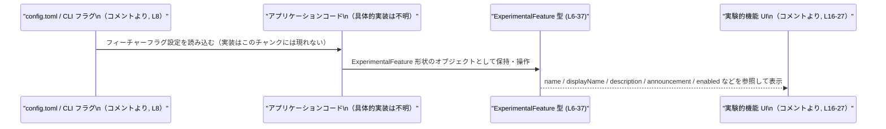

# app-server-protocol/schema/typescript/v2/ExperimentalFeature.ts

## 0. ざっくり一言

`ExperimentalFeature` 型は、実験的機能フラグの「名前・ライフサイクル段階・UI 表示用テキスト・有効/デフォルト有効フラグ」をまとめて表現するための **生成済み TypeScript 型定義** です（ExperimentalFeature.ts:L1-3, L6-37）。

---

## 1. このモジュールの役割

### 1.1 概要

- このモジュールは、サーバー側スキーマから生成された、実験的機能（feature flag）のメタデータを表す `ExperimentalFeature` 型を提供します（ExperimentalFeature.ts:L1-3, L6）。
- フィーチャーフラグのキー（`config.toml` や CLI フラグで使用）、ライフサイクル段階、UI に表示する文言、現在の有効状態やデフォルト状態を 1 つのオブジェクトとして扱えるようにします（ExperimentalFeature.ts:L8, L12, L16-27, L31, L35）。
- ファイル全体は `ts-rs` による自動生成であり、手動編集を前提としていません（ExperimentalFeature.ts:L1-3）。

### 1.2 アーキテクチャ内での位置づけ

- 直接の依存関係として、`ExperimentalFeatureStage` 型を `import type` しています（ExperimentalFeature.ts:L4）。
- コメントから、この型が次のようなコンテキストで使われることが示されています（実際の処理コードはこのチャンクには現れません）:
  - `config.toml` のキー、および CLI フラグのトグルに使われる安定したキー（`name`）（ExperimentalFeature.ts:L8）。
  - 実験的機能 UI で表示される名称・説明・アナウンス文（`displayName` / `description` / `announcement`）（ExperimentalFeature.ts:L16-27）。
  - ロード済み設定における有効状態とデフォルト有効状態（`enabled` / `defaultEnabled`）（ExperimentalFeature.ts:L31, L35）。

これを踏まえた依存関係のイメージを Mermaid 図で示します（コードとして現れているのは型と import のみであり、Config/CLI/UI はコメントから分かる概念上のコンポーネントです）。



※ Config/CLI/UI 側の具体的な実装やモジュール構成は、このチャンクには現れないため不明です。

### 1.3 設計上のポイント

- **自動生成コード**  
  - `ts-rs` による生成であり、手動での変更は想定されていません（ExperimentalFeature.ts:L1-3）。
- **純粋な型定義**  
  - 関数やクラスは存在せず、`export type` によるオブジェクト型エイリアスのみが定義されています（ExperimentalFeature.ts:L6-37）。
- **明示的な null 可能フィールド**  
  - `displayName` / `description` / `announcement` は `string | null` として定義され、「ベータではない場合は null」とコメントされています（ExperimentalFeature.ts:L16-27, L19, L24, L29）。
- **状態を表すブーリアン**  
  - `enabled` と `defaultEnabled` はともに必須の `boolean` で、現在の設定状態とデフォルトの有効状態が区別されています（ExperimentalFeature.ts:L31, L35）。
- **依存型の分離**  
  - フラグのライフサイクル段階は、別型 `ExperimentalFeatureStage` に委譲されています（ExperimentalFeature.ts:L4, L12-14）。

---

## 2. 主要な機能一覧

このファイルは関数を含まず、主に 1 つの型を提供します。

- `ExperimentalFeature` 型: 実験的機能フラグのメタデータ（キー、ステージ、UI 表示用テキスト、現在/デフォルトの有効状態）を表すデータ構造です（ExperimentalFeature.ts:L6-37）。

---

## 3. 公開 API と詳細解説

### 3.1 型一覧（構造体・列挙体など）

#### 型インベントリー

| 名前 | 種別 | 役割 / 用途 | 定義位置 | 備考 |
|------|------|-------------|----------|------|
| `ExperimentalFeature` | 型エイリアス（オブジェクト型） | 実験的機能フラグのメタデータを表現するクライアント側スキーマ | `ExperimentalFeature.ts:L6-37` | `export type` により公開（ExperimentalFeature.ts:L6） |
| `ExperimentalFeatureStage` | 型（詳細不明） | フィーチャーフラグのライフサイクル段階を表す型 | `ExperimentalFeature.ts:L4-4`（import のみ） | 実体は別モジュール `./ExperimentalFeatureStage` に定義（このチャンクには現れない） |

#### `ExperimentalFeature` 型のフィールド一覧

| フィールド名 | 型 | 説明 | 定義位置 |
|-------------|----|------|----------|
| `name` | `string` | `config.toml` と CLI フラグで使用される安定したキー（ExperimentalFeature.ts:L8-10） | `ExperimentalFeature.ts:L7-10` |
| `stage` | `ExperimentalFeatureStage` | フィーチャーフラグのライフサイクル段階（例: alpha/beta/stable といった段階を表すと推測されるが、具体値はこのチャンクには現れない）（ExperimentalFeature.ts:L11-14） | `ExperimentalFeature.ts:L11-14` |
| `displayName` | `string \| null` | 実験的機能 UI に表示されるユーザー向け名称。ベータでない場合は `null`（ExperimentalFeature.ts:L15-19） | `ExperimentalFeature.ts:L15-19` |
| `description` | `string \| null` | 機能の概要説明。ベータでない場合は `null`（ExperimentalFeature.ts:L20-24） | `ExperimentalFeature.ts:L20-24` |
| `announcement` | `string \| null` | 機能導入時にユーザーへ表示されるアナウンス文。ベータでない場合は `null`（ExperimentalFeature.ts:L25-29） | `ExperimentalFeature.ts:L25-29` |
| `enabled` | `boolean` | ロードされた設定において、この機能が現在有効かどうか（ExperimentalFeature.ts:L30-33） | `ExperimentalFeature.ts:L30-33` |
| `defaultEnabled` | `boolean` | 標準状態でこの機能が有効かどうか（ExperimentalFeature.ts:L34-37） | `ExperimentalFeature.ts:L34-37` |

**TypeScript 特有の安全性のポイント**

- `displayName` / `description` / `announcement` が `string | null` であるため、`strictNullChecks` が有効な設定では、これらを文字列として扱う際に **null チェックまたはオプショナルチェーン** が必要になります。これにより「ベータでない機能に UI 文言がない」ケースをコンパイル時に意識できます。
- すべてのフィールドは **必須プロパティ** であり、`Partial` などを使わない限り、`ExperimentalFeature` 型の値を作成する際には全フィールドを指定する必要があります（ExperimentalFeature.ts:L6-37）。

### 3.2 関数詳細（最大 7 件）

このファイルには関数・メソッドは定義されていません（ExperimentalFeature.ts:L1-37）。  
したがって、このセクションで詳細に解説すべき公開関数はありません。

### 3.3 その他の関数

このファイルには補助的な関数やラッパー関数も存在しません（ExperimentalFeature.ts:L1-37）。

---

## 4. データフロー

このファイル自体には関数や処理フローは含まれていませんが、コメントに現れる利用先（`config.toml`・CLI フラグ・実験的機能 UI）をもとに、**ExperimentalFeature 型を介したデータの関係**を概念的に整理します。  
実際の関数名やモジュール構成・順序は、このチャンクには現れないため不明です。



- **安全性の観点**では、このデータフローにおける型チェックは TypeScript の型システムによるコンパイル時検査に依存します。
  - たとえば UI コードが `displayName` を使用する際、型が `string | null` であることから、null を考慮した処理が必要になります（ExperimentalFeature.ts:L15-19）。
- **実行時の検証**（設定ファイルのパース結果が本当にこの形状を満たすかどうか）は、このファイルからは分かりません。JSON スキーマ検証やランタイム型チェックが別途存在するかは不明です。

---

## 5. 使い方（How to Use）

### 5.1 基本的な使用方法

他の TypeScript コードから `ExperimentalFeature` 型を利用する典型例です。  
import パスはビルド設定に依存するため、ここでは概念的な例として示します（正確なパスはこのチャンクからは分かりません）。

```typescript
// ExperimentalFeature 型をインポートする（パスはプロジェクト構成に応じて調整する必要がある）
import type { ExperimentalFeature } from "./ExperimentalFeature"; // 例

// 設定などから得た 1 つの実験的機能フラグを表すオブジェクトを定義する
const feature: ExperimentalFeature = {
    name: "new_parser",            // config.toml / CLI フラグで使う安定したキー（L8-10 の仕様）
    stage: "Beta" as any,          // 実際の型は ExperimentalFeatureStage だが、このチャンクから具体値は不明
    displayName: "新しいパーサー", // ベータの場合に UI に表示される名称（L16-19）
    description: "高速な新実装",   // ベータの場合の説明文（L20-24）
    announcement: null,            // ベータではないか、アナウンスをまだ設定していないケース（L25-29）
    enabled: true,                 // ロードされた設定で有効（L31-33）
    defaultEnabled: false,         // デフォルトでは無効（L35-37）
};

// UI で displayName を表示する際は null を考慮する
const label = feature.displayName ?? feature.name; // displayName が null の場合は name をフォールバックに使う
console.log(label);
```

この例では:

- **型安全性**  
  - `ExperimentalFeature` 型のため、`enabled` を `true`/`false` 以外で代入しようとするとコンパイルエラーになります。
  - `displayName` は `string | null` のため、`feature.displayName.toUpperCase()` のように直接メソッドを呼ぶと、`strictNullChecks` 有効時にはコンパイルエラーになります。

### 5.2 よくある使用パターン

1. **UI 表示用のラベル生成**

```typescript
// feature: ExperimentalFeature が既に存在すると仮定する

// 表示名: displayName があればそれを使い、なければ内部キー name を表示
const displayLabel =
    feature.displayName ?? feature.name; // null 合体演算子で null を扱う

// 説明文: description が null のときは説明を省略する
const descriptionText =
    feature.description ?? ""; // 空文字をデフォルトにする例

// UI レンダリング側で有効/無効を切り替える
const isEnabled = feature.enabled;           // 現在の設定状態（L31-33）
const isDefaultEnabled = feature.defaultEnabled; // デフォルト状態（L35-37）
```

1. **設定編集 UI でのトグル**

```typescript
// Immutable に扱いたい場合は、新しいオブジェクトを作る
function toggleFeatureEnabled(
    feature: ExperimentalFeature,
    enabled: boolean,
): ExperimentalFeature {
    return {
        ...feature,            // 既存のフィールドをコピー
        enabled,               // enabled のみ新しい値を設定
    };
}
```

- 実際のシステムで `enabled` を更新するべきかどうか（設定ファイルを書き戻すのかなど）は、このチャンクからは分かりません。上の例はあくまで型の使い方の例です。

### 5.3 よくある間違い

1. **null 可能フィールドを非 null として扱ってしまう**

```typescript
// 誤り例（strictNullChecks = true を想定）
// feature.displayName の型は string | null なので、直接 toUpperCase を呼べない
// const upperName = feature.displayName.toUpperCase(); // コンパイルエラー

// 正しい例: null チェックまたはオプショナルチェーンを使う
const upperName =
    feature.displayName?.toUpperCase() ?? feature.name.toUpperCase();
```

1. **`enabled` と `defaultEnabled` の意味を取り違える**

```typescript
// 誤り例: 現在の有効状態確認に defaultEnabled を使ってしまう
// if (feature.defaultEnabled) { ... } // これは「デフォルト設定」での状態

// 正しい例: 実際にロードされた設定で有効かどうかを確認する
if (feature.enabled) {
    // 現在有効な機能として扱う（L31-33 の仕様）
}
```

1. **自動生成コードを直接編集してしまう**

- ファイル先頭に「GENERATED CODE! DO NOT MODIFY BY HAND!」と明記されており（ExperimentalFeature.ts:L1-3）、手動編集は再生成時に失われる可能性があります。

### 5.4 使用上の注意点（まとめ）

- **null 可能フィールドの扱い**
  - `displayName` / `description` / `announcement` は `string | null` であり、「ベータではない場合は null」とコメントされています（ExperimentalFeature.ts:L16-27）。UI コードは null の可能性を前提に設計する必要があります。
- **`enabled` と `defaultEnabled` の違い**
  - `enabled` は「ロードされた config で現在有効か」（ExperimentalFeature.ts:L31-33）、`defaultEnabled` は「デフォルトでは有効か」（ExperimentalFeature.ts:L35-37）を表します。この 2 つを混同しないことが重要です。
- **実行時安全性**
  - TypeScript の型はコンパイル時のみ有効であり、設定ファイルやサーバーからのレスポンスがこの形状を守っているかどうかは別途確認が必要です（ランタイムバリデーションの有無はこのチャンクからは不明）。
- **並行性（Concurrency）**
  - この型は単なるデータコンテナであり、並行性制御（ロックなど）は関与しません。複数の非同期処理から同じオブジェクトを共有・書き換える場合は、アプリケーション側で不変化（イミュータブル）方針などを決める必要があります。
- **自動生成コードの再生成**
  - Rust 側の型やスキーマが変更された場合、このファイルは `ts-rs` によって再生成される想定です。TypeScript 側で加えた手動変更は上書きされるため、このファイルを直接編集しないことが安全です（ExperimentalFeature.ts:L1-3）。

---

## 6. 変更の仕方（How to Modify）

### 6.1 新しい機能を追加する場合

ここでいう「新しい機能」は `ExperimentalFeature` に新しいフィールドを追加したい場合や、関連するライフサイクル段階を増やしたい場合などを指します。

- **このファイルを直接変更しない**
  - ファイル先頭のコメントにあるとおり、このファイルは `ts-rs` による生成物であり、手動変更は推奨されません（ExperimentalFeature.ts:L1-3）。
- **Rust 側の型定義（ts-rs の入力）を変更する**
  - 実際に変更すべき場所は、`ts-rs` が参照している Rust の型定義です。具体的なファイル名や構造はこのチャンクには現れないため不明ですが、そちらにフィールド追加などを行い、その後 `ts-rs` を実行して TypeScript ファイルを再生成することになります。
- **生成後に TypeScript コードのビルドを確認**
  - 新しいフィールドが追加された場合、`ExperimentalFeature` を使用している TypeScript コードにコンパイルエラーが発生する可能性があります。これにより、追加フィールドの未対応箇所を洗い出せます。

### 6.2 既存の機能を変更する場合

既存フィールドの名前変更・型変更・削除などを行う場合の一般的な影響と注意点です。

- **変更元はやはり Rust 側**
  - 追加時と同様、このファイルではなく Rust 側の型定義を変更して再生成する必要があります（ExperimentalFeature.ts:L1-3）。
- **影響範囲の把握**
  - フィールド名を変更・削除すると、`ExperimentalFeature` を利用しているすべての TypeScript コードでコンパイルエラーが発生します。これを手がかりに影響範囲を確認できます。
- **契約（Contract）の維持**
  - 特に `name` は「config.toml と CLI フラグで使う安定したキー」とコメントされているため（ExperimentalFeature.ts:L8-10）、既存キーの意味を変えたり削除したりすると、設定ファイルや CLI インターフェースとの互換性に影響する可能性があります。
- **テスト**
  - このチャンクにはテストコードは含まれていません。実際のプロジェクトでどのようなテストが存在するかは不明ですが、UI レイヤーや設定読み込み処理で `ExperimentalFeature` の変更に応じたテスト更新が必要になる可能性があります。

---

## 7. 関連ファイル

このモジュールと密接に関係すると分かるファイル/モジュールは次のとおりです。

| パス / モジュール指定 | 役割 / 関係 |
|-----------------------|------------|
| `./ExperimentalFeatureStage` | `ExperimentalFeatureStage` 型を提供するモジュール。`ExperimentalFeature.stage` フィールドの型として使用されています（ExperimentalFeature.ts:L4, L12-14）。実際のファイル拡張子（`.ts`/`.d.ts` 等）や中身はこのチャンクには現れません。 |
| Rust 側の `ExperimentalFeature` 型（ファイルパス不明） | `ts-rs` によってこの TypeScript 型へ変換される元の Rust 型と推測されます（ExperimentalFeature.ts:L1-3）。具体的なファイル名や構造はこのチャンクには現れません。 |

このチャンクからは、その他の設定読み込みコードや UI レイヤーの具体的なファイルは参照できないため、「config.toml を処理するモジュール」「実験的機能 UI コンポーネント」などの詳細なパスは不明です。
