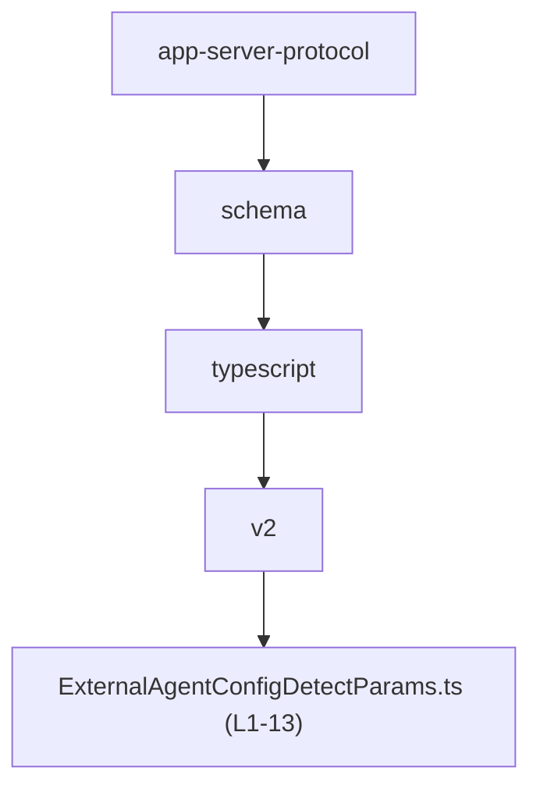
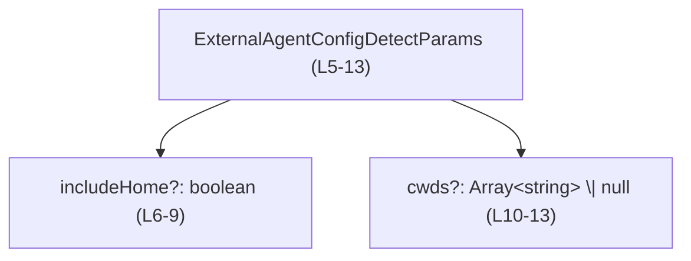
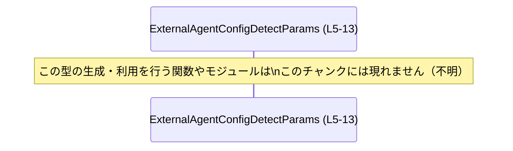

# app-server-protocol\schema\typescript\v2\ExternalAgentConfigDetectParams.ts コード解説

## 0. ざっくり一言

外部エージェント設定の「検出」処理に渡すためのパラメータを表す、TypeScript のオブジェクト型エイリアスを 1 つだけ定義した、自動生成ファイルです  
（`ExternalAgentConfigDetectParams` 型, app-server-protocol\schema\typescript\v2\ExternalAgentConfigDetectParams.ts:L5-13）。

---

## 1. このモジュールの役割

### 1.1 概要

- このファイルは、`ExternalAgentConfigDetectParams` という型エイリアスを定義します（L5）。  
- コメントから、この型は「検出 (detection)」処理に渡すオプションパラメータであり、
  - ユーザーのホームディレクトリ配下を検出対象に含めるかどうか（`includeHome`）（L6-9）
  - リポジトリスコープの検出対象とする作業ディレクトリ一覧（`cwds`）（L10-13）
  を表現することが分かります。

### 1.2 アーキテクチャ内での位置づけ

- ファイルパスから、この型はアプリケーションサーバプロトコルの TypeScript スキーマ定義（バージョン `v2`）の一部であることが分かります（ディレクトリ名より）。  
  - `app-server-protocol\schema\typescript\v2\ExternalAgentConfigDetectParams.ts`（L1-13）
- ファイル先頭コメントから、この型定義は `ts-rs` によって自動生成されていることが分かります（L1-3）。  
  生成元（たとえばサーバ側の型定義など）がどこにあるかは、このチャンクからは分かりません。

ディレクトリ階層上の位置関係は、次のように表せます。



この図は、本ファイルが `schema/typescript/v2` 階層の 1 ファイルであることのみを示します。  
他モジュールとの依存関係や呼び出し関係は、このチャンクからは分かりません。

### 1.3 設計上のポイント

コードから読み取れる設計上の特徴は次のとおりです。

- 自動生成ファイルである  
  - 先頭コメントで「手で変更しないこと」が明示されています（L1-3）。
- 純粋なデータ定義（DTO: Data Transfer Object）であり、ロジックを持たない  
  - `export type ... = { ... }` でオブジェクト形状のみを定義し、関数やメソッドは一切ありません（L5-13）。
- すべてのプロパティがオプショナル  
  - `includeHome?: boolean`（L9）
  - `cwds?: Array<string> | null`（L13）
- `cwds` は `Array<string> | null` のユニオン型  
  - 配列・`null`・プロパティ自体の欠如（`undefined`）という 3 種類の状態を取りうるように設計されています（L10-13）。
- コメントにより、各プロパティの意味が具体的に示されている  
  - `includeHome`: 「ユーザーのホーム (`~/.claude`, `~/.codex` 等) を検出対象に含める」（L6-8）
  - `cwds`: 「リポジトリスコープの検出に含める作業ディレクトリ群」（L10-12）

### 1.4 コンポーネントインベントリー

このファイルに現れる「コンポーネント」（型）の一覧です。

| 名前 | 種別 | 説明 | 定義位置（根拠） |
|------|------|------|------------------|
| `ExternalAgentConfigDetectParams` | 型エイリアス（オブジェクト型） | 外部エージェント設定の検出処理に渡すオプションパラメータを表す。`includeHome` と `cwds` の 2 プロパティを持つ。 | app-server-protocol\schema\typescript\v2\ExternalAgentConfigDetectParams.ts:L5-13 |

---

## 2. 主要な機能一覧

このファイルはロジックを持たないため、「機能」はプロパティが表現する情報と解釈します。

- `includeHome` フラグによる、ユーザーのホームディレクトリ配下の検出対象への含有指定（L6-9）
- `cwds` による、リポジトリスコープの検出対象とする作業ディレクトリの列挙（L10-13）
- TypeScript の optional プロパティとユニオン型を用いた、「指定なし」「空」「null」の状態表現（L9, L13）

---

## 3. 公開 API と詳細解説

### 3.1 型一覧（構造体・列挙体など）

#### 型レベルインベントリー

| 名前 | 種別 | 役割 / 用途 | 定義位置（根拠） |
|------|------|-------------|------------------|
| `ExternalAgentConfigDetectParams` | 型エイリアス（オブジェクト型） | 外部エージェント設定検出処理のパラメータオブジェクト。ホームディレクトリを含めるかどうかと、リポジトリスコープ検出の対象ディレクトリ一覧を持つ。 | app-server-protocol\schema\typescript\v2\ExternalAgentConfigDetectParams.ts:L5-13 |

#### プロパティ一覧

| プロパティ名 | 型 | 必須か | 説明 | 定義位置（根拠） |
|--------------|----|--------|------|------------------|
| `includeHome` | `boolean`（optional） | 任意 | `true` の場合、ユーザーのホームディレクトリ配下（例: `~/.claude`, `~/.codex`）を検出対象に含めることがコメントで示されています。指定しない場合（`undefined`）の挙動は、この型定義からは分かりません。 | L6-9 |
| `cwds` | `Array<string> \| null`（optional） | 任意 | リポジトリスコープ検出に含める 0 個以上の作業ディレクトリを表します（コメントに "Zero or more working directories" とあります）。`null` や未指定（`undefined`）と `[]` の違いをどう扱うかは、この型定義からは分かりません。 | L10-13 |

##### 型の内部構造（図）

`ExternalAgentConfigDetectParams` とそのプロパティの構造関係は次のように表現できます。



この図は、オブジェクト型が 2 つの optional プロパティを持つことだけを表しています。

### 3.2 関数詳細（最大 7 件）

- このファイルには関数・メソッド・クラスメソッドなどの実行可能なコードは一切定義されていません（L1-13）。
- したがって、関数詳細テンプレートを適用すべき対象はありません。

### 3.3 その他の関数

- 補助関数やラッパー関数も定義されていません（L1-13）。

---

## 4. データフロー

このチャンクには型定義のみが含まれており、実際にどのコンポーネント間でどのように `ExternalAgentConfigDetectParams` が受け渡されるかは分かりません。  
ここでは「この型の利用元がこのチャンク外にある」という事実のみを明示します。



- 実行時にどのようなデータフロー（どの API の引数になるか、どこから JSON として渡されるかなど）があるかは、このファイルからは判定できません。

---

## 5. 使い方（How to Use）

このファイルは型定義のみを提供するため、以下のコード例は**あくまで一般的な利用例**であり、リポジトリ内に同名の関数が存在することを意味しません。

### 5.1 基本的な使用方法

`ExternalAgentConfigDetectParams` 型の値を作成し、任意の検出処理関数に渡すイメージの例です。

```typescript
// ExternalAgentConfigDetectParams 型をインポートする（パスは例示）              // このファイルから型を取り込む
import type { ExternalAgentConfigDetectParams } from "./ExternalAgentConfigDetectParams";  // 実際のパスはプロジェクト構成に依存

// 任意の検出処理関数（このリポジトリ内に存在するとは限らない）              // 型の使い方を示すためのサンプル関数
function detectExternalAgentConfig(params: ExternalAgentConfigDetectParams) {              // 引数に ExternalAgentConfigDetectParams を受け取る
    // 実際の検出ロジックはここに実装される想定                                   // 本ファイルにはロジックは定義されていない
}

// パラメータオブジェクトを作成する                                             // ExternalAgentConfigDetectParams 型の値を作る
const params: ExternalAgentConfigDetectParams = {
    includeHome: true,                                                           // ホームディレクトリ配下も検出対象に含める
    cwds: ["/path/to/repo1", "/path/to/repo2"],                                  // リポジトリスコープ検出対象の作業ディレクトリ一覧
};

// サンプル関数にパラメータを渡す                                               // 型の利用イメージ
detectExternalAgentConfig(params);
```

この例から分かるポイント:

- `includeHome` と `cwds` は**どちらも任意プロパティ**なので、省略も可能です（L9, L13）。
- TypeScript のコンパイル時には、`params` が `ExternalAgentConfigDetectParams` 型と整合しているかチェックされますが、  
  実行時にはこの型情報は存在しません（TypeScript 共通の性質）。

### 5.2 よくある使用パターン

#### パターン 1: ホームディレクトリのみを対象にする

```typescript
const params: ExternalAgentConfigDetectParams = {
    includeHome: true,   // ホーム配下だけを検出対象に含める
    // cwds は指定しない（undefined）                                          // L13 の optional 指定により省略可能
};
```

- `cwds` を指定しないことで、「作業ディレクトリ指定なし」の状態を表現できます（「どう解釈するか」は利用側次第で、この型からは不明です）。

#### パターン 2: 特定ディレクトリ一覧だけを対象にする

```typescript
const params: ExternalAgentConfigDetectParams = {
    // includeHome は省略（デフォルト動作は利用側実装依存）                  // L9 の optional 指定
    cwds: ["/workspace/repo1", "/workspace/repo2"],                               // コメントにある「Zero or more working directories」に対応（L10-12）
};
```

- `includeHome` を省略し、`cwds` のみを指定することで、「特定ディレクトリだけを対象にする」状態を表現できます。  
  ただし、この状態の扱いがどうなるかは検出処理側の実装に依存し、このファイルからは分かりません。

#### パターン 3: 「ディレクトリ指定なし」を `null` で表現する

```typescript
const params: ExternalAgentConfigDetectParams = {
    includeHome: false,   // ホーム配下は検出対象にしない
    cwds: null,           // cwds?: Array<string> | null における null の利用（L13）
};
```

- `cwds` を `null` にするか、省略するか、空配列 `[]` にするかの違いは、利用側の仕様次第です。  
  このファイルには、その違いをどのように解釈するかに関する情報はありません。

### 5.3 よくある間違い

この型の宣言内容から想定される、型レベルでの誤用例とその修正例です。

#### 誤用例 1: `cwds` を必ず配列として扱ってしまう

```typescript
declare const params: ExternalAgentConfigDetectParams;

// 誤り例: cwds が undefined や null である可能性を無視している
// params.cwds.forEach(cwd => {   // コンパイルエラー: Object is possibly 'null' or 'undefined'.
//     console.log(cwd);
// });

// 正しい扱い方の一例
if (Array.isArray(params.cwds)) {   // cwds が配列であることを確認してから処理する
    params.cwds.forEach(cwd => {
        console.log(cwd);
    });
}
```

- `cwds?: Array<string> | null` であるため（L10-13）、`cwds` は
  - 存在しない（`undefined`）
  - `null`
  - `string[]`
  のいずれも取りうることが型で表現されています。  
- したがって、配列として使用する前にチェックする必要があります。

#### 誤用例 2: 実行時に型を過信する

```typescript
// 例: 外部から受け取った any 値をそのまま信じてしまう
function fromUnknown(input: any): ExternalAgentConfigDetectParams {
    return input;   // 型アサーションなしでそのまま返すと、実行時には不正構造の可能性がある
}
```

- TypeScript の型はコンパイル時専用であり、実行時に構造を保証しません。
- このファイルにはバリデーションロジックがないため、**外部入力をこの型に適用する場合は別途ランタイム検証が必要**になります。

### 5.4 使用上の注意点（まとめ）

#### 型レベルの前提・契約

- `includeHome` と `cwds` はどちらも**任意プロパティ**です（L9, L13）。
  - どちらも指定しないことが可能です。
  - 「どちらも指定されなかった場合の意味」は、このファイルからは分かりません（利用側の仕様に依存します）。
- `cwds` は `Array<string> | null` であり（L10-13）、
  - `undefined`（プロパティ無し）
  - `null`
  - `[]`（空配列）
  など、複数の「何も指定されていない」ように見える状態が存在し得ます。  
  これらをどう区別するかは利用側のコードで定義する必要があります。

#### エッジケース

この型定義から読み取れる範囲でのエッジケースは次のとおりです。

- `includeHome` が未指定（`undefined`）のケース  
  - デフォルトが「含める」のか「含めない」のか、この型からは判定できません。
- `cwds` が未指定・`null`・空配列・文字列を含む配列の各ケース  
  - コメントでは "Zero or more working directories" と明記されており（L10-12）、空配列は有効な状態と読み取れます。
  - ただし、`null` と未指定の意味の違いは、この型定義だけからは分かりません。

#### 安全性・エラー・並行性（TypeScript 言語的観点）

- **安全性（型安全）**  
  - この型を使うことで、コンパイル時に `includeHome` を `number` にするなどの誤りは検出できます（`boolean` として宣言されているため, L9）。
- **エラー**  
  - 実行時には型情報が存在しないため、外部入力（JSON 等）をこの型として扱う際には、別途ランタイム検証が必要です。
  - このファイルにはエラーハンドリングロジックは一切含まれていません（L1-13）。
- **並行性**  
  - この型は単なるオブジェクト構造であり、スレッドや非同期タスクに関する情報は持ちません。
  - JavaScript/TypeScript の通常のオブジェクトと同様に、必要であればワーカー間メッセージやシリアライズを通じて渡すことが想定されますが、そのような利用方法はこのファイルからは分かりません。

#### セキュリティ・バグの観点

- この型自体はセキュリティロジックを含みませんが（L5-13）、`cwds` がファイルパスやディレクトリパスを表すとコメントから読み取れるため（L10-12）、利用側で:
  - パスの正当性チェック
  - OS / シェルコマンドへの渡し方
 など、一般的なファイルシステム操作のセキュリティ注意事項を考慮する必要があります。  
 具体的な扱いは、この型を利用する側のコードに依存します。

---

## 6. 変更の仕方（How to Modify）

### 6.1 新しい機能を追加する場合

このファイルは自動生成コードであり、手動での編集は推奨されていません。

- ファイル先頭に  
  - `"GENERATED CODE! DO NOT MODIFY BY HAND!"`（L1）  
  - `"Do not edit this file manually."`（L3）  
  と明記されています。

そのため、**新しいプロパティを追加する場合でも、このファイルを直接編集すべきではありません**。一般的な手順としては次のようになります（ただし、生成元がどこにあるかはこのチャンクからは分かりません）。

1. `ts-rs` の生成元となる型定義・スキーマを変更する。  
   - このファイルからは、その具体的な場所や言語（Rust 等）は特定できません。
2. コード生成プロセスを再実行して、`ExternalAgentConfigDetectParams.ts` を再生成する。
3. 生成物の変更に伴い、この型を利用している TypeScript コード側を更新する。

変更時の注意点:

- 新しいプロパティを追加すると、この型を受け取る関数・API がそのプロパティをどのように扱うかを決める必要があります。
- 既存コードが `ExternalAgentConfigDetectParams` をシリアライズ／デシリアライズしている場合、その形式にも影響が出る可能性がありますが、どのような I/O があるかはこのチャンクからは分かりません。

### 6.2 既存の機能を変更する場合

`includeHome` や `cwds` の型や名前を変更したい場合も、同様に生成元を変更して再生成する必要があります（L1-3, L5-13）。

変更時に考えるべき点（一般論）:

- **フィールド名の変更**  
  - この型を参照しているすべての TypeScript ファイルで、該当プロパティ名を修正する必要があります。
- **型の変更（例: `cwds` を必須にする、`null` を許容しないなど）**  
  - コンパイル時に型エラーが発生する箇所が増える可能性があります。
  - ランタイムでの JSON フォーマットや API プロトコルとの互換性にも影響し得ますが、その詳細はこのチャンクからは分かりません。
- **optional → 必須 への変更**  
  - これまで `includeHome` や `cwds` を省略していた呼び出しコードが、コンパイルエラーになる可能性があります。

このファイル内にはテストコードやテストに関するコメントは存在しないため（L1-13）、変更後の検証方法やテストの配置場所は、このチャンクからは分かりません。

---

## 7. 関連ファイル

このファイル自身以外に、インポートやエクスポートで明示的に関連付けられているファイルはありません（L1-13）。  
したがって、**具体的な関連ファイル名やパスはこのチャンクからは特定できません。**

| パス | 役割 / 関係 |
|------|------------|
| app-server-protocol\schema\typescript\v2\ExternalAgentConfigDetectParams.ts | 本ドキュメントの対象ファイル。`ExternalAgentConfigDetectParams` 型を定義する自動生成 TypeScript ファイル。 |
| （不明） | このファイルから他ファイルへの import/export は無く、利用側・生成元ファイルはこのチャンクには現れません。 |

以上が、このチャンクから客観的に読み取れる範囲での `ExternalAgentConfigDetectParams.ts` の解説です。
