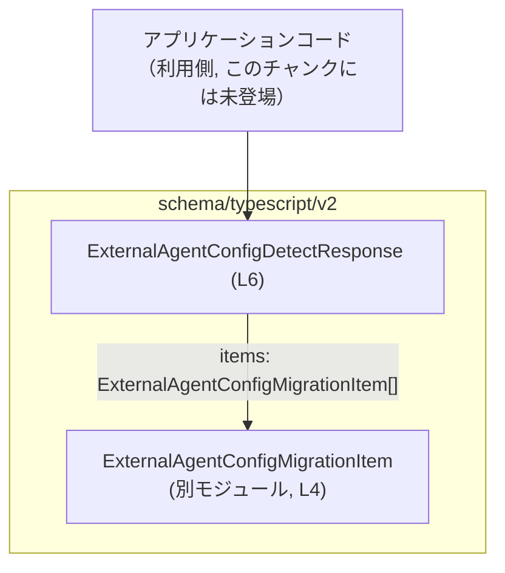
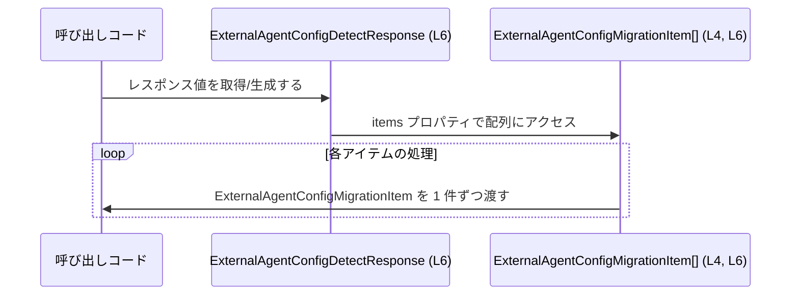

# app-server-protocol/schema/typescript/v2/ExternalAgentConfigDetectResponse.ts

## 0. ざっくり一言

- Rust から `ts-rs` で自動生成された、`items` プロパティのみを持つレスポンス型 `ExternalAgentConfigDetectResponse` を定義する TypeScript ファイルです（ExternalAgentConfigDetectResponse.ts:L1-3, L6-6）。

---

## 1. このモジュールの役割

### 1.1 概要

- このモジュールは、`ExternalAgentConfigDetectResponse` という **レスポンスオブジェクトの型** を TypeScript 上に提供します（ExternalAgentConfigDetectResponse.ts:L6-6）。
- `items` プロパティとして、`ExternalAgentConfigMigrationItem` 型の配列を必須で持つことを型レベルで表現します（ExternalAgentConfigDetectResponse.ts:L4-4, L6-6）。
- ファイル先頭コメントから、この型定義は Rust 側の型定義から `ts-rs` により自動生成されていることが分かります（ExternalAgentConfigDetectResponse.ts:L1-3）。

### 1.2 アーキテクチャ内での位置づけ

- パスから、このファイルは `schema/typescript/v2` 配下の **バージョン付きスキーマ定義** の一部であると分かります（ディレクトリ名より）。
- このモジュール自身は、`ExternalAgentConfigMigrationItem` 型を型としてのみインポートし（`import type`）、`items: ExternalAgentConfigMigrationItem[]` を含むレスポンス型をエクスポートします（ExternalAgentConfigDetectResponse.ts:L4-4, L6-6）。
- 誰がこの型を利用しているかは、このチャンクには現れません。

Mermaid で、型レベルの依存関係を図示します。



> この図は、ExternalAgentConfigDetectResponse.ts:L4-6 に現れる型間の依存関係のみを表しています。

### 1.3 設計上のポイント

- **自動生成コード**  
  - ファイル先頭に「GENERATED CODE」「Do not edit this file manually」と明記されており、手動編集を前提としていないことが分かります（ExternalAgentConfigDetectResponse.ts:L1-3）。
- **型専用インポート（`import type`）**  
  - `ExternalAgentConfigMigrationItem` は `import type` でインポートされており、**コンパイル後の JavaScript にこの import が出力されない**、純粋な型参照であることが分かります（ExternalAgentConfigDetectResponse.ts:L4-4）。
- **単純な型エイリアス**  
  - `ExternalAgentConfigDetectResponse` はクラスやインターフェースではなく、シンプルなオブジェクト型エイリアスとして定義されています（ExternalAgentConfigDetectResponse.ts:L6-6）。
- **状態やロジックを持たない**  
  - 関数やメソッドは一切定義されておらず、このモジュールは純粋に「データ構造の形」を記述するだけです（ExternalAgentConfigDetectResponse.ts:L1-6）。

---

## 2. 主要な機能一覧（コンポーネントインベントリー）

このチャンクに現れる「機能」はすべて **型定義** です。主要な役割は次の 1 点です。

- `ExternalAgentConfigDetectResponse` 型定義:  
  `items` プロパティに `ExternalAgentConfigMigrationItem` の配列を保持するレスポンス型を提供します（ExternalAgentConfigDetectResponse.ts:L4-4, L6-6）。

---

## 3. 公開 API と詳細解説

### 3.1 型一覧（構造体・列挙体など）

以下の表が、このチャンクにおけるコンポーネントインベントリーです。

| 名前 | 種別 | 公開範囲 | 役割 / 用途 | 根拠 |
|------|------|----------|------------|------|
| `ExternalAgentConfigDetectResponse` | 型エイリアス（オブジェクト型） | `export` される公開型 | `items: ExternalAgentConfigMigrationItem[]` を必須で持つレスポンスオブジェクトの型。検出処理の結果が複数のマイグレーション項目として返る形を表現していると解釈できますが、ビジネス意味はコードからは断定できません。 | ExternalAgentConfigDetectResponse.ts:L6-6 |
| `ExternalAgentConfigMigrationItem` | 外部モジュールからの型（詳細不明） | このファイルからは再エクスポートされない | `items` 配列の各要素の型。名称からは「外部エージェント設定マイグレーションの 1 項目」を表すと推測されますが、構造やフィールドはこのチャンクには現れません。 | ExternalAgentConfigDetectResponse.ts:L4-4 |

> `ExternalAgentConfigMigrationItem` の実体（フィールド構造など）は、`"./ExternalAgentConfigMigrationItem"` モジュール側にあり、このチャンクからは不明です。

### 3.2 関数詳細（最大 7 件）

- このファイルには関数・メソッドは **定義されていません**（コメントと `import type` と `export type` のみで構成されているため）（ExternalAgentConfigDetectResponse.ts:L1-6）。
- そのため、関数詳細テンプレートに当てはまる対象はありません。

### 3.3 その他の関数

- なし（関数定義自体が存在しません）（ExternalAgentConfigDetectResponse.ts:L1-6）。

---

## 4. データフロー

このモジュールは型定義のみを提供するため、実行時の処理フローは直接は記述されていません。ただし、`ExternalAgentConfigDetectResponse` 型を用いるコードでは、概ね次のような **データの流れ** が発生します。

1. 何らかの処理（例: API 呼び出し、ファイル読み込みなど）が、`items: ExternalAgentConfigMigrationItem[]` を持つオブジェクトを生成または受信する。
2. そのオブジェクトが `ExternalAgentConfigDetectResponse` 型として扱われる。
3. 呼び出し側コードが `response.items` を介して、各 `ExternalAgentConfigMigrationItem` を処理する。

この型間の関係だけに絞ったシーケンス図を示します。



> 図は ExternalAgentConfigDetectResponse.ts:L4-6 に現れる型定義から読み取れる関係のみを表現しています。  
> 実際の I/O（HTTP、ファイルなど）の詳細はこのチャンクには現れません。

---

## 5. 使い方（How to Use）

### 5.1 基本的な使用方法

`ExternalAgentConfigDetectResponse` を **関数の引数として受け取り、`items` を走査する** 典型的な使い方の例です。

```typescript
// ExternalAgentConfigDetectResponse 型をインポートする                    // 型定義のみを参照するため import type を使用
import type { ExternalAgentConfigDetectResponse } from "./ExternalAgentConfigDetectResponse";

// 検出レスポンスを処理する関数                                           // ExternalAgentConfigDetectResponse 型を引数として受け取る
function handleDetectResponse(response: ExternalAgentConfigDetectResponse) { // response.items は必須プロパティとして扱える
    for (const item of response.items) {                                     // items は ExternalAgentConfigMigrationItem[] 型の配列
        // item は ExternalAgentConfigMigrationItem 型として型推論される         // item.～ で要素のプロパティにアクセスできる（定義は別モジュール）
        // ここで item ごとの処理を行う                                      // 例: ログ出力や UI への反映など（このチャンクには具体例はない）
    }
}
```

外部から JSON を受け取ってこの型として扱う場合の例です（ランタイムバリデーションは別途必要です）。

```typescript
// レスポンス JSON を ExternalAgentConfigDetectResponse として扱う例
import type { ExternalAgentConfigDetectResponse } from "./ExternalAgentConfigDetectResponse";

async function fetchAndHandle(url: string): Promise<void> {                  // 非同期にデータを取得する関数
    const res = await fetch(url);                                            // fetch で HTTP レスポンスを取得
    const data = (await res.json()) as ExternalAgentConfigDetectResponse;    // 実行時には検証されないため as による型アサーション

    // 型的には data.items は ExternalAgentConfigMigrationItem[] として扱われる
    for (const item of data.items) {                                         // data.items が存在しない場合、実行時には例外になりうる
        // item の処理                                                        // 安全性のためには data.items の存在チェックが望ましい
    }
}
```

> 上記の `as ExternalAgentConfigDetectResponse` は **コンパイル時の型付けのみ** を行い、実行時の検証は行いません。  
> 外部入力（HTTP レスポンス等）に対しては、別途ランタイムバリデーションを追加することが推奨されます。

### 5.2 よくある使用パターン

1. **関数の戻り値として利用する**

```typescript
import type { ExternalAgentConfigDetectResponse } from "./ExternalAgentConfigDetectResponse";

// 検出処理の結果を返す関数                                                // 戻り値の型として ExternalAgentConfigDetectResponse を使用
function detectConfigs(): ExternalAgentConfigDetectResponse {
    // 実装例はこのチャンクにはないためダミーを記述                        // 実際には items 配列を何らかのロジックで構築する
    return {
        items: [],                                                          // items は配列として必須なので、少なくとも空配列を返す
    };
}
```

1. **状態管理（例: フロントエンドのストアやフック）で利用する**

```typescript
import type { ExternalAgentConfigDetectResponse } from "./ExternalAgentConfigDetectResponse";

// 状態の初期値として使用する例                                           // items を空配列で初期化
const initialState: ExternalAgentConfigDetectResponse = {
    items: [],                                                              // 初期状態では検出結果がないことを表す
};
```

### 5.3 よくある間違い

#### 1. `items` をオプショナルだと誤解する

```typescript
// 間違い例: items を省略してもよいと誤解している
// const response: ExternalAgentConfigDetectResponse = {
//     // items を指定していないためコンパイルエラーになる
// };

// 正しい例: items は必須なので、必ず配列をセットする
const response: ExternalAgentConfigDetectResponse = {
    items: [],                                                              // 要素がなくても空配列を指定する
};
```

- 型定義では `items?` ではなく `items` で宣言されているため、**省略はコンパイルエラー** になります（ExternalAgentConfigDetectResponse.ts:L6-6）。

#### 2. `items` の型を単一要素と誤解する

```typescript
// 間違い例: items を配列ではなく単一要素にしてしまう
/*
const response: ExternalAgentConfigDetectResponse = {
    // items: someItem,                                                     // someItem が ExternalAgentConfigMigrationItem 型でも配列ではないのでエラー
};
*/

// 正しい例: items は必ず配列である必要がある
const response2: ExternalAgentConfigDetectResponse = {
    items: [/* someItem1, someItem2, ... */],                               // ExternalAgentConfigMigrationItem 型の配列
};
```

- 型定義は `Array<ExternalAgentConfigMigrationItem>` であり、単一要素ではなく **配列** である点に注意が必要です（ExternalAgentConfigDetectResponse.ts:L6-6）。

### 5.4 使用上の注意点（まとめ）

- **コンパイル時の型安全性**  
  - `items` は必須プロパティであり、`ExternalAgentConfigMigrationItem[]` 型でなければコンパイルエラーになるため、**ビルド時に形のズレを検出できます**（ExternalAgentConfigDetectResponse.ts:L6-6）。
- **実行時の安全性（ランタイム検証の必要性）**  
  - TypeScript の型は実行時には存在しないため、外部入力（JSON など）を直接 `as ExternalAgentConfigDetectResponse` として扱うと、プロパティ欠落などがあってもコンパイルは通り、実行時に例外になる可能性があります。  
  - 信頼できない入力に対しては、`items` の存在・型をチェックするランタイムバリデーションを別途用意する必要があります。
- **並行性・スレッド安全性**  
  - このモジュールは **純粋なデータ型定義** であり、非同期処理や並行性に関するロジックを持ちません（ExternalAgentConfigDetectResponse.ts:L1-6）。  
  - JavaScript/TypeScript の実行環境（ブラウザや Node.js）が単一スレッド/マルチスレッドかによる影響は、この型自体にはありません。共有オブジェクトとして扱う場合の並行性制御は、利用側の責務になります。
- **自動生成コードの変更禁止**  
  - ファイル先頭のコメントにより、「手で変更してはならない」ことが明記されています。  
    - 「GENERATED CODE! DO NOT MODIFY BY HAND!」（ExternalAgentConfigDetectResponse.ts:L1-1）  
    - 「Do not edit this file manually.」（ExternalAgentConfigDetectResponse.ts:L3-3）  
  - 型を変更したい場合は、**元の Rust 側定義やコード生成設定を変更する必要があります**（詳細はこのチャンクには現れません）。
- **ビルド成果物への影響**  
  - `import type` を使っているため、このモジュールからのインポートはコンパイル後の JavaScript には現れません（ExternalAgentConfigDetectResponse.ts:L4-4）。  
  - これはランタイムの依存関係を増やさずに型だけを共有できるという点で、安全かつ軽量です。

---

## 6. 変更の仕方（How to Modify）

### 6.1 新しい機能を追加する場合

このファイルは `ts-rs` によって生成されており、先頭コメントにより **手動の編集は禁止** とされています（ExternalAgentConfigDetectResponse.ts:L1-3）。  
新しいフィールドや挙動を追加したい場合は、次のような流れになります（一般的な `ts-rs` 利用パターンに基づく説明であり、元の Rust ファイルの場所などはこのチャンクからは分かりません）。

1. **Rust 側の元となる型定義を探す**  
   - 通常、`ts-rs` は `#[derive(ts_rs::TS)]` などの属性を付与した Rust 構造体／型から TypeScript を生成します。  
   - `ExternalAgentConfigDetectResponse` に対応する Rust 型定義のファイルパスや内容は、このチャンクには現れません。

2. **Rust 型にフィールドを追加・変更する**  
   - 例: Rust 側に `items: Vec<ExternalAgentConfigMigrationItem>` 以外のフィールドを追加する、といった変更を行います（Rust 側の具体的なコードはこのチャンクからは不明です）。

3. **`ts-rs` による再生成を実行する**  
   - ビルドスクリプトや専用コマンドを使って TypeScript ファイルを再生成します。  
   - これにより、本ファイル内の `ExternalAgentConfigDetectResponse` 型が自動的に更新されます。

4. **TypeScript 側の利用箇所を更新する**  
   - 追加されたフィールドを使うコードを TypeScript 側で記述します。  
   - 既存コードとの互換性に注意する必要があります。

### 6.2 既存の機能を変更する場合

既存フィールドの名前変更や型変更も、同様に **生成元を修正して再生成** する必要があります。

変更時の注意点:

- **`items` の名前・型を変える場合の影響範囲**  
  - `items` を別名にしたり、型を変更したりすると、`ExternalAgentConfigDetectResponse` を利用しているすべての TypeScript コードに影響します。  
  - このチャンクからは利用箇所は分かりませんが、検索などで影響範囲を確認する必要があります。
- **契約（型の意味）の維持**  
  - この型は「レスポンスオブジェクトの契約」として機能します。  
  - 互換性を壊す変更（フィールド削除や型変更）は、API バージョンの更新（例: `v2` → `v3` ディレクトリ）と組み合わせることが多いですが、その方針はこのチャンクからは読み取れません。
- **テスト・型チェック**  
  - Rust 側・TypeScript 側のテストや型チェックを実行し、変更に伴う不整合がないか確認する必要があります。  
  - このチャンクにはテストコードは含まれていません（ExternalAgentConfigDetectResponse.ts:L1-6）。

---

## 7. 関連ファイル

このモジュールと密接に関係するファイル／モジュールは次の通りです。

| パス / モジュール名 | 役割 / 関係 |
|---------------------|------------|
| `./ExternalAgentConfigMigrationItem` | `ExternalAgentConfigMigrationItem` 型をエクスポートするモジュールです。このファイルでは `import type { ExternalAgentConfigMigrationItem } from "./ExternalAgentConfigMigrationItem";` として参照されており（ExternalAgentConfigDetectResponse.ts:L4-4）、`items` 配列の要素型として利用されています。実際のファイル拡張子（`.ts`, `.d.ts` など）や中身は、このチャンクには現れません。 |
| Rust 側の型定義ファイル（パス不明） | ファイル先頭のコメントから、この TypeScript ファイルは `ts-rs` によって自動生成されていることが分かります（ExternalAgentConfigDetectResponse.ts:L1-3）。生成元となる Rust 型（おそらく `ExternalAgentConfigDetectResponse` 相当の構造体）がどのファイルに定義されているかは、このチャンクには現れません。 |

---

### Bugs / Security / Contracts / Edge Cases（補足）

- **Bugs**  
  - このファイルにはロジックがなく、型定義のみのため、直接的なバグ（計算ミスなど）は存在しません（ExternalAgentConfigDetectResponse.ts:L1-6）。
- **Security**  
  - 型だけでは、外部からの不正な入力（例: `items` が存在しない、想定外の型など）を防ぐことはできません。  
  - 外部入力に対しては、**ランタイムでの検証** を追加することが重要です。
- **Contracts（契約）**  
  - 契約上、「`ExternalAgentConfigDetectResponse` 型の値は必ず `items: ExternalAgentConfigMigrationItem[]` を持つ」という前提が成り立ちます（ExternalAgentConfigDetectResponse.ts:L6-6）。  
  - 呼び出し側は `items` の存在を前提としてコードを書けますが、実行時データがこの契約を守っているかは別途検証が必要です。
- **Edge Cases**  
  - `items` が空配列であるケース（`[]`）は型として許容されており、「検出結果なし」を意味することが多いと考えられますが、その意味付けはこのチャンクからは断定できません。  
  - `items` が非常に大きな配列である場合、処理側でのパフォーマンスやメモリ使用量に注意が必要ですが、それはこの型定義ではなく利用側の実装の問題になります。
