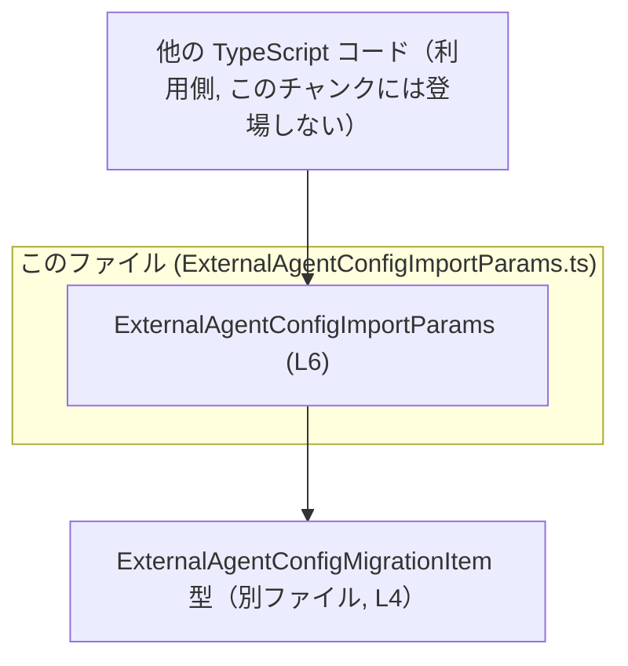
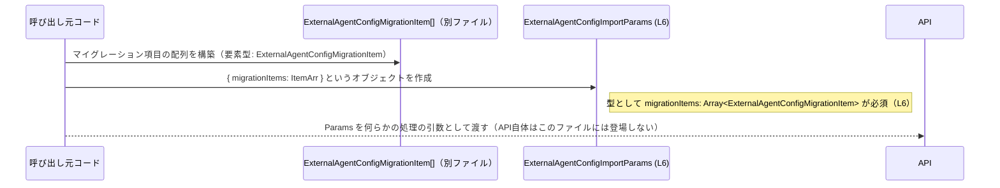

# app-server-protocol/schema/typescript/v2/ExternalAgentConfigImportParams.ts

## 0. ざっくり一言

外部エージェント設定に関する「インポート用パラメータ」のデータ構造を、TypeScript の型エイリアスとして 1 つだけ定義している自動生成ファイルです（`ExternalAgentConfigImportParams.ts:L1-1`, `L3-3`, `L6-6`）。

---

## 1. このモジュールの役割

### 1.1 概要

- このファイルは、`ExternalAgentConfigImportParams` という型エイリアスを 1 つエクスポートします（`ExternalAgentConfigImportParams.ts:L6-6`）。
- `ExternalAgentConfigImportParams` は、`migrationItems` というプロパティを持つオブジェクト型であり、`migrationItems` は `ExternalAgentConfigMigrationItem` の配列として定義されています（`ExternalAgentConfigImportParams.ts:L4-4`, `L6-6`）。
- 先頭コメントから、この型は Rust → TypeScript 変換ツール `ts-rs` によって自動生成されていることが分かります（`ExternalAgentConfigImportParams.ts:L1-1`, `L3-3`）。

名前から、「外部エージェント設定のインポート時に渡されるパラメータの形」を表すための型と解釈できますが、具体的な利用箇所はこのチャンクには現れません。

### 1.2 アーキテクチャ内での位置づけ

このモジュールの依存関係は次の通りです。

- 依存する型
  - `ExternalAgentConfigMigrationItem`（同ディレクトリの別ファイルから `import type` されている型、`ExternalAgentConfigImportParams.ts:L4-4`）
- 公開する型
  - `ExternalAgentConfigImportParams`（`ExternalAgentConfigImportParams.ts:L6-6`）

`import type` は TypeScript 特有の構文であり、「型情報のみをコンパイル時に利用し、JavaScript 出力には import を含めない」ことを意味します。つまり、このモジュールは**コンパイル時だけの依存**を持ち、実行時には依存関係を発生させません（`ExternalAgentConfigImportParams.ts:L4-4`）。

依存関係を簡略化した図は次のようになります。



- 「Caller」は、この型を利用する別モジュールを抽象的に表したノードであり、このファイルには定義がありません。
- 実際には HTTP クライアント層やサービス層などから参照されると考えられますが、コード上の事実としては「型がエクスポートされている」以上のことは分かりません。

### 1.3 設計上のポイント

コードから読み取れる設計上の特徴は次の通りです。

- **自動生成コードであることを明示**  
  - `// GENERATED CODE! DO NOT MODIFY BY HAND!`（`ExternalAgentConfigImportParams.ts:L1-1`）  
  - `// This file was generated by [ts-rs]...`（`ExternalAgentConfigImportParams.ts:L3-3`）  
  手作業での編集ではなく、元となる Rust 側の定義から再生成される前提です。
- **単一責務のモジュール構造**  
  - 型エイリアス `ExternalAgentConfigImportParams` の定義のみを持つ、非常に小さなモジュールです（`ExternalAgentConfigImportParams.ts:L6-6`）。
- **コンパイル時専用の依存関係**  
  - `import type` により、依存先 `ExternalAgentConfigMigrationItem` は型情報としてのみ利用され、実行時には存在しません（`ExternalAgentConfigImportParams.ts:L4-4`）。
- **状態やロジックを持たない**  
  - 関数・クラス・実行時コードは一切なく、純粋に「データ形状の宣言のみ」が含まれています（`ExternalAgentConfigImportParams.ts:L1-6`）。
- **型安全性の方針**  
  - `migrationItems` プロパティは `Array<ExternalAgentConfigMigrationItem>` であり、配列要素の型まで厳密に指定されています（`ExternalAgentConfigImportParams.ts:L6-6`）。  
  - TypeScript の静的型検査により、「誤った要素型を配列に入れる」「プロパティ名を間違える」といったエラーはコンパイル時に検出されます。

---

## 2. 主要な機能一覧

このファイルが提供する機能は、すべて「型の定義」に集約されています。

- `ExternalAgentConfigImportParams` 型の定義:  
  インポート処理時に渡されるパラメータオブジェクトの形を表現する型エイリアスです（`ExternalAgentConfigImportParams.ts:L6-6`）。
- `migrationItems` プロパティの型指定:  
  インポート対象の「マイグレーション項目」の配列として `Array<ExternalAgentConfigMigrationItem>` を要求します（`ExternalAgentConfigImportParams.ts:L4-4`, `L6-6`）。

---

## 3. 公開 API と詳細解説

### 3.1 型一覧（構造体・列挙体など）

このファイルに現れる主な型と役割です。

| 名前 | 種別 | 公開範囲 | 役割 / 用途 | 根拠 |
|------|------|----------|-------------|------|
| `ExternalAgentConfigImportParams` | 型エイリアス（オブジェクト型） | `export type` により公開 | `migrationItems` プロパティを持つパラメータオブジェクトの形を定義する | `ExternalAgentConfigImportParams.ts:L6-6` |
| `ExternalAgentConfigMigrationItem` | 型（詳細は別ファイル） | このファイルでは型としてのみ参照 | `migrationItems` 配列の要素型。定義は `./ExternalAgentConfigMigrationItem` に存在する | `ExternalAgentConfigImportParams.ts:L4-4`, `L6-6` |

`ExternalAgentConfigImportParams` の構造は次のように読み取れます（`ExternalAgentConfigImportParams.ts:L6-6`）。

```ts
export type ExternalAgentConfigImportParams = {
    migrationItems: Array<ExternalAgentConfigMigrationItem>;
};
```

- プロパティ `migrationItems` は **必須**（`?` が付いていない）です。
- `migrationItems` は **0 個以上の要素を持つ配列** であり、各要素は `ExternalAgentConfigMigrationItem` 型です。
- `ExternalAgentConfigImportParams` 自体はクラスではなく**純粋な型宣言**なので、コンストラクタやメソッドは存在しません。

### 3.2 関数詳細

このファイルには**関数・メソッド・クラスコンストラクタなどの実行ロジックは一切定義されていません**（`ExternalAgentConfigImportParams.ts:L1-6`）。

そのため、「関数詳細テンプレート」に該当する対象はありません。

### 3.3 その他の関数

- このファイルには補助関数やラッパー関数も存在しません（`ExternalAgentConfigImportParams.ts:L1-6`）。

---

## 4. データフロー

このセクションでは、`ExternalAgentConfigImportParams` 型のインスタンスがどのように生成されるか、**型レベルで確認できる範囲**のデータフローを示します。

ここで示す「呼び出し元コード」や「インポート API」は、このファイルには定義されておらず、名前は説明用の仮のものです。

### 4.1 型レベルでのデータの流れ



この図から、型レベルでの前提は次のように整理できます。

- 呼び出し側はまず `ExternalAgentConfigMigrationItem` の配列を構築します（定義は別ファイル、`ExternalAgentConfigImportParams.ts:L4-4`）。
- その配列を `migrationItems` プロパティとして持つオブジェクトとして `ExternalAgentConfigImportParams` を構成します（`ExternalAgentConfigImportParams.ts:L6-6`）。
- その後、この型を受け取る関数・メソッド・API に渡されると想定されますが、具体的なシンボルはこのチャンクには現れません。

---

## 5. 使い方（How to Use）

### 5.1 基本的な使用方法

実際の利用コードはこのファイルには含まれませんが、型の定義に基づいて、典型的な利用例を示します。ここで定義する関数名などは**説明のための例**であり、このリポジトリに実在するとは限りません。

```ts
// 型のインポート（パスはプロジェクト構成に応じて適宜変更されます）
import type { ExternalAgentConfigImportParams } from "./ExternalAgentConfigImportParams"; // このファイルの型
import type { ExternalAgentConfigMigrationItem } from "./ExternalAgentConfigMigrationItem"; // 要素型

// マイグレーション項目を 1 つ作成する（構造は ExternalAgentConfigMigrationItem の定義に依存）
const item1: ExternalAgentConfigMigrationItem = {
    // ... フィールドは ExternalAgentConfigMigrationItem 側の定義に従って埋める
};

// マイグレーション項目の配列を作成する
const migrationItems: ExternalAgentConfigMigrationItem[] = [item1];

// ExternalAgentConfigImportParams 型のオブジェクトを作成する
const params: ExternalAgentConfigImportParams = {
    migrationItems, // プロパティ名と変数名が同じなので短縮記法が使える
};

// 例: 何らかのインポート関数の引数として渡す（この関数は説明用の仮のものです）
async function importExternalAgentConfig(
    params: ExternalAgentConfigImportParams, // 型として利用
): Promise<void> {
    // 実際の処理: HTTP リクエスト送信など（このファイルからは詳細不明）
}

// 実行例
await importExternalAgentConfig(params);
```

ポイント:

- TypeScript の型チェックにより、`params` を構築する際に `migrationItems` プロパティを省略したり、要素型を間違えたりするとコンパイルエラーになります（`ExternalAgentConfigImportParams.ts:L6-6`）。
- 実行時にはこの型情報は存在しないため、外部から JSON を受け取る場合などは別途バリデーションが必要です。

### 5.2 よくある使用パターン

#### パターン1: インラインでオブジェクトリテラルを渡す

```ts
import type { ExternalAgentConfigImportParams } from "./ExternalAgentConfigImportParams";
import type { ExternalAgentConfigMigrationItem } from "./ExternalAgentConfigMigrationItem";

async function callImport() {
    const params: ExternalAgentConfigImportParams = {
        migrationItems: [
            { /* ExternalAgentConfigMigrationItem に従ったフィールド */ },
            { /* ... */ },
        ] as ExternalAgentConfigMigrationItem[], // 要素型に合わせる
    };

    await importExternalAgentConfig(params); // 仮の関数名
}
```

- 小規模なケースでは、その場で `migrationItems` を組み立てて渡すスタイルが考えられます。

#### パターン2: 配列を別関数で組み立ててから渡す

```ts
function buildMigrationItems(): ExternalAgentConfigMigrationItem[] {
    // ここでビジネスロジックに従って配列を構築する
    return [];
}

async function runImport() {
    const migrationItems = buildMigrationItems();

    const params: ExternalAgentConfigImportParams = {
        migrationItems,
    };

    await importExternalAgentConfig(params);
}
```

- ビジネスロジックと「インポート処理呼び出し」を分離したい場合のパターンです。

### 5.3 よくある間違い

この型に関して起こり得る TypeScript 上の誤り例と、正しい記述例を対比します。

```ts
import type { ExternalAgentConfigImportParams } from "./ExternalAgentConfigImportParams";
import type { ExternalAgentConfigMigrationItem } from "./ExternalAgentConfigMigrationItem";

// ❌ 間違い例 1: migrationItems プロパティを省略している
const wrongParams1: ExternalAgentConfigImportParams = {
    // コンパイルエラー: Property 'migrationItems' is missing ...
};

// ✅ 正しい例: 必須プロパティを指定する
const correctParams1: ExternalAgentConfigImportParams = {
    migrationItems: [], // 空配列は型的には許容される
};

// ❌ 間違い例 2: 配列要素の型が any / 不正な型
const wrongParams2: ExternalAgentConfigImportParams = {
    migrationItems: [123 as any], 
    // コンパイル時には any を許容すると安全性が失われる
};

// ✅ 正しい例: ExternalAgentConfigMigrationItem 型の要素を配列に入れる
const item: ExternalAgentConfigMigrationItem = { /* ... */ };

const correctParams2: ExternalAgentConfigImportParams = {
    migrationItems: [item],
};
```

### 5.4 使用上の注意点（まとめ）

- **型安全性はコンパイル時のみ**  
  `ExternalAgentConfigImportParams` は TypeScript の型定義であり、JavaScript では消えるため、実行時に値の妥当性を保証するものではありません。外部入力（JSON 等）からこの型の値を生成する場合は、別途ランタイムバリデーションが必要です。
- **プロパティ `migrationItems` は必須**  
  `migrationItems` はオプショナル（`?`）ではなく必須プロパティです（`ExternalAgentConfigImportParams.ts:L6-6`）。省略するとコンパイルエラーになります。
- **空配列は型上は許容される**  
  `Array<ExternalAgentConfigMigrationItem>` の定義上、空配列 `[]` も妥当な値です（`ExternalAgentConfigImportParams.ts:L6-6`）。空を許容するかどうかはビジネスロジック側で判断する必要があります。
- **並行性・非同期性について**  
  この型自体は状態を持たない不変オブジェクトとして扱われるため、非同期処理や複数タスクから読まれても型レベルでは問題ありません。並行実行によるレースコンディション等は、この型ではなく利用ロジック側の設計に依存します。

---

## 6. 変更の仕方（How to Modify）

### 6.1 新しい機能を追加する場合

先頭コメントから、このファイルは `ts-rs` による自動生成コードであり**手動で編集してはいけない**ことが明示されています（`ExternalAgentConfigImportParams.ts:L1-1`, `L3-3`）。

- そのため、新しいプロパティを追加したい場合などは：
  - Rust 側の元となるデータ構造（`ts-rs` が参照している型定義）を変更する。
  - `ts-rs` の生成処理を再実行し、TypeScript ファイルを再生成する。  
- このチャンクには Rust 側ファイルの場所や生成コマンドは現れないため、具体的な手順はリポジトリ全体のドキュメントやビルドスクリプトを参照する必要があります。

TypeScript ファイルを直接編集すると、次回の自動生成で上書きされる可能性が高く、一貫性を保てません。

### 6.2 既存の機能を変更する場合

`ExternalAgentConfigImportParams` 型の変更も同様に、元の定義側で行う必要があります。

- 例: `migrationItems` をオプショナルにしたい、名前を変えたい、要素型を変更したい、など。
- 影響範囲としては、「この型を参照している全ての呼び出し元コード」が含まれます。  
  TypeScript の型エラーが影響箇所の検出に役立ちます。

このファイル内にはテストコードや利用箇所がないため、どのモジュールに影響するかは**このチャンクだけでは分かりません**。

---

## 7. 関連ファイル

このモジュールと密接に関連するファイル・コンポーネントは、コードから次のように読み取れます。

| パス / 名前 | 役割 / 関係 | 根拠 |
|-------------|-------------|------|
| `./ExternalAgentConfigMigrationItem` | `migrationItems` 配列の要素型を提供する TypeScript モジュール。`import type` により、このファイルから型として参照される | `ExternalAgentConfigImportParams.ts:L4-4`, `L6-6` |
| Rust 側の型定義（ファイル名・パス不明） | `ts-rs` により本ファイルを生成する元となる Rust 型定義。コメントから存在が示唆されるが、具体的な場所はこのチャンクには現れない | `ExternalAgentConfigImportParams.ts:L3-3` |

---

### 付録: コンポーネントインベントリー（このファイル内）

最後に、このチャンク内に定義・参照されるコンポーネントを一覧としてまとめます。

| 種別 | 名称 | 定義 or 参照 | 説明 | 根拠 |
|------|------|--------------|------|------|
| コメント | `// GENERATED CODE! DO NOT MODIFY BY HAND!` | 定義 | 自動生成コードであること、手動編集禁止であることの注意書き | `ExternalAgentConfigImportParams.ts:L1-1` |
| コメント | `// This file was generated by [ts-rs] ...` | 定義 | `ts-rs` による生成ファイルであることの説明 | `ExternalAgentConfigImportParams.ts:L3-3` |
| 型インポート | `ExternalAgentConfigMigrationItem` | 参照 | `migrationItems` 配列の要素型として利用される型 | `ExternalAgentConfigImportParams.ts:L4-4` |
| 型エイリアス | `ExternalAgentConfigImportParams` | 定義 & エクスポート | `migrationItems: Array<ExternalAgentConfigMigrationItem>` を持つパラメータオブジェクトの型 | `ExternalAgentConfigImportParams.ts:L6-6` |

このファイルにはロジックや実行コードがなく、**純粋な型定義モジュール**として振る舞っている点が特徴です。
