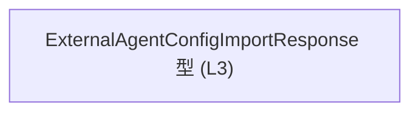
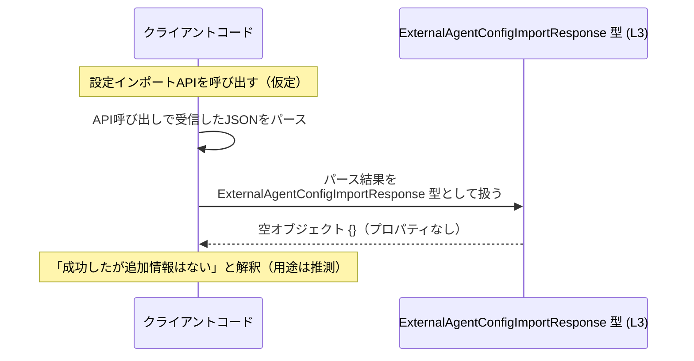

# app-server-protocol\schema\typescript\v2\ExternalAgentConfigImportResponse.ts コード解説

---

## 0. ざっくり一言

`ExternalAgentConfigImportResponse` 型は、**フィールドを一切持たない「空のレスポンス」を表現する TypeScript の型エイリアス**です（ExternalAgentConfigImportResponse.ts:L3）。

---

## 1. このモジュールの役割

### 1.1 概要

- このファイルは `ts-rs` によって自動生成された TypeScript 型定義です（ExternalAgentConfigImportResponse.ts:L1-2）。
- `ExternalAgentConfigImportResponse` という公開型エイリアスを 1 つだけ提供し、その中身は `Record<string, never>` です（ExternalAgentConfigImportResponse.ts:L3）。
- 型レベルで「このレスポンスにはプロパティが存在しない（何も返ってこない）」ことを表現するための型と解釈できますが、用途はファイル名からの推測であり、このチャンクだけでは確定できません。

### 1.2 アーキテクチャ内での位置づけ

このファイルは **型定義のみ** を提供し、他のモジュールを import していません。依存関係は以下のように非常に単純です。



- ノードは 1 つだけで、他 TypeScript ファイルやライブラリへの依存はコードからは確認できません。
- `Record` や `never` は TypeScript 組み込みの型であり、追加 import を必要としないためです（言語仕様知識による）。

### 1.3 設計上のポイント

- 自動生成コード  
  - 先頭コメントに「GENERATED CODE」「Do not edit manually」と明記されており、このファイルは手動編集しない前提です（ExternalAgentConfigImportResponse.ts:L1-2）。
- 責務の単一性  
  - 1 つの API レスポンス型（と考えられるもの）だけを定義し、それ以外のロジックや補助関数は一切含みません（ExternalAgentConfigImportResponse.ts:L3）。
- 状態やロジックを持たない  
  - 変数・クラス・関数などの実行時ロジックはなく、**静的型情報のみ**を提供します。
- エラーハンドリング / 並行性  
  - 実行時コードが存在しないため、ランタイムのエラー処理や並行性に関するロジックは一切ありません。

---

## 2. 主要な機能一覧

このモジュールが提供する機能は 1 つです。

- `ExternalAgentConfigImportResponse` 型: 何もプロパティを持たないレスポンスを表す型エイリアス（ExternalAgentConfigImportResponse.ts:L3）

---

## 3. 公開 API と詳細解説

### 3.1 型一覧（構造体・列挙体など）

| 名前                               | 種別        | 役割 / 用途                                                                                                         | 定義箇所                                             |
|------------------------------------|-------------|---------------------------------------------------------------------------------------------------------------------|------------------------------------------------------|
| `ExternalAgentConfigImportResponse` | 型エイリアス | `Record<string, never>` として定義される、「キーを一切持たないオブジェクト」を表現するための型（用途は名前からの推測を含む） | ExternalAgentConfigImportResponse.ts:L3              |

**型の中身 (`Record<string, never>`) について**

- `Record<K, V>` は「キー K に対して値 V を持つオブジェクト型」を表すユーティリティ型です（TypeScript 標準）。
- `Record<string, never>` は、「任意の文字列キーに対して値の型が `never`」という意味の型です。
  - `never` は「値が存在しない／到達不能」であることを表す特殊な型です。
  - 実務上は「そのプロパティには値を持たせてはならない」ことを示すのに用いられます。
- つまり `ExternalAgentConfigImportResponse` は「どんなプロパティをアクセスしても型 `never` になり、実質的にプロパティを持てないオブジェクト」を表現します。

### 3.2 関数詳細（最大 7 件）

このファイルには **関数・メソッドは一切定義されていません**。

- したがって、詳細テンプレートに基づいて解説すべき関数は存在しません。
- ランタイムで実行されるロジックもなく、コンパイル時の型チェックのためだけのファイルです。

### 3.3 その他の関数

| 関数名 | 役割（1 行） |
|--------|--------------|
| なし   | このチャンクには関数定義が存在しません |

---

## 4. データフロー

このモジュールは型定義のみを提供し、コード内から実際のデータの流れは読み取れません。そのため、ここでは「この型を利用する側」を仮定した典型的な利用イメージを示します（**あくまで利用例であり、このリポジトリ内の実コードではありません**）。

### 概念的なデータフロー（利用例）

以下は、外部エージェント設定のインポート API が成功した際、特に追加の情報を返さず、単に「成功」の意味で空レスポンスを返すケースを仮定した図です。



- 実際にどのようにシリアライズ／デシリアライズされるかは、このチャンクには現れていません。
- 型が空であることから、「成功／失敗は HTTP ステータスなどで表現し、ボディには追加情報がない」ようなプロトコル設計に使われている可能性がありますが、これは命名に基づく推測であり、確定情報ではありません。

---

## 5. 使い方（How to Use）

### 5.1 基本的な使用方法

`ExternalAgentConfigImportResponse` は **空オブジェクトを表現する型** なので、実際に扱う値は `{}` のようなオブジェクトになります。

```typescript
// app-server-protocol/schema/typescript/v2/ExternalAgentConfigImportResponse.ts からインポートする例
import type { ExternalAgentConfigImportResponse } from "./ExternalAgentConfigImportResponse"; // 相対パスはプロジェクト構成に依存

// APIクライアントからのレスポンスをこの型で受け取る例（仮定）
async function importExternalAgentConfig(): Promise<ExternalAgentConfigImportResponse> {
    // ここで実際には HTTP リクエストなどを行う想定
    // 例として、何もフィールドを持たないオブジェクトを返す
    return {}; // OK: {} は Record<string, never> に代入可能
}

// 利用側のコード
async function main() {
    const res: ExternalAgentConfigImportResponse = await importExternalAgentConfig();
    console.log(res); // 出力例: {}
    // res.anyField = ...;  // コンパイルエラー: プロパティ 'anyField' を追加できない（never 型）
}
```

**ポイント**

- `Record<string, never>` のため、任意のプロパティを読み書きしようとすると TypeScript コンパイルエラーになります。
- これにより、「このレスポンスから何か情報を読もうとしていないか」を静的に検出できます。

### 5.2 よくある使用パターン

1. **「成功したが特に返す情報がない」API のレスポンスとして使う（想定パターン）**

```typescript
async function callApi(): Promise<ExternalAgentConfigImportResponse> {
    // 実装例（実際のコードではHTTPクライアントに置き換わる）
    return {};
}

async function run() {
    const response = await callApi();

    // 何かフィールドを読もうとするとエラー
    // const id = response.id; // プロパティ 'id' は存在しない
}
```

1. **`unknown` からの絞り込み（型ガードと組み合わせる例）**

```typescript
function isExternalAgentConfigImportResponse(
    value: unknown
): value is ExternalAgentConfigImportResponse {
    // 「空オブジェクトである」ことだけを簡易チェックする例
    return typeof value === "object" && value !== null && Object.keys(value).length === 0;
}

// 使用例
const payload: unknown = {}; // 何らかの受信データ
if (isExternalAgentConfigImportResponse(payload)) {
    // ここでは payload は ExternalAgentConfigImportResponse 型とみなされる
}
```

※ これはあくまで一例であり、実際にこのリポジトリでこうした型ガードが存在するかは、このチャンクからは分かりません。

### 5.3 よくある間違い

```typescript
import type { ExternalAgentConfigImportResponse } from "./ExternalAgentConfigImportResponse";

// 間違い例: レスポンスにフィールドがあると想定してしまう
function handleResponseWrong(res: ExternalAgentConfigImportResponse) {
    // const status = res.status; // エラー: 'status' プロパティは存在しない
}

// 正しい例: 「何も読めない型」であることを前提に扱う
function handleResponseCorrect(res: ExternalAgentConfigImportResponse) {
    // 空であることだけを前提にする（ログ出力など）
    console.log("Import finished", res); // res 自体は空オブジェクト
}
```

### 5.4 使用上の注意点（まとめ）

- **前提条件**
  - この型は「プロパティを持たない」ことを表現するために `Record<string, never>` を用いています。
  - 実際の JSON レスポンスが空オブジェクト `{}` であることが前提になっていると考えられますが、このチャンクからはプロトコル仕様全体は分かりません。
- **禁止事項**
  - この型の値に対してプロパティアクセスや追加を行うこと（TypeScript 上はコンパイルエラーになります）。
- **ランタイムとのギャップ**
  - TypeScript の型安全性はコンパイル時のみであり、実行時には `any` キャストなどによりプロパティが存在してしまう可能性があります。
  - 実際の受信データの検証（バリデーション）は別途行う必要がありますが、このチャンクにはそのロジックは含まれません。
- **パフォーマンス**
  - 型定義のみでランタイム処理はないため、パフォーマンスへの影響はありません。

---

## 6. 変更の仕方（How to Modify）

このファイルは自動生成コードであるため、**直接編集しないことが強く推奨されます**（ExternalAgentConfigImportResponse.ts:L1-2）。

### 6.1 新しい機能を追加する場合

- 新たにレスポンスにフィールドを追加したい場合、通常は **元となる Rust 側の型定義（`ts-rs` の生成元）を変更**し、再生成する必要があります。
  - Rust 側やスキーマ定義のファイル名・場所は、このチャンクには現れません。
- TypeScript 側だけで動きを変えたい場合でも、このファイルを直接編集するのではなく、**別ファイルでラッパー型や補助関数を定義**するのが一般的です。

例（別ファイルでの拡張例）:

```typescript
import type { ExternalAgentConfigImportResponse } from "./ExternalAgentConfigImportResponse";

// アプリケーション側で付加的に扱いたい情報を別途ラップする例
export interface ExternalAgentConfigImportResult {
    response: ExternalAgentConfigImportResponse; // 空レスポンス
    statusCode: number;                          // HTTPステータスなど、アプリ側で付与
}
```

### 6.2 既存の機能を変更する場合

- `ExternalAgentConfigImportResponse` の構造を変更したい場合の注意点:
  - 自動生成元（Rust の構造体やプロトコル定義）との整合性を確認する必要があります。
  - 他の TypeScript ファイルで `ExternalAgentConfigImportResponse` に依存している箇所への影響を調査する必要があります（このチャンクからは依存箇所は分かりません）。
- 変更時に意識すべき契約（Contract）
  - 現状は「空オブジェクト」を前提としているため、プロパティを追加すると「何も返さないレスポンス」という前提が崩れます。
  - API クライアント／サーバ双方でプロトコルの互換性を考慮する必要があります。

---

## 7. 関連ファイル

このチャンク内の情報だけでは、具体的にどのファイルがこの型を利用しているかは分かりません。そのため、推測に基づかない範囲で記述します。

| パス | 役割 / 関係 |
|------|------------|
| （不明） | `ExternalAgentConfigImportResponse` を import して利用しているファイルは、このチャンクには現れません |
| （不明） | `ts-rs` による生成元の Rust 型定義ファイルも、このチャンクからは特定できません |

---

### コンポーネントインベントリー（まとめ）

最後に、このチャンクに現れる型・関数の一覧と根拠行番号をまとめます。

| 種別        | 名前                               | 説明                                                                                               | 定義箇所                                             |
|-------------|------------------------------------|----------------------------------------------------------------------------------------------------|------------------------------------------------------|
| 型エイリアス | `ExternalAgentConfigImportResponse` | `Record<string, never>` として定義された、プロパティを持たないレスポンスを表現する型（用途は名前からの推測を含む） | ExternalAgentConfigImportResponse.ts:L3              |
| コメント    | 自動生成警告                       | このファイルが自動生成され、手動編集すべきでないことを知らせるコメント                             | ExternalAgentConfigImportResponse.ts:L1-2            |
| 関数        | なし                               | このチャンクには関数定義が存在しません                                                             | （該当なし）                                         |

- バグ / セキュリティ: ランタイムコードがないため、このファイル単体には直接的なバグやセキュリティ問題は見当たりません。
- エッジケース / 契約: 「プロパティを追加しようとすると型エラーになる」という TypeScript の型チェックが主な契約になります。
