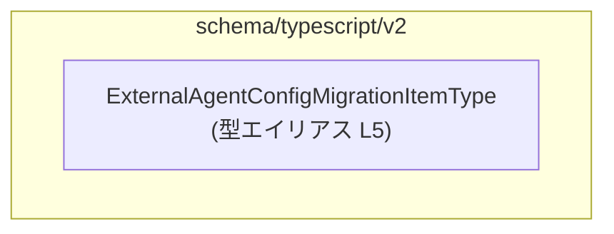
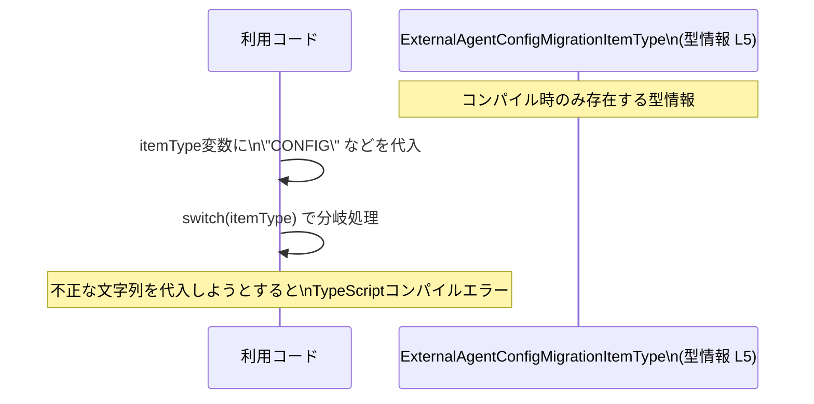

# app-server-protocol/schema/typescript/v2/ExternalAgentConfigMigrationItemType.ts

## 0. ざっくり一言

外部エージェント設定のマイグレーションで扱う対象カテゴリを、4 種類の文字列リテラルに限定する **TypeScript の型エイリアス** を定義しているファイルです（ExternalAgentConfigMigrationItemType.ts:L5）。

---

## 1. このモジュールの役割

### 1.1 概要

- このモジュールは、外部エージェント設定のマイグレーションにおいて扱う項目種別を表す型 `ExternalAgentConfigMigrationItemType` を提供します（ExternalAgentConfigMigrationItemType.ts:L5）。
- 型は `"AGENTS_MD" | "CONFIG" | "SKILLS" | "MCP_SERVER_CONFIG"` の 4 つの文字列リテラルの union（和集合）として表現されており、呼び出し側コードが「どのカテゴリを扱うか」を型安全に指定できるようにします（ExternalAgentConfigMigrationItemType.ts:L5）。
- ファイル先頭のコメントから、この型は Rust コードから `ts-rs` によって自動生成されていることが分かります（ExternalAgentConfigMigrationItemType.ts:L1-3）。

### 1.2 アーキテクチャ内での位置づけ

- このファイルには **import 文が一切存在せず**（ExternalAgentConfigMigrationItemType.ts:L1-5）、他モジュールへの依存はこのチャンクからは確認できません。
- 一方で `export type ...` で公開されているため（ExternalAgentConfigMigrationItemType.ts:L5）、他の TypeScript コードからこの型が参照される前提で設計されています。

Mermaid 図で、本ファイル内の構造だけを表すと次のようになります。



この図は「型エイリアスが 1 つ定義されている」という事実のみを示しており、どのモジュールから利用されているかは、このチャンクには現れません。

### 1.3 設計上のポイント

- **自動生成コードであることが明示**  
  - 「手で編集してはいけない」「`ts-rs` による生成物である」というコメントが先頭にあります（ExternalAgentConfigMigrationItemType.ts:L1-3）。
- **文字列リテラル union 型による列挙**  
  - enum ではなく `"..." | "..."` の形で union 型として定義されています（ExternalAgentConfigMigrationItemType.ts:L5）。  
  - これにより、呼び出し側で `"CONFIG"` などを直接文字列として扱いつつ、TypeScript の型チェックを受けられます。
- **状態やロジックを一切持たない**  
  - 関数・クラス・変数などの宣言はなく、コンパイル時の型情報だけを提供するモジュールです（ExternalAgentConfigMigrationItemType.ts:L1-5）。
- **エラーハンドリング・並行性とは無縁のレイヤ**  
  - 実行時処理が存在しないため、このファイル単体としてはランタイムエラーや並行処理に関わる挙動はありません。  
  - TypeScript の型システムによる「コンパイル時の安全性」を高める役割に限定されています。

---

## 2. 主要な機能一覧

このファイルは機能というより **型情報** だけを提供しますが、実務上の「役割」として整理すると次の 1 点です。

- `ExternalAgentConfigMigrationItemType` 型の定義:  
  外部エージェント設定のマイグレーション対象カテゴリを `"AGENTS_MD" | "CONFIG" | "SKILLS" | "MCP_SERVER_CONFIG"` の 4 種類に限定する（ExternalAgentConfigMigrationItemType.ts:L5）。

### 2.1 コンポーネント一覧（インベントリ）

| 種別 | 名前 | 説明 | 定義行 |
|------|------|------|--------|
| 型エイリアス | `ExternalAgentConfigMigrationItemType` | 外部エージェント設定マイグレーションの対象種別を表す文字列リテラル union 型 | ExternalAgentConfigMigrationItemType.ts:L5 |

---

## 3. 公開 API と詳細解説

### 3.1 型一覧（構造体・列挙体など）

| 名前 | 種別 | 役割 / 用途 | 値のバリエーション | 定義行 |
|------|------|-------------|--------------------|--------|
| `ExternalAgentConfigMigrationItemType` | 型エイリアス（文字列リテラル union） | 外部エージェント設定のマイグレーション対象カテゴリを 4 種類の文字列に限定するための型 | `"AGENTS_MD"`, `"CONFIG"`, `"SKILLS"`, `"MCP_SERVER_CONFIG"` | ExternalAgentConfigMigrationItemType.ts:L5 |

各リテラル値について、名前から推測される用途を付記しますが、**コードから断定はできません**。

- `"AGENTS_MD"`  
  - 名称から、`agents.md` など Markdown ベースのエージェント定義に関連するカテゴリと推測できますが、詳細はこのチャンクからは分かりません。
- `"CONFIG"`  
  - 一般的に設定全般を指す名前ですが、どの設定を指すかは不明です。
- `"SKILLS"`  
  - エージェントが持つ「スキル」や機能群に関する設定と推測できますが、コード上の根拠はありません。
- `"MCP_SERVER_CONFIG"`  
  - `MCP` やサーバー設定に関連するカテゴリ名と推測できますが、こちらも詳細は不明です。

> 上記の用途はすべて「名前からの推測」であり、このチャンクには関連する処理やコメントは存在しません（ExternalAgentConfigMigrationItemType.ts:L1-5）。

### 3.2 関数詳細（最大 7 件）

このファイルには **関数・メソッドの定義は一切存在しません**（ExternalAgentConfigMigrationItemType.ts:L1-5）。  
そのため、「関数詳細」テンプレートを適用すべき対象もありません。

### 3.3 その他の関数

同様に、補助関数やラッパー関数も存在しません（ExternalAgentConfigMigrationItemType.ts:L1-5）。

---

## 4. データフロー

### 4.1 本ファイル単体でのデータフロー

- このファイルには **実行時に動く処理・データフローは存在しません**。  
  - あるのは TypeScript コンパイル時に使われる型情報だけです（ExternalAgentConfigMigrationItemType.ts:L5）。
- 実際のアプリケーションのデータフローは、「他のモジュールでこの型を使っている場所」に依存しますが、それはこのチャンクには現れません。

### 4.2 一般的な利用イメージ（参考）

以下は、**文字列リテラル union 型が一般にどのように使われるか** の参考例です。  
リポジトリ内の実際のコードフローを表しているわけではありません。



このように、`ExternalAgentConfigMigrationItemType` は **呼び出し側の変数や関数引数に型を付けることで、データの流れを静的に制約する** 役割を果たします（ただし具体的な利用箇所はこのチャンクには現れません）。

---

## 5. 使い方（How to Use）

### 5.1 基本的な使用方法

ここでは、`ExternalAgentConfigMigrationItemType` を利用する典型的なコードパターンの例を示します。  
**インポートパスはプロジェクト構成に依存するためダミーです。**

```typescript
// 型のインポート（実際のパスはプロジェクト構成に合わせて変更する必要があります）
import type { ExternalAgentConfigMigrationItemType } from "./ExternalAgentConfigMigrationItemType";

// マイグレーション対象を受け取る関数の例
function migrateItem(itemType: ExternalAgentConfigMigrationItemType) {  // itemType は 4 種類のどれか
    switch (itemType) {
        case "AGENTS_MD":              // AGENTS_MD を扱う処理
            // ... エージェント定義のマイグレーション処理（例）
            break;
        case "CONFIG":                 // CONFIG を扱う処理
            // ... 設定のマイグレーション処理（例）
            break;
        case "SKILLS":                 // SKILLS を扱う処理
            // ... スキル定義のマイグレーション処理（例）
            break;
        case "MCP_SERVER_CONFIG":      // MCP_SERVER_CONFIG を扱う処理
            // ... MCP サーバー設定のマイグレーション処理（例）
            break;
    }
}

// 呼び出し側の例
const target: ExternalAgentConfigMigrationItemType = "CONFIG";  // OK: union 型の一要素
migrateItem(target);

// const invalid: ExternalAgentConfigMigrationItemType = "OTHER"; // コンパイルエラー: 型に含まれない文字列
```

このように、**TypeScript の型チェックにより、`"OTHER"` など定義されていない文字列を誤って渡すことが防止されます**。  
ただし、これは TypeScript コンパイル時の安全性であり、JavaScript にトランスパイルされた後はランタイムチェックは自動では行われません。

### 5.2 よくある使用パターン

1. **関数引数の型として利用**  
   - マイグレーション処理・API 呼び出し・コマンド実行などで、「どの対象を扱うか」を表す引数にこの型を付与する。
2. **オブジェクトのプロパティ型として利用**  

   ```typescript
   interface MigrationRequest {
       itemType: ExternalAgentConfigMigrationItemType; // 対象カテゴリ
       // 他のプロパティ...
   }
   ```

3. **配列やマップのキーとして利用**  
   - 例えば、カテゴリごとの処理関数をマップで保持する場合にキーの型として利用するなど。

これらは一般的なパターンであり、実際にこのリポジトリで使われているかどうかは、このチャンクだけでは分かりません。

### 5.3 よくある間違い

```typescript
// 間違い例: 型を string にしてしまう
function migrateItemBad(itemType: string) {
    // "CONFIG" 以外の任意の文字列が渡せてしまう
}

// 正しい例: union 型をそのまま使う
function migrateItemGood(itemType: ExternalAgentConfigMigrationItemType) {
    // itemType は 4 種類のどれかに限定される
}
```

```typescript
// 間違い例: any を使って型安全性を失う
function migrateItemAny(itemType: any) {
    // コンパイル時には何もチェックされない
}

// 正しい例: ExternalAgentConfigMigrationItemType を使う
function migrateItemSafe(itemType: ExternalAgentConfigMigrationItemType) {
    // TypeScript が不正な文字列利用を検出する
}
```

### 5.4 使用上の注意点（まとめ）

- **前提条件**
  - `ExternalAgentConfigMigrationItemType` は `"AGENTS_MD" | "CONFIG" | "SKILLS" | "MCP_SERVER_CONFIG"` の 4 つのみを許容する型です（ExternalAgentConfigMigrationItemType.ts:L5）。
  - `null` や `undefined` はこの union に含まれていないため、そのような値を扱う場合は別途 union に含めるか、オプショナルにする必要があります（例: `ExternalAgentConfigMigrationItemType | null`）。
- **ランタイム安全性**
  - この型はあくまで TypeScript のコンパイル時チェック用であり、ランタイムで自動的に検証してくれるわけではありません。  
    外部入力（JSON など）から値を受け取る場合は、実行時のバリデーションを別途実装する必要があります。
- **セキュリティ面**
  - 型そのものは直接的なセキュリティリスクを追加しませんが、**型を信頼しすぎてランタイム検証を省略すると、外部からの不正値が通ってしまう可能性**があります。  
    特にリクエストボディなどユーザー入力を起点とする値には注意が必要です。
- **並行性**
  - このモジュールは状態を持たず、ランタイム処理もないため、並行実行やスレッドセーフティに関する懸念はありません。

---

## 6. 変更の仕方（How to Modify）

### 6.1 新しい値を追加する場合

- ファイル先頭に「GENERATED CODE」「ts-rs による生成」とあるため（ExternalAgentConfigMigrationItemType.ts:L1-3）、**このファイルを直接編集するのは前提から外れます**。
- 新しいカテゴリを追加したい場合は、次の流れになると考えられます（コメントに基づく推測であり、具体的な手順はこのチャンクからは分かりません）。
  1. Rust 側で、この型の元になっている型定義（`enum` など）に新しいバリアントを追加する。
  2. `ts-rs` を用いて TypeScript スキーマを再生成する。
  3. 生成された TypeScript コード（このファイル）に新しい文字列リテラルが追加されていることを確認する。

> 生成元の Rust ファイルのパスや型名は、このチャンクには現れません。

### 6.2 既存の値を変更・削除する場合

- 既存の文字列（例: `"CONFIG"`）の名称変更や削除は、**呼び出し側の全ての利用箇所に影響**します。
  - 文字列を変更すると、古い文字列に依存している TypeScript コードはコンパイルエラーになります。
  - バックエンド（Rust 側）や保存済みデータ（DB、ファイルなど）との互換性にも影響しうるため、全体設計を確認する必要があります。
- 生成コードであるため、実際には「Rust 側定義を変更 → 再生成」という流れで変更が伝播する形になると考えられます（ExternalAgentConfigMigrationItemType.ts:L1-3 を根拠にした推測）。

---

## 7. 関連ファイル

このチャンクには、直接的な関連ファイルのパスは記載されていませんが、コメントから以下のことが読み取れます。

| パス / 種別 | 役割 / 関係 |
|------------|------------|
| （不明: Rust 側の型定義ファイル） | `ts-rs` によってこの TypeScript 型を生成している Rust 側の型定義が存在すると考えられますが、具体的なパスや名前はこのチャンクには現れません（ExternalAgentConfigMigrationItemType.ts:L1-3）。 |
| `app-server-protocol/schema/typescript/v2/ExternalAgentConfigMigrationItemType.ts` | 本レポート対象。`ExternalAgentConfigMigrationItemType` 型を 4 つの文字列リテラル union として公開している（ExternalAgentConfigMigrationItemType.ts:L5）。 |

他に、この型を import している TypeScript ファイルや、同じディレクトリ内の他スキーマファイルなどが存在する可能性はありますが、**このチャンクには現れないため不明**です。
