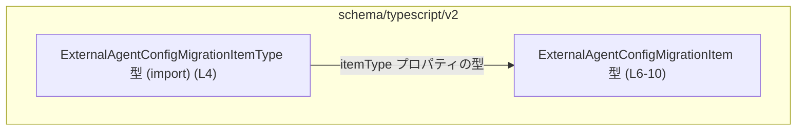
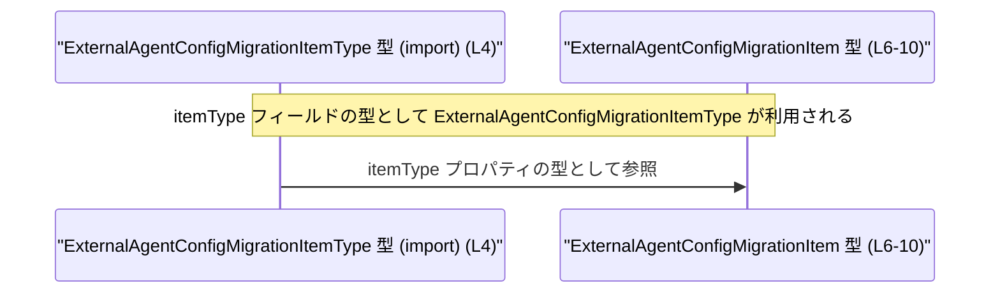

app-server-protocol/schema/typescript/v2/ExternalAgentConfigMigrationItem.ts コード解説
---

## 0. ざっくり一言

`ExternalAgentConfigMigrationItem` は、外部エージェント設定の「マイグレーション項目」を表す **TypeScript の型定義**です。  
マイグレーションの種別・説明文・作業ディレクトリのスコープ情報を 1 つのオブジェクトとして表現します（ExternalAgentConfigMigrationItem.ts:L6-10）。

---

## 1. このモジュールの役割

### 1.1 概要

- このモジュールは、外部エージェント設定のマイグレーション処理で扱われる **1 件分のマイグレーション定義**の形を TypeScript で表現するために存在します（L6-10）。
- 型は Rust から `ts-rs` によって自動生成されており、手動編集禁止であることがコメントで明示されています（L1-3）。
- マイグレーションの種別（`itemType`）、人間向けの説明（`description`）、マイグレーションのスコープを表す作業ディレクトリ（`cwd`）をフィールドとして持ちます（L6-10）。

### 1.2 アーキテクチャ内での位置づけ

- `schema/typescript/v2` というパスから、この型は **アプリケーションサーバープロトコル v2 のスキーマ定義の一部**であると読み取れます（ディレクトリ名からの解釈）。
- 本ファイルは `ExternalAgentConfigMigrationItemType` 型に依存しており（L4）、その型を `itemType` プロパティとして利用します（L6）。
- 逆方向（どこからこの型が使われているか）はこのチャンクには現れません。

依存関係（型レベル）の簡易図を示します。



### 1.3 設計上のポイント

- **自動生成コード**  
  - `// GENERATED CODE! DO NOT MODIFY BY HAND!` と `ts-rs` による生成コメントから、Rust 側の定義を元に自動生成されたコードであると分かります（L1-3）。
  - そのため、このファイル自体を直接変更する前提では設計されていません。

- **純粋なデータ型**  
  - 実行時ロジック（関数・クラス）は一切なく、型エイリアスによる **データ構造の宣言のみ**が含まれます（L6-10）。
  - 状態や副作用を持たないため、このファイル単体には並行性・エラーハンドリングのロジックは存在しません。

- **型安全性の方針**  
  - `itemType` に専用の型 `ExternalAgentConfigMigrationItemType` を使うことで、マイグレーション種別を文字列などの「ゆるい型」ではなく、プロトコルで決められた型に制約しています（L4, L6）。
  - `cwd` は `string | null` のユニオン型であり、コメントにより値の意味（スコープ）が定義されています（L7-9, L10）。

- **契約（contract）がコメントで補足されている点**  
  - `cwd` について「Null or empty means home-scoped migration; non-empty means repo-scoped migration.」と仕様がコメントで明示されています（L7-9）。
  - ただし、この仕様は型システムでは表現されておらず、別の層で解釈・検証される前提の設計になっています。

---

## 2. 主要な機能一覧（コンポーネントインベントリー）

本ファイルは関数を持たず、型定義のみです。そのため「機能」は「どのようなデータ構造を提供するか」として整理します。

### 型・モジュール一覧

| 名前 | 種別 | 定義場所 | 役割 / 用途 | 根拠 |
|------|------|----------|-------------|------|
| `ExternalAgentConfigMigrationItem` | 型エイリアス（オブジェクト型） | 本ファイル | 外部エージェント設定のマイグレーション項目を表すデータ構造 | L6-10 |
| `ExternalAgentConfigMigrationItemType` | 型（詳細不明） | `./ExternalAgentConfigMigrationItemType` からの import | `itemType` プロパティの型。マイグレーション項目の種別を表すことが名前から推測されるが、中身はこのチャンクには現れない | L4 |

### `ExternalAgentConfigMigrationItem` のフィールド一覧

| フィールド名 | 型 | 説明 | 根拠 |
|--------------|----|------|------|
| `itemType` | `ExternalAgentConfigMigrationItemType` | マイグレーションの種別を表すフィールド。具体的な値のバリエーションは別ファイルの型定義に依存します | L6 |
| `description` | `string` | このマイグレーション項目の説明文（人間向け） | L6 |
| `cwd` | `string \| null` | マイグレーションのスコープに関する作業ディレクトリ。`null` または空文字列の場合は「home-scoped」、非空文字列の場合は「repo-scoped」として解釈されるとコメントに記載されています | L7-10 |

---

## 3. 公開 API と詳細解説

### 3.1 型一覧（構造体・列挙体など）

公開されている主要な型（本ファイルで `export` されているもの）は以下の 1 つです。

| 名前 | 種別 | 役割 / 用途 | 根拠 |
|------|------|-------------|------|
| `ExternalAgentConfigMigrationItem` | 型エイリアス（オブジェクト型） | 外部エージェント設定のマイグレーション項目 1 件を表現するデータ型 | L6-10 |

#### `ExternalAgentConfigMigrationItem` の詳細

- **型定義**  

  ```typescript
  export type ExternalAgentConfigMigrationItem = {
      itemType: ExternalAgentConfigMigrationItemType,
      description: string,
      /**
       * Null or empty means home-scoped migration; non-empty means repo-scoped migration.
       */
      cwd: string | null,
  };
  ```  

  （ExternalAgentConfigMigrationItem.ts:L6-10）

- **意味的な契約（コメントから読み取れる仕様）**
  - `cwd === null` または `cwd === ""`（空文字）の場合:  
    「home-scoped migration」として扱われる（L7-9）。
  - `cwd` が非空文字列の場合:  
    「repo-scoped migration」として扱われる（L7-9）。

  型自体は `string | null` であり、「空文字かどうか」はコンパイル時には区別されません。そのため、この仕様は **実行時ロジック側で解釈する必要がある**設計です（L7-10）。

### 3.2 関数詳細（最大 7 件）

- 本ファイルには **関数・メソッドは定義されていません**（L1-10）。
- したがって、関数詳細テンプレートを適用できる対象はありません。

### 3.3 その他の関数

- なし（このチャンクには一切現れません）。

---

## 4. データフロー（型レベルの依存関係）

このファイルには実行時処理はなく、唯一の「データフロー」は **型定義内での型依存関係**です。

### 型内依存関係の説明

- `ExternalAgentConfigMigrationItem` は `itemType` プロパティの型として `ExternalAgentConfigMigrationItemType` を使用しています（L4, L6）。
- これにより、プロトコルで許可されているマイグレーション種別だけが `itemType` に入り得るように、型レベルで制約されています。

### Mermaid シーケンス図（型依存の流れ）



- 実際にこの型がどのモジュールから生成・送受信されるかは、このチャンクには現れません。

---

## 5. 使い方（How to Use）

### 5.1 基本的な使用方法

この型は、TypeScript コード上でマイグレーション項目オブジェクトを表現するために利用されます。  
ここでは **想定される一般的な利用例** を示します（本リポジトリ内の実在コードではなく、「この型をどう使えるか」の例です）。

```typescript
import type { ExternalAgentConfigMigrationItem } from "./ExternalAgentConfigMigrationItem"; // 本ファイルの型
import type { ExternalAgentConfigMigrationItemType } from "./ExternalAgentConfigMigrationItemType"; // 種別型

// 仮の種別値（実際の値は ExternalAgentConfigMigrationItemType の定義に依存）
const itemType: ExternalAgentConfigMigrationItemType = /* ... */;

// home-scoped migration の例（cwd を null にする）
const homeScopedItem: ExternalAgentConfigMigrationItem = {
    itemType,                          // マイグレーションの種別
    description: "Migrate user config",// マイグレーションの説明
    cwd: null,                         // null → home-scoped とコメントに記載 (L7-9)
};

// repo-scoped migration の例（cwd を非空文字列にする）
const repoScopedItem: ExternalAgentConfigMigrationItem = {
    itemType,
    description: "Migrate repo config",
    cwd: "/path/to/repo",              // 非空 → repo-scoped とコメントに記載 (L7-9)
};
```

このように、`cwd` の値によってマイグレーションのスコープを表現します。

### 5.2 よくある使用パターン

この型に対して想定されるパターンを列挙します（いずれも一般的な TypeScript 利用例であり、このチャンク内には現れません）。

1. **設定ファイルやプロトコルメッセージのパース結果として使う**
   - JSON 等からパースされたオブジェクトにこの型を付けることで、IDE 補完と型チェックを受けつつ処理を行う。

   ```typescript
   function handleMigrationItem(item: ExternalAgentConfigMigrationItem) {
       if (item.cwd === null || item.cwd === "") {
           // home-scoped として処理
       } else {
           // repo-scoped として処理
       }
   }
   ```

2. **UI フォームの値の型として使う**
   - フロントエンドで、マイグレーション項目編集フォームのモデルとしてこの型を使う。

### 5.3 よくある間違い（起こり得る誤用例）

`cwd` の仕様に関して、コメントから想定される誤用例を示します（L7-9）。

```typescript
// 誤りやすい例: cwd が undefined のままになっている
const invalidItem /*: ExternalAgentConfigMigrationItem*/ = {
    // itemType と description は省略
    cwd: undefined, // 型は string | null なので、undefined は不正
    // → コンパイルエラーとなる（TypeScript の型安全性）
};

// 正しい例: home-scoped を表現したい場合
const validHomeItem: ExternalAgentConfigMigrationItem = {
    itemType,
    description: "home scoped migration",
    cwd: null, // または ""（空文字）
};
```

### 5.4 使用上の注意点（まとめ）

- `cwd` は `string | null` ですが、「home-scoped」と「repo-scoped」の違いは **値の内容（空かどうか）** に依存します（L7-10）。  
  → ロジック側で `null` と空文字の両方を home-scoped として解釈する必要があります。
- `cwd` に `undefined` は許可されていません（型が `string | null` であるため）。  
  TypeScript を厳格モードで使う場合、`cwd?` ではなく必須プロパティであることにも注意が必要です（L10）。
- このファイルは自動生成されるため、ここを直接編集しても再生成時に上書きされます（L1-3）。仕様変更は生成元（Rust 側定義や ts-rs の設定）で行う必要があります。

---

## 6. 変更の仕方（How to Modify）

### 6.1 新しい機能を追加する場合

- コメントにより「自動生成コードであり、手動で編集すべきでない」ことが明示されています（L1-3）。
- したがって、**このファイルに直接フィールドを追加・変更するのは前提外**です。
- 新しいフィールドやマイグレーション項目の属性を追加したい場合の一般的な手順は次の通りです（ただし、生成元の具体的な場所はこのチャンクには現れません）。

  1. Rust 側など、`ts-rs` の生成元となるデータ構造にフィールドを追加・変更する。  
     （どのファイルかはこのチャンクからは不明です。）
  2. `ts-rs` を再実行して TypeScript スキーマを再生成する。
  3. 生成された `ExternalAgentConfigMigrationItem.ts` に新フィールドが反映されていることを確認する。

### 6.2 既存の機能を変更する場合

- **影響範囲の確認**
  - `ExternalAgentConfigMigrationItem` を参照している全ての TypeScript コードが影響を受けるため、型定義変更前に利用箇所の検索が必要です（利用箇所はこのチャンクには現れません）。
- **契約（前提条件）の維持**
  - `cwd` の意味（null/空 → home-scoped、非空 → repo-scoped）はコメントにより仕様として明示されています（L7-9）。  
    これを変える場合、コメントだけでなくロジック側の実装やドキュメントとの整合性にも注意が必要です。
- **テスト**
  - テストコードはこのチャンクには現れませんが、`cwd` の解釈ロジックや `itemType` の扱いなど、プロトコル解釈に関わる部分のテストを見直す必要があります。

---

## 7. 関連ファイル

このモジュールと直接的に関係するファイルは、import から次の 1 つが読み取れます。

| パス | 役割 / 関係 | 根拠 |
|------|-------------|------|
| `app-server-protocol/schema/typescript/v2/ExternalAgentConfigMigrationItemType.ts` | `ExternalAgentConfigMigrationItem` の `itemType` プロパティの型を定義するファイルと考えられます。具体的な中身はこのチャンクには現れませんが、マイグレーション項目の種別を表す型であることが名前から推測されます。 | import 文 `import type { ExternalAgentConfigMigrationItemType } from "./ExternalAgentConfigMigrationItemType";`（L4） |

---

## Bugs / Security / Edge Cases / Tests / Performance について

このファイルは **型定義のみ** を提供し、ロジックを含まないため、それぞれ次のように整理できます。

- **Bugs の可能性**
  - 型定義レベルでは、`cwd` の意味がコメントにのみ書かれており、型で表現されていません（L7-10）。  
    → 実装側がコメントを守らなければ、home-/repo-scoped の判定ロジックと不整合が生じる可能性があります（一般論）。
- **Security**
  - 本ファイル単体では入力検証や権限制御などのロジックは含まれていません。  
    型定義の誤用によるセキュリティ問題（例: 誤ったスコープでマイグレーションを実行）が起きるかどうかは、利用側の実装に依存し、このチャンクからは分かりません。
- **Contracts / Edge Cases**
  - 重要な契約は `cwd` の仕様（null/空/非空）です（L7-10）。  
    エッジケースとして、空文字列 `""` と `null` を同一扱いにする必要がある点が挙げられます。
- **Tests**
  - テストコードはこのチャンクには現れません。  
    この型の契約（特に `cwd` の解釈）を守るロジックに対して、テストが存在するかどうかは不明です。
- **Performance / Scalability**
  - 型定義のみであり、パフォーマンスに影響する処理は含まれていません（L1-10）。

---

以上が、`app-server-protocol/schema/typescript/v2/ExternalAgentConfigMigrationItem.ts` のコードから読み取れる事実に基づく解説です。
