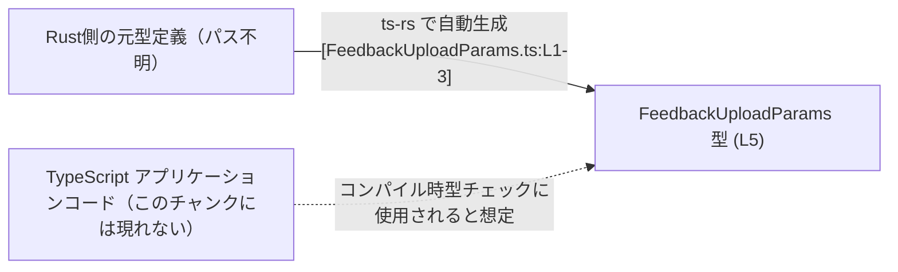
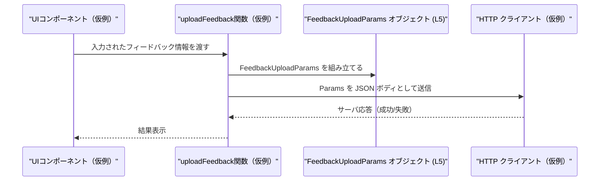

# app-server-protocol/schema/typescript/v2/FeedbackUploadParams.ts コード解説

## 0. ざっくり一言

`FeedbackUploadParams` は、フィードバックをサーバーにアップロードする際のパラメータ構造を表す **TypeScript の型エイリアス**です[FeedbackUploadParams.ts:L5-5]。  
このファイルは Rust 側の型から `ts-rs` によって自動生成されており、手で編集しないことが明示されています[FeedbackUploadParams.ts:L1-3]。

---

## 1. このモジュールの役割

### 1.1 概要

- このモジュールは、**フィードバックアップロード要求のペイロード構造**を TypeScript 上で表現するために存在します[FeedbackUploadParams.ts:L5-5]。
- Rust 側の定義から `ts-rs` によって生成されることで、**クライアント（TypeScript）とサーバー（Rust）の型整合性**を保つ役割があります[FeedbackUploadParams.ts:L1-3]。
- 実行時のロジックや関数は含まれず、**静的型付けによる安全性の補助**のみを担います[FeedbackUploadParams.ts:L1-5]。

### 1.2 アーキテクチャ内での位置づけ

このファイル単体からは、実際にどのコンポーネントがこの型を利用しているかは分かりません（このチャンクには現れません）。  
ただしコメントから、Rust 型 → `ts-rs` → TypeScript 型 という生成フローが存在することは読み取れます[FeedbackUploadParams.ts:L1-3]。

以下は、その関係のみを示した依存関係図です（利用側コードは「不明」と明示しています）。



※ `AppCode` との関係は、このチャンクからはコードとして確認できず、一般的な利用イメージとして記載しています。

### 1.3 設計上のポイント

コードから読み取れる設計上の特徴は次の通りです。

- **自動生成コード**  
  - ファイル先頭で自動生成であることと、手動編集禁止が明記されています[FeedbackUploadParams.ts:L1-3]。
- **単一の公開 API**  
  - `export type FeedbackUploadParams = {...}` だけが定義されており、他の型や関数はありません[FeedbackUploadParams.ts:L5-5]。
- **オブジェクト型によるリクエストペイロード表現**  
  - プリミティブ型（`string`, `boolean`）、配列（`Array<string>`）、任意キーのマップ（インデックスシグネチャ）などを組み合わせています[FeedbackUploadParams.ts:L5-5]。
- **オプショナルと `null` の併用**  
  - `reason?`, `threadId?`, `extraLogFiles?`, `tags?` は「プロパティ自体が存在しない」ことと「存在するが `null`」の両方を許容する設計になっています[FeedbackUploadParams.ts:L5-5]。
- **TypeScript 特有の型安全性**  
  - すべてのフィールド型が明示されており、コンパイラが不正な型代入を検出できますが、実行時の検証はこの型自身には含まれません[FeedbackUploadParams.ts:L5-5]。
- **状態・並行性は持たない**  
  - 関数やクラスがなく、単なるデータ型の定義であるため、このファイル自体は状態管理や並行処理とは無関係です[FeedbackUploadParams.ts:L1-5]。

---

## 2. 主要な機能一覧

このファイルは「機能」というより「データ構造」を提供しますが、その役割を機能として整理すると次のようになります。

- フィードバック分類の保持: `classification: string` でフィードバックの種別を表現[FeedbackUploadParams.ts:L5-5]。
- 任意の理由テキストの付加: `reason?: string | null` で、詳細な説明やコメントを任意に付けられる[FeedbackUploadParams.ts:L5-5]。
- スレッド識別子のオプション指定: `threadId?: string | null` で関連スレッド ID などを保持可能[FeedbackUploadParams.ts:L5-5]。
- ログ同梱の有無フラグ: `includeLogs: boolean` で、ログを含めるかどうかを明示[FeedbackUploadParams.ts:L5-5]。
- 追加ログファイルリスト: `extraLogFiles?: Array<string> | null` で、追加的に含めたいログファイル名一覧を指定[FeedbackUploadParams.ts:L5-5]。
- 任意タグの付与: `tags?: { [key in string]?: string } | null` で、任意のキー/値タグを柔軟に付加[FeedbackUploadParams.ts:L5-5]。

---

## 3. 公開 API と詳細解説

### 3.1 型一覧（構造体・列挙体など）

#### コンポーネントインベントリー

| 名前                     | 種別                              | 役割 / 用途                                                                 | 定義位置                                |
|--------------------------|-----------------------------------|------------------------------------------------------------------------------|-----------------------------------------|
| `FeedbackUploadParams`   | 型エイリアス（オブジェクト型）    | フィードバックアップロード要求のパラメータ構造を表現するコンパイル時の型   | `FeedbackUploadParams.ts:L5-5`          |

#### `FeedbackUploadParams` のフィールド一覧

`FeedbackUploadParams` は次のプロパティを持つオブジェクト型として定義されています[FeedbackUploadParams.ts:L5-5]。

| フィールド名      | 型                                      | 必須/任意 | 説明（コードから読み取れる範囲）                                                                 | 根拠 |
|-------------------|-----------------------------------------|-----------|---------------------------------------------------------------------------------------------------|------|
| `classification`  | `string`                                | 必須      | フィードバックの分類を表す文字列。TypeScript 上は任意の文字列を許容する。                         | `FeedbackUploadParams.ts:L5-5` |
| `reason`          | `string \| null`（プロパティ自体は `?`）| 任意      | 詳細理由やコメントなどを格納するための文字列。プロパティ不在 / `null` / 文字列の3状態を取りうる。 | `FeedbackUploadParams.ts:L5-5` |
| `threadId`        | `string \| null`（プロパティ自体は `?`）| 任意      | 関連するスレッド ID などを表現すると解釈できる識別子。存在しない／`null`／文字列が許容される。    | `FeedbackUploadParams.ts:L5-5` |
| `includeLogs`     | `boolean`                               | 必須      | ログをフィードバック送信に含めるかどうかのフラグ。`true`/`false` のみ許容。                       | `FeedbackUploadParams.ts:L5-5` |
| `extraLogFiles`   | `Array<string> \| null`（`?`）          | 任意      | 追加で含めたいログファイル名の配列。プロパティ不在 / `null` / 文字列配列が許容される。           | `FeedbackUploadParams.ts:L5-5` |
| `tags`            | `{ [key in string]?: string } \| null`（`?`） | 任意 | 任意の文字列キーに対する文字列値のマップ。マップ自体の不在 / `null` / オブジェクトが許容される。 | `FeedbackUploadParams.ts:L5-5` |

##### TypeScript 的なポイント

- **型エイリアス**  
  `export type FeedbackUploadParams = {...};` は、オブジェクト型に `FeedbackUploadParams` という名前を付ける「型エイリアス」です[FeedbackUploadParams.ts:L5-5]。  
  型エイリアスは **コンパイル時のみ存在** し、実行時には削除されます。

- **オプショナルプロパティと `null` の両立**  
  例えば `reason?: string | null` は、以下をすべて許容します[FeedbackUploadParams.ts:L5-5]。
  - `params.reason` プロパティが存在しない
  - `params.reason === null`
  - `typeof params.reason === "string"`

- **インデックスシグネチャの利用**  
  `tags?: { [key in string]?: string } | null` は、任意の文字列キーを持つオブジェクトであり、各キーの値は `string` か「そのキーが存在しない」のどちらかであることを表します[FeedbackUploadParams.ts:L5-5]。

### 3.2 関数詳細（最大 7 件）

このファイルには関数・メソッドの定義は一切存在しません[FeedbackUploadParams.ts:L1-5]。  
したがって、本セクションで詳細解説すべき公開関数はありません。

### 3.3 その他の関数

- 該当なし（このチャンクには関数定義が現れません）[FeedbackUploadParams.ts:L1-5]。

---

## 4. データフロー

このファイル自体は型定義のみであり、実際のデータフローを示すコードは含まれていません[FeedbackUploadParams.ts:L1-5]。  
ここでは **一般的な利用イメージ** として、`FeedbackUploadParams` 型の値がどう流れるかの例を示します（実際の実装はこのチャンクからは不明です）。



- `Params` ノードが、このファイルで定義されている `FeedbackUploadParams` 型に対応します[FeedbackUploadParams.ts:L5-5]。
- `UI`/`FE`/`API` は、このチャンクには現れない仮のコンポーネントであり、典型的な Web アプリケーションのデータフロー例です。

---

## 5. 使い方（How to Use）

以下のコードは、この型の **典型的な使い方の例** を示すものであり、実際のリポジトリの関数名やファイル構成はこのチャンクからは分かりません。

### 5.1 基本的な使用方法

最小限の必須フィールド（`classification`, `includeLogs`）だけを指定する例です。

```typescript
// FeedbackUploadParams 型をインポートする（相対パスは利用側プロジェクト構成に依存）   // このファイルから型を読み込む
import type { FeedbackUploadParams } from "./FeedbackUploadParams";                             // 実際のパスはこのチャンクからは不明

// 仮のアップロード関数のシグネチャ例                                                             // 実際の実装は別ファイルにある想定の例
async function uploadFeedback(params: FeedbackUploadParams): Promise<void> {                    // FeedbackUploadParams を引数に取る
    // ここで HTTP リクエストを送るなどの処理を行う（実装は例示）                                  // このファイルには実装は存在しない
}

// FeedbackUploadParams の値を構築する例                                                           // フィードバック送信用のオブジェクトを作る
const params: FeedbackUploadParams = {                                                           // オブジェクトリテラルで型に適合する値を作成
    classification: "bug-report",                                                                // 必須の分類: 任意の文字列を指定可能
    includeLogs: true,                                                                           // ログを含めるかどうか
    // reason や threadId は省略可能                                                             // オプショナルなので省略してもコンパイルエラーにならない
};

// 仮のアップロード関数を呼び出す                                                                  // 実際にはアプリケーション固有の関数を呼び出す
uploadFeedback(params).catch((err) => {                                                          // 非同期処理のエラーを補足
    console.error("Failed to upload feedback", err);                                             // エラーをログ出力
});
```

### 5.2 よくある使用パターン

#### 理由・スレッド ID・タグを含めるパターン

```typescript
import type { FeedbackUploadParams } from "./FeedbackUploadParams";                             // 型のインポート

const detailedParams: FeedbackUploadParams = {                                                   // 追加情報を含む例
    classification: "feature-request",                                                           // 機能要望などを表す分類
    reason: "It would be helpful to have dark mode.",                                           // フィードバックの詳細な理由
    threadId: "thread-12345",                                                                    // 関連スレッド ID など
    includeLogs: false,                                                                          // ログは含めない
    tags: {                                                                                      // 任意のタグを付与
        severity: "low",                                                                         // 重要度
        platform: "web",                                                                         // プラットフォーム情報
    },
};
```

#### 追加ログファイルを指定するパターン

```typescript
import type { FeedbackUploadParams } from "./FeedbackUploadParams";                             // 型のインポート

const paramsWithLogs: FeedbackUploadParams = {
    classification: "bug-report",                                                                // バグ報告
    includeLogs: true,                                                                           // ログを含める
    extraLogFiles: ["renderer.log", "main.log"],                                                 // 追加で含めたいログファイル名
};
```

### 5.3 よくある間違い

型定義から推測される、起こりやすい型エラー例とその修正例です。

```typescript
import type { FeedbackUploadParams } from "./FeedbackUploadParams";

// 間違い例: tags の値に number 型を入れている                                                    // tags は string 値を要求する
const badParams: FeedbackUploadParams = {
    classification: "bug-report",
    includeLogs: true,
    // @ts-expect-error: Type 'number' is not assignable to type 'string'.                       // コンパイラがエラーを検出
    tags: { severity: 1 },                                                                       // number は許可されていない
};

// 正しい例: 文字列に変換する                                                                     // string 型であれば OK
const goodParams: FeedbackUploadParams = {
    classification: "bug-report",
    includeLogs: true,
    tags: { severity: "1" },                                                                     // 文字列にしておく
};
```

```typescript
// 間違い例: 必須フィールド includeLogs を省略している                                            // includeLogs は boolean 型で必須
// const invalidParams: FeedbackUploadParams = {                                                 // コメントアウトしているが、実際にはエラー
//     classification: "bug-report",
// };                                                                                            // Property 'includeLogs' is missing...

// 正しい例: includeLogs を必ず指定する                                                           // true/false のいずれかを指定
const validParams: FeedbackUploadParams = {
    classification: "bug-report",
    includeLogs: false,
};
```

### 5.4 使用上の注意点（まとめ）

- **ランタイム型チェックは行われない**  
  - TypeScript の型はコンパイル時のみ存在し、実行時には削除されます。  
    そのため、外部入力（ユーザー入力、サーバー応答など）から `FeedbackUploadParams` を組み立てる場合は、別途ランタイムのバリデーションが必要です[FeedbackUploadParams.ts:L5-5]。

- **オプショナル + `null` の解釈**  
  - `reason?: string | null` などのフィールドは、「プロパティが無い」と「`null`」の両方を区別できますが、どのように解釈するかは利用側の設計に依存します[FeedbackUploadParams.ts:L5-5]。  
    このファイルだけからはその意味付けは分からないため、サーバー側・プロトコル仕様を確認する必要があります。

- **分類値の制約は型としては存在しない**  
  - `classification` が単なる `string` であるため、タイポや想定外の値もコンパイル時にはエラーになりません[FeedbackUploadParams.ts:L5-5]。  
    有効な分類が限定されている場合は、別途列挙型やランタイムチェックを用意する必要があります。

- **並行性・スレッド安全性**  
  - この型は単なるデータ容器であり、並行性制御は何も含みません[FeedbackUploadParams.ts:L1-5]。  
    複数の非同期処理から同じオブジェクトを共有・書き換える場合は、利用側で不変オブジェクトとして扱うなどの配慮が必要です（これは TypeScript 全般の注意点です）。

- **ログとプライバシー**  
  - `includeLogs` および `extraLogFiles` によってログを送信するかどうかが決まります[FeedbackUploadParams.ts:L5-5]。  
    一般にログには機密情報が含まれる可能性があるため、ユーザー同意やマスキングなどのセキュリティ・プライバシー上の配慮は利用側の実装で行う必要があります。

---

## 6. 変更の仕方（How to Modify）

### 6.1 新しい機能を追加する場合

このファイルは次のコメントで **手動変更禁止** と明記されています[FeedbackUploadParams.ts:L1-3]。

```typescript
// GENERATED CODE! DO NOT MODIFY BY HAND!                                                       // 直接編集禁止
// This file was generated by [ts-rs](https://github.com/Aleph-Alpha/ts-rs).                    // ts-rs による自動生成
// Do not edit this file manually.                                                              // 手動編集を禁止
```

したがって、新しいフィールドを追加するなどの変更は、**Rust 側の元型定義と `ts-rs` の生成設定**を変更し、再生成する必要があります。

一般的な手順（このリポジトリ固有のパスはこのチャンクからは不明）:

1. Rust プロジェクト内で、`FeedbackUploadParams` に対応する構造体や型を特定する（ts-rs の典型的な使い方では `#[derive(TS)]` などが付いていることが多いが、このリポジトリでの定義場所は不明）。
2. その Rust 型にフィールドを追加・変更する。
3. `ts-rs` のコード生成コマンド（`cargo` 経由など）を実行し、TypeScript スキーマを再生成する。
4. TypeScript 側で新しいフィールドを利用するコードを追加し、コンパイルが通ることを確認する。

### 6.2 既存の機能を変更する場合

既存フィールドの型や意味を変更する場合、次の点に注意が必要です。

- **プロトコル互換性**  
  - `classification` の型を `string` から列挙型相当の union などに変えると、Rust 側や既存クライアントとの互換性に影響します[FeedbackUploadParams.ts:L5-5]。
- **オプショナル → 必須 の変更**  
  - 例えば `reason` を必須にすると、これまで `reason` を送っていなかった呼び出し元がコンパイルエラー・ランタイムエラーになる可能性があります[FeedbackUploadParams.ts:L5-5]。
- **`null` の扱い変更**  
  - `null` を許容しないように変える場合、サーバー・クライアント双方で `null` を送信／受信していないかを確認する必要があります。

変更時の確認ポイント（このチャンクから直接は見えませんが、一般的な観点）:

- `FeedbackUploadParams` を参照している TypeScript ファイルのコンパイル結果。
- Rust 側でこの型に対応する構造体を受け取る API のシリアライズ/デシリアライズ処理。
- テストコード（存在する場合）での JSON 例や期待値。

---

## 7. 関連ファイル

このチャンクには他ファイルの内容は含まれていないため、厳密な関連ファイルは特定できません。  
推測ではなく、分かる範囲でのみ記載します。

| パス / 区分                                          | 役割 / 関係                                                                                     |
|------------------------------------------------------|--------------------------------------------------------------------------------------------------|
| `app-server-protocol/schema/typescript/v2/FeedbackUploadParams.ts` | 本ファイル。`FeedbackUploadParams` 型の定義[FeedbackUploadParams.ts:L5-5]。                     |
| Rust 側の元型定義ファイル（具体的なパスは不明）      | `ts-rs` によってこの TypeScript 型が生成される元となる Rust 型定義[FeedbackUploadParams.ts:L1-3]。|
| `app-server-protocol/schema/typescript/v2/` ディレクトリ内の他ファイル | 同じスキーマバージョン `v2` の他の型定義が存在する可能性があるが、このチャンクだけからは内容・数は分かりません。 |

このファイルは **公開 API としての型定義**のみを提供しており、コアロジックや処理フローは別ファイル（このチャンクには現れない）に実装されていると考えられます。
