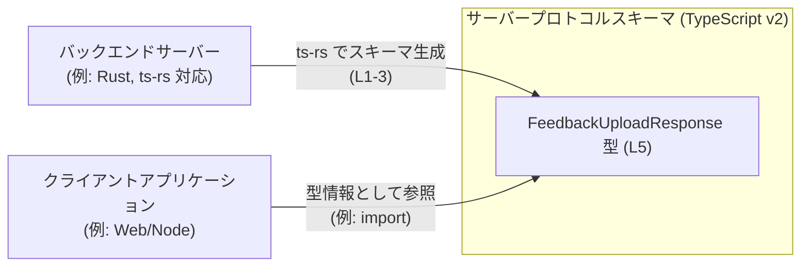
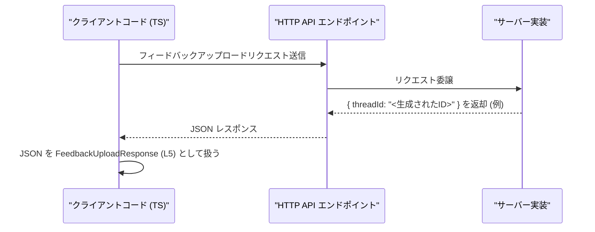

# app-server-protocol/schema/typescript/v2/FeedbackUploadResponse.ts コード解説

## 0. ざっくり一言

- `FeedbackUploadResponse` は、`threadId` という文字列プロパティを 1 つだけ持つオブジェクト型を表す **自動生成された TypeScript の型エイリアス** です（`FeedbackUploadResponse.ts:L1-3, L5`）。
- 型名から、フィードバックアップロード処理のレスポンスを表す用途で定義されていると解釈できますが、このチャンクだけからは実際の利用箇所は分かりません（`FeedbackUploadResponse.ts:L5`）。

---

## 1. このモジュールの役割

### 1.1 概要

- このファイルは、ツール `ts-rs` によって自動生成された TypeScript の型定義ファイルです（コメントより、`FeedbackUploadResponse.ts:L1-3`）。
- `FeedbackUploadResponse` 型は、少なくとも `threadId: string` という必須プロパティを持つオブジェクトの形を表現します（`FeedbackUploadResponse.ts:L5`）。
- 実行時のロジックや関数は一切含まれず、**静的な型情報のみ** を提供します（`FeedbackUploadResponse.ts:L5`）。

### 1.2 アーキテクチャ内での位置づけ

このファイル単体には import/export 以外の依存関係は記述されていないため、**実際にどのモジュールから参照されているかは不明** です（`FeedbackUploadResponse.ts:L5`）。  
ただし、パス `schema/typescript/v2` と型名から、アプリケーションサーバーのプロトコル（v2）の TypeScript スキーマの一部として、クライアントコードなどから参照されることを意図した型であると解釈できます。

以下は、そのような一般的な位置づけの「例」を示す図です（実際の依存関係はこのチャンクからは確認できません）。



### 1.3 設計上のポイント

コードから読み取れる特徴は次のとおりです。

- **自動生成コード**  
  - ファイル先頭のコメントに「GENERATED CODE! DO NOT MODIFY BY HAND!」とあり（`FeedbackUploadResponse.ts:L1-1`）、`ts-rs` により生成されたことが明示されています（`FeedbackUploadResponse.ts:L3-3`）。
  - 変更は元となる定義（おそらく Rust 側）で行い、再生成する前提の設計です。
- **最小限のオブジェクト型**  
  - 型エイリアス `FeedbackUploadResponse` は、`threadId: string` の 1 フィールドのみを持つシンプルなオブジェクト型です（`FeedbackUploadResponse.ts:L5`）。
- **状態やロジックを持たない**  
  - 関数・クラス・変数の定義はなく、状態や処理ロジックを持ちません（`FeedbackUploadResponse.ts:L5`）。
  - したがって、エラーハンドリングや並行性に関する実装は、このファイルの外側で行われます。

---

## 2. 主要な機能一覧

このファイルが提供する「機能」は型定義のみです。

- `FeedbackUploadResponse` 型定義:  
  フィールド `threadId: string` を持つレスポンスオブジェクトの形を表現する型エイリアスです（`FeedbackUploadResponse.ts:L5`）。

---

## 3. 公開 API と詳細解説

### 3.1 型一覧（構造体・列挙体など）

このチャンクに現れる公開型は次の 1 つです（`export` より、外部に公開されています・`FeedbackUploadResponse.ts:L5`）。

| 名前                     | 種別        | フィールド                              | 役割 / 用途（解釈）                                                                 | 定義場所 |
|--------------------------|-------------|-----------------------------------------|--------------------------------------------------------------------------------------|----------|
| `FeedbackUploadResponse` | 型エイリアス | `threadId: string`（必須）             | フィードバックアップロード処理のレスポンスとして、スレッド ID を返すオブジェクトを表す型と解釈できます（用途はコードからは断定不可） | `L5`     |

- フィールド `threadId`  
  - 型: `string`（`FeedbackUploadResponse.ts:L5`）  
  - オプショナルマーク（`?`）は付いていないため、**必須プロパティ** です（TypeScript の仕様）。

### 3.2 関数詳細（最大 7 件）

このファイルには関数定義・メソッド定義はありません（`FeedbackUploadResponse.ts:L1-5`）。  
したがって、詳細解説対象となる関数はありません。

### 3.3 その他の関数

補助的な関数やラッパー関数も含め、このファイルには関数が存在しません。

| 関数名 | 役割（1 行） |
|--------|--------------|
| なし   | このファイルには関数定義はありません |

---

## 4. データフロー

このファイル単体からは実際の呼び出し関係は読み取れませんが、`FeedbackUploadResponse` が「フィードバックアップロード API のレスポンス」を表す型として利用されるケースを **例** として示します（実在を保証するものではありません）。

### 想定される処理シナリオ（例）

1. クライアントがサーバーにフィードバックをアップロードする HTTP リクエストを送信する。
2. サーバーは新しい「フィードバックスレッド」を作成し、その ID を生成する。
3. サーバーのレスポンスボディが、`{ threadId: "..." }` という JSON として返される。
4. TypeScript クライアントでは、この JSON を `FeedbackUploadResponse` 型として扱う。

これをシーケンス図で表現します（`FeedbackUploadResponse 型 (L5)` を利用する例）:



※ 上記シーケンスはこの型の典型的な使われ方の一例であり、実際のコードベースに同一のフローが存在するかどうかは、このチャンクからは分かりません。

---

## 5. 使い方（How to Use）

### 5.1 基本的な使用方法

ここでは、`FeedbackUploadResponse` を HTTP クライアントコードで利用する **例** を示します。  
モジュールのインポートパスは、このチャンクからは分からないため、仮のパスを使用しています。

```typescript
// FeedbackUploadResponse 型をインポートする例
// 実際のパスはプロジェクト構成に依存するため、ここでは仮のものです。
import type { FeedbackUploadResponse } from "./schema/typescript/v2/FeedbackUploadResponse";

// フィードバックをアップロードし、FeedbackUploadResponse を受け取る関数の例
async function uploadFeedback(content: string): Promise<FeedbackUploadResponse> {
    // フィードバック内容をサーバーに送信する
    const response = await fetch("/api/feedback", {          // HTTP POST などを想定
        method: "POST",
        headers: { "Content-Type": "application/json" },
        body: JSON.stringify({ content }),
    });

    // JSON レスポンスをパースし、FeedbackUploadResponse として扱う
    const json = await response.json();                      // 実行時は any 相当
    const data = json as FeedbackUploadResponse;             // コンパイル時の型付け（L5）

    // data.threadId は string 型として扱える
    console.log("threadId:", data.threadId);

    return data;
}
```

- `FeedbackUploadResponse` 型により、`data.threadId` へのアクセスが **コンパイル時に型チェックされる** ようになります（`FeedbackUploadResponse.ts:L5`）。
- ただし、`response.json()` の戻り値は実行時には検証されていないため、**ランタイムのバリデーションは別途必要** です（型定義だけでは保証されません）。

### 5.2 よくある使用パターン

1. **レスポンスをそのまま保持して後続処理に渡すパターン**

```typescript
import type { FeedbackUploadResponse } from "./schema/typescript/v2/FeedbackUploadResponse";

async function handleFeedback(content: string) {
    const res: FeedbackUploadResponse = await uploadFeedback(content);  // 前節の関数を想定
    // 別の関数に threadId を渡す
    await openFeedbackThread(res.threadId);  // string 型として扱える (L5)
}

async function openFeedbackThread(threadId: string) {
    // threadId を使ってスレッドページなどを開く処理の例
    console.log("Open thread:", threadId);
}
```

1. **`threadId` だけを取り出して利用するパターン**

```typescript
import type { FeedbackUploadResponse } from "./schema/typescript/v2/FeedbackUploadResponse";

async function getFeedbackThreadId(content: string): Promise<string> {
    const res: FeedbackUploadResponse = await uploadFeedback(content);
    return res.threadId;     // string 型で返すことで、呼び出し元は型安全に利用できる (L5)
}
```

### 5.3 よくある間違い

#### 1. `threadId` を省略したオブジェクトを `FeedbackUploadResponse` として扱う

```typescript
// 間違い例: threadId を含まないオブジェクトを FeedbackUploadResponse として扱う
const badRes: FeedbackUploadResponse = {
    // threadId: "abc123",  // 必須プロパティだが省略している (L5)
    // コンパイルエラー: プロパティ 'threadId' が型 '{ }' に存在しません
};
```

**正しい例**

```typescript
// 正しい例: 必須プロパティ threadId を指定する
const okRes: FeedbackUploadResponse = {
    threadId: "abc123", // string 型で必須 (L5)
};
```

#### 2. `threadId` の型を誤って `number` として扱う

```typescript
// 間違い例: threadId を number で代入している
const badRes2: FeedbackUploadResponse = {
    // @ts-expect-error: 型 'number' を型 'string' に割り当てることはできません
    threadId: 123, // 実際の型定義は string (L5)
};
```

**正しい例**

```typescript
const okRes2: FeedbackUploadResponse = {
    threadId: String(123), // 明示的に string に変換する (L5)
};
```

### 5.4 使用上の注意点（まとめ）

- `threadId` は **必須** かつ `string` 型です（`FeedbackUploadResponse.ts:L5`）。
- このファイルは **自動生成** されており、**手動編集は禁止** です（`FeedbackUploadResponse.ts:L1-3`）。
  - 仕様変更が必要な場合は、元となる定義（おそらく Rust の構造体）を変更し、`ts-rs` により再生成する必要があります。
- 型定義は **コンパイル時の安全性** を提供しますが、実行時に受け取る JSON の構造が正しいかどうかは別途検証する必要があります。
  - 特に `any` や型アサーション（`as`）を多用すると、型安全性が損なわれる点に注意が必要です。

---

## 6. 変更の仕方（How to Modify）

### 6.1 新しい機能を追加する場合

このファイルは `ts-rs` による生成コードのため（`FeedbackUploadResponse.ts:L1-3`）、**直接編集すると次回生成時に上書きされます**。

新しいフィールドをレスポンスに追加したい場合の一般的な手順は次のとおりです（具体的な Rust ファイルのパスなどはこのチャンクからは不明です）。

1. **元となる定義を探す**  
   - コメントから、`ts-rs` の対象となる Rust の型（構造体など）が存在すると考えられますが、その場所はこのチャンクには現れません。
2. **Rust 側の型にフィールドを追加・変更**  
   - 例: Rust の `struct FeedbackUploadResponse { thread_id: String, ... }` のような定義を変更する（これはあくまで一般的なイメージであり、本リポジトリの実際の定義は不明です）。
3. **`ts-rs` を再実行して TypeScript コードを再生成する**  
   - 再生成により、このファイルの `FeedbackUploadResponse` の定義が更新されます（`FeedbackUploadResponse.ts:L5` が変わる想定）。
4. **利用箇所の型エラーを確認する**  
   - 新しいフィールドを参照するコードを追加したり、既存のコードがコンパイルエラーになっていないかを確認します。

### 6.2 既存の機能を変更する場合

例えば `threadId` の型を `string` から別の型に変更したい場合、次の点に注意が必要です（`FeedbackUploadResponse.ts:L5`）。

- **影響範囲の確認**
  - `FeedbackUploadResponse` を利用している全ての TypeScript コードで、`threadId` の型に依存する処理（文字列結合、パターンマッチングなど）がないか確認する必要があります。
- **契約（前提条件）の変更**
  - API の契約として「threadId は文字列である」という前提が変わるため、バックエンド実装・クライアント実装双方に影響が出ます。
- **テストの見直し**
  - 型の変更に合わせてテストコード（存在するなら）も更新する必要がありますが、このチャンクにはテストファイルは現れません。
- **自動生成ファイルの再生成**
  - 6.1 同様、Rust 側の定義を変更した上で `ts-rs` による再生成が必要です（`FeedbackUploadResponse.ts:L1-3`）。

---

## 7. 関連ファイル

このチャンクには他ファイルへの参照は記述されていませんが、コメントやパスから推測できる範囲で整理します。

| パス / 名称                                               | 役割 / 関係 |
|----------------------------------------------------------|------------|
| `app-server-protocol/schema/typescript/v2/` ディレクトリ | 本ファイルが属する TypeScript スキーマ v2 のディレクトリです。API スキーマ関連の他の型定義ファイルが置かれている可能性がありますが、このチャンクには具体的な一覧は現れません。 |
| （不明）Rust 側の元定義ファイル                          | コメントから、`ts-rs` によって本ファイルが生成されていることが分かります（`FeedbackUploadResponse.ts:L3-3`）。元となる Rust の型定義ファイルが存在すると考えられますが、そのパスや名前はこのチャンクには現れません。 |

---

## 補足: Bugs / Security / Contracts / Edge Cases / Performance など

- **Bugs / Security**
  - このファイルは型エイリアスのみで、ロジックや副作用を持たないため、直接的なバグや脆弱性は含まれていません（`FeedbackUploadResponse.ts:L5`）。
  - ただし、実行時の値が型と一致しているかどうかは別問題であり、サーバーの実装や JSON パース時のバリデーションに依存します。
- **Contracts / Edge Cases**
  - 契約として、「`FeedbackUploadResponse` オブジェクトには `threadId: string` が必ず存在する」と解釈できます（`FeedbackUploadResponse.ts:L5`）。
  - 空文字列 `""` や特定フォーマットの制約などは、この型定義からは分かりません（値レベルの制約は型だけでは表現されていないため）。
- **Tests**
  - このチャンクにはテストコードは含まれていません。生成元の Rust 側、または API レイヤーでテストされている可能性がありますが、詳細は不明です。
- **Performance / Scalability**
  - 単一の `string` フィールドを持つオブジェクト型であり、パフォーマンスやスケーラビリティへの影響は事実上ありません（`FeedbackUploadResponse.ts:L5`）。
- **Observability**
  - ログ出力やメトリクスなどの機構は、このファイルには含まれていません。観測可能性はこの型を利用するアプリケーションコード側で実装されます。
