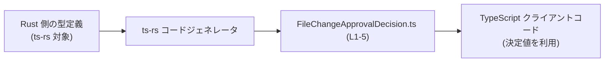
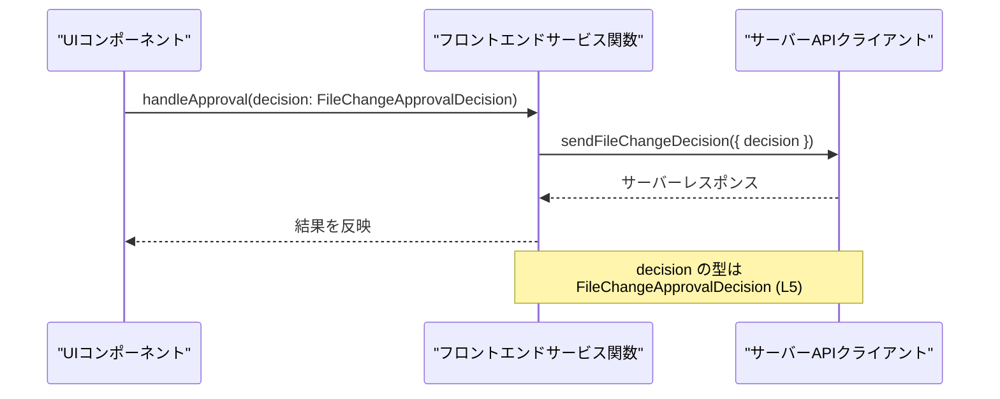

# app-server-protocol\schema\typescript\v2\FileChangeApprovalDecision.ts

## 0. ざっくり一言

- ファイル変更に対する承認・拒否などの「決定種別」を、4 つの文字列リテラルで表現する **TypeScript の型エイリアス**です  
  （`export type FileChangeApprovalDecision = "accept" | "acceptForSession" | "decline" | "cancel";`  
  `app-server-protocol\schema\typescript\v2\FileChangeApprovalDecision.ts:L5-5`）。

---

## 1. このモジュールの役割

### 1.1 概要

- このモジュールは、`FileChangeApprovalDecision` という **文字列リテラルのユニオン型**を 1 つ公開します  
  （`export type ...` の定義から判断  
  `app-server-protocol\schema\typescript\v2\FileChangeApprovalDecision.ts:L5-5`）。
- 型名と値の名前から、ファイルの変更操作に対して「受け入れる」「セッション中のみ受け入れる」「拒否する」「キャンセルする」といった決定を表す用途が想定されますが、このファイル単体から実際の使用箇所は分かりません。

### 1.2 アーキテクチャ内での位置づけ

- 先頭コメントにより、このファイルは Rust から TypeScript 型を生成するツール **ts-rs** によって自動生成されていることが分かります  
  （`// This file was generated by [ts-rs](...)`  
  `app-server-protocol\schema\typescript\v2\FileChangeApprovalDecision.ts:L3-3`）。
- ディレクトリパスに `schema\typescript\v2` とあることから、アプリケーションサーバー用プロトコルの「TypeScript スキーマ v2」の一部として利用されることが想定されますが、どのモジュールから参照されるかはこのチャンクには現れません。

生成の流れを示す概念図です（利用側は例示であり、このリポジトリに存在するとは限りません）。



### 1.3 設計上のポイント

- **自動生成コードであることの明示**  
  - 「手動で編集しないこと」がコメントで明示されています  
    （`// GENERATED CODE! DO NOT MODIFY BY HAND!` および ts-rs 生成コメント  
    `app-server-protocol\schema\typescript\v2\FileChangeApprovalDecision.ts:L1-3`）。
- **状態を持たない純粋な型定義**  
  - 実行時の処理や状態は一切持たず、コンパイル時の型チェックにのみ関わります  
    （関数やクラスが存在しないため  
    `app-server-protocol\schema\typescript\v2\FileChangeApprovalDecision.ts:L1-5`）。
- **文字列リテラルユニオンによる型安全性**  
  - `"accept" | "acceptForSession" | "decline" | "cancel"` 以外の文字列は、`FileChangeApprovalDecision` 型としてはコンパイルエラーになります  
    （ユニオン型定義からの推論  
    `app-server-protocol\schema\typescript\v2\FileChangeApprovalDecision.ts:L5-5`）。
- **ランタイム検証は行わない**  
  - TypeScript の型はコンパイル時のみ存在するため、実行時に外部から `string` が入ってくる場合は、別途バリデーションが必要です（一般的な TypeScript の性質）。

---

## 2. 主要な機能一覧

このファイルが提供する主要な要素は 1 つです。

- `FileChangeApprovalDecision` 型: ファイル変更に関する決定種別を、4 つの文字列リテラルで表現する型エイリアス  
  （`export type FileChangeApprovalDecision = ...`  
  `app-server-protocol\schema\typescript\v2\FileChangeApprovalDecision.ts:L5-5`）。

---

## 3. 公開 API と詳細解説

### 3.1 型一覧（構造体・列挙体など）

| 名前                         | 種別                            | 役割 / 用途                                                                                             | 定義位置                                                                                                    | 値のバリエーション                                                                                           |
|------------------------------|---------------------------------|----------------------------------------------------------------------------------------------------------|-------------------------------------------------------------------------------------------------------------|--------------------------------------------------------------------------------------------------------------|
| `FileChangeApprovalDecision` | 文字列リテラルのユニオン型<br>（型エイリアス） | ファイル変更に対する承認・拒否・キャンセルなどの「決定種別」を、4 種類の固定文字列で表現するための型 | `export type FileChangeApprovalDecision = "accept" \| "acceptForSession" \| "decline" \| "cancel";`<br>`app-server-protocol\schema\typescript\v2\FileChangeApprovalDecision.ts:L5-5` | `"accept"`, `"acceptForSession"`, `"decline"`, `"cancel"` （いずれか 1 つ） |

### 3.2 `FileChangeApprovalDecision` 型の詳細

#### 定義

```ts
export type FileChangeApprovalDecision = "accept" | "acceptForSession" | "decline" | "cancel";
```

（`app-server-protocol\schema\typescript\v2\FileChangeApprovalDecision.ts:L5-5`）

- TypeScript の「文字列リテラル型」のユニオンです。
- この型を使うと、コンパイル時に **決定値が上記 4 つ以外であればエラー** になります。

#### 値のバリエーション

| リテラル値            | 説明（名前から読み取れる意味）                                           |
|-----------------------|---------------------------------------------------------------------------|
| `"accept"`            | 変更を受け入れる決定であることを表すと解釈できます                     |
| `"acceptForSession"`  | 現在のセッションに限定して受け入れる決定を表すと解釈できます           |
| `"decline"`           | 変更を拒否する決定を表すと解釈できます                                 |
| `"cancel"`            | 進行中の承認プロセスをキャンセルする決定を表すと解釈できます           |

> これらの説明は文字列と型名からの読み取りであり、実際の意味・挙動は、この型を利用する他のコードからでないと確定できません。

#### TypeScript 型システム上の意味

- **型制約**  
  - 変数や関数パラメータを `FileChangeApprovalDecision` 型にすると、上記 4 つの文字列以外は代入できません。
- **型推論**  
  - `"accept"` のようなリテラルを直接代入する場合、型推論により `FileChangeApprovalDecision` に互換な型として扱われます。
- **分岐の安全性**  
  - `switch (decision)` のような分岐において、4 ケースをすべて列挙し、`never` を使ったチェックを入れることで、「将来値が追加されたときにコンパイルエラーで気付く」といったパターンも利用できます（例は後述）。

#### 内部処理の流れ

- この型は **別名定義のみ** であり、実行時の処理（アルゴリズム）は存在しません。
- JavaScript にコンパイルされると、型情報は消え、実行時には単なる `string` として扱われます。

#### Examples（使用例）

**例 1: 関数引数として利用する**

```typescript
// FileChangeApprovalDecision 型をインポートする（パスは利用側のプロジェクト構成に依存）
import type { FileChangeApprovalDecision } from "./FileChangeApprovalDecision"; // このファイルの型を参照する

// ファイル変更の決定を処理する関数の例
function handleFileChangeDecision(decision: FileChangeApprovalDecision) { // decision は 4 つのいずれかのみ許可される
    switch (decision) {                                                   // decision の値ごとに分岐する
        case "accept":                                                   // "accept" の場合
            console.log("変更を受け入れます");                            // 受け入れ処理
            break;
        case "acceptForSession":                                         // "acceptForSession" の場合
            console.log("このセッションの間だけ変更を受け入れます");      // セッション限定の受け入れ処理
            break;
        case "decline":                                                  // "decline" の場合
            console.log("変更を拒否します");                              // 拒否処理
            break;
        case "cancel":                                                   // "cancel" の場合
            console.log("承認プロセスをキャンセルします");                // キャンセル処理
            break;
    }
}
```

**例 2: オブジェクトのフィールドとして利用する**

```typescript
// FileChangeApprovalDecision 型の値を含むリクエスト型の例
interface FileChangeApprovalRequest {                                     // ファイル変更承認リクエストを表す型の例
    fileId: string;                                                       // 対象ファイル ID
    decision: FileChangeApprovalDecision;                                 // 承認の決定種別
}

// 実際のリクエストオブジェクトを作成する例
const request: FileChangeApprovalRequest = {                              // 型に一致するオブジェクトを作成
    fileId: "file-123",                                                   // 任意のファイル ID
    decision: "acceptForSession",                                         // 4 つのリテラルのうち 1 つ
};
```

#### コンパイル時エラー（Errors 相当）

- 次のようなコードは **コンパイルエラー** になります。

```typescript
import type { FileChangeApprovalDecision } from "./FileChangeApprovalDecision";

const badDecision: FileChangeApprovalDecision = "approve"; // ❌ エラー: "approve" は許可されていない値
```

- TypeScript コンパイラは、`"approve"` が `FileChangeApprovalDecision` 型のユニオン `"accept" | "acceptForSession" | "decline" | "cancel"` に含まれないため、型エラーとして検出します。
- これはコンパイル時のエラーであり、**実行時の例外（ランタイムエラー）ではありません**。

#### Edge cases（エッジケース）

- **外部入力が `string` として渡ってくる場合**  
  - 例: JSON パース結果や URL パラメータをそのまま利用すると、型としては `string` になるため、`FileChangeApprovalDecision` への代入時に型アサーションや変換処理が必要です。
- **`as any` / `as unknown as FileChangeApprovalDecision` などの乱用**  
  - `any` や強引な型アサーションを使うと、コンパイラのチェックを回避してしまい、`"foo"` のような不正な値も通ってしまいます。
- **将来的な値の追加**  
  - Rust 側の定義が変更され ts-rs により文字列が増えた場合、`switch` 文がすべてのケースを明示的に処理していないと、未処理の値が発生する可能性があります。

#### 使用上の注意点

- **ランタイム検証が必要な場所**  
  - ネットワーク越しやユーザー入力など、「信頼できないデータ源」から値を受け取る場合は、実行時に `"accept" | "acceptForSession" | "decline" | "cancel"` のいずれかかをチェックする必要があります。
- **`any` の利用を避ける**  
  - `any` 経由で値を受け渡しすると、せっかくの型安全性が失われやすくなります。
- **自動生成コードの直接編集を避ける**  
  - コメントにある通り、ファイルは ts-rs によって生成されており、手動編集は再生成時に上書きされます  
    （`// GENERATED CODE! DO NOT MODIFY BY HAND!`  
    `app-server-protocol\schema\typescript\v2\FileChangeApprovalDecision.ts:L1-1`）。
- **並行性（コンカレンシー）について**  
  - この型は単なる文字列型であり、共有・並行アクセスに関する特別な制御はありません。JavaScript/TypeScript の標準的な文字列と同様に、安全に共有できます。

### 3.3 その他の関数

- このファイルには関数・メソッド・クラス定義は存在しません  
  （`export type` 以外のトップレベル定義が無いことから  
  `app-server-protocol\schema\typescript\v2\FileChangeApprovalDecision.ts:L1-5`）。

---

## 4. データフロー

このファイル自体は型定義のみですが、`FileChangeApprovalDecision` がどのように流通しうるかの「典型的な利用シナリオ」を示します（あくまで一例であり、このリポジトリにこのままのコードがあるわけではありません）。

1. UI コンポーネントがユーザーの選択から `FileChangeApprovalDecision` 型の値を作る。
2. フロントエンドのサービス層の関数が、その値を引数として受け取る。
3. API クライアントがサーバーに決定値を送信する。



- 型 `FileChangeApprovalDecision` が、アプリケーション内の複数コンポーネント間で **共通のプロトコル値** として利用されるイメージです。

---

## 5. 使い方（How to Use）

### 5.1 基本的な使用方法

**決定値を受け取り、処理を分岐する関数の例**

```typescript
// 自動生成された型をインポートする（相対パスはプロジェクト構成に応じて調整する）
import type { FileChangeApprovalDecision } from "./FileChangeApprovalDecision"; // このファイルの型を参照

// FileChangeApprovalDecision を受け取って処理を行う関数
function processDecision(decision: FileChangeApprovalDecision) {               // decision は 4 つのリテラル値だけ許可
    switch (decision) {                                                        // decision の値ごとに分岐
        case "accept":                                                         // "accept" の場合
            // 変更を完全に受け入れる処理を行う
            break;
        case "acceptForSession":                                               // "acceptForSession" の場合
            // 現在のセッションのみで有効な受け入れ処理を行う
            break;
        case "decline":                                                        // "decline" の場合
            // 変更を拒否する処理を行う
            break;
        case "cancel":                                                         // "cancel" の場合
            // 操作自体をキャンセルする処理を行う
            break;
    }
}

// 間違った値を代入するとコンパイルエラーになる例
// const invalid: FileChangeApprovalDecision = "approved";                     // ❌ エラー: 許可されたリテラルではない
const valid: FileChangeApprovalDecision = "accept";                            // ✅ OK: 許可されたリテラルの 1 つ
processDecision(valid);                                                        // 関数に安全に渡せる
```

### 5.2 よくある使用パターン

1. **API パラメータとして使う**

```typescript
import type { FileChangeApprovalDecision } from "./FileChangeApprovalDecision";

// サーバーに送信するペイロード型の例
interface ApproveFilePayload {                                                 // 承認リクエストのペイロードを表す例
    fileId: string;                                                            // ファイルを識別する ID
    decision: FileChangeApprovalDecision;                                      // 承認の決定種別
}

async function approveFile(payload: ApproveFilePayload): Promise<void> {       // 承認リクエストを送る関数の例
    await fetch("/api/files/approve", {                                        // 任意のエンドポイントへのリクエスト
        method: "POST",                                                        // HTTP メソッド
        headers: { "Content-Type": "application/json" },                       // JSON を送るためのヘッダー
        body: JSON.stringify(payload),                                         // payload を JSON にシリアライズ
    });
}
```

1. **状態管理（Redux/ Zustand など）の state フィールドとして使う**

```typescript
import type { FileChangeApprovalDecision } from "./FileChangeApprovalDecision";

interface FileChangeState {                                                    // ファイル変更に関する状態の例
    pendingDecision: FileChangeApprovalDecision | null;                        // まだ確定していない場合は null を許容
}

const initialState: FileChangeState = {                                        // 初期状態
    pendingDecision: null,                                                     // 最初は決定がない
};
```

1. **判定ロジックでの exhaustiveness チェックに利用**

```typescript
import type { FileChangeApprovalDecision } from "./FileChangeApprovalDecision";

function assertNever(x: never): never {                                        // すべてのケースが処理されたことを保証するヘルパー
    throw new Error("Unexpected value: " + x);                                 // 予期しない値が来た場合にエラーを投げる
}

function handleDecisionWithCheck(decision: FileChangeApprovalDecision) {       // 決定値を処理する関数
    switch (decision) {                                                        // decision の値ごとに分岐
        case "accept":
        case "acceptForSession":
        case "decline":
        case "cancel":
            // それぞれの処理を書く（ここでは省略）
            break;
        default:
            assertNever(decision);                                             // 将来値が追加されたときにコンパイルエラーにできる
    }
}
```

### 5.3 よくある間違い

**誤り例 1: 型を `string` にしてしまい、型安全性を失う**

```typescript
// ❌ よくない例: string をそのまま使ってしまう
function bad(decision: string) {                                               // どんな文字列でも許可してしまう
    if (decision === "accept") {                                              // 一部の値だけを手動で判定
        // ...
    }
    // その他の値は見落とされる可能性がある
}
```

**正しい例**

```typescript
// ✅ 良い例: FileChangeApprovalDecision を使う
import type { FileChangeApprovalDecision } from "./FileChangeApprovalDecision";

function good(decision: FileChangeApprovalDecision) {                          // 4 つの許可された値に限定
    // decision の値はコンパイル時に保証される
}
```

**誤り例 2: `any` や強引な型アサーションでチェックを回避する**

```typescript
// ❌ よくない例: any を経由して型チェックを回避してしまう
const raw: any = "something-else";                                            // any にすると何でも入る
const decision = raw as FileChangeApprovalDecision;                           // as で強引に変換（実際は無効な値かもしれない）
```

- このようなコードは、コンパイルは通りますが、実行時に不正な値が流入する原因になります。

### 5.4 使用上の注意点（まとめ）

- このファイルは **自動生成** であり、コメントに明示されている通り手動編集は推奨されません  
  （`app-server-protocol\schema\typescript\v2\FileChangeApprovalDecision.ts:L1-3`）。
- `FileChangeApprovalDecision` は **コンパイル時の型制約のみ** を提供します。外部からの `string` 入力には、ランタイムでの検証ロジックを別途用意する必要があります。
- `any` や無理な型アサーションを使うと、この型が提供する安全性が失われます。
- データ競合やロックなどの並行性の懸念はありません。単なる文字列型なので、他の `string` と同じ扱いで問題ありません。
- パフォーマンス上のコストはほぼありません。実行時には追加のオブジェクトや関数呼び出しを伴わず、ただの文字列として扱われます。

---

## 6. 変更の仕方（How to Modify）

### 6.1 新しい決定種別を追加する場合

- ファイル先頭のコメントから、このファイルは **ts-rs による自動生成** であることが分かります  
  （`This file was generated by [ts-rs]...`  
  `app-server-protocol\schema\typescript\v2\FileChangeApprovalDecision.ts:L3-3`）。
- そのため、新しい値（例: `"acceptWithReview"` など）を追加したい場合、**この TypeScript ファイルを直接編集するのではなく**:
  1. Rust 側の元の型定義（おそらく `enum FileChangeApprovalDecision { ... }` のようなもの）に値を追加する。
  2. ts-rs によるコード生成プロセスを再実行し、このファイルを再生成する。
- Rust 側のファイルパスや具体的な型定義は、このチャンクには現れないため不明です。

### 6.2 既存の決定種別を変更・削除する場合

- `"accept"`, `"acceptForSession"`, `"decline"`, `"cancel"` のいずれかを変更・削除すると、`FileChangeApprovalDecision` を使用しているすべての TypeScript コードにコンパイルエラーが発生します（これは設計上望ましい挙動です）。
- 手順としては、新規追加の場合と同様に:
  - Rust 側の定義を変更
  - ts-rs による生成を再実行
- 変更後は、次の点を確認する必要があります。
  - すべての `switch` / `if` 分岐で新しい値・変更された値が適切に処理されているか。
  - サーバーとの通信プロトコル（JSON など）で、古い文字列を送受信している箇所が残っていないか。
- このチャンクにはテストコードが含まれていないため、変更時には別途存在するテスト（もしあれば）や利用箇所を検索して確認する必要があります。

---

## 7. 関連ファイル

このチャンクにはインポートや他ファイルへの参照が存在しないため、直接の関連ファイルは特定できません。

| パス                                         | 役割 / 関係                                                                                     |
|----------------------------------------------|--------------------------------------------------------------------------------------------------|
| （不明）Rust 側の元型定義ファイル           | ts-rs によってこの TypeScript 型へ変換される元の Rust 型定義。コメントから存在が推測されますが、パスは本チャンクからは分かりません。 |
| （不明）TypeScript クライアントコード一式   | `FileChangeApprovalDecision` をインポートして使用するコード群（API クライアント、UI ロジックなど）。このチャンクには現れません。      |

> 具体的なファイルパスやモジュール名は、このファイル単体からは判断できないため、「不明」としています。
