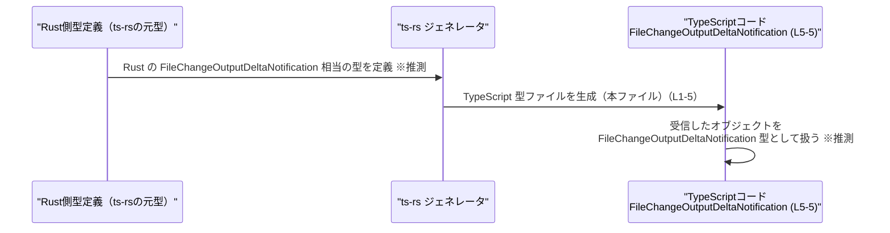

# app-server-protocol/schema/typescript/v2/FileChangeOutputDeltaNotification.ts

## 0. ざっくり一言

- アプリケーションサーバープロトコルにおける、`FileChangeOutputDeltaNotification` という通知メッセージの「ペイロード構造」を表す TypeScript の型エイリアスを 1 つだけ定義しているファイルです（`FileChangeOutputDeltaNotification.ts:L5-5`）。
- このファイルは `ts-rs` によって自動生成されており、手動で編集しないことが明示されています（`FileChangeOutputDeltaNotification.ts:L1-3`）。

---

## 1. このモジュールの役割

### 1.1 概要

- このモジュールは、`FileChangeOutputDeltaNotification` という名前の通知メッセージの形（プロパティと型）を TypeScript 上で表現するために存在します（`FileChangeOutputDeltaNotification.ts:L5-5`）。
- 型は以下の 4 つの文字列プロパティを持つオブジェクトとして定義されています（`threadId`, `turnId`, `itemId`, `delta`）（`FileChangeOutputDeltaNotification.ts:L5-5`）。
- ファイル冒頭のコメントから、Rust から TypeScript 型を自動生成するツールである `ts-rs` によって生成されていることが分かります（`FileChangeOutputDeltaNotification.ts:L1-3`）。

### 1.2 アーキテクチャ内での位置づけ

ファイルパス `app-server-protocol/schema/typescript/v2` から、この型は「アプリケーションサーバープロトコルの v2 スキーマ」の一部として扱われていることが読み取れます（パス情報からの解釈）。

以下は、この型の概念的な位置づけを示す簡易な依存関係図です。


- ノード B が本ファイル内の実体 (`export type ...`) を表します（`FileChangeOutputDeltaNotification.ts:L5-5`）。
- A, C は設計レベルの概念であり、このチャンクには具体的なコードは現れません。

### 1.3 設計上のポイント

コードから直接読み取れる設計上の特徴は次のとおりです。

- **自動生成コードであること**  
  - 冒頭コメントで明示的に「GENERATED CODE」「Do not edit this file manually」と書かれています（`FileChangeOutputDeltaNotification.ts:L1-3`）。
- **1 つの平坦なオブジェクト型のみを定義**  
  - `export type FileChangeOutputDeltaNotification = { ... };` の 1 行のみが型定義です（`FileChangeOutputDeltaNotification.ts:L5-5`）。
- **すべてのプロパティが必須の `string` 型**  
  - `threadId`, `turnId`, `itemId`, `delta` の 4 つすべてに `: string` が付いており、`?` が付いていないためオプショナルではありません（`FileChangeOutputDeltaNotification.ts:L5-5`）。
- **状態やメソッドを持たない純粋なデータコンテナ**  
  - 関数やクラスは一切定義されておらず、ランタイムの状態や振る舞いは持ちません（このチャンクには関数定義が現れません）。

---

## 2. 主要な機能一覧

このファイルは実行時の「機能」ではなく「データ構造」を 1 つだけ提供します。

- `FileChangeOutputDeltaNotification`:  
  ファイル変更出力に関する通知メッセージのペイロード構造を、4 つの文字列プロパティ（`threadId`, `turnId`, `itemId`, `delta`）で表現する型エイリアスです（`FileChangeOutputDeltaNotification.ts:L5-5`）。

---

## 3. 公開 API と詳細解説

### 3.1 型一覧（コンポーネントインベントリー）

#### 型インベントリー

| 名前 | 種別 | 役割 / 用途 | 根拠 |
|------|------|-------------|------|
| `FileChangeOutputDeltaNotification` | 型エイリアス（オブジェクト型） | 通知メッセージのペイロード形状を表現するための TypeScript 型。スキーマ定義として利用されることが想定されます。 | `FileChangeOutputDeltaNotification.ts:L5-5` |

> 備考: 「スキーマとして利用」という点は、ファイルパス（`schema/typescript/v2`）と型名からの解釈であり、このチャンクのコードだけでは用途は断定できません。

#### フィールド一覧

`FileChangeOutputDeltaNotification` の各フィールドの仕様です（`FileChangeOutputDeltaNotification.ts:L5-5`）。

| フィールド名 | 型 | 必須/任意 | 説明（コードと命名からの解釈） | 根拠 |
|--------------|----|-----------|---------------------------------|------|
| `threadId`   | `string` | 必須 | 通知対象となる「スレッド」を識別する ID と解釈できますが、意味はコード上では定義されていません。 | `FileChangeOutputDeltaNotification.ts:L5-5` |
| `turnId`     | `string` | 必須 | （対話の）「ターン」またはステップを識別する ID と解釈できますが、詳細はコードからは不明です。 | `FileChangeOutputDeltaNotification.ts:L5-5` |
| `itemId`     | `string` | 必須 | スレッド内の個別アイテム（メッセージ、ファイル、タスクなど）を識別する ID と解釈できますが、用途は明示されていません。 | `FileChangeOutputDeltaNotification.ts:L5-5` |
| `delta`      | `string` | 必須 | 変更内容の「差分」を表す文字列と考えられますが、形式（プレーンテキストか JSON かなど）はコードからは読み取れません。 | `FileChangeOutputDeltaNotification.ts:L5-5` |

> 「〜と解釈できます」は命名からの推測であり、このチャンクには仕様コメントやドキュメントは存在しません。

#### TypeScript 特有の性質

- `export type ...` は**型エイリアス**であり、コンパイル後の JavaScript には出現しません。  
  → ランタイムにオーバーヘッドはありません（TypeScript の一般仕様に基づく説明）。
- 4 つのプロパティはすべて必須なので、TypeScript コードからこの型でオブジェクトリテラルを作成するときに、いずれかを省略するとコンパイルエラーになります（`FileChangeOutputDeltaNotification.ts:L5-5`）。

### 3.2 関数詳細

- このファイルには関数・メソッド・クラスコンストラクタなどの実行可能な API は定義されていません（このチャンク内に `function` や `class` 宣言が存在しません）。

そのため、「関数詳細テンプレート」を適用できる対象はありません。

### 3.3 その他の関数

- 補助関数やユーティリティ関数も一切定義されていません（このチャンクには現れません）。

---

## 4. データフロー

このファイルは型定義のみで実際の送受信処理は含まれませんが、`ts-rs` による自動生成コメントやファイルパスから、一般的には次のようなデータフローが想定されます。

1. Rust 側の構造体（`ts-rs` のソース）が定義される。  
2. `ts-rs` がその定義から本ファイルの TypeScript 型を生成する（`FileChangeOutputDeltaNotification.ts:L1-3`）。
3. ランタイムでは、（たとえば JSON などで）`threadId`, `turnId`, `itemId`, `delta` の 4 フィールドを持つオブジェクトが送受信され、TypeScript 側でこの型として扱われる。

> 1,3 の具体的な実装（Rust 側の型名、シリアライズ方式、通信方式など）はこのチャンクには現れず、`ts-rs` の一般的な利用方法と命名からの推測です。

### シーケンス図（概念図）



- この図のうち、実際に本チャンクで確認できるのは「G が T を生成している」という情報（自動生成コメント）と、T 内の型定義のみです（`FileChangeOutputDeltaNotification.ts:L1-5`）。
- R 側のコードやシリアライズ処理は、このファイルからは存在を確認できません。

---

## 5. 使い方（How to Use）

ここからは、この型を**利用する側の TypeScript コード例**です。いずれも「このリポジトリ内に存在する」とは限らない、あくまで利用パターンの例です。

### 5.1 基本的な使用方法

#### 例: 受信した通知オブジェクトを安全に扱う

```typescript
// FileChangeOutputDeltaNotification.ts から型をインポートする例
import type { FileChangeOutputDeltaNotification } from "./FileChangeOutputDeltaNotification"; // パスは利用側の構成に依存

// 通知を処理する関数
function handleFileChangeDelta(
    notification: FileChangeOutputDeltaNotification, // 型をそのまま引数に使う
): void {
    // threadId / turnId / itemId / delta に型安全にアクセスできる
    console.log("thread:", notification.threadId);
    console.log("turn:", notification.turnId);
    console.log("item:", notification.itemId);
    console.log("delta:", notification.delta);
}

// （例）外部から JSON 文字列として受信した場合
const payload = '{ "threadId": "t1", "turnId": "1", "itemId": "it1", "delta": "added text" }';

// 一般的には、実行時バリデーションが必要です（ここでは簡略化のため直接 parse）
const parsed = JSON.parse(payload) as FileChangeOutputDeltaNotification; // 型アサーションによりコンパイル時に型付け

handleFileChangeDelta(parsed);
```

ポイント:

- 関数や変数の型注釈に `FileChangeOutputDeltaNotification` を使うことで、4 つのプロパティに対する補完や型チェックが効きます（`FileChangeOutputDeltaNotification.ts:L5-5`）。
- 実行時には型情報は存在しないため、`JSON.parse` の結果が本当にこの形をしているかどうかは別途バリデーションを行う必要があります（TypeScript の一般的な注意点）。

### 5.2 よくある使用パターン

#### パターン 1: 通知メッセージを生成して送信する

```typescript
import type { FileChangeOutputDeltaNotification } from "./FileChangeOutputDeltaNotification";

function buildDeltaNotification(): FileChangeOutputDeltaNotification {
    // オブジェクトリテラルで作成する際、プロパティを欠かすとコンパイルエラーになる
    return {
        threadId: "thread-123",
        turnId: "turn-2",
        itemId: "item-001",
        delta: "append: more text",
    };
}

// （例）WebSocket などで送信するコード（送信部分はあくまで一例）
const notification = buildDeltaNotification();
const json = JSON.stringify(notification);
// socket.send(json); // 実際の送信処理
```

- すべて `string` 型であるため、ID を別の型（number など）で扱っている場合は適宜変換が必要です（`FileChangeOutputDeltaNotification.ts:L5-5`）。

### 5.3 よくある間違い

#### 間違い例 1: 必須プロパティを省略する

```typescript
import type { FileChangeOutputDeltaNotification } from "./FileChangeOutputDeltaNotification";

// コンパイルエラーになる例
const badNotification: FileChangeOutputDeltaNotification = {
    threadId: "thread-123",
    // turnId がない → エラー
    itemId: "item-001",
    delta: "append: more text",
};
```

- `turnId` を省略すると、TypeScript の型チェックによりエラーになります（`FileChangeOutputDeltaNotification.ts:L5-5`）。

#### 間違い例 2: 型の不一致

```typescript
import type { FileChangeOutputDeltaNotification } from "./FileChangeOutputDeltaNotification";

// コンパイルエラーになる例
const badNotification2: FileChangeOutputDeltaNotification = {
    threadId: 123,          // number を渡している → string ではない
    turnId: "1",
    itemId: "item-001",
    delta: "append: more text",
};
```

- プロパティはいずれも `string` 型として定義されているため、別の型（`number` など）を代入するとコンパイルエラーになります（`FileChangeOutputDeltaNotification.ts:L5-5`）。

### 5.4 使用上の注意点（まとめ）

- **すべてのプロパティは必須**  
  - `threadId`, `turnId`, `itemId`, `delta` を省略するとコンパイルエラーになります（`FileChangeOutputDeltaNotification.ts:L5-5`）。
- **実行時のバリデーションは別途必要**  
  - この型は TypeScript のコンパイル時にのみ効力を持ち、ランタイムで不正なオブジェクト（プロパティ欠落や型不一致）を自動検出する仕組みは含まれていません。
- **自動生成コードのため手動編集禁止**  
  - 冒頭コメントにあるとおり、「Do not edit this file manually」と明記されているため、仕様変更は元となる定義（一般的には Rust 側の型）を変更し、`ts-rs` で再生成するのが前提です（`FileChangeOutputDeltaNotification.ts:L1-3`）。
- **エラー・並行性に関するロジックは含まれない**  
  - このファイルにはエラーハンドリングや並行処理に関するコードは一切なく、それらは利用側コードで扱う必要があります（このチャンクには関数や非同期処理が現れません）。

---

## 6. 変更の仕方（How to Modify）

### 6.1 新しい機能を追加する場合

このファイルは `ts-rs` により自動生成されているため、型にフィールドを追加したい場合でも**このファイルを直接編集するべきではない**ことがコメントで明示されています（`FileChangeOutputDeltaNotification.ts:L1-3`）。

一般的な手順（`ts-rs` の通常の利用形態に基づく説明）:

1. `ts-rs` の元となる型定義（通常は Rust の構造体）を変更し、新しいフィールドなどを追加する。
2. `ts-rs` のコード生成処理を再実行して、TypeScript 側のファイル（本ファイル）を再生成する。
3. TypeScript コード側で、新しいフィールドを利用するように更新する。

> このリポジトリ内の具体的な Rust ファイルやビルドスクリプトは、このチャンクからは確認できません。

### 6.2 既存の機能を変更する場合

`threadId`, `turnId`, `itemId`, `delta` のいずれかの意味や型を変更したい場合も、基本方針は同じです。

- **影響範囲の確認**  
  - この型を参照している TypeScript コード（インポート元）を検索し、どのように使われているかを確認する必要があります。このファイル単体からは使用箇所は分かりません。
- **契約（前提条件）の維持**  
  - 4 つのプロパティが必須である、という契約を変更する（オプショナルにするなど）場合、受信側・送信側の双方でロジック変更が必要になります。
- **生成元の型定義を変更する**  
  - 前述のとおり、このファイルではなく `ts-rs` の元型を変更し、再生成することが推奨されます（`FileChangeOutputDeltaNotification.ts:L1-3`）。

---

## 7. 関連ファイル

このチャンクには他ファイルへの import/export 記述や、関連ファイルを特定できるコードは存在しません（`FileChangeOutputDeltaNotification.ts:L1-5`）。

| パス | 役割 / 関係 |
|------|------------|
| （不明） | このモジュールと直接の関係があるファイル（例えば、同じ `schema/typescript/v2` ディレクトリ内の他の型定義や、Rust 側の元定義など）は、このチャンクからは特定できません。 |

---

## 付記: 契約・エッジケース・安全性・テスト・性能に関する要点

このファイルは型定義のみですが、利用時に関係する観点を簡潔にまとめます。

- **契約（Contracts）**  
  - 4 つのプロパティは必須の `string` 型であり、これに従わないオブジェクトを `FileChangeOutputDeltaNotification` として扱うと、型の契約に反します（`FileChangeOutputDeltaNotification.ts:L5-5`）。
- **エッジケース**  
  - 各フィールドは空文字列 `""` であっても `string` としては有効です。空文字を許容するかどうかはビジネスロジック側の判断に委ねられ、このファイルからは分かりません。
- **バグ / セキュリティ上の注意**  
  - 実行時バリデーションなしに外部入力を `FileChangeOutputDeltaNotification` として扱うと、不正なデータに基づく処理（DoS や誤動作）につながる可能性があります。  
  - プロトコルの両端（送信側 / 受信側）でこの型定義のバージョンがずれると、`delta` の解釈不一致などのバグの原因になります。
- **テスト**  
  - このファイルにはテストコードは含まれていません。この型を利用するロジックのテストは別ファイルで実装する必要があります。
- **性能 / スケーラビリティ**  
  - 型エイリアスはコンパイル時のみ存在し、ランタイムのオーバーヘッドはありません（TypeScript の仕様に基づく）。  
  - 実際の性能は、この型を通して扱うデータ量やシリアライズ方式に依存し、このファイルからは評価できません。
