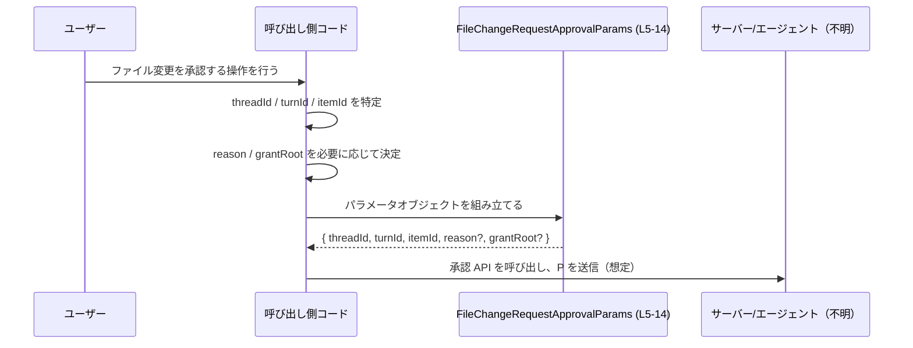

# app-server-protocol/schema/typescript/v2/FileChangeRequestApprovalParams.ts

## 0. ざっくり一言

- ファイル変更リクエストをユーザーが承認する際に使われるパラメータを表す、TypeScript のオブジェクト型エイリアスです（`export type`）。  
  根拠: 自動生成コメントと型定義本体  
  `FileChangeRequestApprovalParams.ts:L1-3, L5-14`
- Rust から `ts-rs` によって自動生成されたコードであり、このファイル自体は手で編集しない前提になっています。  
  根拠: 自動生成に関するコメント  
  `FileChangeRequestApprovalParams.ts:L1-3`

---

## 1. このモジュールの役割

### 1.1 概要

- このモジュールは、「ファイル変更リクエストの承認」に必要となる識別情報と、オプションの追加情報（説明・書き込みルートの許可）をまとめて表現するための **データ型（TypeScript 型エイリアス）** を提供します。  
  根拠: `FileChangeRequestApprovalParams` のプロパティ構造とコメント  
  `FileChangeRequestApprovalParams.ts:L5-14`

### 1.2 アーキテクチャ内での位置づけ

- ディレクトリパス `app-server-protocol/schema/typescript/v2` から、この型は **アプリケーションサーバーのプロトコル v2 における TypeScript スキーマ定義の一部** と考えられます（パス名からの推測であり、コードだけでは断定できません）。
- このファイルには他モジュールの `import` は存在せず、`export type` のみが定義されています。したがって **依存先はなく、この型自体が外部から参照される側の「公開データ構造」** になっています。  
  根拠: import 文が存在しないこと  
  `FileChangeRequestApprovalParams.ts:L1-14`

概念的な依存関係（利用イメージ）は次のように表現できます。


> この図は「この型が他のコードから参照される」という一般的な利用イメージを示したものであり、具体的な呼び出し元モジュールはこのチャンクのコードからは分かりません。

### 1.3 設計上のポイント

- **自動生成コードであること**  
  - 冒頭コメントに「GENERATED CODE」「Do not edit this file manually」と明記されています。  
    根拠: `FileChangeRequestApprovalParams.ts:L1-3`  
  - 変更は元になっている Rust 側の定義や `ts-rs` の設定を修正して再生成する想定です（元定義の場所はこのチャンクには現れません）。
- **純粋なデータ構造**  
  - 関数やクラスは一切定義されておらず、プリミティブ型（`string`）のみをフィールドに持つシリアライズしやすいオブジェクト型です。  
    根拠: `export type ... = { ... }` のみで構成  
    `FileChangeRequestApprovalParams.ts:L5-14`
- **オプション情報の表現方法**  
  - `reason` / `grantRoot` は「プロパティ自体がオプション」かつ、値が `string | null` のユニオン型です。  
    根拠: `reason?: string | null`, `grantRoot?: string | null`  
    `FileChangeRequestApprovalParams.ts:L9, L14`  
  - これにより、  
    - プロパティが存在しない（`undefined` 相当）  
    - プロパティは存在するが `null`  
    - プロパティは存在し `string` 値を持つ  
    の 3 状態を区別できる設計になっています。
- **セキュリティ関連の意味合いを持つフィールド**  
  - `grantRoot` のコメントに「allow writes under this root for the remainder of the session」とあり、「セッション中の書き込み許可範囲（ルート）」に関するフラグ的な意味を持つことが明示されています。  
    根拠: `grantRoot` のコメント  
    `FileChangeRequestApprovalParams.ts:L10-13`

---

## 2. 主要な機能一覧

このファイルは関数ではなく **型定義のみ** を提供しますが、実質的な「機能」として次を挙げられます。

- `FileChangeRequestApprovalParams`:  
  ファイル変更リクエスト承認に関する識別情報（`threadId`, `turnId`, `itemId`）と、オプションの説明 (`reason`)・書き込みルート要求 (`grantRoot`) をまとめたパラメータ型。  
  根拠: `FileChangeRequestApprovalParams` 定義と各プロパティ  
  `FileChangeRequestApprovalParams.ts:L5-14`

---

## 3. 公開 API と詳細解説

### 3.1 型一覧（構造体・列挙体など）

#### 型インベントリ

| 名前 | 種別 | 役割 / 用途 | 定義位置（根拠） |
|------|------|-------------|------------------|
| `FileChangeRequestApprovalParams` | 型エイリアス（オブジェクト型） | ファイル変更リクエスト承認に必要な ID とオプション情報をまとめるデータ構造 | `FileChangeRequestApprovalParams.ts:L5-14` |

#### プロパティ一覧

| フィールド名 | 型 | 必須/任意 | 説明 | 定義位置（根拠） |
|--------------|----|-----------|------|------------------|
| `threadId` | `string` | 必須 | 会話スレッドの識別子と解釈できる ID。コード上は単なる文字列として扱われます。 | `FileChangeRequestApprovalParams.ts:L5` |
| `turnId` | `string` | 必須 | スレッド内のある「ターン」（発話やステップ）の識別子と解釈できる ID。コード上は文字列です。 | `FileChangeRequestApprovalParams.ts:L5` |
| `itemId` | `string` | 必須 | 対象となる「アイテム」（ファイル変更リクエストなど）の識別子と解釈できる ID。コード上は文字列です。 | `FileChangeRequestApprovalParams.ts:L5` |
| `reason` | `string \| null` （プロパティ自体はオプション） | 任意 | 追加の説明文。コメントに「Optional explanatory reason (e.g. request for extra write access).」とあり、たとえば追加の書き込み権限を求める理由などを格納する想定です。 | `FileChangeRequestApprovalParams.ts:L6-9` |
| `grantRoot` | `string \| null` （プロパティ自体はオプション） | 任意 | `[UNSTABLE]` と注記されたフィールド。設定されている場合、エージェントが「このルート配下への書き込みをセッション中許可してほしい」とユーザーに求めることを表すと説明されています（実際に尊重されているかどうかはコメント上「unclear」とされています）。 | `FileChangeRequestApprovalParams.ts:L10-14` |

> `threadId` / `turnId` / `itemId` の意味づけ（スレッド・ターン・アイテム）は名前からの解釈であり、このチャンクのコード自体には説明コメントは存在しません。

### 3.2 関数詳細（最大 7 件）

- このファイルには **関数定義が一つも存在しません**。  
  根拠: `export type` のみで構成されていること  
  `FileChangeRequestApprovalParams.ts:L5-14`

そのため、関数用テンプレートに従った詳細解説は該当しません。

### 3.3 その他の関数

- 該当なし（補助関数・ラッパー関数なども定義されていません）。  
  根拠: 関数宣言・関数式・メソッド定義が存在しない  
  `FileChangeRequestApprovalParams.ts:L1-14`

---

## 4. データフロー

このファイル自身には処理ロジックはありませんが、`FileChangeRequestApprovalParams` がどのように利用されるかの **想定シナリオ** を示します。

1. あるファイル変更リクエストに対し、ユーザーが承認操作を行う。
2. 呼び出し側コードが、そのリクエストを一意に識別するための `threadId`, `turnId`, `itemId` を取得する。
3. 必要に応じて、説明 (`reason`) や書き込みルート許可要求 (`grantRoot`) を設定し、`FileChangeRequestApprovalParams` 型のオブジェクトを組み立てる。
4. 組み立てたオブジェクトを、サーバーやエージェントに対する API 呼び出しのペイロードとして送信する。

> なお、実際にどの関数・エンドポイントに渡されるかは、このチャンクのコードからは分かりません。



---

## 5. 使い方（How to Use）

### 5.1 基本的な使用方法

`FileChangeRequestApprovalParams` を使って承認パラメータを組み立てる基本例です。  
（インポートパスはプロジェクト構成によって異なるため、ここでは例示的な相対パスにしています。）

```typescript
// FileChangeRequestApprovalParams 型をインポートする                        // 型定義ファイルから型を読み込む
// 実際のパスはプロジェクト構成に合わせて変更する必要があります。          // ここでは ./FileChangeRequestApprovalParams と仮定
import type { FileChangeRequestApprovalParams } from "./FileChangeRequestApprovalParams";

// ユーザーが承認したファイル変更に対応する ID 群                         // 承認対象のスレッド/ターン/アイテムを特定
const threadId = "thread-123";                                             // スレッド ID（例）
const turnId   = "turn-001";                                               // ターン ID（例）
const itemId   = "item-42";                                                // アイテム ID（例）

// TypeScript の型チェック付きでパラメータを構築する                      // FileChangeRequestApprovalParams 型を指定
const params: FileChangeRequestApprovalParams = {                          // params はこの型に準拠したオブジェクトになる
    threadId,                                                              // 必須: string
    turnId,                                                                // 必須: string
    itemId,                                                                // 必須: string
    reason: "Need to update project configuration files.",                 // 任意: string | null（ここでは string）
    grantRoot: "/workspace/project",                                       // 任意: string | null（ここでは string）
};

// 以降、API クライアントなどに params を渡して送信するイメージ           // 実際の送信処理はこのファイルには定義されていない
// sendApproval(params);                                                   // 仮の関数呼び出し例
```

ポイント:

- TypeScript の型アノテーションにより、`threadId` など必須プロパティの **漏れや型ミスがコンパイル時に検出** されます。
- `reason` / `grantRoot` は **指定しても・しなくてもよい** プロパティです。ただし、値を指定する場合は `string` か `null` に限られます。

### 5.2 よくある使用パターン

#### 1. 最小限の必須情報だけを送る

`reason` / `grantRoot` を使わない、最小構成の例です。

```typescript
import type { FileChangeRequestApprovalParams } from "./FileChangeRequestApprovalParams";

// 必須フィールドのみで承認する                                         // オプション情報は付けない
const params: FileChangeRequestApprovalParams = {
    threadId: "thread-123",                                              // 必須
    turnId: "turn-001",                                                  // 必須
    itemId: "item-42",                                                   // 必須
    // reason, grantRoot は省略                                           //?: のため未指定でも型エラーにならない
};
```

#### 2. `null` を明示して「値はないが意図的である」状態を表現する

```typescript
import type { FileChangeRequestApprovalParams } from "./FileChangeRequestApprovalParams";

const params: FileChangeRequestApprovalParams = {
    threadId: "thread-123",
    turnId: "turn-001",
    itemId: "item-42",
    reason: null,                                                        // プロパティは存在するが値は null
    grantRoot: null,                                                     // 同上
};
```

- `reason` を完全に省略する場合と、`reason: null` を設定する場合は型的にはどちらも許容されますが、  
  「クライアントが明示的に『理由はない』と伝えたい」のか「そもそもフィールドを気にしていない」のか、といった意味的な違いを表現できます。

### 5.3 よくある間違い

#### 1. 必須フィールドの欠落

```typescript
import type { FileChangeRequestApprovalParams } from "./FileChangeRequestApprovalParams";

// ❌ 間違い例: itemId が抜けている                                     // 必須フィールドを省略している例
const badParams: FileChangeRequestApprovalParams = {
    threadId: "thread-123",
    turnId: "turn-001",
    // itemId: "item-42",                                                // これがないとコンパイルエラー
};
```

- TypeScript では `itemId` は必須プロパティのため、欠落するとコンパイルエラーになります。  
  根拠: `itemId: string` に `?` が付いていない  
  `FileChangeRequestApprovalParams.ts:L5`

#### 2. 型不一致（string 以外を渡す）

```typescript
import type { FileChangeRequestApprovalParams } from "./FileChangeRequestApprovalParams";

// ❌ 間違い例: grantRoot に string 以外を入れている                   // 型エラーの例
const badParams2: FileChangeRequestApprovalParams = {
    threadId: "thread-123",
    turnId: "turn-001",
    itemId: "item-42",
    // grantRoot: { path: "/workspace" },                               // オブジェクトは string | null に代入できない
    grantRoot: "/workspace",                                             // ✅ 正しい例
};
```

- `grantRoot` は `string | null` なので、オブジェクトや数値などを入れると型チェックで弾かれます。  
  根拠: `grantRoot?: string | null`  
  `FileChangeRequestApprovalParams.ts:L14`

### 5.4 使用上の注意点（まとめ）

**型安全性・エラー関連**

- このファイルは **コンパイル時の型チェック** のための型定義だけを提供し、**ランタイムでのバリデーションは行いません**。  
  - そのため、外部から受け取った任意の JSON をそのまま `FileChangeRequestApprovalParams` として扱う場合は、別途ランタイムチェック（型ガードやスキーマバリデーション）が必要になります。
- `reason?: string | null` / `grantRoot?: string | null` により、次の 3 状態を区別できます。  
  - プロパティが存在しない（`params.reason === undefined`）  
  - プロパティが存在し `null` である  
  - プロパティが存在し `string` 値を持つ  
  これらを正しく区別したい場合、呼び出し側コードで `in` 演算子や `typeof` チェックを行う必要があります。

**並行性・非同期性**

- この型自体は単なるデータ構造であり、Promise やコールバック、スレッド/ワーカーなど **並行性・非同期処理に関する要素は含みません**。
- 並行リクエスト処理などでこの型を使う場合も、「複数の非同期処理でこのオブジェクトを共有・変更するかどうか」は、利用側のロジックに依存します（このファイルからは分かりません）。

**セキュリティ上の意味合い**

- `grantRoot` はコメント上、「このルート配下への書き込み許可」を意味するフィールドです（`[UNSTABLE]` と明記）。  
  根拠: `grantRoot` のコメント  
  `FileChangeRequestApprovalParams.ts:L10-13`
  - 実際にどのように解釈・検証されるか、どの程度信頼してよいかは、この型の利用側（サーバー/エージェント）の実装に依存し、このチャンクからは分かりません。
  - 特に UI やクライアント側でこの値を構築する場合、ユーザーに提示する文言や選択肢と `grantRoot` の内容がずれないよう注意が必要です。

**テスト・性能・可観測性（このファイルの範囲での所見）**

- テストコード: このファイル内にはテストコードは含まれていません。型を利用する側のテストは、別ファイルに存在するかどうか不明です。  
  根拠: テストらしき記述の欠如  
  `FileChangeRequestApprovalParams.ts:L1-14`
- 性能・スケーラビリティ: 単なる小さなオブジェクト型であり、パフォーマンス上の懸念点は特に見当たりません。
- ロギングやトレースなどの可観測性に関するコードも一切含まれないため、これらは利用側（API 呼び出しやサーバー実装）で行う必要があります。

---

## 6. 変更の仕方（How to Modify）

このファイルは自動生成コードであり、冒頭のコメントに **「DO NOT MODIFY BY HAND」** と明記されています。  
根拠: `FileChangeRequestApprovalParams.ts:L1-3`

### 6.1 新しい機能を追加する場合

- このファイルを直接編集するのではなく、**元となる Rust 側の型定義（ts-rs が参照する構造体・型）** を変更し、`ts-rs` によって TypeScript コードを再生成する必要があります。
  - Rust 側の具体的なファイルパスや型名は、このチャンクには現れないため不明です。
- たとえば「承認者のユーザー ID を追加したい」などの要件がある場合:
  1. Rust の構造体に新しいフィールドを追加する（仮に `approver_id: String` など）。
  2. `ts-rs` を実行して TypeScript コードを再生成する。
  3. 生成された `FileChangeRequestApprovalParams.ts` に新フィールドが追加されていることを確認する。

### 6.2 既存の機能を変更する場合

- 同様に、TypeScript 側を直接書き換えるのではなく **元定義の変更 → 再生成** の流れを取る必要があります。
- 変更時の注意点:
  - フィールド名を変更すると、**この型を参照しているすべての TypeScript コードが影響を受けます**。  
    影響範囲はこのチャンクだけからは分かりませんが、IDE の参照検索や型チェッカーを用いて洗い出す必要があります。
  - `reason` / `grantRoot` のようなオプションフィールドの必須化・型変更は、既存クライアントとの互換性（互換性破壊変更）につながる可能性があります。
  - `grantRoot` には `[UNSTABLE]` とコメントされているため、このフィールドに関する仕様変更はもともと流動的であることが示唆されていますが、変更してよいかどうかはプロジェクトのポリシーに従う必要があります。  
    根拠: `[UNSTABLE]` コメント  
    `FileChangeRequestApprovalParams.ts:L10`

---

## 7. 関連ファイル

このチャンクから直接参照できるのはファイルパスのみですが、関連しうるファイル/ディレクトリをまとめます。

| パス / 区分 | 役割 / 関係 |
|-------------|------------|
| `app-server-protocol/schema/typescript/v2/` ディレクトリ | `FileChangeRequestApprovalParams.ts` が配置されているディレクトリです。パス名から、同じ v2 プロトコル用の他の TypeScript スキーマ定義ファイルが存在すると推測されますが、このチャンクには具体的なファイル名は現れません。 |
| Rust 側の ts-rs 対応構造体（パス不明） | 冒頭コメントから、この TypeScript 型は Rust コードから `ts-rs` により生成されていることが分かります。ただし、どの Rust ファイル・型が元になっているかはこのチャンクからは分かりません。根拠: `This file was generated by [ts-rs]` コメント (`FileChangeRequestApprovalParams.ts:L3`) |
| この型を利用する API 実装 / クライアントコード（不明） | `FileChangeRequestApprovalParams` を引数・ペイロードとして使うコードは、このファイルには現れません。実際の利用箇所は別のモジュールに存在すると考えられますが、具体的な場所は不明です。 |

以上が、このファイルに基づいて客観的に説明できる範囲の解説になります。
