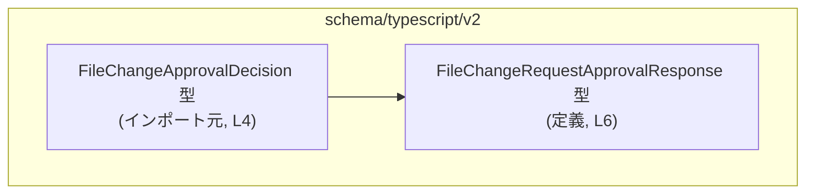
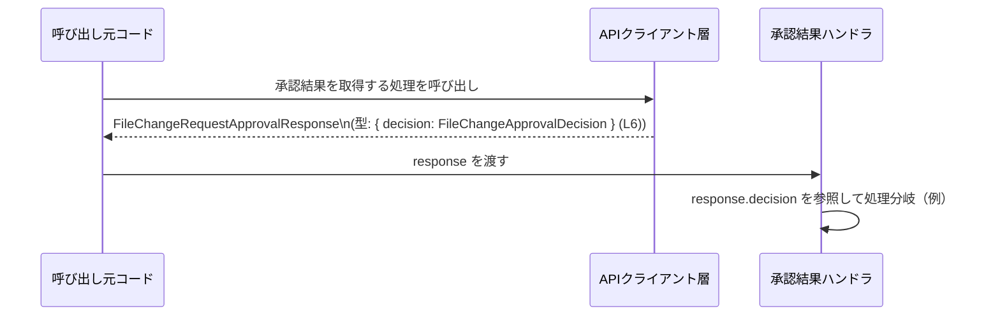

# app-server-protocol/schema/typescript/v2/FileChangeRequestApprovalResponse.ts コード解説

## 0. ざっくり一言

- ファイル変更リクエストに対する承認結果を表す **レスポンスオブジェクトの型** を 1 つだけ定義する、自動生成 TypeScript ファイルです（`FileChangeRequestApprovalResponse.ts:L1-3,6`）。

---

## 1. このモジュールの役割

### 1.1 概要

- このモジュールは、`FileChangeRequestApprovalResponse` という TypeScript 型エイリアス（型の別名）を定義します（`FileChangeRequestApprovalResponse.ts:L6`）。
- そのオブジェクトは必ず `decision` フィールドを持ち、その型は別ファイルで定義された `FileChangeApprovalDecision` です（`FileChangeRequestApprovalResponse.ts:L4,6`）。
- ファイル先頭のコメントから、このファイルは `ts-rs` によって自動生成されていることが分かります（`FileChangeRequestApprovalResponse.ts:L1-3`）。

### 1.2 アーキテクチャ内での位置づけ

- このファイル自体は **型定義のみ** を提供し、実際の処理ロジックや API 呼び出しは含みません（`FileChangeRequestApprovalResponse.ts:L1-6`）。
- `FileChangeApprovalDecision` 型をインポートして、それをフィールドとして持つレスポンス型を定義しているため、**スキーマ定義層**（プロトコル／API のデータ形状を表す層）に属すると解釈できます（`FileChangeRequestApprovalResponse.ts:L4-6`）。

依存関係の概要を Mermaid で示します（ノード名にこのファイル内の行番号を併記しています）。



### 1.3 設計上のポイント

- **自動生成コード**  
  - 先頭コメントで「GENERATED CODE」「Do not edit this file manually」と明示されており（`FileChangeRequestApprovalResponse.ts:L1-3`）、手動編集は想定されていません。
- **型専用インポート**  
  - `import type { FileChangeApprovalDecision } from "./FileChangeApprovalDecision";` のように `import type` が使われており（`FileChangeRequestApprovalResponse.ts:L4`）、実行時にはこのインポートが消える、**型専用依存** であることが分かります。  
  - これにより、バンドルサイズや実行時依存関係に影響を与えずに型だけを利用できます。
- **シンプルなオブジェクト型**  
  - レスポンスは `{ decision: FileChangeApprovalDecision }` という 1 フィールドだけのオブジェクトに固定されています（`FileChangeRequestApprovalResponse.ts:L6`）。
- **エラー・並行性について**  
  - このファイルには関数や実行時コードが存在せず（`FileChangeRequestApprovalResponse.ts:L1-6`）、**エラーハンドリングや並行処理は一切扱いません**。  
  - 型チェックはコンパイル時（TypeScript の型検査時）のみで行われ、実行時のバリデーションは含まれていません。

---

## 2. 主要な機能一覧

このモジュールが提供する機能は、型定義 1 つに集約されています。

- `FileChangeRequestApprovalResponse` 型:  
  `decision` フィールドに `FileChangeApprovalDecision` 型の値を持つレスポンスオブジェクトの構造を表します（`FileChangeRequestApprovalResponse.ts:L4,6`）。

---

## 3. 公開 API と詳細解説

### 3.1 型一覧（構造体・列挙体など）

このファイルに登場する主要な型のインベントリーです。

| 名前 | 種別 | 定義/参照位置 | 役割 / 用途 |
|------|------|---------------|-------------|
| `FileChangeRequestApprovalResponse` | 型エイリアス（オブジェクト型） | `FileChangeRequestApprovalResponse.ts:L6` | `decision: FileChangeApprovalDecision` というフィールドを持つレスポンスオブジェクトの型。ファイル変更リクエストの承認結果を返す際のコンテナとして使われることが想定されます。 |
| `FileChangeApprovalDecision` | 型（詳細不明、外部定義） | インポートのみ: `FileChangeRequestApprovalResponse.ts:L4` | 承認か否かなど、ファイル変更リクエストに対する「決定」を表す型。具体的な中身はこのチャンクには現れません。 |

#### `FileChangeRequestApprovalResponse` 型の詳細

```ts
// FileChangeRequestApprovalResponse.ts:L4,6
import type { FileChangeApprovalDecision } from "./FileChangeApprovalDecision";

export type FileChangeRequestApprovalResponse = { 
    decision: FileChangeApprovalDecision, 
};
```

- **構造**
  - 必須フィールド:
    - `decision`: 型は `FileChangeApprovalDecision`（`FileChangeRequestApprovalResponse.ts:L4,6`）。
  - オプショナル（`?`）なフィールドはありません（`FileChangeRequestApprovalResponse.ts:L6`）。
  - インデックスシグネチャ（`[key: string]: ...` のような任意フィールド）は定義されていません（`FileChangeRequestApprovalResponse.ts:L6`）。

- **言語仕様上のポイント**
  - `export type ... = { ... }` なので、**型エイリアス** です（`FileChangeRequestApprovalResponse.ts:L6`）。  
    - これは TypeScript のコンパイル時にのみ存在し、JavaScript 出力には現れません。
  - `import type` により、`FileChangeApprovalDecision` は実行時には参照されません（`FileChangeRequestApprovalResponse.ts:L4`）。

- **型レベルの契約（Contract）**
  - この型を引数や戻り値に使う関数では、「**少なくとも `decision` フィールドを持つオブジェクトを扱う**」という契約になります。
  - `decision` フィールドの具体的な値の制約は `FileChangeApprovalDecision` 型に依存しますが、その中身はこのチャンクには現れません（`FileChangeRequestApprovalResponse.ts:L4`）。

### 3.2 関数詳細（最大 7 件）

- このファイルには **関数定義が存在しません**（`FileChangeRequestApprovalResponse.ts:L1-6`）。
  - `function` キーワードやアロー関数（`=>`）による関数定義は見られず、型とインポートコメントのみで構成されています。

そのため、このセクションで説明すべき公開関数はありません。

### 3.3 その他の関数

- 補助関数やユーティリティ関数も存在しません（`FileChangeRequestApprovalResponse.ts:L1-6`）。

---

## 4. データフロー

このファイルには実行時コードが含まれないため、**型レベルのデータフロー** を、想定される利用例として説明します。  
以下はあくまで「この型をどう使えるか」という例であり、このリポジトリに実在するコードを示すものではありません。

### 型を介したデータの流れ（例）

- ステップ概要:
  1. 何らかの API クライアントが、サーバーからレスポンスを取得し、それを `FileChangeRequestApprovalResponse` 型として扱う。
  2. 呼び出し元コードは `response.decision` を参照して、承認されたかどうかなどを判断する。
  3. その判断に基づき、後続の処理（ログ出力・UI 更新など）を行う。

これをシーケンス図として表現します（`FileChangeRequestApprovalResponse` 型は `L6` に定義）。



### 実用的なコード例（データフローを含む）

```ts
// この例は利用イメージであり、このリポジトリ内に存在するとは限りません。

import type { 
    FileChangeRequestApprovalResponse 
} from "./FileChangeRequestApprovalResponse";

// FileChangeRequestApprovalResponse を返す仮の API クライアント関数
async function fetchApprovalResponse(): Promise<FileChangeRequestApprovalResponse> {
    // 実際には fetch などでサーバーから JSON を取得してパースする想定
    const json = await fetch("/api/file-change/approval").then(r => r.json());

    // ここで json の形が { decision: ... } であることは TypeScript では保証されないため、
    // 実際には実行時の検証が必要になります（このファイルには含まれません）。
    return json as FileChangeRequestApprovalResponse;
}

// レスポンスを使う側のコード
async function handleApproval() {
    const response = await fetchApprovalResponse();   // 型: FileChangeRequestApprovalResponse
    // decision フィールドにアクセスできる
    const decision = response.decision;

    console.log("approval decision:", decision);
}
```

- この例では、`response.decision` にアクセスできることが **コンパイル時に保証** されますが、  
  `json` が正しい形かどうかは実行時検証が別途必要です。  
  このファイルにはその検証ロジックは含まれていません（`FileChangeRequestApprovalResponse.ts:L1-6`）。

---

## 5. 使い方（How to Use）

### 5.1 基本的な使用方法

この型を引数や戻り値の注釈に使う典型的なパターンです。

```ts
import type { 
    FileChangeRequestApprovalResponse 
} from "./FileChangeRequestApprovalResponse";

// 承認レスポンスを受け取って処理する関数の例
function processApprovalResponse(
    response: FileChangeRequestApprovalResponse, // 型注釈で契約を明示
): void {
    // decision フィールドにアクセスできる
    const decision = response.decision;

    // ここで decision の型は FileChangeApprovalDecision になっているので、
    // IDE での補完やコンパイル時チェックが効く
    console.log("Decision:", decision);
}
```

- **ポイント**
  - `response` を `FileChangeRequestApprovalResponse` 型として受け取ることで、  
    `response.decision` が必須であること、型が `FileChangeApprovalDecision` であることがコンパイル時に保証されます（`FileChangeRequestApprovalResponse.ts:L6`）。
  - JavaScript にコンパイルすると、この型情報は消えるため、実行時には別途 JSON バリデーション等が必要になる場合があります。

### 5.2 よくある使用パターン

1. **API クライアントの戻り値型として使う**

```ts
import type { FileChangeRequestApprovalResponse } from "./FileChangeRequestApprovalResponse";

async function approveFileChange(
    // ...何らかの入力...
): Promise<FileChangeRequestApprovalResponse> {
    const json = await fetch("/api/...").then(r => r.json());
    return json as FileChangeRequestApprovalResponse;
}
```

- 戻り値を `Promise<FileChangeRequestApprovalResponse>` にすることで、呼び出し側は `response.decision` に安全にアクセスできます。

1. **ビジネスロジック層の引数として使う**

```ts
import type { FileChangeRequestApprovalResponse } from "./FileChangeRequestApprovalResponse";

function handleDecision(
    response: FileChangeRequestApprovalResponse,
) {
    // この関数内では response.decision が必ず存在するとみなせる
    doSomethingWith(response.decision);
}

function doSomethingWith(decision: unknown) {
    // decision の具体的な型情報が必要であれば、
    // FileChangeApprovalDecision を直接使う設計にするのが自然です。
}
```

### 5.3 よくある間違い

#### 1. `decision` フィールドを省略したオブジェクトを代入する

```ts
import type { FileChangeRequestApprovalResponse } from "./FileChangeRequestApprovalResponse";

const wrongResponse: FileChangeRequestApprovalResponse = {
    // decision フィールドがない
    // コンパイルエラーになる
};
```

- `decision` は必須フィールドであり、オプショナル（`?`）ではありません（`FileChangeRequestApprovalResponse.ts:L6`）。

#### 2. `decision` に別の型を代入する

```ts
import type { FileChangeRequestApprovalResponse } from "./FileChangeRequestApprovalResponse";

const wrongResponse2: FileChangeRequestApprovalResponse = {
    // decision: "approved", // ← FileChangeApprovalDecision が string でなければコンパイルエラー
    // decision の許容値は FileChangeApprovalDecision 型に依存し、このチャンクからは分かりません。
};
```

- `decision` に代入できる値の範囲は `FileChangeApprovalDecision` の定義に依存しますが、その中身はこのファイルからは読み取れません（`FileChangeRequestApprovalResponse.ts:L4`）。

### 5.4 使用上の注意点（まとめ）

- **自動生成ファイルを直接編集しない**
  - ファイル先頭で「Do not modify by hand」「Do not edit this file manually」と明示されています（`FileChangeRequestApprovalResponse.ts:L1-3`）。
  - 変更が必要な場合は、`ts-rs` の生成元となる定義側を変更し、再生成する必要があります。
- **実行時バリデーションの欠如**
  - このファイルは型定義のみで、実行時の検証コードを含みません（`FileChangeRequestApprovalResponse.ts:L1-6`）。
  - 外部から受け取る JSON などをこの型にアサートする場合、実行時に形状をチェックしないと、ランタイムエラーや型の不整合につながる可能性があります。
- **並行性・スレッド安全性**
  - 実行時の状態や共有ミュータブルデータを持たない純粋な型定義なので、このファイル自体には並行性やスレッド安全性に関する懸念点はありません（`FileChangeRequestApprovalResponse.ts:L1-6`）。
- **セキュリティ上の観点（一般論）**
  - クライアント側でこの型を信頼しすぎると、サーバーからの予期せぬデータが来た場合に対応できないことがあります。
  - セキュリティ的には、外部入力に対しては実行時バリデーションを行った上で、この型にマッピングすることが推奨されます（このファイルにはそのロジックは含まれません）。

---

## 6. 変更の仕方（How to Modify）

### 6.1 新しい機能を追加する場合

- このファイルは自動生成であり、直接編集は推奨されていません（`FileChangeRequestApprovalResponse.ts:L1-3`）。
- 新しいフィールド（例: `requestId` など）を `FileChangeRequestApprovalResponse` に追加したい場合は、以下の流れになります。
  1. `ts-rs` が参照する **生成元の型定義**（このファイルのコメントから、別の場所に存在することが分かります）を変更する。
  2. `ts-rs` を再実行して TypeScript ファイルを再生成する。
  3. 生成された `FileChangeRequestApprovalResponse.ts` に、追加したフィールドが反映されていることを確認する。

> 生成元の具体的なファイルパスや言語（Rust など）は、このチャンクからは分かりませんが、  
> 「ts-rs によって生成されている」というコメントから、別のソース定義が存在することだけは分かります（`FileChangeRequestApprovalResponse.ts:L3`）。

### 6.2 既存の機能を変更する場合

- **`decision` フィールドの型や名前を変更したい場合**
  - 直接このファイルを編集するのではなく、生成元定義を変更し、`ts-rs` で再生成する必要があります（`FileChangeRequestApprovalResponse.ts:L1-3`）。
- 変更時に注意すべき点:
  - この型を使用しているすべての箇所（関数の引数・戻り値・変数宣言など）に影響します。
  - 特に `decision` の型を変更すると、`FileChangeApprovalDecision` 型を直接参照している箇所にも影響が出る可能性がありますが、その利用状況はこのチャンクには現れません。
- 契約（Contract）の維持:
  - `decision` が必須フィールドであるという前提を変える（オプショナルにする、削除するなど）場合は、  
    その前提に依存するすべてのコードの見直しが必要です。

---

## 7. 関連ファイル

このモジュールと直接関係しているファイル・モジュールを一覧にします。

| パス | 役割 / 関係 |
|------|------------|
| `./FileChangeApprovalDecision` | `FileChangeApprovalDecision` 型をエクスポートしている TypeScript モジュールです。このファイルでは `import type { FileChangeApprovalDecision } from "./FileChangeApprovalDecision";` により参照されています（`FileChangeRequestApprovalResponse.ts:L4`）。具体的な定義内容はこのチャンクには現れません。 |
| （生成元定義ファイル） | コメントにより `ts-rs` によって自動生成されていることだけが分かります（`FileChangeRequestApprovalResponse.ts:L1-3`）。どのファイルから生成されているか、どの言語で書かれているかなどの詳細は、このチャンクからは不明です。 |

---

### コンポーネントインベントリー（まとめ）

最後に、このチャンク内に実際に現れるコンポーネントを一覧で再掲します（行番号付き）。

| コンポーネント | 種別 | 位置 | 説明 |
|----------------|------|------|------|
| 自動生成コード注意コメント | コメント | `FileChangeRequestApprovalResponse.ts:L1-3` | このファイルが `ts-rs` による自動生成コードであり、手動編集すべきでないことを示します。 |
| `FileChangeApprovalDecision` | 型（外部） | `FileChangeRequestApprovalResponse.ts:L4` | 承認の決定を表す型。`import type` により型情報のみが参照されます。 |
| `FileChangeRequestApprovalResponse` | 型エイリアス（オブジェクト型） | `FileChangeRequestApprovalResponse.ts:L6` | `decision: FileChangeApprovalDecision` フィールドを持つレスポンスオブジェクトの型です。 |

このファイルには関数・クラス・列挙体・実行時コードは存在しません（`FileChangeRequestApprovalResponse.ts:L1-6`）。
