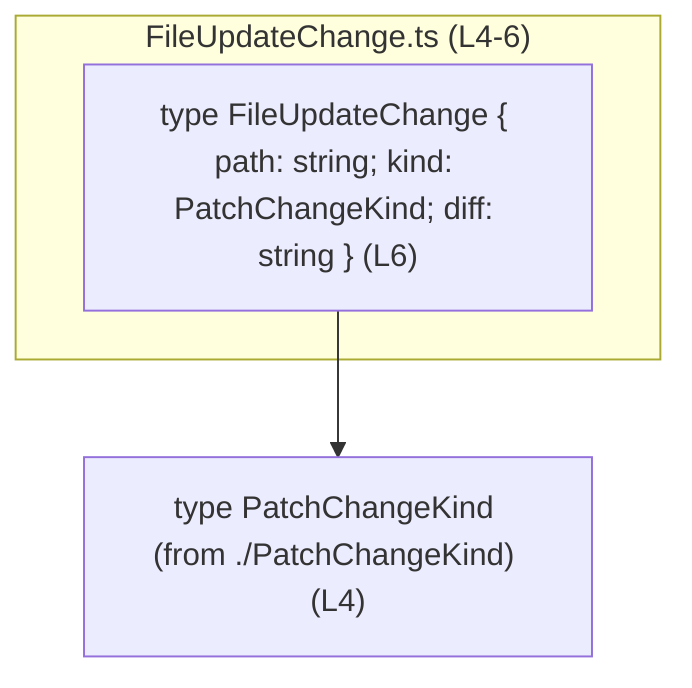
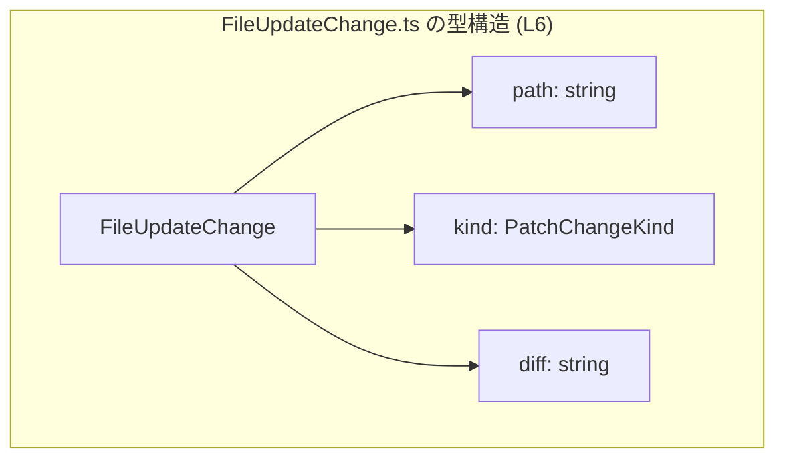
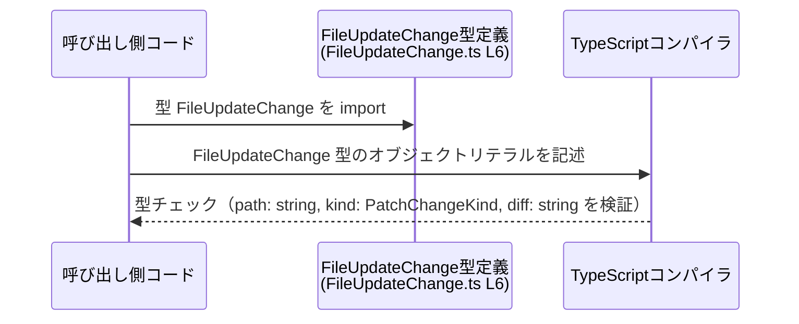

# app-server-protocol/schema/typescript/v2/FileUpdateChange.ts

## 0. ざっくり一言

- `FileUpdateChange` という、ファイル更新を表すオブジェクト型を定義した **自動生成の TypeScript 型定義ファイル** です（FileUpdateChange.ts:L1-3, L6）。

---

## 1. このモジュールの役割

### 1.1 概要

- このモジュールは、`FileUpdateChange` という型エイリアス（type alias）をエクスポートし、  
  `path`（文字列）, `kind`（`PatchChangeKind` 型）, `diff`（文字列）の 3 要素を 1 つのオブジェクトとして扱うための共通の「形」を定義しています（FileUpdateChange.ts:L4, L6）。
- ファイル先頭のコメントから、このファイルは [`ts-rs`](https://github.com/Aleph-Alpha/ts-rs) によって自動生成されており、手動編集は想定されていないことが分かります（FileUpdateChange.ts:L1, L3）。

### 1.2 アーキテクチャ内での位置づけ

- パス `app-server-protocol/schema/typescript/v2` から、アプリケーションサーバ間通信の **プロトコルスキーマ（v2）に属する TypeScript 型定義群** の 1 つと位置づけられます（パス名からの解釈であり、利用箇所はこのチャンクには現れません）。
- `FileUpdateChange` 型は、同じディレクトリにある `./PatchChangeKind` から型をインポートして依存しています（FileUpdateChange.ts:L4）。

Mermaid による簡易依存関係図（このファイル内に限った関係）です。



### 1.3 設計上のポイント

- **自動生成コード**  
  - 先頭コメントで「GENERATED CODE」「Do not edit this file manually」と明示されています（FileUpdateChange.ts:L1, L3）。  
    設計変更は、この TypeScript ファイルではなく元になった定義（おそらく Rust 側の型）で行う前提です。
- **型専用インポート**  
  - `import type { PatchChangeKind } from "./PatchChangeKind";` により、`PatchChangeKind` は **型としてのみ** インポートされます（FileUpdateChange.ts:L4）。  
    これはコンパイル後の JavaScript には import を出力しないため、ランタイム依存を増やさずに型情報だけを利用できます。
- **単純なオブジェクト型エイリアス**  
  - `export type FileUpdateChange = { ... };` という形式で、クラスや関数ではなく **プレーンなオブジェクト形状** を定義しています（FileUpdateChange.ts:L6）。
- **エラー処理・並行性のロジックは無し**  
  - このファイルには関数や実行時コードが存在せず（FileUpdateChange.ts:L1-6）、エラー処理・非同期処理・並行処理に関わるロジックは含まれていません。  
    そのため、安全性や並行性に関する性質は「型による静的チェック」に限定されます。

---

## 2. 主要な機能一覧

このファイルは 1 つの公開型のみを提供します。

- `FileUpdateChange` 型:  
  - `path: string`, `kind: PatchChangeKind`, `diff: string` を持つオブジェクトの形を定義します（FileUpdateChange.ts:L6）。  
  - ファイル更新に関する 3 種類の情報をまとめて扱うためのコンテナとして利用されることが想定されます（名前からの解釈であり、実際の利用箇所はこのチャンクには現れません）。

---

## 3. 公開 API と詳細解説

### 3.1 型一覧（構造体・列挙体など）

| 名前               | 種別                | 役割 / 用途                                                                                          | 定義 / 参照行                         |
|--------------------|---------------------|-------------------------------------------------------------------------------------------------------|---------------------------------------|
| `FileUpdateChange` | 型エイリアス（オブジェクト型） | `path`, `kind`, `diff` の 3 フィールドをまとめるデータ構造。ファイル更新の 1 件分を表す形と解釈できます。 | 定義: FileUpdateChange.ts:L6         |
| `PatchChangeKind`  | 型（外部定義）      | `kind` プロパティの型として利用される外部型。具体的な中身はこのチャンクからは分かりません。            | 型インポート: FileUpdateChange.ts:L4 |

#### `FileUpdateChange` のフィールド

`FileUpdateChange` は次の 3 フィールドを持つオブジェクト型です（FileUpdateChange.ts:L6）。

| フィールド名 | 型               | 説明（コードから分かる範囲）                                                                 |
|--------------|------------------|----------------------------------------------------------------------------------------------|
| `path`       | `string`         | 文字列で表現されたパス。ファイルパスを表すと解釈できますが、フォーマットの詳細は不明です。  |
| `kind`       | `PatchChangeKind`| 変更の種別などを表すと想定される型。実際のバリアントや値は `./PatchChangeKind` 側で定義。 |
| `diff`       | `string`         | 差分を表す文字列。パッチフォーマット（例: unified diff など）はこのチャンクからは分かりません。 |

> **型安全性に関するポイント**  
>
> - TypeScript の静的型チェックにより、`FileUpdateChange` 型として扱うオブジェクトは、少なくとも `path`, `kind`, `diff` の 3 つが指定の型で存在する必要があります。  
> - 一方で、TypeScript の構造的型システムのため、追加のプロパティを持つオブジェクトも `FileUpdateChange` として受け入れられることが多い点に注意が必要です。

### 3.2 関数詳細（最大 7 件）

- このファイルには **関数・メソッドは定義されていません**（FileUpdateChange.ts:L1-6）。  
  そのため、関数のアルゴリズム、エラー条件、パニック条件などはこのチャンクからは読み取れません。

### 3.3 その他の関数

- 補助関数・ラッパー関数を含め、**関数定義は存在しません**（FileUpdateChange.ts:L1-6）。

---

## 4. データフロー

このファイル自体には値を生成・変換するロジックがないため、  
ここでは「`FileUpdateChange` 型内部の依存関係」と「一般的な利用イメージ」を示します。

### 4.1 型内部のデータ依存関係



- `FileUpdateChange` のインスタンスが 1 つ作られるとき、内部的には
  - 文字列の `path`
  - `PatchChangeKind` 型の `kind`
  - 文字列の `diff`
  の 3 つの値がセットで扱われることになります（FileUpdateChange.ts:L6）。

### 4.2 一般的な利用シーケンス（概念図）

以下は、「どこかのコードが `FileUpdateChange` 型を利用する」一般的なシーケンスの例です。  
**このリポジトリ内の具体的な呼び出し元は、このチャンクからは分かりません**。



- このシーケンスは、「型定義のみのファイル」が **コンパイル時の型チェックにのみ関与する** ことを表しています。

---

## 5. 使い方（How to Use）

### 5.1 基本的な使用方法

`FileUpdateChange` 型を別ファイルからインポートして、オブジェクトの型注釈に使う例です。  
`PatchChangeKind` の具体的な値はこのチャンクから分からないため、`declare` でプレースホルダ変数を用いています。

```typescript
// FileUpdateChange 型と PatchChangeKind 型をインポートする
import type { FileUpdateChange } from "./FileUpdateChange";   // 自動生成された型定義
import type { PatchChangeKind } from "./PatchChangeKind";     // kind プロパティの型

// ここでは PatchChangeKind 型の値をどこかから受け取ることを想定して宣言だけ行う
declare const patchKind: PatchChangeKind;                     // 実際の値の定義は別のモジュール側

// FileUpdateChange 型に適合するオブジェクトを作成する
const change: FileUpdateChange = {                            // FileUpdateChange 型として注釈
    path: "/path/to/file.txt",                                // path: string
    kind: patchKind,                                          // kind: PatchChangeKind
    diff: "@@ -1,3 +1,3 @@\n- old line\n+ new line\n",       // diff: string（パッチ文字列など）
};

// change は FileUpdateChange 型として扱える
console.log(change.path);                                     // string 型として補完・型チェックされる
```

- このように、`FileUpdateChange` は「ファイル更新の 1 件分」を表すデータコンテナとして利用できます（名前とフィールド構成からの解釈）。

### 5.2 よくある使用パターン

1. **関数の引数として使う**

```typescript
import type { FileUpdateChange } from "./FileUpdateChange";

// FileUpdateChange を受け取って処理する関数のイメージ
function applyFileUpdate(change: FileUpdateChange) {          // 引数に型注釈
    // change.path / change.kind / change.diff を使って処理する
    // 実装内容はこのチャンクからは不明だが、型により最低限の形は保証される
}
```

1. **API レスポンスやメッセージの型として使う**

```typescript
import type { FileUpdateChange } from "./FileUpdateChange";

interface FileUpdateMessage {                                 // メッセージの例
    update: FileUpdateChange;                                 // 更新内容を 1 件含む
    timestamp: string;                                        // 送信時刻など
}
```

### 5.3 よくある間違い

`kind` の型を無視して適当な文字列を入れてしまう例です。  
`PatchChangeKind` の実体は分かりませんが、少なくとも `string` とは限らないため、次のようなコードはコンパイルエラーになる可能性があります。

```typescript
import type { FileUpdateChange } from "./FileUpdateChange";

// 間違い例（イメージ）: kind に string を直接入れてしまう
const badChange: FileUpdateChange = {
    path: "/path/to/file.txt",
    // kind: "modified", // PatchChangeKind が string 型とは限らないためエラーになる可能性
    // ↑ 実際のエラー内容は PatchChangeKind の定義に依存し、このチャンクからは不明
    kind: undefined as any,                                   // any を使うと型チェックを回避してしまう
    diff: "diff text",
};
```

- `any` を使うと TypeScript の型安全性が失われるため、`PatchChangeKind` の実体に合わせた値を使うことが望ましいです（TypeScript 全般の注意点）。

### 5.4 使用上の注意点（まとめ）

- **自動生成ファイルであること**  
  - 直接編集すると、再生成時に上書きされる可能性が高いです（FileUpdateChange.ts:L1, L3）。
- **型のみで実行時チェックは行われないこと**  
  - `FileUpdateChange` はコンパイル時の型チェックにのみ関与し、実行時に `path` や `diff` のフォーマットを検証するわけではありません。入力バリデーションは利用側で行う必要があります。
- **構造的型システムによる暗黙の互換性**  
  - 他の型と「フィールド構成が同じ」であれば、`FileUpdateChange` と互換とみなされる場合があります。  
    これは柔軟さをもたらす一方で、意図しない代入を許してしまうこともあるため注意が必要です。
- **並行性・パフォーマンスへの影響**  
  - 本ファイルは型定義のみであり、ランタイムコードを生成しないため、並行処理やパフォーマンスへの直接的な影響はありません（`import type` の利用を含む、FileUpdateChange.ts:L4, L6）。

---

## 6. 変更の仕方（How to Modify）

### 6.1 新しい機能を追加する場合

このファイルは `ts-rs` による自動生成コードです（FileUpdateChange.ts:L1, L3）。  
**直接編集するのではなく、元になっている定義（おそらく Rust 側の型）を変更する必要がある**、という前提になります。

一般的な変更手順のイメージは次のとおりです（ts-rs の利用パターンに基づく一般論です）。

1. **Rust 側の型定義を特定する**  
   - `FileUpdateChange` に対応する Rust 構造体などを探します。  
     関連ファイルはこのチャンクからは特定できないため、プロジェクト全体の検索が必要です。
2. **Rust 側の型にフィールドを追加・変更する**  
   - 例: `FileUpdateChange` に `author: String` フィールドを追加したい場合、Rust 側の struct にフィールドを追加します。
3. **ts-rs を再実行して TypeScript 型を再生成する**  
   - 再生成により、この `FileUpdateChange.ts` も更新され、新たなフィールドが反映されます。
4. **`FileUpdateChange` を利用している TypeScript コードをコンパイル**  
   - 追加・変更されたフィールドに対応していない箇所でコンパイルエラーが発生するため、そこを修正します。

### 6.2 既存の機能を変更する場合

`FileUpdateChange` のフィールド名や型を変更したい場合も、基本的には 6.1 と同様に「元定義の変更 → 再生成」という流れになります。

変更時の注意点（契約・エッジケースの観点）:

- **前提条件・契約の変更**  
  - 例えば `diff` の型を `string` から別の型に変更した場合、  
    - その型を前提にしている全ての呼び出し側が影響を受けます。
- **後方互換性**  
  - 既存のクライアントが `FileUpdateChange` を用いている場合、フィールド削除や型の狭め方は後方互換性を崩す可能性があります。
- **テストの見直し**  
  - このチャンクにはテストコードは含まれていませんが、  
    `FileUpdateChange` を利用するロジックのテスト（例えばファイル同期・パッチ適用処理など）が存在する場合、それらを再実行して挙動を確認する必要があります。

---

## 7. 関連ファイル

このモジュールから直接参照されているファイルは次のとおりです。

| パス                                         | 役割 / 関係                                                                                          |
|----------------------------------------------|------------------------------------------------------------------------------------------------------|
| `app-server-protocol/schema/typescript/v2/PatchChangeKind` | `import type { PatchChangeKind } from "./PatchChangeKind";` によりインポートされる型定義ファイル（拡張子はこのチャンクからは不明）。`FileUpdateChange.kind` の型を提供します（FileUpdateChange.ts:L4）。 |

> このチャンクにはテストコードやその他のサポートユーティリティは現れないため、  
> `FileUpdateChange` をどのような処理が使っているかは別ファイルの調査が必要です。
