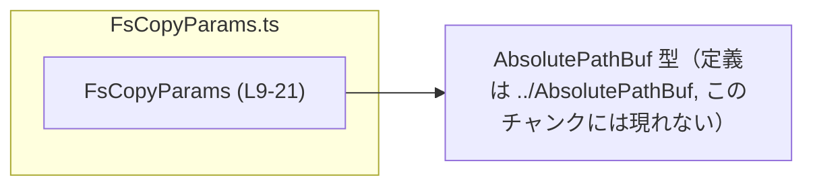
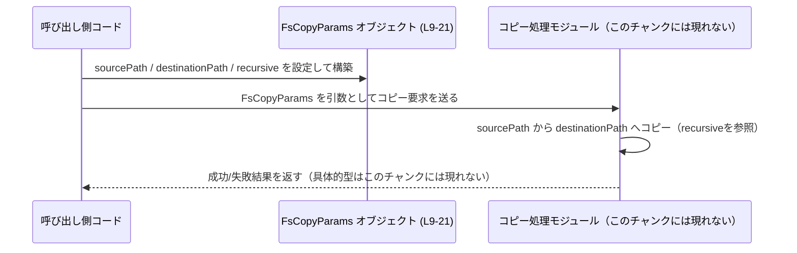

# app-server-protocol/schema/typescript/v2/FsCopyParams.ts コード解説

## 0. ざっくり一言

ホストファイルシステム上でファイルまたはディレクトリツリーをコピーする際に必要なパラメータを表現する、TypeScript の型定義です（`FsCopyParams.ts:L6-8, L9-21`）。

---

## 1. このモジュールの役割

### 1.1 概要

- このモジュールは、ホストファイルシステム上でのコピー操作のための **パラメータ（入力データ構造）** を表現するために存在しています（コメント `FsCopyParams.ts:L6-8`）。
- コピー元・コピー先の絶対パスと、ディレクトリコピー時に利用される `recursive` フラグを 1 つのオブジェクト型 `FsCopyParams` として提供します（`FsCopyParams.ts:L9-21`）。

### 1.2 アーキテクチャ内での位置づけ

このファイル単体から読み取れる依存関係は次のとおりです。

- `FsCopyParams` は `AbsolutePathBuf` 型に依存します（`FsCopyParams.ts:L4, L13, L17`）。
- `AbsolutePathBuf` の定義は `../AbsolutePathBuf` にあり、このチャンクには含まれていません。

依存関係を簡単な Mermaid 図で表します。



この図は、「コピーのパラメータ型 `FsCopyParams` が、パスを表現するために `AbsolutePathBuf` 型を利用している」という関係だけを示しています。

### 1.3 設計上のポイント

コードから読み取れる設計上の特徴は次のとおりです。

- **生成コードであること**  
  - 冒頭コメントにより、このファイルは `ts-rs` によって自動生成され、手動編集が禁止されています（`FsCopyParams.ts:L1-3`）。
- **状態を持たない単純なデータ型**  
  - 関数やクラスはなく、コピー操作の入力値のみを表す型エイリアスです（`FsCopyParams.ts:L9-21`）。
- **型安全性の確保**  
  - `sourcePath` と `destinationPath` に同じ型 `AbsolutePathBuf` を用いることで、「両者が同じ種別のパスである」ことをコンパイル時に保証しています（`FsCopyParams.ts:L4, L13, L17`）。
- **挙動仕様はコメントで定義**  
  - `recursive` フラグについて、ディレクトリコピーでは必須であり、ファイルコピーでは無視されるという仕様がコメントで明示されています（`FsCopyParams.ts:L18-20`）。  
  - ただし、この仕様は型システムでは強制されていません（`recursive` はオプション型 `recursive?: boolean` です）。

---

## 2. 主要な機能一覧

このファイルは関数を持たず、「コピー操作のためのデータ構造」を提供することが主目的です。機能と言えるものを整理すると次のようになります。

- ファイルまたはディレクトリコピーのパラメータ表現:
  - `sourcePath`: 絶対パスのコピー元（`FsCopyParams.ts:L10-13`）
  - `destinationPath`: 絶対パスのコピー先（`FsCopyParams.ts:L14-17`）
  - `recursive`: ディレクトリコピー時に必要な再帰フラグ（`FsCopyParams.ts:L18-21`）

---

## 3. 公開 API と詳細解説

### 3.1 型一覧（構造体・列挙体など：コンポーネントインベントリー）

このファイルに現れる主要な型・コンポーネントの一覧です。

| 名前            | 種別             | 役割 / 用途                                                                                         | 公開範囲 | 根拠行 (`ファイル名:L開始-終了`)                        |
|-----------------|------------------|------------------------------------------------------------------------------------------------------|----------|----------------------------------------------------------|
| `FsCopyParams`  | 型エイリアス（オブジェクト型） | ファイルまたはディレクトリコピーのためのパラメータをまとめたオブジェクト型。                         | `export` | `FsCopyParams.ts:L9-21`                                  |
| `sourcePath`    | プロパティ        | コピー元の絶対パス。`AbsolutePathBuf` 型で表現される（コメントで「Absolute source path」と説明）   | -        | `FsCopyParams.ts:L10-13`                                 |
| `destinationPath` | プロパティ      | コピー先の絶対パス。`AbsolutePathBuf` 型で表現される（コメントで「Absolute destination path」と説明） | -     | `FsCopyParams.ts:L14-17`                                 |
| `recursive`     | プロパティ（オプション） | ディレクトリコピー時に必要な再帰フラグ。ファイルコピー時には無視されるとコメントで定義。          | -        | `FsCopyParams.ts:L18-21`                                 |
| `AbsolutePathBuf` | 型（詳細不明） | 絶対パスを表すと推測される型。`FsCopyParams` 内のパスに利用される。定義は別ファイル。             | -        | 参照: `FsCopyParams.ts:L4, L13, L17`（定義は ../AbsolutePathBuf にあり、このチャンクには現れない） |

> `AbsolutePathBuf` の具体的な中身（文字列か、ラッパー型かなど）は、このチャンクには現れません。型名から「絶対パス」を表す型と推測できますが、断定はできません。

### 3.2 関数詳細

このファイルには関数・メソッドが定義されていません（`FsCopyParams.ts:L1-21` のどこにも `function` やメソッド定義が存在しません）。そのため、関数詳細テンプレートに該当する対象はありません。

### 3.3 その他の関数

- このファイルには補助関数・ユーティリティ関数も存在しません（`FsCopyParams.ts:L1-21`）。

---

## 4. データフロー

このファイル自体はデータ構造のみを定義しており、処理ロジックは含みません。ただし、コメントから「ホストファイルシステム上のコピー操作のパラメータ」であることが分かるため（`FsCopyParams.ts:L6-8`）、典型的な利用フローを例として示します。

### 4.1 代表的な利用シナリオ（例）

1. 呼び出し側コードが `FsCopyParams` オブジェクトを構築する。
2. そのオブジェクトを、ファイルコピーを行う別モジュール（このチャンクには現れない）に引き渡す。
3. コピー処理モジュールが `sourcePath` / `destinationPath` / `recursive` を読んで実際の I/O 処理を行う。

この想定フローを sequence diagram で表します（`FsCopyParams` の位置を明示）。



> 実際のコピー処理の関数名・戻り値などは、このファイルからは分かりません。「コピー処理モジュール」はあくまで想定上のコンポーネントです。

---

## 5. 使い方（How to Use）

### 5.1 基本的な使用方法

`FsCopyParams` は、コピー API の引数として利用される典型的なデータ型です。以下は想定される使い方の例です（コピー処理自体はダミーです）。

```typescript
// FsCopyParams 型をインポートする（パスはプロジェクト構成に依存）
import type { FsCopyParams } from "./FsCopyParams";  // FsCopyParams.ts:L9-21 の型を利用

// AbsolutePathBuf の具体的な定義はこのチャンクには現れないため、
// ここでは unknown からの型アサーションで例示しています。
import type { AbsolutePathBuf } from "../AbsolutePathBuf"; // FsCopyParams.ts:L4

// 例: サーバー側でファイルコピーを行う関数の引数として FsCopyParams を受け取る
async function copyOnServer(params: FsCopyParams): Promise<void> {
    // 実際のコピー処理は別モジュールに委譲される想定（このチャンクには現れない）
    // ここでは挙動の説明のためのダミーです。
    console.log("Copy from", params.sourcePath, "to", params.destinationPath);
    if (params.recursive) {
        console.log("Recursive copy enabled");
    }
}

// FsCopyParams オブジェクトの構築例
const params: FsCopyParams = {
    // AbsolutePathBuf の実体は不明なので、文字列からの型アサーションで例示
    sourcePath: "/abs/source/path" as unknown as AbsolutePathBuf,      // FsCopyParams.ts:L10-13
    destinationPath: "/abs/dest/path" as unknown as AbsolutePathBuf,   // FsCopyParams.ts:L14-17
    recursive: true,                                                    // FsCopyParams.ts:L18-21
};

// 構築したパラメータをコピー処理に渡す
copyOnServer(params);
```

この例では、`FsCopyParams` が「コピー操作の入力値を一か所にまとめる」役割を果たしていることが分かります。

### 5.2 よくある使用パターン

1. **ファイルコピー（非再帰）**

```typescript
const fileCopyParams: FsCopyParams = {
    sourcePath: "C:/data/source.txt" as unknown as AbsolutePathBuf,
    destinationPath: "C:/backup/source.txt" as unknown as AbsolutePathBuf,
    // recursive は省略: コメントによればファイルコピーでは無視される（FsCopyParams.ts:L18-20）
};
```

1. **ディレクトリツリーの再帰コピー**

```typescript
const dirCopyParams: FsCopyParams = {
    sourcePath: "C:/data/dir" as unknown as AbsolutePathBuf,
    destinationPath: "D:/backup/dir" as unknown as AbsolutePathBuf,
    recursive: true,  // ディレクトリコピーでは required とコメントされている（FsCopyParams.ts:L18-20）
};
```

### 5.3 よくある間違い（起こりうる誤用の例）

コメントから推測できる誤用パターンを挙げます。

```typescript
// （誤用の可能性）ディレクトリコピーなのに recursive を指定しない
const maybeWrong: FsCopyParams = {
    sourcePath: "/data/dir" as unknown as AbsolutePathBuf,
    destinationPath: "/backup/dir" as unknown as AbsolutePathBuf,
    // recursive が省略されている
    // コメントでは "Required for directory copies" とある（FsCopyParams.ts:L18-20）が、
    // 型レベルでは強制されない点に注意。
};
```

この場合、実際のコピー処理側が `recursive` の未指定 (`undefined`) をどう扱うかは、このファイルからは分かりません。利用側と実装側で仕様を揃える必要があります。

### 5.4 使用上の注意点（まとめ）

- `recursive` は型上オプション (`recursive?: boolean`) ですが、コメントでは「ディレクトリコピーには必須」とされています（`FsCopyParams.ts:L18-21`）。  
  ディレクトリコピーを行う場合は、仕様に従い明示的に設定する前提があると考えられます。
- ファイルコピーでは `recursive` は無視されるとコメントにあります（`FsCopyParams.ts:L18-20`）。  
  実装がこの仕様に従っているかは、このファイルからは確認できません。
- `AbsolutePathBuf` の具体的な型やバリデーションはこのチャンクでは不明です。  
  絶対パスであることが保証されるかどうかは、`../AbsolutePathBuf` 側の実装に依存します。
- この型は単なるデータコンテナであり、並行性（複数スレッド・タスクからのアクセス）に関する制御は一切含みません。  
  共有オブジェクトとして扱う場合は、呼び出し側で不変データとして扱うなどの配慮が必要です。

---

## 6. 変更の仕方（How to Modify）

### 6.1 新しい機能を追加する場合

このファイルは自動生成されたコードであり、「手で変更するな」と明示されています（`FsCopyParams.ts:L1-3`）。したがって、**直接このファイルを編集するのではなく、生成元（おそらく Rust 側の型定義）を変更する必要があります**。

一般的な手順（コードから推測できる範囲での説明）:

1. Rust 側で `FsCopyParams` に相当する型の定義に、新しいフィールド（例: `overwrite`, `filter` など）を追加する。  
   （この Rust 型の位置は、このチャンクには現れません。）
2. `ts-rs` を再実行して TypeScript の型定義を再生成する。  
   再生成により、本ファイルの `FsCopyParams` にも新しいフィールドが反映されるはずです。
3. 生成された TypeScript コードを利用する呼び出し側も、新しいフィールドに対応するように修正する。

### 6.2 既存の機能を変更する場合

- たとえば、「`recursive` を必須プロパティにしたい」「`sourcePath` の型を変えたい」といった変更も、直接このファイルを編集するのではなく、生成元で行う必要があります（`FsCopyParams.ts:L1-3`）。
- 変更時に確認すべき契約・前提条件:
  - `sourcePath` / `destinationPath` の型と意味は、「絶対パス」というコメントに基づいて他のコードでも使われている可能性があります（`FsCopyParams.ts:L10-17`）。
  - `recursive` の挙動（ディレクトリコピーで必須／ファイルコピーで無視）は、実装側・クライアント側双方で暗黙の契約として扱われている可能性があります（`FsCopyParams.ts:L18-20`）。
- テストについて:
  - このファイルにはテストコードは含まれていません（`FsCopyParams.ts:L1-21`）。  
    実際のテストは別モジュール／別言語側に存在すると考えられますが、このチャンクからは場所は分かりません。

---

## 7. 関連ファイル

このモジュールと直接関係があることがコード上から分かるファイルは次のとおりです。

| パス                         | 役割 / 関係                                                                                 | 根拠行 |
|------------------------------|----------------------------------------------------------------------------------------------|--------|
| `../AbsolutePathBuf`        | `AbsolutePathBuf` 型の定義を持つファイル。`FsCopyParams` の `sourcePath` / `destinationPath` が依存。 | `FsCopyParams.ts:L4, L13, L17` |
| （Rust 側の元定義ファイル）  | `ts-rs` によってこの TypeScript 型が生成される元となる Rust 型の定義ファイルと推測されるが、パスは不明。 | 推測の根拠: コメント `FsCopyParams.ts:L1-3` に「ts-rs による生成」とあるが、具体的パスはこのチャンクには現れない |

---

### 付記: 安全性・エッジケース・観測性の観点

- **安全性（セキュリティ）**  
  - この型は単にパス文字列（と推測される値）をラップするだけであり、パス・トラバーサル攻撃などを直接防ぐ仕組みは見えません。  
    ただし `AbsolutePathBuf` 側で制約を設けている可能性があります（`FsCopyParams.ts:L4`）。これはこのチャンクからは確認できません。
- **エッジケース**  
  - `sourcePath` と `destinationPath` が同じ場合、空文字列である場合、存在しないパスである場合などにどう振る舞うかは、この型定義からは分かりません。コピー処理実装側で扱う必要があります。
- **性能・スケーラビリティ**  
  - 型定義のみであり、計算コストや I/O は発生しません。性能上の懸念はほぼありません。
- **観測性（ログ・メトリクス）**  
  - この型にはログレベルやトレース ID など、観測用のフィールドは含まれていません（`FsCopyParams.ts:L9-21`）。  
    コピー処理の観測は、別途ロギングやトレーシングの仕組みで行う前提と考えられます。
