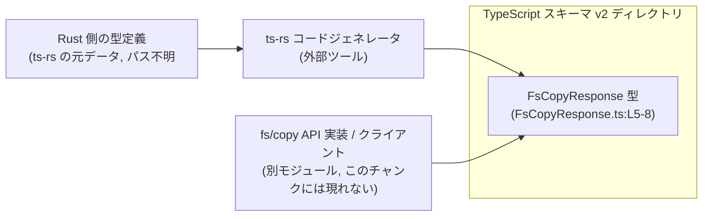
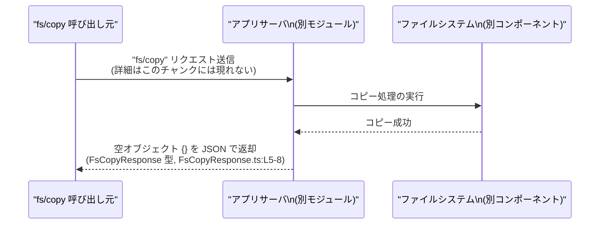

# app-server-protocol/schema/typescript/v2/FsCopyResponse.ts コード解説

## 0. ざっくり一言

`fs/copy` 操作が成功したときの「中身のないレスポンス」を表す TypeScript の型エイリアスです。レスポンスが常に空オブジェクト `{}` であることを、型レベルで表現しています（`FsCopyResponse.ts:L5-8`）。

---

## 1. このモジュールの役割

### 1.1 概要

- このファイルは、`fs/copy` という操作の **成功レスポンス型** を定義します（コメントより、`FsCopyResponse.ts:L5-7`）。
- 成功時のレスポンスには追加データが存在しない（＝空オブジェクト）というプロトコル仕様を、`Record<string, never>` という型を用いて厳密に表現します（`FsCopyResponse.ts:L8-8`）。
- ファイル冒頭のコメントから、この型定義は `ts-rs` によって **自動生成される TypeScript スキーマ** であり、手動編集しない前提で利用されます（`FsCopyResponse.ts:L1-3`）。

### 1.2 アーキテクチャ内での位置づけ

このファイルは `schema/typescript/v2` ディレクトリにあり、v2 プロトコルの TypeScript スキーマ群の一部として、`fs/copy` の成功レスポンス型のみを提供しています（パスとコメントからの推測可能な範囲）。



- Rust 側の具体的なファイル名や API 実装箇所は、このチャンクには現れません。
- ただし「`This file was generated by ts-rs`」というコメントから、Rust の型定義 → `ts-rs` → 本 TypeScript 型という生成パイプラインがあることが分かります（`FsCopyResponse.ts:L1-3`）。

### 1.3 設計上のポイント

- **自動生成コード**  
  - 冒頭コメントで「GENERATED CODE」「Do not edit this file manually」と明示されています（`FsCopyResponse.ts:L1-3`）。
  - 変更は TypeScript 側ではなく、元となる Rust の型定義を修正して再生成する前提です。
- **ランタイムコードを持たない**  
  - 唯一の内容は型エイリアス `export type FsCopyResponse = Record<string, never>;` であり（`FsCopyResponse.ts:L8-8`）、実行時の JavaScript には一切影響しません。
- **「空レスポンス」を型安全に表現**  
  - `Record<string, never>` を用いることで、「このオブジェクトにはプロパティを持たせてはならない」という制約を TypeScript の型システムで表現します（`FsCopyResponse.ts:L8-8`）。
- **エラー情報や並行性の扱い**  
  - この型は「成功レスポンスのみ」を表現しており、エラー情報や非同期制御に関する情報は含みません（`FsCopyResponse.ts:L5-7`）。
  - 並行性・スレッド安全性に関する状態も持たない純粋な型定義です。

---

## 2. 主要な機能一覧

このファイルが提供する機能は 1 つです。

- `FsCopyResponse` 型: `fs/copy` の成功レスポンスが「空オブジェクト」であることを、`Record<string, never>` を通じて型レベルで表現する（`FsCopyResponse.ts:L5-8`）。

---

## 3. 公開 API と詳細解説

### 3.1 型一覧（構造体・列挙体など / コンポーネントインベントリー）

| 名前              | 種別        | 役割 / 用途                                                                                     | 定義位置                    |
|-------------------|-------------|--------------------------------------------------------------------------------------------------|-----------------------------|
| `FsCopyResponse`  | 型エイリアス | `fs/copy` 成功レスポンスとして「プロパティを持たないオブジェクト」を表現するための型           | `FsCopyResponse.ts:L5-8`    |

#### `FsCopyResponse` の詳細

```typescript
/**
 * Successful response for `fs/copy`.
 */
export type FsCopyResponse = Record<string, never>;
```

**概要（何を表す型か）**

- コメントより、`fs/copy` 操作が成功した際のレスポンスを表現します（`FsCopyResponse.ts:L5-7`）。
- `Record<string, never>` は、すべてのキーの値が `never` 型であるオブジェクトを表します（`FsCopyResponse.ts:L8-8`）。
  - `never` は「到達しない」「値が存在しない」ことを表す特殊な型であり、**どの値も代入できません**。
  - そのため、結果として「プロパティを持てないオブジェクト」という意味になります。

**TypeScript 観点での意味**

- 有効な `FsCopyResponse` の値は、型チェック上ほぼ **空リテラルオブジェクト `{}` のみ** になります。
- 例:

```typescript
import type { FsCopyResponse } from "./FsCopyResponse";

// 正常: 空オブジェクトは FsCopyResponse として受け取れる
const ok: FsCopyResponse = {};                // コンパイル OK

// エラー: プロパティを持つと、値の型が never ではないのでコンパイルエラー
const ng: FsCopyResponse = {
    // @ts-expect-error - 'string' 型は 'never' に代入できない
    copiedFrom: "/path/to/src",
};
```

**エラー / 安全性 / 並行性**

- **型安全性**  
  - `never` と `Record` の組み合わせにより、「レスポンスオブジェクトにデータを持たせない」という仕様をコンパイル時に強制できます。
- **実行時エラー**  
  - この型はコンパイル専用であり、ランタイムに追加のチェックは入りません。
  - サーバが誤って `{ extra: "data" }` のような JSON を返しても、TypeScript 側は静的型付けの範囲でしか検出できません（実行時にはそのプロパティは単に無視されるだけです）。
- **並行性**  
  - 型定義のみで状態を持たないため、並行アクセスやスレッド安全性の問題は発生しません。
  - 非同期処理（`Promise<FsCopyResponse>` など）で共有しても、型としてはイミュータブルです。

**Edge cases（エッジケース）**

- 空オブジェクト `{}` 以外のオブジェクトリテラルを代入しようとすると、コンパイルエラーになります。
- 型アサーションを使えば `{ foo: "bar" } as FsCopyResponse` のように回避することはできますが、これは TypeScript の型安全性を意図的に弱める使い方です。
- 実行時には型情報が失われるため、サーバから余分なフィールドが返ってきても、クライアントコード側がアクセスしない限りは問題になりません。

**使用上の注意点**

- 成功レスポンスに追加の情報（コピーしたファイル数、処理時間など）を持たせたい場合、この型を直接編集してはいけません（自動生成のため、`FsCopyResponse.ts:L1-3`）。
  - Rust 側の元定義を変更し、`ts-rs` によって再生成する必要があります。
- クライアントコードでこの型を使うときは、「成功したかどうか」だけを表すシグナルとして扱い、追加情報を期待しない前提にする必要があります。

### 3.2 関数詳細（最大 7 件）

このファイルには関数・メソッドの定義はありません（`FsCopyResponse.ts:L1-8`）。  
そのため、関数詳細の対象となる公開 API は存在しません。

### 3.3 その他の関数

このファイルには補助関数やラッパー関数も定義されていません（`FsCopyResponse.ts:L1-8`）。

---

## 4. データフロー

このファイル自体はデータ処理ロジックを持ちませんが、コメントから読み取れる `fs/copy` の典型的な利用シナリオにおいて、`FsCopyResponse` がどのように使われるかを模式的に示します。



- `FsCopyResponse` 型は、このシーケンスの「成功時レスポンス」の構造を TypeScript 側で表すために利用されると考えられます（コメントより、`FsCopyResponse.ts:L5-7`）。
- 実際の `fs/copy` エンドポイントや RPC 実装は、このチャンクには含まれていません。

---

## 5. 使い方（How to Use）

### 5.1 基本的な使用方法

ここでは、別モジュールに `fsCopy` というクライアント関数が存在すると仮定した、代表的な利用例を示します。`fsCopy` 自体は **サンプルコード用の仮想関数** であり、このリポジトリ内に定義があるとは限りません。

```typescript
// FsCopyResponse 型をインポートする
import type { FsCopyResponse } from "./FsCopyResponse";

// 仮想的な fs/copy クライアント関数の型定義
async function fsCopy(src: string, dst: string): Promise<FsCopyResponse> {
    // 実際には HTTP / RPC などでサーバにリクエストを送り、
    // 成功時に {} を受け取ることを想定したダミー実装です。
    return {}; // FsCopyResponse として有効な値
}

// FsCopyResponse を利用した処理例
async function runCopy() {
    const response = await fsCopy("/path/to/src", "/path/to/dst");
    // response の型は FsCopyResponse = Record<string, never>
    // どのプロパティにもアクセスできない（存在しないことが前提）
    console.log("copy succeeded", response); // ログ出力は可能だが中身は常に {}
}
```

ポイント:

- `FsCopyResponse` にプロパティは存在しない前提なので、`response.copiedFiles` のようなアクセスはコンパイルエラーになります。
- 成功したことを示すシグナルとしてのみ扱う設計になっています。

### 5.2 よくある使用パターン

1. **結果型の一部として組み込む**

   `Result` 風のラッパー型（ここではサンプルとして自前定義）と組み合わせる例です。

   ```typescript
   import type { FsCopyResponse } from "./FsCopyResponse";

   // 汎用的な結果型（サンプル。実プロジェクトに存在するとは限りません）
   type Result<Ok, Err> =
       | { ok: true;  value: Ok }
       | { ok: false; error: Err };

   // fs/copy の結果型例
   type FsCopyResult = Result<FsCopyResponse, Error>;

   function handleResult(result: FsCopyResult) {
       if (result.ok) {
           // result.value の型は FsCopyResponse (空オブジェクト)
           console.log("copy succeeded");
       } else {
           console.error("copy failed", result.error);
       }
   }
   ```

2. **Promise と組み合わせる**

   非同期処理の戻り値として `Promise<FsCopyResponse>` を用いることで、「成功時は必ず空オブジェクトが返る」という契約を型で表現できます。

   ```typescript
   import type { FsCopyResponse } from "./FsCopyResponse";

   async function copyAndLog(): Promise<void> {
       const res: FsCopyResponse = await fsCopy("/a", "/b"); // 仮想関数
       console.log(res); // いつも {}
   }
   ```

### 5.3 よくある間違い

```typescript
import type { FsCopyResponse } from "./FsCopyResponse";

// 間違い例: 成功レスポンスに情報を持たせようとしている
const wrong: FsCopyResponse = {
    // @ts-expect-error - 'string' は 'never' に代入できない
    copiedFrom: "/src/path",
};

// 正しい例: 空オブジェクトのみを代入する
const correct: FsCopyResponse = {}; // OK
```

- `FsCopyResponse` は **あくまで空レスポンス** を表す型であり、コピー元・コピー先・件数などのメタ情報は持てません。
- 追加情報が必要な場合は、元の Rust 型定義を変更して、`ts-rs` によって再生成する必要があります（`FsCopyResponse.ts:L1-3`）。

### 5.4 使用上の注意点（まとめ）

- このファイルは自動生成されているため、**直接編集しない** 前提です（`FsCopyResponse.ts:L1-3`）。
- `FsCopyResponse` にプロパティを追加したい場合は、元となる Rust の型定義とスキーマ全体の整合性を考慮したうえで変更する必要があります。
- TypeScript の型はコンパイル時のみ有効であり、実行時の JSON には余分なフィールドが含まれる可能性があります。実行時の検証が必要な場合は、別途ランタイムバリデーションが必要になります。

---

## 6. 変更の仕方（How to Modify）

### 6.1 新しい機能を追加する場合

例: `fs/copy` の成功レスポンスに「コピーされたファイル数」を含めたい場合。

1. **TypeScript ファイルを直接変更しない**  
   - 冒頭のコメントに「GENERATED CODE」「Do not edit this file manually」とあるため（`FsCopyResponse.ts:L1-3`）、このファイルを直接編集すると、再生成時に上書きされます。
2. **Rust 側の元定義を変更する**  
   - `ts-rs` は通常 Rust の型に `#[derive(TS)]` などの属性を付与して TypeScript 型を生成します。
   - 元の Rust 型にフィールドを追加し、それに応じて TypeScript の型が変わるようにします。（具体的な Rust ファイル名・型名はこのチャンクからは不明です。）
3. **コード生成を再実行する**  
   - プロジェクト固有のビルド / ジェネレータコマンドを用いて `ts-rs` を再実行し、本ファイルを再生成します。
4. **利用側のコードを更新する**  
   - 追加されたプロパティ（例: `fileCount: number`）を使って処理を拡張します。

### 6.2 既存の機能を変更する場合

- `FsCopyResponse` の意味を変える（例えば「空オブジェクト」から「メタ情報を含むオブジェクト」に変える）場合:
  - **影響範囲**  
    - `FsCopyResponse` を利用している全ての TypeScript コード（クライアント・サーバ双方）が影響を受けます。
  - **契約の変更**  
    - プロトコル上の契約（「成功時は空レスポンス」）が変わるため、他言語のスキーマやドキュメントとの整合性も確認する必要があります。
  - **手順**  
    - Rust 側の元定義を変更 → `ts-rs` で再生成 → 依存コードをコンパイルして型エラー箇所を修正、という流れになります。
- 元の Rust 型や生成コマンドの場所は、このチャンクには現れません。「どのファイルを触るべきか」はプロジェクト全体の構成を参照する必要があります。

---

## 7. 関連ファイル

このチャンクから直接参照できる関連ファイル情報は限られていますが、構造とコメントから分かる範囲で整理します。

| パス / コンポーネント                         | 役割 / 関係                                                                                                     |
|----------------------------------------------|------------------------------------------------------------------------------------------------------------------|
| `schema/typescript/v2/FsCopyResponse.ts`     | 本ファイル。`fs/copy` 成功レスポンスを `FsCopyResponse` 型として定義する（`FsCopyResponse.ts:L5-8`）。         |
| Rust 側の ts-rs 生成元ファイル（パス不明）   | `ts-rs` によって本ファイルが生成される元の Rust 型定義。コメントから存在が示唆されるが、このチャンクには現れない（`FsCopyResponse.ts:L1-3`）。 |
| `schema/typescript/v2` ディレクトリ内の他ファイル（具体名不明） | 同じ v2 プロトコルの TypeScript スキーマ群。`FsCopyResponse` からの直接依存は、このファイルからは確認できません。 |

このチャンクには、`FsCopyResponse` を利用する具体的な関数・クラス・エンドポイントの定義は含まれていません。そのため、実際にどの API ハンドラやクライアントコードがこの型を import しているかは、他のファイルを参照する必要があります。
