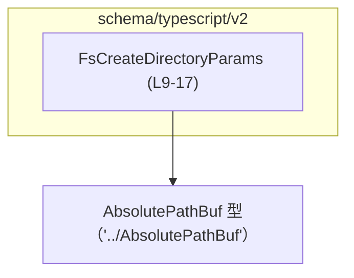
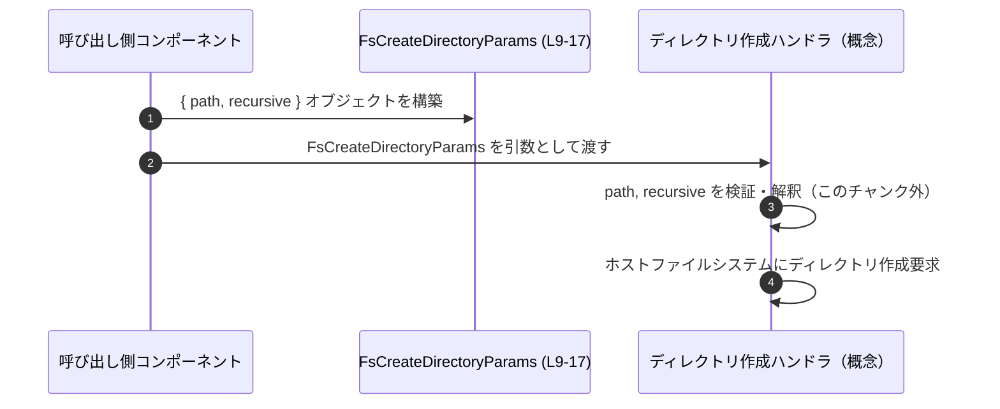

# app-server-protocol/schema/typescript/v2/FsCreateDirectoryParams.ts

## 0. ざっくり一言

ホストファイルシステム上でディレクトリを作成するための **リクエストパラメータ型 `FsCreateDirectoryParams`** を定義する、自動生成された TypeScript スキーマファイルです（FsCreateDirectoryParams.ts:L1-3, L6-9）。

---

## 1. このモジュールの役割

### 1.1 概要

- このモジュールは、ホストファイルシステム上にディレクトリを作成する処理に対して、  
  「どのディレクトリを、親ディレクトリも含めて作成するか」を表現するための **パラメータ型** を提供します（FsCreateDirectoryParams.ts:L6-8, L9-17）。
- ファイル先頭コメントから、このファイルは `ts-rs` によって自動生成されることが明示されており、手動編集しない前提になっています（FsCreateDirectoryParams.ts:L1-3）。

### 1.2 アーキテクチャ内での位置づけ

- `FsCreateDirectoryParams` は v2 TypeScript スキーマの一部として、ディレクトリ作成 API／RPC の「入力データ構造」を表す役割を持つと読み取れます（FsCreateDirectoryParams.ts:L6-9）。
- 依存関係は 1 つで、`AbsolutePathBuf` 型を `import type` で参照しています（FsCreateDirectoryParams.ts:L4, L13）。  
  `import type` は TypeScript の「型専用インポート」であり、実行時の依存関係にはなりません（型チェック専用の依存です）。



> 上図は、このチャンクで確認できる依存関係のみを示しています。  
> `AbsolutePathBuf` の実体定義や、それを利用する他モジュールはこのチャンクには現れません。

### 1.3 設計上のポイント

- **自動生成ファイル**  
  - `// GENERATED CODE! DO NOT MODIFY BY HAND!`（FsCreateDirectoryParams.ts:L1）  
  - `// This file was generated by [ts-rs] ... Do not edit this file manually.`（FsCreateDirectoryParams.ts:L3）  
  から、生成物であり手動編集を禁止する方針が明示されています。
- **型専用インポートによる依存の明確化**  
  - `import type { AbsolutePathBuf }` を用いることで、実行時には存在しない「型だけの依存」であることを明確にしています（FsCreateDirectoryParams.ts:L4）。
- **パス表現の抽象化**  
  - `path` は単なる `string` ではなく `AbsolutePathBuf` 型として表現されており（FsCreateDirectoryParams.ts:L13）、  
    「絶対パスであること」を型レベルで区別しようとしていると考えられます。  
    ただし `AbsolutePathBuf` の中身はこのチャンクには現れません。
- **オプショナルかつ `null` 許容のフラグ**  
  - `recursive?: boolean | null` により、`recursive` プロパティは  
    - 存在しない (`undefined`)  
    - `null`  
    - `true` / `false`  
    の 4 通りを取り得ます（FsCreateDirectoryParams.ts:L17）。  
  - JSDoc では「親ディレクトリも作成するか、デフォルトは true」と説明されていますが（FsCreateDirectoryParams.ts:L14-16）、  
    `undefined` と `null` の違いがどう扱われるかは、このチャンクからは分かりません。

---

## 2. 主要な機能一覧

このファイルは関数を含まず、型定義のみです。機能は次に集約されます。

- `FsCreateDirectoryParams` 型の定義:  
  ディレクトリ作成リクエストのパラメータ（パスと再帰フラグ）を表現する（FsCreateDirectoryParams.ts:L6-8, L9-17）。
- `AbsolutePathBuf` 型の利用:  
  ディレクトリのパスが「絶対パス」であることを型レベルで表現しようとする（FsCreateDirectoryParams.ts:L4, L13）。

---

## 3. 公開 API と詳細解説

### 3.1 型一覧（構造体・列挙体など）

このチャンクで定義・公開されている主要な型は 1 つです。

| 名前 | 種別 | 役割 / 用途 | 主なフィールド | 定義位置 |
|------|------|-------------|----------------|----------|
| `FsCreateDirectoryParams` | 型エイリアス（オブジェクト型） | ホストファイルシステム上でディレクトリを作成する際の入力パラメータを表す | `path: AbsolutePathBuf`, `recursive?: boolean \| null` | FsCreateDirectoryParams.ts:L6-8, L9-17 |

#### フィールド詳細

- `path: AbsolutePathBuf`（必須）（FsCreateDirectoryParams.ts:L10-13）  
  - 説明: 「作成するディレクトリの絶対パス」（Absolute directory path to create.）  
  - 型: `AbsolutePathBuf`（FsCreateDirectoryParams.ts:L4, L13）  
    - 実際の定義は `'../AbsolutePathBuf'` モジュール側にあり、このチャンクには現れません。
- `recursive?: boolean | null`（オプション）（FsCreateDirectoryParams.ts:L14-17）  
  - 説明: 「親ディレクトリも同時に作成するかどうか。デフォルトは true」（FsCreateDirectoryParams.ts:L14-16）。  
  - `?` によりプロパティ自体が省略可能（`undefined`）です。  
  - 型が `boolean | null` なので、`true` / `false` / `null` のいずれかを明示的に渡せます。  
    `null` の意味がどのように解釈されるかは、このチャンクでは分かりません。

#### 言語レベルの安全性・エラー・並行性

- **型安全性（TypeScript）**
  - `FsCreateDirectoryParams` を使う関数やメソッドは、`path` が `AbsolutePathBuf` であることをコンパイル時にチェックできます（FsCreateDirectoryParams.ts:L13）。
  - `recursive` を読む側のコードは、`undefined` / `null` を考慮しないとコンパイルエラーやランタイムエラー（`!` 非 null アサーションを乱用した場合など）の原因になります（FsCreateDirectoryParams.ts:L17）。
- **ランタイムエラー**
  - このファイルは純粋な「型」定義のみであり、実行時の処理は一切含みません（FsCreateDirectoryParams.ts:L1-17）。  
    したがって、このファイルだけからはファイルシステム操作の成否やエラー処理の挙動は分かりません。
- **並行性**
  - TypeScript の型定義であり、状態を持たない不変のオブジェクト型なので、型自体には並行性に関する問題はありません。  
    ただし、この型を使って実際にファイルシステム操作を行う実装が並列実行されるかどうか、そこでロックなどが必要かどうかは、このチャンクには現れません。

### 3.2 関数詳細

このファイルには関数・メソッド・クラスコンストラクタなどの「実行可能な API」は一切定義されていません（FsCreateDirectoryParams.ts:L1-17）。  
そのため、関数用の詳細テンプレートを適用できる対象はありません。

### 3.3 その他の関数

- なし（このチャンクには関数定義が存在しません）（FsCreateDirectoryParams.ts:L1-17）。

---

## 4. データフロー

このファイル単体では呼び出し元／呼び出し先のコードは存在しませんが、  
`FsCreateDirectoryParams` 型を用いた「典型的な利用シナリオ」のデータフローを概念的に示します。



- 上図の `H`（ディレクトリ作成ハンドラ）は、ファイルシステム操作を行う何らかのコンポーネントを抽象化したものです。  
  具体的な型名・関数名はこのチャンクには現れません。
- 実際のエラー処理（存在しないパス、権限不足など）は、`H` の内部実装側の責務であり、このファイルからは読み取れません。

---

## 5. 使い方（How to Use）

### 5.1 基本的な使用方法

`FsCreateDirectoryParams` を利用する側の、仮想的なコード例です。  
ここで登場する `createDirectory` 関数は、このファイルには定義されていません（外部の API と仮定したものです）。

```typescript
import type { FsCreateDirectoryParams } from "./FsCreateDirectoryParams"; // このファイルの型をインポートする
import type { AbsolutePathBuf } from "../AbsolutePathBuf";               // 絶対パスを表す型をインポートする

// どこか別の場所で AbsolutePathBuf を手に入れていると仮定する
declare function getProjectDirPath(): AbsolutePathBuf;                   // 生成方法はこのチャンクには現れない

// ディレクトリ作成 API（仮想）の型定義
declare function createDirectory(                                       // ディレクトリを作成する関数があると仮定
    params: FsCreateDirectoryParams                                     // 引数に FsCreateDirectoryParams を取る
): Promise<void>;                                                       // 成功・失敗は Promise で表現されると仮定

async function main() {                                                 // 非同期なエントリポイント
    const path = getProjectDirPath();                                   // 絶対パスを取得する（AbsolutePathBuf 型）

    const params: FsCreateDirectoryParams = {                           // パラメータオブジェクトを作成
        path,                                                           // 必須フィールド path を設定
        // recursive を省略すると、コメント上のデフォルト true が適用される契約を想定
    };

    await createDirectory(params);                                      // ディレクトリ作成をリクエスト
}
```

- `path` を必須として渡すことで、「どのディレクトリを作成したいか」が明確になります（FsCreateDirectoryParams.ts:L10-13）。
- `recursive` を省略すると、JSDoc の説明からは「デフォルトで `true`」と解釈される設計意図が読み取れます（FsCreateDirectoryParams.ts:L14-16）。  
  実際にどのように扱われるかは、受け取り側の実装に依存します。

### 5.2 よくある使用パターン

1. **親ディレクトリも含めて作成する（デフォルト利用）**

```typescript
const params: FsCreateDirectoryParams = {            // デフォルトの動作を利用する例
    path,                                            // 絶対パスを指定
    // recursive は省略（undefined）
};
```

1. **親ディレクトリは作らず、指定ディレクトリのみ作成したい場合（明示的に false）**

```typescript
const params: FsCreateDirectoryParams = {            // 親ディレクトリは作成しない例
    path,
    recursive: false,                                // 親ディレクトリは作成しない
};
```

1. **`null` を渡す場合**

```typescript
const params: FsCreateDirectoryParams = {            // recursive に null を渡す例
    path,
    recursive: null,                                 // 具体的な意味はこのチャンクからは不明
};
```

- `recursive: null` の意味（「未指定」と同じか、別の意味があるのか）は  
  JSDoc コメントや型定義からは読み取れず、このチャンクには現れません。

### 5.3 よくある間違い

```typescript
// 間違い例: 絶対パスではない値を渡してしまう
const paramsBad: FsCreateDirectoryParams = {
    // path: "/relative/path",                      // これが AbsolutePathBuf の要件を満たすかどうかは不明
    // → AbsolutePathBuf が単なる string でない場合、型レベルで拒否される可能性がある
} as any;                                           // any キャストで型安全性が失われる

// 正しい例: AbsolutePathBuf 型の値を使う
const absolutePath: AbsolutePathBuf = getProjectDirPath(); // 生成方法は別モジュール
const paramsGood: FsCreateDirectoryParams = {
    path: absolutePath,                                      // 型に従った値を渡す
    recursive: true,                                         // 明示的に再帰作成を有効化
};
```

- `as any` などで型チェックを回避すると、`FsCreateDirectoryParams` が意図する  
  「絶対パスである」「recursive が boolean | null である」といった安全性が失われます。

### 5.4 使用上の注意点（まとめ）

- **前提条件**
  - `path` には「絶対ディレクトリパス」を渡すべき、という契約が JSDoc で明示されています（FsCreateDirectoryParams.ts:L10-13）。  
    実際に絶対パスかどうかの検証がどこで行われるかは、このチャンクには現れません。
- **`recursive` の扱い**
  - `recursive` はオプショナルかつ `null` 許容（FsCreateDirectoryParams.ts:L17）です。  
    受け取り側の実装では、最低でも `undefined` / `null` / `true` / `false` を区別したロジックが必要になります。
- **セキュリティ上の注意（一般論）**
  - この型を使ってファイルシステムにアクセスする実装では、  
    任意パスの作成が可能になるため、ディレクトリトラバーサルや権限不足のパス指定などに注意する必要があります。  
    これらのチェックがどのように行われているかは、このチャンクには現れません。
- **バグになりやすい点**
  - `recursive` を読み取る側で「`undefined` と `false` を同一視する」「`null` を考慮しない」といった実装をすると、  
    コメント上の「デフォルトは true」と矛盾した挙動になる可能性があります（FsCreateDirectoryParams.ts:L14-16, L17）。

---

## 6. 変更の仕方（How to Modify）

### 6.1 新しい機能を追加する場合

このファイルは `ts-rs` による自動生成物であり、冒頭コメントで「手で編集しない」方針が明示されています（FsCreateDirectoryParams.ts:L1-3）。  
したがって、通常は **生成元の定義（おそらく Rust 側）を変更し、再生成する** 形になります。

想定される手順（一般的な ts-rs ワークフローに基づく記述であり、具体的なパスはこのチャンクには現れません）:

1. Rust 側で `FsCreateDirectoryParams` に対応する構造体を探す（ファイルパスはこのチャンクには現れません）。
2. 追加したいフィールド（例: `mode`, `owner` など）を構造体に追加し、ts-rs の派生属性を調整する。
3. ts-rs のコード生成を実行し、TypeScript 側のスキーマを再生成する。
4. 新しく追加されたフィールドを利用する呼び出しコード／サーバー側実装を更新する。

### 6.2 既存の機能を変更する場合

例として、`recursive` のデフォルトや型を変更したい場合を考えます。

- **影響範囲の確認**
  - `FsCreateDirectoryParams` を引数とする全ての API／RPC ハンドラ、およびその呼び出し側を確認する必要があります。  
    具体的なファイルやモジュールは、このチャンクには現れません。
- **契約の維持**
  - JSDoc で「デフォルトは true」と書かれているため（FsCreateDirectoryParams.ts:L14-16）、  
    既存クライアントが `recursive` を省略している場合、その挙動が変わらないよう注意する必要があります。
- **テスト**
  - `recursive` の有無・値の違い（`undefined` / `null` / `true` / `false`）ごとに、ディレクトリ作成の挙動が変わらないか、  
    あるいは期待通りに変わるかを確認するテストが必要です。  
    このチャンクにはテストコードは現れません。

---

## 7. 関連ファイル

このチャンクから直接分かる関連モジュール・ファイルは次の通りです。

| パス / モジュール名 | 役割 / 関係 |
|----------------------|------------|
| `../AbsolutePathBuf` | `AbsolutePathBuf` 型の定義元モジュール。`path` フィールドの型として利用される（FsCreateDirectoryParams.ts:L4, L13）。実際のファイル拡張子や中身はこのチャンクには現れません。 |
| （生成元の Rust 定義） | 冒頭コメントにある `ts-rs` によってこの TypeScript ファイルが生成されているため（FsCreateDirectoryParams.ts:L1-3）、対応する Rust 側の構造体定義が存在すると考えられますが、そのパスや内容はこのチャンクには現れません。 |

このファイル自体にはテスト・実装ロジック・エラーハンドリングは含まれず、  
あくまで「ファイルシステム上のディレクトリ作成操作に対するパラメータの型情報」を提供する役割に特化しています。
