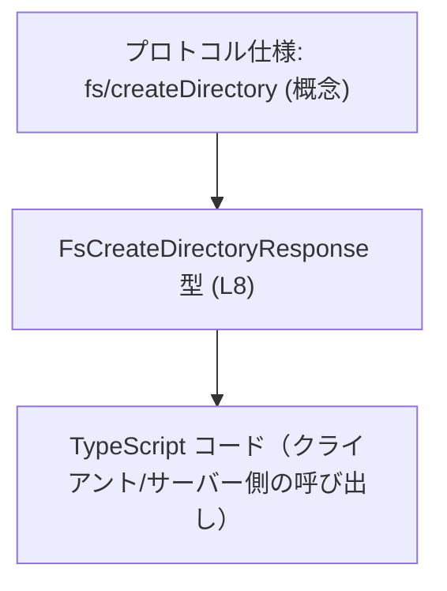
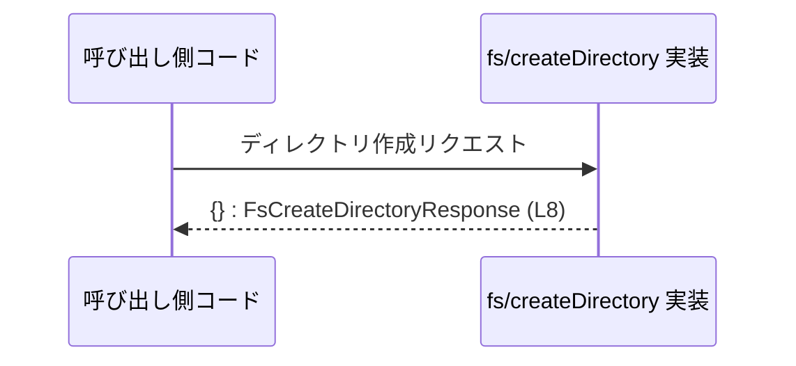

# app-server-protocol/schema/typescript/v2/FsCreateDirectoryResponse.ts コード解説

## 0. ざっくり一言

`fs/createDirectory` 操作の「成功レスポンス」を、**空オブジェクトのみ許可する型**として表現するための、自動生成された TypeScript 型エイリアスです  
（`FsCreateDirectoryResponse.ts:L1-3, L5-8`）。

---

## 1. このモジュールの役割

### 1.1 概要

- このモジュールは、アプリケーションサーバーのプロトコルにおける `fs/createDirectory` 操作の**成功時レスポンス**を型として定義します  
  （JSDoc コメントより: `Successful response for 'fs/createDirectory'.` `FsCreateDirectoryResponse.ts:L5-7`）。
- 成功時レスポンスは `Record<string, never>`、すなわち**プロパティを一切持たないオブジェクト**として表現されます  
  （`FsCreateDirectoryResponse.ts:L8`）。
- ファイル全体は `ts-rs` ツールにより自動生成されており、**手動で編集しないこと**が明示されています  
  （`FsCreateDirectoryResponse.ts:L1-3`）。

### 1.2 アーキテクチャ内での位置づけ

このファイルは、`app-server-protocol/schema/typescript/v2/` 以下にあることから、**プロトコル仕様を TypeScript の型として表現する層**の一部と位置づけられます（パス名より）。  
他コンポーネントとの関係を、概念レベルで図示します。



- A → B: プロトコル仕様「`fs/createDirectory` の成功レスポンスは空オブジェクト」を、`FsCreateDirectoryResponse` 型として表現していることを示します  
  （`FsCreateDirectoryResponse.ts:L5-8`）。
- B → C: 実際のクライアント／サーバー側 TypeScript コードが、この型を使ってレスポンスの形を静的に保証することを意図している、と解釈できます（コメントおよびファイルパスからの解釈）。

※ 図中の「プロトコル仕様」「クライアント/サーバー側コード」は概念的なコンポーネントであり、本チャンクのコードには直接は現れません。

### 1.3 設計上のポイント

- **自動生成コード**  
  - 冒頭コメントにより、`ts-rs` による自動生成であり、手動編集禁止であることが明示されています  
    （`FsCreateDirectoryResponse.ts:L1-3`）。
- **責務の限定**  
  - このファイルは型エイリアス 1 つのみを提供し、ロジックや状態は一切持ちません  
    （`FsCreateDirectoryResponse.ts:L5-8`）。
- **空レスポンスの明示的なモデル化**  
  - `Record<string, never>` によって、「成功しても特に返すべきデータがない」ことを型レベルで表現しています  
    （`FsCreateDirectoryResponse.ts:L8`）。
- **エラーハンドリングの方針（このファイルから分かる範囲）**  
  - 「Successful response」とコメントされているため、エラー時レスポンスは**別の型／チャネルで扱う前提**と読み取れますが、このチャンクにはエラー用型は出現しません  
    （`FsCreateDirectoryResponse.ts:L5-7`）。

---

## 2. 主要な機能一覧

このモジュールが提供する機能は次の 1 点です（`FsCreateDirectoryResponse.ts:L5-8`）。

- `FsCreateDirectoryResponse` 型: `fs/createDirectory` 成功時のレスポンスを「プロパティを持たないオブジェクト」として表現する型エイリアス

---

## 3. 公開 API と詳細解説

### 3.1 型一覧（構造体・列挙体など）

このファイルで定義されている型は 1 つです。

| 名前                       | 種別        | 定義内容                                      | 役割 / 用途                                                                 | 根拠 |
|----------------------------|-------------|-----------------------------------------------|-----------------------------------------------------------------------------|------|
| `FsCreateDirectoryResponse` | 型エイリアス | `Record<string, never>` へのエイリアス        | `fs/createDirectory` の成功レスポンスを、追加情報を一切持たない空オブジェクトとして表現する | `FsCreateDirectoryResponse.ts:L5-8` |

#### 型の意味（TypeScript 観点）

- `Record<string, never>` は「文字列キーを持つが、各プロパティの型が `never`」という型です。
  - 実質的に「**プロパティを追加して利用することができないオブジェクト**」として扱われます。
  - 空オブジェクト `{}` が唯一の実用的な値になります。
- そのため `FsCreateDirectoryResponse` 型は「**空オブジェクトだけが有効な値**」という契約を表現します  
  （`FsCreateDirectoryResponse.ts:L8`）。

### 3.2 関数詳細（最大 7 件）

このファイルには**関数は定義されていません**。

- `function` / `=>` を含む関数定義やメソッド定義は存在せず、コメントと型エイリアスのみで構成されています  
  （`FsCreateDirectoryResponse.ts:L1-8`）。

そのため、「関数詳細」テンプレートに沿って解説すべき対象はありません。

### 3.3 その他の関数

- 補助関数やラッパー関数も存在しません  
  （`FsCreateDirectoryResponse.ts:L1-8`）。

---

## 4. データフロー

### 4.1 代表的な処理シナリオ

この型が意図する典型的なデータフローは次のようにまとめられます（概念図）。

1. 呼び出し側コードが `fs/createDirectory` 操作をサーバーに要求する。
2. サーバー側でディレクトリの作成に成功した場合、この操作の成功レスポンスとして、空オブジェクト `{}` を返す。
3. TypeScript 側では、その空オブジェクトを `FsCreateDirectoryResponse` 型として扱うことで、「成功時に余計なデータを返さない」ことを静的に保証する。

この流れをシーケンス図で表します。



- 図中の `FsCreateDirectoryResponse (L8)` は、このファイルで定義されている型エイリアスを指します  
  （`FsCreateDirectoryResponse.ts:L8`）。
- 実際の通信プロトコル（HTTP / WebSocket 等）やエラー時レスポンス形式は、このチャンクからは不明です。

---

## 5. 使い方（How to Use）

このセクションでは、`FsCreateDirectoryResponse` 型を利用する代表的なパターンを、**例示コード**として示します。  
以下のコードは、このリポジトリ内で実際に存在するとは限らず、「こう使うことが想定される」というサンプルです。

### 5.1 基本的な使用方法

`fs/createDirectory` を叩く関数の返り値として `FsCreateDirectoryResponse` を利用する例です。

```typescript
// FsCreateDirectoryResponse 型をインポートする                       // このモジュールから型を読み込む
import type { FsCreateDirectoryResponse } from "./FsCreateDirectoryResponse"; // 実際のパスは利用側の配置に依存

// ディレクトリを作成する非同期関数の例                             // fs/createDirectory を呼び出す高レベル API を想定
async function createDirectory(path: string): Promise<FsCreateDirectoryResponse> { // 成功時は FsCreateDirectoryResponse を返す
    // 実際には HTTP や RPC でサーバーにリクエストを送る                  // 通信方法はここでは抽象化
    // ここではダミー実装として、常に成功したものとして空オブジェクトを返す
    return {};                                                             // {} は FsCreateDirectoryResponse として有効な値
}

// 呼び出し例
async function main() {
    const res = await createDirectory("/tmp/new-dir");                     // res の型は FsCreateDirectoryResponse
    console.log(res);                                                      // 実際の中身は常に {}
}
```

ポイント:

- `FsCreateDirectoryResponse` は「成功した」という事実を表すだけで、追加データを持ちません。
- 実行時には `{}` を返すことになりますが、型によって**「フィールドを追加しない」**ことが保証されます。

### 5.2 よくある使用パターン

1. **戻り値の型として利用する**

   ```typescript
   import type { FsCreateDirectoryResponse } from "./FsCreateDirectoryResponse";

   // RPC クライアントのインターフェース例                             // 成功時レスポンスに FsCreateDirectoryResponse を使う
   interface FsClient {
       createDirectory(path: string): Promise<FsCreateDirectoryResponse>; // 追加情報を返さないことが明示される
   }
   ```

2. **汎用的な RPC ラッパーでレスポンス型に指定する**

   ```typescript
   import type { FsCreateDirectoryResponse } from "./FsCreateDirectoryResponse";

   // 汎用 RPC 呼び出し関数の例                                            // Generics を使ってレスポンス型を指定
   async function callRpc<TResponse>(method: string, params: unknown): Promise<TResponse> {
       // 実際には method と params を使ってサーバーにリクエスト            // ここも抽象化されたダミー実装
       return {} as TResponse;                                             // 実装例のために型アサーションを使用
   }

   async function createDirViaRpc(path: string): Promise<FsCreateDirectoryResponse> {
       // "fs/createDirectory" メソッドのレスポンスとして FsCreateDirectoryResponse を指定
       return callRpc<FsCreateDirectoryResponse>("fs/createDirectory", { path });
   }
   ```

### 5.3 よくある間違い

#### 間違い例 1: 余計なフィールドを追加してしまう

```typescript
import type { FsCreateDirectoryResponse } from "./FsCreateDirectoryResponse";

// 間違い例: 余計なフィールドを含んだオブジェクトを返している
const badResponse: FsCreateDirectoryResponse = {
    // TypeScript の型チェックではエラーになるべきケース
    success: true,                             // プロパティ 'success' は許可されていない
};
```

- `FsCreateDirectoryResponse` は `Record<string, never>` なので、キー `success` の型は `never` となり、`true` は代入できません。
- 正しい例は次のようになります。

```typescript
import type { FsCreateDirectoryResponse } from "./FsCreateDirectoryResponse";

// 正しい例: 空オブジェクトのみを返す
const okResponse: FsCreateDirectoryResponse = {}; // これは許可される
```

#### 間違い例 2: 型を `any` にしてしまう

```typescript
// 間違い例: any を使ってしまい、プロトコルの契約が失われる
let res: any = {};                              // 何でも代入できてしまう
res = { success: true };                        // 本来許可されない形も通ってしまう
```

- `any` を使うと「空オブジェクトであるべき」という契約が型システムで表現できなくなります。
- `FsCreateDirectoryResponse` 型を使うことで、**型安全にプロトコル契約を守る**ことができます。

### 5.4 使用上の注意点（まとめ）

- **空オブジェクト以外を返さないこと**
  - 成功レスポンスに追加情報を持たせたい場合、この型を直接変更するのではなく、**生成元のスキーマ定義を変更して再生成する必要**があります  
    （自動生成コードであり手動編集禁止のため `FsCreateDirectoryResponse.ts:L1-3`）。
- **エラー情報は別経路と想定される**
  - この型は「Successful response」とコメントされているため、エラーコードやメッセージは別の型や例外で表されると考えられます  
    （`FsCreateDirectoryResponse.ts:L5-7`）。
- **実行時検証は別の層で必要**
  - TypeScript の型はコンパイル時のみ有効なので、実行時に本当に `{}` が返ってきているかどうかの検証・バリデーションは、別の層で行う必要があります（このファイルにはその処理は含まれていません `FsCreateDirectoryResponse.ts:L1-8`）。

---

## 6. 変更の仕方（How to Modify）

### 6.1 新しい機能を追加する場合

このファイルは `ts-rs` により生成されたコードであり、コメントで「手動で編集しない」ことが指定されています  
（`FsCreateDirectoryResponse.ts:L1-3`）。そのため:

- **このファイルに直接コードを追加することは推奨されません。**
- `fs/createDirectory` の成功レスポンスに新しい情報（例: 作成したディレクトリのパス）を追加したい場合は、次のような手順が必要になります（推測であることを明示します）:
  1. `ts-rs` が入力としているスキーマ定義（別ファイル）を変更する。  
     - どのファイルかはこのチャンクからは特定できません（不明）。
  2. `ts-rs` を再実行して TypeScript 型を再生成する。
  3. 生成された新しい `FsCreateDirectoryResponse` 型（または別名の型）に基づき、利用側コードを更新する。

※ 具体的な生成元ファイルやコマンドは、このチャンクには現れないため不明です。

### 6.2 既存の機能を変更する場合

`FsCreateDirectoryResponse` の定義を変えたい場合も、直接編集は避け、生成元を変更する必要があります  
（`FsCreateDirectoryResponse.ts:L1-3`）。

変更時の注意点:

- **契約の変更影響**
  - `FsCreateDirectoryResponse` 型はプロトコル契約の一部であるため、変更すると `fs/createDirectory` を利用するすべてのクライアント／サーバー実装に影響が及びます。
- **前提条件**
  - 現状は「成功時は空オブジェクト」という前提に依存した実装が存在する可能性がありますが、このチャンクからは利用箇所は特定できません。
- **テスト・互換性**
  - 後方互換性が必要な場合、旧クライアントが引き続き空オブジェクトを受け取れるようにするなど、プロトコルレベルでの配慮が必要です（テストコードはこのチャンクには現れません）。

---

## 7. 関連ファイル

このチャンクから直接参照できる関連情報は限定的です。

| パス / ツール名 | 役割 / 関係 |
|----------------|------------|
| `FsCreateDirectoryResponse.ts` | 本ファイル自身。`fs/createDirectory` の成功レスポンスを型として表現する（`FsCreateDirectoryResponse.ts:L5-8`）。 |
| `ts-rs`（外部ツール） | コメントにより、このファイルを生成したツールとして言及されています。生成元のスキーマ定義ファイルは、このチャンクからは特定できません（`FsCreateDirectoryResponse.ts:L1-3`）。 |
| 不明 | `fs/createDirectory` のリクエスト型やエラー型、実装コードなどは、このチャンクには現れず、パスも特定できません。 |

---

## 付録: コンポーネントインベントリー（このチャンクに現れる要素一覧）

| 種別          | 名前                       | 説明                                                                 | 根拠 |
|---------------|----------------------------|----------------------------------------------------------------------|------|
| ファイル      | `FsCreateDirectoryResponse.ts` | `fs/createDirectory` 成功レスポンス用 TypeScript 型エイリアスを 1 つ定義する自動生成ファイル | `FsCreateDirectoryResponse.ts:L1-8` |
| コメント      | 自動生成・編集禁止コメント | `ts-rs` により生成されたコードであり、手動で編集しない旨を示すコメント | `FsCreateDirectoryResponse.ts:L1-3` |
| JSDoc コメント | `Successful response for 'fs/createDirectory'.` | この型が `fs/createDirectory` の成功レスポンスを表すことを説明する | `FsCreateDirectoryResponse.ts:L5-7` |
| 型エイリアス  | `FsCreateDirectoryResponse` | `Record<string, never>` を用いて、空オブジェクトだけを許可するレスポンス型を定義 | `FsCreateDirectoryResponse.ts:L8` |

---

## Bugs / Security / Contracts / Edge Cases（本ファイルに基づく要点）

- **潜在的なバグポイント（この型に関するもの）**
  - ランタイムではサーバーが `{}` 以外の値を返す可能性があるにもかかわらず、型だけを信用してパース・利用すると、実行時に不整合が起こりうる点に注意が必要です（このファイルにはランタイム検証は含まれていません `FsCreateDirectoryResponse.ts:L1-8`）。
- **セキュリティ**
  - このファイルは純粋な型定義のみであり、直接的なセキュリティ問題（SQL インジェクション、XSS など）は含みません。
  - 型により「意図しないフィールドを扱わない」ことを開発時に促せるため、予期せぬデータを不用意に信頼するリスクを軽減する効果はあります。
- **契約（Contracts）**
  - 成功時レスポンスは**空オブジェクトのみ**という契約が、`FsCreateDirectoryResponse` 型で表現されています（`FsCreateDirectoryResponse.ts:L5-8`）。
- **エッジケース**
  - `null` や `undefined`、配列などを `FsCreateDirectoryResponse` として扱うことは型的に許されません。
  - 空オブジェクト `{}` は有効ですが、`Object.create(null)` のようなプロトタイプのないオブジェクトの扱いは、利用側の実装・型定義に依存します（このファイルからは不明）。
- **並行性**
  - このファイルは純粋な型定義のみであり、状態や並行アクセスに関する問題は存在しません。

以上が、このチャンクから読み取れる `FsCreateDirectoryResponse.ts` の客観的な解説です。
