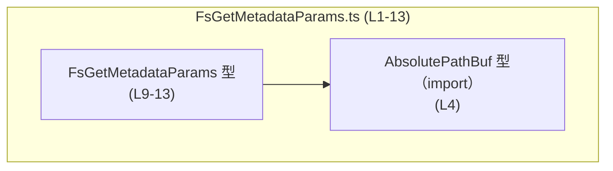
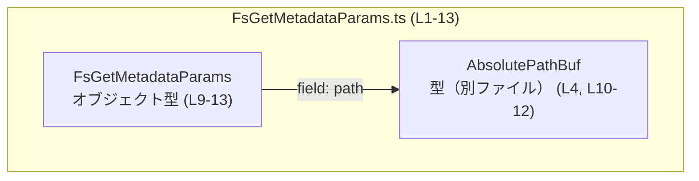

# app-server-protocol/schema/typescript/v2/FsGetMetadataParams.ts

---

## 0. ざっくり一言

このファイルは、**ファイルシステムメタデータ取得リクエストのパラメータを表す TypeScript 型 `FsGetMetadataParams` を定義する、自動生成コード**です（`FsGetMetadataParams.ts:L1-3, L9-13`）。

---

## 1. このモジュールの役割

### 1.1 概要

- このモジュールは、コメントに記載されている通り「絶対パスに対するメタデータ取得リクエスト」のためのパラメータ型 `FsGetMetadataParams` を提供します（`FsGetMetadataParams.ts:L6-9`）。
- パラメータは単一フィールド `path` を持ち、その型として別モジュールの `AbsolutePathBuf` を利用します（`FsGetMetadataParams.ts:L4, L9-13`）。

### 1.2 アーキテクチャ内での位置づけ

- 依存関係（このチャンクから分かる範囲）は次の通りです。

  - `FsGetMetadataParams` は `AbsolutePathBuf` に依存します（`import type { AbsolutePathBuf } from "../AbsolutePathBuf";` `FsGetMetadataParams.ts:L4`）。
  - `FsGetMetadataParams` 自体は `export type` として公開され、他モジュールから参照される前提で定義されています（`FsGetMetadataParams.ts:L9-13`）。

以下の Mermaid 図は、このファイル内の依存関係を表します（行番号付き）。



### 1.3 設計上のポイント

- **自動生成コードであること**  
  - 冒頭コメントで「GENERATED CODE! DO NOT MODIFY BY HAND!」と明記されています（`FsGetMetadataParams.ts:L1-3`）。  
  - これは元となるスキーマ（Rust 側など）から `ts-rs` によって生成されていることを示します（`FsGetMetadataParams.ts:L3`）。
- **型専用インポートの利用**  
  - `import type { AbsolutePathBuf }` として読み込まれており、このファイルが **型情報のみ** を必要としていることが示されています（`FsGetMetadataParams.ts:L4`）。  
  - これにより、ビルド結果の JavaScript には実行時インポートが含まれない設計になっています。
- **シンプルなオブジェクト型エイリアス**  
  - `export type FsGetMetadataParams = { path: AbsolutePathBuf }` という、1 フィールドだけのオブジェクト型エイリアスです（`FsGetMetadataParams.ts:L9-13`）。
- **意味の説明がコメントで付与**  
  - `FsGetMetadataParams` および `path` に対して、JSDoc コメントで用途が説明されています（`FsGetMetadataParams.ts:L6-8, L10-12`）。

---

## 2. 主要な機能一覧

このファイルは実行時ロジックを含まず、**型定義のみ**を提供します。

- `FsGetMetadataParams`: ある絶対パスのメタデータを取得するリクエストのパラメータ型（`FsGetMetadataParams.ts:L6-8, L9-13`）

---

## 3. 公開 API と詳細解説

### 3.1 型一覧（構造体・列挙体など）

このチャンクに現れる型・インポートのインベントリーです。

| 名前 | 種別 | 定義/宣言位置 | 役割 / 用途 |
|------|------|---------------|-------------|
| `FsGetMetadataParams` | 型エイリアス（オブジェクト型） | `FsGetMetadataParams.ts:L6-8, L9-13` | 「絶対パスに対するメタデータ取得リクエスト」のパラメータを表す公開型。フィールド `path` を 1 つ持つ。 |
| `path` | フィールド（`FsGetMetadataParams` のプロパティ） | `FsGetMetadataParams.ts:L10-12, L13` | コメントで「Absolute path to inspect.」と説明される、対象パスを表すフィールド。型は `AbsolutePathBuf`。 |
| `AbsolutePathBuf` | 型（別ファイルからの import） | `FsGetMetadataParams.ts:L4` | `../AbsolutePathBuf` から型だけをインポートしている。定義内容はこのチャンクには現れない。 |

> 注: `AbsolutePathBuf` の中身・具体的構造はこのファイルには定義されていないため、ここからは分かりません。

### 3.2 関数詳細

- このファイルには **関数・メソッド・クラスコンストラクタなどの実行時ロジックは定義されていません**（全行を確認しても `function`, `=>`, `class`, `async` などが存在しないため `FsGetMetadataParams.ts:L1-13`）。

そのため、「関数詳細」テンプレートを適用できる対象はありません。

### 3.3 その他の関数

- 該当なし（このチャンクには関数が現れません）。

---

## 4. データフロー

ここでは、「データの構造と型依存関係」という観点でのフローを示します（実行時の呼び出しフローは、このチャンクからは分かりません）。

### 型レベルのデータ構造と依存関係

`FsGetMetadataParams` の構造は非常に単純です。

- `FsGetMetadataParams` はオブジェクト型で、プロパティは `path` の 1 つだけです（`FsGetMetadataParams.ts:L9-13`）。
- `path` は `AbsolutePathBuf` 型であり、意味として「Absolute path to inspect.」とコメントされています（`FsGetMetadataParams.ts:L10-12`）。
- `AbsolutePathBuf` 自体は別ファイル定義であり、このチャンクからは内部構造やバリデーション内容などは分かりません（`FsGetMetadataParams.ts:L4`）。

これをデータ構造的な関係図として表すと、次のようになります。



- 実際の使用時には、「`AbsolutePathBuf` 型の値」を `path` に入れたオブジェクトが `FsGetMetadataParams` として扱われる、ということだけがこのファイルから確実に言えます。

---

## 5. 使い方（How to Use）

### 5.1 基本的な使用方法

このファイルは型定義のみを提供するため、**利用側のコード**では「`FsGetMetadataParams` 型の値を構築して、どこかの関数・API に渡す」形になります。

以下は、型の利用イメージです（`AbsolutePathBuf` の具体的な生成方法はこのチャンクからは分からないため、コメントで省略します）。

```typescript
// 型をインポートする（パスはプロジェクト構成に応じて変更）
import type { FsGetMetadataParams } from "./FsGetMetadataParams"; // 例: 相対パスは適宜調整する

// 別モジュールから AbsolutePathBuf をインポート
import type { AbsolutePathBuf } from "../AbsolutePathBuf";       // FsGetMetadataParams.ts:L4 に対応

// FsGetMetadataParams 型の値を作成する例
const absolutePath: AbsolutePathBuf = /* AbsolutePathBuf 型の値を用意する */ null as any; // 具体的な生成方法はこのチャンクには現れない

const params: FsGetMetadataParams = {
    // コメントに「Absolute path to inspect.」とある path フィールドに値を設定する（FsGetMetadataParams.ts:L10-12）
    path: absolutePath,
};

// 例えば、どこかの関数が FsGetMetadataParams を受け取る場合の呼び出しイメージ
function getMetadata(params: FsGetMetadataParams) {
    // この関数の実装は別モジュール側（このチャンクには存在しない）
}

getMetadata(params);
```

この例から分かるポイント:

- `FsGetMetadataParams` は **ただのオブジェクト型** なので、通常のリテラル `{ path: ... }` で作成できます（`FsGetMetadataParams.ts:L9-13`）。
- `path` に代入する値は `AbsolutePathBuf` 型でなければなりません（型チェック時の制約）。

### 5.2 よくある使用パターン（推測を含まない範囲）

このチャンクから確実に言える使用パターンは、次の程度に留まります。

- **型注釈としての利用**  
  - 関数パラメータに `params: FsGetMetadataParams` と付ける（型として使用する）。  
    これは `export type` されている事実から自然に想定されます（`FsGetMetadataParams.ts:L9`）。
- **オブジェクト構築時の型チェック**  
  - オブジェクトリテラルに `FsGetMetadataParams` 型をつけて、`path` フィールドの存在と型をコンパイル時にチェックする。

実際の API 名やエンドポイント名・呼び出し元/先はこのチャンクには現れないため、そこまでは言及しません。

### 5.3 よくある間違い（この型から読み取れる範囲）

この型定義から、TypeScript の型システム的に起こり得る誤用とその防止について述べます。

- **`path` を省略する**  
  - `FsGetMetadataParams` は `{ path: AbsolutePathBuf }` という必須プロパティ 1 つのオブジェクト型です（`FsGetMetadataParams.ts:L9-13`）。  
  - `{}` や `{ other: ... }` のように `path` を含まないオブジェクトを `FsGetMetadataParams` として扱うと、コンパイル時にエラーになります。

- **`path` に別の型（例: `string`）を入れる**  
  - `path` の型は `AbsolutePathBuf` であり、`string` や他の型はそのままでは代入できません（`FsGetMetadataParams.ts:L10-13`）。  
  - これは TypeScript の型チェックによって検出されます。

```typescript
import type { FsGetMetadataParams } from "./FsGetMetadataParams";

// ❌ 間違い例: path が string 型
const badParams: FsGetMetadataParams = {
    // TypeScript の型チェックではここでエラーになる（path は AbsolutePathBuf 型が必要）
    path: "/tmp/file.txt", // string
};
```

### 5.4 使用上の注意点（まとめ）

- **自動生成コードのため、直接編集しないこと**  
  - ファイル冒頭に「GENERATED CODE! DO NOT MODIFY BY HAND!」と明記されています（`FsGetMetadataParams.ts:L1`）。  
  - スキーマの変更が必要な場合は、このファイルではなく **生成元**（ts-rs が参照する定義）を修正する必要があります。
- **実行時コストについて**  
  - このファイルは型定義とコメントのみで構成されており、`import type` により実行時コードには反映されません（`FsGetMetadataParams.ts:L4, L9-13`）。  
  - そのため、ランタイムのパフォーマンスやメモリ使用量への影響はありません。
- **セキュリティ上の観点（この型から言える範囲）**  
  - この型自体はただの型情報であり、パスの正当性チェックやアクセス制御などは一切行いません（実行ロジックが存在しないため `FsGetMetadataParams.ts:L1-13`）。  
  - 実際のセキュリティ対策（パスの検証など）は、この型を受け取る側の実装に依存します。このファイルからはその実装内容は分かりません。

---

## 6. 変更の仕方（How to Modify）

### 6.1 新しい機能を追加する場合

- このファイルは `ts-rs` による **自動生成コード** と明記されているため（`FsGetMetadataParams.ts:L1-3`）、直接の編集は意図されていません。
- そのため、**追加のパラメータフィールドを持たせたい場合**などは、次のような方針になります。

  1. 生成元（ts-rs が参照する側、通常は Rust など別言語の型定義）で `FsGetMetadataParams` に相当する型にフィールドを追加する。  
     - 生成元ファイルの場所はこのチャンクには現れないため、ここでは「生成元」とだけ記載します。
  2. `ts-rs` のコード生成を再実行すると、この TypeScript ファイルの内容も更新されます。
  3. その結果として、新しいフィールドが `export type FsGetMetadataParams = { ... }` の中に追加されることが期待されます。

このチャンクには生成元や生成コマンドは現れないため、具体的な手順やファイルパスまでは特定できません。

### 6.2 既存の機能を変更する場合

- **`FsGetMetadataParams` のフィールド名や型を変えたい**場合も、同様に **生成元の定義を変更すべき**です（`FsGetMetadataParams.ts:L1-3`）。
- 変更時に注意すべき点（このファイルから明らかなもの）:

  - `FsGetMetadataParams` は `export type` として公開されているため（`FsGetMetadataParams.ts:L9`）、プロジェクト内の他の TypeScript コードがこの型に依存している可能性があります。
  - フィールド名や型を変更すると、それらの利用箇所も同時に修正する必要があります。
  - `AbsolutePathBuf` の型定義を変更する場合は、`../AbsolutePathBuf` 側の生成元とその利用箇所も確認する必要があります（`FsGetMetadataParams.ts:L4`）。

---

## 7. 関連ファイル

このチャンクから識別できる、密接に関係するファイルは次の通りです。

| パス（相対） | 役割 / 関係 |
|-------------|------------|
| `../AbsolutePathBuf` | `AbsolutePathBuf` 型の定義を提供するモジュール。`FsGetMetadataParams` の `path` フィールドの型として利用されています（`FsGetMetadataParams.ts:L4, L10-13`）。定義内容はこのチャンクには現れません。 |
| （生成元ファイル） | コメントより、この TypeScript ファイルは `ts-rs` によって生成されたことが分かります（`FsGetMetadataParams.ts:L3`）。元のスキーマ（おそらく Rust 側の型定義）は別リポジトリまたは別ディレクトリに存在しますが、このチャンクからはパスやファイル名は特定できません。 |

---

### 付記: 契約・エッジケース・テスト・パフォーマンス等について（このチャンクから言える範囲）

- **契約（Contract）**  
  - `FsGetMetadataParams` の契約は、「`path` フィールドを必ず持ち、その型が `AbsolutePathBuf` であるオブジェクト」である、という点に集約されます（`FsGetMetadataParams.ts:L9-13`）。
- **エッジケース**  
  - 型レベルでは、`path` が欠けている、`null` や `undefined` を直接指定する、`AbsolutePathBuf` 以外の型を指定する等はコンパイル時に検出される可能性があります。  
  - `AbsolutePathBuf` がどのような値を許容するか（空文字列、無効なパスなど）はこのチャンクからは分かりません。
- **テスト**  
  - このファイルにはテストコードは含まれていません（`FsGetMetadataParams.ts:L1-13`）。テストは別ファイルにある可能性がありますが、このチャンクには現れません。
- **パフォーマンス・スケーラビリティ**  
  - 型専用の定義ファイルであり、ランタイムのコストに直接影響する要素はありません（`import type` のみを使用しているため `FsGetMetadataParams.ts:L4`）。
- **観測性（ログ等）**  
  - ログ・メトリクス・トレース等のコードは存在せず、観測性に関する情報もこのチャンクにはありません（`FsGetMetadataParams.ts:L1-13`）。
