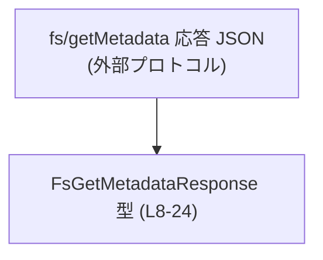
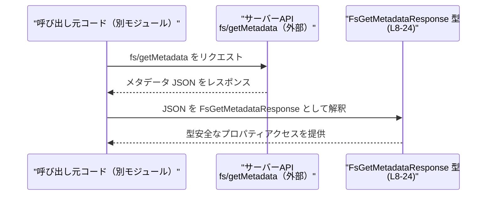

# app-server-protocol/schema/typescript/v2/FsGetMetadataResponse.ts コード解説

## 0. ざっくり一言

`fs/getMetadata` という API の応答として返される、ファイル／ディレクトリのメタデータを表す TypeScript 型エイリアスです（FsGetMetadataResponse.ts:L5-8）。  

---

## 1. このモジュールの役割

### 1.1 概要

- このモジュールは、ファイルシステム API `fs/getMetadata` の戻り値の構造を TypeScript の型として表現するために存在します（FsGetMetadataResponse.ts:L5-8）。
- パスがディレクトリかファイルか、および作成・更新時刻（ミリ秒）の 4 つの情報を提供します（FsGetMetadataResponse.ts:L9-24）。
- 実行ロジックや関数は含まず、**純粋なデータ構造の定義**のみを行います（FsGetMetadataResponse.ts:L8-24）。

### 1.2 アーキテクチャ内での位置づけ

このファイルは、`fs/getMetadata` API の応答 JSON に対する TypeScript 側の型定義として機能します（FsGetMetadataResponse.ts:L5-8）。  
他モジュールからインポートされて使用されることが想定されますが、このチャンクには具体的な利用側コードは現れません。

想定される関係を、コメントに基づく**データの対応関係**として図示します（実在モジュール名は不明のため抽象ラベルにしています）。



- ノード A: サーバー側が返す JSON ペイロード（コード外の存在）
- ノード B: そのペイロードの構造を表す TypeScript 型エイリアス

### 1.3 設計上のポイント

- **生成コードであること**  
  - 冒頭に「GENERATED CODE」「Do not edit this file manually」と明示されています（FsGetMetadataResponse.ts:L1-3）。
  - Rust 側の型から [ts-rs](https://github.com/Aleph-Alpha/ts-rs) によって自動生成された TypeScript 定義です（FsGetMetadataResponse.ts:L3）。
- **純粋なデータ型**  
  - 関数やクラスはなく、`export type FsGetMetadataResponse = { ... }` だけが公開 API です（FsGetMetadataResponse.ts:L8-24）。
  - 副作用や状態は持たず、並行性やエラーハンドリングのロジックはこのファイルには存在しません。
- **0 を「不明値」とするタイムスタンプ表現**  
  - `createdAtMs` / `modifiedAtMs` は、値が取得できない場合に `0` を使うとコメントされています（FsGetMetadataResponse.ts:L17-23）。
  - Unix ミリ秒で表現される点もコメントに明示されています（FsGetMetadataResponse.ts:L17-23）。

---

## 2. 主要な機能一覧

このファイルが提供する主な「機能」は、1 つの型定義に集約されています。

- `FsGetMetadataResponse`: `fs/getMetadata` API の応答メタデータを表現する型
  - `isDirectory`: パスがディレクトリかどうか
  - `isFile`: パスが通常ファイルかどうか
  - `createdAtMs`: 作成時刻（Unix ミリ秒、取得不可時は 0）
  - `modifiedAtMs`: 更新時刻（Unix ミリ秒、取得不可時は 0）

### 2.1 コンポーネント一覧（インベントリー）

このチャンク内に登場する型／フィールドの一覧です。

| 名前                    | 種別           | 行範囲                         | 説明 |
|-------------------------|----------------|--------------------------------|------|
| `FsGetMetadataResponse` | 型エイリアス   | `FsGetMetadataResponse.ts:L8-24`  | `fs/getMetadata` のメタデータ応答全体を表すオブジェクト型 |
| `isDirectory`           | フィールド     | `FsGetMetadataResponse.ts:L9-12`  | パスがディレクトリかどうかを示す真偽値 |
| `isFile`                | フィールド     | `FsGetMetadataResponse.ts:L13-16` | パスが通常ファイルかどうかを示す真偽値 |
| `createdAtMs`           | フィールド     | `FsGetMetadataResponse.ts:L17-20` | 作成時刻（Unix ミリ秒）。取得できない場合は `0` |
| `modifiedAtMs`          | フィールド     | `FsGetMetadataResponse.ts:L21-24` | 更新時刻（Unix ミリ秒）。取得できない場合は `0` |

---

## 3. 公開 API と詳細解説

### 3.1 型一覧（構造体・列挙体など）

| 名前                    | 種別         | 役割 / 用途 | 行範囲 |
|-------------------------|--------------|-------------|--------|
| `FsGetMetadataResponse` | 型エイリアス | `fs/getMetadata` の応答ボディの型。パスの種別とタイムスタンプ情報を保持する | `FsGetMetadataResponse.ts:L8-24` |

#### `FsGetMetadataResponse` のフィールド詳細

- `isDirectory: boolean`（FsGetMetadataResponse.ts:L9-12）  
  - パスが**現在ディレクトリとして解決されるかどうか**を示します。
- `isFile: boolean`（FsGetMetadataResponse.ts:L13-16）  
  - パスが**現在通常ファイルとして解決されるかどうか**を示します。
- `createdAtMs: number`（FsGetMetadataResponse.ts:L17-20）  
  - ファイル作成時刻を Unix ミリ秒（1970-01-01 UTC からのミリ秒）で表します。  
  - 利用可能な情報がない場合は `0` になります。
- `modifiedAtMs: number`（FsGetMetadataResponse.ts:L21-24）  
  - ファイル更新時刻を Unix ミリ秒で表します。  
  - 利用可能な情報がない場合は `0` になります。

### 3.2 関数詳細（最大 7 件）

このファイルには、**関数・メソッドは一切定義されていません**（FsGetMetadataResponse.ts:L1-24）。  
したがって、関数詳細の対象となる公開 API はありません。

### 3.3 その他の関数

- 該当なし（このチャンクには補助的な関数も存在しません）。

---

## 4. データフロー

このセクションでは、コメントに基づき、`FsGetMetadataResponse` が関与する典型的なデータの流れを概念的に説明します。

1. クライアントコードが `fs/getMetadata` API を呼び出す（この処理は他ファイル側で実装されている想定。現チャンクには登場しません）。
2. サーバーが JSON 形式でメタデータを返す。
3. TypeScript 側で、その JSON を `FsGetMetadataResponse` 型として扱うことで、プロパティの存在・型を静的に保証できます（FsGetMetadataResponse.ts:L5-8）。

これをシーケンス図として表現します。



> 注: サーバー実装や呼び出しコードはこのチャンクには存在しないため、上図はコメント（FsGetMetadataResponse.ts:L5-7）に基づく概念図です。

---

## 5. 使い方（How to Use）

### 5.1 基本的な使用方法

`FsGetMetadataResponse` を使って、`fs/getMetadata` の結果を型安全に扱う基本パターンの例です。  
インポートパスは実際のプロジェクト構造に応じて調整が必要です。

```typescript
// FsGetMetadataResponse 型をインポートする                          // このファイルから型をインポート（相対パスは例）
import type { FsGetMetadataResponse } from "./FsGetMetadataResponse"; // 型のみをインポートするので `type` を付けている

// fs/getMetadata の結果を受け取って処理する関数の例                 // 応答オブジェクトを受け取る関数
function handleMetadata(meta: FsGetMetadataResponse) {                // 引数 meta は FsGetMetadataResponse 型

    if (meta.isDirectory) {                                           // ディレクトリかどうかの判定
        console.log("Directory");                                     // ディレクトリの場合の処理
    } else if (meta.isFile) {                                         // 通常ファイルかどうかの判定
        console.log("File");                                          // ファイルの場合の処理
    } else {                                                          // どちらでもない（または不明）の場合
        console.log("Unknown type");                                  // 状態が特定できないケースの処理
    }

    if (meta.createdAtMs !== 0) {                                     // 作成時刻が利用可能かどうかを 0 との比較で判定
        const createdAt = new Date(meta.createdAtMs);                 // Unixミリ秒から Date オブジェクトを生成
        console.log("Created at:", createdAt.toISOString());         // ISO 文字列として出力
    }

    if (meta.modifiedAtMs !== 0) {                                    // 更新時刻が利用可能かどうかを 0 との比較で判定
        const modifiedAt = new Date(meta.modifiedAtMs);               // Unixミリ秒から Date オブジェクトを生成
        console.log("Modified at:", modifiedAt.toISOString());       // ISO 文字列として出力
    }
}
```

### 5.2 よくある使用パターン

1. **非同期 API 呼び出しとの組み合わせ**

```typescript
import type { FsGetMetadataResponse } from "./FsGetMetadataResponse"; // 型をインポート

// fs/getMetadata を叩く関数があると仮定した例                     // ここでは戻り値の型だけを示す
async function fetchMetadata(path: string): Promise<FsGetMetadataResponse> { // path を受けてメタデータを返す想定
    // 実際の HTTP / RPC 呼び出しはこのチャンクには存在しない         // 実装は別モジュールにある想定
    throw new Error("not implemented");                              // 実装はダミー
}

async function showMetadata(path: string) {                           // メタデータを取得して表示する関数
    const meta = await fetchMetadata(path);                           // FsGetMetadataResponse 型として結果を取得
    console.log(meta.isDirectory ? "Directory" : "Not directory");    // 型に基づきプロパティにアクセス
}
```

1. **型ナローイングを使わないシンプルな判定**

```typescript
import type { FsGetMetadataResponse } from "./FsGetMetadataResponse"; // 型をインポート

function isExistingPath(meta: FsGetMetadataResponse): boolean {       // パスが何らかのエントリに対応しているか判定
    return meta.isDirectory || meta.isFile;                           // どちらかが true なら「存在する」と見なす例
}
```

> 上記の「存在する」の意味はプロトコル仕様に依存します。このチャンクにはその仕様がないため、ここには一例として記載しています。

### 5.3 よくある間違い

この型定義から推測される、起こりがちな誤用パターンと正しい扱いです。

```typescript
import type { FsGetMetadataResponse } from "./FsGetMetadataResponse";

// 間違い例: createdAtMs / modifiedAtMs を常に有効な Date とみなす
function wrong(meta: FsGetMetadataResponse) {
    const created = new Date(meta.createdAtMs);    // 0 の場合も Date(0) = 1970-01-01 になってしまう
    console.log(created.toISOString());           // 「不明」を「1970-01-01」と誤解するおそれがある
}

// 正しい例: 0 の場合は「不明」とみなし、特別扱いする
function correct(meta: FsGetMetadataResponse) {
    if (meta.createdAtMs !== 0) {                 // 0 は「利用できない」を意味するとコメントにある（L17-20）
        const created = new Date(meta.createdAtMs);
        console.log(created.toISOString());
    } else {
        console.log("createdAt is unknown");      // 不明であることを明示的に扱う
    }
}
```

```typescript
// 間違い例: 「必ずどちらか一方だけが true」と決めつける
function wrong2(meta: FsGetMetadataResponse) {
    if (meta.isDirectory) {
        // ...
    } else {
        // else を「必ずファイル」と決めつけている                      // isFile が true かどうかはコード上は保証されていない
    }
}

// 正しい例: isDirectory と isFile をそれぞれ確認する
function correct2(meta: FsGetMetadataResponse) {
    if (meta.isDirectory) {
        // ディレクトリの処理
    } else if (meta.isFile) {
        // ファイルの処理
    } else {
        // どちらでもない、または不明なケースの処理                   // このチャンクの情報だけでは仕様は決まっていない
    }
}
```

### 5.4 使用上の注意点（まとめ）

- **生成ファイルを直接編集しない**  
  - 冒頭コメントにある通り、このファイルは ts-rs による生成物であり、手動編集は想定されていません（FsGetMetadataResponse.ts:L1-3）。
- **`0` を特別な意味として扱う必要がある**  
  - `createdAtMs` / `modifiedAtMs` が `0` の場合は「利用できない」を意味します（FsGetMetadataResponse.ts:L17-23）。  
    単に `Date(0)` として扱うと誤解を生みます。
- **`isDirectory` / `isFile` の関係は仕様不明**  
  - このチャンクからは、「必ずどちらか一方が true」「両方 true はあり得ない」といった制約は読み取れません（FsGetMetadataResponse.ts:L9-16）。  
    呼び出し側で強い前提を置く場合は、別途プロトコル仕様の確認が必要です。
- **並行性・スレッド安全性**  
  - この型はイミュータブルなオブジェクトリテラルとして扱われるのが一般的であり、型定義自体には並行性上の問題は含まれません。  
    ただし、JavaScript オブジェクトとして共有・書き換えする設計にした場合の競合状態などは、別のレイヤーの問題になります。

---

## 6. 変更の仕方（How to Modify）

### 6.1 新しい機能を追加する場合

このファイルは ts-rs によって生成されているため、**直接この TypeScript ファイルを編集するのは前提外**です（FsGetMetadataResponse.ts:L1-3）。

新しいメタデータ項目を追加したい場合の一般的な手順は次の通りです（元定義ファイルはこのチャンクには現れないため、抽象的な説明になります）。

1. **Rust 側の元型定義を探す**  
   - ts-rs の対象となっている構造体や型（例: `struct FsGetMetadataResponse` など）が存在するはずです（名称はこのチャンクからは不明）。
2. **Rust 側の構造体/フィールドを変更する**  
   - 追加したいメタデータ（例: `size`, `permissions` など）を Rust の型にフィールドとして追加します。
3. **ts-rs を再実行して TypeScript を再生成する**  
   - ビルドスクリプトや専用コマンドで再生成すると、本ファイルにも変更が反映されます。
4. **呼び出し側 TypeScript コードを更新する**  
   - 追加したフィールドを参照するコードを、`FsGetMetadataResponse` 型に基づき修正します。

### 6.2 既存の機能を変更する場合

既存フィールドの意味や型を変更する場合は、プロトコル互換性への影響が大きくなるため注意が必要です。

- **影響範囲の確認**
  - `FsGetMetadataResponse` をインポートしているすべての TypeScript ファイルが影響を受けます（具体的な使用箇所はこのチャンクには現れません）。
- **契約（プロトコル仕様）の保持**
  - `createdAtMs` / `modifiedAtMs` の「利用可能でない場合は `0`」という約束を変更すると、既存クライアントは挙動が変わる可能性があります（FsGetMetadataResponse.ts:L17-23）。
  - `isDirectory` / `isFile` の解釈を変更する場合も、条件分岐ロジックに影響します。
- **テストと検証**
  - 応答 JSON のサンプルに対して、生成された TypeScript 型で型チェックを行うテストがある場合、それらを更新する必要があります（テストコードはこのチャンクには含まれません）。

---

## 7. 関連ファイル

このチャンクには、具体的な関連ファイルへの import / export は一切記述されていません（FsGetMetadataResponse.ts:L1-24）。  
したがって、コードから直接読み取れる関連ファイルはありません。

推測できる関係としては次のようなものがありますが、いずれも**このチャンクには現れない**ため、あくまで一般的な構成の例です。

| パス（想定） | 役割 / 関係 |
|--------------|------------|
| （不明）Rust 側 ts-rs 対象ファイル | この TypeScript 型を生成する元の Rust 型定義。コメントから ts-rs 使用のみが分かる（FsGetMetadataResponse.ts:L3）。 |
| （不明）fs/getMetadata 呼び出しコード | `FsGetMetadataResponse` をインポートし、API 応答を型安全に扱うクライアントコード。 |

> 具体的なファイル名やディレクトリ構造は、このチャンクの情報だけでは判断できません。
