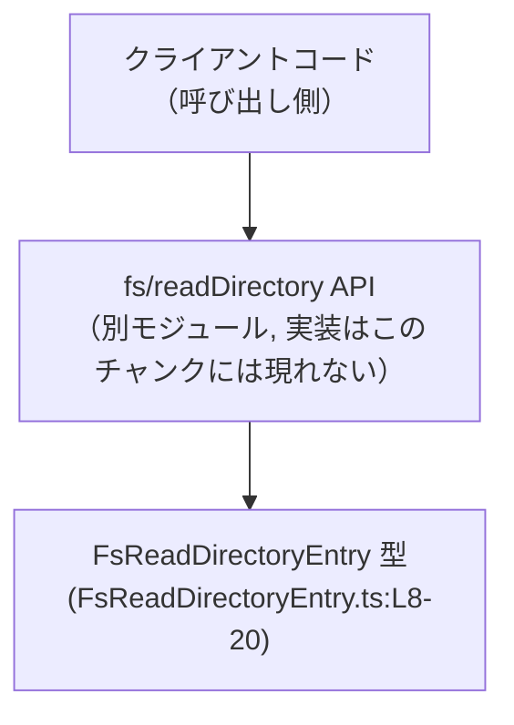
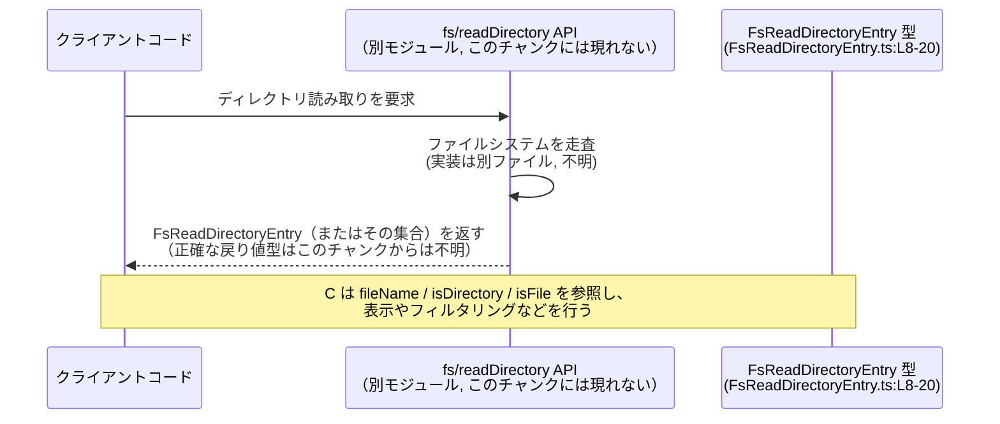

# app-server-protocol/schema/typescript/v2/FsReadDirectoryEntry.ts コード解説

## 0. ざっくり一言

`fs/readDirectory` という API から返される **ディレクトリエントリ 1 件分の情報** を表現する TypeScript の型定義です（FsReadDirectoryEntry.ts:L5-8）。

---

## 1. このモジュールの役割

### 1.1 概要

- このファイルは、ディレクトリ一覧取得 API（`fs/readDirectory`）の結果として返される **1 つのエントリ** のデータ構造を TypeScript で表現します（FsReadDirectoryEntry.ts:L5-8）。
- `fileName`・`isDirectory`・`isFile` の 3 つのプロパティだけを持つ、シンプルな **データコンテナ型** です（FsReadDirectoryEntry.ts:L8-20）。
- ファイル先頭のコメントにより、**Rust 側の型から ts-rs によって自動生成**されたコードであり、手動編集しないことが明示されています（FsReadDirectoryEntry.ts:L1-3）。

### 1.2 アーキテクチャ内での位置づけ

この型は、ファイルシステムを扱う何らかの API `fs/readDirectory`（実体はこのチャンクには現れません）の **戻り値の構造** を TypeScript 側で表現するために存在しているとコメントから読み取れます（FsReadDirectoryEntry.ts:L5-7）。



- クライアントコードは `fs/readDirectory` を呼び出し、その結果として `FsReadDirectoryEntry` 型のデータ（単体または集合）を受け取る、という関係がコメントから示唆されます（FsReadDirectoryEntry.ts:L5-7）。
- `FsReadDirectoryEntry` は `export type` で公開されているため、同一プロジェクト内の他ファイルからインポートして利用される **公開 API の一部** です（FsReadDirectoryEntry.ts:L8）。

`fs/readDirectory` の具体的なシグネチャや戻り値の形（単体か配列かなど）は、このチャンクには現れないため不明です。

### 1.3 設計上のポイント

- **自動生成コード**  
  - ファイル先頭のコメントに「GENERATED CODE」「ts-rs により生成」「手で編集しない」と明記されています（FsReadDirectoryEntry.ts:L1-3）。  
  - 実際に変更する場合は、生成元の Rust 型定義側を変更する設計になっています（生成元ファイルの場所はこのチャンクからは不明）。
- **純粋な型定義のみ**  
  - `export type` により **型エイリアス** としてオブジェクト構造が定義されており、クラスや関数は含まれていません（FsReadDirectoryEntry.ts:L8-20）。  
  - TypeScript の型エイリアスであり、コンパイル後の JavaScript には実体が出力されない **コンパイル時専用の情報** です。
- **単純なプリミティブ型のみ**  
  - プロパティの型は `string` と `boolean` のみで、ネスト構造や複雑な型はありません（FsReadDirectoryEntry.ts:L12, L16, L20）。
- **意味的な契約はコメントで表現**  
  - `fileName` が「絶対／相対パスではなく、直下の子エントリ名だけ」を表すこと（FsReadDirectoryEntry.ts:L9-12）  
  - `isDirectory` と `isFile` がそれぞれ「ディレクトリ」「通常ファイル」に解決されるかどうかを表すこと（FsReadDirectoryEntry.ts:L13-16, L17-20）  
  などの契約は JSDoc コメントで記述されていますが、型レベルの制約は `string` / `boolean` に留まっています。

---

## 2. 主要な機能一覧

（このファイルはロジックではなく型定義のみを提供します。）

- `FsReadDirectoryEntry` 型: `fs/readDirectory` が返すディレクトリエントリ 1 件の情報（名前・ディレクトリか・通常ファイルか）を保持する公開型（FsReadDirectoryEntry.ts:L5-8, L12-20）。

---

## 3. 公開 API と詳細解説

### 3.1 型一覧（構造体・列挙体など） ― コンポーネントインベントリー

このファイルに登場する型コンポーネントを一覧にします。

#### 型エイリアス

| 名前 | 種別 | 役割 / 用途 | 定義位置 |
|------|------|-------------|----------|
| `FsReadDirectoryEntry` | 型エイリアス（オブジェクト型） | `fs/readDirectory` によって返されるディレクトリエントリ 1 件を表現する。`fileName` / `isDirectory` / `isFile` の 3 プロパティを持つ。 | FsReadDirectoryEntry.ts:L8-20 |

#### フィールド（プロパティ）

| フィールド名 | 型 | 説明 | 根拠（コメント・定義位置） |
|--------------|----|------|----------------------------|
| `fileName` | `string` | 「直下の子エントリの名前のみ」を表す。絶対パスでも相対パスでもないことがコメントで明示されている。 | JSDoc コメント: FsReadDirectoryEntry.ts:L9-11、定義: FsReadDirectoryEntry.ts:L12 |
| `isDirectory` | `boolean` | このエントリが **ディレクトリに解決されるかどうか** を示すフラグ。 | コメント: FsReadDirectoryEntry.ts:L13-15、定義: FsReadDirectoryEntry.ts:L16 |
| `isFile` | `boolean` | このエントリが **通常ファイルに解決されるかどうか** を示すフラグ。 | コメント: FsReadDirectoryEntry.ts:L17-19、定義: FsReadDirectoryEntry.ts:L20 |

補足:

- TypeScript の `boolean` 型のため、型レベルでは `true/false` のいずれも許容され、`isDirectory` と `isFile` の組み合わせにも制限はありません（FsReadDirectoryEntry.ts:L16, L20）。  
  具体的な組み合わせの意味（両方 `false` や両方 `true` など）がどう扱われるかは、このチャンクからは分かりません。

### 3.2 関数詳細（最大 7 件）

このファイルには **関数・メソッド定義は一切含まれていません**。

- コメントとコードを確認しても、`export type FsReadDirectoryEntry = { ... }` 以外の `function`・`=>` を用いた関数式・クラスメソッドなどは登場しません（FsReadDirectoryEntry.ts:L1-20）。
- そのため、「関数詳細」テンプレートに該当する公開 API の関数はありません。

### 3.3 その他の関数

- 補助関数・ユーティリティ関数も含め、**関数は存在しません**（FsReadDirectoryEntry.ts:L1-20）。
- このファイルは純粋に「型情報のみ」を提供する役割です。

---

## 4. データフロー

この節では、`FsReadDirectoryEntry` 型が典型的にどのように使われるかという **データの流れ** を、コメントから読み取れる範囲で整理します。

### 4.1 想定される処理シナリオ

コメントにより、`FsReadDirectoryEntry` は `fs/readDirectory` から返されるディレクトリエントリを表すことが示されています（FsReadDirectoryEntry.ts:L5-7）。  
この情報から、次のような流れが想定されます（`fs/readDirectory` の具体的な戻り値の形はこのチャンクからは不明です）：

1. クライアントコードが `fs/readDirectory` API を呼び出す。
2. `fs/readDirectory` API がファイルシステムのディレクトリを走査し、各エントリを内部表現から `FsReadDirectoryEntry` にマッピングする（この処理の実装はこのチャンクには現れません）。
3. クライアント側は戻り値として受け取った `FsReadDirectoryEntry`（単体またはその集合）を用いて UI 表示や後続処理を行う。

### 4.2 シーケンス図

以下は上記シナリオをシーケンス図で表したものです。`FsReadDirectoryEntry` 型定義は FsReadDirectoryEntry.ts:L8-20 に位置します。



- **重要な点**: このチャンクには `fs/readDirectory` のシグネチャや戻り値の正確な型は現れません。  
  図中の「単体またはその集合」という表現は、コメントに基づく一般的な想定であり、厳密な仕様ではありません。

---

## 5. 使い方（How to Use）

このファイルは型エイリアスのみを提供しますが、TypeScript ではこの型を使うことで **型安全にディレクトリエントリ情報を扱う** ことができます。

### 5.1 基本的な使用方法

`FsReadDirectoryEntry` 型の値を受け取り、ログ出力する関数の例です。  
インポートパスは実際のプロジェクト構成に応じて調整が必要です。

```typescript
// FsReadDirectoryEntry 型をインポートする                         // 型エイリアスのみなので import type を使うのが慣例
import type { FsReadDirectoryEntry } from "./FsReadDirectoryEntry"; // 実際のパスはプロジェクト構成に依存する

// 1件のディレクトリエントリを受け取り、内容をログに出す関数     // FsReadDirectoryEntry 型を引数の型として利用
function logEntry(entry: FsReadDirectoryEntry): void {             // entry は必ず fileName / isDirectory / isFile を持つ
    console.log("name:", entry.fileName);                          // string 型の fileName を参照
    console.log("isDirectory:", entry.isDirectory);                // boolean 型の isDirectory を参照
    console.log("isFile:", entry.isFile);                          // boolean 型の isFile を参照
}
```

この例から分かるポイント:

- `entry.fileName` を文字列として扱えることがコンパイル時に保証されます（FsReadDirectoryEntry.ts:L12）。
- `isDirectory` / `isFile` は `boolean` であることが型チェックされ、誤って数値などを代入するとコンパイルエラーになります（FsReadDirectoryEntry.ts:L16, L20）。
- `FsReadDirectoryEntry` は型エイリアスなので、実行時に `typeof FsReadDirectoryEntry` のような操作はできません（TypeScript の仕様による）。

### 5.2 よくある使用パターン

#### パターン1: ディレクトリだけをフィルタする

`FsReadDirectoryEntry` の配列を受け取り、ディレクトリだけを抽出する例です。  
ここでは「どこか別の場所で `FsReadDirectoryEntry[]` が用意されている」と仮定しています（その取得元はこのチャンクには現れません）。

```typescript
import type { FsReadDirectoryEntry } from "./FsReadDirectoryEntry"; // 型のインポート

// ディレクトリエントリ一覧からディレクトリのみを抽出する関数
function filterDirectories(entries: FsReadDirectoryEntry[]): FsReadDirectoryEntry[] {
    // isDirectory が true のものだけを残す                          // boolean フラグを使ったシンプルなフィルタ
    return entries.filter((e) => e.isDirectory);
}
```

#### パターン2: 親ディレクトリと組み合わせてフルパスを作る

`fileName` は「絶対・相対パスではない」ことがコメントで明示されているため（FsReadDirectoryEntry.ts:L9-11）、  
呼び出し側で親ディレクトリと連結して利用するパターンが考えられます。

```typescript
import type { FsReadDirectoryEntry } from "./FsReadDirectoryEntry";

// 親ディレクトリパスとエントリを組み合わせてフルパス文字列を作る
function buildFullPath(parentPath: string, entry: FsReadDirectoryEntry): string {
    // 非推奨: 文字列結合の実装詳細は環境に依存                        // ここでは単純な例として "/" で結合
    return `${parentPath}/${entry.fileName}`;                       // fileName は子エントリ名のみ（FsReadDirectoryEntry.ts:L9-12）
}
```

この例は `fileName` が「子エントリ名のみ」であるという契約に基づく利用方法です。

### 5.3 よくある間違い（想定される誤用）

コードから直接「誤用の頻出パターン」は分かりませんが、コメント内容に基づいて起こり得る誤用例を挙げます。

```typescript
import type { FsReadDirectoryEntry } from "./FsReadDirectoryEntry";

// 間違い例: fileName を完全なパスであると誤解して扱う
function openAsIfAbsolutePath(entry: FsReadDirectoryEntry) {
    // NG例: fileName が絶対パスではない前提なのに、そのまま渡してしまう
    someApiThatExpectsAbsolutePath(entry.fileName);  // fileName は「直下の子名のみ」（FsReadDirectoryEntry.ts:L9-11）
}

// 正しい方向性の例: 親パスと組み合わせてから使う
function openWithParentPath(parentPath: string, entry: FsReadDirectoryEntry) {
    const fullPath = `${parentPath}/${entry.fileName}`; // フルパスを構成する
    someApiThatExpectsAbsolutePath(fullPath);           // 絶対パスを期待するAPIに渡す
}
```

- `fileName` は絶対パスや相対パスではないため、そのまま「絶対パスを期待する API」に渡す設計はコメントと矛盾します（FsReadDirectoryEntry.ts:L9-11）。

### 5.4 使用上の注意点（まとめ）

- **fileName の意味**  
  - `fileName` は「直下の子エントリ名のみ」とコメントされていますが、型は `string` のみであり、実際にどのような文字列が入ってくるかは送信側実装に依存します（FsReadDirectoryEntry.ts:L9-12）。  
  - パスセパレータや `..` などが含まれていないことは TypeScript 型レベルでは保証されません。
- **isDirectory / isFile の組み合わせ**  
  - 両方とも `boolean` であり、型レベルでは `true/false` の任意の組み合わせを許容します（FsReadDirectoryEntry.ts:L16, L20）。  
  - 「どの値の組み合わせが有効か」はプロトコル仕様に依存し、このチャンクからは判断できません。
- **並行性・非同期性**  
  - このファイルには非同期処理や共有状態は含まれておらず、並行性やスレッド安全性に関する懸念はありません。  
  - これらは `fs/readDirectory` の実装側（別モジュール）で扱われる内容です。

---

## 6. 変更の仕方（How to Modify）

### 6.1 新しい機能を追加する場合

このファイルは **ts-rs によって自動生成**されることがコメントで明示されています（FsReadDirectoryEntry.ts:L1-3）。そのため、次の点が前提になります。

1. **この TypeScript ファイルを直接編集しない**  
   - コメントに「DO NOT MODIFY BY HAND!」とある通り、手動編集は想定されていません（FsReadDirectoryEntry.ts:L1-3）。
2. **元の Rust 定義に変更を加える**  
   - 新しいフィールドを追加したい場合は、生成元の Rust の構造体（ts-rs の対象）にフィールドを追加する必要があります。  
   - 生成元のファイルパスや型名はこのチャンクには記載されていないため、不明です。
3. **ts-rs の再実行**  
   - Rust 側を変更した後、ts-rs のコード生成プロセスを再度実行することで、この TypeScript ファイルが更新される想定です（詳細なビルドステップはこのチャンクからは分かりません）。

### 6.2 既存の機能を変更する場合

`FsReadDirectoryEntry` は型定義のみのため、「機能」というよりは **データ契約** を表します。

- **影響範囲の確認**  
  - `FsReadDirectoryEntry` をインポートしている全ての TypeScript ファイルが影響を受けます。  
  - 具体的な使用箇所はこのチャンクには現れないため、プロジェクト全体での検索が必要です。
- **契約（コメント）との一貫性**  
  - 例: `fileName` の意味を変えたい場合は、JSDoc コメント（FsReadDirectoryEntry.ts:L9-11）と生成元の Rust 側コメントの両方を整合させる必要があります。
- **型の互換性**  
  - 既存コードが `FsReadDirectoryEntry` を前提にコンパイルされているため、フィールド名や型を変更するとコンパイルエラーが発生します。  
  - 互換性維持のためには、新フィールドをオプション（`?:`）として追加するなどの方針が考えられますが、そのような変更が ts-rs 側でどう表現されるかは、このチャンクからは分かりません。

---

## 7. 関連ファイル

このチャンクから直接分かる関連コンポーネントは限定的です。コメントやツール名から推測できる範囲を「推測であること」を明示して整理します。

| パス / 名前 | 役割 / 関係 | 備考 |
|-------------|------------|------|
| `fs/readDirectory`（API 名称のみ） | この型が「エントリを返す API」としてコメントに記載されている。`FsReadDirectoryEntry` の利用元とみなせる。 | 実際の実装ファイルのパスや言語（Rust/TypeScript など）は、このチャンクには現れません（FsReadDirectoryEntry.ts:L5-7）。 |
| ts-rs の生成元 Rust 型（パス不明） | `FsReadDirectoryEntry` の元になっている Rust 側の型。ts-rs によりこの TypeScript 型が生成される。 | 生成元ファイルや型名はコメントに記載されていないため不明ですが、「This file was generated by ts-rs」と明示されています（FsReadDirectoryEntry.ts:L1-3）。 |

---

## 付録: 安全性・エラー・並行性・エッジケースの観点

### 安全性・セキュリティ

- **パス関連の安全性**  
  - `fileName` が「子エントリ名のみ」であるという契約（FsReadDirectoryEntry.ts:L9-11）は、パス結合時に上位ディレクトリへの意図しないアクセスを避ける上で重要な情報です。  
  - ただし、型は単なる `string` であり、実際にどのような値が入ってくるかは送信側実装に依存するため、値検証やサニタイズの有無はこのチャンクからは分かりません。
- **型安全性（TypeScript 固有）**  
  - `fileName: string` と `isDirectory/isFile: boolean` によって、呼び出し側はこれらのプロパティを誤った型で扱うことをコンパイル時に防げます（FsReadDirectoryEntry.ts:L12, L16, L20）。

### エッジケース（Contract / Edge Cases）

- `fileName` が空文字列、極端に長い文字列、パスセパレータや制御文字を含む場合の扱いは、この型定義からは分かりません。
- `isDirectory` / `isFile` の組み合わせについて:
  - 両方 `false` になるケース（例: その他のファイル種別）や両方 `true` になるケースが許容されるかどうかは、プロトコル仕様次第であり、このチャンクには現れません。
  - TypeScript 側では、これらを禁止するような追加の型表現（ユニオン型や列挙型）は用いられていません（FsReadDirectoryEntry.ts:L16-20）。

### エラー・並行性・パフォーマンス

- このファイルには実行時コード（関数や I/O）は含まれていないため、**例外処理・エラー型・並行性制御・性能上のボトルネック**に関する情報は存在しません（FsReadDirectoryEntry.ts:L1-20）。
- これらは `fs/readDirectory` の実装や、この型を利用する上位レイヤーの責務となります。
