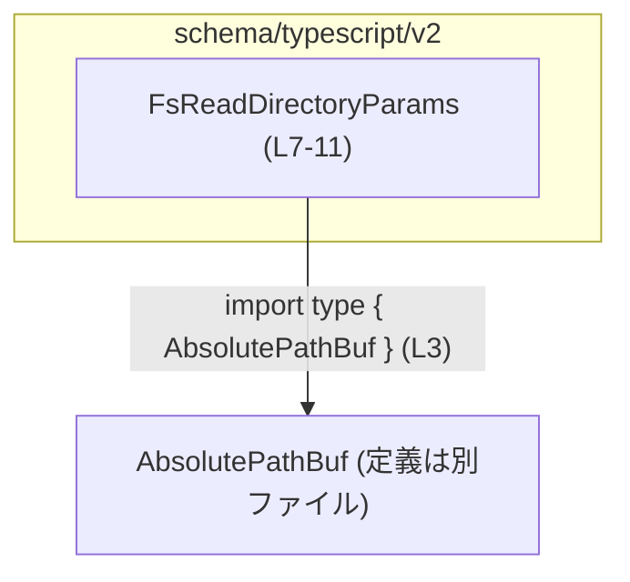
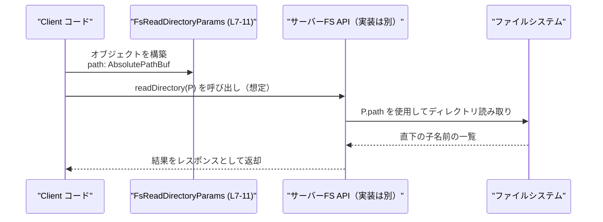

# app-server-protocol/schema/typescript/v2/FsReadDirectoryParams.ts

## 0. ざっくり一言

ディレクトリ配下の子要素名を列挙する処理に渡す、「読むべきディレクトリの絶対パス」を表現するパラメータ型を定義した、コード生成された TypeScript 型定義ファイルです。  
（`FsReadDirectoryParams.ts:L1-3, L4-6, L7-11`）

---

## 1. このモジュールの役割

### 1.1 概要

- このモジュールは、ディレクトリ読み取り処理のための入力パラメータを型で表現するために存在します。`FsReadDirectoryParams` 型は「どのディレクトリの子を列挙するか」を示す絶対パスを 1 フィールドとして持ちます。  
  （`FsReadDirectoryParams.ts:L4-6, L7-11`）
- ファイル先頭コメントから、このファイルは Rust 側の定義から `ts-rs` によって自動生成されており、手動編集を前提としていません。  
  （`FsReadDirectoryParams.ts:L1-3`）

### 1.2 アーキテクチャ内での位置づけ

- このファイルは `app-server-protocol/schema/typescript/v2` 以下にあり、アプリケーションサーバーとクライアントの間でやりとりされるプロトコルの TypeScript スキーマ（型定義）の一部と考えられます（ディレクトリパスから推測）。  
  （**推測**であり、このチャンクのコードのみからは完全には断定できません）
- `FsReadDirectoryParams` は、`AbsolutePathBuf` 型を利用してパスを表現します。`AbsolutePathBuf` 自体の定義は別ファイルにあり、このチャンクには現れません。  
  （`FsReadDirectoryParams.ts:L3, L7-11`）

Mermaid での簡略依存関係図です（ラベルに行番号を付与しています）。



### 1.3 設計上のポイント

- **コード生成ファイル**  
  - 先頭コメントにより、このファイルは `ts-rs` による自動生成であり、手動編集禁止であると明記されています。  
    （`FsReadDirectoryParams.ts:L1-3`）
- **純粋な型定義モジュール**  
  - 実行時ロジックや関数は含まず、`export type` によるオブジェクト型エイリアスのみを公開します。  
    （`FsReadDirectoryParams.ts:L7-11`）
- **型安全なパス表現**  
  - パスは単なる `string` ではなく、`AbsolutePathBuf` 型を通して表現されます。これにより、「絶対パス」であることやフォーマットの制約などを型として共有できる設計になっています（具体的な制約内容はこのチャンクからは不明）。  
    （`FsReadDirectoryParams.ts:L3, L7-11`）

---

## 2. 主要な機能一覧

このモジュールは関数を持たず、1 つの公開型のみを提供します。

- `FsReadDirectoryParams`: 指定したディレクトリの直下の子名前を列挙するためのパラメータ型（絶対パス 1 フィールドのみ）。  
  （`FsReadDirectoryParams.ts:L4-6, L7-11`）

---

## 3. 公開 API と詳細解説

### 3.1 型一覧（構造体・列挙体など）

このファイルに登場する型と、その役割・定義位置の一覧です。

| 名前                    | 種別                           | 役割 / 用途                                                                                     | 定義位置                                  |
|-------------------------|--------------------------------|--------------------------------------------------------------------------------------------------|-------------------------------------------|
| `FsReadDirectoryParams` | オブジェクト型の型エイリアス   | ディレクトリの直下の子要素名を列挙する処理に渡すパラメータ。`path` フィールドに絶対パスを保持します。 | `FsReadDirectoryParams.ts:L4-6, L7-11`    |
| `AbsolutePathBuf`       | インポートされた型（詳細不明） | 絶対パスを表現する型。ディレクトリパスの型安全な表現として利用されます。                           | インポートのみ（定義は別ファイル、L3）    |

#### `FsReadDirectoryParams` の構造

```typescript
// ディレクトリの直下の子名前を列挙するためのパラメータ           // FsReadDirectoryParams.ts:L4-7
export type FsReadDirectoryParams = {                              // L7
    /**
     * Absolute directory path to read.                           // L8-10
     */
    path: AbsolutePathBuf,                                         // L11
};
```

- プロパティ:
  - `path: AbsolutePathBuf`  
    - 読み取るべきディレクトリの絶対パス。  
      （コメントより「Absolute directory path to read.」と明記。`FsReadDirectoryParams.ts:L8-11`）

### 3.2 関数詳細（最大 7 件）

このファイルには関数・メソッドは定義されていません。  
（`FsReadDirectoryParams.ts:L1-11` 全体に `function` / `=>` などの関数定義が存在しません）

### 3.3 その他の関数

同様に、ユーティリティ関数やラッパー関数も存在しません。

| 関数名 | 役割 |
|--------|------|
| （なし） | このファイルには関数定義がありません |

---

## 4. データフロー

このモジュール自体には処理ロジックはありませんが、コメントと型名から想定される典型的なデータフローを示します。  
（このセクションは**利用シナリオの推測**であり、実装詳細はこのチャンクからは分かりません）

1. クライアントコードが `FsReadDirectoryParams` 型のオブジェクトを生成し、`path` に目的のディレクトリの絶対パスを設定する。  
   （`FsReadDirectoryParams.ts:L7-11`）
2. そのオブジェクトが、ファイルシステムの「ディレクトリ読み取り」API（例えば RPC や HTTP 経由のサーバー API）の引数として渡される。
3. サーバー側は `path` を用いて実際のファイルシステムにアクセスし、指定ディレクトリ直下の子要素名を列挙する。  
   （「List direct child names for a directory.」コメントからの推測。`FsReadDirectoryParams.ts:L4-6`）

この想定シナリオに対するシーケンス図です。



---

## 5. 使い方（How to Use）

### 5.1 基本的な使用方法

`FsReadDirectoryParams` は単純なオブジェクト型なので、通常はオブジェクトリテラルを用いて値を作成し、ファイルシステム API に渡す形で利用されます。

```typescript
import type { FsReadDirectoryParams } from "./FsReadDirectoryParams"; // パラメータ型のインポート
import type { AbsolutePathBuf } from "../AbsolutePathBuf";            // パス型のインポート

// 仮のヘルパー関数：文字列から AbsolutePathBuf を作ると想定            // 実際の実装はこのチャンクにはありません
declare function toAbsolutePath(path: string): AbsolutePathBuf;

// ディレクトリ読み取りパラメータを構築する
const params: FsReadDirectoryParams = {                               // 型注釈により path フィールドが必須になる
    path: toAbsolutePath("/var/log"),                                 // 絶対パスとしての AbsolutePathBuf を設定
};

// 仮の API 呼び出し例（インターフェース名と引数は例示）
// declare function fsReadDirectory(params: FsReadDirectoryParams): Promise<string[]>;
// const entries = await fsReadDirectory(params);
```

- この例では、`FsReadDirectoryParams` によって `path` フィールドが必須で `AbsolutePathBuf` 型であることがコンパイル時に保証されます。  
  （`FsReadDirectoryParams.ts:L7-11`）

### 5.2 よくある使用パターン

1. **固定ディレクトリの列挙**

```typescript
const logsDirParams: FsReadDirectoryParams = {
    path: toAbsolutePath("/var/log/my-app"),  // アプリ専用ログディレクトリ
};
```

1. **ユーザー入力に基づく列挙（バリデーション前提）**

```typescript
function makeParamsFromUserInput(input: string): FsReadDirectoryParams {
    // input が絶対パスかどうかの検証は別途必要                       // 型だけでは実行時条件は保証されません
    const absPath = toAbsolutePath(input);
    return { path: absPath };
}
```

### 5.3 よくある間違い

```typescript
// 間違い例: path フィールドがない
// const params: FsReadDirectoryParams = {}; 
// → コンパイルエラー: 'path' プロパティが不足（TypeScript が検出）

// 間違い例: 型の不一致
// const params: FsReadDirectoryParams = {
//     path: "/var/log",    // string を直接渡している
// };
// → コンパイルエラー: string を AbsolutePathBuf に割り当てられない
```

正しい例:

```typescript
const params: FsReadDirectoryParams = {
    path: toAbsolutePath("/var/log"),  // AbsolutePathBuf に変換してから設定
};
```

### 5.4 使用上の注意点（まとめ）

- `FsReadDirectoryParams` は **型レベルの制約** しか提供しないため、実際に存在するディレクトリかどうか、アクセス権限があるかどうかなどは別途検証が必要です。  
  （型定義のみのファイルであることから。`FsReadDirectoryParams.ts:L7-11`）
- `AbsolutePathBuf` が絶対パスであることを前提とするため、相対パスや不正なパス文字列をここに詰めないようにする必要があります（この制約の具体的な実装は別ファイル依存で、このチャンクからは不明）。  
  （`FsReadDirectoryParams.ts:L3, L7-11`）

---

## 6. 変更の仕方（How to Modify）

### 6.1 新しい機能を追加する場合

このファイルは `ts-rs` によるコード生成ファイルであり、先頭コメントに「手動で編集しないこと」が明記されています。  
（`FsReadDirectoryParams.ts:L1-3`）

- 新しいフィールドや機能を追加したい場合の基本方針:
  1. **生成元の Rust 側定義**（おそらく `FsReadDirectoryParams` に相当する構造体）を変更する。
  2. `ts-rs` を用いたコード生成プロセスを再実行し、TypeScript 側のこのファイルを再生成する。
  3. 生成された新しい型定義に合わせて、TypeScript 側の利用コードを更新する。

このチャンクには Rust 側の情報や生成スクリプトの情報は含まれていないため、具体的なファイル名やコマンドは不明です。

### 6.2 既存の機能を変更する場合

- `path` フィールドの型や意味を変更する場合、
  - Rust 側の対応するフィールドの型・ドキュメンテーションの変更、
  - 生成された `AbsolutePathBuf` 型や関連ヘルパーの見直し、
  - `FsReadDirectoryParams` を利用している全コールサイトの確認
  が必要になります。
- プロトコル定義変更は、クライアント・サーバー双方の互換性に影響します。移行期間を設ける場合には、新旧バージョンの型を併存させる設計が必要になる可能性がありますが、その戦略はこのチャンクからは分かりません。

---

## 7. 関連ファイル

このモジュールと直接関係するファイル・コンポーネントは次の通りです。

| パス                                         | 役割 / 関係                                                                                     |
|----------------------------------------------|--------------------------------------------------------------------------------------------------|
| `app-server-protocol/schema/typescript/v2/FsReadDirectoryParams.ts` | 本レポート対象。`FsReadDirectoryParams` 型を定義するコード生成ファイル。                               |
| `app-server-protocol/schema/typescript/AbsolutePathBuf.ts`（推定） | `AbsolutePathBuf` 型の定義ファイルと推測されます。`FsReadDirectoryParams` から型インポートされています（L3）。 |

- `AbsolutePathBuf` の正確なファイルパスは `import "../AbsolutePathBuf"` からフォルダ構成を推測したものであり、このチャンクだけからは厳密には確定できません。  
  （`FsReadDirectoryParams.ts:L3`）

---

## 言語固有の安全性・エラー・並行性の補足

- **型安全性**  
  - TypeScript の型システムにより、`FsReadDirectoryParams` には `path` フィールドが必ず存在し、その型が `AbsolutePathBuf` であることがコンパイル時に検査されます。  
    （`FsReadDirectoryParams.ts:L7-11`）
  - ただし、TypeScript の型はコンパイル時のみであり、実行時には消えるため、実行時のパス検証は別途必要です。
- **エラー処理**  
  - このファイル自体にはエラー処理はありません。エラーはこの型を利用する側（ファイルシステム API 実装側）で行われます。
- **並行性**  
  - このモジュールは純粋な型定義であり、状態やスレッドを扱いません。並行アクセスやレースコンディションに関する懸念は、この型の利用先の設計に依存します。
