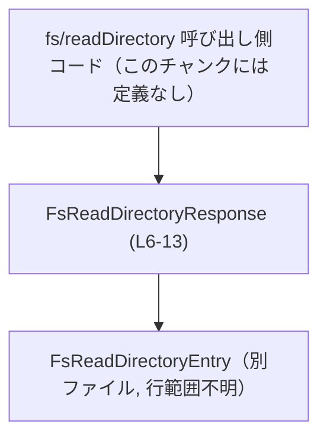
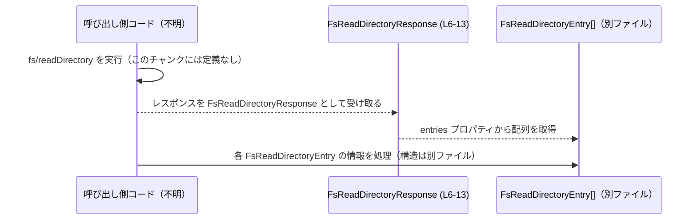

# app-server-protocol/schema/typescript/v2/FsReadDirectoryResponse.ts

## 0. ざっくり一言

`fs/readDirectory` という操作の戻り値を表す **ディレクトリ一覧レスポンス型** `FsReadDirectoryResponse` を定義する、生成済み TypeScript ファイルです（FsReadDirectoryResponse.ts:L1-L3, L6-L13）。

---

## 1. このモジュールの役割

### 1.1 概要

- このモジュールは、`fs/readDirectory` の結果として返される「ディレクトリ内のエントリ一覧」を TypeScript の型で表現します（FsReadDirectoryResponse.ts:L6-L8）。
- レスポンス全体を `FsReadDirectoryResponse` 型としてまとめ、その中の `entries` プロパティで個々のエントリを `FsReadDirectoryEntry` 型の配列として保持します（FsReadDirectoryResponse.ts:L9-L13）。
- ファイル先頭のコメントから、Rust 側の型から `ts-rs` により自動生成されるコードであり、手動編集しないことが前提となっています（FsReadDirectoryResponse.ts:L1-L3）。

### 1.2 アーキテクチャ内での位置づけ

- この型は、同じディレクトリにある `FsReadDirectoryEntry` 型（`./FsReadDirectoryEntry`）に依存しています（FsReadDirectoryResponse.ts:L4, L13）。
- コメントから、`fs/readDirectory` という（おそらく）プロトコル上のコマンドのレスポンスを表していることが分かりますが、そのコマンド自体や呼び出し元の関数・モジュールはこのチャンクには現れません（FsReadDirectoryResponse.ts:L6-L8）。

依存関係のイメージは次の通りです。



### 1.3 設計上のポイント

- **生成コード**  
  - 「GENERATED CODE! DO NOT MODIFY BY HAND!」と明示されており、Rust 側の定義から `ts-rs` によって生成されるファイルです（FsReadDirectoryResponse.ts:L1-L3）。
- **純粋なデータ定義**  
  - 関数やクラスは一切なく、`export type` によるオブジェクト型のエイリアス定義のみです（FsReadDirectoryResponse.ts:L9-L13）。
- **依存型の分離**  
  - 個々のエントリの構造は別ファイル `FsReadDirectoryEntry` 型に委ねられており、このモジュールは「リスト全体」を表す役割に限定されています（FsReadDirectoryResponse.ts:L4, L13）。
- **エラーハンドリング・状態管理なし**  
  - エラー状態やメタ情報（ページングなど）を表すフィールドは含まれておらず、`entries` 配列のみを持つ構造になっています（FsReadDirectoryResponse.ts:L9-L13）。  
  - エラーや成功／失敗の区別は、プロトコルの別の部分で扱われていると考えられますが、このチャンクには現れません。

---

## 2. 主要な機能一覧

このモジュールの「機能」は、型定義のみです。

- `FsReadDirectoryResponse`: `fs/readDirectory` のレスポンス全体を表す型。`entries` プロパティにディレクトリ直下のエントリ一覧を保持します（FsReadDirectoryResponse.ts:L6-L13）。

---

## 3. 公開 API と詳細解説

### 3.1 型一覧（構造体・列挙体など）

このファイル内の公開型と、その周辺で使われる型の一覧です。

| 名前 | 種別 | 定義位置 | 役割 / 用途 |
|------|------|----------|-------------|
| `FsReadDirectoryResponse` | 型エイリアス（オブジェクト型） | FsReadDirectoryResponse.ts:L6-L13 | `fs/readDirectory` 操作のレスポンス全体を表す。`entries` 配列にディレクトリ直下のエントリ一覧を持つ。 |
| `entries` | プロパティ（`FsReadDirectoryResponse` のフィールド） | FsReadDirectoryResponse.ts:L10-L13 | 要求されたディレクトリの「direct child entries」を `FsReadDirectoryEntry` 型の配列で保持する。 |
| `FsReadDirectoryEntry` | 依存型（別ファイル） | FsReadDirectoryResponse.ts:L4 | 各ファイル／サブディレクトリなどの 1 件分のエントリを表す型。実体は `./FsReadDirectoryEntry` に定義され、このチャンクには現れません。 |

### 3.2 関数詳細（代わりに主要な型の詳細）

このファイルには関数定義が存在しないため（FsReadDirectoryResponse.ts:全行）、代わりに公開 API である `FsReadDirectoryResponse` 型について、関数テンプレートに準じた形式で詳細を記述します。

#### `FsReadDirectoryResponse`

**概要**

- `fs/readDirectory` のレスポンスとして、「要求されたディレクトリ直下のエントリ一覧」を表すオブジェクト型です（FsReadDirectoryResponse.ts:L6-L8）。
- フィールドは `entries` の 1 つのみで、`Array<FsReadDirectoryEntry>` 型の配列になっています（FsReadDirectoryResponse.ts:L9-L13）。

**フィールド**

| フィールド名 | 型 | 定義位置 | 説明 |
|--------------|----|----------|------|
| `entries` | `Array<FsReadDirectoryEntry>` | FsReadDirectoryResponse.ts:L10-L13 | コメントに「Direct child entries in the requested directory.」とあり、要求されたディレクトリの直下にあるエントリを列挙する配列として定義されています。 |

**内部構造の流れ（データ構造）**

`FsReadDirectoryResponse` インスタンスは、概念的に次のような形を取ります。

1. オブジェクト 1 つでレスポンス全体を表す（FsReadDirectoryResponse.ts:L9）。
2. その中の `entries` プロパティに、0 件以上の `FsReadDirectoryEntry` を要素とする配列を保持する（FsReadDirectoryResponse.ts:L10-L13）。
3. 各要素でファイル名・種別などの詳細を表現しますが、その構造は `FsReadDirectoryEntry` 側のコードを見ないと分かりません（このチャンクには現れません）。

**Examples（使用例）**

1. **レスポンスを受け取ってエントリを列挙する例**

```typescript
// FsReadDirectoryResponse 型をインポートする（同ディレクトリ想定）
import type { FsReadDirectoryResponse } from "./FsReadDirectoryResponse"; // 型インポート

// fs/readDirectory のレスポンスを処理する関数
function handleReadDirectoryResponse(resp: FsReadDirectoryResponse) { // resp は FsReadDirectoryResponse 型
    // entries は Array<FsReadDirectoryEntry> として型付けされる
    for (const entry of resp.entries) {                               // 各要素 entry の型は FsReadDirectoryEntry と推論される
        console.log(entry);                                           // ここでは構造詳細は不明だが、型安全に扱える
    }
}
```

1. **サンプルデータを手動で構築する例**

```typescript
import type { FsReadDirectoryResponse } from "./FsReadDirectoryResponse";   // レスポンス型
import type { FsReadDirectoryEntry } from "./FsReadDirectoryEntry";         // エントリ型（別ファイル）

// FsReadDirectoryEntry 型の値を仮に用意する（実際のフィールドは別ファイルの定義を参照）
const sampleEntry: FsReadDirectoryEntry = {} as FsReadDirectoryEntry;       // as による型アサーション（サンプル用）

// 明示的に型注釈を付けてレスポンスを構築
const response: FsReadDirectoryResponse = {                                 // response の型は FsReadDirectoryResponse
    entries: [sampleEntry],                                                 // entries は FsReadDirectoryEntry[] と推論される
};

// 型推論の例: 配列から 1 件取り出すと FsReadDirectoryEntry 型になる
const first = response.entries[0];                                          // first の型は FsReadDirectoryEntry と推論される
```

**Errors / Panics**

- この型自体は純粋な型定義であり、関数やメソッドを持たないため、**型の利用だけでエラーや例外が発生することはありません**（FsReadDirectoryResponse.ts:L9-L13）。
- TypeScript の型はコンパイル時チェックのみであり、実行時に外部から受け取ったデータがこの形に一致するかどうかは別途バリデーションが必要です。  
  そのバリデーション処理は、このチャンクには現れません。

**Edge cases（エッジケース）**

- `entries` 配列の長さ  
  - 型としては `Array<FsReadDirectoryEntry>` であるため、**空配列も含めて任意の長さ**が許容されます（FsReadDirectoryResponse.ts:L13）。
  - 「ディレクトリが空の場合に空配列を返す」といった挙動は、コメントからは想定できますが、コード上で明示されているわけではありません。
- `entries` プロパティの存在性  
  - 型定義には `?` が付いていないため、`entries` は **必須プロパティ** として扱われます（FsReadDirectoryResponse.ts:L10-L13）。
  - つまり `FsReadDirectoryResponse` 型の値を構築するときに `entries` を省略すると、TypeScript のコンパイルエラーになります。
- プロパティの型  
  - `entries` は `null` や `undefined` ではなく「配列型」である必要があります。`null` や `undefined` を代入するとコンパイルエラーになります。

**使用上の注意点**

- **生成コードを直接変更しない**  
  - ファイル先頭に「GENERATED CODE! DO NOT MODIFY BY HAND!」とある通り、このファイルを直接編集すると、次回の生成で上書きされます（FsReadDirectoryResponse.ts:L1-L3）。  
    変更が必要な場合は、元となる Rust 側の型定義や `ts-rs` の設定を修正する必要があります（具体的な場所はこのチャンクには現れません）。
- **ミューテーション（書き換え）に注意**  
  - `entries` 配列は `ReadonlyArray` ではなく通常の `Array` であり、配列要素の追加・削除が可能です（FsReadDirectoryResponse.ts:L13）。  
    同じオブジェクトを複数箇所で共有している場合、片方で配列を書き換えると他方にも影響します。
- **並行性（非同期処理）との関係**  
  - TypeScript の型はスレッド安全性を保証しませんが、この型は単なるデータ構造であり、並行処理に特有の仕掛けや共有状態は含みません。  
    非同期処理で共有する場合は、必要に応じてコピーを取るなど、アプリケーション側で扱い方を決める必要があります。
- **セキュリティ面**  
  - この型には入力値のサニタイズや検証ロジックは含まれていません。外部から受け取った JSON などをこの型として扱う場合、**信頼できない入力を直接信頼しない**という一般的な注意が必要です。  
    ただし、その具体的な検証方法はこのチャンクには現れません。

### 3.3 その他の関数

| 関数名 | 役割（1 行） |
|--------|--------------|
| （なし） | このファイルには関数定義が存在しません（FsReadDirectoryResponse.ts:全行）。 |

---

## 4. データフロー

ここでは、「`fs/readDirectory` を呼び出してレスポンスを受け取り、`entries` を利用する」想定のデータフローを示します。  
なお、`fs/readDirectory` 関数や通信処理自体はこのチャンクには存在せず、あくまで想定される利用イメージです。



要点:

- 呼び出し側コードは、何らかの手段で `fs/readDirectory` を呼び出し、その結果を `FsReadDirectoryResponse` 型として扱います（`fs/readDirectory` 自体はこのチャンクには現れません）。
- `FsReadDirectoryResponse` から `entries` 配列を取り出すことで、1 件ごとの `FsReadDirectoryEntry` にアクセスします（FsReadDirectoryResponse.ts:L10-L13）。
- 各エントリの中身（名前、種別など）は `FsReadDirectoryEntry` に依存しており、このチャンクだけでは詳細は分かりません。

---

## 5. 使い方（How to Use）

### 5.1 基本的な使用方法

基本的な利用パターンは「関数の戻り値やイベントのペイロードとして `FsReadDirectoryResponse` 型を使う」形です。

```typescript
// 型のインポート
import type { FsReadDirectoryResponse } from "./FsReadDirectoryResponse"; // このファイルの型

// fs/readDirectory をラップした関数の戻り値例
async function readDirectory(path: string): Promise<FsReadDirectoryResponse> { // 戻り値の型を明示
    // 実際の実装（サーバとの通信など）はこのチャンクには存在しない
    const json = await fetchSomehow(path);                                    // 何らかの手段で取得（仮）
    return json as FsReadDirectoryResponse;                                   // 受け取った JSON を型アサーション
}

// 呼び出し側
async function main() {
    const resp = await readDirectory("/tmp");                                 // resp の型は FsReadDirectoryResponse と推論される
    for (const entry of resp.entries) {                                       // entry は FsReadDirectoryEntry と推論される
        console.log(entry);
    }
}
```

ここでは、TypeScript の型注釈により、`entries` が必ず存在し、要素が `FsReadDirectoryEntry` 型であることがコンパイル時に保証されます。

### 5.2 よくある使用パターン

1. **戻り値として使う**

```typescript
import type { FsReadDirectoryResponse } from "./FsReadDirectoryResponse";

// ディレクトリ内容を取得する API 関数の戻り値型として利用
function getDirectoryContents(): FsReadDirectoryResponse {          // 同期関数の例
    // 実装は省略（このチャンクには存在しない）
    return { entries: [] } as FsReadDirectoryResponse;              // 型アサーションで仮データを返す
}
```

1. **イベントのペイロードとして使う**

```typescript
import type { FsReadDirectoryResponse } from "./FsReadDirectoryResponse";

type DirectoryEventHandler = (resp: FsReadDirectoryResponse) => void;  // イベントハンドラのシグネチャ

function onDirectoryListed(handler: DirectoryEventHandler) {
    // イベント登録処理（このチャンクには存在しない）
}
```

### 5.3 よくある間違い

1. **`entries` を省略してオブジェクトを構築する**

```typescript
import type { FsReadDirectoryResponse } from "./FsReadDirectoryResponse";

// 間違い例: entries を定義していないためコンパイルエラー
// const resp: FsReadDirectoryResponse = {};               // エラー: プロパティ 'entries' が存在しない

// 正しい例: entries を必ず指定する
const respOk: FsReadDirectoryResponse = {                 // respOk は FsReadDirectoryResponse 型
    entries: [],                                          // 空配列も有効な値
};
```

1. **`entries` に `null` や不正な型を入れる**

```typescript
import type { FsReadDirectoryResponse } from "./FsReadDirectoryResponse";

// 間違い例: entries に null を代入しようとしている
// const respBad: FsReadDirectoryResponse = {
//     entries: null,                                     // エラー: null は Array<FsReadDirectoryEntry> ではない
// };

// 正しい例: 配列を入れる
const respGood: FsReadDirectoryResponse = {
    entries: [],                                         // 型に合致した空配列
};
```

### 5.4 使用上の注意点（まとめ）

- **必須フィールド `entries` を常に設定すること**  
  - 型定義上 `entries` は必須であり、省略するとコンパイルエラーになります（FsReadDirectoryResponse.ts:L10-L13）。
- **配列のサイズや内容は制約されていない**  
  - 型としては任意の長さ・内容の `FsReadDirectoryEntry` 配列が許容されます。  
    空配列や重複エントリ等をどう扱うかは、利用側ロジック次第です。
- **生成ファイルゆえの変更リスク**  
  - 直接編集すると、`ts-rs` による再生成で上書きされるため、変更は必ず元のスキーマ（Rust 側）または生成設定側で行う必要があります（FsReadDirectoryResponse.ts:L1-L3）。
- **型安全性と実行時安全性の違い**  
  - TypeScript の型はコンパイル時にのみ効力があり、外部からのデータが必ずしもこの型に従うとは限りません。  
    信頼できない入力に対しては、ランタイムでの検証・サニタイズ処理が別途必要です（このチャンクにはその処理は現れません）。
- **ミューテーションと並行性**  
  - `entries` は可変配列であるため、複数箇所から同じオブジェクトを共有しながら書き換えると、予期しない影響を及ぼす可能性があります。  
    並行（非同期）処理で共有する場合は、コピーしてから変更するなどの扱いが安全です。

---

## 6. 変更の仕方（How to Modify）

### 6.1 新しい機能を追加する場合

このファイルは `ts-rs` により **自動生成** されているため、直接編集しても再生成で上書きされます（FsReadDirectoryResponse.ts:L1-L3）。  
新しいフィールドや機能を追加したい場合の一般的な流れは次の通りです。

1. **元のスキーマ（Rust 側の型定義）を変更する**  
   - `FsReadDirectoryResponse` に対応する Rust の構造体・型定義に、新しいフィールドを追加します。  
   - 具体的な定義場所や型名はこのチャンクには現れません。
2. **`ts-rs` による再生成を実行する**  
   - プロジェクトのビルドまたは専用スクリプトにより、TypeScript の型ファイルを再生成します。  
   - これにより、本ファイルに新しいフィールドが反映されます。
3. **TypeScript 側の利用コードを更新する**  
   - 新しいフィールドを利用するコードを追加し、既存コードがコンパイルエラーになっていないか確認します。

### 6.2 既存の機能を変更する場合

既存フィールド（`entries`）の意味や型を変更する場合も、基本的には上記と同じく「元のスキーマを変更 → 再生成」という流れになります。

変更の際の注意点:

- **契約（contract）の維持**  
  - コメントには「Direct child entries in the requested directory.」と記述されており、利用側は「直下のエントリのみが列挙される」という前提で実装している可能性があります（FsReadDirectoryResponse.ts:L10-L12）。  
    もし意味を変えて（再帰的に全サブディレクトリを含める等）しまうと、既存コードの期待を壊すため注意が必要です。
- **テスト・依存箇所の確認**  
  - `FsReadDirectoryResponse` を利用している全ての関数・モジュールが、変更後の構造に対応できているか確認する必要がありますが、その利用箇所やテストコードはこのチャンクには現れません。
- **シリアライズ／デシリアライズの整合性**  
  - プロトコル越しに JSON などでやり取りする場合、送受信の双方で同じ構造を期待している必要があります。  
    型の変更に合わせて通信フォーマットのバージョニング等が必要な場合がありますが、詳細はこのチャンクからは分かりません。

---

## 7. 関連ファイル

このモジュールと密接に関係しそうなファイル・外部コンポーネントは次の通りです。

| パス / 名称 | 役割 / 関係 |
|-------------|------------|
| `app-server-protocol/schema/typescript/v2/FsReadDirectoryEntry.ts`（推定） | このファイルから `import type { FsReadDirectoryEntry } from "./FsReadDirectoryEntry";` として参照される依存型の定義ファイルです（FsReadDirectoryResponse.ts:L4）。ディレクトリエントリ 1 件分の構造を定義していると推測されますが、このチャンクには内容が現れません。 |
| Rust 側の `FsReadDirectoryResponse` 相当の型（ファイル名不明） | `ts-rs` による生成元となる Rust の型定義です（FsReadDirectoryResponse.ts:L3）。この定義を変更することで、本 TypeScript ファイルの内容が変わりますが、具体的な場所はこのチャンクには現れません。 |
| `fs/readDirectory` を実装するサーバ／クライアントコード（不明） | コメントに登場する `fs/readDirectory` 操作の実装・呼び出し側コードです（FsReadDirectoryResponse.ts:L6-L8）。このレスポンス型を実際に利用する主体ですが、位置や実装はこのチャンクからは特定できません。 |

このチャンクにはテストコード（例: `FsReadDirectoryResponse.test.ts` など）は現れず、どのようにテストされているかは不明です。
