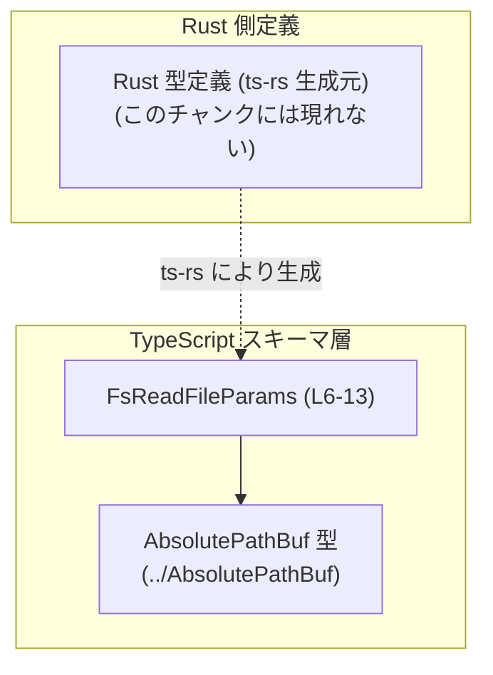

1. ざっくり一言

- `FsReadFileParams` は、ホストのファイルシステムからファイルを読み取る処理に対して、「どのファイルを読むか」を絶対パスで指定するためのパラメータ型を定義する TypeScript ファイルです（FsReadFileParams.ts:L6-8, L9-13）。

---

# app-server-protocol/schema/typescript/v2/FsReadFileParams.ts コード解説

## 1. このモジュールの役割

### 1.1 概要

- このモジュールは、**ホストファイルシステムからファイルを読み取る操作**のためのパラメータを表現する `FsReadFileParams` 型を提供します（FsReadFileParams.ts:L6-8, L9-13）。
- パラメータとしては、読み取り対象の **絶対パス `path`** のみを保持します（FsReadFileParams.ts:L10-13）。
- ファイル全体は `ts-rs` によって Rust 側の型定義から自動生成されるものであり、手動で編集しないことが明記されています（FsReadFileParams.ts:L1-3）。

### 1.2 アーキテクチャ内での位置づけ

このファイルは、「Rust 側のドメイン定義」と「TypeScript 側のコード」を結ぶ **スキーマ定義**層として位置づけられます。

- `FsReadFileParams` は、TypeScript 側から見ると「ファイル読み取り API への引数 DTO（データ転送オブジェクト）」として振る舞います（FsReadFileParams.ts:L6-8, L9-13）。
- `AbsolutePathBuf` 型に依存しており（FsReadFileParams.ts:L4, L10-13）、絶対パスであることを型レベルで表現していますが、その具体的な定義は別ファイルです。
- `import type` による型専用インポートのため、ランタイム依存は発生せず、ビルド時の型チェックにのみ関与します（FsReadFileParams.ts:L4）。

依存関係を簡略化した図を示します。



### 1.3 設計上のポイント

- **自動生成コードであること**  
  - ファイル先頭で「GENERATED CODE! DO NOT MODIFY BY HAND!」「This file was generated by [ts-rs]」と記載されており（FsReadFileParams.ts:L1-3）、直接編集しない前提になっています。
- **純粋な型定義のみ（ロジックなし）**  
  - `export type FsReadFileParams = { ... }` という型エイリアスのみが定義されており、関数やクラスは存在しません（FsReadFileParams.ts:L9-13）。
- **型専用インポートによる安全な依存**  
  - `import type` を用いて `AbsolutePathBuf` を読み込んでおり、型情報だけが利用されます（FsReadFileParams.ts:L4）。  
    これにより循環参照時のランタイム問題を避けつつ、型チェックだけを有効にできます。
- **最小限のパラメータ設計**  
  - フィールドは `path` 一つであり、ファイル読み取りに必要最低限の情報（絶対パス）のみを持たせる設計になっています（FsReadFileParams.ts:L10-13）。

---

## 2. 主要な機能一覧

このファイルは「関数」ではなく「型」のみを提供するため、機能を型レベルの役割として整理します。

- `FsReadFileParams`: ホストファイルシステムからファイルを読み取る操作のための **パラメータオブジェクト型**。`path` フィールドに絶対パスを保持する（FsReadFileParams.ts:L6-8, L9-13）。

---

## 3. 公開 API と詳細解説

### 3.1 型一覧（構造体・列挙体など）

公開されている主要な型と、そのフィールドをまとめます。

| 名前               | 種別                        | フィールド / 説明 | 根拠 |
|--------------------|-----------------------------|--------------------|------|
| `FsReadFileParams` | 型エイリアス（オブジェクト型） | フィールド: `path: AbsolutePathBuf`。コメントによって、ホストファイルシステムからファイルを読み取る際のパラメータであり、読み取り対象の絶対パスを表すことが示されています。 | FsReadFileParams.ts:L6-8, L9-13 |

関連する外部型:

| 名前             | 種別 | 役割 / 用途 | 根拠 |
|------------------|------|-------------|------|
| `AbsolutePathBuf` | 型（詳細不明） | `FsReadFileParams.path` の型として利用される。名前から絶対パスを表すバッファ型である意図が読み取れますが、具体的な定義・バリデーションの有無はこのチャンクには現れません。 | FsReadFileParams.ts:L4, L10-13 |

### 3.2 関数詳細（最大 7 件）

このファイルには **関数・メソッドは一切定義されていません**（FsReadFileParams.ts:L1-13）。  
そのため、関数詳細のテンプレートを適用すべき対象はありません。

### 3.3 その他の関数

- 補助関数やラッパー関数も存在しません（FsReadFileParams.ts:L1-13）。

---

## 4. データフロー

このチャンクには、実際にファイルを読み取る関数や I/O ロジックは含まれていませんが、コメントとして

- 「Read a file from the host filesystem.」（FsReadFileParams.ts:L6-8）
- 「Absolute path to read.」（FsReadFileParams.ts:L10-12）

が記載されているため、`FsReadFileParams` が「ファイル読み取り操作」の入力として利用されることが分かります。

この型が関与する代表的なフローを、**概念レベル**のシーケンス図で示します（呼び出し側や戻り値の実装詳細はこのチャンクには現れません）。


- 読み取り処理 `O` や戻り値の型は、このファイルには定義されていないため、「概念的なコンポーネント」として図示しています。

---

## 5. 使い方（How to Use）

### 5.1 基本的な使用方法

`FsReadFileParams` は単一フィールドのオブジェクト型なので、オブジェクトリテラルで簡単に生成できます。  
ここでは、`FsReadFileParams` を受け取る仮の関数 `readFileFromHost` を前提とした例を示します（この関数自体はこのチャンクには現れません）。

```typescript
import type { FsReadFileParams } from "./FsReadFileParams";   // 本ファイルの型をインポート
import type { AbsolutePathBuf } from "../AbsolutePathBuf";    // 絶対パス型（定義は別ファイル）

// 仮の API: FsReadFileParams を受け取ってファイル内容を返す                   // 実装は別モジュール想定
declare function readFileFromHost(params: FsReadFileParams): Promise<string>;

async function example(absPath: AbsolutePathBuf) {            // AbsolutePathBuf 型を受け取る
    const params: FsReadFileParams = {                        // パラメータオブジェクトを作成
        path: absPath,                                        // 必須フィールド path に絶対パスを設定
    };

    const content = await readFileFromHost(params);           // ファイル読み取りを依頼
    console.log(content);                                     // 読み取った内容を利用
}
```

ポイント:

- `FsReadFileParams` は `{ path: AbsolutePathBuf }` という形のオブジェクト型であり、構築は単純です（FsReadFileParams.ts:L9-13）。
- TypeScript の型チェックにより、`path` に `AbsolutePathBuf` 以外の型を渡そうとするとコンパイルエラーになります。
- `import type` により、ランタイムバンドルへの影響を避けつつ型安全性を確保できます（FsReadFileParams.ts:L4）。

### 5.2 よくある使用パターン

この型は次のような場面で使われることが考えられます（コードから直接分かるのは「ファイル読み取りパラメータ」である点までであり、以下は用途の分類です）。

1. **RPC / IPC の引数 DTO として**
   - 例: JSON-RPC の `fs.readFile` メソッドに渡すパラメータとして `FsReadFileParams` をシリアライズして送信する。
   - プロトコルの詳細はこのチャンクには現れません。

2. **サービス層メソッドのパラメータ**
   - 例: `fileService.read(params: FsReadFileParams)` のように、サービス層のメソッドの引数として利用する。
   - パラメータをオブジェクトにまとめることで、将来的にフィールドが増えたときにも API 変更を抑えやすくなります。

### 5.3 よくある間違い

`FsReadFileParams` 自体は単純ですが、`path` の型扱いで起こり得る誤用例を示します。

```typescript
import type { FsReadFileParams } from "./FsReadFileParams";

// 間違い例: path に任意の string を直接指定してしまう
const wrongParams: FsReadFileParams = {
    // @ts-expect-error: string は AbsolutePathBuf とは互換性がない前提
    path: "/tmp/file.txt",                                    // 型不一致
};

// 正しい例: AbsolutePathBuf 型を生成してから代入する
import type { AbsolutePathBuf } from "../AbsolutePathBuf";

// 説明用の仮の変換関数。実際の定義はこのチャンクには現れない。
declare function toAbsolutePath(path: string): AbsolutePathBuf;

const abs: AbsolutePathBuf = toAbsolutePath("/tmp/file.txt");
const correctParams: FsReadFileParams = {
    path: abs,                                                // 型が一致しており安全
};
```

- `FsReadFileParams` の `path` は `AbsolutePathBuf` 型であり、単なる `string` ではありません（FsReadFileParams.ts:L10-13）。
- `AbsolutePathBuf` の生成方法やバリデーションは、別ファイルで定義されているため、このチャンクからは分かりません。

### 5.4 使用上の注意点（まとめ）

- **自動生成なので直接編集しない**  
  - コメントに「GENERATED CODE! DO NOT MODIFY BY HAND!」とあるため、変更は Rust 側の生成元で行う必要があります（FsReadFileParams.ts:L1-3）。
- **`path` は必須フィールド**  
  - `path` に `?` は付いておらず、オプショナルではないため、`FsReadFileParams` オブジェクトを作成する際には必ず指定する必要があります（FsReadFileParams.ts:L9-13）。
- **型安全性の確保**  
  - `path` が `AbsolutePathBuf` に限定されていることで、「絶対パス以外を誤って渡す」といったバグを型レベルで防止できます（FsReadFileParams.ts:L4, L10-13）。
- **エラー・セキュリティ・並行性は別レイヤーで扱う**  
  - ファイルが存在しない、権限がない、同時アクセスなどのエラー・セキュリティ・並行性の問題は、この型では扱わず、実際のファイル読み取り処理側の責務となります。このチャンクにはそれらのロジックは現れません。

---

## 6. 変更の仕方（How to Modify）

### 6.1 新しい機能を追加する場合

`FsReadFileParams` に新しいパラメータ（例: 文字エンコーディング、最大サイズ、読み取りモードなど）を追加したい場合、**この TypeScript ファイルを直接編集すべきではありません**（FsReadFileParams.ts:L1-3）。

一般的な手順:

1. **生成元（Rust 側の型定義）を変更する**
   - `ts-rs` によってこのファイルが生成されているため、Rust 側の対応する構造体や型にフィールドを追加します。
   - 生成元のパスや型名はコメントからは分からず、このチャンクには現れません（FsReadFileParams.ts:L2-3）。
2. **`ts-rs` 再実行により TypeScript コードを再生成する**
   - プロジェクトのビルドスクリプトやコマンドを用いて再生成します。
3. **TypeScript 側のコンパイルエラーを確認する**
   - フィールド追加により、`FsReadFileParams` を生成している箇所に修正が必要になる可能性があります。

### 6.2 既存の機能を変更する場合

`path` フィールドの型や意味を変更する場合も、同様に **生成元の Rust 側定義を変更**します。

変更時の注意点:

- **型互換性の影響範囲**
  - `FsReadFileParams` を参照している全ての TypeScript コードに影響します。  
    フィールド名変更や型変更は、呼び出し側の修正が必要になる可能性が高いです。
- **プロトコル互換性**
  - この型が RPC/IPC のプロトコルスキーマとして使われている場合、クライアントとサーバーの両方で同時に更新する必要があります。
- **テスト**
  - このチャンクにはテストコードは含まれませんが、生成元の Rust 側や、`FsReadFileParams` を使用する側のテストを合わせて更新することが望まれます。

---

## 7. 関連ファイル

このモジュールと密接に関係するファイル・ディレクトリは次のとおりです。

| パス | 役割 / 関係 |
|------|------------|
| `app-server-protocol/schema/typescript/AbsolutePathBuf.ts`（推定: `../AbsolutePathBuf` の解決先） | `FsReadFileParams.path` の型 `AbsolutePathBuf` の定義を提供するファイル。`import type { AbsolutePathBuf } from "../AbsolutePathBuf";` によって参照されていますが、中身はこのチャンクには現れません（FsReadFileParams.ts:L4）。 |
| Rust 側の生成元ファイル（パス不明） | コメントにより、このファイルは `ts-rs` によって生成されていることが示されています（FsReadFileParams.ts:L2-3）。対応する Rust 構造体や型定義が存在するはずですが、このチャンクからは具体的なパスや名前は分かりません。 |

---

```text
根拠行番号対応メモ
- 自動生成コメント: FsReadFileParams.ts:L1-3
- import type AbsolutePathBuf: FsReadFileParams.ts:L4
- ドキュメントコメント「Read a file from the host filesystem.」: FsReadFileParams.ts:L6-8
- FsReadFileParams 型定義と path フィールド: FsReadFileParams.ts:L9-13
```
