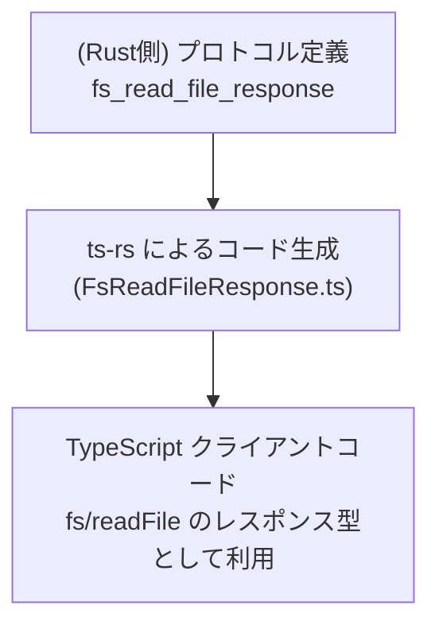
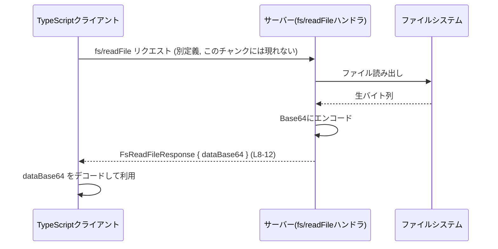

# app-server-protocol/schema/typescript/v2/FsReadFileResponse.ts

## 0. ざっくり一言

`fs/readFile` という操作のレスポンスとして返される、「ファイル内容を Base64 文字列として表現する」ための TypeScript 型定義です（`FsReadFileResponse.ts:L5-8`）。

---

## 1. このモジュールの役割

### 1.1 概要

- このファイルは、`fs/readFile` の戻り値として使われるレスポンス型 `FsReadFileResponse` を定義します（`FsReadFileResponse.ts:L5-8`）。
- ファイルの生バイト列そのものではなく、「Base64 でエンコード済みの文字列」としてファイル内容を表現します（`FsReadFileResponse.ts:L6-7`,`L9-11`）。
- コード生成ツール `ts-rs` によって自動生成されたファイルであり、手動編集は想定されていません（`FsReadFileResponse.ts:L1-3`）。

### 1.2 アーキテクチャ内での位置づけ

コメントから、Rust 側の定義（`ts-rs` 由来）を TypeScript に落とした「プロトコルスキーマ」の一部であると分かります（`FsReadFileResponse.ts:L2-3`）。

想定される位置づけ（このチャンクから分かる範囲での抽象図）は次のとおりです。



- Rust 側の型定義から `ts-rs` が TypeScript 型を自動生成する（`FsReadFileResponse.ts:L2-3`）。
- 生成された `FsReadFileResponse` 型を、TypeScript クライアント側が `fs/readFile` レスポンスの型として利用する想定です（`FsReadFileResponse.ts:L5-8`）。

### 1.3 設計上のポイント

- **自動生成コード**  
  - 冒頭コメントにより手動編集禁止が明示されています（`FsReadFileResponse.ts:L1-3`）。
- **シンプルなデータコンテナ**  
  - 単一フィールド `dataBase64: string` のみを持つ、状態やロジックを持たない「データ構造のみ」の型です（`FsReadFileResponse.ts:L8-12`）。
- **型安全性（TypeScript レベル）**  
  - TypeScript のオブジェクト型として宣言されており、`dataBase64` が必須の `string` であることがコンパイル時にチェックされます（`FsReadFileResponse.ts:L8-12`）。
  - Base64 かどうかの検証はこの型には含まれておらず、あくまで「Base64 文字列であるべき」という意味をコメントが伝えています（`FsReadFileResponse.ts:L6-7`,`L9-11`）。

---

## 2. 主要な機能一覧

このファイルは関数やクラスではなく、**型定義のみ** を提供します。

- `FsReadFileResponse`: `fs/readFile` のレスポンスを表すオブジェクト型。Base64 文字列でエンコードされたファイル内容を格納する（`FsReadFileResponse.ts:L5-12`）。

---

## 3. 公開 API と詳細解説

### 3.1 型一覧（構造体・列挙体など）

このチャンクに現れる型（コンポーネント）のインベントリーです。

| 名前 | 種別 | フィールド | 役割 / 用途 | 定義位置 |
|------|------|-----------|-------------|----------|
| `FsReadFileResponse` | 型エイリアス（オブジェクト型） | `dataBase64: string` | `fs/readFile` 操作から返される、Base64 エンコード済みファイル内容を保持するコンテナ型 | `FsReadFileResponse.ts:L5-12` |

フィールド詳細:

| 型名 | フィールド名 | 型 | 必須/任意 | 説明 | 定義位置 |
|------|--------------|----|-----------|------|----------|
| `FsReadFileResponse` | `dataBase64` | `string` | 必須 | ファイル内容を Base64 文字列として格納するフィールドです（コメントでその旨が明記されています） | `FsReadFileResponse.ts:L8-12` |

#### TypeScript 的な意味

- `export type FsReadFileResponse = { ... }` は「このオブジェクト構造に `FsReadFileResponse` という名前を付けて外部へ公開する」という意味です（`FsReadFileResponse.ts:L8-12`）。
- この型を利用するコードでは、`dataBase64` プロパティを持つオブジェクトとして扱われ、プロパティが欠けていたり `string` 以外の型が入っているとコンパイルエラーになります。

### 3.2 関数詳細（最大 7 件）

このファイルには関数・メソッド・クラスは定義されていません（`FsReadFileResponse.ts:L1-12`）。  
したがって、関数詳細テンプレートの対象となる API はありません。

### 3.3 その他の関数

- なし（このチャンクには関数やメソッドが現れません）。

---

## 4. データフロー

この型が関わる典型的なデータフロー（推測ではなく、コメントで言及されている `fs/readFile` を前提とした抽象的な流れ）を示します。

- サーバー側の `fs/readFile` 操作がファイルを読み込み、その内容を Base64 文字列に変換して `FsReadFileResponse` 型のオブジェクトとして返却する、という利用方法がコメントから読み取れます（`FsReadFileResponse.ts:L6-7`）。
- クライアント側は `FsReadFileResponse` を受け取り、`dataBase64` を Base64 デコードして元のバイト列や文字列として利用することが想定されます。



※ `fs/readFile` の具体的なリクエスト型やエンドポイント名などは、このチャンクには現れません。

---

## 5. 使い方（How to Use）

### 5.1 基本的な使用方法

`FsReadFileResponse` は、外部との通信層（RPC/HTTP など）から受け取ったレスポンスの型として利用されることが想定されます。

以下は典型的な利用イメージです（**関数名や実装は例示であり、このリポジトリに存在するとは限りません**）。

```typescript
// FsReadFileResponse 型をインポートする例
import type { FsReadFileResponse } from "./v2/FsReadFileResponse"; // パスは例示

// fs/readFile に相当するクライアント関数の戻り値として使う例
async function fsReadFile(path: string): Promise<FsReadFileResponse> {
    // 実際には HTTP や RPC でサーバーに問い合わせる想定
    const response = await fetch("/fs/readFile", {
        method: "POST",
        body: JSON.stringify({ path }),
    });

    // サーバーから返ってくる JSON が FsReadFileResponse と互換であることを期待
    const data = (await response.json()) as FsReadFileResponse;
    return data;
}

// 取得した Base64 文字列をデコードして文字列として扱う例
async function main() {
    const res = await fsReadFile("/path/to/file.txt"); // res.dataBase64: string 型

    // ブラウザ環境で Base64 をデコードして文字列化する例
    const decodedBytes = Uint8Array.from(atob(res.dataBase64), (c) => c.charCodeAt(0));
    const text = new TextDecoder("utf-8").decode(decodedBytes);
    console.log(text);
}
```

この例で、`FsReadFileResponse` 型により `res.dataBase64` が必ず存在し、`string` 型であることがコンパイル時に保証されます（`FsReadFileResponse.ts:L8-12`）。

### 5.2 よくある使用パターン

1. **バイナリファイルの処理**

```typescript
import type { FsReadFileResponse } from "./v2/FsReadFileResponse";

function base64ToUint8Array(base64: string): Uint8Array {
    const binary = atob(base64);                                // Base64 文字列をバイナリ文字列に変換
    const len = binary.length;
    const bytes = new Uint8Array(len);
    for (let i = 0; i < len; i++) {
        bytes[i] = binary.charCodeAt(i);
    }
    return bytes;
}

function handleFileResponse(res: FsReadFileResponse) {
    const bytes = base64ToUint8Array(res.dataBase64);           // res.dataBase64 は string 型
    // bytes を Blob や File に変換してダウンロードさせる、など
}
```

1. **Node.js で `Buffer` に変換する**

```typescript
import type { FsReadFileResponse } from "./v2/FsReadFileResponse";

function toBuffer(res: FsReadFileResponse): Buffer {
    return Buffer.from(res.dataBase64, "base64");               // Base64 文字列を Buffer に変換
}
```

### 5.3 よくある間違い

```typescript
import type { FsReadFileResponse } from "./v2/FsReadFileResponse";

// 間違い例: dataBase64 をそのまま文字列として扱ってしまう
function wrongUsage(res: FsReadFileResponse) {
    console.log(res.dataBase64); // これは「エンコード済みの文字列」であり、元の内容ではない
}

// 正しい例: 必要に応じて Base64 デコードしてから利用する
function correctUsage(res: FsReadFileResponse) {
    const bytes = Buffer.from(res.dataBase64, "base64"); // Node.js の例
    console.log(bytes.toString("utf-8"));                // 元のテキストとして出力
}
```

### 5.4 使用上の注意点（まとめ）

- `dataBase64` は **必ず Base64 文字列である** とは型レベルでは保証されません。  
  検証が必要な場合は、受信側で Base64 検査を行う必要があります（この検査ロジックはこのファイルには含まれません）。
- 大きなファイルを扱う場合、Base64 にすると **33% 程度サイズが増加** するため、メモリ使用量や転送量に注意が必要です。
- このファイルは `ts-rs` による自動生成コードであり（`FsReadFileResponse.ts:L1-3`）、直接編集すると元の Rust 側定義と不整合が生じる可能性があります。変更は元の Rust 定義側で行うのが前提です。

---

## 6. 変更の仕方（How to Modify）

### 6.1 新しい機能を追加する場合

このファイルは「自動生成されており手動で変更しないこと」が明示されています（`FsReadFileResponse.ts:L1-3`）。  
したがって、新しいフィールドを追加する場合などは **元となる定義（Rust 側 / ts-rs 入力）を変更する** 必要があります。

一般的なステップ（このチャンクから分かる範囲での抽象的な手順）は次のとおりです。

1. Rust 側で `fs/readFile` レスポンスタイプに新しいフィールド（例: `mime_type`）を追加する。
2. `ts-rs` のコード生成を再実行する。
3. 生成された `FsReadFileResponse.ts` に、追加したフィールドが反映される。
4. TypeScript クライアント側で `FsReadFileResponse` の新フィールドに対応するコードを追加する。

### 6.2 既存の機能を変更する場合

たとえば「Base64 ではなくバイナリをそのまま送りたい」というような仕様変更を行う場合も、同様に元定義の変更が必要です。

変更時に注意すべき点:

- **互換性**  
  - `dataBase64` の型を `string` から別の型に変えると、既存のクライアントコードがコンパイルエラーになるため、破壊的変更になります（`FsReadFileResponse.ts:L8-12`）。
- **命名・意味の一貫性**  
  - `dataBase64` という名前とコメントは「Base64 である」ことを示しているので、内容の意味が変わる場合はフィールド名とコメントも一致させる必要があります（`FsReadFileResponse.ts:L6-7`,`L9-11`）。
- **テスト**  
  - このファイル自体にはテストは含まれていませんが、`fs/readFile` を利用する上位のコードに対して、追加・変更したフィールドをカバーするテストを増やす必要があります。

---

## 7. 関連ファイル

このチャンクには他ファイルへの具体的な参照は存在しません（`FsReadFileResponse.ts:L1-12`）。  
したがって、厳密な意味で「確実に関連しているファイル」は特定できませんが、アーキテクチャ上、次のようなファイルが存在している可能性があります（あくまで可能性であり、このチャンクからは確認できません）。

| パス（例） | 役割 / 関係 |
|-----------|------------|
| `app-server-protocol/schema/typescript/v2/FsReadFileRequest.ts` | `fs/readFile` のリクエスト側スキーマである可能性がありますが、このチャンクには現れません。 |
| `app-server-protocol/schema/rust/…` | `ts-rs` が参照する元の Rust 定義ファイルがこのあたりに存在する可能性がありますが、このチャンクには現れません。 |
| `app-server-protocol/client/…` | `FsReadFileResponse` を実際に利用するクライアント実装が含まれている可能性がありますが、このチャンクには現れません。 |

---

## 言語固有の安全性 / エラー / 並行性について

- **型安全性 (TypeScript)**  
  - `FsReadFileResponse` 型を使うことで、「レスポンスには `dataBase64` プロパティが必須であり、型は `string` である」という制約がコンパイル時にチェックされます（`FsReadFileResponse.ts:L8-12`）。
- **実行時エラー**  
  - このファイルには実行時ロジックがないため、ここから直接発生する実行時エラーはありません。
  - ただし、利用側で `dataBase64` をデコードする処理が誤った値（Base64 でない文字列）を受け取った場合、デコード処理でエラーや例外が発生しうる点に注意が必要です。
- **並行性**  
  - この型は純粋なデータコンテナであり、内部状態やミューテーションロジックを持ちません。
  - したがって、並行性に関する特別な注意点はありません（複数スレッド / タスクから同じオブジェクトを読み取るだけの用途であれば問題になりにくい構造です）。

---

## Bugs/Security・Contracts/Edge Cases（まとめ）

### 潜在的なバグ・セキュリティ観点

- **入力検証の欠如**  
  - `dataBase64` にどのような文字列が入るかはこの型では制約されず、Base64 でない文字列も格納可能です（型としては `string` であればすべて許容）。  
    検証は呼び出し側の責務になる点に注意が必要です。
- **大容量データ**  
  - 大きなファイルを Base64 文字列として扱うと、メモリ使用量増加・シリアライズ/デシリアライズのコスト増大・ネットワーク帯域の増加などが発生します。  
    これは型定義レベルの問題ではありませんが、`dataBase64` の意味を踏まえた設計上の考慮点になります。

### コントラクト（契約）・エッジケース

この型から読み取れる契約・エッジケースは次の通りです。

- **契約（暗黙的）**
  - `dataBase64` には、「ファイルの生バイトを Base64 エンコードした結果」が格納される想定です（`FsReadFileResponse.ts:L6-7`,`L9-11`）。
- **エッジケース**
  - 空ファイル: Base64 エンコード結果として空文字列 `""` または特定の Base64 表現になる可能性がありますが、このファイルからは具体的な取り扱いは分かりません。
  - 非テキストファイル（バイナリ）: コメントには特に区別はなく、テキストかバイナリかに関わらず「ファイル内容」として同じフィールドで扱う設計になっています（`FsReadFileResponse.ts:L6-7`）。
  - 無効な Base64: 型上は許容されるため、デコード時の例外やエラーの扱いは利用側の実装に依存します。このファイルにはその扱いについての情報はありません。

このファイル単体では、テストやバリデーションの実装は確認できません（`FsReadFileResponse.ts:L1-12`）。
