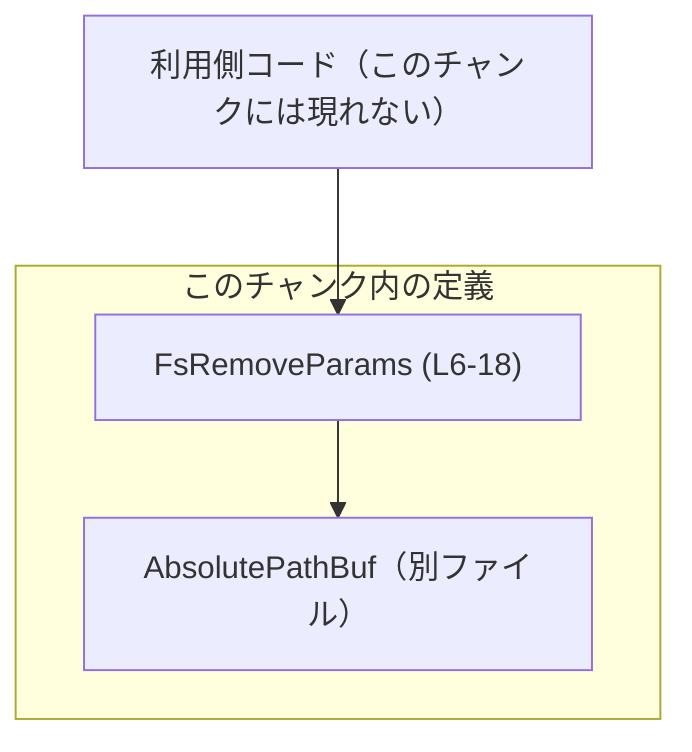
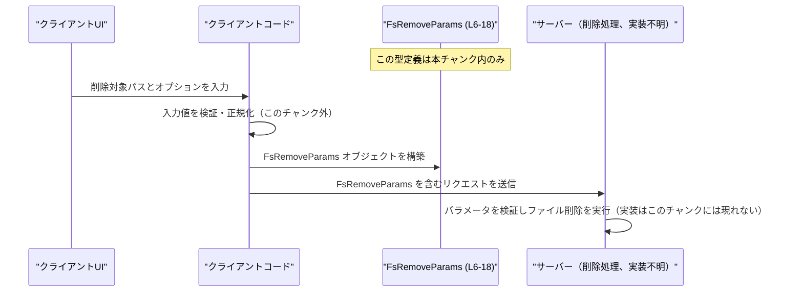

# app-server-protocol/schema/typescript/v2/FsRemoveParams.ts

## 0. ざっくり一言

`FsRemoveParams.ts` は、ホストファイルシステム上のファイルまたはディレクトリツリーを削除するリクエストの **パラメータを表現する TypeScript 型** を定義した、ts-rs により自動生成されたコードです（`FsRemoveParams.ts:L1-3`）。

---

## 1. このモジュールの役割

### 1.1 概要

- このモジュールは、**ファイル／ディレクトリ削除要求を型安全に表現する問題** を解決するために存在し、`FsRemoveParams` 型を通じて以下の情報を表現します（`FsRemoveParams.ts:L6-18`）。
  - 削除対象の絶対パス（`path`）
  - ディレクトリ削除を再帰的に行うかどうか（`recursive`）
  - 存在しないパスを無視するかどうか（`force`）

### 1.2 アーキテクチャ内での位置づけ

- このファイルは `app-server-protocol/schema/typescript/v2` 以下にあり、**アプリケーションサーバーとやりとりするプロトコルの TypeScript スキーマ** の一部と解釈できます（ディレクトリ名からの推測であり、コードだけでは断定できません）。
- 直接の依存は 1 つのみです。
  - `AbsolutePathBuf` 型を `../AbsolutePathBuf` からインポートしています（`FsRemoveParams.ts:L4`）。
- `FsRemoveParams` を **どのモジュールが利用しているか** は、このチャンクには現れません（不明）。

依存関係を簡略化した図は次のとおりです。



### 1.3 設計上のポイント

- **自動生成コード**  
  - 冒頭コメントに「GENERATED CODE! DO NOT MODIFY BY HAND!」と明記されており（`FsRemoveParams.ts:L1-3`）、手動での編集は前提としていません。
  - [ts-rs](https://github.com/Aleph-Alpha/ts-rs) による生成であることがコメントから分かります（`FsRemoveParams.ts:L3`）。
- **型エイリアスによるオブジェクト型定義**  
  - `export type FsRemoveParams = { ... }` の形でオブジェクト型が定義されています（`FsRemoveParams.ts:L9`）。
- **AbsolutePathBuf によるパス表現**  
  - `path: AbsolutePathBuf` により、削除対象パスは「絶対パス専用の型」で表されます（`FsRemoveParams.ts:L13`）。  
    `AbsolutePathBuf` の具体的な定義はこのチャンクにはないため不明ですが、名前から絶対パスを表す型と推測されます。
- **オプショナルかつ null 許容のフラグ**  
  - `recursive?: boolean | null`（`FsRemoveParams.ts:L17`）  
  - `force?: boolean | null`（`FsRemoveParams.ts:L21`）  
    で、プロパティが存在しない（`undefined`）、`null`、`true`、`false` の 4 状態を取り得ます。
  - コメントに「Defaults to `true`.」とあり、**値が省略された場合に true が既定とみなされる意図**が読み取れます（`FsRemoveParams.ts:L15-16, L19-20`）。ただし実際のデフォルト処理はこのファイルには実装されていません。

---

## 2. 主要な機能一覧

このモジュールは型定義のみを提供し、実行ロジックは含みません。提供される主な「機能」は次のオブジェクト型フィールドです。

- `FsRemoveParams`: ファイル／ディレクトリツリー削除リクエストのパラメータを表すオブジェクト型（`FsRemoveParams.ts:L6-18`）
  - パス指定: `path: AbsolutePathBuf` — 削除対象の絶対パス（`FsRemoveParams.ts:L10-13`）
  - 再帰削除の制御: `recursive?: boolean | null` — ディレクトリ削除時に再帰するかどうか（コメント上のデフォルトは `true`。`FsRemoveParams.ts:L14-17`）
  - 存在しないパスの扱い: `force?: boolean | null` — 存在しないパスを無視するかどうか（コメント上のデフォルトは `true`。`FsRemoveParams.ts:L18-19`）

---

## 3. 公開 API と詳細解説

### 3.1 型一覧（構造体・列挙体など）

このファイル内の型・プロパティのインベントリーです。

| 名前 | 種別 | 役割 / 用途 | 定義箇所 |
|------|------|-------------|----------|
| `FsRemoveParams` | 型エイリアス（オブジェクト型） | ホストファイルシステムからファイルまたはディレクトリツリーを削除するリクエストのパラメータを表現する | `FsRemoveParams.ts:L6-18` |
| `path` | プロパティ (`AbsolutePathBuf`) | 削除対象の絶対パス | `FsRemoveParams.ts:L10-13` |
| `recursive` | プロパティ（`boolean \| null`、オプショナル） | ディレクトリ削除時に再帰的に削除するかどうか。コメント上のデフォルトは `true` | `FsRemoveParams.ts:L14-17` |
| `force` | プロパティ（`boolean \| null`、オプショナル） | 存在しないパスを無視するかどうか。コメント上のデフォルトは `true` | `FsRemoveParams.ts:L18-19` |
| `AbsolutePathBuf` | 型（外部定義） | `path` プロパティの型。絶対パスを表す型と推測されるが、このチャンクには定義がない | `FsRemoveParams.ts:L4` |

> 行番号は、提示されたコードからの推定です。

### 3.2 「関数詳細」相当: `FsRemoveParams` 型の詳細

このファイルには関数は定義されていないため、公開 API の中心である `FsRemoveParams` 型について、関数詳細テンプレートに近い形式で説明します。

#### `FsRemoveParams`

**概要**

- ホスト側ファイルシステムからファイルまたはディレクトリツリーを削除するための **リクエストパラメータオブジェクト** です（`FsRemoveParams.ts:L6-8`）。
- 絶対パスと 2 つのブールフラグ（再帰削除、存在しないパスの扱い）をまとめて表現します（`FsRemoveParams.ts:L10-19`）。

**フィールド**

| フィールド名 | 型 | 説明 |
|-------------|----|------|
| `path` | `AbsolutePathBuf` | 削除対象の **絶対パス**（`FsRemoveParams.ts:L10-13`）。相対パスではないことが期待されます（コメントと型名からの推測）。 |
| `recursive` | `boolean \| null`（オプショナル） | ディレクトリ削除の際に再帰的に下位階層まで削除するかを指定するフラグ（`FsRemoveParams.ts:L14-17`）。コメント上のデフォルトは `true` です。 |
| `force` | `boolean \| null`（オプショナル） | 削除対象が存在しない場合にエラーとせず無視するかどうかを指定するフラグ（`FsRemoveParams.ts:L18-19`）。コメント上のデフォルトは `true` です。 |

**戻り値**

- この型はデータ構造であり、関数のような戻り値はありません。

**内部処理の流れ**

- このファイルには **処理ロジックは一切含まれません**。  
  `FsRemoveParams` は純粋な型定義であり、実際のファイル削除処理は別のモジュールで実装される想定です（このチャンクには現れません）。
- 典型的には、利用側コードで次のような流れになると考えられます（型名とコメントに基づく一般的な想定であり、実装は不明です）。
  1. UI や CLI から削除対象パスとオプション（再帰、force）を受け取る。
  2. それらの値を用いて `FsRemoveParams` 型のオブジェクトを生成する。
  3. 生成したオブジェクトをシリアライズし、サーバー側に送信する。
  4. サーバー側でパラメータを検証し、実際のファイルシステム API を呼び出す。

**Examples（使用例）**

> ここで示す関数名（`sendFsRemoveRequest` など）は **このファイルには定義されていない仮の例** です。`FsRemoveParams` 型の使い方を説明する目的のサンプルです。

1. 最もシンプルな例（コメント上のデフォルトを利用）

```typescript
import type { FsRemoveParams } from "./FsRemoveParams";          // 実際のパスはプロジェクト構成に依存する

// 削除リクエストを送信する（仮の）関数
async function sendFsRemoveRequest(params: FsRemoveParams) {     // FsRemoveParams 型のパラメータを受け取る
    // ここで RPC や HTTP 経由でサーバーに送信すると想定（実装はこのファイル外）
}

async function removeTree(path: AbsolutePathBuf) {               // 絶対パスを受け取る（AbsolutePathBuf の定義は別ファイル）
    const params: FsRemoveParams = {                             // FsRemoveParams 型のオブジェクトを作成
        path,                                                    // 必須フィールド: 削除対象の絶対パス
        // recursive と force は省略 → コメント上は true がデフォルトという想定
    };

    await sendFsRemoveRequest(params);                           // サーバー側に削除を依頼する
}
```

1. 再帰せず、存在しないパスはエラーにしたい場合の例

```typescript
const params: FsRemoveParams = {                                 // FsRemoveParams のインスタンスを作成
    path: someAbsolutePath,                                      // 絶対パス（AbsolutePathBuf 型と想定）
    recursive: false,                                            // ディレクトリを再帰的には削除しない
    force: false,                                                // 存在しないパスは無視せず、エラーにすることを意図
};
```

**Errors / Panics（型レベル・実行時の観点）**

- **コンパイル時（TypeScript の型安全性）**
  - `path` に `AbsolutePathBuf` 以外の型を代入した場合、TypeScript の型チェックでエラーになります（IDE 補完や型チェックの恩恵を受けられます）。
  - `recursive` / `force` には `boolean` または `null` 以外（例: `42` や `"yes"`）を代入すると型エラーになります。
- **実行時**
  - TypeScript の型はコンパイル時のみ有効であり、実行時には削除されます。そのため、
    - JSON デコードしたオブジェクトなど、外部から来るデータが **本当に `FsRemoveParams` 形状になっているか** はこの型だけでは保証されません。
    - 実行時バリデーションやサーバー側での検証ロジックが別途必要です（このチャンクには現れません）。

**Edge cases（エッジケース）**

- `recursive` / `force` の 4 状態
  - `undefined`（プロパティ自体が存在しない）
  - `null`
  - `true`
  - `false`
  - コメント上は「Defaults to `true`.」とあり、**`undefined` や `null` の扱いをどう解釈するかはサーバー実装に依存**します。このファイルからは、`null` を特別扱いするかどうかは分かりません。
- `path` が不正な値の場合
  - 文字列内容が実際には絶対パスでない場合や、許可されないディレクトリを指す場合の扱いは、このファイルからは分かりません。  
    通常はサーバー側で検証しエラーにするか、パスを拒否すると考えられますが、実装は不明です。
- 空文字列や非常に長いパス
  - これらが `AbsolutePathBuf` 型として許容されるかどうかは、`AbsolutePathBuf` の定義に依存します（このチャンクには定義がないため不明です）。

**使用上の注意点**

- **オプショナルかつ null 許容のフラグに注意**
  - `recursive?: boolean | null` / `force?: boolean | null` のため、`undefined` と `null` を区別するかどうかを、利用側・サーバ側の実装で明確にしておく必要があります。
  - 「省略＝デフォルトを使う」「`null` もデフォルト扱いにする」といったポリシーは、このファイルからは読み取れません。
- **セキュリティ**
  - この型自体にはセキュリティ制御は含まれません。  
    `path` にユーザー入力をそのまま渡すと、ディレクトリトラバーサルや意図しないファイル削除のリスクがありえます。  
    実際の防御（ルートディレクトリの制限など）はサーバー実装側の責務であり、このチャンクからは確認できません。
- **並行性**
  - JavaScript / TypeScript の通常のオブジェクトと同様に、`FsRemoveParams` 自体は状態を持たない単純なデータキャリアです。
  - 非同期処理間で共有する場合、オブジェクトを変更すると他の処理に影響することがあるため、必要に応じてコピー（スプレッド構文等）を使うと安全です。

### 3.3 その他の関数

- このファイルには関数やメソッドは定義されていません。

---

## 4. データフロー

このチャンクには `FsRemoveParams` を利用するコードは含まれていませんが、型名とコメントから想定される代表的なデータフローは次のようになります（**あくまで想定例** であり、実際の実装は不明です）。

1. クライアント側で、ユーザーが削除対象のパスとオプション（再帰・force）を入力する。
2. クライアントコードが `FsRemoveParams` 型に従ってパラメータオブジェクトを構築する。
3. それをシリアライズしてサーバーに送信する。
4. サーバー側がパラメータを検証し、ファイルシステム API に渡して削除を行う。



---

## 5. 使い方（How to Use）

### 5.1 基本的な使用方法

`FsRemoveParams` 型の典型的な使い方は、「パラメータオブジェクトを組み立てて別モジュールに渡す」という形になります。

```typescript
import type { FsRemoveParams } from "./FsRemoveParams";          // 実際のパスはプロジェクト構成に合わせて調整する
import type { AbsolutePathBuf } from "../AbsolutePathBuf";       // path フィールド用の型

// （仮の）削除リクエスト送信関数
async function sendFsRemoveRequest(params: FsRemoveParams) {     // FsRemoveParams 型の引数を受け取る
    // ここで RPC / HTTP などでサーバーに送信すると想定
}

// ディレクトリツリーをデフォルト設定で削除する例
async function deleteTree(path: AbsolutePathBuf) {               // 絶対パスを受け取る
    const params: FsRemoveParams = {                             // FsRemoveParams 型のオブジェクトを作成
        path,                                                    // 削除対象の絶対パス（必須フィールド）
        // recursive, force は省略 → コメント上は true がデフォルトという想定
    };

    await sendFsRemoveRequest(params);                           // サーバーに削除を依頼
}
```

### 5.2 よくある使用パターン

1. **安全寄りの削除（再帰なし・force なし）**

```typescript
const safeParams: FsRemoveParams = {                             // 安全寄り設定での削除パラメータ
    path: someAbsolutePath,                                      // 対象パス
    recursive: false,                                            // 下位ディレクトリは削除しない
    force: false,                                                // 存在しないパスならエラーにしたい意図
};
```

1. **CLI オプションからの構築例**

```typescript
type CliOptions = {                                              // CLI からパースしたオプションの例
    path: string;                                                // 文字列としてのパス
    recursive?: boolean;                                         // 再帰オプション
    force?: boolean;                                             // force オプション
};

function buildParamsFromCli(opts: CliOptions): FsRemoveParams {  // CLI オプションから FsRemoveParams を組み立てる
    const params: FsRemoveParams = {
        path: opts.path as AbsolutePathBuf,                      // ここでは簡略化のため型アサーションを使用
        recursive: opts.recursive ?? undefined,                  // 指定がなければプロパティ自体を省略
        force: opts.force ?? undefined,                          // 同上
    };
    return params;
}
```

> `opts.path as AbsolutePathBuf` のような型アサーションは、実際にはパスの正当性チェックを伴うべきです。このファイルはその検証ロジックを含みません。

### 5.3 よくある間違い

```typescript
// 間違い例: 相対パスをそのまま渡している
const wrongParams1: FsRemoveParams = {
    path: "./tmp/file.txt" as unknown as AbsolutePathBuf,        // 相対パス → コメントの意図（絶対パス）と矛盾
    recursive: true,
    force: true,
};

// 正しい（意図に沿った）例: 絶対パスに正規化してから渡す
const correctParams1: FsRemoveParams = {
    path: normalizeToAbsolute(userInput) as AbsolutePathBuf,     // 自前で絶対パスに変換する関数の利用を想定
    recursive: true,
    force: true,
};
```

```typescript
// 間違い例: 「false にしたい」つもりで null を設定している
const wrongParams2: FsRemoveParams = {
    path: someAbsolutePath,
    recursive: null,                                             // サーバーが null をどう扱うかは、このファイルからは不明
};

// より明確な例: false を明示
const correctParams2: FsRemoveParams = {
    path: someAbsolutePath,
    recursive: false,                                            // 再帰しないことを明確に指定
};
```

### 5.4 使用上の注意点（まとめ）

- `path` はコメント上「Absolute path」と明記されているため（`FsRemoveParams.ts:L11`）、実際に絶対パスに正規化した値を渡すことが前提と解釈できます。
- `recursive` / `force` が **オプショナルかつ null 許容** である点に注意が必要です。
  - 省略・`null`・`false`・`true` のそれぞれをサーバーがどのように扱うかは、このファイルだけからは分からないため、サーバー側の仕様を確認する必要があります。
- TypeScript の型は実行時には存在しないため、外部入力から構築したオブジェクトが本当に `FsRemoveParams` と整合しているかどうかは、別途バリデーションを行う必要があります。
- 削除操作は破壊的であるため、`FsRemoveParams` を受け取る側ではパス制限・アクセス制御などのセキュリティ対策を行う必要があります（このファイルはその制御を行いません）。

---

## 6. 変更の仕方（How to Modify）

### 6.1 新しい機能を追加する場合

- 冒頭コメントにある通り、このファイルは ts-rs により **自動生成** されており、直接編集することは想定されていません（`FsRemoveParams.ts:L1-3`）。
- 新しいパラメータ（例: `dryRun` フラグなど）を追加する場合は、一般的には次の手順になります。
  1. 元となる **Rust 側の型定義**（おそらく構造体）にフィールドを追加する。  
     - 具体的なファイルパスや型名は、このチャンクには現れません。
  2. ts-rs を再実行して TypeScript スキーマを再生成する。  
     - 再生成手順もこのファイルからは分かりません。
  3. 生成された新しい `FsRemoveParams` 型を利用しているクライアント／サーバーコードを更新する。

### 6.2 既存の機能を変更する場合

- `FsRemoveParams` のフィールド型や意味を変更する場合の注意点:
  - `path` の型を変更する（例えば `string` に戻す）と、`AbsolutePathBuf` に依存している箇所すべてに影響します。
  - `recursive` / `force` から `null` を除外する、オプショナルでなくするなどの変更は、**既存クライアントとの互換性に影響**する可能性があります。
- 変更は自動生成元（Rust 側定義）で行う必要があります。直接この TypeScript ファイルを編集すると、再生成時に上書きされる可能性が高いです。
- 変更後は、`FsRemoveParams` を送受信する API の仕様書やテストを更新し、期待する挙動（デフォルト値の扱いなど）が保たれているか確認する必要があります。

---

## 7. 関連ファイル

このモジュールと密接に関係するファイル・コンポーネントは、コードから次のように読み取れます。

| パス | 役割 / 関係 |
|------|------------|
| `../AbsolutePathBuf` | `path` プロパティの型を提供するモジュール。絶対パスをどのように表現・検証しているかは、このチャンクには現れません（`FsRemoveParams.ts:L4`）。 |
| （Rust 側の元定義ファイル・パス不明） | ts-rs によってこの TypeScript 型が生成される元となる Rust の型定義。具体的なパスや型名は、このチャンクには現れません。 |

テストコードやこの型を実際に利用しているモジュール（RPC クライアント／サーバーなど）は、このチャンクには現れないため不明です。
