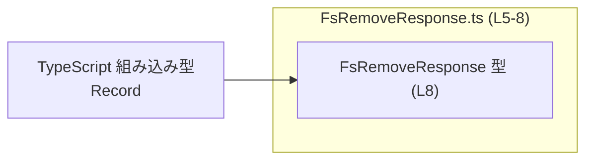
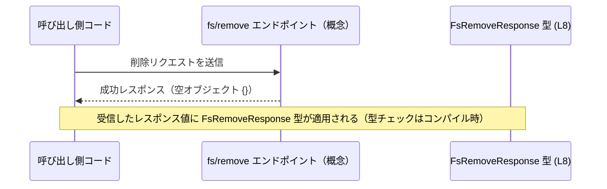

# app-server-protocol/schema/typescript/v2/FsRemoveResponse.ts コード解説

## 0. ざっくり一言

- `fs/remove` 操作が成功したときの **レスポンスが「何も含まない」こと** を表現する、TypeScript の型エイリアス定義です（`FsRemoveResponse.ts:L5-8`）。
- コードは `ts-rs` によって自動生成されることがコメントから分かります（`FsRemoveResponse.ts:L1-3`）。

---

## 1. このモジュールの役割

### 1.1 概要

- このモジュールは、`fs/remove` という操作の **成功レスポンスの型** を提供します（JSDoc の説明より, `FsRemoveResponse.ts:L5-7`）。
- 成功レスポンスは `Record<string, never>` で表現されており、**プロパティを持たないオブジェクト（≒空オブジェクト）だけが許される** 形になっています（`FsRemoveResponse.ts:L8`）。

### 1.2 アーキテクチャ内での位置づけ

- ファイルパス `schema/typescript/v2` から、このファイルが **アプリケーションサーバープロトコルの TypeScript スキーマ定義群の一部** であることが読み取れます（パス名からの解釈）。
- このファイル自体は **他のモジュールを import していません**。依存しているのは TypeScript の組み込みユーティリティ型 `Record` だけです（`FsRemoveResponse.ts:L8`）。

この依存関係を簡略図で表すと次のようになります。



### 1.3 設計上のポイント

- **自動生成コード**  
  - 冒頭コメントに「GENERATED CODE! DO NOT MODIFY BY HAND!」とあり、このファイルは手で編集すべきでないことが明示されています（`FsRemoveResponse.ts:L1-3`）。
- **責務の単一性**  
  - 1 つの公開型エイリアス `FsRemoveResponse` のみを定義し、それ以外のロジックや状態は一切持ちません（`FsRemoveResponse.ts:L8`）。
- **型レベルでの制約**  
  - `Record<string, never>` を使うことで、「キーは string だが値は存在しない（never）」という形になり、**プロパティを追加しようとするとコンパイルエラーになる** 設計です。
- **エラー・並行性**  
  - 実行時の処理や状態を持つコードはなく、**エラーハンドリングや並行性に関するロジックは存在しません**。この型はあくまで **静的型付け（コンパイル時安全性）のための情報** です。

---

## 2. 主要な機能一覧

このファイルが提供する機能は 1 つだけです。

- `FsRemoveResponse` 型定義: `fs/remove` 成功レスポンスが **空オブジェクトであることを表現する** 型エイリアス（`FsRemoveResponse.ts:L5-8`）

---

## 3. 公開 API と詳細解説

### 3.1 型一覧（構造体・列挙体など）

このファイルに現れる型コンポーネントの一覧です。

| 名前               | 種別       | 役割 / 用途                                                                 | 行番号             |
|--------------------|------------|------------------------------------------------------------------------------|--------------------|
| `FsRemoveResponse` | 型エイリアス | `fs/remove` 成功レスポンスを表す。プロパティを持たないオブジェクト型。       | `FsRemoveResponse.ts:L5-8` |
| `Record<string, never>` | 型ユーティリティ利用 | `FsRemoveResponse` のベース。任意の string キーに対し値型が `never` のマップ。 | `FsRemoveResponse.ts:L8`   |

#### `FsRemoveResponse = Record<string, never>`

**概要**

- `FsRemoveResponse` は **成功した `fs/remove` 操作のレスポンス** を表す型です（JSDoc, `FsRemoveResponse.ts:L5-7`）。
- 型の実体は `Record<string, never>` であり、**プロパティを持たないオブジェクトのみ** を許容します（`FsRemoveResponse.ts:L8`）。

**構造**

- `Record<K, V>` は「キーが `K` 型、値が `V` 型のオブジェクト」を表す TypeScript の標準ユーティリティ型です。
- `Record<string, never>` は「キーが string のとき値型が never」になるため、**どのプロパティも実際には代入できない** 型になります。

**意味付け**

- JSDoc に「Successful response for `fs/remove`.」とあるため、この型は「`fs/remove` が成功した場合に返るレスポンスは **中身を持たない**」という契約を表しています（`FsRemoveResponse.ts:L5-7`）。

**Examples（使用例）**

以下は、この型を使って `fs/remove` 呼び出しの戻り値を表現する例です。関数自体は利用例のための仮想のものです。

```typescript
// FsRemoveResponse 型をインポートする（実際のパスはプロジェクト構成に依存）
import type { FsRemoveResponse } from "./FsRemoveResponse"; // 利用例

// fs/remove を呼び出す関数（このファイルには定義されていないため declare を使っている）
declare function callFsRemove(path: string): Promise<FsRemoveResponse>;

async function removeFileExample() {
    const res: FsRemoveResponse = await callFsRemove("/tmp/foo.txt"); // 戻り値の型は FsRemoveResponse

    console.log(res); // 実行時には {} などの空オブジェクトが想定される
}
```

このコード例は、「`fs/remove` 成功時には追加情報を持たないレスポンスだけを期待している」ことを TypeScript の型として表現する使い方です。

**型安全性・エラー・並行性**

- **型安全性**  
  - もしレスポンスにプロパティを追加しようとすると、コンパイル時にエラーになります。

    ```typescript
    const invalid: FsRemoveResponse = { deleted: true };
    // エラー例:
    // Type '{ deleted: boolean; }' is not assignable to type 'Record<string, never>'.
    //   Property 'deleted' is incompatible with index signature.
    //   Type 'boolean' is not assignable to type 'never'.
    ```

- **実行時エラー**  
  - この型定義自体は実行時のコードを含まないため、型定義が原因で直接ランタイムエラーが発生することはありません。
- **並行性**  
  - スレッドや非同期処理を扱うコードは存在せず、並行性に関する安全性・問題点もこのファイルからは読み取れません。

**Edge cases（エッジケース）**

型レベルでのエッジケースを挙げると次のようになります。

- **非空オブジェクトを代入する場合**  
  - `{}` 以外にプロパティを持つオブジェクトを `FsRemoveResponse` に代入するとコンパイルエラーになります（前掲の例のように）。
- **`null` や `undefined` を代入する場合**  
  - `FsRemoveResponse` はオブジェクト型なので `null` や `undefined` は代入できません（TypeScript の通常の型チェック）。
- **空オブジェクトリテラル `{}`**  
  - 厳密な `noImplicitAny` / `exactOptionalPropertyTypes` 設定などのコンパイラオプションによって振る舞いが変わる可能性はありますが、一般的には `{}` は `Record<string, never>` に代入可能と扱われます（コンパイラ設定依存）。

**使用上の注意点**

- このファイルには「Do not edit this file manually」と明記されているため、**直接編集しない** ことが前提です（`FsRemoveResponse.ts:L1-3`）。
- `FsRemoveResponse` は「成功時には特に情報を返さない」という設計に依存するため、**削除対象や結果の詳細情報が必要な場合は別のチャネル（ログや他の API）で扱う必要** があります。
- この型を「削除が本当に成功した保証」と誤解しないことが重要です。実際の成功 / 失敗の判定は、HTTP ステータスやエラー型など、周辺のプロトコル仕様に依存します。このチャンクではそれらは定義されていません。

### 3.2 関数詳細（このファイルには関数なし）

- このファイルには **関数定義やメソッド定義は一切存在しません**（全行確認, `FsRemoveResponse.ts:L1-8`）。
- したがって、関数詳細テンプレートを適用すべき対象はありません。

### 3.3 その他の関数

- 該当なし（補助関数・ラッパー関数も定義されていません）。

---

## 4. データフロー

このファイルには実行コードはありませんが、JSDoc の「Successful response for `fs/remove`.」（`FsRemoveResponse.ts:L5-7`）から、**典型的な利用シナリオ** を次のように読み取れます。

1. クライアントまたは内部コードが `fs/remove` 操作を呼び出す。
2. 操作が成功した場合、レスポンスボディは空オブジェクト `{}` のような形になる。
3. TypeScript コード上では、そのレスポンスを `FsRemoveResponse` 型として扱う。

これをシーケンス図として表現します（関数名等はイメージであり、このチャンクには登場しません）。



**要点**

- `FsRemoveResponse` は **値の流れそのものではなく、その値に対する「期待される形」を表す** 型です。
- 実際の HTTP 通信やファイル削除処理は別のモジュールに実装されているはずですが、このチャンクには登場しないため、詳細は不明です。

---

## 5. 使い方（How to Use）

### 5.1 基本的な使用方法

`FsRemoveResponse` は主に **関数の戻り値型** や **API レスポンス型** として使うことが想定されます。

```typescript
// FsRemoveResponse 型を利用するためのインポート例
import type { FsRemoveResponse } from "./FsRemoveResponse"; // 実際のパスはプロジェクト構成に依存

// fs/remove を呼び出す仮の関数
declare function fsRemove(path: string): Promise<FsRemoveResponse>;

async function main() {
    const response = await fsRemove("/tmp/file.txt"); // 型: FsRemoveResponse

    // レスポンスにはプロパティがない想定なので、中身に依存しない処理だけを書く
    console.log("remove finished");
    console.log(response); // 実行時には {} などの空オブジェクト
}
```

この例のポイント:

- `FsRemoveResponse` によって、「`fs/remove` が成功したら中身のないレスポンスだけが返る」という仕様をコード上に反映できます。
- レスポンスの中身に依存しない処理しか書けないため、**仕様と実装のズレを型で防ぐ** ことができます。

### 5.2 よくある使用パターン

1. **成功・失敗を分けた結果型の一部として使う**

```typescript
import type { FsRemoveResponse } from "./FsRemoveResponse";

type FsRemoveResult =
    | { ok: true; value: FsRemoveResponse }
    | { ok: false; error: unknown };

function handleFsRemoveResult(result: FsRemoveResult) {
    if (result.ok) {
        // 成功時は value の中身を使う必要がない（空型）
        console.log("remove succeeded");
    } else {
        console.error("remove failed", result.error);
    }
}
```

1. **レスポンスを無視するが、型としては明示しておく**

```typescript
import type { FsRemoveResponse } from "./FsRemoveResponse";

async function removeAndIgnore(path: string): Promise<void> {
    const _res: FsRemoveResponse = await fsRemove(path); // 戻り値の型を明示しつつ中身は使わない
}
```

### 5.3 よくある間違い

1. **プロパティを追加しようとしてしまう**

```typescript
import type { FsRemoveResponse } from "./FsRemoveResponse";

const res: FsRemoveResponse = {
    deleted: true, // ❌ エラー: 'boolean' を型 'never' に代入できない
};
```

- `FsRemoveResponse` は `Record<string, never>` なので、**どのキーにも値を持たせられない** 点に注意が必要です。

1. **レスポンスに情報が入っている前提で処理を書く**

```typescript
async function badExample() {
    const res: FsRemoveResponse = await fsRemove("/tmp/file.txt");

    // ❌ res.someInfo は存在しない前提の型になっている
    // console.log(res.someInfo); // コンパイルエラー
}
```

- 成功時レスポンスに情報が欲しい場合は、**プロトコル定義そのものを変更する必要がある** ことを意味します（このファイルを直接変更するのではなく、生成元側を変更する必要があります）。

### 5.4 使用上の注意点（まとめ）

- このファイルは自動生成されるため、**直接編集しないこと** が前提です（`FsRemoveResponse.ts:L1-3`）。
- `FsRemoveResponse` は「何も返さない成功レスポンス」を意味するため、**レスポンスを見て削除対象や結果詳細を判断することはできません**。
- 削除処理の成否は、HTTP ステータスコードや別のエラー型など、周辺仕様に依存します。このファイルにはその情報は含まれていません。
- 実行時のパフォーマンスやスケーラビリティに与える影響はありません（型エイリアスのみで、実行時には存在しないため）。

---

## 6. 変更の仕方（How to Modify）

### 6.1 新しい機能を追加する場合

このファイルは自動生成コードであり、先頭コメントに「DO NOT MODIFY BY HAND」とあるため（`FsRemoveResponse.ts:L1-3`）、**直接編集するのは想定されていません**。

- `fs/remove` 成功レスポンスに新しい情報（例: 削除したファイル数）を追加したい場合には、次のような流れが想定されます（コメントからの推測を含む）:
  1. `ts-rs` が参照する **生成元スキーマ定義（通常は Rust 側の構造体など）** を変更する。
  2. コード生成プロセスを再実行し、TypeScript 側のスキーマ (`FsRemoveResponse.ts` を含む) を再生成する。
- 具体的な生成元ファイル名やコマンドは、このチャンクには現れません。そのため、詳細な手順はこのファイルからは分かりません。

### 6.2 既存の機能を変更する場合

- `FsRemoveResponse` を **空オブジェクトではなく何らかの情報を持つ型に変えたい** 場合も、同様に生成元のスキーマ定義を更新する必要があります。
- 変更時に注意すべき契約（前提条件）:
  - 現状は「成功時は情報を返さない」という契約が暗黙に成立しており、この型に依存する呼び出しコードはその前提で実装されているはずです。
  - レスポンス構造を変更すると、`FsRemoveResponse` を利用している箇所（型注釈・ジェネリクスの型引数など）に影響が出ます。
- このチャンクにはテストコードや利用箇所は現れないため、どこが影響を受けるかは別途プロジェクト全体で検索する必要があります。

---

## 7. 関連ファイル

このチャンクには他ファイルへの import や明示的な参照がないため、**具体的な関連ファイル名・パスは分かりません**（`FsRemoveResponse.ts:L1-8`）。

推測可能な範囲で整理すると、次のような関連コンポーネントが存在する可能性があります（ただし、このチャンクからはパスや名前は特定できません）。

| パス / コンポーネント      | 役割 / 関係 |
|---------------------------|------------|
| （不明）`fs/remove` リクエスト型 | `fs/remove` 操作のリクエスト側スキーマ。`FsRemoveResponse` と対になる形が想定されるが、本チャンクには現れない。 |
| （不明）ts-rs 生成元スキーマ | `FsRemoveResponse` の元になる Rust 側などの定義。コメントに ts-rs の URL があるため、どこかに対応する定義が存在すると考えられるが、詳細は不明。 |

このように、このファイル単体から読み取れるのは **「`fs/remove` 成功レスポンスは空オブジェクトであり、その事実を型として表明している」** という点に限られます。
